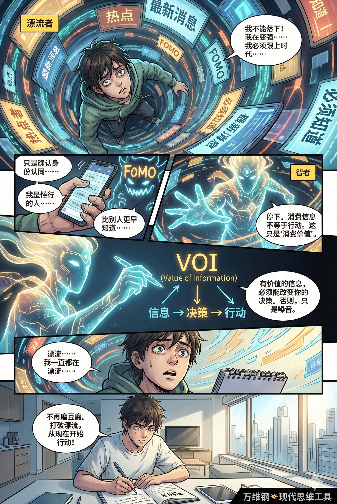
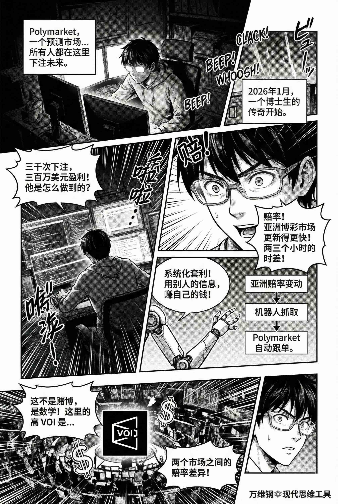
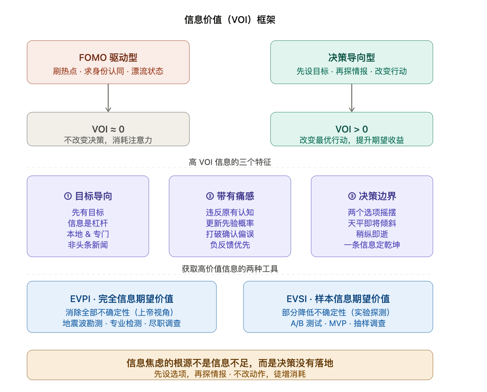

# 信息价值：怎样区分沙子和金子（得到课程讲稿 + AI 加工段）

# 信息价值：怎样区分沙子和金子

[信息价值：怎样区分沙子和金子](https://www.dedao.cn/course/article?id=e1k8gp2WGMzqJ3QDn3K5YmP6DOjxAL)

<cite doc-id="A1utwfL7FiXDTnkWDJscuswVn3c" file-type="wiki" title="FOMO" type="doc"></cite>


你每天花好几个小时刷手机。你关注了所有的行业大V。你在上下班路上还要用降噪耳机以 1.5 倍速播放硬核商业播客。你加入了十几个微信交流群。你每个月花好几百元订阅 AI 服务。因为你想知道下一个风口在哪，你必须率先用上最新的工具，你需要了解政策走向，你得跟上热点……

这种情绪听起来挺积极，但其实那是害怕 —— 英文甚至有个专门的词，叫 FOMO（Fear of Missing Out），也就是“害怕错过”。你怕自己没用过那个最具颠覆性的新模型，你怕听不懂同事嘴里蹦出的新词，你怕被时代抛弃。

可是接收了这么多信息，你难道不应该变得更强大、更从容吗？怎么还成了惶惶不可终日呢？因为那些信息没有价值。

「 信息价值（Value of Information，VOI ） 」是决策科学里的一个专门理论，我希望它能帮你区分沙子和金子。VOI 理论起源于 20 世纪中叶，相当于是统计学和管理科学的一次范式转移。以前学者们都是关注判断信息真假、如何取得信息之类的问题，可是真实的信息不一定对你有用。是 VOI 理论第一次关心信息的价值，而且它对价值的定义非常严格：只有当一条信息能够改变你的实际行动时，它才有价值。就是对决策有用，才有价值。

VOI 是有这条信息时你能做出的最佳选择，比没它时你能做出的最佳选择，平均能多赚多少。


一个经典的学术案例是这样的。想象你是一家石油公司的老板，你面前有一块地，在这儿打一口油井的成本是 1000 万美元。如果地下有油，打好的油井值 5000 万美元，等于净赚 4000 万；如果没油，1000 万美元就算打水漂。地质学家一番分析，说这块地有油的概率是 20%。

现在有一家勘测公司找到你，说他们可以搞一次精确的地震波扫描，告诉你这儿到底有没有油。那么请问，你最多愿意为这份勘测报告付多少钱？VOI 理论要求我们先算一算预期收益。

如果你不看报告现在就选择打井，那就是要么损失 1000 万，要么赚 4000 万，预期收益是 20% × 4000万 - 80% × 1000 万 = 0，所以理性的决策是没必要打。而有了这份报告，如果报告说“有油”，你会决定打井，稳赚 4000 万；如果报告说“没油”，你就不打井，一分钱不亏：既然“有油”的先验概率是 20%，那么报告的期望价值就是 20% × 4000 万 = 800 万美元。

那么 VOI 理论说，把你的收益从 0 提高到 800 万，这就是这份信息的价值。

多想想石油公司这个例子会让你在面对新信息的时候多一分定力。人家的报告值 800 万美元，而你昨天晚上看的那篇《万字长文解析 AI 革命》，也许 VOI 等于 0。

**没有决策对象的信息，其价值接近于零。**

那你说不对啊，不是说要终身学习吗？不是说要为自己赋能吗？不是说“无用之用方为大用”吗？

在 VOI 理论看来， 有价值的信息一定跟你要做的决策 —— 或者是现在，或者是将来 —— 有关才行。**当然你也可以把注意力成本花费在跟决策无关的信息上，但那是消费价值，不是决策价值。**

想想那些让我们整天陷入 FOMO 的热点信息，恐怕大多数都跟决策没有关系。你其实是在寻求一种“我在变强，我在跟上”的自我满足感，或者说是在确认身份认同：我是懂行的人、是站在时代前沿的人、最好还是比别人更早知道的人。

人们常常把消费信息等同于一种行动，但这完全是两回事。能改变行动的才是有价值信息。

陷入信息焦虑绝不是因为缺少信息，而是因为决策没有落地。用咱们前面讲 WOOP 时候的话说，那些整天消费信息而没有用信息做出实质决策的人，其实是处在“漂流（drifting）”的状态，正所谓夜晚千条路白天磨豆腐。要想打破漂流状态，你必须得有一个计划，一个可执行的动作。



价值理论听起来很枯燥，但其实特别刺激，因为它能告诉你什么是好东西。

在 VOI 的视角下，高价值信息往往有三个特点。

**第一，目标导向**

先想做一件事，有一个目标，才谈得上追逐高价值信息。你到底想优化什么？你现在所做事情的瓶颈是什么？好的信息应该是一个杠杆，它能改变你的动作，对你的目标有实际的推动作用。而这样的信息往往是本地的、是专门对你的，而不是热搜新闻。日本首相说了什么跟你没啥关系。你应该关心你们团队的真实产能分布，到底谁在扛事、谁是瓶颈、谁在假忙。

**第二，带有痛感**

我们的大脑都有「确认偏误（Confirmation Bias）」，我们喜欢看那些能印证自己原有观点的信息。但真正有价值的信息，一定是不符合你之前认知模型的信息，它会改变你的先验。这种信息不仅会让你惊讶，而且往往让你不舒服。它可能是负反馈，可能证伪你的观念。

**第三，出现在决策边界上**

只有当你正好在两个选项之间摇摆，选这个还是选那个拿不定主意的时候，来一个关键信息让你的选择立即倾斜，这才是高 VOI。比如说你已经打定主意要买一款新能源车，钱都准备好了，就等周末出手了。今天又看到一份关于电动车的分析报告，你很感兴趣，但其实不会左右你的决定，这就是低 VOI。反过来说，如果你现在手里有两份工作 offer，各有利弊正拿不定主意呢，突然有个朋友给你透露了一个消息：其中一家公司正在酝酿，可能一两年内上市！这个消息对你就是价值千金。对比之下，我们整天 FOMO 的那些信息，**一是人人都能看见，二是主要提供情绪价值，三是跟你的决策基本无关，**所以 VOI 都是很低的。


我说一个实战例子。有一个预测市场叫 Polymarket，你可以在它网站上对各种公共事件下注。2026 年 1 月到 2 月间，有个博士生在上面对各大体育赛事下注了大约三千次，总共获利将近三百万美元。他是怎么做到的呢？

预测市场在比赛之前都会提供赔率，那些赔率经过精心计算，基本上能反映双方球队的真实实力 [3]。这哥们发现，亚洲博彩市场对赔率的更新，会比 Polymarket 提前两三个小时。也就是说在这两三个小时之内，亚洲博彩市场有比 Polymarket 更新、因而也可能是更精准的预测。

这就相当于在你拿不定主意的时候，有人告诉你：专业人士刚刚根据最新情况做的判断，把那个队赢球的概率稍微提高了一点点。

这一点点足以让天平倾斜。当然如果你只做一两次这样的操作，你肯定有输有赢 —— 但只要做的量大，那精准一点点的概率差异，就能让你平均而言稳定地盈利。这哥们用了一个跟单机器人，实时抓取亚洲市场和 Polymarket 的赔率，利用两者的差异在 Polymarket 自动下注，等于是用系统赚钱。



请问这里的高 VOI 是什么？不是赌球市场有这些项目，也不是比赛赔率本身，**而是两个市场之间的赔率差异。没有人会把那个差异专门写出来告诉你。而且它稍纵即逝。**我们可以想见，如果有很多人模仿这哥们的玩法，两个市场的差异就会被拉平，套利空间也就不存在了。


要获取高价值信息，你应该做一个信息狙击手，而不是信息漫游者。你得先想好自己要做什么决定，你现在距离决策边界是近还是远，这条新信息有没有可能对你的决定产生重大影响，然后你还得看看它的成本是多少才行。

VOI 理论并不主张我们取得所有相关的信息。**你不需要不停地调研，该拍板就得拍板：信息有强烈的边际效用递减，调研适可而止也是一种技能。**

但是这里的确有更高级的操作，为了高 VOI 信息有时候你就是得舍得成本才行。那么我们需要了解两个概念： EVPI 和 EVSI。

**EVPI 是「完全信息期望价值（Expected Value of Perfect Information）」，它能彻底消除这件事儿的不确定性，相当于是上帝视角的信息。**前面说的那个用地震波扫描勘测石油的服务，给的就是 EVPI，因为它能明确告诉你这个地方到底有没有油。再比如你想买辆二手车，花钱请个专业师傅彻底检查一遍，也是获取 EVPI。

然而很多时候完全信息是不可得的，这就引出了 **EVSI，也就是「样本信息期望价值（Expected Value of Sample Information）」。EVSI 是你通过做实验、抽样调查或者主动干预的方式获取的“部分信息”。**虽然 EVSI 保留了一定的不确定性，但只要能让你的概率更精确、更新了你的先验，它也很有价值。


研发新药做临床实验，互联网公司搞个 A/B 测试，搞创新先弄一个最小可行产品（MVP）扔到市场上看看反馈，这些都是获取 EVSI 的方法。

这些原则都很简单。咱们再看看日常生活中的高价值信息都有哪些 —— 其实并不多。


**职场普通员工** 往往会高估行业宏观趋势的价值。他们喜欢谈论所谓“风口”，关心行业巨头的融资新闻 —— 其实那都是公司高层才需要操心的事儿，或者干脆就是老板给画的大饼。你最应该关心的是：你们公司这个特定场域的奖励函数是什么？升职提拔看的核心指标是什么？你眼前的工作流程哪一步最卡？有没有优化的余地？


**学生**往往会高估升学和名校的信息，比如“未来十年最热门专业预测”、“清华学霸的日程表”等等。其实你更应该关心你自己的薄弱点在哪里：哪些概念你没搞懂？哪些题型你总丢分？哪些原本应该是你的必拿分？先把成绩搞上去，再考虑针对你的具体情况，看看怎么报志愿。


**有些科研人员**喜欢谈论国家大事和最近震惊世界的科学发现，但那些都没什么用。大部分科研人员更喜欢谈论“江湖八卦”，比如说哪个教授跟哪个教授有矛盾、哪个大牛刚评上了院士云云，其实也帮不了你。你真正应该关心的是：你这个细分领域里的当前热门问题和主流打法是什么？你自己那个实验为什么总做不出来？你那台仪器的底噪是多少？隔壁研究组为啥能申请到一大笔经费？


最有意思的是**公司的老板们** ，他们很喜欢去商学院大谈特谈什么“第二曲线”、“颠覆式创新”之类时髦的概念，有的还专门研究《周易》玄学。但是他们更应该知道的是：你们那个最好的销售，为啥上个月离职了？你们供应链里那个总是拖延两天交货的供应商，内部到底出了什么问题？你需要摸清楚约束、反馈和因果关系。


简单说，各路公开的报道、宏大的叙事、什么宏观大趋势预测，都是被高估的信息，看着极为华丽但实际上都是沙子。而高 VOI 信息往往是比较细碎、不耀眼、甚至听起来有点无聊的东西，绝不会出现在媒体的头条。它可能是一些枯燥的先验概率，一些来自用户的负反馈、两个圈子之间的“结构洞”透露的内部消息、最重要的是你自己的数据。


有的人谈起国际形势头头是道，但是对本单位的政治不屑一顾；有的人天天追踪 AI 革命新闻，但是连最简单的自动化工作流都没实操过；有的人在网上买个几十块钱的小玩意儿都会货比三家、看遍评测，但是对买房、跳槽、甚至结婚这种关乎一生的重大决策却没有做过尽职调查……


有些人如饥似渴地吸收知识只是为了满足自己的好奇心 —— 我非常尊重好奇心 —— 但有些人搜集信息是为了决策。

做个“知道分子”也挺好，但如果你想做点实事儿，你得有 VOI 意识。


**【收束小诗】**

> 先设选项，再探情报。  
> 不改动作，徒增消耗。  
> 何必全知？焦虑作妖。  
> 支点之外，皆为闲草。





---

### **大多数新闻都是噪音**


上网的关键态度是要成为网络的主人，而不做各种超链接的奴隶。高效率的上网应该像自闭症患者一样具有很强的目的性，**以我为主，不被无关信息左右。**就算是纯粹为了娱乐上网也无可厚非，这时候读得快就是优点。

**一个真正的智者不会让上网占用读书时间，他应该经常能够平静地深入思考，只有电话接线员才随叫随到。**

时代周刊的书评栏，给新书评价等级的标记方法很有意思，不是评“好、中、坏”，而是按“值得怎么读”分类，三个等级是随便翻翻（toss）、略读（skim）、精读（read）。

娱乐和社会新闻不提，**就算是正经的新闻，有时候也能让人觉得时间过得不够快**。以2010年Google要退出中国这个事件为例，先是谷歌说因为受不了审查不干了，然后“Google.cn”不审了，然后是“Google.cn”又审了，然后是谷歌不走了，然后是谷歌说还要谈。可以想象，如果将来有人写本书，其中把“Google.cn”的故事当个例子谈，看那本书显然比全程跟踪这些新闻要有效率的多。

世界上的大事并非是按时间均匀分布的，往往十天半月才出一件真值得好好关注的新闻，但是媒体的新闻版却必须每天都有，而且还要填满固定的长度。**所以事实是，大多数新闻都是噪音。**

行业老手都有一定的预测能力。你会发现很多事情并不出乎你的预料。**有些老科学家好几年都用同样的几页PPT。有些书你一看封面就大概知道是什么内容。有些号称明星云集、投入巨资的大片，你连预告片都懒得看。**你会觉得现在这个世界的进步速度太慢了，并没有太多信息能让你兴奋，你有时还感到很无聊。


### 核心洞见

#### **重新定义"有价值的信息"**

作者引入了决策科学里的 VOI（信息价值）框架，把价值的定义极度收窄——**一条信息有价值，当且仅当它能改变你的实际行动。**这个标准乍看很苛刻，但非常有力：它立刻把我们每天大量消费的热点、行业大势、宏观叙事统统打入"沙子"的行列，不是因为它们假，而是因为它们不在你的决策链条上。"知道了但不改变任何动作"的信息，VOI 等于零。

#### **FOMO 的本质是身份消费，不是信息需求**

文章最深刻的一击在这里。我们以为自己在"学习"，其实在寻求"我没落伍"的自我确认——这是消费价值，不是决策价值。把消费信息当成行动的替代品，正是"漂流状态"的核心症结。整天知道风口在哪，但一个可执行的动作都没有，这种状态作者用"夜晚千条路，白天磨豆腐"来概括，极为准确。

#### **高 VOI 信息的反直觉特征**

三个判断标准，都有反直觉的地方：

**一是信息要"本地化、专门化"。**对你最有价值的信息，往往枯燥、细碎、不上头条——你们团队谁在扛事、你的实验为什么做不出来、那个最好的销售为何离职。这类信息不会有人专门告诉你，需要主动挖掘。

**二是好信息要"带痛感"。**真正有价值的信息应该让你不舒服，因为它违反你的已有认知、更新你的先验。我们的大脑天然排斥这类信息（确认偏误），所以越是刺痛你的反馈，越值得认真对待。

**三是信息价值依赖"决策边界"。**同一条信息，对已经下定决心的人 VOI 接近零，对正在两个选项之间摇摆的人则可能价值千金。这说明信息的价值不是绝对的，而是相对于你当下所处的决策状态而言的。

#### **一个隐含但重要的推论**

文章结尾的赌球案例揭示了一个更深的道理：最高价值的信息往往存在于两个系统、两个圈子、两个市场之间的"结构洞"里，稍纵即逝，不会出现在任何公开渠道。这意味着获取高 VOI 信息本身就需要主动设计，而不是被动接收——这与 FOMO 的信息消费模式是彻底相反的姿态。

核心命题：**信息焦虑是决策匮乏的症状，而不是信息匮乏的症状。**


---

### 什么是目标导向的信息收集？

好问题——文章对这个概念点到为止，值得展开说清楚。

#### **核心逻辑：先有决策，再找信息**

目标导向的信息收集，本质上是把"我想知道什么"换成"我要做什么决定，差哪块信息"。顺序完全反过来了。

普通的信息消费路径是这样的：

> 看到有趣的内容 → 觉得有用 → 收藏/记忆 → 某天也许用上

目标导向的路径是：

> 面临一个具体决策 → 识别不确定性在哪里 → 定向获取能消除这个不确定性的信息 → 做出更好的决策

#### **三个操作性问题**

在接触任何新信息之前，可以问自己三个问题：

**① 我现在面临什么具体决策？** 不是"我想了解AI发展趋势"，而是"我要不要在这个月把这个工作流换成AI工具"。前者是话题，后者是决策。没有具体决策，就没有信息收集的锚点。

**② 我的不确定性在哪里？** 决策之所以难，是因为有某些关键变量不确定。把这个不确定性说清楚——是不知道某个工具的实际效果？是不知道团队能不能接受？是不知道成本是多少？找到不确定性，才知道该去找什么信息。

**③ 这条信息能改变我的行动吗？** 如果答案是"不能，我已经决定了"，那这条信息对你的 VOI 就是零，看不看都行。如果答案是"能，我会因此选择A而不是B"，那就值得花时间。

#### **一个日常例子**

假设你在考虑跳槽。

漫游式收集：关注各种职场博主、看行业薪资报告、刷公司点评、了解各种赛道前景……信息量很大，但你始终没有做决定。

目标导向式收集：你把问题具体化——"我要不要接受这家公司的offer"。不确定性在于：这家公司的实际管理风格如何？这个岗位一年后的上升空间是什么？带着这两个具体问题，你去找一个在这家公司待过的人聊一小时，这一小时的价值远超你看的一百篇行业分析。

#### **目标导向的信息往往"不耀眼"**

文章里有一个细节很关键：**高 VOI 信息往往是本地的、专门对你的，绝不会出现在媒体头条。**

原因也很简单——头条内容是为最大公约数的读者生产的，而你的决策是独特的。真正有用的信息可能是：你们老板最看重什么指标、那个岗位历史上卡在哪个环节、这个细分市场里真正在盈利的玩家用的是什么打法。这些都需要主动挖，不会自动出现在你的信息流里。

所以目标导向的信息收集，本质上是一种**主动狩猎**，而不是被动捕网。先想清楚猎物是什么，再设计怎么找到它。


### 核心思想


#### 认知陷阱：你以为在“充电”，其实是在“漂流”

现代人的通病：**错把“信息消费”当成了“有效行动”。**

- 每天刷热点、听播客、追逐AI新模型，本质上是在获取“情绪价值”（如缓解焦虑）和“身份认同”（证明自己没有被时代抛弃）。这些信息看似宏大、前沿，但因为没有指向具体的**决策对象**，其VOI（信息价值）等于0。
- **漂流状态：** 吸收大量无VOI的信息，会导致“夜晚千条路白天磨豆腐”。因为你的认知在不断膨胀，但现实中的物理动作（工作、生活、投资）没有发生任何改变，这种撕裂感就是现代人越学习越惶恐的根源。


#### 价值重估：什么是真正的“金子”？

“金子”标准：**只有能改变实际行动、并带来预期收益提升的信息，才是真信息。** 

要筛出金子，必须经过三个特征的过滤：

1. **向内求（目标导向）：** 宏观大势（如美国大选、AI终极形态）对普通人是沙子；微观局点（如团队产能瓶颈、自身业务转化率）才是金子。**金子往往是局部的、为你量身定制的。**
2. **反人性（带有痛感）：** 人性喜欢“确认偏误”（看自己认同的），但高价值信息必然是打破你原有认知的“负反馈”。**如果一条信息看得很爽，它多半是情绪抚慰；如果一条信息让你惊讶甚至难受（证伪了你的想法），它大概率是高价值的。**
3. **临门一脚（决策边界）：** 这是VOI最精妙的设定。**信息只有出现在你“左右为难、即将拍板”的临界点上，才能发挥最大杠杆率。**马后炮的分析、或者对你已经下定决心的事情的赞美，都是无效信息。


#### 实战策略：从“信息漫游者”进化为“信息狙击手”

借用学术概念（EVPI和EVSI）和赌球套利的例子，给出了一套实操方法论：

- **信息差套利：** 赌球小哥赚的不是“懂球”的钱，而是“时间差与概率微调”的钱。高价值信息往往稍纵即逝且极其微小，它不是长篇大论，而是关键时刻的一个“倾斜筹码”。
- **算好信息的“成本账”：** 

  - **EVPI（完全信息）：** 如全身体检、买车前的专业检测。能彻底消除不确定性，遇到这类信息，该花钱就花钱。
  - **EVSI（样本信息）：** 在现实中上帝视角不可得，我们应该学会主动制造“测试”来获取局部信息。比如A/B测试、MVP（最小可行性产品），用最低的成本去探测市场的真实反馈，这比看一万篇商业分析报告都有用。


#### 角色觉醒：各司其职，专注你的“本地函数”

不同人群在信息获取上的“错位”。人们总是喜欢去操心不该自己操心的宏大叙事，而忽略了身边最朴素的致命约束：

- **员工**别管行业风口，去研究老板的“奖励函数”和业务的“真实卡点”。
- **学生**别管十年后的热门专业，去死磕试卷上“本该拿分却丢分”的盲区。
- **科研人**别管诺贝尔奖八卦，去摸清仪器的底噪和隔壁组拿经费的套路。
- **老板**别管周易和第二曲线，去搞清王牌销售为何离职、供应链为何拖延。


#### 【收束小诗】深度解码（行动指南）

最后这首诗，堪称VOI理论的四句真言：

- **“先设选项，再探情报”：** 决策前置。不要漫无目的地收集信息，先问自己“我面临哪几个选择？”，带着选项去找能帮你排除错误答案的情报。
- **“不改动作，徒增消耗”：** 检验标准。看完一篇文章、听完一个讲座，如果第二天你的工作方式、投资策略、生活习惯没有任何改变，那这就只是大脑的内耗。
- **“何必全知？焦虑作妖”：** 放弃完美主义。信息边际效用是递减的，不需要集齐所有线索才做决定（EVSI就够了），该拍板就拍板，斩断FOMO情绪。
- **“支点之外，皆为闲草”：** 核心聚焦。除了能撬动你当前目标的那个“决策支点（边界）”之外，全网铺天盖地的信息，皆是杂草和沙子。

这篇文章是对“知识焦虑时代”的一记棒喝。它要求我们从**“知道分子”蜕变为“行动主义者”**。在这个信息爆炸的世界里，赢家不是知道得最多的人，而是最懂得用信息去拨动决策天平的人。


### 行动策略


从“知道分子”蜕变为“行动主义者”，本质上是一场**多巴胺获取方式的迁移**：从“消费新知带来的虚假充实感”，转向“改变现实带来的真实成就感”。

结合“信息价值（VOI）”理论，要完成这一跨越，不能仅仅靠打鸡血，而是需要一套极其冷酷的**“输入-截断-输出”**系统。


#### 认知断奶：戒断“虚假的生产力”

“知道分子”最大的幻觉，是把“了解”等同于“做到”。看了一篇深度的商业分析，就觉得自己拥有了商业思维；买了一堆健身课程，就觉得肌肉已经在生长。

- **实施“低信息饮食”**

  - 取关80%不能直接指导你当前手头工作的博主、公众号和社群。
  - 承认一个事实：**“错过99%的热点，你的人生不会有任何改变；但错过对眼下工作的复盘，你必将停滞不前。”**
  - 将“输入”与“输出”的时间比例强制设定为 **2:8**。每天最多花20%的时间刷信息，剩下80%的时间必须面对空白文档、面对客户、面对代码、面对真实的人事物。

#### 锚定“决策原点”：不带问题，绝不找答案

行动主义者从不漫无目的地“逛”知识超市，他们是带着通缉令去“抓捕”信息的。

- **执行“VOI 拷问法则”**

  - 在点开任何一篇长文、买任何一本书、参加任何一个培训前，先问自己三个极其功利的问题：
  
    - **我最近3天内，需要做一个什么决定？**（是选A方案还是B方案？是辞职还是留任？）
    - **这个信息能帮我改变决定吗？**
    - **如果这篇内容我看完了，明天我的物理动作会有什么不同？**
  - 如果答案是“没有不同，只是多了点谈资”，立刻关闭，去干活。

#### 制造“最小可行性动作”

“知道分子”之所以不行动，是因为他们懂得太多，深知事情的复杂性，从而陷入了**“完美主义瘫痪”**。他们总想获取“完全信息（EVPI）”才敢动手。

- **追求“样本信息（EVSI）”，先开枪后瞄准。**

  - **微调法：** 不要计划“我要写一本小说”，而是“我今天要在键盘上敲下100个字”。
  - **2分钟定律：** 凡是能在2分钟内开头的事情，不要做计划，立刻去做。
  - **破草稿思维：** 允许自己产出极度糟糕的“初版”。行动主义者的核心机密是：**粗劣的现实，永远完爆完美的腹稿。**

#### 构建闭环：把“知识”变成“资产”

行动主义者和知道分子的分水岭在于**“是否留下了物理痕迹”**。在脑子里转一圈就走，是知道分子；在现实世界里砸出一个坑，是行动主义者。

- **强制性实物产出**

  - 学到了一个提高工作效率的新AI提示词？**不要收藏，立刻用它处理一份手头的真实文件。**
  - 看懂了一个新的销售话术？**不要做笔记，下午打5个电话对客户测试一下。**
  - 听明白了一个深刻的道理？**不要发朋友圈感慨，去解决一个跟你伴侣/同事悬而未决的矛盾。**
  - **没有在物理世界产生反馈的学习，一律视为娱乐。**

#### 拥抱痛感：把“失败”当作高价值信息

“知道分子”喜欢躲在书本里，因为书本里没有拒绝，没有嘲笑，没有亏损。行动主义者知道，真实世界的反馈往往是刺耳的、带有痛感的，但那才是含金量最高的 VOI。

- **主动“买”负反馈**

  - 当你推行一个新方案被老板骂了、被客户挂了电话、或者自己搞砸了，不要退缩回知识的安全区（“我再去买本书看看怎么做”）。
  - **停下来，提取刚才失败里的数据（局部先验概率）：** 是哪句话让客户不耐烦？是哪个数据让老板皱眉？
  - 把这些带着痛感的“沙砾”，当作你下一次行动的“金子”。


**🔥 最后的终极测试（立刻生效）：**

如果你看完了以上这篇回答，觉得“写得真好，我懂了”，然后顺手点了个**收藏**，准备滑向下一个问题——那么，你依然是一个**“知道分子”**。

如果你现在立刻**关闭手机屏幕**，拿出一张纸，写下你今天一直拖延没做的一件事，并且立刻花**5分钟**去开个头——恭喜你，从这一刻起，你就是一个**“行动主义者”**了。


---

### 认知陷阱：“信息感”正在替代“思考能力”


The more "informed" you feel, the less capable of thinking you become.—— dan koe

不允许任何信息“只经过你”，必须“改变你”或“被你否定”。


#### “informed”的本质：不是知识，而是“知道很多”

今天的信息环境（比如 Twitter、TikTok、Reddit）让人很容易产生一种错觉——你刷了很多内容、看了很多观点，就觉得自己“了解了世界”。但这里的“了解”有几个特点：

- 是碎片化的
- 是别人的结论
- 是未经验证的
- 是情绪强化过的

所以你得到的不是知识，而是一种**“我已经懂了”的感觉**。

---

#### 为什么“越觉得懂，反而越不会思考”

真正的思考，包含几个关键动作：

- 提出问题
- 建立假设
- 推理
- 反驳自己

但当你“感觉已经知道答案”时，这些步骤会直接被跳过。也就是说**“我知道了” → 阻断了“我还需要想”**

**认知关闭**：一旦你接受了一个解释，大脑就停止搜索新的解释。

---

#### 信息的副作用：让你更快“站队”，而不是更深“理解”

大量信息输入，会让人：

- 更快形成观点（甚至是情绪化观点）
- 更倾向于选择一个立场
- 更难承认“我不知道”

你会发现一个现象：

- 信息越多的人，往往越“确定”
- 真正深度思考的人，反而更“不确定”

这不是悖论，而是因为：**思考越深入，你看到的变量越多，世界就越复杂。**

---

#### 这句话真正批评的，是“被动认知模式”

它并不是反对获取信息，而是在批评一种状态：

- 你以为你在学习，实际上你在消费观点
- 你以为你在理解，实际上你在复述别人

这种状态，本质是：**用信息填满自己，从而逃避思考的痛苦**

---

#### 信息正在“占用你的认知带宽”

人的认知资源是有限的。当你持续输入信息时，会发生两件事：

- 大脑疲劳（没有余力做深度推理）
- 工作记忆被占满（无法构建复杂结构）

结果就是：**你变成一个“高输入、低处理”的系统**

当你用“获取信息”替代“加工信息”，你就失去了思考能力。

---

#### 启示（结合你当前状态）

你其实已经在一个更高的层级上了——你不是缺信息，而是已经明显感知到“理解很多，但行动少”。这里的关键转折是：**从「继续获取信息」转向「强制输出与验证」。**

你可以用一个简单但有效的方法切换模式：

**每获取一个观点，必须做一件事：用自己的话重构，或在现实中测试一次，或写出反例。**

否则这条信息，对你来说就是“认知噪音”。

“从信息消费者 → 思考者”的具体训练系统（包括每天怎么练、如何设计反馈闭环）。

核心目标只有一个：把你从“高信息摄入者”，切换成“高认知产出者”。

---

#### 系统核心：强制从 Input → Output → Reality

你现在的问题不是不聪明，而是停在这一层结构：

- 输入（看、读、刷）
- 理解（觉得有道理）

但缺了后两步：

- 输出（重构）
- 现实（验证）

所以系统的最小闭环是：**每一条输入，必须产生一个“外部结果”。**否则这条信息等于没存在过。

---

#### 日常运行框架（每天执行）

**输入限流（不是多，而是少而深）**

每天主动摄入信息控制在：1～3 条“值得思考”的内容（文章 / 观点 / 视频）

关键是**只选“让你产生思考冲动”的，而不是“让你爽”的。**

判断标准：

- 有没有让你“想反驳”
- 有没有让你“不完全同意”
- 有没有触发现实问题

---

**强制输出（核心训练动作）**

每一条输入，必须完成“三步输出”：

**第一步：压缩（去掉幻觉理解）**

用一句话写出：

> 这个观点到底在说什么？

限制：

- 不超过 30 个字
- 不能用原句

---

**第二步：重构（变成你的模型）**

写出：

- 它成立的前提是什么？
- 它在哪些情况下不成立？

这一步非常关键，它决定你有没有“思考”，而不是“记住”。

---

**第三步：对抗（破坏它）**

强制问：

- 如果它是错的，错在哪里？
- 有没有现实中的反例？

这一步会极大提升你的认知深度。

---

#### 现实接触层（这是大多数人完全缺失的）

这是决定你是否真正“会思考”的关键。你必须把一部分观点，拉到现实里测试。方式很简单：

**每天至少做一个“微实验”**

- 看到一个效率方法 → 明天用一次
- 看到一个沟通技巧 → 找人试一次
- 看到一个判断标准 → 用它做一个决策

核心不是成功，而是**让思考接触现实摩擦。**

---

#### 每周升级：从“想法”到“资产”

每天的输出，如果不沉淀，会浪费。你需要一个“认知仓库”：

每周做一次整理：**把一周的观点，抽象成 3～5 条“你的原则”**

例如：

- 不要快速形成观点
- 信息 ≠ 认知
- 先验证，再相信

这一步会让你从“思考者”变成“构建者”。

---

#### 关键约束（最容易失败的地方）

- 不允许“只输入不输出”。哪怕只看了一条内容，也必须写东西。
- 不允许“觉得懂了”。一旦你有这种感觉，立刻做一件事：写出反例。
- 不追求多，追求“卡住”。如果一条内容你能想 30 分钟：这比你刷 100 条更有价值。

---


你有一个很明显的优势：**系统化能力很强，但停在抽象层**

所以你要刻意增加一个动作：

> **把每一个认知，变成“可执行结构”**

你不是写：“要减少信息摄入”，而是写：“每天最多读 3 条，否则不允许继续”

---

如果你持续 2～4 周，会出现几个明显变化：

- 对“观点”的免疫力变强（不容易被带走）
- 开始自动质疑信息
- 更少表达，但更有穿透力
- 开始形成“自己的判断系统”

本质上，你会从：信息消费者 → 观点加工者 → 判断生产者


### **30天可执行计划**

不是理念，而是每天你该做什么、做到什么程度、如何判断有没有在进步。

---

#### 整体结构：30天分三阶段

**第1阶段（第1–10天）：打断“信息上瘾”，建立输出肌肉**

目标：从“只输入”→“被迫输出”

**第2阶段（第11–20天）：提升思考深度**

目标：从“复述观点”→“构建模型”

**第3阶段（第21–30天）：接入现实**

目标：从“纸上思考”→“现实验证”

---

#### 每日固定动作（全程不变）

每天只做四件事，总耗时 30～60 分钟：

**输入（10分钟以内）**

- 只允许 1 条内容

选择标准：

- 让你“不完全认同”
- 或让你“想反驳”

如果只是“觉得有道理” → 不选

---

**输出（核心，20分钟）**

必须写下四段内容（不能跳）：

A. 压缩（≤30字）：这个观点在说什么？

B. 前提：它成立依赖什么条件？

C. 失效条件：在什么情况下它是错的？

D. 反例：现实中有没有不符合它的例子？

---

**微实验（5～15分钟）**

每天必须做一个动作：

- 应用这个观点  
或
- 刻意违背这个观点

重点不是对错，而是：**让认知接触现实**

---

**记录（5分钟）**

写一句话：

- 今天最大的“认知冲突”是什么？

不是总结，而是冲突。

---

#### 三个阶段的升级重点

**阶段一（1–10天）：强制打断“理解幻觉”**

你会很不适，因为：

- 你会发现自己其实说不清
- 很多“懂了”的东西写不出来

这是正常的。

额外约束：

- 每天输出字数 ≥ 150 字
- 不允许复制原话

判断是否有效：

- 你开始频繁卡住
- 写得很慢

说明系统开始起作用了

---

**阶段二（11–20天）：开始“建模”**

在原有四步基础上，加一个动作：

E. 抽象模型（关键）

把这个观点升级为一个结构：

例如：

- “信息越多越不思考” → 模型：输入↑ → 判断提前 → 思考↓
- “拖延是因为恐惧” → 模型：任务不确定性↑ → 情绪阻力↑ → 行动延迟

---

这一阶段的目标：

你不再只是分析观点，而是**开始生产“可复用的认知结构”。**

---

**阶段三（21–30天）：现实验证**

这一阶段，重点不在“想”，而在“测”。

每天的微实验升级为：

- 必须影响一个真实行为

比如：

- 改一个决策方式
- 改一次沟通方式
- 改一个习惯

---

增加一个动作：

每3天写一次：哪个观点在现实中“被打脸”？为什么？

---

#### 每周一次升级

做一个“认知压缩”：把这一周的内容整理成**你的5条原则**

- 不验证的观点一律不采用
- 任何结论都依赖前提
- 情绪强烈的观点优先怀疑

这一步非常关键，它会让你从思考 → 系统

---

#### 成效判断（30天后你会看到什么）

如果你认真执行，会出现几个变化：

1. 输入欲望下降，你不再想一直刷信息。
2. 对“观点”天然不信任，你会自动问：前提是什么？什么时候不成立？
3. 表达变少，但更锋利。你不会随便发表意见，但一说就很有结构
4. 开始形成“个人判断系统”，你不再依赖外部观点做决策。

---


将这篇内容用**信息价值理论（Value of Information Theory, VoI）进行重构与升维，不仅能保留你原文强大的实践框架，还会为它注入严密的数理逻辑与决策科学底色**。


在决策科学与信息论（Shannon & Howard）中，信息的本质不是“文字或数据”，而是\*\*“消除不确定性（Entropy Reduction）并改变行动选择的能力”\*\*。


以下是基于 **信息价值理论（VoI）** 重构优化的终极版本：


---


## 认知陷阱：为什么“高信息摄入”正在制造“低决策能力”？


> **“The more ‘informed’ you feel, the less capable of thinking you become.”** —— Dan Koe
> 
> **底层定理**：在决策科学中，若一条信息**不能改变你的先验概率**，且**不能改变你的最终动作**，则该信息的**价值严格等于零（VoI = 0）**。  
> 
> 消费零价值信息，不是学习，是在用高熵噪音进行自我认知耗竭。


## 基于 VoI 的认知病理学（为什么“懂得多”反而是毒药？）


#### 1. 数据的虚妄：混淆了“数据量”与“负熵”

- **信息论本质**：信息量等于系统不确定性的减少（香农熵下降：$I = \Delta H$）。
- **网络环境的伪信息**：社交媒体推送给你的不是“信息”，而是**被情绪和立场极化封装过的“数据碎屑”**。
- **致命误区**：你摄入了 100 篇观点，大脑的不确定性没有下降，只是原有的偏见被反复确认。你误把**情绪的即时反馈**当成了**熵减（理解）**。

#### 2. 决策无差别陷阱：零价值信息的通胀

决策学中，完全信息价值（EVPI）**含义：信息的价值，取决于它是否促使你做出了一个比“不知道该信息时”期望收益更高的决策。**

- **现实诊断**：你今天刷到的宏观局势、大佬八卦、碎片化方法论，无论你知道与否，**明天的生活决策、行动策略没有任何变化**。
- 这类信息的 $VoI \equiv 0$。但由于你为它支付了高昂的注意力与神经带宽，它的**净价值实际为负（Net VoI < 0）**。

#### 3. 贝叶斯硬化：为什么信息越多，越丧失思考能力？

- **健康的思考**是一个**贝叶斯更新过程**：$\text{先验信念（Prior）} + \text{新证据（Evidence）} \rightarrow \text{更新后验概率（Posterior）}$
- **病态的“informed”状态（贝叶斯硬化）**：

当你频繁消费结论时，大脑为了节约能耗，会迅速把概率推到 $P=1$（极度确信）或 $P=0$（彻底否定）。

**一旦后验概率变成绝对的 1 或 0，新的证据就再也无法使你的信念发生位移。**

思考就此彻底终结——你不再思考，你只在搜集证据来巩固站队。


### 认知处理系统的重构架构（VoI 转化引擎）


不要让信息“穿堂而过”。一条数据要成为资产，必须通过以下转化引擎：


```Plain Text
[ 原始数据 Data ] 
       │
       ▼ （准入门槛：VoI > 注意力成本？）
[ 极简压缩 Compression ] ── 剥离情绪噪音，提取先验假设
       │
       ▼ （边界测算：成立的参数区间？）
[ 结构建模 Modeling ] ──── 构建输入-输出的因果链
       │
       ▼ （贝叶斯压力测试：寻找反事实证据）
[ 反向摧毁 Stress Test ] ─ 寻找反例，修正概率分布
       │
       ▼ （决策耦合：改变了哪个动作？）
[ 现实验证 Reality Test ] ─ 将认知转化为真实的外部效用（Action Delta）
```


### 每日执行系统（基于信息价值过滤的最小闭环）


**总耗时：30～45 分钟 | 原则：严禁消费无行动增量的信息**


#### 1. 准入过滤：注意力熔断（< 5 分钟）

- **限额**：每天最多只准深度摄入 **1 条**内容。
- **VoI 检验器**（不通过立刻关闭）：

  - 这条内容是在陈述一个**可被证伪的假设**，还是仅仅在宣泄一种情绪？
  - 如果它是真的，它会迫使我**改变当下的某个具体决策/行为**吗？如果不会，直接划走。

#### 2. 深度处理：信息熵压缩四步法（20 分钟，强制纯文本输出）

拿到内容后，必须回答以下四个问题（严禁复制原话）：

- **A. 信号提取（≤ 30 字）**：剥离所有修辞，它提出的核心**自变量（X）与因变量（Y）**是什么？
- **B. 边界条件（前提假设）**：该结论在什么极窄的参数区间内才成立？（它忽视了哪些环境变量？）
- **C. 反事实检验（压力测试）**：若该观点彻底错误，最可能错在哪个因果链条的断裂？现实中哪个高概率反例可以推翻它？
- **D. 决策增量（Action Delta）**：它让我的哪个信念概率发生了位移？这导致我接下来的动作策略发生什么具体改变？


#### 3. 现实摩擦（10～15 分钟）

- **微型实验**：不碰现实的认知等于幻觉。将今天提取的因果链，做成一个微动作投放进真实系统（一次决策、一次沟通微调、一次习惯剪枝）。
- **记录偏差**：观察现实反馈是否符合预期。现实给你的“阻力”，才是最高浓度的负熵信息。


### 30 天 VoI 认知跃迁计划


#### 第 1 阶段（第 1–10 天）：【信息减毒与熵增截断】

- **核心目标**：戒断“虚假获得感”，适应输出的迟滞与痛苦。
- **执行约束**：

  - 阻断所有推荐流（算法 Feed 流全面清零）。
  - 每天只输出一段 $\ge 150$ 字的“核心命题拆解”。
  - 强行回答：“如果不做任何动作改变，我为什么要在意这条信息？”
- **达标体征**：信息摄入量锐减 80%，但大脑首次开始感到“卡顿、费劲”（真实思考开始发生的生理信号）。

#### 第 2 阶段（第 11–20 天）：【因果建模与概率更新】

- **核心目标**：从“消费他人结论”升维到“自建认知因果图”。
- **执行约束**：

  - 在日常拆解中引入**模型化表示**：必须画出变量关系（例如：`X(变量) → [抑制中介 M] → Y(结果)`）。
  - 引入**置信度打分**：对任何接纳的观点，打出自己的初始置信度（如 60%），并列出“出现何种反向证据时，我会把分值降到 30%”。
- **达标体征**：极少再说“我觉得对/不对”，而是本能地说“在 XX 条件下，该机制的成立概率约为 XX%”。

#### 第 3 阶段（第 21–30 天）：【决策闭环与现实验证】

- **核心目标**：认知与现实环境深度咬合，完成真实行动重构。
- **执行约束**：

  - 停止纯理论推导。每天的输出直接锚定一个**真实微决策**。
  - 每 3 天进行一次“认知复盘与概率修正”：记录哪次现实反馈打破了你的推演模型？现实惩罚了你模型的哪一部分缺陷？
- **达标体征**：对不带来行为变化的宏观观点、网络论战产生天然的生理厌恶；决策速度变慢但穿透力极强。

---


### 终局心法：顶级思考者的认知负熵准则


1. **认知不是资产，只有“有效决策模型”才是资产。**记住一万个事实，不如掌握一个能在现实中稳定预测收益的因果模型。
2. **拒绝“零成本理解”。**任何让你阅读时感到顺畅、爽快、认同感拉满的内容，几乎都是低价值的“认知安慰剂”；高价值信息必然带来认知摩擦（打破先验概率）和重构痛苦。
3. **把注意力当成有限资本进行定价。**每一分钟的注意力消耗，都是对你认知资产的投资。凡是不能改变你行为策略的信息，都是在稀释你最稀缺的战略资源。


---

### **The news is a dish that is best served old.**


直译是：

> **新闻是一道最好隔夜再上的菜。**

它其实是在戏仿那句著名的：

> **Revenge is a dish best served cold.**  
> **复仇是一道最好冷着吃的菜。**

这里把 **revenge（复仇）** 换成了 **news（新闻）**，把 **cold（冷）** 换成 **old（旧）**，形成一个很漂亮的双关。

核心意思：

**新闻这东西，往往不是越新越有价值，而是越过一段时间、等事实沉淀下来之后，越值得看。**

刚发生的新闻，通常只是“事件刚刚发生”的信息：

> 谁说了什么 → 发生了什么 → 网友怎么反应 → 媒体怎么报道。

但这个阶段信息极其不完整。

随着时间过去，你才会逐渐知道：

> 事情究竟发生了什么 → 哪些信息是真的 → 谁在撒谎 → 谁在带节奏 → 最终结果是什么 → 这件事到底意味着什么。

所以，“old news”有时候反而比“breaking news”更接近真正有价值的信息。

#### 批评“即时新闻”

Breaking news 最大的问题，是**信息密度低，情绪密度高**。

事情刚发生的时候：

- 信息不完整
- 各方都在抢话语权
- 媒体争夺第一报道
- 当事人可能在说谎
- 网友开始情绪化解读
- 算法不断放大冲突
- 后续事实还没有出现

于是你看到的可能不是“事实”，而是：

**事实 + 猜测 + 立场 + 情绪 + 流量机制**

而几天、几周甚至几年以后，很多噪音会自动消失。

这时候再回头看，反而容易看到真正重要的东西。

#### 新闻价值的两个维度

可以把新闻简单分成：

**信息价值 × 时间价值**

刚发生的新闻，往往信息价值很低，但刺激性极高。

而经过时间沉淀的新闻，刺激性下降了，但信息价值可能反而上升。

比如：

> “某公司今天发生重大人事变动。”

当天大家疯狂讨论。

一个月以后，你才知道谁真正离开了、谁接手了、组织为什么调整。

一年以后，你甚至才能判断：

> **这究竟是一次普通的人事调整，还是一个时代转折的前兆？**

所以真正有价值的新闻，往往不是“发生了什么”，而是：

> **这件事最后证明了什么？**

#### 启示

它其实对应一种很好的信息消费原则：

**不要把“知道得早”误认为“知道得多”。**

在信息爆炸时代，最大的稀缺品已经不是信息，而是**经过时间验证的信息**。

所以一个成熟的信息系统，可能应该故意“延迟消费”。

今天发生的事情：**不急着判断。**

过三天：**看看有没有新事实。**

过一个月：**看看当初的预测兑现了多少。**

过一年：**再判断它究竟意味着什么。**

这时候新闻才从“刺激”变成了“知识”。

甚至可以把这句话改写成一句更适合今天的信息时代的话：

> **Breaking news tells you what happened. Old news tells you what mattered.**

**突发新闻告诉你发生了什么；旧新闻才告诉你什么真正重要。**

这可能也是为什么，很多真正有价值的东西，反而经不起“实时信息流”的消费方式。


大多数信息是噪声，消耗了宝贵的注意力。

**大多数信息不仅是噪声，更是“注意力负债”。**

我们通常把信息想象成资产：知道得越多越好。但在现实中，信息的价值并不只取决于“它是否正确”，还取决于它是否值得你为它支付注意力。

一个信息至少要经过三个筛选：

**它是真的吗？**

**它重要吗？**

**它与我有关吗？**

大量新闻甚至第一关都没有通过；即使是真的，也往往过不了后两关。

比如某个明星今天说了什么、某家公司高管又发了什么、某个热点事件在社交媒体上发生了什么争论——它们可能都是真的，但：

> **知道它，并不会改变你的任何决策。**

那么，它对你来说就是低价值信息。

更麻烦的是，信息的成本并不只是“阅读它的三分钟”。

它还会留下认知残留。

你刷到一个热点，脑子里留下一个人物；看到一个争议，留下一个情绪；读到一个预测，留下一个判断。之后你可能还会继续看到相关信息，不断更新、修正、争论。

所以真正的成本是：

> **注意力 + 情绪 + 工作记忆 + 后续认知处理。**

这就是为什么信息过载以后，人会出现一种很奇怪的状态：

**知道了很多，却越来越难思考。**

因为大脑的带宽被大量低价值信息占用了。


> **The news is a dish that is best served old.**

其实可以进一步变成一种非常有用的信息哲学：

> **不要追求信息的新鲜度，要追求信息的半衰期。**

有些信息几个小时就失效。

有些信息几天以后才看得清。

有些信息十年以后依然有价值。

后者才是真正值得进入你的长期认知系统的东西。

所以一个比较成熟的信息消费原则可能是：

**即时信息少看，经过验证的信息多看；事件少追，规律多看；观点少收集，模型多建立。**

甚至可以极端一点：

> **如果一条信息不会改变我的行动、判断或者世界模型，我为什么需要知道它？**

这句话非常适合拿来做信息过滤器。

最终你会发现，真正的“信息自由”并不是拥有无限的信息来源，而是拥有一种能力：

**允许绝大多数信息从自己身边经过，而不去消费它。**

因为人的注意力是有限的。

你把注意力给了什么，实际上就在决定**什么进入你的大脑，最终也就决定了你会成为什么样的人。**
