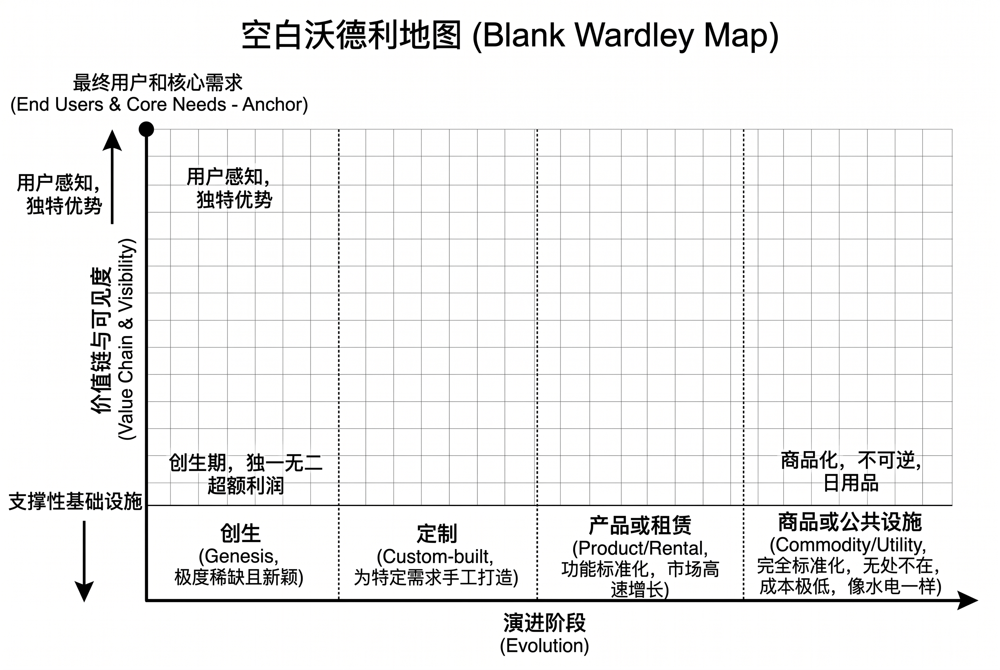
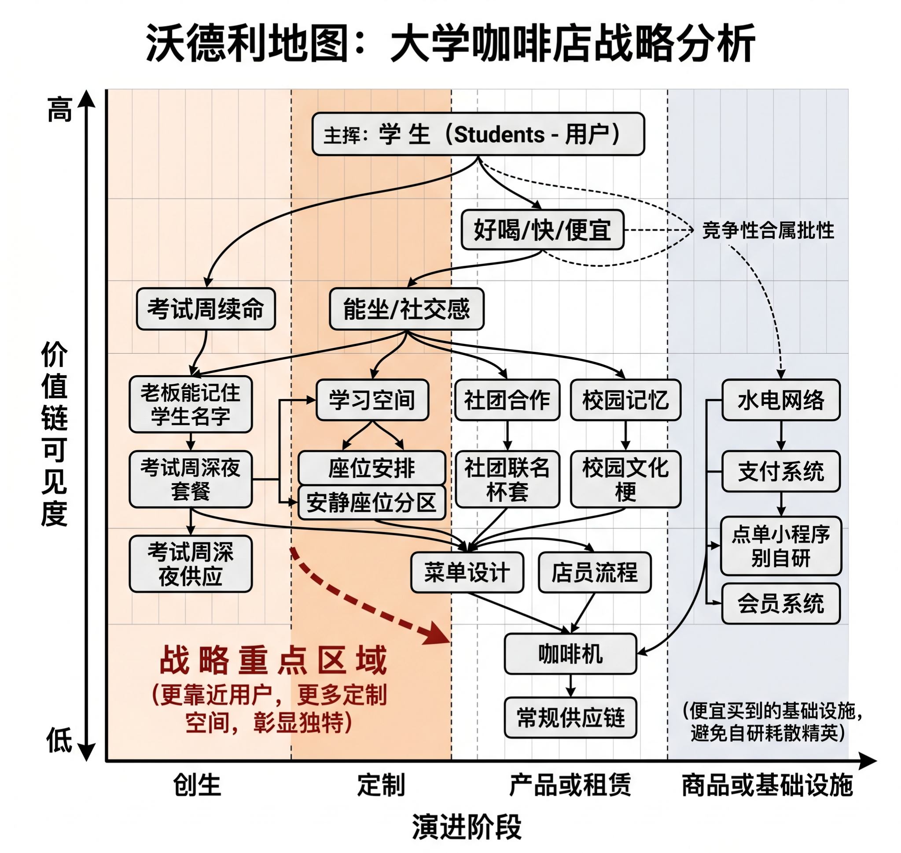
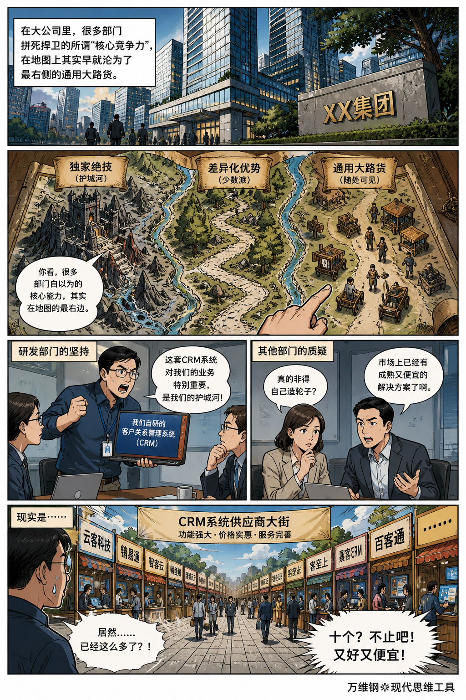
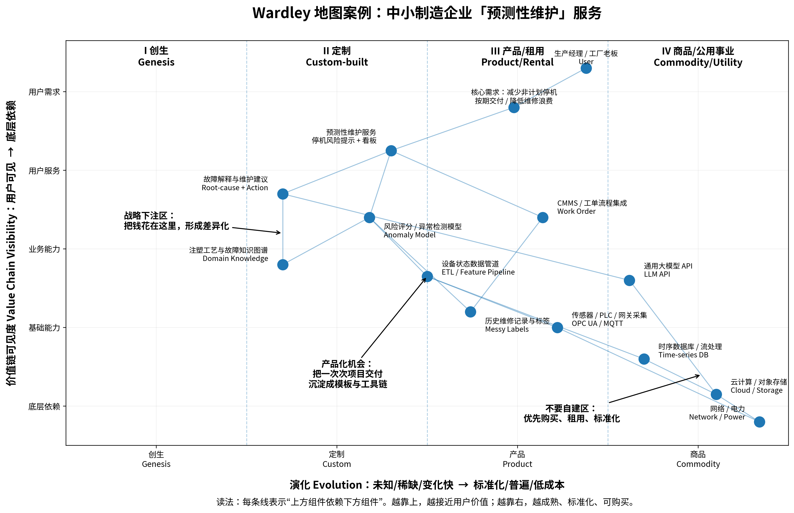
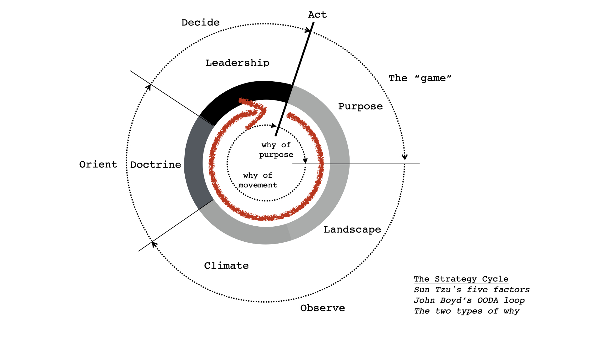

# 沃德利地图：独一无二的自己做，能外包的尽量外包

[沃德利地图：独一无二的自己做，能外包的尽量外包](https://www.dedao.cn/course/article?id=2Mo65zY4QZ3VnmWBapKqEdNAa98jGB)

2026-05-27 23:10

我们讲过要想在现代商业社会中立足，你得有自己的「阿尔法优势」。我们还知道「战略定位」和「运营效益」是两回事：战略，是当你决定自己做什么的同时，你也在决定自己绝对不做什么。

**你应该把心血倾注在那些能彰显你独特性的事物上，而把那些标准化的、能外包的东西统统甩给别人。**你不能让公司最宝贵的人才去做最平庸的事儿。

道理很明白，但你可能很难想象，真实世界里有多少企业根本不知道哪些该外包，哪些该自制。

一家教育机构花一个月自研登录系统，一家制造企业投入巨资自建云平台，他们号称要“掌控核心技术”，却不顾市面上早就有便宜一百倍好用一万倍的现成服务。一个人要做自媒体，每天花三个小时折腾笔记模板……这些都是没有战略精神的伪勤奋。

好钢应该用在刀刃上，可你知不知道刀刃在哪里？

这一讲的思维工具叫「 **沃德利地图** （Wardley Mapping）」，它把商业和个人战略归纳成一句话：

值得独一无二的，自己做；可以平平无奇的，外包给世界。

沃德利地图不是出身于学术界，而是来自商业一线。大约在 2005 年，担任 Fotango 公司 CEO 的英国人西蒙·沃德利（Simon Wardley）有感于高管们的报告里充斥着陈词滥调，大家只是在盲目复制竞争对手的动作，发明了这个工具。

沃德利的洞见是：企业家的战略意识之所以不到位，是因为他们缺少地图。军事指挥官有地图，能俯瞰战场全貌，知道所有的地形特征，那你作为企业高管，也得知道公司每一块业务是处在什么位置上，整个气候有一个什么样的大趋势才行。

沃德利地图的核心假设叫「 **万物皆演进** （Everything Evolves）」。**根据创新扩散理论和市场竞争规律，任何一种技术、一个最佳实践（best practice）或者商业模式，刚出来的时候哪怕再厉害、再是你的独门武功，最终都会不可逆转地走向商品化（Commodity），成为大众能轻易得到的东西。**所以我们要想赚取超额利润，就必须把精力放在那些处于创生期、目前还是独一无二的事物上。

这个地图就是要既体现为客户服务的目标，又体现演进趋势。这是一个直角坐标系，你要做的就是把你这个产品的各个功能模块拆开，分别填入图中 ——

纵坐标代表「**价值链可见度**（Value Chain Visibility）」。地图的最顶端是最终用户和他们的核心需求，这是整张地图的锚点。越往上，用户越能直接感知；越往下，越是隐藏在幕后的支撑性设施。

横坐标则是「**演进**（Evolution）」，从左到右分为四个不可逆的阶段：

1. **创生**（Genesis），意思是这个东西非常新颖，可能都没有人懂，风险很大，可能代表未来，但也可能是科研幻觉。

2. **定制**（Custom-built），这个东西是为了特定需求手工打造的，它已经有价值了。

3. **产品或租赁**（Product/Rental），这个东西的功能已经被人定义过了，市场上可以直接购买或者租用，相当于设计好的服装。

4. **商品或公共设施**（Commodity/Utility），这个东西就像水、电、网络一样，完全标准化而且特别便宜，相当于论斤卖的面料。

简单说，纵轴问的不是这个功能模块的重要程度，而是离用户有多近、用户能不能直接感知到它的存在；横轴问的是它在市场上成熟到了什么程度。

沃德利提醒我们， 地图上的一切都在自动往右走：今天的神通是明天的工具，今天的经济租是后天的水电煤。

来个具体例子：想象你在大学校园里开了一家咖啡店。如果不画地图，你可能会觉得“我们要数字化”，冲动之下就要自研一套点单小程序 —— 可那是你赚钱的优势吗？咱们看看沃德利地图怎么画。

先明确你的用户是学生。学生要的不是“体验你自主研发的点单系统”，而是好喝、快、便宜、能坐、有社交感，最好在考试周能续命。

先往下沿着纵轴拆价值链：学生需要学习空间、出杯速度、饮品质量、价格友好 → 它们依赖菜单设计、店员流程、座位安排、社团合作、考试周深夜供应、供应链、咖啡机、支付系统、会员系统、水电、网络等等。这些模块之间彼此又有依赖关系，咱们不一一细说。

现在放到横轴上看。支付、点单、会员系统、水电、网络都是能便宜买到的基础设施，全部靠右，应该直接买别费心思。咖啡机和常规供应链大概是产品化的，得小心挑选。考试周深夜套餐、社团联名杯套、安静座位分区、校园文化梗、老板能不能记住学生的名字，这些更靠近用户，也更有定制空间，它们位于图中中左区域，这才是你的战略重点区域。

地图画出来差不多是这个样子 ——

单单是画这张图的过程，就已经能帮你想清楚很多事儿了。

可能你大学学的是计算机科学，所以你开咖啡店就想自己编写一个会员系统，觉得终于能大显身手……殊不知从这门业务的角度看，你那个编程技能根本不值钱。不管你擅长什么，你大可用「效果推理」寻找自己适合的业务 —— 但如果你要开校园咖啡店，就得按校园咖啡店的逻辑走。

校园咖啡店的逻辑是学生不会因为你的数据库架构性感而买单。但他们会记住你在期末凌晨两点开门。

在大公司里，很多部门拼死捍卫的所谓“核心竞争力”，在地图上其实早就沦为了最右侧的通用大路货。你们公司的研发部门可能会强烈要求坚持用自己做的“客户关系管理系统（Customer Relationship Management, CRM）”，说那对你们的业务特别重要，是你们的护城河！可是市场上明明已经有十个供应商做得又好又便宜。

沃德利地图逼你承认：很多所谓“我们这一块业务特殊”，其实就是“我们的低效很有历史”。

面对一张画好的地图，你可以做两个战略动作。

**第一是下注。**

很明显，你应该重兵投入的是图中“中左区域”，这里的模块处于创生和定制阶段，而且距离顶端的用户比较近。这里有相当的模糊性，没有行业共识，是你建立优势的源泉。

而右下角，则是应该坚决外包、采买或者用 AI 替代的地方。这里往往是最底层的基础设施，有标准的工具和现成的服务。

云服务要稳定，不必感人；支付接口要可靠，不要浪漫；报销系统要便宜，别加戏；合规要清楚，别整成史诗。真正值得你亲手打磨的是靠左侧的东西：对用户的理解、行业默会知识、关键数据、评测体系、业务解释能力和品牌信任等等。

如果你们公司所谓的“用 AI”就是在右下角降本增效，我不认为 AI 是你们的战略工具。

**第二是制定产品化与迁移路线。**

地图上的一切都在往右移动：创生会变成定制，定制会变成通用产品，产品会变成廉价商品。所以我们必须有一个把今天的核心竞争优势变成明天的基础设施的意识。早期你可能在左侧为每个客户手工定制解决方案，但做多了，你就可以把它向右侧推进，沉淀成标准模板、特征库和 SOP（标准作业程序）。

战略高手会从一次性的项目中偷出可复制的产品。

咱们再看两个例子。

第一个例子是真实的，我想让你看看沃德利地图这把刀有多快。

2011 年，英国政府的多个大型 IT 项目惨遭失败，不但不能满足现代数字化服务的需求，而且预算严重超支。在这个背景下，新成立的政府数字服务局（Government Digital Service, GDS）被要求整顿这些项目。他们想出的办法，就是强制各个部门画沃德利地图：你们这个项目的最终用户是谁？用户的核心需求是什么？

**结果 80% 的部门竟然无法准确定义他们服务的最终用户**……等到数字服务局终于汇总各个项目的信息，画出整个地图，他们发现诸如服务器机架、支付网关这些本该是高度标准化的“商品”组件，都被各个部门当作独特的“定制”业务 —— 重复建设了多达 118 次！

数字服务局手起刀落，中止了所有底层基础设施的内部定制，全部转向大规模市场化采购，一下子就为英国公共财政避免了几十亿英镑的浪费。

第二个例子是虚构的，我想让你看一张稍微复杂一点的沃德利地图是什么样的。

想象你开了一家创业公司，专门给中小制造业企业做“预测性维护（predictive maintenance）”服务。简单说就是你详细监测机器的运行状态，在它出毛病之前，通过 AI 预测到机器什么时候需要维护，及时提出维护建议。咱们来拆解一下这个价值链该怎么画。

第 1 层：你的用户是工厂老板和生产经理。他们想要的不是什么“上 AI”，而是“让机器别突然趴窝”，用更专业的说法就是减少非计划停机、保证按期交付、降低维修浪费。

为此你们需要给人家提供一个停机风险提示看板服务。

第 2 层：上一层那个服务依赖故障解释、风险评分和工单流程集成这三个模块；

第 3 层：上面的风险评分模块又依赖故障知识图谱、设备状态数据管道和历史维修记录这三个模块，……；

第 4 层则是传感器、网关、时序数据库、云计算、网络/电力等等。

我们把每个模块画在沃德利地图的相关坐标点上，把各层模块之间的依赖关系用线段连起来，就得到了下面这张图 ——

有了地图，思路很清楚。右边的云计算、时序数据库、传感器和通用大模型 API 都应该从外面购买。真正值得自己做的是中左区域：故障解释与维护建议、故障知识图谱、风险评分等等。

你还可以从图中看出，设备状态数据管道这个模块，虽然现在在定制区，但是已经非常接近产品区了 —— 这说明你们未来可以把它打包成一个通用的产品。

你们宣称自己是一家 AI 公司，但这个业务的核心并不是 AI，而是“AI + 设备知识 + 生产责任”。

**正所谓模型可以外包，责任不能外包；算力可以租，行业判断不能租。**

人人都可以用 AI，但是得这样用，才能用 AI 赚钱。

个人发展也可以用沃德利地图，核心精神就是 「用户意识 + 左右意识」。

比如你说“想三年内成为 AI 专家。”用沃德利地图的精神看，你这句话就等于没说：什么叫 AI 专家？你连用户是谁都不知道。

**真正的专家必须是能在具体现场交付结果的人。**如果你求职，用户是未来雇主；如果你创业，用户是客户；如果你做研究，用户是学术共同体；如果你做内容，用户是读者。用户不同，地图完全不同。

确定用户和用户的需求，一层一层往下拆，再看地图的横轴。常见的技能，像什么 Python 语言、提示词模板、RAG 工具，都已经产品化甚至商品化，位于右侧。当然你也得会用，但这些不是你该下注的核心点。

你必须往左看，看更难标准化的东西：对特定垂直行业的深度业务理解、把复杂数据转化为商业决策的叙事能力、真实项目的评测洞察等等。

你不是要成为“会用一百个 AI 工具的人”，你要成为“能在一个真实场景中定义问题、组织数据、评估结果、闭环改进的人”。

沃德利地图的道理似乎很简单，可是现实中，人们就是很喜欢把该外包的东西自建。有的企业非得把基础设施掌控在自己手里，用一个极为臃肿的运维团队，弄出一套极为笨重的系统，又贵又不好用。这就如同开餐馆的自建发电站、作家花半年时间折腾个人网站一样。他们到底图啥呢？

**首先是错把控制感当成了竞争力。**“我们有自己的系统”听起来很有安全感，可是不产生任何利润。很多自研不是为了赢，而是为了缓解焦虑。

**其次是错把技术难度等同于战略价值。**自己写一套支付网关，听着很厉害，也的确需要专业人才，但这可不代表它对你的核心业务有战略价值。

**也许一个更深层的心理机制，是人们在用右侧的伪努力逃避左侧真困难。**写出一篇有洞见的文章很难，解决客户的真实需求很难；但是折腾一套 AI 写作流程、配置服务器环境这些活儿既显得技术高超，又充满“我在取得进展”的充实感……

如果市面上已经有现成的，你就不应该自己做；你应该专门做别人没做过甚至不会做的东西 —— 这其实是一个特别高的要求。

有意思的是，沃德利把他这套方法和《孙子兵法》、和「OODA 环」联系在了一起，我一听也挺有道理。

《孙子兵法·始计篇》说：「故经之以五事，校之以计，而索其情，一曰道，二曰天，三曰地，四曰将，五曰法。」沃德利认为，“道”是公司的 Purpose，也就是目的和价值观；“将”是领导力；“法”是组织原则 —— 而他这个地图，则解决了“天”和“地”的问题：地就是地形图，你的每一个业务模块处在价值链的什么位置，处于什么演化阶段；天就是气候，就是所有东西都在向右演进。

沃德利用 OODA 环把孙子兵法的五事串了起来，形成了一个动态的战略循环。

你可以对照上面这张图自己参详参详。

总而言之： 你的努力必须有地形感。

**【收束小诗】**

> 地在脚下，天在右移；  
> 器可外借，道须自明。  
> 凡能购买者，不必成为你；  
> 凡能定义你者，不可假于人。

## 故经之以五事，校之以计，而索其情

> 《孙子兵法·始计篇》说：「故经之以五事，校之以计，而索其情，一曰道，二曰天，三曰地，四曰将，五曰法。」

《孙子兵法》的开篇非常厉害。很多人把它当“兵书”，其实它首先是一套“认知世界、判断胜负”的方法论。

《始计篇》这句话：

> 「故经之以五事，校之以计，而索其情」

意思是：真正高水平的决策，不是靠热血、勇气、情绪，而是先建立一套系统性的评估框架。

通过“五事”去观察局势，通过“七计”去比较双方，最后推演出事情真正的发展趋势。

这里面最核心的，是“索其情”——看清真实情况。

很多人以为战争靠激情，其实战争最怕幻觉。

孙子开篇就在讲：

不要先问“我要不要打”，而是先问：

- 我真的理解局势了吗？
- 我有没有被情绪欺骗？
- 我看到的是表象，还是结构？

下面我们拆开看。

---

### “五事”是什么：决定成败的五个底层变量

#### “道”：人心与共识

“道者，令民与上同意也。”

很多人把“道”理解成道德，其实不完全对。

这里更接近：

- 共识
- 信念
- 合法性
- 人心方向
- 群体是否愿意共同承担风险

为什么很多组织明明资源不少，却迅速崩塌？

因为没有“道”。

表面上大家在一起，实际上：

- 目标不一致
- 利益不一致
- 情绪不一致
- 信任断裂

这种组织看似强大，实际上内部已经空了。

而真正强大的组织，往往有一种“方向一致性”。

比如：

- 创业公司相信未来
- 军队相信胜利
- 家庭彼此信任
- 国家形成共同叙事

这就是“道”。

孙子把它排第一，不是偶然。

因为人不是机器。

现代社会很多人迷信制度、流程、KPI，但忽略了最重要的东西：

人心。

---

#### “天”：时代、周期与不可控变量

“天者，阴阳、寒暑、时制也。”

这不是玄学。

它讲的是：

- 时间窗口
- 大周期
- 外部环境
- 趋势
- 宏观变化

也就是今天说的：

- 顺周期
- 逆周期
- 风口
- 宏观环境
- 技术浪潮

为什么同样能力的人，命运差异巨大？

因为很多时候，人其实是在和“天”对抗。

举个例子：

2008 年去做智能手机；

2023 年去做 AI；

1998 年去做互联网；

这就是“得天时”。

而很多失败，不一定因为你不努力，而是：

- 行业周期结束了
- 增量消失了
- 大势逆转了
- 技术范式变了

孙子非常强调：

高手不是硬抗时代，而是借势。

现代人一个很大的误区是：

把所有成功都解释为个人奋斗。

实际上，“天”往往比个人能力更重要。

---

#### “地”：结构、位置与约束

“地者，远近、险易、广狭、死生也。”

“地”不仅仅是地理。

它本质上是：

你所处的结构位置。

包括：

- 地理位置
- 资源条件
- 信息优势
- 网络结构
- 行业生态位
- 竞争格局

比如：

同样开店：

- 开在人流中心和开在荒郊野外，完全不同；
- 做平台和做平台上的商家，也完全不同。

现代互联网里，“地”依然存在。

例如：

- 流量入口是谁掌控；
- 算法偏向谁；
- 谁拥有用户关系；
- 谁拥有分发权；

这都是“地”。

很多人特别努力，但长期处于错误的位置。

于是：

越努力，越消耗。

孙子其实在提醒：

不要只研究自己，还要研究“位置”。

因为结构优势，往往大于个人努力。

---

#### “将”：领导者的认知与人格

“将者，智、信、仁、勇、严也。”

这是非常经典的一段。

一个真正的领导者，需要五种能力：

1. 智：认知能力。不是小聪明，而是洞察力。能否看清局势、识别真假信息、判断长期趋势。
2. 信：可信度。团队是否相信你。没有信任，再好的战略也执行不了。
3. 仁：对人的理解。不是软弱，而是理解人性、能凝聚人、知道如何让组织长期运转。
4. 勇：决断力。很多人不是不聪明，而是不敢承担后果。真正困难的是**在信息不完整时做决定。**
5. 严：纪律与秩序。组织不能只有温情。没有规则，组织就会崩塌。

这五个字其实非常深。

因为它讲的是：

**领导力不是单点能力，而是平衡能力。**

太仁而不严，会失控；

太严而不仁，会离心；

太勇而无智，会冒进；

太智而无勇，会犹豫。

---

#### “法”：组织系统能力

“法者，曲制、官道、主用也。”

简单说：

制度、流程、资源配置、组织效率。

很多人低估“法”。

觉得伟大事业靠天才。

其实长期竞争里：

真正决定上限的，是系统。

比如：

- 军队补给
- 企业流程
- 人才机制
- 财务系统
- 信息流转
- 激励机制

这些东西平时不起眼，但真正打长期战时，会决定生死。

现代很多公司：

- 创业期靠“将”
- 成熟期靠“法”

没有系统化能力，组织规模越大越容易崩。

---

### “校之以计，而索其情”：真正重要的是“求真”

很多人忽略后半句。

孙子真正厉害的地方，不是“五事”。

而是：

“校之以计，而索其情。”

也就是：

- 比较
- 推演
- 验证
- 识别真实情况

这其实是一种极强的“反幻觉能力”。

因为人在重大决策时，非常容易：

- 自我感动
- 高估自己
- 低估风险
- 被情绪裹挟
- 被群体感染

所以孙子强调：

不要先相信自己的愿望。

先看现实。

这也是《孙子兵法》最现代的地方。

它不是热血哲学。

而是：

冷静的现实主义。

---

### 为什么《孙子兵法》今天依然可怕地先进

因为它研究的不是“战争”。

而是复杂系统中的竞争。

所以它可以用于：

- 创业
- 投资
- 管理
- 职业发展
- 国家竞争
- AI时代的个人生存

它的核心思想其实只有一句：

不要沉迷主观意志，要理解系统力量。

很多人今天最大的危险，不是不努力。

而是：

- 不理解周期；
- 不理解结构；
- 不理解组织；
- 不理解人性；
- 不理解时代；
- 不理解真实约束。

于是只能靠情绪和口号生活。

而孙子两千多年前就在提醒：

**胜负，在开战之前，其实已经被大量隐藏条件决定了。**

《孙子兵法》最厉害的一点，是它从来不鼓励“硬拼”。

它真正研究的是：**人在巨大不确定性里，如何提高胜率。**

这对当代普通人的启示，其实非常深。

因为现代社会最大的问题之一，就是：

**大多数人被迫活在“局部视角”里。**

每天：

- 刷信息
- 看情绪
- 跟热点
- 做短期反应
- 被即时反馈驱动

久而久之，人会失去一种能力：

从结构层面理解自己的人生。

而《始计篇》其实是在教你：

**不要只看眼前动作，要先看决定胜负的底层变量。**

---

#### 普通人最大的消耗：在错误战场上拼命

孙子最核心的思想之一：

> “先胜而后求战。”

不是先冲上去，再看看结果。

而是先判断：

- 这是不是值得打的仗；
- 这个位置有没有优势；
- 我的资源够不够；
- 长期是否有积累；
- 对方是不是不可战胜。

现代人最大的问题是：

**太容易进入别人设计好的竞争。**

比如：

- 被卷学历；
- 被卷工时；
- 被卷流量；
- 被卷焦虑；
- 被卷消费；
- 被卷“成功模板”。

最后变成：

**你以为自己在奋斗，其实只是在高消耗循环。**

《孙子兵法》会提醒你：

**不是所有战斗都值得参加。**

很多时候：

退出错误战场，比提升战斗力更重要。

---

#### “道”的启示：长期动力来自内在共识

现代人一个普遍困境：

**知道很多道理，但没有持续行动力。**

为什么？

因为内在没有“道”。

也就是：

**你的行动、价值观、欲望、长期方向，并不统一。**

比如：

- 嘴上想自由，实际每天沉迷短刺激；
- 想深度成长，却长期活在信息噪声里；
- 想长期主义，却被即时反馈控制。

于是内心长期撕裂。

人的精神能量，会被这种冲突不断消耗。

所以真正稳定的人，不一定最聪明。

但往往：

内部一致性很强。

他们知道：

- 什么重要；
- 什么不重要；
- 什么值得长期投入；
- 什么只是噪声。

这其实就是现代人的“道”。

---

#### “天”的启示：普通人必须建立周期感

很多人对人生最大的误判：

**把短期状态，当成人生结论。**

其实人生高度受周期影响。

比如：

- 行业周期；
- 技术周期；
- 年龄周期；
- 经济周期；
- 情绪周期；
- 认知成长周期。

很多人低谷时，以为自己废了；

高峰时，又以为自己无所不能。

但高手会意识到：

很多东西只是“天时变化”。

所以他们不会：

- 在高潮时盲目扩张；
- 在低谷时彻底绝望。

而是：

**保留生存能力，等待周期切换。**

这在 AI 时代尤其重要。

因为未来最大的变化，不是“努力程度差异”。

而是：

**是否站在技术周期正确的一侧。**

---

#### “地”的启示：位置经常比努力更重要

现代社会有个残酷现实：

**结构优势会不断累积。**

比如：

- 平台 vs 个体；
- 流量入口 vs 内容生产者；
- 拥有用户关系的人 vs 被平台分发的人；
- AI工具创造者 vs AI工具使用者。

很多普通人最大的问题不是不努力。

而是：

**长期处于低势能位置。**

结果就是：

**越勤奋，越被系统抽取。**

所以现代人非常重要的一件事：

不要只提升技能。

还要提升自己的“位置”。

例如：

- 是否靠近新技术；
- 是否拥有稀缺分发；
- 是否掌握用户关系；
- 是否进入高密度认知圈层；
- 是否有长期复利资产。

孙子其实一直在讲：

**地利，本身就是力量。**

---

#### “将”的启示：现代人最稀缺的是稳定人格

AI时代，一个越来越明显的问题：

**信息能力越来越廉价；**

**人格能力越来越昂贵。**

未来真正稀缺的，不只是知识。

而是：

- 判断力；
- 情绪稳定；
- 延迟满足；
- 面对不确定性的勇气；
- 长期主义；
- 与人协作的可信度。

这其实就是“将”的能力。

为什么很多聪明人最后走不远？

因为：

- 情绪失控；
- 方向摇摆；
- 欲望失衡；
- 无法长期积累；
- 无法建立信任。

现代社会会不断刺激人的神经系统：

- 短视频；
- 热搜；
- 金钱焦虑；
- 比较；
- 注意力战争。

最后很多人不是输给别人。

而是输给自己的内部混乱。

所以未来最强的人，很可能是：

能够长期维持稳定认知结构的人。

---

#### “法”的启示：不要只靠意志力活着

现代鸡汤特别喜欢强调：

- 自律；
- 拼搏；
- 坚持。

**但孙子更强调系统。**

**因为人本身是不稳定的。**

真正厉害的人，不是永远激情满满。

而是：

把正确行为系统化。

比如：

- 固定深度工作时间；
- 主动隔离噪声；
- 建立长期学习机制；
- 固定输出；
- 稳定运动；
- 形成高质量社交结构。

也就是：

不要每次都靠“临时燃烧”。

而要靠结构。

你会发现：

很多长期优秀的人，其实不像“拼命”。

反而像：

**一种稳定运转的系统。**

---

### AI时代，《孙子兵法》的价值反而更大了

因为 AI 会让“战术能力”越来越廉价。

比如：

- 写代码；
- 写文案；
- 查资料；
- 做分析；
- 生成内容；

这些能力会越来越被自动化。

但真正难自动化的，是：

- 判断什么值得做；
- 选择什么战场；
- 识别趋势；
- 理解人性；
- 构建长期结构；
- 保持战略耐心。

而这些，恰恰是《孙子兵法》研究的东西。

所以未来人与人的差距，可能越来越不是“谁更努力”。

而是**谁更懂得“如何布局自己的生命结构”。**

这也是为什么，《孙子兵法》两千多年后仍然锋利。

它从来不是一本“教你打仗”的书。

而是一本：

关于现实、结构、时机、人性与胜率的书。

https://www.wardleymaps.com/glossary/strategy-loop

## [Strategy Loop](https://www.wardleymaps.com/glossary/strategy-loop)

2026-05-28 10:09

**The Strategy Loop is a mental framework that transforms chaotic decision-making into systematic strategic thinking.** It combines Sun Tzu's five factors, John Boyd's OODA loop, and two types of 'why' to help engineering leaders, architects, and technical managers make better strategic decisions under pressure.

If you're tired of constantly firefighting, missing opportunities, or watching your team struggle with unclear direction, the Strategy Loop provides the structure you need to think strategically about technology, teams, and business outcomes.

> **Without a Decision Loop, You're Suffering**

> When you don't operate within a structured decision loop, you fail to observe the results of your actions and connect them back to your decisions. This creates a cycle of constant surprises—unanticipated consequences catch you off guard repeatedly. You burn enormous amounts of energy reacting to problems you could have anticipated, fighting fires instead of preventing them. The lack of systematic observation and learning means you repeat the same mistakes, never building the situational awareness needed for effective leadership.

*The Strategy Loop integrates three powerful frameworks: John Boyd's OODA loop (outer cycle), Sun Tzu's five factors (middle ring), and two types of 'why' (inner loops) to create a comprehensive strategic thinking framework.*

## The Three Core Components

### 1. John Boyd's OODA Loop (Outer Cycle)

The continuous cycle of strategic iteration:

- **Observe** : Monitor your technical landscape, team dynamics, and business environment
- **Orient** : Interpret what you're seeing in context of your goals and constraints
- **Decide** : Make calculated choices about architecture, priorities, and resource allocation
- **Act** : Execute decisions with clear purpose and measurable outcomes

Each cycle builds on the previous one, creating compound strategic advantage over time.

### 2. Sun Tzu's Five Factors (Middle Ring)

Five strategic elements that shape every technical decision:

- **Purpose** : Why does this project/initiative matter to the business?
- **Landscape** : What resources, capabilities, and constraints do we have?
- **Climate** : What market forces, technology trends, and external pressures affect us?
- **Doctrine** : What engineering principles and best practices guide our decisions?
- **Leadership** : What specific actions will we take to achieve our purpose?

### 3. The Two Whys (Inner Loops)

The core questions that drive strategic clarity:

- **Why of Purpose** : Why are we building this? What business problem does it solve?
- **Why of Movement** : Why this approach over alternatives? What makes this the right choice now?

## How to Apply the Strategy Loop

### Step 1: Start with Purpose

Ask "Why are we doing this?" before writing any code or making architectural decisions. Your purpose might be reducing technical debt, improving system reliability, or enabling new business capabilities.

**Key Question** : What business outcome will this technical work enable?

### Step 2: Analyze Landscape

Map your current technical reality: existing systems, team capabilities, budget constraints, and organizational structure. This is your technical terrain—what you must work with or around.

**Key Question** : What are the technical and organizational constraints I cannot change but must navigate?

### Step 3: Analyze Climate

Understand the external forces affecting your decisions: technology evolution, market pressures, regulatory requirements, and competitive dynamics. These shape what's possible and what's urgent.

**Key Question** : What external forces are driving change in our technical environment?

**Pro Tip** : Landscape and Climate together form your situation assessment—the reality you must adapt to or influence through your technical choices.

### Step 4: Establish Doctrine

Define your engineering principles and decision-making rules. These might include "prefer boring technology," "optimize for maintainability," or "build for observability." Doctrine keeps you consistent under pressure.

**Key Question** : What technical principles will guide our architectural and implementation decisions?

### Step 5: Execute Gameplay

Take specific technical actions: choose technologies, design systems, allocate team resources, and sequence work. This is where strategy becomes code, infrastructure, and delivered capabilities.

**Key Question** : What specific technical actions will achieve our business purpose?

**Critical** : Your technical choices must align with your business purpose and follow your established engineering principles.

## Key Strategic Insights

### Iterative Nature

The Strategy Loop isn't waterfall planning. Implementing your doctrine (Step 4) often reveals new constraints in your landscape (Step 2). This feedback is valuable—embrace it rather than fighting it.

### The Greatest Risk

Getting stuck in execution mode—building features, fixing bugs, and optimizing systems without regularly reassessing whether you're solving the right problems. This leads to technical debt and missed opportunities.

### Leadership Application

For technical leaders, the Strategy Loop provides:

- **Clarity** : Structure for complex technical decisions
- **Adaptability** : Framework for responding to changing requirements
- **Alignment** : Shared language for technical and business discussions
- **Efficiency** : Prevents over-engineering while maintaining quality

## Integration with Wardley Mapping

The Strategy Loop works seamlessly with Wardley Mapping for technical strategy:

- **Purpose** aligns with user needs and business value chains
- **Landscape** becomes your map of technical components and dependencies
- **Climate** includes technology evolution and market dynamics
- **Doctrine** provides universal principles for technical decision-making
- **Gameplay** applies specific technical plays to your mapped landscape

## Common Pitfalls to Avoid

1. **Skipping Purpose** : Building technically elegant solutions that don't solve business problems
2. **Ignoring Climate** : Choosing technologies without considering their evolution stage
3. **Rigid Planning** : Treating technical roadmaps as unchangeable rather than adaptive
4. **Feature Factory** : Constantly shipping without reflecting on outcomes
5. **Isolation** : Making technical decisions without considering business context

## Building Strategic Muscle

The Strategy Loop becomes more effective with practice:

- **Start Small** : Apply to one technical decision or project. Think about expected consequences and do a proper after action review. What worked? What did not? What have we learned?
- **Close Open Loops** : Find a way to check whether your actions bring intended consequences. Escape situations in which you act but have no feedback loops.
- **Increase Usage** : Ask questions about intended results, real results, lessons learned. Pay special attention to lessons learned, even if you are the only person that cares.
- **Reflect Often** : Review how well your technical choices achieved business outcomes

## Strategic Leadership Benefits

Technical leaders who master the Strategy Loop gain:

- **Better Technical Decisions** : Systematic approach reduces bias and improves outcomes
- **Faster Adaptation** : Clear framework for responding to changing requirements
- **Team Alignment** : Shared understanding of technical strategy and business purpose
- **Resource Efficiency** : Prevents wasted effort on misaligned technical work
- **Career Growth** : Strategic thinking skills that distinguish senior technical leaders

## Conclusion

The Strategy Loop transforms technical leadership from reactive problem-solving into proactive strategic thinking. By systematically observing, orienting, deciding, and acting with clear purpose, you can navigate complex technical environments more effectively.

Remember: The goal isn't perfect technical solutions—it's continuous improvement in how you connect technical decisions to business outcomes. Each cycle through the loop makes you a more strategic technical leader.

---

*The Strategy Loop provides the foundation for strategic technical leadership. Learn more about* [*Doctrine* ](https://www.wardleymaps.com/glossary/doctrine)*,* [*Gameplay* ](https://www.wardleymaps.com/glossary/gameplay)*, and* [*Value Chains* ](https://www.wardleymaps.com/glossary/value-chain)*to understand how the Strategy Loop integrates with broader strategic frameworks.*