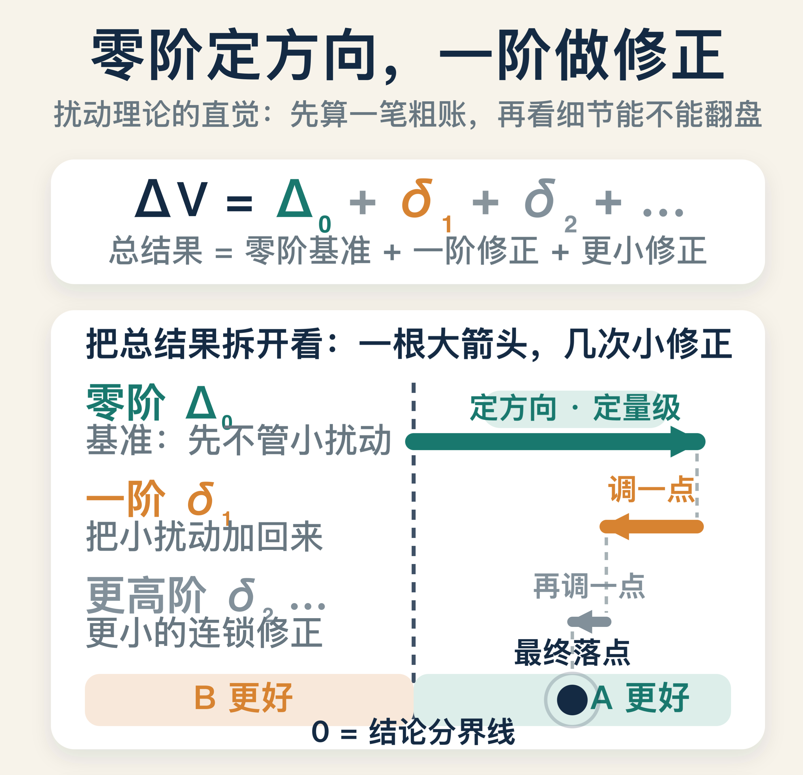
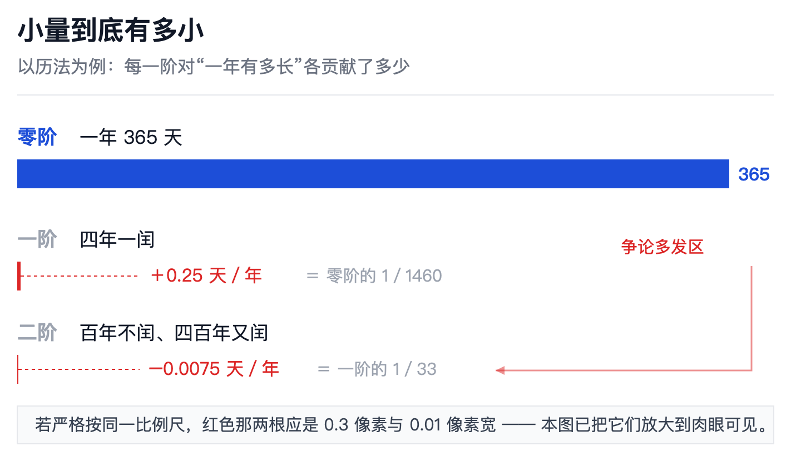
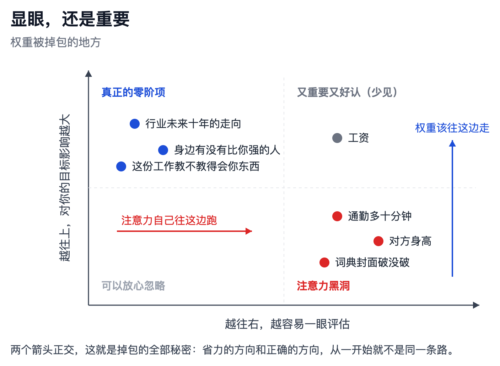
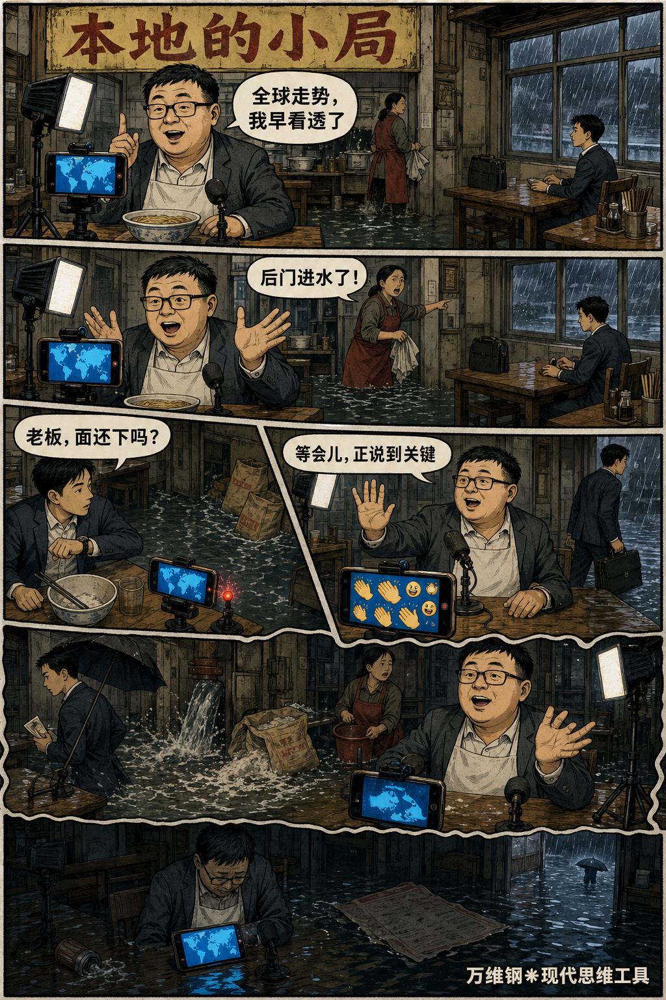
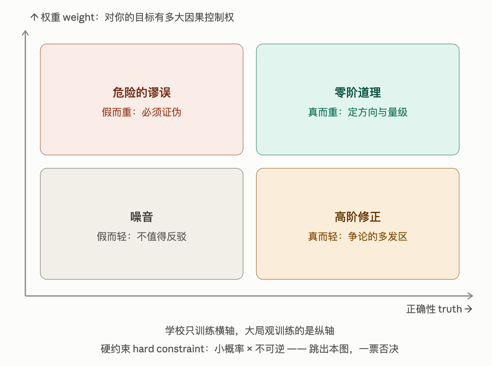
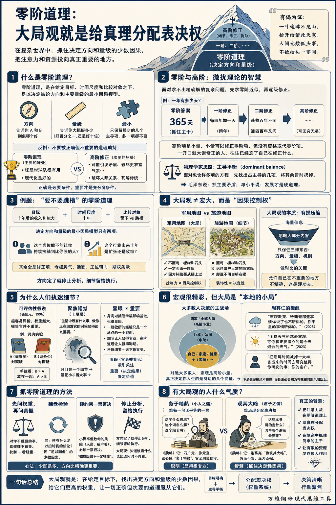

# 零阶道理：大局观就是给真理分配表决权

[零阶道理：大局观就是给真理分配表决权](https://www.dedao.cn/course/article?id=258WANERjwQJDzonzpKbOMG1rZqkPl)

2026-07-26 23:20

咱们进入现代思维工具课的最后一个板块，我称之为「**高观点反思**」。“高观点”这个词是借用德国数学家菲利克斯·克莱因（Felix Klein）1908 年出版的名著《高观点下的初等数学》 ：学过高等数学再回头看中学数学，许多原本零散的知识会显出共同的结构，因为你站得高了 —— 前面我们讲了那么多思维工具，这个板块要站到更高处，讲几个统领性的、具有通用性的思维工具。

这一讲，请允许我说一个我原创的说法，叫「 **零阶道理** 」。

零阶道理就是主导一个事物、一个决策的最基本、最重要的道理。它有个奇特的性质：因为它太基本了，人们反而不愿意谈论它，而喜欢谈论对它的修正。

比如说，“球星对一支球队很有用”，就是个零阶道理。可是因为人人都知道这个道理，说出来显得没水平，所以人们更爱谈论的是：“球星来了也不都是好事儿，可能还会引发球队矛盾，破坏更衣室气氛。”这话也对 —— 但那是次要的。我们绝对不能因为那一点次要的坏处，而不要主要的好处。

再比如，“现代化是好的”，也是个零阶道理，老百姓都明白现代化的好处。可是有的学者偏偏爱讲现代化的坏处：破坏了温情脉脉的人际关系，瓦解了乡村传统经济，……讲着讲着就成了反现代化的人。可你要让他回到过去当农民，他肯定不干。

其实人不太容易被错误的道理欺骗。更常见的灾难是被正确而不重要的道理劫持。那些道理不能说完全没用，但它们只是对零阶道理的修正而已，不能因为它们的存在而否定零阶道理。

人脑是个多元政体。面对一个事情，你的头脑中总有很多个声音，你总可以讲出五花八门的道理来 —— 可是相对于你的目的，绝大多数道理的影响微乎其微。

**一个道理可以百分之百正确，却只值得百分之一的权重。**

可是大多数人只有一套「真假判断系统」，没有一套「权重判断系统」：凡是听起来有道理的因素，都拿到了一张同等的选票，芝麻、石头和山峰一律按一件东西计算。

我们从小受的教育，考试考的全是“对不对”，因为对错有标准答案。可是“重不重要”没有标准答案 —— 它取决于你的目标，是主观的判断。你得自己学着分清什么重要，什么不重要。

✵

「零阶」这个词来自物理学家的一个传统手艺：面对一个求不出精确解的复杂问题，先算一个粗糙但抓住主干的答案，这叫「零阶近似」；然后在这个答案上修修补补，加上一阶修正、二阶修正，逐级把精度提上去。这套办法叫「微扰理论（perturbation theory）」。

比如你问一年有多少天，零阶答案就是 365 天。这个答案是不精确的，马上就会有人说不对，地球绕太阳一圈不止 365 天！那么我们可以搞个一阶修正，也就是每四年加一天，称为“闰年”。那有人又说一阶修正也不准确，没错，所以还有二阶修正：逢整百年不闰、逢四百年又闰……

**历法的修正项可以无穷无尽地加下去，但是它们只能微调结果，推翻不了“一年约等于 365 天”这个零阶道理。**

这就是零阶和高阶的关系：高阶项是小量，小量可以修正零阶项，但是没有资格取代零阶项。你必须先承认零阶道理的正确性，才谈得上修正它。一开口就大谈修正的人，往往已经忘了自己在修正什么。

怎么找到零阶道理呢？物理学家的思路是「主导平衡（dominant balance）」：面对一个包含许多项的方程，先问哪几项占主导，把其余的暂时扔掉。

一旦你理解了这个思想，就会发现它到处都是。毛泽东的《矛盾论》说，研究任何复杂过程，“就要用全力找出它的主要矛盾。捉住了这个主要矛盾，一切问题就迎刃而解了”。抓主要矛盾，抓的就是零阶道理。

邓小平的说法则是“硬道理”。1992 年邓小平南方谈话，前一句刚说“要注意经济稳定、协调地发展”，紧接着就说：“但稳定和协调也是相对的，不是绝对的。发展才是硬道理”。

你品品这个说法的物理感：邓小平没说稳定和协调是错的 —— 那也是道理，也对 —— 他是说那些道理是软的。软道理可以讨论，硬道理必须服从。当时“姓社姓资”的争论不可开交，每一条反对意见单看也都有道理，可是邓小平此话一出，争论就结束了。它不是驳倒了谁，它是给所有别的道理降了阶。

对不对是一回事，重要不重要是另一回事。

严格来说 ——

零阶道理，是在给定目标、时间尺度和比较对象之下，足以决定结论方向和主要量级的最小因果模型。

这里有三个关键词。「 **方向** 」，它告诉你 A 和 B 到底哪个好；「 **量级** 」，它告诉你大概好多少 —— 是好百分之一，还是好十倍；「 **最小** 」，它未必只含一个因素，但只保留最少的几个主导项，多一项都不要。

来道例题：“要不要跳槽”的零阶道理是什么？给定目标是十年后的收入和能力（目标 + 时间尺度），给定选项是“留下”和“跳槽”（比较对象），那么决定方向和量级的最小因果模型只有两项：这个岗位能不能让你持续接触到比你强的人，以及这个行业未来十年是扩张还是收缩。剩下的一切 —— 老板脾气、通勤、工位朝向、期权条款 —— 全是修正项。

✵

理解了什么是零阶道理，你才知道什么是大局观。**大局观就是复杂系统里最关键的那一两条「反馈回路」。**

大局和细节的区别，不是宏大与微小，而是控制力与装饰性。

军用地图上不会画每一棵树、每一块石头、每一户人家的晾衣绳，但一定会画一座桥。桥未必比森林大，可是因为补给要从桥上过，它拥有「因果控制权」。你说你是本地人，你认识每一棵树，你记得村口发生过的悲欢离合……可你要是说不明白村外那座桥的位置，这种熟悉毫无价值。

**大局观是对信息做「有损压缩」。它忽略大部分内容，只要求保住三样东西：方向、量级和机制。**你可能以为“忽略”很容易，但忽略其实是一个硬功夫，很多人过不了这一关：你必须允许自己在不重要的地方不精确。

没有误差容忍度的人建立不了大局观，他会不断寻找例外、限定语和补充条件，最后在细节的碎石滩上搁浅。

✵

那你说为什么人们如此容易执迷于细枝末节，抓不住大局呢？因为“显眼”天然吸引关注，而“重要”先定目标、再做计算。

比如一个求职者面对两份工作 offer，工资差不多，请问应该怎么选？

按理说，你应该去做一些调研，看看工作的成长性、稳定性等等。但是有很多人会因为一个很小的细节 —— 比如说第一份工作离家更近，每天的通勤时间少十分钟 —— 而做出选择。

为什么？因为成长性和稳定性是不好评估的，通勤时间却是显眼的。

1996 年，芝加哥大学商学院的行为科学家奚恺元（Christopher K. Hsee）提出了「 **可评估性假说** （evaluability hypothesis）」 ，说一个因素越容易评价，人们在决策中给它的权重就越大，哪怕它并不重要。

奚恺元的一个著名实验是让人给两本二手音乐专业词典估价。A 词典收词两万条，但封面破了；B 词典收词一万条，但完好如新。如果只给人看其中一本词典，B 词典得到的估价更高，因为它是新的。但是，如果你把两本词典放在一起，人们就愿意为 A 出更高的价 —— 因为很明显，A 的词条更多，似乎应该更有用。

这就解释了女性找对象为什么会那么重视身高。其实研究表明，另一半的身高对你婚姻的幸福并没有什么大的影响 —— 但是身高这个因素实在是太容易评估、太显眼了。

一位在教学一线工作了几十年的中学教师会认为自己很懂教育，可是他一辈子其实也只教过上千个孩子而已。他不知道当今教育的局面是怎么来的，也不知道未来的教育会往何处去，他一生看见的只是一个地点的一个截面而已 —— 这就使得他没有办法想象其他的可能性。他会认为自己的那点经验就是教育的真理。

还有个说法出自丹尼尔·卡尼曼（Daniel Kahneman），叫「 **聚焦错觉** （focusing illusion）」 ： **“生活中没有什么事，像你正在想着它的时候显得那么重要”** 。如果你只盯住、只知道这一个细节，你会认为这个细节就是最重要的因素。

细节会让人显得专业，正如讲高阶道理让人显得聪明。

一百年以前的科学家往往是一个学科的全才，像达尔文那样，能够把握学科的大局。但是现在科研早就是一个普通职业，养活了很多人。当今绝大多数科研工作者研究的都是自己领域中一个非常细节的小问题，你听都听不懂……可是当他们写科研经费申请书的时候，一定会告诉你，他们那个问题就是天下最重要的。

你要是一听谁说细节问题就肃然起敬，你可就被忽悠了。

✵

还有一种人恰恰相反，不但不纠结细节，而且胸怀天下！

美联储下个月降不降息，他有判断；俄乌战争下一步怎么走，他有推演；宏观经济的深层矛盾，他能给你讲得头头是道。北京出租车司机人均国师，正如巴西人人都是足球教练。

那你说这些人是不是特别有大局观？这不叫大局观。

**真正的大局是由目标函数决定的。 衡量一个因素是零阶还是高阶，应该看它对你的目标有多大因果控制权。**如果你的工作跟外贸相关，中美贸易战会对你很重要；否则你应该多考虑一些身边具体的东西：你所在的行业、你们那家公司、你的技能、你的家庭和你的健康。

对绝大多数人来说，宏观是你人生方程里的高阶小量，应该排在你自己那几个变量的后面。

周其仁教授在 2025 年 10 月的一次讲话中说：“宏观政策、特朗普那些事情你说了也不听你的，你手里的事情听你的。”他还在烟台对企业家们打过一个比方：全球天气当然最宏观，可你真正要操心的是今天烟台的天气。周其仁讲：

> 「不妨试试，把刷屏时间减掉一大半，看看究竟错过什么大事。省出来的时间干什么？对做企业的来说，可以集中更多时间去研究值得你研究的事，那就是客户、你的客户、唯一给你们公司付钱的客户！」

当然不是说宏观不值得花时间，但宏大叙事应该跟自身决策放在不同的账本上。

我们不应该假装飓风不存在，但是没必要把力气花在对飓风喊话上。

你真正的大局观不是全国那个大局，而是本地的小局。

✵

**抓零阶道理，简单说就是分清轻重缓急。而轻重缓急取决于你的目标设定。**

首要的心法是「先问权重，再问真假」。如果一个事儿对你不重要，它是真是假对你都不重要，你根本就不应该花时间去验证它的真假。

中国人把这个动作叫「权衡」。「权」的本意是秤砣，《孟子》说“权，然后知轻重” —— 所谓权衡，就是看看重要不重要。

一个著名的典故是人家问孟子：“男女授受不亲是礼法的规定，那既然如此，如果嫂子掉水里了，应不应该用手把她救上来呢？”

孟子说：「嫂溺不援，是豺狼也。男女授受不亲，礼也；嫂溺，援之以手者，权也。」在救命这么大的事儿面前，你还讲什么礼法呢？知道轻重缓急，这就是权。

这个权也是权力的权。各方面都有用钱的理由，每个人都有优点，每个项目都说做它最符合原则，那你说这点资源给谁好？把权力给你，就是让你去权衡。

再者，考虑问题不需要面面俱到。如果你问“我还有什么没考虑”，那你永远都考虑不完。你只需要做个「翻盘检验」，问“还有什么足以扭转我的结论”。

如果你以自我成长为优先，上班通勤时间多十分钟少十分钟，对你来说是无所谓的 —— 但如果你以家庭生活为优先，而每天多出来的十分钟恰好让你赶不上接孩子放学，那这个因素就足以扭转你的结论。

不过有一类因素永远不能当小量处理，那就是「硬约束」：某个小概率风险一旦发生就是破产、是人命，那就必须一票否决……用物理学家的话说就是“微扰级数不一定收敛”。

有些人遇到点啥事思前想后，翻来覆去下不了决心，就是被那些不重要的小因素给绊住了。如果能抓住零阶道理，其实一般的事情都不用分析那么多：方向定了就停止分析，细节留给执行就好。

大局观的一半是知道该看什么，另一半是知道什么时候不再看。

✵

有大局观的人是一种什么气质呢？我给你说一段典故。

据《三国志》裴松之注引《魏略》记载，诸葛亮年轻时在荆州游学，他的同学之中，石广元、徐元直、孟公威三人读书都是“务于精熟” —— “而亮独观其大略”。别人读书都是一字一句地抠，研究这个字、这个词是什么意思；而诸葛亮读的是整本书究竟在讲什么，其中哪个逻辑最要紧。

**务于精熟是给每一句话平等的一票，观其大略是给书里的道理分配表决权。**

《魏略》还记了一笔：诸葛亮当时曾经断言，这三位同学做官可至刺史郡守；问他自己，他笑而不言。后来三人果然大致官至如此，而诸葛亮做了丞相。

罗贯中可能是受了这段史书的启发，在《三国演义》“舌战群儒”这场戏中专门给诸葛亮安排了一段念白，说自己是“君子之儒”，而江东那些文臣都是“小人之儒”：

> 「小人之儒，惟务雕虫，专工翰墨，青春作赋，皓首穷经；笔下虽有千言，胸中实无一策。」

你看，这些小人之儒的特点可不是什么贪钱、抄袭、嫉妒、陷害那些道德品质问题，而是没有大局观的问题。

鲁迅笔下的孔乙己以知道“回字有四样写法”为荣，不也是这个意思吗？

我们这个课程讲了很多思维工具，你自己读书还能看到更多的道理，有时候你会觉得有些道理放在一起似乎是矛盾的。所以总有人问我：“你讲的这个道理的适用范围是什么？它的度在哪里？”其实不矛盾。哪个是现场的零阶道理，由你在现场决定；那个度只能根据具体情况具体分析。

务于精熟会显得你很聪明。但观其大略，抓住零阶道理，才是真正的智慧。

**【有偈为证】**

> 一叶遮眸不见山，  
> 拈开始信此天宽。  
> 人间无数低头事，  
> 不抵抬头一霎间。

---

本文提出了一个极具穿透力的决策与思维框架——**“零阶道理”与“权重思维”**。

#### 一、 核心概念：什么是“零阶道理”？

1. **定义**：零阶道理是在特定目标和时间尺度下，**足以决定事物走向和主要量级的“最小因果模型”**。它源于物理学中的微扰理论（先抓主项，再做微调）。
2. **核心痛点**：人类极少被“错误的道理”欺骗，**最常见的灾难是被“正确但不重要”的道理劫持**。

   - 一个道理可以100%正确，但往往只值得1%的权重。
   - 零阶道理往往因为“太基本、人人都懂”，说出来显得没水平，导致人们总爱对它进行修正（一阶、二阶修正），甚至用局部的修正项否定了主导性的零阶项（例如：因担心更衣室矛盾而否定球星的价值；因现代化的副效应而反现代化）。

#### 二、 思维转换：从“真假系统”升级到“权重系统”

1. **大多数人只有“对错观”，没有“权重观”**：

   - 应试教育只考“对不对”（有标准答案），但现实决策考的是“重不重要”（取决于目标）。
   - 没受过权重训练的大脑，会把芝麻、石头和山峰等同视之，给每一个听起来有理的因素发一张“等额选票”。
2. **大局观的本质，就是“给真理分配表决权”**：

   - 软道理（修正项）可以讨论，硬道理（零阶项）必须服从（如邓小平所说“发展才是硬道理”）。高阶修正项永远没有资格推翻零阶项。

#### 三、 认知陷阱：人为什么容易丧失大局观？

1. **显眼性偏差（可评估性假说）**：**容易被评估的细节，哪怕不重要，也会被赋予过高权重**。例如挑工作只看“通勤少10分钟”，找对象只盯“身高”，买词典只看“封面新旧”，因为这些肉眼可见，而“成长性、幸福感、词汇量”极难量化。
2. **聚焦错觉**：“生活中没有什么事，像你正在想着它的时候显得那么重要。”（卡尼曼）人一旦盯住某个细节，就会误以为它是宇宙的中心。
3. **专业主义的副作用**：现代分工把人变成螺丝钉，讲细节让人显得专业、挑毛病让人显得聪明，导致人们在不重要的细节上无限内卷。

#### 四、 破除“伪大局观”：宏大叙事 ≠ 大局观

1. **大局观不是“看地图有多大”，而是看它对你的目标有多大的“因果控制权”**：满嘴美联储降息、地缘政治的出租车司机不是大局观，那是把无法掌控的高阶小量当成了主粮。
2. **本地的小局，才是你真正的大局**：宏观环境像全球天气，你唯一需要操心的是你脚下的天气。真正的决策变量应该由你的目标函数决定：你的客户、你的行业、你的技能、你的家庭。

#### 五、 实操心法：如何践行“大局观”？

1. **先问权重，再问真假**：如果一个事实对全局的权重无限趋近于零，压根不需要浪费时间去求证它的真伪。
2. **做“有损压缩”，容忍局部的不精确**：大局观只需要保住三样东西：**方向、量级、机制**。不敢忽略细节、过度追求无瑕疵的人，注定在细节的碎石滩上搁浅。
3. **用“翻盘检验”代替面面俱到**：停止问“我还有什么没考虑到”（因为永远考虑不完），改问：**“还有什么因素足以彻底扭转我的结论？”**
4. **警惕唯一的例外——硬约束**：小概率但致命的系统性风险（破产、丧命、违规等极端代价）是一票否决项，绝不能当作小量忽略（微扰不收敛）。
5. **知道何时停止分析**：大局观的一半是知道看什么，**另一半是知道什么时候“不再看”**。方向一旦确定，就停止推演，把细节交给执行。

#### 六、 终极境界：从“务于精熟”到“观其大略”

- **务于精熟（小人之儒）**：皓首穷经，给每句话同等权重，精通细节（如孔乙己懂“回”字的四种写法），胸中实无一策，充其量是高级执行者。
- **观其大略（君子之儒）**：跳出文本与细节，抓统领性的核心脉络与因果逻辑，这才是帅才与顶层决策者的气质。