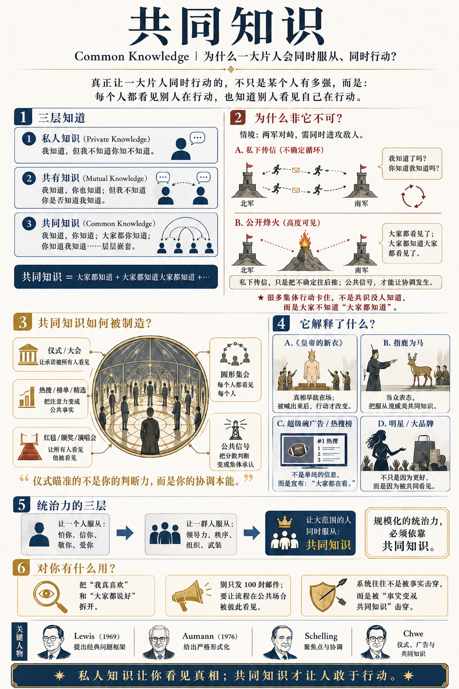

# 共同知识：让众人服从的神器

[共同知识：让众人服从的神器 \- 得到APP](https://www.dedao.cn/course/article?id=kzlWERBr6meVb1Wx2lK2j7LD4Od3Zp)

你心目中有没有那样的明星 ——

你并不喜欢他的作品，你认为他的水平不怎么样。可奇怪的是，听说他来本地开演唱会，你还是会看一眼票价，甚至会跟着抢票；他随口带个货，你可能会买；如果他真站到你面前，你心里还会“咯噔”一下，莫名敬畏。

你敬畏的到底是啥呢？

不是他这个人，而是他聚集的目光 —— 是“所有人都承认他很重要”这个事实。

这件事背后的机制比明星效应可大得多。我们要说的这个思维工具是统治者的神器，叫做「 共同知识 （common knowledge）」。

一个人服从你，可以是因为怕你、信你、敬你、爱你；一群人服从你，你需要有领导力，你需要会叙事，或者掌握武装；可是要让一整片人 —— 不是一群，而是你管辖范围内所有的人 —— 都心甘情愿服从，靠的可就不是你的品质和能力了。

而是另一种东西： 他们彼此看见了对方在服从。

共同知识是一间互相反射的镜厅。谁掌握了它，谁就握住了让一片人同时行动的总开关。

✵

「共同知识」这个概念最早是美国哲学家大卫·刘易斯（David K\. Lewis）在 1969 年提出来的 \[1\]，是他首先意识到人类社会的协调靠的是共同知识。以色列裔美国经济学家罗伯特·奥曼（Robert J\. Aumann）在 1976 年又给了它基于博弈论的、更严格的形式化表达 \[2\]。

这个理论很新鲜，但是这个道理很容易。简单说，对一件事，“知道”可以有三种深浅 ——

第一种叫「 私人知识 （private knowledge）」：我知道，但我不知道你知不知道。

第二种叫「 共有知识 （mutual knowledge）」：我知道，你也知道，甚至可能大家都知道。可是没人把话挑明，谁也不敢打包票对方一定知道。

第三种才叫「 共同知识 （common knowledge）」：我知道，你知道，而且我知道你知道，你也知道我知道，而且你知道我知道你知道，而且我知道你知道我知道你知道……层层嵌套直到无穷。

那你说为什么需要折腾共同知识？你也知道我也知道，难道还不够吗？不够。我打个比方：咱俩各领一支部队，在一南一北准备夹击一支敌人的部队，必须两人同时出手才有胜算。

今晚我派信使给你送去一封信，约你明天早上出兵。请问你收到信会立即决定出兵吗？不行，你必须确认我知道你已经收到信了 —— 这样我才一定在明天早上出兵 —— 这个条件满足了，你才敢出兵。

于是你派信使给我回信，说：“我收到了，明天早上一起出兵。”

可是这个回信也可能在路上被敌人截获。所以我收到你的回信之后，又会想：你知不知道我已经收到你的回信了？如果你不知道，你会不会担心我没收到，于是不敢出兵？

于是我还得再派一个信使告诉你：“我知道你知道了。”

可是这个信使也可能被截获。于是你又要担心：我知不知道你知道我知道了？

你看，每多送一封信，只是把确定性往前推了一层，却永远留有下一层的不确定。

要想确保协调，信息就必须成为咱俩的共同知识，就像面对面说话一样。也许我们可以在山顶上同时点起一堆烽火，我在南边看见了，你在北边也看见了，而且我们都知道对方也看见了，嵌套自动解决。

……当然，那样做的话，敌人也看见了。所以把共有知识变成共同知识是有困难的。很多时候我确实不知道你知不知道。

最经典的共同知识案例，就是《皇帝的新衣》。

每个人都认为皇帝是光着身子的，但是万一真是自己能力不行，看错了呢？也许别人就能看见那套衣服呢？直到有个小孩喊出来。有第一个人喊，就有第二个人喊。等身边喊的人多了，你也敢喊了。

小孩把私人知识升级成了共有知识，跟着喊的人则把共有知识升级成了共同知识。这一切几乎是在一瞬间发生，而众人的协调立即改变。

私人知识也许能让你看见真相，共同知识才让你敢于行动。

✵

奥曼跟托马斯·谢林（Thomas Schelling）一起，因为通过博弈论分析增进了我们对冲突与合作的理解，而获得 2005 年诺贝尔经济学奖，这些工作跟共同知识很有关系。

其实我们前面讲过的，谢林说的那个 「聚焦点」，就是一种共同知识。 中央车站是个所有纽约人都知道的地标，所以要说去哪儿见面，你能猜到是那儿，我也能猜到是那儿，所以它才成为聚焦点，起到协调博弈的作用。

「礼」，也是一种共同知识。并不是说这套流程有多么正确。我们之所以遵从它，是因为它足够显眼。

显眼，就是正确；被看见，就开始被服从。

这也是为什么明星令人敬畏。

美国历史学家丹尼尔·布尔斯廷（Daniel J\. Boorstin）有句名言：所谓名人，就是“因为知名而知名”的人（“well\-known for his well\-knownness”）\[3\]。

你敬畏他，不是因为他这个人，而是因为他红。

✵

那你说明星是怎么炼成的呢？难道是今天出一个好作品，明天出一个好作品，时间长了就自然成了明星了吗？不是的。 共同知识不是逐渐积累出来的。它需要某种突变式的创造。

明星是靠一套套仪式加冕出来的。

红毯，是让所有人看见他被看见；热搜，是让所有人知道他正在被讨论；粉丝接机，是把私人喜欢演成公共队列；代言海报，是让他的脸占领城市的日常视野；颁奖典礼，是由同行和媒体替他盖章；演唱会，是让一群人同时确认“原来这么多人和我一样喜欢他”。

这些仪式不是要证明他有多好，而是要证明他处在共同注意力的中心。

美籍韩裔政治学家崔硕庸（Michael Suk\-Young Chwe）2001 年出过一本小书叫《理性的仪式》（ *Rational Ritual *）\[4\]，后来被扎克伯格专门推荐过。

崔硕庸问了个有点怪的问题：人类为什么那么爱搞圆形的、向内的集会？

罗马的圆形剧场、麦加的克尔白、广场上向心而立的方阵，形式各异，机理却是同一个：向内的圈子（inward\-facing circle），让每个人都能看见每个人。

你不光看见中心那个仪式，你还看见所有人都在看这个仪式，并且看见他们也看见了你在看。

仪式之所以有力，不在于它把意义从中心传给你一个人，而在于它让你确信：别人也都收到了同一条意义。 仪式的作用就是把一条意义变成共同知识。

崔硕庸还有一个更现代的例子：超级碗广告为什么那么贵？\[5\]

那是美国最贵的广告时段，相当于中国春晚。2026 年，超级碗普通 30 秒广告费用大约是 800 万美元，黄金位置据说能到 1000 万美元，这还不算制作、明星代言和前后营销的费用。可是你再看做广告的都是些什么商品呢？大部分都是老百姓早就熟悉的，像啤酒、薯片、汽水、汽车、保险、外卖、手机、电影预告、流媒体平台……你说既然这些商品早就有足够的知名度，花这笔钱的意义何在呢？

就在于这个仪式感。它们真正要做的，不是传递信息，而是制造共同知识：让你知道所有人都知道这个品牌还在场、还很有钱、还属于美国人的共同生活。就如同古代贵族参加宫廷典礼：你不是为了向皇帝介绍自己叫什么，你是为了让所有人看见：我仍然在这个圈子里。

同样道理 ——

微博热搜榜不是新闻，是一场仪式。它告诉你的不是“发生了什么”，而是“大家都在看什么”。

蓝 V 认证、粉丝数、销量榜、“已售 10 万件”、双十一实时成交额大屏、演唱会秒空、首映礼红毯，全是同一种装置：它们不是耐心说服你“这个东西好”，而是向你广播：“看，大家都认可它。”

仪式瞄准的不是你的判断力，而是你的协调本能。

你再想想从小到大参加过的那种大会。领导讲的都是套话，流程早就排练好了，谁坐哪里、谁发言、谁领奖，整个内容毫无悬念。老百姓早就知道“大事开小会，小事开大会，最重要的事不开会”。那为什么还要开大会呢？

因为大会的重点本来就不是信息，而是制造 —— 或者更多的是重申 —— 共同知识：组织仍然有中心，中心仍然能召集人，所有人仍然愿意按同一套秩序坐在这里。

你不是在听领导讲话，你是在看同事听领导讲话；同事也在看你听领导讲话。

✵

我前面讲地位的时候说过，争取地位有两条途径：一个是支配，一个是声望。这两条方法都能让人服从你，但是都只能让非常有限的人服从你。

规模化的统治力，必须依靠共同知识。 绝大多数人根本就不认识你、不了解你，也不认为你个人能力有多强，但他们还是选择服从你 —— 只有共同知识能有这样的效果。

首先是，既然别人都服从，我最好也选择服从。但更重要的是，就算我想反抗，只要没看见别人反抗，我也不应该反抗，因为我单方面的反抗肯定是无效的。

当初赵高「指鹿为马」，就是这个原理。那不只是一场忠诚度测验，更是制造服从的仪式。

赵高要的是你当众、在所有人面前，把它叫成马。这样每一个大臣都能亲眼看见：其他每一个大臣，也都不敢站出来反对。

这就一举把“我们都不敢忤逆赵高”这件各自的私房心事，浇筑成了一块谁也砸不动的共同知识。

还有，你注意到没有，明清两朝的皇帝位置都非常稳固。哪怕皇帝登基的时候年龄很小，根本不懂事，甚至像崇祯帝那样后来做了一系列的错事，满朝文武这么多能人，也没敢把皇帝给换掉。你说这是为什么？要知道中国在汉朝、唐朝的时候，可是经常换皇帝的。

答案也是共同知识。皇帝的权威不在于皇帝本人有多能干，也不是大臣有多忠诚，而是所有人是否共同承认“皇位是唯一的合法聚焦点”。

汉唐的朝廷上有好几个强聚焦点 —— 外戚、门阀、强臣、军队甚至宦官都有各自的稳定势力。大家心里知道：如果宫里几股力量达成默契，换一个皇帝并不是不可想象的事，那不一定会被理解为“造反”，完全可以被包装成“清君侧”或者“奉太后旨意”。

宋以后就不一样了。门阀士族早就在黄巢起义和五代战乱中被杀没了，文官多是出自科举的平民子弟，政治上削弱武人的权势，意识形态上再通过理学进一步强化君臣名分……皇帝就从一个政治参与者，逐渐被抬成了整个秩序的唯一中心。

朝臣当然还会斗，宦官当然还会弄权，外戚也可能有影响力 —— 但这些人都是高度可替换的，他们斗的是“谁更接近皇帝”“谁代表皇帝说话”，而不是“皇帝能不能被换掉”。

皇权是这些力量最大的共同知识。你再觉得皇帝昏庸，只要你不知道“别人也公开承认皇帝可以被换”，你就不敢迈出那一步。皇帝宝座之所以稳，不是因为人人都真心拥护，而是因为人人都知道人人都必须表现得拥护。

✵

理解了这些，我们才能理解为什么很多明明十分不好、几乎人人都不满的局面，还能持续很久。

因为复杂大系统的失败很难成为共同知识。

足球比赛有终场哨和比分牌，输了就是输了。主教练该换就得换，球队打法该变就得变。但如果你治理的是一个复杂的大系统，那就几乎没有人能宣布你输了。

比如说俄乌战争，普京把仗打成这样，死了这么多人也没占到多大领土，国家经济越打越糟，可是普京的地位仍然稳固。

他完全没有必要认输。他完全可以说我们不但没输，而且我们的国际地位反而更高了。经济就算这里不行、那里不行，但是总有一个地方比以前还要行 —— 比如说，跟军工相关的产业就在高速增长。只要没有明确的比分牌，你甚至可以把一场战斗的失败说成是胜利。就算是战斗真没打好，你也可以归结为敌人太坏、有的国家搞阴谋。

一家创业公司连续四年亏损，产品没跑出来用户也没增长……但老板只要不承认失败，事情就还有另一种说法：第一年叫“战略投入期”，第二年叫“市场教育期”，第三年叫“组织能力沉淀期”，第四年叫“资本寒冬暂时压住了创新”。

只要没有一个公开的、共同承认的结算时刻，失败就可以被改名、被延期、被包装成下一轮融资的理由。

这就是神器在手的好处。只要你不下“罪己诏”，就没有人能宣布你输了。你依然掌握着共同知识，天命就仍然在你这里。

✵

知道这些道理又能如何呢？那可太不一样了。

首先我们可以更自由一点。下次你心动想追、想买、想服从什么，应该把“我是真喜欢”和“大家都说好”拆开。

你会发现，很多所谓热爱，不过是在向一个聚焦点鞠躬。

看破不一定说破，不是说你从此应该跟世界对着干。服从共同知识是理性的，协调本身往往是聪明的。我们不是不从众，而是要清醒地从众。

总会有一个时刻，你会点对你来说最好的那道菜，而不再点大家都点的那道菜。

进一步，你可以主动制造共同知识。如果你想发动一群人，带一个团队，推一项变革，做成一件需要众人同抬的事，你光传播信息不行，必须制造共同知识。

不要发 100 封邮件，要把这 100 个人拉进一间屋子开全员大会，让每个人的点头都被其他所有人当场看见。事前可以私下一对一讨价还价，大会上必须所有人给你鼓掌。

谁总能把混乱讨论整理成一句大家都懂的话，谁就在制造共同知识。谁总能让分散的人知道彼此存在，谁就在制造共同知识。谁总能把私下的犹豫变成公开的承诺，谁就在制造共同知识。

✵

共同知识一旦建立起来，就绝难崩塌。慈禧被八国联军赶出北京，大清也没有立即灭亡；一个大品牌连续出几次丑闻，消费者骂归骂，货架上的位置也不会马上消失；一个明星演了几部烂片，只要红毯、热搜、代言和粉丝还在继续运转，他就还没有真正翻船……

但是会有一个临界点：当丑闻不再只是丑闻，而变成“大家都知道大家已经不信了”；当烂片不再只是烂片，而变成“大家都知道大家已经不买账了”；当老板的失误不再只是私下吐槽，而变成“大家都知道大家都看见他不行了”，共同知识就会被击穿。

它不是被事实击穿的，而是被事实变成共同知识击穿的。

注释

\[1\] David K\. Lewis, Convention: A Philosophical Study \(Cambridge, MA: Harvard University Press, 1969\)\.

\[2\] Robert J\. Aumann, “Agreeing to Disagree,” The Annals of Statistics 4, no\. 6 \(1976\): 1236–1239\. \[3\] Daniel J\. Boorstin, The Image: A Guide to Pseudo\-Events in America \(New York: Atheneum, 1962\)\.

\[4\] Michael Suk\-Young Chwe, Rational Ritual: Culture, Coordination, and Common Knowledge \(Princeton, NJ: Princeton University Press, 2001\)\. 中文版：《理性的仪式：文化、协调与共同知识》，中国人民大学出版社，2021 年 9 月出版。

\[5\] Michael Suk\-Young Chwe, "Culture, Circles, and Commercials: Publicity, Common Knowledge, and Social Coordination," Rationality and Society 10, no\. 1 \(1998\): 47–75

1\.共同知识：让你管辖范围内所有的人都心甘情愿服从，靠的不是你的品质和能力，而是另一种东西：他们彼此看见了对方在服从。
2\.对一件事，“知道”可以有三种深浅：「私人知识」、「共有知识」、「共同知识」。私人知识也许能让你看见真相，共同知识才让你敢于行动。
3\.谁总能把混乱讨论整理成一句大家都懂的话、谁总能让分散的人知道彼此存在、谁总能把私下的犹豫变成公开的承诺，谁就在制造共同知识。

