经济学、社会学、心理学、管理学、哲学、科技、商业等领域的思想新突破。

思考问题、解决问题、理解世界。

+ 高手是怎么练成的 01-10
+ 高手是怎么思考的 11-20
+ 高手是怎么解决问题的 21- 30
+ 高手是怎么理解世界的 31-40

### 01｜成就：系统，灵感和技能
:::danger
+ 要发展一个系统，不要在乎小目标的成败；
+ 判断一个灵感值不值，与其听大脑的，不如听身体的；
+ 在两到三个领域，达到前25%的水平。

:::

斯科特·亚当斯（Scott Adams），又写博客又画漫画又写书，特别高产，且自成体系。 

呆伯特系列漫画，今天同时在65个国家，使用25种语言，超过两千家报纸转载。亚当斯原本是个坐办公室的白领文员，**刚开始画呆伯特漫画的时候因为要上班，必须每天早上四点起来画**……他是怎么坚持下来，取得今天这个成就的呢？

#### 目标和系统
亚当斯当年一边工作一边业余画画和写作，这些给他带来的物质回报非常少，大概只相当于工资收入的5%，对生活没有任何影响。当时他女朋友问他为什么要干这件事？亚当斯对此无法回答。

亚当斯现在总结，**他做的这个事情，不是为了完成一个什么具体的“目标”，而是为了发展一个“系统”。**

所谓“目标”，就是你做这件事就是为了做好这件事，成功了就有回报，失败了就算白干。

**而亚当斯所谓的“系统”，则是一个连续变化的东西** —— 或者是一项技能，或者是一个关系，比如夫妻关系。为了这个系统，你可以做各种项目，你可以要求自己养成什么习惯，你要的不是某个具体事件的成败，而是 发展 这个系统。

亚当斯的博客写作，就是一个系统。具体哪篇文章能不能获得收入，有多少读者阅读，都不重要，重要的是能不能让这个系统不断地发展。他写博客没有任何具体的目标，这恰恰是系统的特征。

怎么发展系统呢？亚当斯做了两个方面的事情。

+ 第一是要定期写，不能三天打鱼两天晒网。
+ 第二方面，亚当斯把博客当作一个研发平台，在上面做了各种写作技术的测试。比如他测试了不同类型的话题，看哪个话题受读者欢迎。他还测试自己用各种不同的“声音”写作，比如愤怒的声音、幽默的声音、批评的声音等等，看哪一种声音更受读者欢迎。

时间长了，博客越写越多，亚当斯的写作系统就成长起来了。后来华尔街日报听说了他的博客，就邀请他开个专栏。亚当斯一上手，专栏马上大受欢迎！这是因为此时的亚当斯已经拥有一个成熟的写作系统，他完全知道文章应该怎么写。

亚当斯说，他写博客的时候，只知道这个博客壮大起来就会有各种可能性，但是他完全没有任何具体的目标。他并没有事先规划好到什么时候去华尔街日报开专栏…… 系统有了，一切都自然发生。 

#### 灵感
如果你的写作技术已经比较成熟了，你最关心的就不是“怎么写”，而是“写什么”。亚当斯要保持高频率的更新，就必须要有大量的想法做后盾。那么他的想法都是从哪儿来的呢？这是我最想知道的问题，而亚当斯的答案给了我很大启发。

**为了获得新想法，亚当斯每天早上起来之后的流程完全固定，连吃的早餐都是每天都完全一样。他这个套路的精髓是先清空大脑，再用新信息灌满大脑。**

清空大脑，就是早餐之后就把昨天的一切问题抛到脑后，把整个大脑“腾出来”接收新信息。然后他就打开电脑、看新闻、读文章，了解现在世界都在发生什么，他必须从这些日常的新信息里获得下一幅漫画或者专栏文章的素材和灵感。

现在关键点来了。浏览信息的过程中，你怎么判断哪条信息值得作为素材呢？亚当斯说，**你不应该听从大脑的判断，你应该听从身体的判断。**可能大脑容易想太多，容易过度拟合，而身体则是自然反应。亚当斯总是观察他自己的身体的反应 —— 是不是不由自主地笑了？肾上腺素激增？产生强烈的情感波动？那就说明这个东西一定是个好素材。

如果你的身体对什么信息作出强烈反应，那么别人大概也会关心这个东西。

亚当斯说到这里，费里斯马上补充说，他知道一位编剧，诺瓦克（B.J. Novak），也是使用这个办法。你需要练习才能掌握这个办法，但是肯定管用。 

#### 技能
亚当斯说，如果你想取得出类拔萃的成就，你大概有两个选择。

+ 你把自己的某个技能练到全世界最好**。**这个非常困难，极少人能做到。
+ **你可以选择两项技能，把每一项技能都练到世界前25%的水平**，这就比较容易。同时拥有两个能排在前25%的技能的人，其实是很少的，而如果你能把这两个技能结合起来去做一件事，你就可能取得了不起的成就。

比如亚当斯自己。他不是世界上画画技能最好的，但是他的画画技能能达到前25%的水平。他写笑话的技能也不是全世界最好的，但是他写笑话的技能也能达到前25%的水平。现在他把这两项技能结合到一起，画“呆伯特漫画”，能做到这一点的人就太少了。

而亚当斯其实还有第三个技能，那就是**他此前坐办公室坐了很多年，他特别懂办公室政治！**“办公室政治”恰恰就是呆伯特漫画的主题 —— 这就是三个厉害的技能放在一个人身上产生的化学反应。

所以亚当斯给年轻人的建议是，不管你真正喜欢的领域是什么，你要努力在这个领域练到前25%。然后你还得再加一个领域 —— 当然能加两个更好。如果你不知道该加什么领域，亚当斯建议你练演讲。

亚当斯说，演讲这个东西，只要是个人，愿意苦练，就一定能练好。如果你是个 top 25% 的程序员，你们公司有很多也是 top 25%的程序员，但是你同时还是一个 top 25% 的演讲者 —— 那你天然就是其他那些程序员的领导啊。

费里斯对此评论说，一位创业者和投资人马克·安德森（Marc Andreessen）也有类似的建议。年轻人在大学最好能拿到两个不同学科的学位，这两个学科距离越远越好。比如 工程+MBA、法学+MBA，或者 物理学+经济学。 

> 第三条是水平问题，第二条是敏感度问题，我觉得最值得品味的是他的第一条，也就是这个“系统”，这是一个气度问题。
>
> **试问有多少人能做到，没有节点式的职业规划，没有具体目标，不计回报，长时间地去发展这么一个系统。**
>
> 请允许我吹一句 —— 我就做到了。当然我的系统没有亚当斯这么厉害，但我的确曾经在很多年里，在写作不能带来什么收入的情况下，花很多时间用自诩的专业作家的精神写博客。我从来没主动给任何媒体投过稿，我从来没向任何名人求推广，我从来没计划过哪年出书、哪年全职写作，我只是把写作当成严肃的业余爱好。
>
> 你想做到这一点，需要一定的条件。你得有个正经工作，还得有家人的支持。比如我妻子就一直都支持，其实有一段时间我整天打游戏她也支持。我的父母倒是问过我为什么要花这个功夫，我就开玩笑说因为我要当思想家 —— 我们都觉得这挺好笑。
>
> 当然，首先你得有兴趣，你得能从这个系统本身获得乐趣 —— 可是有兴趣的人太多了。每个人都对某一方面的事情感兴趣，但是要真像亚当斯这样做下来，光有兴趣是不够的。**发展一个系统，不但需要你做“好玩”的事儿，还需要你做很多“不好玩”的事儿。“兴趣”，是个被高估了的素质。**
>
> “气度”，是个被忽略了的素质。不计较得失，心里有一件“大”事，我特别佩服有这样气度的人。
>

### 02｜教育：养育方法不重要，榜样很重要
:::color3
+ 孩子的命运是他自己的，家长能起的作用很小。
+ 基因因素对孩子未来收入的影响比养育方法的影响要高出2.5倍。
+ 选择住在哪里，这一个决定的影响力占到了家长对孩子所有的影响力中的25%。

:::

我认为像什么陪伴写作业、上辅导班、限制打游戏那些养育手段都没什么意义……可是不管我怎么讲，你还是焦虑。你总觉得必须再为孩子多做一点。

赛斯的《别相信直觉》这本书用数据研究进一步说明了问题。

核心认知非常清楚：**孩子的命运是他自己的，家长能起的作用很小。**

有个重要发现：**如果你一定要为孩子做点什么，那么有一件事是你最值得做的。而这件事，可能的确需要你付出很多。**

结果再次证明养育不如基因重要：这三个孩子之间的相似性，明显超过社会一般水平。

综合而论，**基因因素对孩子未来收入的影响比养育方法的影响要高出2.5倍**。

这几乎就是说，哪怕你生下孩子就不管了，让别的家庭替你养，这孩子将来该是什么样还是什么样。

**孩子就好像是一棵小树：你要虐待孩子，毁掉这棵树，那比较容易；但你要想让这棵树长得出类拔萃，那不取决于你。**……除非你是个超级富豪。你给哈佛大学捐款一亿美元，那没问题，只要你家小孩水平不是太差哈佛就会录取他，等他毕业你再安排他进公司当你的接班人，你的确是改变了孩子的命运。除此之外，父母能做的相当有限。

所以家长们整天学习的那些所谓“科学育儿”经验有啥用呢？没啥用。大规模数据分析和随机实验表明——

+ ** 是否母乳喂养，对儿童没有明显的长期影响；**
+ ** 看电视对考试成绩没有明显的长期影响；**
+ ** 国际象棋这种所谓的高认知游戏，并不能让孩子更聪明；**
+ ** 以前有些研究认为对从小孩子进行双语教育可以让孩子更聪明，最新的大规模荟萃分析认为双语教育对孩子的影响非常小……**

综合而论，把养育孩子的各方面环境标准整整提高一个标准差，只能让孩子长大后的收入提高26%。

一个标准差是很大的。68%的人都在一个标准差之内，**提高一个标准差就是把覆盖人群从68%扩大到95%**。你做的比大多数人明显都好，也只能把孩子从一个年薪不到6万美元的空姐提升到一个年薪7万多的牙医助理……

**「靠科技」，远远不如「靠变异」。**

那我们再想想，孩子出生第一年你就要做一千多个困难决定，养大成人又得有多少个决定？这么多决定加到一起的影响才那么一点点，平均到一个决定，又能有多大影响？

所以还纠结什么这个补习班那个书法课啊。那根本就不重要，徒增烦恼。那你说，不行。我一定要为孩子做点什么。在所有这些决定之中，有没有一个决定，是最重要的呢？

有。这一个决定的影响力占到了你对孩子所有的影响力中的25%。把这一件事做对，你就很对得起你的孩子了。

**这个决定就是选择住在哪里。**中国有句话叫「**昔孟母，择邻处，子不学，断机杼。**」

选择住哪儿，就是你对你家小孩所能做的最重要的一件事。「孟母择邻」是对的。

那社区到底是如何影响孩子的呢？是因为学区房吗？是因为孩子可以跟什么样的小孩一起玩耍吗？不是。

切蒂的研究发现，要问邻居对你家孩子有没有正面影响，有三个最重要的预测因素——

**1. 邻居中大学毕业生的比例；**

**2. 双亲家庭的百分比；**

**3. 按时归还人口普查表的人数百分比。**

也就是说，如果这个社区中上过大学的人多、双亲家庭多、人都比较靠谱，这就是一个对孩子有正面影响的社区。有意思之处在于，这些指标考察的都不是邻居家的孩子，而是大人。

切蒂的洞见是，社区对孩子真正的影响，是孩子把身边的大人当成了榜样。

这有很多更直接的证据。比如如果孩子周围的大人中有发明家，孩子长大后就更有可能成为发明家——而且如果那些大人都是医疗行业的发明家，孩子长大之后也更可能发明医疗设备。女孩成为发明家的很少，但是如果女孩周围有一个女性发明家，她将来成为发明家的概率就会大大增加。

再比如我们知道美国黑人最大的问题是单亲家庭太多。很多黑人男性丢下老婆孩子跑了。那如果一个黑人社区中有很多双亲家庭，哪怕一个男孩自己是处于单亲家庭，没有父亲，他看到周围的男性都能好好当父亲，他也会认为男性就应该好好当父亲，他会是一个更靠谱的人。

这就是榜样的力量。那你说为什么非得是社区呢？自己父母难道不也是榜样吗？

这里面有个微妙的区别是孩子对父母往往有一种叛逆情绪，喜欢跟父母对着干。但是他们会默默地模仿周围的成年人。

希望这一讲能减轻你的育儿焦虑。现实是父母做的大部分事情都对孩子没啥影响，**如果一定要找影响，那就是你给家庭选择了一个什么样的社区，让孩子把什么样的成年人当做榜样。**

其实换个角度想，我们现在都长大了，我们有谁会认为自己之所以工资低，全怪父母当初没领着去学编程课呢？孩子们将来也不会抱怨我们。

不过在社会层面，这里面其实有个值得你焦虑的地方：**人跟人在机会上是不平等的。从一出生就不公平。有本书叫《基因彩票》，说的就是这个问题。**

这一讲的数据都是美国的，对中国来说，我看社区的影响可能更重要。你要知道美国虽然有的州穷有的州富，但是穷州人口也少，整体上各个州的人均GDP几乎是一样的。**而中国各地发展非常不平衡，孩子在这个地方能接触到多少优秀成年人，跟在别的地方可能就很不一样。**

### 03｜渠道：谈资比名牌包贵的社会
:::color3
知识的确很值钱 —— 但这个“值钱”可不是用知识创造财富，而是用财富购买知识。

:::

> 咱们假想一个场景。
>
> 在一个聚会上，你跟两位年轻女士聊天。
>
> 其中一位女士拿的包看上去挺一般，但是谈吐不俗，居然引用了上周《经济学人》杂志对英国大选的分析。
>
> 第二位女士的包一看就是名牌，但她更关心电视剧《欢乐颂》里的某个人物的命运。
>

那你能不能判断，这两位女士谁的社会地位更高呢？

在中国可能不太好判断。第一位女士显然更有文化，也许是某个大学的青年教师。可是第二位女士的经济状况可能更好，也许是银行的什么经理。作为读书人，我们更同情第一位女士，但二人地位高低，很难说。

但是，如果是在今天的美国，答案就非常简单了 —— 肯定是第一位女士社会地位高。不仅仅是学识，我们甚至可以断定，她的经济状况也大大超过第二位女士。

这可不是因为美国是个公平社会，有知识的人地位一定高 —— 因果关系正好相反：**今天的美国是个非常不平等的社会，知识很贵，是只有社会地位高的人，才有知识。**

今天我们说的这篇文章是Aeon网站上的一篇文章，题目是《炫耀性消费已经结束了，现在都是无形消费》（ _Conspicuous consumption is over. It’s all about intangibles now_  ）。作者是南加州大学的公共政策教授伊丽莎白·科瑞德-霍凯特（Elizabeth Currid-Halkett）。

科瑞德出了一本书《小事物之和：一个关于有抱负阶级的理论》（ _The Sum of Small Things: A Theory of the Aspirational Class _）。

+ “有抱负阶级（aspirational class）”，在美国相当于中产阶级的上层或者更高。科瑞德的理论是，现在这个阶层已经取代了过去的“有闲阶级”，是新兴的精英阶层。
+ “炫耀性消费”，这是一百年前韦伯伦的理论，比如你要戴一块特别贵的名表，显然不是为了看时间，而是为了向人炫耀，彰显经济地位。
+ “非炫耀性消费”，就是你有能力炫耀，但是你不炫耀 —— 这是一个新的消费观。**如果有钱人消费不是为了炫耀，那又是为了什么呢？这就是关键所在。**

从进入21世纪以来，炫耀性消费在美国已经结束了 —— 因为现在几乎没什么东西值得炫耀。随着生产力提高，各种以前的“高端”消费品都在向普通人普及。坐飞机、开 SUV、游轮度假，这些东西年收入七万美元的中等收入者也能负担得起。再好的电视机、再贵的名牌包，也不过就几千美元。从绝对生活享受来说，富人和中等收入者差别不大。

背个好包，别人不知道你是真有钱的富人，还是一个喜欢包的中等收入者。

那如果你的年收入超过30万美元，应该怎么花钱，才能彰显社会地位呢？有抱负阶级的回答，是“无形”的消费 —— 把钱花在服务、教育、提升人力资本上，存更多的退休金，买最好的医疗保险。

这些东西比有形的更贵。好大学每年的学费加生活费超过六万美元，相当于一年一辆奔驰车。如果孩子从小上私立学校，整个下来是一笔巨款。美国收入排名前1%、年收入超过30万美元的家庭，平均在教育上的投入占总收入6%；而中等收入家庭的教育花费比例只有1% —— 公立中小学免费，大学可能根本就不考虑了。

这就等于说教育花费是排他性的 —— 你能在教育上花钱，就说明你肯定是富人。以前的美国可不是这样的！从2003年到2013年，十年之间女士服装的价格只上升了6%，而大学学费上升了80%。那么现在上得起大学和上不起大学的就是两类人，优质教育成了富人特权。

所以现在来说，知识的确很值钱 —— 但这个“值钱”可不是用知识创造财富，而是用财富购买知识。

知识越来越贵，所以《经济学人》上的谈资就的确比名牌包值钱。《经济学人》杂志订一年才100美元，但是为了看懂这个杂志你至少得上过大学。

这就是无形消费。表面上看，做这件具体的事儿花不了多少钱；但是想要成为一个知道这么做的人，非常花钱。

有抱负阶级和中等收入者的生活习俗非常不同。前者在有机水果和新生儿要保证至少一年的母乳喂养上达成了共识，而全美国的母乳喂养率只有27%，很多家庭的孩子根本不吃水果。有机水果并不贵，母乳喂养花的不是钱而是耐心和时间 —— 这不是物质水平的差异，这是阶层观念差异。

这种观念差异，连同《经济学人》杂志的谈资，被科瑞德称为“文化资本”。现在文化资本这么贵，它已经是高端社交网络的通行证。

科瑞德说，比如你在一个本地的集会上，跟人聊天能聊到《纽约客》杂志的一篇文章，你就发出了一个信号。同类的人识别到这个信号，你就可能加入一个新的关系网 —— 这种关系网通往高端的工作机会、掌握关键资源的联系人、和私立学校。而对比之下，拿个什么包就没有这样的作用。

**那么在这个时代，物质消费和无形消费的区别就非常明显了。物质消费的目的就是它本身：你买辆好车，就是为了享受好车，别的意义几乎没有。可是无形消费却可以是通往更好的生活、给下一代创造上升空间的手段。**

那好，现在在美国，知识终于得到尊重了 —— 可这是好事儿吗？科瑞德用的词是“pernicious” —— 险恶。中等收入者开着不错的车，拿着不错的包，但是他们已经没有上升管道。 

> 美国阶级固化的问题，科瑞德是从消费习惯的角度审视了这个问题。跟泰勒·科文的《自满阶级》不同的是，科瑞德强调美国社会有这么一个“有抱负阶级” —— 他们显然仍不自满，还想进一步上升，而且影响力很大。
>
> 这个阶层是社会财富的主要创造者。正如《自满阶级》一书说过的，硅谷白手起家的创业者们，并不是真的“白手”起家，他们都出身于上层中产家庭。
>
> 对应到中国，这大约就是我们常说的“新兴中产阶级”，或者也可以说就是乐于为知识付费的各位。但中美的重大区别是在中国的教育没有那么贵。
>
> 考大学需要花费很多很多精力和时间，这也是一种“贵”。大学如果市场化，直接收很高的学费，也能把一些人排除在外，那也是一种“贵”。**而一个合格的经济学家，必须能区分这两种“贵”的不同 —— 前者更公平，后者是特权。**
>
> “知识”目前在中国还不怎么值钱，但我觉得这是个值得好好珍惜的局面：一个没有多少钱的人也能看得懂《经济学人》。等到中国变成美国那样，一本杂志就把人分成两类，而且这两类人的物质生活水平还很可能比美国人的差距大得多，那就非常不好了。
>
> （最后说明补充说明：作为一个科学作者，我可以非常负责任地告诉你，有机食品对健康并没有科学能证明的好处。但有机食品在美国的确是个阶层符号。） 
>
> 过去十几年来，美国富人的消费习惯发生根本转变，从“炫耀性消费”转为“无形消费”，从购买高档商品转为购买文化资本。而对一个想要提升自己社会地位的中等收入者来说，文化资本越来越贵，绝对不是好消息。
>

### 04｜难点：现代视角下的“烦恼”和“苦”
:::color3
+ 进化设定我们的快乐必须是短暂的，所以我们永远都不会满足，而这就是人生的“苦”。 
+ 进化设定我们的各种情绪并不能反映真实世界，所以烦恼可能是“空”的。
+ 自然选择根本不在乎我们是否快乐，它只是把快乐当做诱饵，来使得我们完成基因传播的目标。  
这就是苦。你永远都不会真正满足。所谓快乐，其实是个错觉。
+ 名望和财富不值得追求，因为你永远都不会满足。情绪不能反映真实世界，这是进化心理学的基本常识。

:::

“Buddhism”这个词直译其实就是“佛教”，我故意把它翻译成“佛学”，一套哲学思想加上冥想的训练方法。

我们知道现在“冥想”在全世界范围内非常流行，而欧美有很多人，就是通过冥想，在修行这个西方版本的佛学。

不论是西方佛学还是东方佛教，赖特说，有一个基本论点是完全一样的 —— 

我们其实是生活在电影《黑客帝国》里说的那个 Matrix 之中。 

当然，对这句话的理解并不一定是我们都正在玩一个虚拟现实游戏。这个论点的关键在于， 我们平时所思所想的东西，很可能都是错觉。 

#### 什么是“苦”
佛学中一个重要概念，“苦”。人生是在受苦，这个意思被人各种发挥。这到底是什么意思呢？是说这个世界故意让我们受苦，我们活着就是被世界惩罚吗？还是说苦不苦跟人的修为有关，如果你是个觉悟者就可以不感到苦？比如我听说过一个说法，说你之所以觉得苦，是因为你过于执着！如果你不那么执着，就不会那么苦。

“苦”的巴利语，是 dukkha。英文中对 dukkha 的正统翻译，是“suffering”，正好对应中文的“苦”。

但是，赖特说，有人考证，dukkha 在巴利语中的意思，也可以被翻译成“不满足”（unsatisfactoriness）。

这就很有意思了。**也许佛陀的意思是说我们的“苦”其实就是“不满足”？ **

#### 快乐是个错觉
苦就是不满足，赖特对此找到了一个基于进化心理学的解释。进化心理学基本上是一种思维方式，它认为人既然是进化的产物，进化必然给我们的心理打上了一些烙印。比如说，从生物进化的角度，人活着的目的，就是传播自己的基因。

为了传播基因，我们就要做各种事情 —— 要吃饭，要找到性伴侣生孩子，而为了加强自己的生存权和生育权， 我们还要打败竞争对手，还要获得声望。

但人毕竟是有思想的生物，也许有的人就想看看大自然的风景，享受岁月静好，对传播基因没兴趣，那怎么办呢？自然选择怎么才能让我们乐意去做上面说的这些事情呢？

这就得靠思想建设了。赖特说，自然选择给我们的心理做了三个设定。

+ 第一，完成上面那些事，你能获得快乐。这很容易理解，我们做这些事很多情况下并没有什么针对基因传播的计算，纯粹是为了快乐才去做。
+ 第二，快乐是短暂的，它不能持续很长时间。这一点听起来有点奇怪，但是它很重要。如果我们做一次，就能获得持续的、长久的快乐，那就没有动力去做第二次了。自然选择“希望”你把基因传播得越多越好，你得不断努力才行！
+ 第三，**对于前面这两个事实，大脑应该专注于第一点，而忽略第二点。**这也很重要，因为如果大脑明确意识到“快乐是短暂的”，它可能就会放弃追求快乐，开始怀疑人生，这还是不行。大脑必须永不放弃，永远追求快乐才行。

**也就是说，自然选择根本不在乎我们是否快乐，它只是把快乐当做诱饵，来使得我们完成基因传播的目标。**必须这么设定，我们才能持续不断地去为了传播基因而奋斗。但是对我们来说，这个局面非常可悲。永远在追求，偶尔得到了，也只是短暂的快乐，正所谓“在失望中追求偶尔的满足” —— 这是一个无间道！

现在已经有科学实验证明这个机制。有人用猴子做实验，在笼子里挂一盏灯，只要灯一亮，实验者就会给猴子提供几滴果汁。猴子很喜欢果汁。科学家密切观察猴子大脑中的多巴胺分泌的情况。分泌多巴胺，就说明大脑正在经历快乐。

一开始，是果汁进入猴子嘴中之后，猴子大脑才大量分泌多巴胺。这个情况很明显，是果汁使猴子快乐。

但是实验重复多次之后，猴子就掌握规律了，他知道灯一亮就会有果汁。这时候科学家发现，在灯亮以后、果汁还没给的这个瞬间中，猴子大脑就已经开始大量分泌多巴胺！对果汁的预期，就已经让猴子快乐了。

再到后来，亮灯导致猴子分泌的多巴胺越来越多，而果汁带来的多巴胺越来越少。似乎猴子全部的快乐都在对果汁的预期之中，真正喝到了果汁，反而不怎么快乐了。

咱们想想，人难道不也是这样吗？在做某个事情之前，我们觉得做这件事会有多么快乐，可是真正做了之后，又感觉到很空虚。猴子和我们体会到真的快乐了吗？

**这就是苦。你永远都不会真正满足。所谓快乐，其实是个错觉。 **

#### 烦恼也是错觉
从进化心理学角度来说，人的各种情绪其实是自然选择对我们思想的编码，让我们能对外部的环境做出一个好坏判断。如果做这件事对传播基因有利，你感到快乐，你下次就还会这么做。如果做这件事对传播基因有害，比如危险、有毒、被打败，你就感到痛苦难受，你下次就不这么做了。

而这些编码，是可能出错的。

**第一种错误是环境变了编码没变。**

比如我们看到甜的、高脂肪的食物会特别想吃，这个情绪在过去食物匮乏的时代可以让我们摄入更多的营养，对身体有利。可是现代社会食物非常丰富，再吃那么高脂高糖的食物只会损害身体。那么赖特就说，我们对高脂高糖食物的“感情”，可以说是一种假的感情。

类似的例子是愤怒。你在路上开车，遇到有人抢道，你会很愤怒，你想给他一个教训！这个情绪在过去“熟人社会”很有用，别人欺负你你要是不抗议，其他人就会一起欺负你。可是在公路上面对陌生人，你的愤怒只有增加交通事故的作用。那么这里的愤怒，也是一种假的感情。

**第二种错误叫做“假阳性”。**

这是一个统计学概念。比如说一个原始人在野外行走，他听见草丛里有声音，你说他应该怎么反应。这个声音有99%的可能性是风吹的（统计学称为“negative”），但是也有1%的可能性是草丛中有一头狮子（统计学称为“positive”，阳性）。原始人会不会忽略小概率事件，继续往前走呢？当然不会！他的正确反应是管它是什么东西，先跑为上。

**原始人一有风吹草动就当成狮子，这是他头脑中的错觉，他甚至可能还以为自己看见了草丛里的狮子！这是个错觉，但是这样的错觉在关键时刻能救他一命。**自然选择关心的是你能不能生存下来去传播基因，根本不关心你做出过多少次“正确判断”。

这个对风吹草动害怕的情绪在原始社会很管用，但是在今天就会导致我们的各种焦虑。

比如说，原始社会大家都是熟人，你给人的印象非常重要，被人看不起的滋味很难受。但今天我们更多的是面对陌生人，其实大多数人根本不在乎你是什么人！可是我们仍然特别关注自己给别人的印象。

有个实验是这样的。实验者在受试者的脸上画了个伤疤，画完让受试者照了镜子，看到伤疤，然后又找个借口说我再帮你修改一下，实际上是把伤疤又给抹掉了。接下来，受试者要跟一个陌生人聊一会儿天。整个聊天过程中，对面这个陌生人的表情反应都被录像了。

聊完天，实验人员就问受试者，刚才你俩聊天的时候，他注意到你的伤疤了吗？受试者都说他注意到了！然后播放录像，受试者还能分析出来，录像中哪个时间，陌生人的表情很不自然，那就是因为注意到了伤疤而感到不快！

当然，事实是实验者跟人聊天的时候他脸上根本就没有伤疤。 

如此说来，我们的种种情绪中错觉实在太多了。我们以为能得到快乐，其实快乐非常短暂。我们对糖很有感情，糖吃多了对我们有害。我们整天担心这个担心那个，其实都是瞎担心。

所以佛说，人生充满了苦，而烦恼都是虚幻的东西。

这就是赖特从进化心理学角度对“苦”和“烦恼”的解释。

对此你肯定有问题。我们明明感到有些快乐是真实的，烦恼也不总是没道理！那么那些看起来比较真实的情绪，难道也是错觉吗？答案是如果你再想深一步，那连“你自己”都是错觉。

### 05｜跨越：童年是一种风险解决方案
高普尼克这本书带给我们的是一种高级的知识和观念。我们要理解到底什么是“童年”，儿童到底是怎么学习的，这样才能得到成长的心法。

**你对孩子做什么操作，并不重要。重要的是你是个什么人，你跟孩子是个什么样的关系。**

今天咱们先说“童年”。童年时代，小孩到底应该干什么呢？

#### “家长”不是动词
几十年前世界各地都是每家好几个孩子，能吃饱穿暖快乐长大就不错了，做家长没有什么育儿的焦虑感。中国家长大概是从八十年代开始对孩子精雕细刻，美国中产阶级则更早一点。

Parent（家长）这个词，在美国从七十年代开始，普遍具有了动词的形式，可以写成 parenting —— 意思是作为家长对孩子的操作。

你的 parenting 技能怎么样呢？育儿已经成了一门学问，有很多老一辈闻所未闻的讲究。

比如说，小孩晚上睡觉，是应该跟家长在同一个房间甚至在同一张床上睡 —— 育儿术语叫 co-sleeping —— 还是自己单独睡一个房间？

有些育儿专家会告诉你，一定要让孩子自己独立睡。很多美国家庭是孩子一出生就自己一个房间。但现在也有些育儿专家说这样会影响孩子的性格，还是应该一起睡，给孩子更多关爱。两派专家都能说出一套一套的理论，简直是你只要做错了就等于是对孩子的犯罪。

我感觉像高普尼克这样的科学家看育儿专家，就好像现代医学看民间偏方一样。**事实是孩子小时候跟不跟家长睡，对他长大以后的性格、能取得什么成就，根本就没有影响。**

**你要是整天被这种细节困扰，就算工作不干了个人生活放弃，全力以赴钻研和实践 parenting，也未必能培养出什么好孩子。**

高普尼克说 parenting 在科学上几乎没用，不但没用而且还有害。越来越流行的育儿指南不但没有改善孩子的人生，而且毁了家长的人生，而且毁了孩子的童年。

根本问题在于，孩子，并不是你 parenting 的产品。本来这个道理很简单 —— 如果你是一个妻子，你的丈夫不是你的产品，你丈夫婚后的收入水平、性格和快乐程度不是判断你是不是好妻子的标准。如果你是一个孩子，你父母的幸福度也不是判断你是不是好孩子的标准。

**家长跟孩子，是一种关系，而不是一个操作。**

做家长不是做木匠去生产产品，而是做园丁，是提供良好的环境，让产品 —— 啊不是，是让孩子 —— 自己好好成长。

那这个关系应该怎么处呢？首先你得知道童年到底是干什么用的。

#### 越来越长的童年
以前说“穷人的孩子早当家”是一种美德，而现在的人三十岁了还整天“我们男孩子你们女孩子”，这是不是人的退化呢？

**不是，这是人的进步。动物界的普遍规律是未成年期越漫长的物种，智力水平越发达。**

哺乳动物的未成年期比一般动物长，灵长类动物的未成年期比一般哺乳动物长，而人类的未成年期则是最长的。大猩猩三四个月会走路，八九岁性成熟，十岁就已经生第一个孩子了，而今天的大多数人在这个年纪连饭都不会做。不但是身体，人类大脑也需要很多年才能长成。

以前有个解释说人类之所以儿童期长，是因为人类小孩的头太大，而直立行走以来女性的生理特征又不允许生头特别大的孩子，孩子必须还没长好就得生下来，都是早产儿。但这个说法只能解释人的婴儿期长，可是人类不仅仅是婴儿期长，童年和青春期都非常长，而且现在是越来越长，这又是怎么回事呢？

**答案是因为人需要学习的东西太多了。**有些八零后二十五六岁了还在上学，他们的父辈十八岁就已经参加工作了 —— 但是请注意，这一代人的知识水平和生活质量都比他们的父辈要强得多。

鸟类学家早就观察到，早熟的鸟，比如鸡鸭鹅，生下来没多久就能独立生存了，但是智力水平不行，也就会觅食，复杂的事儿干不了。而像乌鸦和鹦鹉非常晚熟，有一种乌鸦甚至需要被父母照顾两年，但是智力水平也高得多，那种乌鸦会使用甚至会发明工具。

不用为生计发愁，每天吃饱了除了学习就是玩，这是未成年人的特权。人类小孩还有一个特点，特别擅长被多个人关爱 —— 不仅父母喜欢他，爷爷奶奶、连周围陌生人都喜欢他，他能从很多人身上学到东西。

而人类中的成年人对此则是欣然接受，心甘情愿地给孩子提供各种服务保障。人类每一胎基本上就生一个孩子，都是精心养育，而且一养就是好多年，简直是做父母的把大部分精力都奉献给孩子了。现在有个理论说为什么别的哺乳动物都是过了生育年龄就死了，人类的女性却能在更年期之后还生活很多年呢？因为她要帮着照顾第三代。

当然这么做的回报也是巨大的，人类一代比一代强，早就不是一般的灵长类了。

之所以不一般，在于人，特别善于应对各种不确定性。

#### 风险策略
人类这么长的未成年期并不是几十万年前就有，有个理论认为未成年期显著变长是源自地球在五万年前经历的气候变化。气候变化导致当时的人不得不到处迁徙，这又导致了面对环境的变化。从那时候起，人的生活主题就是变化。

怎么适应变化呢？更长的童年，就是人的风险解决方案。

如果环境永远不变，你只要会一种谋生技能就行了，就好像小鸡会吃地上的虫就行。如果环境复杂多变，你就最好多掌握几项技能、甚至最好还能自己发明新技能才行，你最好……变复杂。

学习一项技能需要专注，而变复杂需要在各个方向探索。可是如果你整天探索这个探索那个，不老老实实赶紧学个实用的，你靠什么生活呢？

答案就是靠父母。

**《指导生活的算法》这本书中提到一个根本矛盾，就是探索和收获（explore/exploit）之间的矛盾。解决这个矛盾的策略就是小时候要多探索，长大以后再专注于收获。**

所以父母的任务就是提供一个环境让孩子探索。他们可以无责任地随便折腾，变复杂，以期适应未来多变的环境。

那如此说来，“早当家”就不是好事儿，孩子不能当鸡鸭鹅养，养育的重点不是掌握某一方面的技能，而是让他学会面对未来的不确定性。

特别是幼儿，会多少个汉字，能不能算二十以内加减法，根本不重要。

#### 混乱的价值
六岁以下的儿童，他们的特点是混乱。

家里有一个小孩就已经很乱了，像我家有两个孩子，孩子的小朋友有时候还来玩，简直就跟战场一样。但是高普尼克说，童年真正的价值就在于混乱。

混乱是一种演化策略，有利于孩子发展各种个性，以备将来适应各种环境。有的孩子性格比较稳重，能专注做一件事，适合稳定的环境。可是如果环境复杂多变，孩子最好就要有爱冒险的精神，能机警地意识到周围的变化。

那难道说有什么环境就生产什么性格的孩子吗？不是。人类的策略是各种孩子始终都有、各种性格都保留，让他们自己去闯荡不同的环境。

由此来说，因为未来环境不可预测，孩子将来幸福不幸福、成功不成功就不是你所能决定的 —— 得看他的特性跟他将来遇到的环境是否匹配。有的孩子像兰花特别挑环境，有的孩子像蒲公英走哪都能活。你决定不了你的孩子是什么，通常一家几个孩子都各有各的特点。

孩子的运气是孩子自己的事情，家长所能做的就是提供多方探索、体验不同环境的条件。我们爱孩子是无条件的，不论他是蒲公英还是兰花，安静还是外向，爱冒险还是胆小，我们都尽量提供探索资源。

> **家长对孩子是一种关系，而不是一种工作。漫长的未成年期是人类的竞争优势，人类面对复杂多变的环境采取了先探索后收获的策略。童年时代的主要作用是探索和学习。童年，是一种风险解决方案。**
>
> 所以我们面对的第一个矛盾是探索和收获，对应到亲子关系上，就是依赖和独立。处理这个矛盾，家长要做的是提供资源保障，让孩子充分探索。
>
> 家长不能确保孩子将来一定成功，不能确保孩子一定聪明，也不能确保孩子一定幸福。家长要做的不是给孩子定制、制定或者指定发展路线。家长能做的，是让孩子面对这个充满不确定性的世界，具备抗打击能力、自我发展能力和创新能力。
>
> 这里所谓的探索，除了学习还有创新。所谓的提供资源保障，除了物质的还有更重要的是亲子关系上的。而事实上亲子关系对孩子学习有重大影响。
>

> [05｜跨越：童年是一种风险解决方案 - 得到APP](https://www.dedao.cn/course/article?id=2m845Ln7q69yKOOA96KrkebvGDYjgl)
>

### 07｜评估：进步使人虚心，落后使人骄傲
:::color3
+ 越是一知半解的人，越自信。因为那些能力差的人，自我评估能力往往也差。
+ 罗素有一句名言，“这个世界的麻烦就是傻瓜非常自信，而智者总是充满疑虑。”

:::

#### “邓宁-克鲁格效应（Dunning–Kruger effect）”
**越是一知半解的人越自信。**

邓宁和克鲁格研究人的两个能力之间的关系。一个是你在某个领域的技能水平，一个是你对这个技能的自我评估的能力 —— 也就是你对自己的水平跟别人相比是个什么位置，有没有一个准确的判断。

比如说，我画画的技能很差，但是因为我知道我画的很差，所以我的第一种技能水平低，但是我的第二种技能还可以。说白了，第二种技能就是你有没有自知之明。这个第二种技能是对认知的认知，借用李笑来爱说的一个心理学名词，这是一个“元认知（metacognition）”能力。

邓宁和克鲁格招募了一批美国的大学生受试者。一方面，他们测量这些人在幽默感、逻辑推理和语法这三个项目上的能力；另一方面，他们测量受试者自己心目中，自己在这三个项目上的能力。测试的成绩受试者的自我评估都用在所有参与者中的百分比表示。比如说60%，意思是你的水平超过在场60%的人。

咱们先看逻辑推理能力的测试。所有人被按照真实能力分成了四组。

比如说真实水平最低的这一组，平均真实水平只有百分之十几，但是他们心目中认为自己在人群中能排到60%以上。这是一个大大的高估。而且请注意，图中第二条实线是在能力测试结束之后，每个人感觉一下自己考得怎么样 —— 结果最差的这一组，即便是刚刚考完逻辑推理，还以为自己考得不错。

第二组也高估了自己的能力，第三组的自我评估最客观，而水平最高的第四组，反而还低估了自己的能力。

语法项目的测试，也是类似的结果 —— 

幽默感测试的结果也类似，但这一次没有出现水平低的组的自我评估反而比水平高的组高的现象。这可能是因为自己幽默不幽默，自己还是比较清楚的，毕竟你讲笑话别人从来没笑过 —— 但即便如此，低水平组的人还是大大高估了自己的幽默感。

**所以这个结论就很明显了，那些能力差的人，自我评估能力也差。这就是“邓宁-克鲁格效应”。**

每个人都有点“迷之自信”，过度自信是人之常情。但是“邓宁-克鲁格效应”说的是，自我评估的偏差程度跟能力密切相关：是越没能力的人，反而越能高估自己的能力。而那些真正水平高的人，反而还低估了自己的能力。

越进步的人越虚心，越落后的人越骄傲。你越不知道，就越不知道自己不知道。

这个研究的影响非常深远。现在人们分析，之所以会有这个局面，是因为那些能力低的人，没有办法合理判断自己的水平。

咱们就拿逻辑推理来说。如果我逻辑推理能力强，那我听到比我水平高的人讲道理，我至少能听懂，我就能感受到自己不如别人。可是如果我逻辑推理能力差，我就根本分不出来哪个是对哪个是错。分不出对错，再加上每个人天生的自我感觉良好，我就必然认为我其实还不错。还有研究表明 ，特别自恋的人或者特别外向的人更容易高估自己。

**“邓宁-克鲁格效应”告诉我们求知这条路是很难的。一知半解的时候你根本不知道自己不知道，还以为已经很懂了。你必须先经历一次自信心的低谷，才有可能走上真正的求学之路。**有人把这条路总结成一条曲线 —— 

<!-- 这是一张图片，ocr 内容为： -->
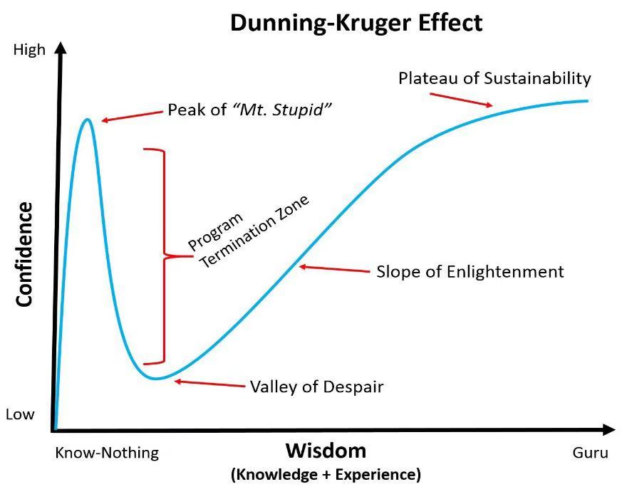

有人把这张图翻译成了中文 —— 

<!-- 这是一张图片，ocr 内容为： -->
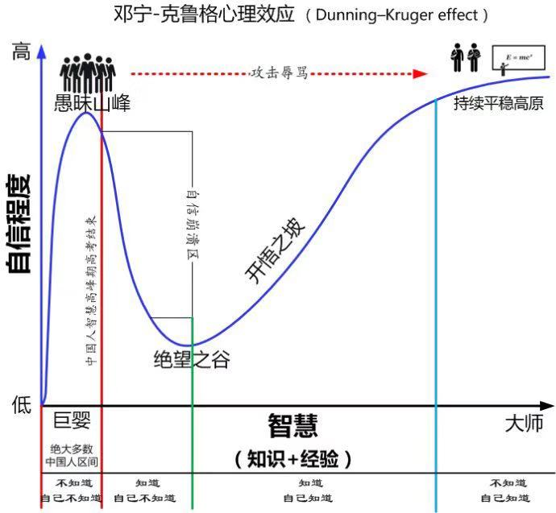

这个曲线的形状是随着技能的增长，一个人的自信心会快速到达高峰 → 快速跌入低谷 → 缓慢爬坡 → 最终达到真正的高峰。这个形状画得有点夸张。其实你对照一下邓宁和克鲁格的论文，低水平人士的自信心并不是比高水平人士还高 —— 只是比自己的实际水平高了很多而已。在幽默感这样的项目上，人的自信心任何时候都是随着能力的增长而增长的。

但是这条曲线能提醒我们，**“不知道自己不知道”是一个多么可怕的状态。你以为自己挺厉害！因为你根本看不懂什么叫厉害什么叫不厉害 —— 因为想要看懂，你首先得比较厉害才行！**

这是一个没法跟他讲理的局面。要跟他讲理，你得用事实和数据说话，但是因为他不懂，他会用自己的方式去解读那些事实和数据。而之所以这个效应直到1999年才被心理学家重视，是因为就算对自己的能力过度自信，人们其实日子也是照常这么过。可能我根本不懂足球，但是我以为我很懂足球，我总觉得中国队主教练排兵布阵有问题，那又能怎么样呢？毕竟中国队也没请我。

也许很多指点江山的人，很多自以为怀才不遇的人，其实是不知道自己不知道。

这通常没关系……除非他们真的打算靠这项技能抢银行。

如果你自信到真敢去抢银行的地步，那可就悲剧了。那就是说只有在生活中碰壁才能让你收到有效反馈！所以元认知能力差对大多数人来说也许还是一种祝福 —— 但是如果你是严肃地想学点知识，那么痛苦地意识到自己的无知，是求知的开始。

纳西姆·塔勒布在《黑天鹅》这本书里讲了一个好办法。他说人们往往过高估计自己已知的东西，同时低估了自己不知道的东西，而容易出事儿的往往是你不知道的东西。为了克服这个思维误区，你应该经常提醒自己有很多不知道的东西。

**塔勒布说你需要一个“反图书馆”。有个意大利作家，他家里有三万本书。人们经常问他，你买这么多书读的完吗？塔勒布说问这种问题的都是愚蠢的人。没读过的书比读过的书更有价值，我们家里本来就应该多放没读过的书。塔勒布建议你应该在条件允许的情况下尽量储备没读过的书，这些书就构成了你的“反图书馆”。**

你的知识越多，你的反图书馆就越大。书架上那一排排想读又没读过的书，时刻提醒你自己的无知。纽约时报有篇文章认为“反图书馆”这个词不好听，说日语里其实有一个词专门概括这个收集一大堆没读过的书的行为，叫“积读”。

以自己读过多少本书为荣，那是一种很土的行为。“积读”能让你保持智识的谦卑，书架应该是用来摆没读过的书的，为了谦卑多花点钱没关系。

根据同样的精神，塔勒布说能不能有一种“反学者” —— 专门琢磨自己不知道什么的学者，和“反简历” —— 专门列举自己没干过什么的简历。

那这样说来，我们能不能搞一种“反年终总结” —— 专门列举本公司想做、但是还不知道怎么做的项目。

反过来说，如果一个领导在总结中一说过去都是成绩，一说未来都是充满自信，我猜他可能是不知道自己不知道。

最后让我们思考一句罗素的名言 —— “**这个世界的麻烦就是傻瓜非常自信，而智者总是充满疑虑。**”

<!-- 这是一张图片，ocr 内容为： -->
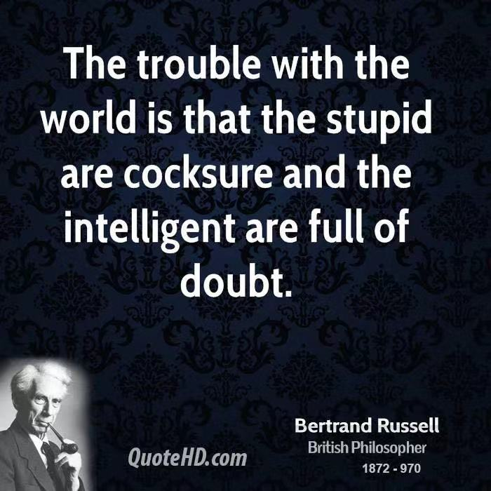

> [07｜评估：进步使人虚心，落后使人骄傲 - 得到APP](https://www.dedao.cn/course/article?id=BM30m4na5NkyKQQ2wxKjvDg7Eowd2G)
>

### 08｜处事：你躲不开政治和权力
:::color3
只要你需要跟别人一起做事，只要有地位和利益的争夺，就不可能真的躲开政治和权力。对于权力，需要有三个清醒认识：

+ 世界是讲权力的。
+ 权力跟道德没关系。
+ 想要做成大事就一定要有权力。

:::

这本书的特点是把关于权力的知识写得更系统、更容易活学活用。作为学院派，菲佛在书中引用了很多社会科学的最新研究成果。这本书大概是关于权力的最好的当前科学理解。

我先打个预防针。我们接下来的讲解不会让你感到很舒服，而且你可能会反感。这是一本讲怎么夺取和运用权力的书。你可能会觉得这些东西太黑暗了，有马基雅维利和韩非子的味道。

但我还是劝你了解一点这方面的知识。咱们先讲两个小故事。

有一位在媒体界搞技术的牛人叫潘特（Rajiv Pant），跟菲佛讲了他自己的故事。潘特曾经在一家出版社工作，跟人竞争CTO的职位，闹了一出政治斗争，结果失败了。他的对手成了他的老板，他只能离开公司。潘特想走得体面一点。他去跟曾经的竞争对手、也是现在的老板谈辞职，希望拿到比较好的离职条件。

潘特大大方方地走进对手的办公室，和和气气地谈。老板果然没为难他，谈的挺好。

但是在谈的过程中，潘特注意到对手的书架上有一本书，正是菲佛的《权力》。他意识到对方是不是就靠这本书打败了自己。

**潘特回家就买了那本书的音频版、Kindle版和纸质版，反复听、反复学，果然得到了真传。后来潘特担任过《纽约时报》的CTO，《华尔街日报》的CTO和首席产品官……他再也没输过。**

另一个故事说的是菲佛在斯坦福的一个学生，已经毕业了，有一次在超市里偶然遇见菲佛。学生说我听过你的课，你讲得确实挺好，我同意你的理论——但是，我不打算用。我们是年轻一代，我们不玩权力游戏。你知道吗？我刚刚跟几个同学成立了一家投资公司，我们已经说好了，大家就是纯粹的平等伙伴关系，绝对不搞政治！

菲佛只能说，那行吧，祝你成功。

过了几年之后，菲佛又碰到这个学生，就问他那个投资公司怎么样了。

结果学生说他已经不在那家公司了。他被合伙人给赶出来了。人家用政治手段把他算计了。

这样的事情每天都在发生。只要你需要跟别人一起做事，只要有地位和利益的争夺，就不可能真的躲开政治和权力。

我们读书人都很讨厌权力斗争，我们觉得那太肮脏了，我们希望置身事外。都是说如果你想当个好领导，你应该如何改变公司、如何培养下属等等——那都是默认你已经有权力了。

如果你没有权力怎么办？如果别人要抢你的权力怎么办？这就是菲佛研究的东西。

最最起码的一条，你得能确保自己再也不要被人赶走。

在学习具体的权力规则之前，你先要有三个清醒认识。

#### 世界是讲权力的
**世界再怎么发达，它也是分等级的。顶层的位置总是比下面的少，这叫「排位稀缺」。**对好位置的争夺永远都是零和博弈，有权力的人总是少数，任何时代、任何领域都是如此。

而且你越往高层走，权力就变得越重要。这是因为当你到了一个比较高的圈层的时候，你会发现在座的每个人都很聪明，都有很好的履历、都有过硬的技能。能坐在这儿，大家都不差。那你们之间的竞争比的是什么？难道比谁头发多吗？这时候的争夺靠的是权力游戏。

有些学者以为现代世界的权力游戏已经变了——别听他们的。

有人说现在商业都全球化了，到处都在搞「去中心化」，那权力是不是被分散了呢？事实绝非如此。现实是全球化加剧了权力和财富的集中。

还有人说现在互联网、新媒体、社交网络正在促进民主，老百姓更容易发声了，传统的权力会被削弱。其实恰恰相反。现实是传统权力非常善于使用新媒体，权力在巩固自身。

过去二三十年的经验恰恰是世界变得更不民主：像普京这样的人抓权抓得更厉害了。

所以权力远远不是过去式，也许它的外表形式稍微有所变化——菲佛这本书会重点讲新时代的权力——但它的基本规则是不变的。

人际关系总是重要的。人们决定用不用你，总是先看你有多大热情和多大能力。人们总是喜欢推举跟自己相似的人。人们总愿意跟强者结成联盟。权力的基本原理没有变。

#### 权力跟道德没关系
**很多人贬低权力，认为抓权是不道德的，这不对。如果你总反感权力，你就得不到权力，你就只能抱怨。**

权力其实是一种道德中性的工具。它跟任何工具一样，你有这个工具就能做一些事，没有这个工具就做不了，仅此而已。你可以用它做好事，也可以用它做坏事，它本身不存在道德不道德的问题。

有一本阎真写的小说叫《沧浪之水》。青年知识分子池大为，大学毕业分配到省卫生厅工作。他一开始非常看不起权力，自命清高，混得很差。后来有了老婆孩子，痛感没权真是不行，决心抓权。结果池大为的悟性还特别好，很快就得到了权力。你说这是一种堕落吗？这是屠龙少年终成恶龙吗？其实不见得。池大为获得权力以后确实做了一些好事。而且这样的事情不只发生在中国，本质上哪里都一样。

这个关键认知是善于运用权力技巧的未必是坏人。更进一步，菲佛一再告诫，在权力的游戏里尽量不要对别人进行道德评判。如果你一上来就把一个人判定为坏人，你就会发自内心地不愿意跟这个人结盟——而这是你的重大损失。权力游戏里这个人是好人还是坏人并不重要，重要的是他是你的盟友还是敌人。

现实中有很多像早期的池大为那样能力很强的好人，他们在权力斗争中都失败了。为什么？因为有一些权力动作，他们不愿意、或者不屑于去做。他们觉得只有坏人才会那样做——殊不知其实是你想要胜利就必须那样做。

所以如果你打算玩这个游戏，就最好有点体育精神：你只是一个想要取胜的player，别太上头。

#### 想要做成大事就一定要有权力
我们老百姓总觉得世界应该是公平的——这其实是个认知偏误，学者们称之为「公平世界假设（Just-world hypothesis）」。我们平时看的小说和电视剧、我们默认的世界观就是在这个世界上结果应该由付出决定，付出了就会有回报，付出越多回报越多。有权力的人也总向老百姓灌输这种思想，整天把透明、真诚、什么公开公平公正这些词挂在嘴边……其实他们最不在乎那些。

现实是，人的努力跟结果往往不成比例。有些位置能让你的努力事半功倍。为什么？因为那个位置上有权力杠杆。

你要做的是把自己或者盟友送上那个位置。撬动杠杆，你花同样的力量可以得到不成比例的成果，你才能做成大事。

当然做事本身的才能也很重要。一个毫无才能的人整天只想着抓权，这也是不对的——权力跟才能同等重要。但权力能让你把才能表现出来，让你的才能有用武之地，让你的才能被人看见，给你带来好处。

**「成功不是由你的业务表现决定，而是由你的表现对社会网络的用处决定。」**那怎么才能把业务表现化为对社会网络的用处呢？掌握权力就是个好办法。

如你所能想见，权力游戏并不好玩。权力动作往往是不自然的，不符合我们的习惯。你必须得做一些让自己不舒服的动作。所以你需要练习。

最好还有个教练或者参谋团队。你需要几个亲密朋友，他们跟你不在同一个公司，甚至不在同一个行业——这样能确保你们之间没有竞争关系。他们任何时候都站在你这边，帮你出谋划策，帮你分析言行。最重要的是，他们必须能把你推到舒适区之外，让你慎重思考选择和行动。

权力要讲控制。但是自身的选择和行动，是你唯一可以绝对控制的东西。

有一位从事地球科学研究的女科学家，因为所在领域中大部分人都是男性，一直处于一个很弱势的地位。她曾经的老板比她大二十岁，几乎是日复一日地欺负她。她感到孤立无援。

这位女科学家后来读了菲佛的书，知道了怎么抓权。她学会了用权力说话，她建立了影响力网络，她收获了自己的人马。

这的确跟「科学家」的人设很不一样，这位女科学家不但驯服了那个前老板，而且同事们都开始巴结她。她办事更顺畅，全无压力，幸福感也提升了，情绪也变得积极了。有一系列研究表明权力真的能提升人的身体健康。

**要不怎么说小丈夫不可一日无钱，大丈夫不可一日无权啊。**

不过我想提醒你的是权力有很强的腐蚀作用，可能会把人变傻 ，追求权力可能会被反噬。其实我们更崇尚「能量型英雄」，我们不想做这种勾心斗角的能耐人。但是，我们也不应该把权力让给坏人。

如果一定有人会知道权力是怎么回事，我希望是我们的读者先知道。最后我再引用一句菲佛的原话，与君共勉——**「如果你想让权力被用来做好事，就需要更多的好人拥有权力。」**

> [08｜处事：你躲不开政治和权力 - 得到APP](https://www.dedao.cn/course/article?id=dA5eO3NDrGk8KP0EwMK2oxp9MRBzQP)
>

### 09｜竞争：到底什么叫“内卷”？
:::color3
+ 内卷就是向“内”演化，越来越精细越来越复杂，其实都是几个固定模式的重复，没有能跳出模式的创造力。简单说，内卷是低水平的复杂化。 
+ 内卷不是内耗，并不一定降低生活水平。陷入内卷的人很可能乐在其中。
+ **内耗是迫在眉睫的危机，内卷是更长期的忧患。内卷给我们的教训是复杂不等于高级，更不等于先进。**

:::

“内卷化”是近几年来中文网络上特别流行的一个词，一般用于形容某个领域中发生了过度的竞争，导致人们进入了互相倾轧、内耗的状态。

典型的内卷现象包括高考，大学录取的名额有限，家长又都希望孩子上好大学，大家只好没日没夜地备考，形成恶性竞争。再比如说房价，世界其他地方的房子并没有那么贵，就是因为中国非得买房的人太多，把房价推到了离谱的程度。“**内卷”这个词如此流行，以至于现在只要看起来是让人难受的竞争，就被称为内卷：程序员 996 加个班，也叫内卷。**  

**而“内卷化”这个词之所以能这么流行，主要是“键盘侠 ”的功劳。**这些活跃在网上的国师们认为人多空间小是中国最大的问题，必然导致内卷。那如何解决内卷呢？键盘界在“内卷学”之后，又搞出来一个“入关学”：我们必须扩张，要像明朝末年满洲人进入山海关一样，用中国产品强行占领全球市场……

我们这一讲要说的是，别听这帮人胡说八道。这个所谓的内卷和入关理论没有任何新意，其实就是三个老东西：一个是囚徒困境、一个是马尔萨斯陷阱、还有一个就是我们中学课本上那一套帝国主义扩张论，都是非常简单的东西。

这帮人辜负了“内卷”这么一个好词儿。“内卷”的本意，是一个特别有意思现象，是个很别致的观察，可惜被中国民间思想家给误读了。

最早把“内卷”这个词引入中文世界的，是一位从海外回国的历史社会学家，叫黄宗智。黄宗智 1985 年出了一本书叫《华北的小农经济与社会变迁》，其中提到中国的小农经济，劳动力过多，土地又有限，形成了一个“过密化增长”。特别是黄宗智发现，单个劳动力的产出已经出现了边际生产率递减的情况。这也就是说投入到土地中的人越多，平均每个人就越穷，可以说已经是内耗了 —— 黄宗智把这个现象叫做内卷。

这也正是后来键盘侠使用的意思。我可以非常负责任地告诉你，黄宗智这个用法是错的。

“内卷”，英文叫 involution，最早的拉丁文写法还是康德发明的，跟它对应的词是 evolution，也就是演化。直观地说，内卷就是“向内演化”。

北京大学社会学系的刘世定和邱泽奇，2004 年专门写了篇论文 ，考证了“内卷化”这个概念的流变。

“内卷”作为一种现象，最早美国人类学家亚历山大·戈登威泽（Alexander Goldenweiser）从艺术角度提出来的。比如你看下面这张图，这是新西兰毛利人的装饰艺术。它特点是特别精细，看起来相当复杂，有各种细微的层次。这可是手绘的，你一看就知道花了很多功夫。

<!-- 这是一张图片，ocr 内容为： -->

**但这个复杂是一种单调的复杂。精细倒是精细，但是精细得没有太多意思。它就是几种模式不断地重复，没有什么创造力和多样性。**从事这门手艺的人，我们只能称之为“匠人”，不能叫“艺术家”。因为精细，你会觉得挺厉害，这钱花的值，但是这种艺术其实没有太多欣赏价值。对吧？

这就是内卷。向“内”演化，越来越精细越来越复杂，其实都是几个固定模式的重复，没有能跳出模式的创造力。戈登威泽说，哥特式建筑艺术其实也是内卷 —— 

<!-- 这是一张图片，ocr 内容为： -->

<!-- 这是一张图片，ocr 内容为： -->

乍一看很震撼，你们真是花了大功夫！越弄越复杂，每一个小地方都要精雕细刻，但是总是这么几下子。

简单说，内卷是低水平的复杂化。我举个例子，微雕。正常的画家都是用正常尺寸的纸笔作画，不管是写意还是写实，你欣赏的是画作内容的风格和意义 —— 而微雕，却是形式的艺术。今天你能在鼻烟壶上写首诗，明天我就要在核桃上刻一艘船，后天他就能在头发丝上写一篇文章，完了大家都得拿放大镜看……这是自己跟自己较劲。精细真是越来越精细，但是你这里只有时间花费和意志力消耗，没有创造力，你这是低水平的复杂。

****

1963 年，美国文化人类学家克利福德·格尔茨（Clifford Geertz）出了本书叫《农业的内卷化：印度尼西亚生态变迁的过程》（_Agricultural Involution_），把内卷这个概念引入了社会生活的领域。

格尔茨直接借鉴了戈登威泽的概念，他总结内卷就是「某文化达到某最终形态后，无法自我稳定，也无法转变为新的形态，只能使自己在内部更加复杂化。」格尔茨发现了印尼农业的内卷化。

印尼有个爪哇岛，土地条件很好，适合种植水稻，但是人口众多，又没有资本进来，只能让越来越多的人耕种这有限的土地。请注意人多地少并不意味着内卷，内卷有个关键特征。

随着爪哇岛上劳动力的增加，人们对土地的耕种变得更加细致了。格尔茨说，「对土地的使用变得更加错综复杂，租佃关系变得更加复杂，合作性的劳动力安排变得更加复杂」，正是这种变着法地精耕细作，「一种过分欣赏性的发展，一种技术哥特式的雕琢，一种组织上的细化」，才叫内卷化。

**而精耕细作是起作用的！**爪哇岛在人口增加的同时，每个人的生活水平并没有显著下降，「能够稳定地维持边际劳动生产率」。

爪哇岛上的人并没有陷入马尔萨斯陷阱。

这跟黄宗智说的事儿正好相反。黄宗智在《华北小农》书中明确引用了格尔茨，但是他把自己描写的那个因为人多地少导致边际生产率下降的现象叫做“内卷”，恰恰是对格尔茨的误读。黄宗智说的那个意思应该叫马尔萨斯陷阱，是马尔萨斯人口论的核心论点，是一种对人口增长速度超过土地产出增长速度的担心。黄宗智想用个新词，结果他搞错了。黄宗智在此后的著作中多次使用“内卷”这个词，都是误读。

那你可能会说这不公平！语言本来就是自由演化的，很多词汇一开始都是误读，现在既然大家都说内卷是这个意思，为什么就不能是这个意思呢？

因为那个意思没有太大意思。事实上，黄宗智和键盘侠心目中的内卷 —— 也就是马尔萨斯陷阱，为了方便区别，下面我们称为“内耗” —— 在真实世界中很少发生。刘世定和邱泽奇论证，黄宗智对整个中国农业历史的评估 —— 所谓“没有发展的增长” —— 是有问题的。即便在古代，中国农业的种植结构、产业结构、分工深化也一直都在发展。

其实这个道理很简单，内耗式的危机不会长久存在。如果你觉得这里已经都开始内耗了，没希望了，那你直接走不就行了吗？如果你说大家都走不了，那这个社会肯定是不稳定的，会出大问题。

而内卷，却是一个能够长期稳定存在的现象。

**内卷并不一定降低生活水平。内卷的关键不在于有竞争，而在于“向内演化”，是精细化，是低水平的复杂。内耗是危机，内卷却是一种无声的悲哀。陷入内卷的人很可能乐在其中，都不觉得那是悲哀。**

中国高考的确是内卷，但这并不是因为它的残酷性。彩票、诺贝尔奖、奥运冠军、电影明星，这些都是中奖者极少而“炮灰”极多的项目，但是这些项目并没有内卷化。高考的内卷之处在于考试内容呈现低水平的复杂。

如果人多名额少，选拔优秀人才的直观办法是增加难度。美国名校录取的一个重要项目是在高中开设大学课程 —— 这有点囚徒困境的意思，但是因为优秀人才可以尽量发挥，所以不能叫内卷。然而中国高考受到大纲的限制，题目如果超纲就对不起边远地区的考生，可是又要能把人淘汰掉，结果只能向大纲之“内”发展，把题目出得很怪。

学生们为了上大学不是各显神通追求长板，而是把聪明才智和大好青春消耗在做题这一件事上，这就是内卷。

“红学” —— 也就是对《红楼梦》的研究，在我看来是内卷。这就这么一本小说，一两百年来无数学者翻来覆去地发掘，你还能整出什么来呢？但是研究仍然在深入，精细还能再精细：现在已经有人拿红楼梦研究管理学、经济学、研究菜谱。

请注意，红学是内卷可不是内耗。红学家有着很好的声望，整天写书作报告，互相吹吹拍拍，日子过得很不错。曹雪芹一本书，养活了多少人。

政府部门办手续，大企业走流程，也是内卷。其实就这么简单的一件事儿，系统会把它搞得越来越复杂，你得盖很多章，你得证明你妈是你妈。办事的人一个个一本正经，给人感觉专业又正规，其实什么都不是。他们也不是在内耗，他们过得也很好。

截至清朝末年，中国人积累下来的诸多封建礼教、各种规矩、各种讲究、禁忌和迷信，形成了内卷。什么正月里不能剃头，什么风水如何，搬家应该怎么做，这都是因为人们没有新思想、没有新的事情可以琢磨，一天到晚只能把平淡的日子过得越来越精细，搞低水平的复杂。

现代人的婚礼、生日、一些节日的仪式也越来越复杂，特例变成惯例、惯例变成规矩。可你要说升华出来什么新的精神来了吗？没有。可以说正在走向内卷。

我儿子在美国上学，我才知道美国小学没有班干部。当然初中有学生组织，你可以竞选一个什么主席之类的职位，名额很少，但那不是内卷。而我在国内上小学的时候，那个班干部系统却是内卷。全班总共才五十多个人，竟然有“少先队”和“班级”两套领导班子 —— 有班长、大队长、中队长、小队长、小组长、学习委员、体育委员、生活委员、各科的课代表等等，恨不得一半学生都是干部。

**内耗是迫在眉睫的危机，内卷是更长期的忧患。**内卷给我们的教训是复杂不等于高级，更不等于先进。中国仍然在高速进步，现在并不是一个马尔萨斯陷阱局面，而且就算是，解决方案也不是“入关”。你把鼻烟壶卖到全世界又能挣多少钱？结果只能是整个世界变成一个更大的马尔萨斯陷阱。

不论是内卷还是内耗，真正的解决办法都是创新。你不是要“入关”，而是要“出关”：**你得跳出当前这个发展模式。如果到了 S 曲线的平台区，你就要寻找第二曲线 ，你要积极探索蓝海。**

而且我们都应该不断学习真正的新思想才行。把几百年的老思想用新词包装一遍再拿出来用，这也是一种思想上的内卷。

> [09｜竞争：到底什么叫“内卷”？ - 得到APP](https://www.dedao.cn/course/article?id=RQLYWyjMZoa0J1v2A5Xp4wvzDbO26B)
>

### 10｜判断：能用愚蠢解释的，就不要用恶意
:::color3
+ 能解释为愚蠢的，就不要解释为恶意。 
+ 能解释为无知的，就不要解释为愚蠢。 
+ 能解释为可原谅的错误的，就不要解释为无知。
+ 能用你未知的其他原因解释的，就不要解释为错误。 
+ 能用一群人在复杂系统中的互动解释的，就不要解释为恶意或者愚蠢。 
+ 能解释为情绪的，就不要解释为策略。 
+ 只处理事实，不猜测动机。

:::

**生活中有很多小道理，你如果不满足于一次就事论事，能把这个道理给提炼出来，取个名字，就更容易推而广之，成为一个有力的工具。比如我一说“唇亡齿寒”、“酸葡萄”，你马上就知道是什么意思，这些名词相当于是把思维套路给封装起来，方便使用。**  

现在我们经常琢磨一些博弈论的局面、心理学上的偏误、统计学上的悖论、各种思维模型，我认为这些东西应该获得像成语典故和寓言故事一样的地位，变成我们的文化基因。

如果每一个士都普及了这样的文化基因，那就不但方便交流，而且能互相提醒，大大减少犯错，促进科学决策。

**“汉隆剃刀（Hanlon's razor）”**大约是 1990 年一个叫汉隆的不著名的美国人正式提出来的，但是这个道理前人多有提及。你可以把汉隆剃刀理解成著名的“奥卡姆剃刀”的一个特殊情况。简单地说，它的意思是 —— **「能解释为愚蠢的，就不要解释为恶意。」**

比如你今天晚上有个重要的报告要在家里写，你正忙得焦头烂额。你三岁的儿子，平时不怎么找你，今天却非得缠着你，然后还打碎了一个碗。那你说他是故意挑这个时候跟你作对吗？

**当然不是。他根本不理解你要写报告，他只是碰巧今天想找你玩而已。**

为什么上次关蓉蓉过生日，邀请了好几个同事去吃饭庆祝，偏偏没叫你 —— 是她突然因为什么原因对你有意见，以后不跟你好了吗？为什么总是很快回复邮件的领导，隔了一天都没回复你那封精心措辞的关键邮件 —— 是因为他不打算继续重用你了吗？

**汉隆剃刀说那不太可能。更可能的是关蓉蓉根本没有精心准备生日聚会，那天临时说起来就跟一帮人去了；领导可能根本就没看到你的邮件。**

**汉隆剃刀说的“愚蠢”，代表各种无知的、偶然的、非故意的的原因，这些情况发生的可能性远远大于恶意。**

咱们先不用说“恶意”，真实生活中连“故意”都很少发生。比如上次你在路上正常开车，有一辆车非常蛮横地从旁边别过你超车，你要不是紧急踩了刹车可能就撞上了。你非常气愤，立即按喇叭表达了愤怒 —— 但是如果你冷静地想一想，那个人不可能是故意针对你的。他根本就不认识你，他连你长什么样都不知道。

恶意就更少了。如果你跟这个人很熟，平时关系还不错，他有多大可能性，突然对你有了恶意呢？如果你们不熟，他更没理由产生恶意。**恶意是小概率事件。**

而**愚蠢** —— 包括忘了、错了、漏了、误会了、累了、被外力耽误了、不知情，或者纯粹就是因为懒 —— **则是大概率事件**。其实我们平时很少会精心设计一个什么决策，绝大部分时候都是被惯性、被各种情绪驱动着走，遇到什么事就做什么事，浑浑噩噩根本没想那么多。但我们一般意识不到自己的愚蠢，你可能很不经意地就做了一些让人误解的动作。

而人们之所以常常会把别人的不经意动作当成恶意，是因为不会换位思考。我们总是倾向于以为世界上的各种事儿都是围绕自己进行的。你穿一身新衣服上班，设想了同事们各种反应，殊不知绝大多数人根本没注意。你看身边一个人情绪很不好，就以为他是不是在生你的气，殊不知他只是痛恨中国队为什么又输了。换一个视角，不把自己放在中心，很多事情根本就不是事儿。

我看到有人把汉隆剃刀做了推广—— 

+ **能解释为愚蠢的，就不要解释为恶意。**
+ **能解释为无知的，就不要解释为愚蠢。**
+ **能解释为可原谅的错误的，就不要解释为无知。**
+ **能用你未知的其他原因解释的，就不要解释为错误。**

我看这的确是一个一层比一层更友好，也一层比一层真实可能性更大的序列。有这样的精神，你会减少很多无缘无故的愤怒和压力，你跟他人、跟世界的关系都会更好。

比如有一天晚上你想休息了，隔壁邻居家却还在放很响的音乐。你说他是明知会打扰你、但就是不在乎呢，还是他根本就不知道你能听见音乐声？你最好假设他不知道，这样你就能友好地提醒他一下。而友好的提醒，往往更能起到好效果。

反过来说如果你非得假设邻居就是对你有恶意，那就或者你自己生闷气，或者你气冲冲地去兴师问罪，把本来不是敌人的也变成了敌人。

汉隆剃刀并不是精神胜利法，它在多数情况下反映了客观事实，而且在现代社会越来越有用。特别是理解公共事务很有用。

比如你持有的一只股票突然暴跌，你听到一些传闻，说这是有“庄家”在恶意炒作。你应该相信这样的阴谋论吗？你要知道大公司的股价其实是很难操纵的，投入很多很多资金也不能保证成功，而一旦失败就会损失很多钱。更关键的是，数学上早就证明了，哪怕市场上的每个人都是相当理性的，在没有任何新闻的情况下，这些人的互动、一番追涨杀跌，也能让股价有很大的波动。

所以金融作家道格拉斯·哈伯德（Douglas Hubbard）提出一个金融版的汉隆剃刀  —— 

**「能用一群人在复杂系统中的互动解释的，就不要解释为恶意或者愚蠢。」**

再比如说美国总统特朗普又在 Twitter 上发表了一番很奇怪的言论，那你说他为什么要那么说呢？是在为即将到来的重大行动做舆论铺垫吗？很可能不是。特朗普整天发表怪异言论。而且不光是特朗普，只要是人，只要经常说话，就难免会说一些情绪化的、没什么意义的话。政治专栏作家拉梅什·蓬努尔（Ramesh Ponnuru）提出一个大人物版汉隆剃刀  —— **「能解释为情绪的，就不要解释为策略。」**

汉隆剃刀最有价值的用法其实还不是对个人，而是对一个组织。我们为了认知方便，常常会有意无意地把一个公司或者一个政府当做一个人，假设它有自由意志。其实它最多只是一部机器。

而这部机器最擅长的是常规的项目。一个组织的目标是用有限的成本和普通的人才去做好大部分常规的事情。如果一家公司一年花两千万元就能做好 80%的事情，而要想做好剩下那 20%得再多投入八千万元，那这个公司最好的办法是放弃那 20%。

好几年前，有人偶然发现在 Google 搜索奥巴马夫人米歇尔的名字的时候，跳出来的一个图片结果居然是大猩猩。很多人表示愤慨，纷纷指责 Google 搞种族歧视！可是 Google 说我们搜索引擎是自动的！我们不可能用人力一个一个识别米歇尔的照片。

**很多时候你以为是这个组织在有意做坏事，其实更可能是它没能力杜绝坏事。**再比如说马航MH370航班失踪事件刚发生的时候，很多人指责马来西亚政府，说你们怎么管的，居然能让这种事情发生？是不是有阴谋？结果还是马来西亚当地记者比较了解自己的政府，说我们马来西亚政府真不是搞阴谋的料，我们是真管不了。

其实每个政府都这样。日常的政府操作中就已经有大量的愚蠢和错误；要是赶上什么天灾那就更是应对不及。

所以英国前首席新闻秘书伯纳德·英厄姆爵士有一段这样的话，深合汉隆剃刀的精神 —— 

「许多记者沉醉在政府阴谋论中。我可以担保，如果他们支持的是“政府搞砸论”，报导就会更准确一些。」

那你说难道世界上就没有阴谋、没有恶意吗？当然不是。但是我们必须了解，阴谋和恶意都是罕见的。超出寻常的论断需要超出寻常的证据。你必须跟这个人一而再、再而三地互动，最好直接对话，才能确定他有恶意。

而且别忘了托马斯·谢林说的 ，哪怕是像冷战时候美苏对峙那样的局面，都应该建立一个热线电话，防止误判。

因为真正的恶意攻击很不容易发生，而对恶意的误判实在太容易发生了。

归根结底，我们平时做事最好像搞科研一样：**只处理事实，不猜测动机。**人做一件事可以有好几个动机，也可能根本没动机，最常见的情况是这个人自己都不知道自己有什么动机 。与其推测动机，还不如摸清他做事的规律，跟他建立互信机制。

> [10｜判断：能用愚蠢解释的，就不要用恶意 - 得到APP](https://www.dedao.cn/course/article?id=WqavDm012GolV7OzAOVxPjEy8zdk73)
>

### 11｜规模思维：怎么发挥最大的潜能？
**规模思维模式**，Scale Mindset，所谓scale，是说把一个东西给复制、给量产、给普及、给发展壮大、给发扬光大。它不是做加法，也不仅仅是以前“机械化大生产”那种做乘法，而是最好能产生某种可积累的、正反馈的效应，实现指数式的增长。

**规模思维简单说就是，你做事得有这么一个意识：遇到什么东西，先想想它是不是可扩展的。**就算你不想当企业家，你也可以运用规模思维模式。

你得允许自己是可扩展的。看到一本好书，就应该把那个作者所有的书都找出来读一遍；听到一期不错的播客节目，就应该订阅乃至于通读那个频道；获得一个启发，就应该调研一套理论，进而形成一个习惯，乃至于让生活发生一次改变。

规模思维模式要求我们看见好东西，就好像贪得无厌的商人发现了金山的一角一样：不管它看起来是多么微小，只要你认定它有规模化的可能性，就要抓住不放，想方设法让它成长，把它的潜能给最大化。

规模思维模式

美国企业家有个流行语叫「scale」，一般翻译成「规模」或「扩展」。它本来是个名词，但是更酷的用法是把它当动词用，意思是「把……规模化」。我感觉这个词在中文世界用得还太少。

所谓scale，是说把一个东西给复制、给量产、给普及、给发展壮大、给发扬光大。它不是做加法，也不仅仅是以前“机械化大生产”那种做乘法，而是最好能产生某种可积累的、正反馈的效应，实现指数式的增长。

我们干脆搞一个大词，叫「规模思维模式」，英文是「Scale Mindset」。

规模思维模式和我们专栏常说的、美国心理学家卡罗尔·德韦克（Carol Dweck）提出的「成长思维模式（Growth Mindset）」很有关系，也跟人们爱说的「复利」有关系。成长思维模式说的是改变自己，复利强调的是回报，规模思维模式则是一种更一般的做事思路。

简单说，你做事得有这么一个意识：**遇到什么东西，先想想它是不是可扩展的。**

如果你在一家公司工作，你需要明白，公司里的很多日常事务是不可扩展的。**比如各种日常维护性、辅助性、后勤性的工作，什么工作晚宴让你去安排安排之类。这些事儿的特点是一个有两年经验的人是这么干，一个有20年经验的人也是这么干。**你的经验并不能积累起来让你有更大的发挥、取得更好的成果，你做这些事儿没有复利，不能成长。

所以山姆·奥特曼（Sam Altman）在他那篇《如何成功》 里一上来就说应该专门做有复利效应的事。这样事儿是可积累的所以是可扩展的：你越做，规模就越大；你规模越大，又做得越好。这样你就能不断地发展壮大，成长得越来越快，形成指数增长。

<!-- 这是一张图片，ocr 内容为： -->
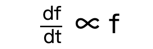

规模化一般不能只靠个人能力，必须结合某种杠杆才行。这个杠杆可以是资本、技术、品牌或者网络效应。如果单论个人能力的话，管理能力大概是可扩展的：你的管理能力越高，你就能管理更多的人、更复杂的事；而你管理了更多的人和更复杂的事，你的管理能力就会更高，你可以有规模。

所有高手都明白这个道理：**应该把主要精力放在可扩展的事物上。**

《哈佛商业评论》报道过一项研究  说，大学里90%以上的助理教授都认为课余时间应该用于科研，而不是去参加什么“教职工代表大会”之类的事情。大家非常清楚后者只能算是做家务，一帮大学老师开大会还能折腾出什么东西来……那是不可扩展的。而做好自己的研究，却能让你拿到切切实实的复利。

你不管做什么都可以有规模思维模式。你得知道扩展点在哪。发现一个可规模化的东西，你得非常激动才对。

就在四月份，OpenAI总裁格雷格·布罗克曼（Greg Brockman）做了一个TED演讲 ，讲GPT-4都能做些什么。他重点介绍了ChatGPT的插件功能，是我们专栏已经讲过的 。在这个演讲的最后，布罗克曼跟主持人有个互动，两人谈到了OpenAI是如何发现语言模型的「涌现效应」 的。

布罗克曼说我们是站在巨人的肩膀上，市面上有很多研究成果我们都在尝试……但是真正的关键突破，是来自一次非常意外的发现。

2017年，OpenAI有个工程师用亚马逊网站上的用户评论训练了一个模型，这个模型的用处本来仅仅是预测用户评论的下一个字符是什么：是逗号、名词还是动词？很简单的文本预测。

模型做好后，OpenAI想做个测试，看它能否分析文本中的情感——也就是用户对产品的这个评价到底是正面的还是负面的。结果发现这个模型对情感标记的准确率竟然超过了当时市面上所有其他的模型 ！

这非常奇怪。你要知道，这个模型本来根本就没考虑情感，它只是在分析句法而已；那些专门预测情感的模型可能会专门找情感相关的词汇来判断这段话是什么情感，可这个模型没有。然而OpenAI这个模型却恰恰最善于判断情感。研究者发现，模型中不知怎么回事儿，自动生长出了一个“情感神经元（sentiment neuron）”，你把这个神经元设为正值，模型就会生成正面评价；设为负值，就生成负面评价 ——

<!-- 这是一张图片，ocr 内容为： -->
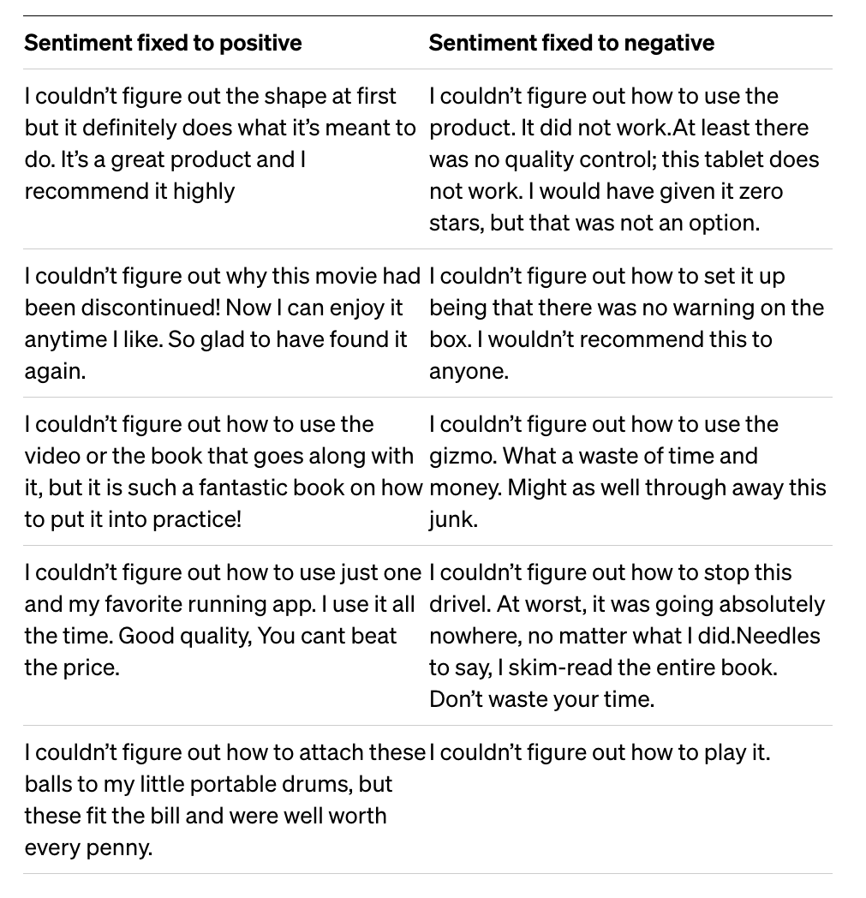

这就是「涌现」。模型分析的是句法，而情感却是语义。一个句法预测器怎么就自动产生语义概念了呢？那是不在一个维度上的东西！你看这也就是我们之前讲过的，沃尔夫勒姆说的那个神经网络模型自动捕捉到了语义的现象 。至今也没人能彻底说清这是为什么。

那是人类第一次在语言模型中见证神奇。

我还特意查了一下，这个发现是发生在关于Transformer的那篇著名论文  出来之前。看来GPT真正的关键突破还不是Transformer，而是OpenAI这次从句法到语义的涌现。这可能也解释了为什么Google发明了Transformer，可是最早做出有智能的语言模型的却是OpenAI。

那可是2017年啊，当时只有零星的报道。殊不知那是AGI的曙光。

回到我们这讲的主题，我要说的是OpenAI的规模思维模式：他们一见到这个神奇现象，马上想到把它scale ——布罗克曼的原话是「you've got to scale this thing」。

<!-- 这是一张图片，ocr 内容为： -->
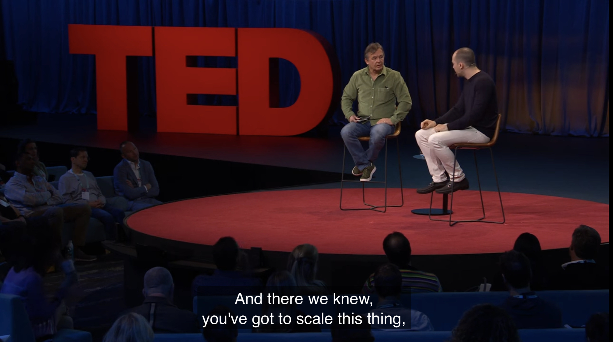

 [https://youtu.be/C_78DM8fG6E 从19分左右开始] 

这里说的扩展不是把模型规模扩大多少倍，也不是简单地把这个算法用在别的地方，而是把它的内涵发展壮大。工程上很多事情就是这样：也许我们说不清为什么句法预测能自动冒出语义来，但是我们仍然可以把这个方法推广开来。  

看到好东西就赶紧想办法让它成长。这棵小树本来是棵苹果树，怎么就突然长出钱来了呢？那我们就赶紧好好研究它，看看能不能弄出摇钱树来 —— 这就是规模思维模式的精神所在。

企业家做事不能日复一日地干同样的活，也不是碰运气挖宝藏，而是去寻找一颗神奇的种子，好好培育这颗种子，让它长起来，产生规模效应。你得对「可扩展」非常敏感才行。

很多传统商业是难以扩展的。比如开餐馆，如果你想靠厨师的手艺吸引顾客，那就几乎是不可扩展的。你这个厨师再厉害，一天也只能做这么多盘菜。除非你让他把手艺传授给很多徒弟——可是如果手艺那么容易传授，那就只能标准化，那就不是什么高级手艺。肯德基连锁店卖的是方便和品牌，不是手艺。

医生也是这样。现代医学的知识和操作方法已经尽量标准化了，但是好医生还是非常稀缺，因为你不能只会走流程，你需要经验和头脑，甚至需要创造力。每次提供服务都需要针对客户具体情况定制的行业，像律师、咨询顾问，也很难扩展。还有传统制造业，你是可以量产，但是因为你必须使用人的劳动力，你需要原材料和机器厂房，你的边际成本相当高，也就难以肆无忌惮地规模化。这就是为什么传统企业家不太说scale这个词。

但是新一代企业家很喜欢谈论scale。这是因为计算机和互联网时代涌现出了一批边际成本很低的产品和服务，像软件、网络服务，更不用说平台……都是规模越大，增长速度就越快、效益就越高。

但并不是什么东西都能scale。**服务业在传统上就是难以规模化的，因为你必须得用人，可是最优秀的人只有这么多。**王煜全老师这几年讲，是AI的出现，给「服务业规模化」提供了可能，因为它可以把人类最优秀的经验固化下来，变成可复制的。  

反正企业家得有这个眼光：**看到任何东西，先想它的上限有多高，我能不能把它扩大5000倍。**

规模思维模式不仅限于商业。任何事业要想发展壮大，背后都是这个数学原理。

我觉得一个有意思的案例是中国共产党是怎么夺取政权的。有本书叫《解放军为什么能赢》，作者是徐焰，以前罗胖专门讲过 。这本书里就有规模思维模式。

比如带兵打仗，蒋介石注重“将”，喜欢办军校和训练班，专门培养将官。蒋介石的名言是“打仗就是打将”，把兵当成消耗品，前期花钱招兵，后期干脆抓壮丁。而且蒋介石用将还喜欢用自己的同乡，讲嫡系。用我们这一讲的语言来说，蒋介石这一套是non-scalable的。

毛泽东却是注重“兵”，名言叫“兵民是胜利之本”。有意思的是红军是不发军饷的，可是不但有源源不断的兵源，而且士兵个个以牺牲为光荣。这是为啥呢？哪怕你别的都不谈，单论企业家精神，这是因为毛泽东发明了一套可扩展的系统。这个系统给士兵许诺了长远的家庭利益——革命成功分土地——是蒋介石所无法提供的。

徐焰说，后来在抗日战争和解放战争时期，中共学会了对外不搞意识形态、也不搞极左的东西，而是讲爱国、讲经济，跟老百姓切身利益结合，这就scalable了。比如在内战关键时刻，共产党在国统区的运动口号是“反内战”“反饥饿”“反迫害”，讲的是所有中国人的最大公约数，可扩展性当然高。就算你不喜欢列宁主义，我反饥饿你总得支持吧？这就实现了毛泽东说的“把朋友搞得多多的，敌人搞得少少的”。

换句话说，在夺取政权的过程中，中共是一个能容纳指数增长的平台。

就算你不想当企业家，你也可以运用规模思维模式。

你得允许自己是可扩展的。看到一本好书，就应该把那个作者所有的书都找出来读一遍；听到一期不错的播客节目，就应该订阅乃至于通读那个频道；**获得一个启发，就应该调研一套理论，进而形成一个习惯，乃至于让生活发生一次改变。**

规模思维模式要求我们看见好东西就好像贪得无厌的商人发现了金山的一角一样：不管它看起来是多么微小，只要你认定它有规模化的可能性，就要抓住不放，想方设法让它成长，把它的潜能给最大化。  

> [11｜规模思维：怎么发挥最大的潜能？ - 得到APP](https://www.dedao.cn/course/article?id=e1k8gp2WGMzqJ3mzAqK5YmP6DOjxAL)
>

### 12｜策略思维：怎么找到最好的解决方法？
「**策略思维**」，是一种引导自己寻求策略的思维习惯。这是一种元认知能力，你要经常自己审视自己。

如果你正在按照某种策略做一件事情，比如说使用某个方法学英语，你做着做着就会问自己：我有没有什么办法，能做得更好呢？我能不能再帮助自己一下？还有没有别的方法？你对方法很敏感，而不是一条道走到黑。

而且要注意，读书多、懂一大堆策略的人未必有策略思维模式。**策略思维模式说的是你拿策略做什么，你得经常尝试、评估、调整和改进策略，你是在切切实实地寻找最适合自己把这件事做好的策略。**

**策略思维模式不是一种学问，而是一个习惯。**

策略思维模式

这一讲咱们说一个关于在学习、生活和工作中使用策略的新研究。“策略”是个挺大的词，你用过策略吗？我天天都在思考策略问题。  

嗯……这是因为我天天都在看网络小说。我是一个网络小说的爱好者，我喜欢英雄的故事。我关注的有一个人穿越成了宋朝皇帝，正在指挥抗金作战，有一个人在能修仙的唐朝开了个上市公司，还有一个人在奇幻世界里当真神。我每天看他们使用各种策略。

现在网络小说不论是在精彩程度、想象力还是还原历史的精确性、甚至思想的深度上，都已经到了很高的水准。不过这种每天连载的叙事形式确实有一个天然的限制，那就是为了不断给读者提供“爽点”，剧情会不真实。

当然作为小说家你必须把每一个爽点都设计得合情合理，让读者感到单点都很真实。但是综合下来，在统计的意义上，一个人不可能接连不断地遇到那么多爽点。比如说，小说主角可以被人欺负，但是他们几乎不犯错。这是因为读者对主角有代入感，被欺负了将来正好反击，是爽点的前奏，而自己犯错是很不爽的。特别是，他们不犯策略性的错误。他们是天生做大事的人，每一次战略选择都符合天下大势，每一个布局都是深谋远虑。主角要是连着做好几天傻事，读者就不跟了。

但是真实世界的英雄有连着做傻事的时候，有因为犯下错误而懊悔、又因为懊悔而进步的时候。

曾国藩的“天生”，就不像是做大事的人。从小刻苦读书，一心想要考科举出人头地，结果因为只会死记硬背，写出来的东西“文理欠通”，六次落榜还让人给“悬牌批责”，这哪里有主角光环呢？是后来他改变应试策略，仔细研究了人家的范文，认识到文章需要大局观和气势，才找到科举的门道。

进入官场，曾国藩又想要当圣人。这回大局观和气势都有了，对国家大事的见解都对，但是跟同事关系不好，仗着自己对，做事喜欢硬碰硬，结果处处受排挤。把皇帝都得罪了，兵权也没了，差点错过青史留名的机会，几乎就是一个官场潜规则的牺牲品。是后来痛定思痛，偶然读书读出来新感觉，改变处事策略，学会从他人角度考虑问题，才有了把事都办成的可能性。

曾国藩打仗的策略也是改出来的。好不容易练成一支强军，想来个首战必胜主动出击，结果遭遇惨败差点自杀。后来曾国藩总结出来的作战方针居然叫“结硬寨，打呆仗”，我估计岳飞要是听说都被他气死了，但那恰恰是曾国藩找到了最适合自己、也最适合当时情况的策略。

**使用一个策略，不行，换个策略再试，这个思维模式，是小说里的主角没有，而你值得拥有的。**

新加坡国立大学的帕特丽夏·陈（Patricia Chen）等研究者刚刚在《美国国家科学院院刊》（PNAS）上发表了一项有可能是重量级的研究 ，提出了一个概念，就叫“策略思维模式（strategic mindset）”。

“思维模式”这个词可能让你立即想到我们熟悉的“成长思维模式（growth mindset）” 。事实上成长思维模式理论的发明人，卡罗尔·德韦克（Carol Dweck），正是帕特丽夏·陈这篇论文的共同作者。我的理解是陈在斯坦福大学跟德韦克做过几年博士后，后来去新加坡做了教授，德韦克可能是她的老师。这样说来“思维模式”是有师承的。

所谓“策略思维模式”，是一种引导自己寻求策略的思维习惯。这是一种元认知能力，你要经常自己审视自己。你正在按照某种策略做一件事情，比如说使用某个方法学英语，你做着做着就会问自己：我有没有什么办法，能做得更好呢？我能不能再帮助自己一下？还有没有别的方法？可能你用了一阵儿每天背 20 个单词的方法，感觉这么学好像进步速度太慢，就主动改成了每天拿出专门的大块时间背 500 个单词的方法。你对方法很敏感，而不是一条道走到黑。

这是思维模式，而不仅仅是思维。读书多、懂一大堆策略的人未必有策略思维模式。策略思维模式说的是你拿策略做什么，你得经常尝试、评估、调整和改进策略，你是在切切实实地寻找最适合自己把这件事做好的策略。《三国演义》里的诸葛亮奇计百出，但是因为他几乎是算无遗策，从来没有因为遇到挫折而改变策略，我们只能说他会很多策略，不能说他有策略思维模式。曾国藩是人不是神，他曾经好几次通过调整策略而取得成功，我们可以说曾国藩有策略思维模式。

**策略思维模式不是一种学问，而是一个习惯。**

研究者用调查问卷的方式测量了不同类型受试者的策略思维模式分数，发现这个分数可以预测这些人对策略的调整使用；而人们对策略的调整使用，又的确对最后的结果有正面影响。

比如说，那些在测试中得到比较高的策略思维模式分数的在校大学生，在接下来的一个学期里，的确比其他学生尝试了更多的学习方法。然后他们期末的成绩也的确更高。

成年人也是这样。如果你有一个长期的目标，比如说健身、掌握一门计算机语言、或者取得一项职业成就，策略思维模式会让你更愿意系统性地监测自己的进展，更容易意识到哪里有问题，然后积极寻找改进策略。

为了把“有策略思维模式”和“知道很多策略”的效果给区别开，研究者特意设计了一个没有人擅长的实验项目：把鸡蛋的蛋清和蛋黄分开。这件事儿大家以前都没做过，但是结果显示，有策略思维模式的人更愿意尝试不同的处理方法，并且取得了更好的成绩。

有些有策略思维模式的人不管干什么都想想策略，他们非常在意自己正在使用的这个策略到底行不行，时刻进行评估，特别愿意改进。这些人对策略简直有一种“生活黑客”的精神，可以说是“策略黑客”。陈等人的研究证明这些人做事确实有章法，而且确实有好作用。

这篇论文没有给出太多数据，我们无法评估策略思维模式提高成绩的作用到底有多强，只能说效果是显著的。我们也不知道相对其他的一些“成功者素质” —— 比如说智商、性格外向、成长思维模式、抗打击能力这些 —— 策略思维模式是不是更重要，我设想这种横向比较非常困难。

前几年流行的一个概念叫“坚毅力”（Grit），意思是对所从事的事业充满热忱，同时遇到挫折又能坚韧不拔。坚毅力一度被宣传成了成功者的最关键素质，但是后来有很多争议 。坚毅力理论的发明人安杰拉·达克沃思（Angela Duckworth），也对策略思维模式理论表示了欢迎 。达克沃思认为坚毅力说的是如何达到一个非常非常长远的目标，而策略思维模式说的是达成不管是长期还是短期目标的手段。帕特丽夏·陈自己在论文里也说，策略思维模式和坚毅力是一个互相补充的关系。

不过以我之见，心理学的这些流行课题，似乎反映了某种趋势。到底什么是成功者最重要的素质呢？以前的热门课题，像自控力、坚毅力、成长思维模式、抗打击能力 ，强调的都是你要对准一个方向，排除万难勇往直前。那些励志口号都是什么“自律就是自由”、什么“未来的你，一定感谢现在拼命的自己”之类。这些说的基本上都是向前的动力，相当于汽车的油门。

但是开车不能总踩油门啊。现在流行的课题，像我们专栏前面讲的“智识谦逊”  和这次的策略思维模式，则相当于是方向盘和刹车：**你光努力还不行，你努力的方向和方法得合理才行。**考虑到现代社会越来越复杂，有越来越多的人进入对工作有自主权的创新阶层，我敢判断，未来人们会更重视方向盘和刹车。

其实说起来这些都是老生常谈的道理，现在心理学家的贡献是明确它们到底是什么意思，并且验证它们的有效性。比如说，你说策略思维模式是一种天生的素质呢，还是一个可以学习的习惯呢？心理学家要是不研究你就不好说。陈这项研究专门做了实验，结论是哪怕阅读一篇讲策略思维模式的文章，都能让人增加策略思维的意识，并且在紧接着的任务中尝试了更多的方法。希望我们这篇文章能对你有这样的作用。

最后，你可能想测试一下自己的策略思维模式强不强。这篇论文中使用的问卷调查题一共有六道 ，但是我看他们设计的不是很高明，六道题其实都是同一个意思，比如前三道题是 —— 

> 1. 当你做某个事情困住了的时候，你有多经常问自己：“我做什么能帮助自己？”
>
> 2. 当你感到自己没有取得进展的时候，你有多经常问自己：“还有没有更好的方法？”
>
> 3. 当你感到沮丧的时候，你有多经常问自己：“我怎么做才能做得更好？”
>

剩下的分别是遇到挑战、挣扎和困难，也都是问自己能不能改变策略。请你按照 1 分到 5 分做自我评估，然后算个总的平均分。**陈的研究表明，你在测试题的得分每增加一分，实际的策略认知能力就增加大约 0.4 到 0.6 分。**如果你的分数低，你应该仔细研读这篇专栏。

> [12｜策略思维：怎么找到最好的解决方法？ - 得到APP](https://www.dedao.cn/course/article?id=Ozpeyw8lG6QaXknoBEJRd1ZoA75NLB)
>

### 13｜系统思维：怎么理清各个东西之间的关系？
「**系统**」，关键就在于它不仅仅是一大堆东西简单在一起，而必须是这些东西之间要存在强烈的关联。你把其中任何一个东西弄得再明白也没用——**你必须理清各个东西之间的关系，才能解决系统的问题。**

谁应该学习系统思维呢？首先是管理者，特别是政府官员。不懂系统论，如果去制定政策，必然会犯大错。但是哪怕你只管理自己，也需要一点系统论。亚当斯就把自己的写作和漫画事业当成一个系统。每个人都可以把自己的学习、工作和生活当做几个系统，来管理。

系统思维的反义词，是“线性思维”。所谓线性思维，就是简单明了的因果关系——既然这有这么一个结果，就一定有一个原因，只要解决了原因就能解决问题。

线性思维考虑的是一个点，系统思维考虑的是很多个不同的点，以及这些点之间的关系。

**线性思维和系统思维**

生活中有些问题虽然严重，但其实是简单的。

比如现在有一个新型病毒爆发了，十分紧急，解决问题的方法就很简单。一方面你要让科学家去找这个病毒的抗体，另一方面你要控制感染源，把感染者集中起来。病毒是个“坏人”，你要做的就是把坏人杀死。

再比如说，有个本来成绩很好的球队，最近的成绩非常不好。这是怎么回事儿呢？你一看是新来的主教练不行，于是换了个主教练，球队成绩马上就上去了。

**像这种有明确因果关系的问题就是简单问题。**它们的共同点是其中有个“坏人”。消灭坏人，问题也就解决了。

可是中国足球的坏人是谁呢？是打假球的球员和裁判吗？是主教练吗？是足协主席吗？这些人都已经换过很多遍，中国足球始终不行，最近连越南都不如了。那中国足球问题到底是个什么问题呢？

答案是中国足球是一个“系统”。系统性的问题不能用“除掉坏人”这种思维解决，你必须有“系统思维”。

#### 什么是系统
所谓系统，就是一个由很多部分组成的整体，各个部分互相之间有联系，作为整体又有一个共同的目的。人的身体、学校、公司、国家，都是系统。系统有三个特征。

+ **系统里有各种元素，也就是各个部分。**比如学校系统，其中有老师、有学生，有教室、有操场，这些元素是系统的组成部分。组成元素是一个系统最明显的东西，而也可能是最不重要的东西，因为它们常常是可替换的。正所谓铁打的营盘流水的兵，学生来了又走，老师、校长都可以换，而学校还是这个学校，系统还是这个系统。
+ **系统中各个元素之间，有各种关系。**这些关系可以是上下级的命令、谁和谁合作、谁向谁汇报，也可以是规则、物理定律。元素可以随时调换，但关系通常是不变的。所以真正要理解一个系统的运行机制，你就要了解它的关系结构。
+ **系统还有一个功能，或者说是一个目的。**比如学校的功能就是教育学生。系统的功能往往是不明显的，有时候表面上有个功能，实际上还有个功能。比如学校系统，表面上看，它的目的应该是教育学生；但实际上，它的目的也许是考试能力训练，或者纯粹是为了赚钱。

中国足球这个系统的目的是什么？到底是为了让国家队取得好成绩，还是为了发展足球产业、让中国人民享受足球呢？如果是前一个目的，就应该不惜一切代价保证国家队的水平。如果是第二个目的，就应该好好建设中超联赛，请最好的外援，把中超联赛变成世界五大联赛之一。我们看中国足协的各种做法，你很难判断它到底是个什么目的。

目的不明确，系统就可能出问题。再进一步，组成系统的各个部分的目标，有时候和系统的总目标是不一致的。而很多问题恰恰是出在这个不一致上。可能一个公司里有人想的是把公司做大做强，有人想的是多发点工资。把这些目标协调好，系统才能良好运行。

#### 线性思维不行的时候
系统思维的反义词，是“线性思维”。所谓线性思维，就是简单明了的因果关系 —— 既然这有这么一个结果，就一定有一个原因，只要解决了原因就能解决问题。手机没电了，你去充电就行了。这儿有个坏人，那你就把坏人抓起来。线性思维就是这么直来直去，适合我们一开头说的那些简单问题。

请原谅我还是用中国足球打个比方。国家队有个长期的问题是“锋无力”。为什么中国国家队没有优秀前锋呢？这是问题本身，还是中国足球其他深层次问题表现出来的一个症状呢？

如果这就是问题本身，那咱们多培养几个好前锋就行。可这个问题很可能只是一个症状。中国前锋不行，根本原因是他们在联赛里打不上主力，联赛中都是外援担任前锋。那为了培养自己的前锋，是不是应该干脆禁止外援前锋？

这就是说线性思维有时候解决不了问题。比赛输了，真的不是因为武磊的单刀球总不进 —— 武磊不是坏人。专门针对一个症状下手解决不了真正的问题，线性思维相当于头痛医头脚痛医脚。

系统论的专家认为，**如果出现以下症状，那这个问题恐怕不是线性问题，而是系统问题**：

>  看似是个小问题，但是要解决它却要耗费许多资源；
>
>  多次试图解决一个问题，却总是无效；
>
>  问题本来应该容易解决，可是人们故意不解决；
>
>  公司上下似乎有个情感障碍，对这个问题避而不谈；
>
>  新人来了就发现问题，老人一笑了之；
>
>  类似的问题一再发生，整改了也没用……
>

比如最近一个新闻热点是东北雪乡宰客。不是一次两次的事儿，就好像都成一个规律了，甚至还流行一句话叫“投资不过山海关”，作为一个东北人我听了非常难过。**像这些问题就是系统问题。振兴中国足球和振兴东北，就好像小孩不爱学习、夫妻关系不好、减肥一再失败一样，不是说换两个官员、把某个部门整顿一番、一份痛哭流涕触及灵魂的检讨、过完年来个新年新气象就能解决的。**

面对系统问题，千万不要说什么快速解决，也不是拨多少款的事儿。解决系统问题的出发点，是你得抓住两个关键点。

#### 正反馈和负反馈
思考系统的时候，有几个概念需要特别重视。

+ “ 库存（stock） ”，系统里面某种东西的保有量。比如你考虑一个挣钱的系统，库存就是你挣了多少钱。如果是科研系统，库存就是你手里有多少个正在干的项目。库存有“输入（inflow）”和“输出（outflow）”，输入增加库存，输出减少库存。库存可以是任何东西。比如夫妻感情系统，库存就是两个人共同积累了多少正面的感情。**输入是互相之间亲密的表示，可以增加库存；输出是各种争吵和矛盾，会消耗情感库存。如果情感库存见底了，婚姻系统就很危险了。**所以评估一个系统，首先要考虑它的输入、输出和库存。输入输出影响库存，库存也会影响输入输出。

<!-- 这是一张图片，ocr 内容为： -->
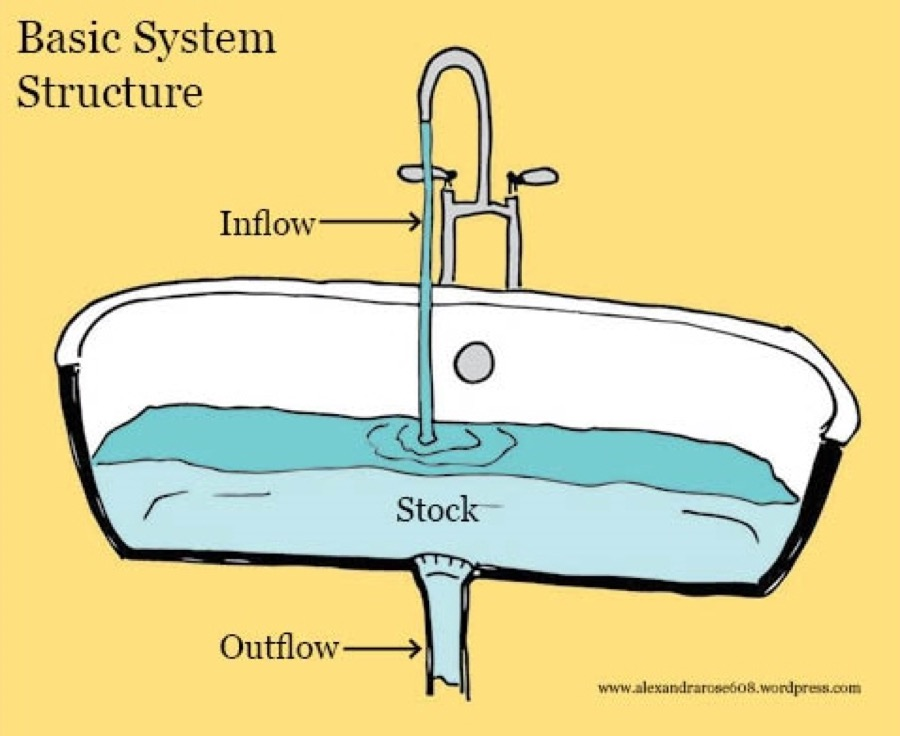

+ “ 反馈回路（feedback loops） ”。反馈回路分为两种，它们是库存和输入输出之间的关系机制。
    - **正反馈回路，也叫自增强回路**。所谓正反馈回路就是库存里的东西越多，输入就会越大，于是就会进一步增大库存。比如挣钱，就得靠正反馈回路。你的钱越多，投资产生的利润就越多；利润越多，你的钱又会进一步增多。投资 — 挣钱 — 投资，这就是一个正反馈回路。导致系统崩溃的往往也是某种正反馈回路。就比如夫妻关系，情感储备越少，看对方就越不顺眼；看对方越不顺眼就越容易发生冲突，结果就是情感储备进一步减少。这不是“正能量”，但是也是“正的”反馈 —— 因为有个叫愤怒的东西在增长。
    - **负反馈回路，也叫平衡回路**。负反馈不等于负能量 —— “负”的意思是“减少”。当库存太多了，负反馈回路负责减少库存。比如国家看谁太富了就多收他点税，看谁太穷了就给他发点钱，家里看老婆情绪不对就赶紧哄哄，这都是负反馈回路。负反馈总是让系统回到“正轨”上来。

一个系统中可以有若干个正反馈和若干个负反馈回路。正反馈回路让系统或者增长、或者崩溃，是要偏离平衡；负反馈回路则尽力保持系统的平衡。

对你想要解决的这个问题而言，可能就有一个回路，正在起主导的作用！

如果你能发现在系统里起主导作用的回路是什么，你就抓住了系统的主要矛盾，你就找到了问题的关键所在。

<!-- 这是一张图片，ocr 内容为： -->
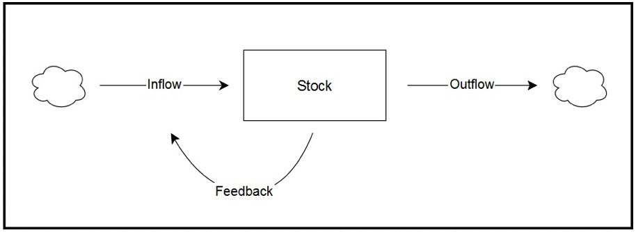

> 系统思维最基本的概念：系统的组成，包括元素、关系和目的。
>
> 解决问题的关键是识别系统的库存、输入和输出，特别是要发现其中的正反馈和负反馈回路。
>
> 有了这些概念，下面我们就可以展开具体的应用。
>
> 谁应该学习系统思维呢？首先是管理者，特别是政府官员。不懂系统论，如果去制定政策，必然会犯大错。
>
> 但是哪怕你只管理自己，也需要一点系统论。亚当斯就把自己的写作和漫画事业当成一个系统。每个人都可以把自己的学习、工作和生活当做几个系统。
>
> 比如说减肥吧。库存是体重，输入是你吃进了多少卡路里，输出是运动和锻炼身体。
>
> 这个系统里有反馈回路。**吃得越多就越贪吃，这就是正反馈回路。体重增加了想节食和锻炼，这是负反馈回路。健身会产生愉悦感，越经常健身的人越喜欢健身，这是负反馈回路内部的一个正反馈回路。**
>
> **抓住反馈回路，你就抓住了解决系统问题的关键。**
>

> [13｜系统思维：怎么理清各个东西之间的关系？ ](https://www.dedao.cn/course/article?id=Ay7GQpR6ndOgX6krAmK8eBvPzMN4lw)
>

### 14｜成长思维：怎么靠简单心法提高成绩？

**成长思维**，来自斯坦福大学心理学教授卡罗尔·德韦克的理论。德韦克认为，人对智能的思维模式可以分为两种。一种是所谓“**成长思维模式（growth mindset）**”，就是你认为学习不在天赋，而在于努力，只要努力用功，什么东西都能学会。另一种叫“**固定思维模式（fixed mindset）**”，就是你特别相信天赋的作用，擅长的东西就是擅长，要是不擅长怎么学都没用。

固定思维模式的人，在面对一个任务的时候，会认为这个任务是对他个人能力的一种测试。比如让他考试，他会认为考试是证明他行还是不行。他非常担心万一搞砸了别人就会质疑他的能力。他很容易把任务当成威胁。

而成长思维模式的人，则会把任务当成一个学习的机会。他并不是通过任务来证明什么，而是通过任务来提高自己。他把任务当成机会，结果他的表现会好得多。

所以德韦克认为，**成长思维模式，有利于人的成长。有这种思维模式的人会乐于挑战新的任务，更高的难度，这对提高水平至关重要。**

假设你是一位老师或者家长，你有孩子正在上中学。在学年刚开始的时候，你让孩子看了一段25分钟的视频。20天之后，你又让孩子看了视频的下集，也是25分钟。仅此而已。结果到学年结束的时候，孩子的学习成绩，就有一个切实的提高。这简直是像魔术一样的效果。你相信吗？  

斯坦福大学心理学教授卡罗尔·德韦克（Carol Dweck）的“思维模式”理论。这是德韦克的招牌理论，我认为她将来去世以后可以把这个理论刻在墓碑上。

德韦克的理论说，人对智能的思维模式可以分为两种。

+ **“成长思维模式（growth mindset）”，你认为学习不在天赋，而在于努力，只要努力用功，什么东西都能学会。**
+ **“固定思维模式（fixed mindset）”，你特别相信天赋的作用，擅长的东西就是擅长，要是不擅长怎么学都没用。**

<!-- 这是一张图片，ocr 内容为： -->
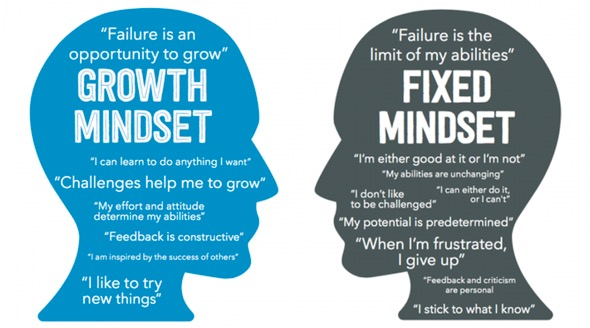

德韦克证明，成长思维模式，有利于人的……成长。而且她还建立了因果关系，也就是说只要你能向一个孩子灌输成长思维模式，你就能促进他的成长。

有一个研究说，如果你系统性地把学生的思维模式给固定化，他们的整个学业都会发生明显变化。

咱们中国的教育系统默认每个孩子都有可能上大学，一直到高中，大部分人都是奔着大学去的，无非是最后能不能考上。而有些国家则是很早就把学生强行分流。比如波兰，学生到了一定年级之后，如果有关当局判断他不是上大学的料，将来应该去当个蓝领工人，他就会被送到职业学校去。

那我们设想，这些被判定“不是学习的料”的孩子，他们会是什么心态？等于是被强行设定了“固定思维模式”。结果他们的学习成绩果然直线下降。有研究者认为美国基础教育之所以搞不好，也跟很多家长一开始就不打算让孩子上大学有关。

思维模式还会影响人们对工作中各种挑战的态度 。

+ **固定思维模式的人，在面对一个任务的时候，会认为这个任务是对他个人能力的一种测试。比如让他考试，他会认为考试是证明他行还是不行。他非常担心万一搞砸了别人就会质疑他的能力。他很容易把任务当成威胁。**
+ **成长思维模式的人，则会把任务当成一个学习的机会。他并不是通过任务来证明什么，而是通过任务来提高自己。他把任务当成机会，结果他的表现会好得多。**

而且思维模式是可以被外界影响的。有一个著名的例子 。有一年，普林斯顿大学给刚入学的大一新生增加了一项考试。普林斯顿大学是美国最好的大学之一，这些人好不容易进来，可以说是优中选优的幸运儿，但是没想到，学校居然又给了个考试。

当然这次考试的真实目的其实是做个心理学实验。学校对一半的学生说，考试是为了确认他们是否真的够资格上普林斯顿。对另外一半学生，学校说的是你们能上普林斯顿已经很厉害了，但我们还要看看你到底有多牛，这些题比较难，看你能做到什么程度。

结果，第一组学生只答对了70%的题，而第二组的学生答对了90%的题。仅仅是考试前对心态的一个简单影响，就有这么大的作用。

所以思维模式确实神奇啊。我觉得一个有意思的问题是，明明有大量的研究证明，人的智商是很难提高的，那为什么相信成长思维模式就真的能让人表现更好呢？**我理解，智商真的是很难提高，但是学习成绩和人生的成就真的是可以提高。人的表现毕竟不仅仅是智商决定的，努力也很重要。**

一个成绩一般的学生，因为偶然的机会看了两段视频，得知人的智能是可以成长的……从此他的心里就埋下了成长思维模式的种子。他从此奋发，取得了显著的进步。我们可以给孩子讲讲，人要有成长的思维模式、人的智能是可以改变的。

我看了研究报道，第一时间跟我的儿子进行了一番对话。我问他，你说聪明的人是天生聪明呢，还是学习了之后变得聪明？我儿子马上说是学习之后变得聪明。他说，李白不就是听了铁杵磨成针的故事才开始努力学习的吗？我一看还行啊！

最后我给你讲一个特别简单、但是肯定更有效的灌输成长思维模式的方法。这个方法也是德韦克本人发明的，比看视频麻烦一点，但是效果会好得多。

**你的小孩完成了一项任务，比如说考试考得不错，或者作业写得好，你就要给他一个口头的表扬。这个表扬方式非常关键，你要字斟句酌。**

如果你表扬孩子聪明，“这题你都会做？我儿子太聪明了！” —— 他就会陷入固定思维模式之中。他会把以后每一项任务都当成证明自己聪明或者不聪明的测试，他会非常害怕被证明不聪明，他会尽量选择简单的任务。

**所以你一定一定，要表扬他努力。“不错啊！这次做得很好，看来你下了很大功夫，很努力！下次继续！只要你努力，你就什么事都能做成！”**

德韦克的研究表明，这么说，你才能在他心中埋下成长思维模式的种子。他会把每一项任务都当成成长的机会，他会愿意花更长的时间钻研难题，他会主动选择困难的任务。

> [14｜成长思维：怎么靠简单心法提高成绩？ - 得到APP](https://www.dedao.cn/course/article?id=89GEyP73eprvKBPD9eJq2Mb0kRD64d)
>

### 15｜上游思维：怎么才能有自主感？
**具备上游思维，就要做到两点：第一，在别人看不见问题的时候，你得能够发现问题；第二，不是你的事儿，你也要当做你的事儿。**这才是上游思维。

上游思维还需要你有资本，这个资本叫做“余闲”。要想获得余闲，一个办法是把远虑包装成近忧的样子，第二个办法是更根本性的办法，主动创造余闲。 要懂得，**高水平工作需要浪费时间，创造性劳动需要没用的成分，上游思维需要气定神闲。**

**“士”与上游思维**

我们把治未病、防患于未然的思路称为“上游思维”。

如果问题已经很严重了，你再手忙脚乱地去补救，那就是“下游思维”。

上游思维这么好，那为什么绝大多数人一天到晚忙忙活活，甚至是疲于奔命，都是在做下游的事情呢？因为跟下游相比，上游思维有三个不利之处。

+ **下游问题是显而易见的；而上游问题不容易被看出来。**
+ **下游问题的责任非常明确，该是谁的事儿一清二楚；而上游问题没有明确的责任人。**
+ **下游问题都比较紧急，不解决不行；而上游问题常常是“重要而不紧急”的。**

先说前两点，发现问题和为问题负责。

你有上游思维。你认为这里有个隐患，但是别人可都觉得没问题。而且就算有问题也不是你的问题。你作为一个旁观者，想要去解决一个在别人看来不存在的问题，你说这得有多难。

没有人要求你去做，也不是你应当做的事情，它不紧急但很重要，所以你主动要求去做，这才叫上游思维。

由此观之，有上游思维的人，恰恰就是我们中国人所谓的“士”。士有一种责任感，士总是积极主动。我是国家的栋梁，我是社会的中流砥柱，你们说我多管闲事，我偏要管。

鲁迅先生说，“**我们自古以来就有埋头苦干的人，有拼命硬干的人**”，这两种人更像是在下游解决问题的人 —— 鲁迅说“有为民请命的人，有舍身求法的人”，我看后面这两种人更像是有上游思维。他们不是在解决别人给指定的问题，他们是没事找事。

没事找事的最大难点就在于本来大家都认为“没事”。

再比如说性骚扰。上世纪六七十年代，美国人的观念中，职场性骚扰被认为是正常的。有人公然在书里就写，职场女性应该把性吸引力当做找工作的优势！

美国没有妇联。美国政府没有号召人民跟性骚扰作斗争。美国人民也没关注性骚扰。是1975年，有一个叫林·福莱（Lin Farley）的记者，说这不对。“性骚扰”这个名词就是福莱发明的，她想要通过这个名词让人们意识到性骚扰是一个问题。

我们可以想见，福莱可能会面对社会压力。你为什么不坚持正面报道呢？你为什么非要讨人嫌呢？因为福莱是个为民请命的人。福莱发明了一个问题。然后人们意识到这真的是个问题，才会想办法解决问题。

鲁迅说“从来如此，便对么？”上游思维要求你有这样的质疑精神。不过质疑并不是都意味着非得拼命硬干，有时候能意识到有问题，就已经成功了一半。

1999年，美式足球职业联盟的新英格兰爱国者队来了一个新队医。当时球队受伤情况很普遍，但不管是运动员、主教练还是俱乐部，都认为受伤很正常，职业球员就得有经常受伤的觉悟。

但是这位新队医认为受伤不正常。他经过观察和研究，认为之所以有这么多伤情，是因为训练不得法，特别是没有针对避免受伤的专门训练。

他开发了一套根据每个球员不同体型、体重和场上不同位置的针对性训练方法，特别强调如何避免腿后腱受伤，这也是最常见的伤情。结果球队的腿后腱受伤次数，从每个赛季22起，降到了3起。

1998年，芝加哥市的公立高中毕业率只有52.4%。对咱们中国人来说这是不可想象的。这就好比说重庆市一半的高中生毕不了业！而高中毕业对美国学生来说是非常重要的，高中毕业生的平均工资比没有高中毕业的人能高出1/3。这还不算那些没有高中学历的人很容易走上犯罪道路。

但是美国人对此习以为常。没人认为如此低的高中毕业率是个问题。直到有一天，有人用数据分析，高中毕业这件事儿其实是有门道的……好像并不是芝加哥的高中生天生就应该难毕业。

这个研究发现，是学生在高一的成绩，决定了他能否顺利毕业。只要他在高一这一年跟上了进度，哪怕成绩不太理想，只要能勉强跟上，将来也能毕业。

芝加哥教育界这才意识到，毕业率是有可能提高的。

**问题出在哪呢？芝加哥的教育系统没有初中，一个孩子从学前班到八年级都是在同一个学校上学，然后九年级换到高中再念四年。高一，等于是孩子第一次离开了自己从小长大的学校，进入一个全新的环境中去学习，老师、同学和课业要求都和以前完全不一样。对十四岁的孩子来说，这是脆弱的一年。**

找到了问题，就容易找到解决方案。以前学校把最好的老师放在高四，现在放在高一。以前的老师是按照学科分办公室，现在是高一的老师都在一个办公室。老师们可以聊一聊每个学生，了解学生，知道每个人面临什么样的困难，才能去帮助他们。结果到2018年，芝加哥的高中毕业率达到了78%。

为什么人们意识不到上游的问题呢？希思引用了一个心理学名词叫做“inattentional blindness” —— 不注意造成的盲点。因为人们没往那个地方看。学校关注的是毕业班，老师关注的是自己这个学科。要不是那些外来的“大数据专家”在这写论文，根本就没有人专门考察高一的经历对毕业率有什么影响。

一方面是看不到，一方面是没人负责。

如果所有人只是各司其职，只做好自己分内的事情，上游思维就是不存在的。比如上一讲说的Expedia 公司，各个部门都有自己的职责，没有人为客服电话太多负责。

在这样的局面里，有些人即使想到了，也觉得自己最好不要多管闲事 —— 他会认为自己没有资格管这个事。这个心态被称为心理旁观（psychological standing）。

有句话叫“不在其位不谋其政”，而上游思维恰恰要求你不在其位也谋其政。那怎么才能唤起人们的责任感，让人理直气壮地站出来参与一个看似跟自己无关的行动呢？一个好办法是直接点名。

普林斯顿大学做过一个实验。比如你发起一个公益项目，如果这是“普林斯顿大学的项目”，学生们的热情并不太强。但如果你说这是普林斯顿大学的“男生和女生的”项目，学生们的参与度都会高一些！哪怕是这么笼统地点名，也能让人感觉自己和这个项目的关系更近了。

再比如说，现在美国的法律规定，小孩子坐车的时候不坐专门的儿童座椅是违法的，这个法律是怎么来的呢？以前没人认为儿童应该有专用座椅。一般人说，家长们不会在意的。

是有人在儿科医生看的期刊上发表文章，说你们儿科医生最关注孩子的健康吧？儿童座椅关乎到孩子的生命安全，你们不能不管吧？结果儿科医生站出来说话，才推动了儿童座椅的立法。

关于上游思维，我们说了两点。

+ **在别人看不见问题的时候，你得能够发现问题。**
+ **不是你的事儿，你也要当做你的事儿。**

这才是上游思维。这也恰恰解释了为什么大多数人没有上游思维。有的人认为什么都应该交给政府，个人根本就不应该出头，我认为那是不对的。我认为政府是由部门组成的，就像 Expedia 公司一样是有盲点的。我认为国家兴亡匹夫有责。我认为每个人都应该有点上游思维。

今天我们的社会中，有一些人，出于公义之心，想要做一些事情。可是社会对这些人有点过于苛刻了。他们常常被视为“麻烦制造者”，被指责是没事找事，是在给国家抹黑。很多人挑他们的刺，说他们是不是想出名，是不是有私心，挖人家各种料。

**希望这一讲能让你意识到那些为民请命、舍身求法的人有多难。下次遇到他们就算不能帮忙，也最起码给人家一点尊敬。**

> [15｜上游思维：怎么才能有自主感？ - 得到APP](https://www.dedao.cn/course/article?id=0kzlWERBr6meVb1oxPK2j7LD4Od3Zp)
>

### 16｜黑客思维：怎么破解生活系统的规则？
**黑客思维**，是系统思维的升级：因为黑客会破解系统。生活黑客，是创新阶层中最有主意的一群人。

**创新阶层**（creative class），从事的是创造性的工作，必须有自己独立的思考和判断。而具有黑客思维的人，更是如此。他们会非常自律，会想方设法提高工作效率，甚至还会经常质疑自己现在做的事到底值不值得继续做下去。会琢磨自我管理。

「黑客精神」包括四点 ：

> 1. 个人主义。我自己决定干什么和怎么干，而不是随大流。
>
> 2. 理性。理解原理，推崇技术，不急不躁不上情绪，想方设法解决问题。
>
> 3. 实验。真正的黑客都爱折腾，他们不断刺激和试探系统的边界线，探索背后那套规则。
>
> 4. 系统。黑客把一切事物、包括自己的身体，都看成系统。系统是模块化的，你可以把各个部分拆开再重组。系统是按照算法运行的，你可以理解这个算法。系统是可以优化的……而且是可以破解的。
>

黑客思维注重寻找事物的规律，喜欢探索规则……他们沉着冷静地在黑暗中探索，眼睛和屏幕一起闪闪发光。

当然**，黑客中有一些是坏人。知识就是力量，但知识也只是一个力量，并不自带善恶属性 —— 拿这个力量去做什么事情，由你自己决定。**

**《生活黑客》1：黑进生活系统**

生活黑客是一个新兴的社会文化现象，英文中已经有一个专门的名词，叫 Lifehacker。你不一定听过这个词，但是你应该已经很熟悉这个现象，也许你自己就是一个生活黑客。

比如说，如果你特别讲究做事的效率，使用过像GTD之类的时间管理工具，或者你健身的时候会戴个什么运动手环，随时记录自己走了多少步，你做的就是生活黑客们推崇的事情。而如果再进一步，你经常研读“励志与成功”类的学问，并且发明了一套自己的生活管理系统，那你就是一个生活黑客。

不过里吉尔教授这本书可不是简单地讲讲“励志方法”。他仔细考察了生活黑客运动的历史，比较了各家的学说，从科学研究的角度评估了各种方法都好不好使 —— 特别是，里吉尔还列举了人们对生活黑客的批评，提供了一些反思。

而我们想要重点从这本书里学习的，是“黑客思维”。我们专栏以前讲过系统思维，黑客思维是系统思维的升级：黑客破解系统。

现在“励志与成功”这个领域的门派太多了，而我希望这几讲能给你来个“一览众山小” —— 我们要说的，是高观点下的人生指南。

#### 创新阶层
你注意到没有，几十年前，可没有这么多人钻研“励志与成功”，大家读书都是读什么《傲慢与偏见》《红与黑》之类的文学名著。难道以前的人就不想成功吗？为啥今天的人都这么励志呢？

这是因为现代社会出现了一个“创新阶层（creative class）”，他们的工作和生活方式跟以前的工人非常不一样。**创新阶层的成员包括艺术家、工程师、设计师、教育工作者、演员、游戏娱乐业从业者等等。**他们的人数在美国已经占到所有工人的30%，我相信在中国也有很高的比例。

创新阶层既然从事的是创造性的工作，就必须有自己独立的思考和判断。他们不是事事都根据别人的指挥去做，很多情况下根本就没有人管束他们，一般都是自己对自己负责。他们的工作时间和工作内容都比较灵活，不太受朝九晚五的限制。创新阶层非常自信，他们无需为上班的衣着打扮担心，他们对行业的认同感超过对自己所在公司的认同感。

创新阶层中的很多人就像是罗胖说的那种“U盘式生存”：自带信息、不装系统、随时插拔、自由协作。他们的工作非常独立，而且非常主动。比如一个现代的作家，他就不仅仅要写作，他还得会给自己推广才行，他除了写书还要写公众号和微博……他们都有点创业者的特点。

如果你多干的工作和省下的时间都是自己的，你会如何工作？创新阶层不抱怨工作多，只恨时间少。你会非常自律，你会想方设法提高工作效率，你甚至还会经常质疑自己现在做的事到底值不值得继续做下去。

你会琢磨自我管理。

这就是为什么现在那么流行成功学和励志书。以我之见，相对于以前的人谈论普希金，现在的人谈论查理·芒格，这是社会的进步。我们非常庆幸生活在这个创新阶层崛起的时代。

而生活黑客，正是创新阶层中最有主意的一群人。

#### 黑客思维
提到黑客你首先想到的肯定是计算机黑客。黑客是能用技术手段入侵计算机系统的人。不过“黑客”这个词其实并不是起源于计算机，最早说的是麻省理工学院一个火车技术爱好者俱乐部里的人。黑客，泛指那些善于折腾技术，能“黑进系统”的人。

那何必非得是计算机系统呢？日常生活中的各种事物也都可以是系统，而系统，都有两套规则。

一般人看到的是表面的规则。比如这有个应用程序，表面上的规则就是寻常的使用方法，这个按钮什么功能，那个文件怎么读取 —— 而在黑客眼中，表面之下，这个程序实际上是怎么运行的，另有一套规则。这两套规则之间有个巨大的裂口，使得黑客可以做到普通人做不到、甚至根本就不知道能做的事情。

举个例子。你在商店买个什么东西，如果用着感觉不喜欢，想退货，一般商店都会要求你出示收据，对吧？那如果你已经把收据丢了，还能退货吗？这好像是个生活琐事，跟黑客没什么关系 —— 但是如果你把购物也看作是一个系统，你深刻理解商店的运作原理，你也许就能做些不一般的事情。

比如有个生活黑客发现，圣诞节之后，美国各个商店都会有很长的退货队伍。这个时候商家为了节省时间，对退货的要求没那么严格，所以这就是一个好的退货时机。他实验成功了，而且还专门写了一篇文章  分享经验 —— 就好像程序员分享技术一样。

里吉尔还举了一个非常著名的例子，我以前就听说了。美国威讯通信（Verizon）公司的一个工程师，私自把自己的工作“外包”到了中国。他用自己工资的五分之一，请了一位同样水平的中国工程师，远程做他的工作 —— 然后他每天上班就是刷刷网站、看看视频。在相当长的时间中都没有人发现……不过最后公司还是发现了，并且指控他把公司内部系统非法授权给外人。

你看这些事儿本身不是什么了不起的事儿，而且还有道德问题，但是它们体现了黑客的精神。里吉尔说，黑客精神包括四点：

+ 第一，个人主义。我自己决定干什么和怎么干，而不是随大流。
+ 第二，理性。理解原理，推崇技术，不急不躁不上情绪，想方设法解决问题。
+ 第三，实验。真正的黑客都爱折腾，他们不断刺激和试探系统的边界线，探索背后那套规则。
+ 第四，系统。黑客把一切事物、包括自己的身体，都看成系统。系统是模块化的，你可以把各个部分拆开再重组。系统是按照算法运行的，你可以理解这个算法。系统是可以优化的……而且是可以破解的。

不过我读这本书的感觉是黑客最重要的精神是敢干。也许你能想到，但是你不一定做到。生活黑客敢于不按照标准操作，会做一些非常极端的事情。当普通人穿着一丝不苟的服装，老老实实排队等着走流程的时候，生活黑客早已另辟蹊径。

我们可以想见，黑客思维主要是“理工科思维”。有些心理学家认为人有两种认知风格，一种直觉式的，从全局考虑问题，掺杂感情因素。而黑客这种系统思维则是另一种风格，注重寻找事物的规律，喜欢探索规则……他们沉着冷静地在黑暗中探索，眼睛和屏幕一起闪闪发光。

当然，黑客中有一些是坏人。知识就是力量，但知识也只是一个力量，并不自带善恶属性 —— 拿这个力量去做什么事情，由你自己决定。

#### 生活黑客
现在生活黑客已经出现在各个领域，各种门派。

**时间管理派**大约是其中最经典的一派。你可能学习过“高效能人士的七个习惯”、用过“GTD”、听说过什么“每周工作4小时”之类，这些都是生活黑客倡导的生活方式。

**“极简主义”**主张是把所有不是经常用的东西全部扔掉，可留可不留的东西全都不留，一切都要最简化，以期获得身心的健康。

**“量化自我”**走哪都戴个智能手表或者电子手环，随时记录自己的一举一动。

还有一种生活黑客要求自己家里所有的电器都上网，并且通过人工智能 —— 至少也要通过语音助手 —— **自动化控制**。有人要求每天早上闹钟一响，家里的咖啡壶就开始自动煮好咖啡……如果市面上的智能咖啡壶不听苹果 Siri 的指挥，他就宁可花十几个小时黑进咖啡壶的操作系统，自己实现这个功能。

包括所谓“把妹达人”，也算是生活黑客的一门。这一门黑的是**两性关系**这个系统 —— 他们像钻研电子游戏一样钻研女性的心理，琢磨怎么和女生搭讪，如何试探、取得反馈。他们使用数据分析的技术手段寻找下一个“女朋友”。

总而言之，只要你发现了生活中的一个什么小窍门，以极客的精神钻研，特别是愿意把你钻研的成果跟人分享，你就是一个生活黑客。如果再进一步，你居然还总结出一套黑客的“道”，大张旗鼓地去宣扬和卖钱，你就是宗师级的黑客。

而黑客就得舍得下功夫。你可能听说过一位著名的未来学家，《奇点临近》那本书的作者，雷·库兹韦尔（Ray Kurzweil）—— 这位老兄是 1948 年生人，为了活到 2050 年奇点到来的时刻，现在每天吃超过 100 粒各种养生药  —— 包括什么维生素、鱼油之类 —— 而且据说这个吃法还是跟医生讨论过的。

你越是考察那些成功人士，就越会感到在当今这个世界要想做出一点成绩来，不走极端似乎是不行的。那么随之而来的问题就是，这都值得吗？**事实上，我们后面将会讲到，把生活像算法那样优化，你的视野会被大大地限制住。**什么都看时间表，你还是自由独立的人吗？量化自我真的有用吗？自动煮咖啡有意义吗？

你想要的到底是爱，还是依赖；

你对别人到底是关爱，还是可怜；

你处事的姿态是平静，还是冷漠？

如果你身怀利器，你就需要知道，善恶只有一线之隔。

> [16｜黑客思维：怎么破解生活系统的规则？ - 得到APP](https://www.dedao.cn/course/article?id=Pvz6E94NYDg2JjQoEEVL3rAkWQjnwp)
>

### 17｜生态学家思维：怎么判断该不该人为优化？
我们可以从两个比喻的对比，来理解「**工程师思维**」和「**生态学家思维**」。

把国家经济当做一台机器，这是工程师思维。它主张政府要干预，要人为优化，要精密计算数学模型。但这个模型可能是错的，机器思维容易忽略像金融之类无形的东西。

而把市场比喻成互联网 —— 或者换个说法，把市场想象成一个热带雨林，则是生态学家的思维。热带雨林中生机勃勃的，各种各样的生物自由增长自由竞争自由淘汰，这是把市场当做一个能自行演化的东西。

生态学家思维的特点是不讲控制。你没法命令植物怎么生长，食肉动物多吃点少吃点。生态学家非常明白，任何单方面的强行干预都有可能导致完全意想不到的结果，所以就算你非常不喜欢毒蛇，也不能说就把毒蛇全杀死。生态学家追求的是生态平衡。

从把经济比喻成一个机器，到把市场比喻成一个生态系统，这是一个非常积极的思维升级。好系统有三个特征：抗打击、自组织、以及中央控制和子系统自治要有一个平衡关系 —— 这三个特征明显更符合生态系统的特征。

所以，**就算你完全不接受生态学家思维的经济学，我想你至少可以体会到它思维方式的妙处。**

**《分工与贸易》2：工程师思维和生态学家思维**

查理·芒格说：“**宏观是我们必须接受的，微观才是可以有所作为的。**”所以我并不认为学习经济学能给人带来经济效益。

下级军官没有资格谈论全球战略。那我们又不治理国家，学习经济学 —— 尤其是宏观经济学有什么用呢？我觉得也许可以陶冶情操。爱因斯坦相对论对普通人也没用，可是世界上有这么一个有意思的理论，你要是不知道就很难受。另一方面，作为一个公民，我们有权知道经济是怎么运行的……再说也许你将来真的能去治理国家。

心理学比经济学更接近自然科学，但是在学科的鄙视链上，经济学的格调高于心理学。有些经济学家的思维方式还是挺酷的。

#### 隐喻与模型
咱们先说一个有意思的思维误区。我们经常用打比方的方法去说明一个道理，这无可厚非，但是其中有个问题。你会不自觉地陷到这个比喻里去，比喻有可能反客为主，你可能会被这个比喻牵着走。

比如说，物理学家经常说“时间箭头”，这就是一个比喻，它的意思是说时间的流逝有一个方向。但是箭头这个比喻难免会让人问一个问题：如果时间是一支箭的话，这个箭是谁射出去的呢？

这个问题好像挺合理，生活中的箭的确都是被射的。可是你别忘了，“时间箭头”只是一个比喻！这个比喻只是想说时间有一个方向，时间像箭但不是箭，它不需要被射！霍金已经证明了宇宙大爆炸可以无缘无故地发生，无需射箭。

所以使用比喻要非常小心，别陷进去。特别是有些比喻是不自觉的……弗洛伊德就陷进去了。

弗洛伊德活跃的时代是一个机器的时代，那时候的人看什么都往机器上想。比如说，我们现在喜欢把人脑比喻成计算机，但是那个时代的人则喜欢把人脑比喻成发动机。

弗洛伊德自觉或者不自觉地，也总爱把人当成机器。弗洛伊德发明了一个概念叫“力比多”，是一种“性能量”。他认为人的性能量是可以积累的 —— 就好比有一个封闭的容器，随着能量累积，其中气体的压力就会越来越大，就好像高压锅一样。那这个压力要是不释放的话搞不好容器就会爆炸。所以为了避免爆炸，人一定需要渠道去释放性能量。

你看这个理论是不是听着特别合理。但是现代神经生理学家发现，人体根本就没有这么一个能积累性能量的机制。弗洛伊德用比喻把自己给绕进去了。

上一讲我们说到社会科学和自然科学有本质的区别，社会科学的理论都是解释性框架，这些框架很大程度上都是学者自己的选择。

弗洛伊德这个框架总爱用人在幼童时代的种种遭遇来解释人一生的行为。比如什么弑父情结、恋母情结之类，基本上一切都跟性有关系。这个解释性框架已经被现代学者抛弃了。

现代学者的新框架是进化心理学。我们不再从父母身上找原因了，改为从原始社会找原因。为什么人们这么爱吃甜食？因为原始社会没有什么糖，甜食很珍贵。为什么我们对陌生人充满敌意呢？因为原始社会大家都是生活在自己的小部落里，陌生人可能带来传染病。这个新框架也不一定就全对，但是肯定比弗洛伊德那一套高级。

现在回到经济学。二十世纪的经济学家，也总爱把国家经济比喻成一台机器。而当代的经济学家，也有了一个新框架。

#### 经济体是机器吗？
美国二战以后宏观经济学的祖师爷是麻省理工学院的保罗·萨缪尔森教授。你可能对萨缪尔森很熟悉了，他常年编写经济学教科书，还总在教科书中预言苏联经济将超越美国。苏联经济总也不超过美国，萨缪尔森就年年修改教科书……一直到最后他的预言还是失败了。

当然你不能说萨缪尔森主张搞计划经济，但是他的确认为政府对经济可以有很大作为。在麻省理工学院这一派的经济学家眼中，国家经济机器的首要问题是怎么优化关键资源的配置 —— 而“优化”是个工程问题，无非就是搭建一个数学方程，然后找出最优解。

既然是机器，你显然可以调控啊。经济学家把国家经济想象成一辆汽车，不一定有刹车，但它有一个油门。如果经济发展放缓了，政府就可以踩这个油门。踩油门主要通过两个方式来实现，一个是增发货币，一个就是扩大财政赤字。总而言之，就是政府要通过增加总需求来刺激经济增长。

克林批评说，这种思路已经彻底忽略了劳动分工。它几乎就是假定所有生产者都在生产同一种东西，整个国家就是一个 GDP 工厂，你做什么工作都是为 GDP 做贡献。

可以说萨缪尔森是继承了凯恩斯主义，但是萨缪尔森引入了数学模型。用数学模型描写，经济学就更像自然科学了，你可以搞精确计算。

但是，经济学家内心深处都知道，那些模型都是大大简化了的，就好像玩具一样。不过在克林看来，真正的问题还不在于哪个模型不对，而是把经济看成一台机器这个比喻错了。

#### 机器和互联网
如果你把国家经济当做一台机器，它就有这么几个特点 —— 

机器只能有很少的几个功能。经济的功能大概就是提高 GDP、促进就业之类。

机器是由少数人设计出来的。那么经济也可以搞顶层设计。

机器的运行情况可以通过几个参数来描写，运行的好不好可以通过对可见的东西进行测量来确定。那么看一个国家的经济，也主要看 GDP 增长率、就业率、厂房、原材料等等。

克林认为这个比喻已经把萨缪尔森那一派经济学家都给绕进去了，是个死胡同。更好的经济学比喻是把市场比喻成互联网 —— 

互联网有很多功能，你可以在网上购物、娱乐、交流信息等等，有些功能是你想都想不到的。市场也是这样。

互联网特别讲究分工和合作，它从来不假定所有人干同样的事，它是人们各自干自己的事、互相做交易的地方。市场也是这样。

互联网不是顶层设计出来的，互联网上有无数个参与者，每个人都可以为互联网贡献力量。市场也是这样。

还有一点，互联网上有很多无形的东西。互联网不仅仅是计算机和网线的集合，它还包括知识、数据和人与人的关系。

市场也是这样。评价一个市场的好坏，我们不能只看其中有多少机械设备、多少厂房和自然资源，还应该考察市场中个人和集体的知识，还有社会规范、政府能力、教育水平等等。这些无形的东西，对经济有重大的影响。

咱们对比一下这两个比喻。**把国家经济当做一台机器，这是工程师思维。**它主张政府要干预，要人为优化，要精密计算数学模型。但模型可能是错的，特别是像苏联那样搞彻底的计划经济，把国家当成一个大机器去运行，带来的是严重错误。而且机器思维还容易忽略像金融之类无形的东西。

**而把市场比喻成互联网 —— 或者换个说法，把市场想象成一个热带雨林，则是生态学家的思维。**热带雨林中生机勃勃的，各种各样的生物自由增长自由竞争自由淘汰，这是把市场当做一个能自行演化的东西。

生态学家思维的特点是不讲控制。你没法命令植物怎么生长，食肉动物多吃点少吃点。生态学家非常明白，任何单方面的强行干预都有可能导致完全意想不到的结果，所以就算你非常不喜欢毒蛇，也不能说就把毒蛇全杀死。生态学家追求的是生态平衡。

把市场当作机器的经济学家经常爱说一句话叫“市场失灵”。但是克林说，当你说市场失灵的时候，你说的其实不是市场、而是你的模型失灵了。

市场的确有出状况的时候，但市场的问题不应该由政府搞宏观调控解决，而应该由市场的参与者 —— 也就是企业家们去自动解决。企业家可能会犯各种错误，但是政府会犯更大的错误。

你可能猜到了，克林应该是一个市场原教旨主义者，是哈耶克的传人。克林的确宣称自己是一个“自由论者”。

我们以前讲过，西方政治思想可以分成三派。“自由主义者”强调政府要在经济上有所作为，要给穷苦人提供福利，要干预和限制大公司，但是要求政府对人们的社会生活不加限制。“保守主义者”强调传统价值，要求政府在社会生活方面搞爱国主义，但是在经济上倾向于让公司自由运行，只是对外强调本国利益。

大多数现代经济学家都是“自由论者”，不过一般不会像哈耶克那么极端。自由论者认为政府应该最小化，什么问题都让市场自己解决，尽量让社会自行演化。克林宣称自己是一个自由论者，但是我们后面会讲到，他认为政府有政府的职责，只不过这个职责并不是让政府直接干预市场。

我们讲这些东西并不是为了赞扬哪一种思想。人没必要自己给自己贴标签，你完全可以在扶贫事业上做自由主义者，在文化事业上做保守主义者，在经济生活中做自由论者。我们关心的是这些思维有没有合理性。

在我看来，从把经济比喻成一个机器，到把市场比喻成一个生态系统，这是一个非常积极的思维升级。我们以前讲过系统思维，好系统有三个特征：抗打击、自组织、以及中央控制和子系统自治要有一个平衡关系 —— 这三个特征明显更符合生态系统的特征。

就算你完全不接受生态学家思维的经济学，我想你至少可以体会到这一讲之中思维方式的妙处。

使用比喻有助于我们交流想法，但是你容易把自己也绕进去。而反过来说，好的比喻，在把你绕进去的同时，还真能给你带来启发。

所以比喻是一把双刃剑，得看你会不会使。用不好容易伤了自己，但越是这样的武器用好了就越厉害 —— 当然，这句话本身也是一个比喻。

> [17｜生态学家思维：怎么判断该不该人为优化？ - 得到APP](https://www.dedao.cn/course/article?id=6EBOqDNZ27YlVdwoMyKm4bQ1odMAkg)
>

### 18｜录取侧思维：怎么提高被录取的概率？
「**录取侧思维**」考虑的首要问题，不是我要什么样的“人”，而是我要构建一个什么样的集体。

生活中，应聘找工作也好、考研面试也好、像美国学生上大学要申请也好，这些人都是“申请者”，我们把负责录取和招聘的人称为“录取者”。大多数人之所以觉得系统不公平，是因为申请者远远多于录取者，人们都是“申请侧思维”。

申请侧思维是“做人”思维。他们会想，像我这么优秀的人，你不录取就不公平。那请问大学和公司的公平又在哪里？录取不是给你的奖励待遇，入选不是任何人的“应有的权利”。所以，录取者的录取侧思维不会看你这个人够不够“好”，不会以你个人为本。

作为申请者，你应该做到三点：

**1. 设法契合班级的组建。**

**2. 给自己找到最好的“亮点”标签。**

**3. 给录取者一个录取你的理由，并且不能给他明显的拒绝你的理由。**

申请侧思维和录取侧思维之间存在严重的不对称。如果这是一场博弈，这根本就不是一个平等的博弈。**申请者如果多一点录取侧思维，这个博弈也许会产生更好的聚焦点。**

**录取侧思维**

这个世界上有不少占据着好职位而不称职的人，还有更多能力很强而找不到好职位的人。面对人才和位置的不匹配，人们通常认为问题是出在负责招聘录取的这一方，说他们不能慧眼识英才，所谓「千里马常有，而伯乐不常有」。但是如果你仔细考察这个局面，**可能问题同样多地、甚至更多地是出在申请者身上。**  

应聘找工作也好、考研面试也好、像美国学生上大学要申请也好，这些人都是“申请者”，我们把负责录取和招聘的人称为“录取者”。大多数人之所以觉得系统不公平，是因为申请者远远多于录取者，人们都是“申请侧思维”。但是你注意到没有，在谁能进谁不能进这件事儿上，申请者和录取者的经验是不对等的。

你一生之中，申请大学、投简历应聘工作可能只有那么寥寥几次。有时候被拒绝了，也只是收到一封拒信，并没有实质的反馈，也不知道自己为什么被拒。可是录取者的工作就是干这个，他们是年年、甚至天天都在做这件事，他们会对比人才来了以后的实际表现来反思自己的录取标准。申请侧思维过于简单，你需要了解“录取侧思维”。

申请侧思维是“做人”思维。像我这么优秀的人，你不录取就不公平。那请问大学和公司的公平又在哪里？录取不是给你的奖励待遇，入选不是任何人的“应有的权利”。录取侧思维不是看你这个人够不够“好”，不是以个人为本的思维。

简单说，**录取侧思维考虑的首要问题不是我要什么样的“人”，而是我要构建一个什么样的集体。**具体到大学来说，是我要如何组建本届新生班。

其实中国也有些大学不只看分数。我听说中央戏剧学院录取学生，就不是看每个人好不好。中戏每一届学生毕业都会有一个“毕业大戏”，而新生录取，在很大程度上是在给这个毕业大戏选角色。可能这五个女生都很优秀，但是因为她们最适合的都是女一号，那我就只能录取其中一到两个，因为我这个戏里只有一个这样的角色；可能这个男生一般般，但是戏里有个配角只有他适合，那我就必须录取他。这种录法伤害了一些学生，但是它最符合影视市场的需求。

再比如说，商学院应该如何组建？我们专栏以前讲过，斯坦福商学院录取新生就好像招兵买马一样 。优等生只占其中一部分，它还需要特长生、提供多样性的人、以及有极其不寻常的人生经历的“秘密调料”。你了解它的录取侧思维，才能更好地跟它匹配。

2020 年 9 月 15 号，亚利桑那州立大学教授杰弗里·塞林戈（Jeffrey Selingo）刚出了一本新书，叫《谁能进：大学录取一年内幕》（_Who Gets In and Why: A Year Inside College Admissions_）。塞林戈直接参与和考察了美国几个大学的新生录取工作，给我们提供了一些内部的信息。录取者要考虑的因素非常多，现在他们甚至已经开始用精细的统计学模型来做判断。

我从这本书中大概总结了一下录取者思维考虑的因素。

首先当然学习成绩。请注意，大学考察你的成绩，目的不是为了给你奖励，而是为了判断你来了以后能不能顺利完成学业。相对于中国大学的严进宽出，美国大学是宽进严出，有不少学生毕不了业。而学习成绩是个综合的判断，包括高中的平时成绩、你在高中全校的排名、你的 SAT 考试成绩、你有几门大学先修课程。录取者会根据所有这些因素，可能用一个算法，给你一个综合的等级分数。

但这个学习等级分数只是一方面。只要你证明了自己能胜任大学学习，剩下的就不是学习因素了，而是你在班级组建中有一个什么位置。我看大学录取要考虑的可能比公司招聘还复杂。除了像中戏和斯坦福商学院那样要考虑学生的特别素质之外，组建因素至少还有下面七个跟学生本人的素质无关的考虑 —— 

**第一，种族。**现在美国人对种族极其敏感，录取一定要保证一定比例来自弱势种族的学生，也就是黑人和拉丁裔。

**第二，性别。**美国大学中男生的比例只占45%，所以大学会倾向于尽可能录取一些男生。

**第三，专业。**人文学科算冷门专业，更容易被录取；理工科的竞争更激烈。

**第四，地域。**中国高考是直接按省份给名额，而其实美国大学也会有地区的考虑。你不希望学生全都来自几个热门地区，你会主动在几个地理大区搞平衡。另外州内学生和外州学生、特别是外国留学生的录取倾向性也不一样，你要知道外州和外国学生交的学费更高。

**第五，经济能力。**现在私立大学一年的学费加生活费大约要 7 万美元。这个数字已经超过了美国家庭年收入的中位数。一个普通家庭，父母二人即使不吃不喝，一年挣的钱都不够养这一个大学生。这就意味着大多数学生要申请政府的贷款，将近一半的学生都需要学校给发助学金。那么除了像哈佛那样特别财大气粗的学校，大学就得考虑，这一届学生交的总学费够不够。有个学生在全高中 600 人中成绩排名第五，就是因为家里没钱，就没被华盛顿大学录取。而因为录取规则的模糊性，他永远都不会知道自己为什么被拒了。

**第六，校友的子女会得到特别的照顾，表示一种传承。**

**第七，学校员工的子女因为能被减免学费，也因为要照顾自己人，也会有特殊考虑。**

你说这对学生公平吗？不公平。公司招人更不公平。塞林戈打了个比方，录取就要像举办婚礼一样，你要从各个方面去考虑邀请宾客的名单。亲属多少人、同事多少人？小时候的邻居要不要请？男方家属是不是太多了，要不要给女方父亲的公司多留几个位置？

把视角切换到录取者，你马上就能理解这些操作。

还有一条，录取者非常在意，这个申请者是不是真的想来。我不知道这算不算一种执念，是出于学校的自豪感还是什么东西。他们甚至专门有个名词叫“LTE（likelihood to enroll）”，代表入学可能性。如果录取者认为你并不是真的很想来我们学校，你条件再好他们也不会录取你。所以你要在申请书里仔细说说你为什么报考这所大学。

了解了录取者思维，作为申请者，你应该怎么做呢？

+ **首先当然是得设法契合班级的组建。**如果男一号的竞争太激烈，你可以主动演男二号、男三号啊？先进去再说。也许男三号就是最适合你的定位，或者奋斗两年就成了一号，那是另一个故事。这个道理是不要问录取者怎么看你，要问你应该怎样让录取者看到。华盛顿大学每年录取的新生不到 7000 人，而申请者有 45000 人，你说每个人能得到多大注意力？遇到有争议的情况，录取委员会偶尔会把一个学生单独拿出来讨论。而塞林戈经历过最长的一次讨论，也只有 12 分钟。为了方便决策，每个申请者的档案上会有一个等级分，而有的档案上会有若干个标签，比如“黑人”、“校友子女”等等。在这种快速决策的场景中你要说“贴标签不科学”，那毫无意义。你只希望自己有几个好标签。
+ **最好的标签是“亮点”。**我们讲《成功公式》的时候说过，如果大家水平都很高，金子和金子怎么比呢 ？这时候往往是细节决定成败，你得有独特的一点才行。尼克·查特的《思维是平的》这本书中有个很好的例子。有个实验是这样的。一对夫妻闹离婚，受试者要决定孩子应该判给谁。夫妻中有一方是“优点比较突出、缺点也比较突出”：跟孩子的关系很亲密、社交生活很丰富、收入水平比较高，但是总出差在外没有太多时间陪孩子，而且健康状况不太好。另一方没有明显的优缺点：和孩子的关系只能算融洽，社交生活稳定，收入和健康都处于平均水平。那好，如果实验人员问受试者，这个孩子应该判给谁？大部分受试者认为应该判给第一个人，也就是比较极端的那个家长。但是如果实验人员把问题变一下，说孩子的抚养权不应该判给谁，大部分受试者也选了第一个人。这是为啥呢？因为不管是选还是不选，都需要一个理由。第一个人提供了鲜明的理由，第二个人没有理由。
+ **你希望给录取者一个录取你的理由。然后你还得确保自己没有明显的短板，因为短板会成为别人拒绝你的借口。**很多时候录取者其实喜欢你，但是名额实在有限，他们需要找个借口拒绝你。有个女生各方面条件都很好，录取者找到唯一的问题，竟然是给她写推荐信的老师只重点讲了她的人品，而没提课堂表现。那你说这可能是那个老师的问题吧！但就是这样一个不是理由的理由，她就被拒绝了。你说这不科学啊！从几万人里面选几千人，录取侧思维里这就是科学。

申请侧思维和录取侧思维之间存在严重的不对称。**如果这是一场博弈，这根本就不是一个平等的博弈。**所以现在有些学生直接请咨询公司帮自己准备申请材料。申请者如果多一点录取侧思维，这个博弈也许会产生更好的聚焦点 —— 但也许会让学生们进一步趋同。不论如何，这个游戏的水平还可以再高一点。  

> [18｜录取侧思维：怎么提高被录取的概率？ - 得到APP](https://www.dedao.cn/course/article?id=5Yejy8dqoQD9JoQzBaKR1r0xpgmWk3)
>

### 19｜丑小鸭定理：怎么做到心胸宽广？
丑小鸭定理让你能够随时跳出对人与事的默认分类，避免自己的认知被限制，以及伤害别人。

「**丑小鸭定理**」可以表述成：“**丑小鸭跟天鹅之间的差异，和两只天鹅之间的差异一样大。**”这是通过数学计算得出来的洞见。你可以不知道复杂的计算过程，但是你要知道，了解这个思想，你将会变成一个更开朗的人。

丑小鸭定理告诉我们，不管你是不是从“我”的视角出发，只要你分类，你就是有偏见的。就像人们给丑小鸭和白天鹅按照主观的标准划定了分类，但实际上它们的差异没有那么大。这个批评也适用于所有的分类。比如按种族把人分类不合理，难道按学历分、按性别把人分类就合理吗？显然完全客观、不偏见、不歧视，很难。

那我们应该怎么面对这个世界呢？基于丑小鸭定理，大概有这么三点：

1. **你可以随时跳出“默认分类”。每一只被人歧视过的丑小鸭都应该想想这个定理！你完全可以跟天鹅分在同一类。**

2. 任何一个事物，都没有什么“本质的属性”。人也是这样。每个人都有很多很多的属性，相当于是“标签”，而没有哪个标签能代表这个人的本质。

3. 没有好处就别分类。得先想到一个价值，分类才是值得的。如果没有价值，只是随便分类，就很有可能限制自己的认知，还可能无形地伤害别人。

丑小鸭和天鹅没有本质区别。多想想这个定理，你可能会变成一个心胸更宽广的人。

**丑小鸭定理**

“丑小鸭定理”，就是你认为是一只丑小鸭跟一只天鹅之间的区别大，还是两只天鹅之间的区别大？

直观的答案肯定是丑小鸭跟天鹅的区别大。两只天鹅毕竟都是……天鹅，肯定长得像，丑小鸭跟天鹅那是很不一样。

可是你这么说是只考虑了它们的外形。我还可以从别的方面比较。比如咱们可以比 DNA。假设丑小鸭是这两只天鹅生的女儿。两只天鹅是夫妻，它们的 DNA 并不相似。而丑小鸭的 DNA 有一半来自她的父亲，一半来自她的母亲。所以要是看 DNA 的话，那么丑小鸭跟其中任何一只天鹅相似度，都远远高于这两只天鹅之间的相似度。

这个道理是要比较相似度，首先你得看看比的标准是什么。可是我们能想象的标准可能有无穷多个，这没有办法计数啊？所以我们需要一个数学的洞见。

**这个洞见就是，所谓这两个东西“相似”，就是在给所有东西分类的时候，这两个东西能被分在同一个类里面。在各自不同的分类之中，它们两个被分到一起的次数，就是相似度的大小。**

换一个说法，丑小鸭定理也可以表述成：“**丑小鸭跟天鹅之间的差异，和两只天鹅之间的差异一样大。**”

#### 没有“客观”的分类
丑小鸭定理是1969年由美籍日本人渡边慧证明的。当初提出这个定理是计算机模式识别的要求。

比如说，咱们现在有一大堆东西，那你能不能给计算机一个任务，让它自动地、客观地把这些东西给分个类呢？丑小鸭定理说，这是不可能的，因为你没给分类标准。

比如说把一群人分类，你是按身高分、按肤色分、按学历分，还是按 DNA 的相似程度分？你必须先主观地给计算机一个标准，它才能进行分类。如果没有主观标准，那根据丑小鸭定理，这些人中任意两个人的相似程度都是一样大，不管怎么分都可以。

这就是“种族不存在”这个说法的最深刻含义。你非得把人按照种族分，你这是一种主观的、偏见的分法！每个人都有各种属性，凭什么非得看种族呢？是从这个意义上说，种族不存在。

但是这个批评也适用于所有的分类。按种族分不合理，难道按学历分、按性别把人分类就合理吗？如果你一定要说“种族不存在”，你也应该说性别和学历不存在。

这个道理是根本不存在完全客观的分类。每一种分类都是主观的 —— 换句话说，每一种分类都是有偏见的。是你先“偏见”这个属性最重要，你才会根据这个属性去分类。

这个思想的应用，何止是计算机模式识别！我们仔细想想，这其实是一个有“佛性”的定理。

《为什么佛学是真的》提到了“视角”这个概念。每个人观察世界都是带着一个主观的视角去看。我们把东西分成“好”和“坏”，这其实就是“对我好不好”这个偏见视角之下的一个分类。

而现在丑小鸭定理则告诉我们，不管你是不是从“我”的视角出发，只要你分类，你就是有偏见的。

完全客观、不偏见、不歧视，那是不可能的。

那我们应该怎么面对这个世界呢？我觉得大概有这么三点。

#### 你可以随时跳出“默认分类”
以前中国的社会习俗，陌生人见面一上来就先问问“你是哪的人”，老乡跟老乡特别亲，把人按籍贯分类。我们知道了丑小鸭定理，就知道这个分类方法并不是天经地义的。为什么不按照懂数学和不懂数学来分呢？为什么不按照打篮球的和不打篮球的来分呢？**每一只被人歧视过的丑小鸭都应该想想这个定理！你完全可以跟天鹅分在同一类。**

#### 任何一个事物，都没有什么“本质的属性”
比如这有个金元宝，一般人的第一反应肯定是这是个宝贝 —— 

但“宝贝”是金元宝的本质属性吗？它同时还是一个金属，它还是一个文物，它比较坚硬可以用来砸核桃，你凭什么就非得把它看成是一个宝物呢？

人也是这样。每个人都有很多很多的属性，相当于是“标签”，而没有哪个标签能代表这个人的本质。

比如霍金，你说霍金的本质是什么？是一个物理学家吗？但他同时也是一个男人，很喜欢女性；他是一个父亲，有三个孩子；他还是一个明星，经常发表各种言论；他还是个特别有趣的人，喜欢讲笑话；当然他还是个残疾人。这几天赶上霍金去世，很多人用各种方法、从各个角度缅怀他，而我们不能说哪个角度就不对。

只要你开口说霍金，你就已经对他有偏见了。

#### 没有好处就别分类
没有客观的分类，不等于说我们从此就不能分类了，也不等于我们必须看所有东西都一视同仁。把东西分类是一种方便的认知，我们完全可以随时根据当时的用途和价值观来给东西分类。

**你得先想到一个价值，分类才是值得的。那如果没有价值，只是随便分类，就很有可能限制自己的认知，还可能无形地伤害别人。**

如果没有好处，就不要轻易给人贴标签。如果有人非得贴标签，我们就得小心，他到底想干什么。

**丑小鸭和天鹅没有本质区别。多想想这个定理，你可能会变成一个心胸更宽广的人。**

> [19｜丑小鸭定理：怎么做到心胸宽广？ - 得到APP](https://www.dedao.cn/course/article?id=92GB1my8okM5VMndlPJWgNnEe4Z73r)
>

### 20｜贝叶斯定理：怎么在实践中出真知？
「**贝叶斯定理**」**观点要随着事实发生改变。**

> 你先根据已经掌握的少量信息，推测出一个假设。等新的信息来了，你就用新的信息验证这个假设。如果新信息符合这个假设，你就提高假设的可信度，如果不符合，你就降低假设的可信度。
>
> 比如你告诉小孩一个新单词，他一开始并不知道这个词的精确含义和用法，但他可以根据当时情境，先来个猜测。一有机会，他就会在不同的场合说出这个词，并且观察你的反应。如果你表示他用对了，他就会进一步确定这个词的含义，如果你告诉他用错了，他就会进行相应调整。这样不断地猜测、试探、调整猜测，就是贝叶斯方法。
>
> 实际上你会发现，这不就是我们常说的“实践出真知”吗？这不就是胡适说的“大胆假设，小心求证”吗？这不就是“刻意练习”中的“即时反馈”吗？
>

这几天的一个新闻是 Google 的人工智能实验室 DeepMind ，在用 AlphaGo 打败李世石之后，又研发了一个人工智能系统，其在阅读唇语方面的水平，超过了人类专家。它的做法就是用5000个小时的 BBC 电视节目作素材，对演员说话时候的唇形变动进行数据分析，模式识别，反复训练，看着看着就会了。  

这种模式的人工智能，我们现在已经很熟悉了。机器翻译也好，疾病诊断也好，基本都是这个思路。表面上看很厉害，其实背后并没有多少真正的“智能”，都是大数据训练的结果 —— 就好像一个棋手之所以下棋厉害，都是因为他背的棋谱多……非常，非常多。

可是如果没有那么多素材可以供你训练，你怎么办呢？从这个角度讲，一个4岁的人类小孩的智力就远远高于现在任何一个人工智能。

所以很多科学家关注的问题是，能不能让人工智能，模仿小孩的学习方式。

如果你仔细观察过，小孩学习新东西的这个能力，实在是令人震惊。他们根本不需要什么大数据，什么多少个小时的训练，很多东西根本就是看一遍就会。你今天跟他说个新词，明天他就能用上，还用得挺好。

我有一个七岁的儿子和一个一岁半的女儿。我就发现，看小孩经常能收获惊喜。女儿看我做了一次把西瓜皮扔进垃圾桶的动作，马上就会了，以后每吃完一块西瓜自己就找垃圾桶……我说“我也没教你啊！”现在人工智能哪有这么厉害！

高普尼克说，**孩子的学习模式不是靠数据积累，而是靠对周围人和环境的探索和测试。**你先根据已经掌握的少量信息，推测出一个假设。等新的信息来了，你就用新的信息验证这个假设。如果新信息符合这个假设，你就提高假设的可信度，如果不符合，你就降低假设的可信度。

比如你告诉小孩一个新单词，他一开始并不知道这个词的精确含义和用法，但他可以根据当时情境，先来个猜测。一有机会，他就会在不同的场合说出这个词，并且观察你的反应。如果你表示他用对了，他就会进一步确定这个词的含义，如果你告诉他用错了，他就会进行相应调整。这样不断地猜测、试探、调整猜测，就是贝叶斯方法。

高普尼克甚至说，一个15个月大的婴儿学习事物因果关系的速度，会比年龄比她大的孩子更快 —— **这是因为婴儿大脑的可塑性更强！****<u>之前掌握的信息越弱，你改变自己看法的可能性就越大。这就是为什么小孩学东西比大人快。</u>**

目前世界上有好几个机构在研究让人工智能直接模仿人脑。麻省理工学院的一个实验室拿到了5年2500万美元的经费，一边研究人脑，一边研究人工智能。新西兰一个团队的项目负责人干脆就以自己女儿的大脑为样本搞了个虚拟婴儿！

但是人工智能仍然远远比不上一个婴儿。这篇文章也介绍了当前人工智能的几个重要短板。

+ 首先，前面说的贝叶斯方法中，**婴儿要做的第一步就是先提出一个猜测**，可是目前没有一个人工智能程序可以做到主动猜测，都需要让人来做“猜测”这个动作。是在人已经列出了所有可能性的情况下，人工智能根据下一次的学习，来调整各种可能性的概率大小。
+ 第二，**孩子是有目标的主动学习，而人工智能完全是被动的**。小孩想知道一个单词的含义，一定是发自内心地想要去了解，并且他知道学习到了什么程度就可以中止。而人工智能既不知道要学什么，也不知道该学多长时间 —— 全靠人类训导。
+ 第三，还没有任何证据表明计算机模拟的人脑可以具备“意识”或者形成高级认知。

谁要是能在这三个方向上取得突破，绝对是大新闻……但是目前来说一点迹象都没有。 

> 我真是非常期待人工智能在模拟人脑方面的进展，将来计算机到底能不能有自发的假设和自发的学习目标？我猜，很可能在长时间内都不会有什么突破。也许专家们低估了这些功能的难度。
>
> 再者，我们成年人也可以从婴儿身上学到很多东西。**孩子学习用的贝叶斯方法，不就是我们常说的“实践出真知”吗？这不就是胡适说的“大胆假设，小心求证”吗？这不就是“刻意练习”中的“即时反馈”吗？**
>
> 人工智能在向人类学习，但我们人类可不能向人工智能学习 —— 你没有办法用六周的时间看5000个小时的电视节目！人得发挥人类所长，还不如向婴儿学习。
>
> **在实践中学习新技能，数据有限先上手再说，“在战争中学习战争”，这个做法比较适合人类。**
>
> 比如你要写小说。你不要等到读完500本小说、熟悉各种风格、学了一大堆小说理论再动手 —— 那是人工智能写小说的方法。**你应该看过一两本小说，知道小说是怎么回事儿了马上就动笔开始写。别人反馈不好，你就慢慢改进，但是永远都大胆尝试新写法！**
>

> [20｜贝叶斯定理：怎么在实践中出真知？ - 得到APP](https://www.dedao.cn/course/article?id=7EGBgdkRbn1mKgdEBNVY890D3rvPOA)
>

### 21｜知识 = 体验 X 敏感度
《未来简史》的作者赫拉利认为，对人文主义来说：

+ **知识 = 体验 x 敏感度**
+ **体验，就是你所经历的各种感觉、感情和想法。**
+ **敏感度，你不能光有经历而不重视体察你的体验。你必须允许这些体验来影响你甚至改造你。**

**一个文明人，要善于体察各种细微的感觉，否则你就是个粗人。**赫拉利说在这个没有宗教信仰的现代，想要寻找人生的意义，就得有体验和敏感度。你要从经历中获得体验，再用体验改造自己，通过不断体验能对世界产生更深的理解，最终变成一个更好的人。**敏感度，就是人文主义者的自我修养。**

以地球人视角而论，所谓现代，就是欧美发达国家的现代。而以中国人视角而言，即便现在很多国人的生活水准不输欧美，但毕竟有历史文化的差异，我们看现代欧美发达国家，总觉得有些不太理解的地方——

+ 为什么如此强调个人，而很少突出集体？
+ 为什么自己明明有最先进的文化，却允许和鼓励一些明显落后的外国文化在本国发展？
+ 为什么战争电影里用一个小兵做主人公，而且居然因为这个小兵个人的苦难，就否定整个战争？
+ 为什么从官方到民间对“政治正确”的要求如此之严格，以至于稍微流露一点（种族、性别、年龄……）歧视的态度就有大麻烦？
+ 为什么对某些“弱势群体”宽容到纵容的地步，还让大麻合法化？

如果一个中国人在国内媒体和网络上流露出上面这样的思想倾向，几乎肯定会被斥为“公主病”甚至“圣母婊”。可是在西方国家，这些就是主流思想。这套思想，就是“自由主义（liberalism）”。自由主义，正是我们从一开始反复预告的全书主题 —— “人文主义”——的一个最大的分支。理解了自由主义的来龙去脉，你才能真正理解西方国家。

言归正传。昨天说到，宗教不但能把大量的人组织起来，而且还能给人们提供道德判断的指引，作用实在是不可替代。那么到了现代，科学的力量越来越强大，人们越来越倾向于认为根本就没有上帝，我们的道德约束又来自哪里呢？现在我们看很多传教的人士，不就整天说，你们如果都不信教，各人为所欲为，世界成何体统？

可事实是现在信教的人少了，但世界并没有不成体统。有很多杀人越货的事情，反而是一些打着宗教旗号的人干的。这又如何解释呢？

赫拉利说，所谓现代性，其实是一个交易——人类放弃“神”赋予我们生活的意义，去交换科学的力量。一个中世纪的古人因为信仰上帝，他的生活充满意义，认为任何事情都是上帝给安排好的，哪怕再坏的事情最后也一定会有个圆满的结局——上帝会罩着我！那么作为一个交易，这位古人就必须听从宗教的指引，自己没有多大自由。而在现代世界我们有了科学的力量，不用按上帝的安排走了……作为代价就是上帝也不给我们生活的意义了。

但我们可以自己给生活找意义。

一个是追求经济增长。赫拉利说所有国家都是信奉经济增长，经济增长，把蛋糕做大，你就可以解决各种问题，甚至包括一些道德问题。

不过经济增长是个靠不住的办法，你总不能永远高速增长。赫拉利说，人类在“上帝已死”这个时代真正的应对策略，是人文主义。

#### 听从你的内心
人文主义，倡导我们崇拜人性，用人性取代过去宗教里神的位置，用人的体验，给外部世界制造意义。

说白了，就是你应该听从自己内心的声音。什么是好的，什么是坏的？过去是上帝说了算，现在是你的内心说了算：你感觉好，就是好的；你感觉坏，就是坏的。

赫拉利举了个例子。比如说现在有个有夫之妇，跟人发生了婚外的性关系，她不知道这么做对不对，就去求助一位心理医生——现代的心理医生跟中世纪的牧师的作用差不多。

牧师会引经据典，告诉她上帝的判断——而心理医生关心的则是，你对这件事的感觉到底是什么样的，用当事人的感觉来评估这件事的对错。当然，也许这个女人自己觉得挺好，但是她老公的感情可能会受到伤害，如果离婚，孩子也会受到伤害，这些因素也都要考虑进去。但不论如何，这里面考察的都是“人的感情”，而跟什么“天理”无关。

根据这个原则，同性恋当然没问题，只要这两个人自己感觉好，而且不伤害其他任何人，就可以。

2015年法国《查理周刊》因为发表讽刺穆斯林的漫画而引发了恐怖袭击，在全球舆论谴责恐怖分子的时候，有的穆斯林团体也站出来说话了。他们谴责《查理周刊》，但是并没有说“这些漫画亵渎了神，违背了神的意志……”他们说的是“查理周刊伤害了数百万穆斯林的感情。”

耶路撒冷曾经发生了一场同性恋大游行，当地宗教组织接受采访对游行表示不满，他们说的也不是“上帝反对同性恋”，而是“在圣城搞同性恋游行伤害了广大宗教人士的感情。”

所以你要想在这个人文主义的时代做个有道德的人，就千万别伤害别人的感情。

这绝对不是开玩笑。人文主义者可不是想当就能当的，你必须在实践中努力学习，才能做个真正有道德的人。赫拉利提出，对人文主义来说——

知识 = 体验 X 敏感度

前文我们说过，“意识”就是我们的主观体验。这里说的体验也是这个意思，也就是你所经历的各种感觉、感情和想法。

所谓敏感度，有两层意思。第一，你不能光有经历而不重视体察你的体验。第二，你必须允许这些体验来影响你甚至改造你。

赫拉利举了个自己的例子。他之前喝茶喜欢加糖， 后来发现糖把茶叶本身的味道给覆盖了，所以就把糖减少，专门体会茶的味道。然后他对茶的感觉就越来越灵敏，体验越来越丰富，最后发现他最喜欢喝的一种茶是中国四川雅安产的熊猫粪茶——就是用熊猫粪做肥料种植的一种茶。

赫拉利说，早年你就算给他一杯用明朝的茶碗盛的熊猫粪茶，他也无法分辨出其中感觉，跟用纸杯装的普通茶叶有什么不同。但现在他能体会到其中有巨大的区别。

换句话说，一个文明人，要善于体察各种细微的感觉，否则你就是个粗人。

赫拉利说：“我们的一生之中，有时候我们伤害别人，或者被伤害；有时候我们同情别人，或者被同情。如果你去注意体会这些伤害、同情的感觉，你就会越来越敏感，那么这种体验对你来说就是一种很好的道德知识。逐渐你就会分辨对错，成为更有智慧的人，这就是人生的旅程。”

所以有人就说，人为什么活着？活着就是要追求尽可能广的体验，以期从中获得智慧。

在人文主义的影响下，我们干什么事情都是在追求体验。旅游公司不是卖给你机票，而是卖给你一系列的体验。去高档饭店不是为了吃顿饱饭，而是为了体验环境、音乐、烛光……以及食物。

我们看西方电影，尤其是公路片，其中大量使用《Oz国历险记》的套路，就是表现人物的心路历程。**在童话开头，铁皮人没有心，稻草人没有头脑，狮子没有勇气 **—— 可是等到童话结束的时候，每个角色都获得了自己想要的品质，他们的人格更完善了。

你想要“获得主流社会的发言权”，不理解人文主义行吗？

#### 人文主义的三大派别
所有人文主义者都认为“人的内心体验”是第一位的，一切道德应该从这里出发。但是世界上有很多人，不同人的内心肯定会不一样，互相之间就会有矛盾产生，那么你怎么处理这个矛盾？这就把人文主义分成了三个派别。

+ “正统”的人文主义，也就是我们今天说的自由主义——也就是现在欧美发达国家的主要意识形态。自由主义者认为不管是谁，每个人的内心体验都是重要的，都会让世界变得更丰富多彩。这个话说着漂亮，但是做起来有困难。比如德国到底应该接纳多少难民？要不要给难民和公民一样的福利？你怎么才能既不伤害难民的感情，也不伤害公民的感情？
+ 社会主义的人文主义者，认为自由主义者太过强调个人的感情，尤其是太过强调了每个人自己的感情。
+ 而进化人文主义者，则认为“所有人的情感都重要”根本就不对，有些人就是比另一些人强，我们应该让那些优秀的脱颖而出！如果你所谓的“优秀”是按人种分类的，那你就是纳粹。不过赫拉利特别提醒我们，你可千万别以为进化人文主义者都是纳粹党，也许你还会认为进化人文主义是有道理的。搞不好进化人文主义还是未来世界的指导思想。

你是哪一派的呢？赫拉利给我们出了一道判断题。请你给以下这四种音乐排序。你认为哪个音乐带给人的体验，价值最高？

1. 贝多芬第五交响曲 
2. 查克·贝里的一首摇滚乐 
3. 刚果热带雨林里原始部落的女声合唱 
4. 狼的叫声 

所有人文主义者都会首先排除掉 4，毕竟我们都认为现在人是第一个可宝贵的。剩下这三首音乐，其实都被收入了旅行者I号带给外星人的唱片中，可以说都是经典……

……如果你是个自由主义者的话。自由主义者认为应该给所有人自由表达的权利，每个人的体验都是平等的。什么是好音乐？只要你喜欢听，那就是好音乐。

但社会主义者认为，你不能为了艺术而艺术。

进化人文主义者给的答案就非常明确了——最好的当然是贝多芬第五交响曲。谁要是非说摇滚乐能跟贝多芬相提并论，那就是在对人类犯罪，如果我们听摇滚乐而放弃贝多芬，将来人类就会堕落，甚至会灭绝。好东西就是好东西，米开朗基罗的作品肯定比五岁小孩的涂鸦要好，认为两者平等的都是胡扯。

现在的世界，自由主义者暂时胜出。

+ 在政治上，西方自由主义者认为应该听从选民的意见，选民们则要发掘自己内心的声音，你喜欢谁就选谁。
+ 在经济上，搞自由市场，把决定权交给消费者，消费者永远是对的。
+ 在道德上，你觉得你感觉好，而且不伤害其他人的感情，你就可以做。
+ 在教育上，老师不再强调教科书的标准答案，而要启发学生：你自己怎么想？
+ 在艺术上，我们应该相信每个人自己的眼睛，你认为它美，它就是美的……

而在赫拉利看来，自由主义阵营能最后胜出的一个重要因素，是技术进步。可是时至今日，有很多人，包括一些知识分子，却想要用古代的智慧去解决我们今天的问题。如果你对基因工程、脑神经科学、计算机算法和人工智能一无所知，又怎么能去指导未来人的生活呢？

赫拉利说，那么我们此时此刻向前看的话，自由主义可就遭遇了危机。

> [21｜知识 = 体验 X 敏感度 - 得到APP](https://www.dedao.cn/course/article?id=0mPqglk6GzZwKr5eBkXMLBEO3ba2AR)
>

### 22｜成长 = 压力 + 休息
他们考察了长期保持状态、甚至40多岁了还保持了世界一流水平的运动员，也考察了从事创造性工作的脑力劳动者，发现他们的行为规律有共同之处。一个关键，是节奏感。总结成一个公式，就是——

**成长 = 压力 + 休息**

这里的压力并不一定是外界给你的，而是你自己为了提高水平，故意给自己施加的压力。说白了，这就好像是为了锻炼身体而故意对身体的某个区域进行的“打击”。

而如果你考察那些保持可持续状态的运动员，他们的训练方法其实特别强调休息。他们会在高强度训练之后安排正式的休息和非常简单训练。所以总结来说，高水平训练流程是这样的——

1. 确定你要练什么；

2. 进行有针对性的、高压式的训练；

3. 休息和恢复，让身体能适应变化；

4. 重复上面过程，但这一次的强度要略高一点。

整个过程非常简单，关键词是“恢复”。当然是因为人体是一个“反脆弱”系统。**能恢复过来，就是反脆弱，会变得更强大；恢复不过来，就练废了。**

这个道理也适用于创造性的脑力劳动。

**《巅峰表现》：成长=压力+休息**

> + 我们从《破除成功学的迷信》这本书知道，**特别厉害的个人成功，往往需要极端的付出。**
> + 我们从《盗火》这本书知道，**现在有很多人正在不惜服禁药来获得竞争优势。**
> + 我们从《端粒效应》这本书知道，**压力可能会损害人的寿命和健康。**
>

把这些东西综合起来，我们似乎就面临一个两难选择： **你到底要极端的表现呢，还是要健康？ **《巅峰表现》这本书，回答的就是这个问题。事实上表现和健康并不是矛盾的关系，如果一个人身体不行，那就算能在短时间内有优异表现也没意义，大成就需要的是长期的高水平输出。所以《巅峰表现》关心的并不是你的“峰值”表现能到多少，而是怎么“可持续发展”。 

#### 竞争愈演愈烈
我们在《禁药的诱惑》这期专栏里说过，现在美国已经有三分之一的大学生在使用所谓“聪明药”来提高考试成绩，而且很多专业人士也在偷偷服药。其中像“迷幻蘑菇”和“微量 LSD”都是比较猛、也是在大多数国家违禁的药物，大学生用的不多。一般常用的，我现在也可以告诉你，就是“阿得拉（Adderall）”。 

阿得拉本来是用来治疗注意力缺陷多动障碍（ADHD），也就是人们平常说的所谓“儿童多动症”的药，现在已经被滥用到了非常严重的程度。人们反应吃了阿得拉以后注意力容易高度集中，能对所做的事情一直保持兴趣，能提升认知水平、加深理解，而且还能提高记忆力。有的学生说阿得拉能让他迅速写出十几页论文，我还在别处看到有人声称阿得拉可以让他连续一周不睡觉。

最早的时候，我只是听说有人为了准备期末考试而用阿得拉。而现在的情况是大学生平时也在用，白领日常都在用，就连高中生、甚至是初中生都有人在用，还有的学生家长特意让孩子用。 

下面这张图是使用了阿得拉的大脑活动（左边）和普通状态下大脑（右边）的差别 ——  

<!-- 这是一张图片，ocr 内容为： -->
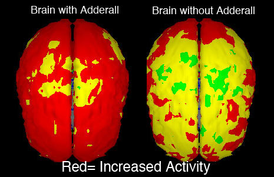

其中红色代表增加了的大脑活动。我们看到，在药物作用下，几乎整个大脑都被调动起来，的确是完全不一样的状态。

那你想让你的大脑长期处在这样的“红色”状态吗？千万别这么干。长期服用这种兴奋剂，会让人产生焦虑、抑郁、失眠这样的精神症状，还会有肥胖、血压紊乱、心脏病甚至不育之类的身体症状。

阿得拉，是脑力劳动者的兴奋剂。我认为一个负责任的政府应该把阿得拉列为禁药，并且在学校和公司里搞例行的药检。但是美国政府还没有走到这一步。 

现在在美国，高中生进大学的竞争、大学生取得好成绩的竞争、职场人士保证高水平发挥的竞争，跟奥运会运动员一样，真的到了需要服用兴奋剂的程度。一方面是美国文化一直都是强调努力工作，另一方面现在的经济形势导致的：贫富差距越来越大，全球化条件下每个美国工人都面临发展中国家低工资工人的竞争压力。好大学和好工作就只有这么些，有能力争取的人可是太多太多了。

**兴奋剂只是竞争的最激烈一步。就算不考虑兴奋剂，现在很多人的竞争方法也是不可持续的。 **

#### 两个拼命者的命运
这本书的两位作者，曾经是两个拼命者。

第二作者马格内斯，曾经是一位特别有潜力的运动员。他还在上高中的时候就和职业选手一起比赛，是美国历史上跑的最快的五个高中生之一，成绩曾经名列青年运动员的全世界第二。

马格内斯为了自己的梦想不计一切代价，什么意志力、自控力根本不在话下，他的训练已经到了“痴迷”的程度。**作为一个高中生，他从不参加同学的聚会，也不怎么跟女朋友交往，强迫自己每天晚上十点必须睡觉。**

马格内斯的努力获得了回报。历史上曾经有人认为人类不可能在4分钟之内跑完一英里（1609米），结果后来每年都有二三十个运动员能跑进4分钟，而作为高中生的马格内斯，在一次关键比赛中，只差几秒就进了4分钟。他感到很遗憾，但同时认为自己很快就能跑进4分钟。

**他从未跑进4分钟。**

第一作者史托伯格，从小就爱钻研经济学。有很多优等生努力学习都是为了找个好工作之类的外部目标，而史托伯格是真心喜欢经济学。**他放弃了各种娱乐项目，全力向学，在学业之外还大量阅读经济学的书，每天还必看《华尔街日报》和《哈佛商业评论》之类的报刊。**

史托伯格刚毕业就进了大名鼎鼎的麦肯锡咨询公司。他的工作更加努力，自己搞出来一套每天早上在12分钟之内完成刷牙、洗澡、刮胡子、穿好衣服出门的高效率流程，披星戴月地工作。别人都说你这么干是不是太累了，可是史托伯格其实非常享受这样高强度的工作。 

史托伯格的成绩相当了不起。他搞出的一个有关医保的数学模型被证明非常好使，很多保险公司都在使用。因为这个工作，史托伯格被白宫征召，还不到24岁就开始给总统出谋划策。史托伯格踌躇满志，相信自己的工作很快就能影响国家政策。 

**那也是他最后一次获得职务升迁。**

史托伯格和马格内斯的经历非常具有代表性。像这样特别优秀、特别高效率的人，什么自律、意志力、好习惯的力量、注意力集中……这些品质他们都有，他们的内在天赋和外部环境都很好，他们也取得了非常好的成绩，但是在他们还很年轻时候的某一刻，他们突然不玩了。 

有时候是因为太累，累到了玩不下去的程度。有时候是因为事业上升到了一个平台期，本身不想再继续了。不论是什么情况，这些人早期的高速进步，都是不可持续的。

这种不可持续的工作状态现在简直越来越普遍。《巅峰表现》书中列举了一组数据 —— 

+ 超过一半的职场白领认为他们已经快要崩溃，不能再吸收更多信息了；
+ 美国只有三分之一的白领工人享受了“午休”时间 —— 也就是离开自己的办公桌去吃顿正式的午饭……其他人都是在办公室对付着吃点；
+ **27%的人会在晚上十点以后到早上六点之前这段时间工作，29%的人会在周末工作；**
+ 美国人平均每年浪费掉5个带薪休假日不用；
+ 53%的人认为自己工作太累已经要不行了；
+ 高盛公司有感于员工工作强度太高，给员工限定了一个每天工作时间的上限 —— 而这个上限是，17小时。

这就应了我们中国人劝人的时候常说的一句话：人生是一场长跑啊！你这么努力光赢了起跑线没用，你得悠着点啊！要知道身体是革命的本钱不会休息的人就不会工作…… 

可是我怎么悠着点呢？工作和休息应该怎么分配呢？史托伯格和马格内斯广泛调研了各个领域中做到了持续发展高手的做法，结合最新的研究结果，才有了这本书。

他们的第一个洞见，是一个公式。 

#### **成长 = 压力 + 休息**
两位作者考察了长期保持状态、甚至40多岁了还保持了世界一流水平的运动员，也考察了从事创造性工作的脑力劳动者，发现他们的行为规律有共同之处。 **一个关键，是节奏感。 **总结成一个公式，就是：**成长 = 压力 + 休息 **

这里的压力并不一定是外界给你的，而是你自己为了提高水平，故意给自己施加的压力。说白了，这就好像是为了锻炼身体而故意对身体的某个区域进行的“打击”。

就好像举重一样，一次举的东西太重或者太轻、练习时间太长或者太短都不行。这个公式说，合理分配压力和休息，你才能以最高效率、可持续地成长。如果压力太大而休息太少，你就会被击垮；如果压力不够而休息太多，你就会自满、达到一个平台不再进步。 

**有很多运动员面临“过度训练”的问题，练着练着把身体练坏了，或者精神上极度疲惫不想练了。美国有很多有前途的中学生练体育，就是练到实在练不下去选择了退出。**

而这本书则发现，如果你考察那些保持可持续状态的运动员，他们的训练方法其实特别强调休息。他们会在高强度训练之后安排正式的休息和非常简单的训练。总结来说，高水平训练流程是这样的 ——  

1. 确定你要练什么；
2. 进行有针对性的、高压式的训练；
3. 休息和恢复，让身体能适应变化；
4. 重复上面过程，但这一次的强度要略高一点。

整个过程非常简单，关键词是“恢复”。这个道理我们以前也说过，当然是因为人体是一个“反脆弱”系统。**能恢复过来，就是反脆弱，会变得更强大；恢复不过来，就练废了。**

这个道理也适用于创造性的脑力劳动。“心流”理论的发明人是米哈里·契克森米哈赖，而米哈里关注的另一个领域，是创造性活动。米哈里总结的创造活动有三个步骤：

> 1. 沉浸。完全集中注意力，把自己沉浸在你正在研究的这个内容之中；
> 2. 孵化。专门有一个休息和恢复的时间段，在此期间完全不想那个研究内容；
> 3. 洞见。也就是新想法出现的尤里卡时刻。
>

这个过程，跟我们讲过的“集中思维”和“发散思维”的过程是一致的。其实道理就是这么点道理，但是真正这么做的人并不多。

这本书强调的一个关键之处在于，**体力活动和脑力活动消耗的是同一个资源，也就是类似于人们常说的“意志力”。**现在最新的理论并不认为意志力是一种有限的资源，但体力活动和脑力活动都会让人疲惫这个结论是没问题的。疲惫了就得休息，而休息和恢复，在这本书里被提到了一个战略的地位。

**高手会非常精确地管理自己的体能，绝不轻易浪费。**

+ 抵制诱惑会消耗意志力，高手就会好好安排自己的生活环境，把各种诱惑减少到最低限度。
+ 食物对节食的人来说是个巨大的诱惑，高手就不会轻易节食。

**所以在当今这个世界参与竞争，我们真是都得以职业运动员的标准来要求自己。**从压力和休息的角度出发，我们可以再次审视，什么叫“刻意练习”。 

> [22｜成长 = 压力 + 休息 - 得到APP](https://www.dedao.cn/course/article?id=3bezDG7wBonmJwgeBqJvQkAg5PyO1x)
>

### 23｜好目标 = 难度 x 具体
**好目标的要求就两条：第一，要有难度；第二，要具体。**

首先是难度。有多个研究发现，目标的难度越大，员工的努力程度和最终绩效就越高。当然如果难度太大，到了员工的能力范围之外，那他明知完成不了可能索性就不干了。但只要是在力所能及的范围之内，目标难度基本上和绩效成正比。

其次是具体。很多人激励自己和激励别人的话是“你要尽最大努力”“一定要做到最好” ——这些其实都是空话。多好才是最好？如果目标不具体，人们根本不会做到自己所能做的最好，更可能是做到一个说得过去的程度就算了。

但是**只有具体也不行。人们可以制定非常具体，但是很容易就能达到的目标应付了事。还要有难度，才符合“拓展性”的精神。****有难度，又具体，就是最好的目标。**

其实也只有符合了“难度”和“具体”这两个要求，制定目标这个动作才有意义。最后目标的效用，大概是个乘法关系，就好像体操和跳水比赛的得分等于难度系数乘以完成度一样。

**好目标 = 难度 x 具体**

在《大目标，和任务勾选框》中介绍了“SMART”目标系统，这是一个企业常用的系统。咱们还是先来回顾一下，**所谓SMART，就是要具体（Specific）、可测（Measurable）、可实现（Achievable）、有现实意义（Realistic）、有明确期限（Timeline）**。 

但是我们也提到，这个系统是有问题的，有些员工会故意给自己设定容易的目标，纯粹应付考核，然后还自我感觉良好。SMART系统是通用电气最先发明的，但是后来通用电气总裁韦尔奇又提出一个“拓展性目标（Stretch Goals）”的思想，认为制定目标应该往高、往远看，不必拘泥于具体。

SMART和Stretch，大目标和小目标，这些方法各有利弊，这些概念都有点矛盾。那么我们到底应该怎么理解“目标”，好目标到底应该是什么样的呢？**今天要说的，就是一个“终极解决方案”。 **

#### 企业家的错误
最近《哈佛商业评论》有篇文章，“管理层应该避免的三个常用目标技术（ _3 Popular Goal-Setting Techniques Managers Should Avoid _）”，作者是管理顾问迪克·格罗特（Dick Grote）。

心理学家对目标系统的作用效果已经有过好几十年的研究，并且在2002年，就有一篇论文综述了此前的研究结果，发表在《美国心理学家》杂志上。

换句话说，过去几十年发生的情况基本上是这样的 —— 一方面是企业家在自行尝试各种目标系统，他们把经验分享给更多的企业家，大家互相学习模仿；一方面是心理学已经有了非常严格的各种研究，也形成了定论。

可是这两边的人没有对话。企业家声音大但是没有使用科学方法，心理学家的结论更准确但是人微言轻。所以企业家得多读书，科学家得多写科普啊……

那么格罗特这篇文章说，对照心理学家的论文，现在管理者普遍使用的三个目标方法，都是有问题的 —— 

+ 第一，**很多企业使用SMART方法，这个方法太容易让人故意制定低目标。**
+ 第二，**有些企业使用严格的自上而下的目标系统。**总裁必须是全公司第一个制定目标的人，副总裁根据总裁的目标制定自己的目标，然后一级一级往下……这么做，底层员工就太被动了。每个人都应该有一定的自主性，把上级的目标作为一个重要参考就行了。
+ 第三，**有的企业给各种不同目标定下量化的重要程度**。哪个目标重要，哪个目标没那么重要，你作为管理者心里有个大概的谱就行了，你很难量化！我们粗略地把目标按优先级排列，最多定个高中低三档，也就可以了。

#### 到底什么是好目标
企业家关心的是什么是“对的”，自己认准一个对的就先大力推广，万一将来发现问题再改；心理学家就算看见“对的”了也要关心什么是“错的”，要把各种不同的方法作对比，才能知道到底哪个是对的。

我们制定目标的目的是为了增加绩效，那么心理学家的做法就是试验各种目标方法，考察它们对绩效的影响。

这篇2002年的论文，就是把此前一系列研究结果综合起来，得出一个总的结论。

这个结论其实特别简单，好目标的要求就两条：第一，要有难度；第二，要具体。

**首先是难度。**有多个研究发现，目标的难度越大，员工的努力程度和最终绩效就越高。当然如果难度太大，到了员工的能力范围之外，那他明知完成不了可能索性就不干了。但只要是在力所能及的范围之内，目标难度基本上和绩效成正比。

**其次是具体。**很多人激励自己和激励别人的话是“你要尽最大努力”、“一定要做到最好” —— 这些其实都是空话。多好才是最好？如果目标不具体，人们根本不会做到自己所能做的最好，更可能是做到一个说得过去的程度就算了。**但是只有具体也不行。**像 SMART 目标那样，人们可以制定非常具体，但是很容易就能达到的目标应付了事。

有难度，又具体，这就把 SMART 和 Stretch 结合起来，这就是最好的目标。有难度，这就符合“拓展性”的精神，而 SMART 系统，可以视为是一个“书写”目标的标准方法。一个目标只有符合 SMART 的要求，它才是最具体的。

其实也只有符合了“难度”和“具体”这两个要求，制定目标这个动作才有意义。最后目标的效用，大概是个乘法关系，就好像体操和跳水比赛的得分等于难度系数乘以完成度一样，我们大概可以说：

**目标效用 = 难度 × 具体 **

#### 目标的作用
为什么我们不好好地“活在当下”，有事就做事，非得去制定什么目标呢？**目标有四个作用**。

+ **集中注意力。**目标可以让你集中注意力和力量。具体的目标要有明确的反馈系统，做到没做到一看便知，那么你就得想方设法做到。
+ **激励。**高目标使人兴奋！其实很多情况下我们有活不愿意干，是因为这个活就算干出来了也没有多大意思。如果目标是出类拔萃的，干好了能证明自己，我们就会全力投入。
+ **能让我们长期坚持下去。**心中有个困难的目标，一步一步慢慢接近这个目标，人就不容易放弃。在任务中间设定几个挑战性的阶段性截止日期是个好办法。
+ **目标一旦明确了**，**我们自动就会寻找各种解决方案。**产品经理如果今天一个主意明天一个主意不知道他想要什么，程序员就会无所适从。产品经理如果提出特别明确的要求，程序员就好像做数学题的小学生一样，看见问题自动想办法解决。

论文还讨论了人在完成目标过程中的各种调节机制，比如说如果我们知道这个目标很重要，我们的努力程度也会增加……其实这些机制的本质还是“难度”ד具体”。 

其实这个难度×具体，就是**做事要有意义、有反馈**。有难度，我们才觉得这个事儿有挑战，才值得做，才能形成自我激励。可是光有一时的激情还不行，你得时刻检验自己做到没做到，做的对不对，如果有个外界的反馈信息那就更好。

我想大概可以这么说 —— 我们平时做任何事情，无非就是生活状态和工作状态。如果是生活状态，那怎么都行，无所事事或者尽情享受都可以。如果是工作状态，那就最好干一件有意义的事，而且最好这件事有个可见的结果。如果现在你有两个小时的时间，你决定把这个时间用在工作上，那就应该有个目标，要求这件事值得做，做出个结果来 —— 否则你这两个小时就是搞行为艺术。

**所以哪有那么多特殊技术，其实就是最简单实用的心法。 **

1. 好目标的大原则是有难度、有具体要求。
2. SMART系统可以把任何目标具体化，但是不能确保难度。
3. 从另一个角度看今天的内容，企业家爱轰轰烈烈，科学家爱严谨，这两种探究事物的方法对比，也值得体会。

<!-- 这是一张图片，ocr 内容为： -->
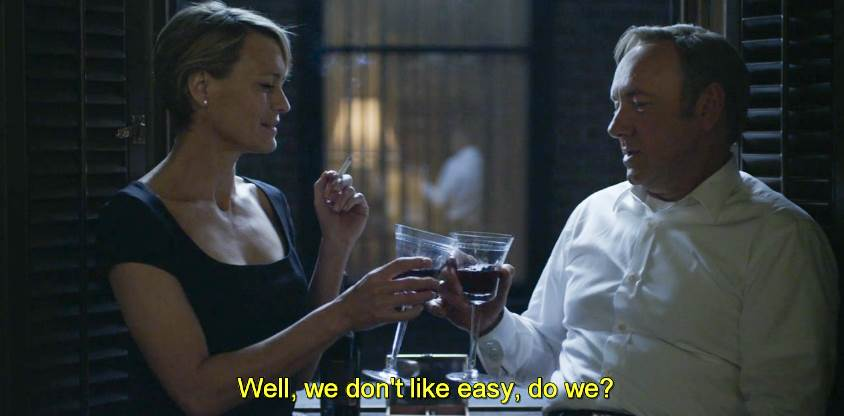

 “我们不喜欢容易” 

### 24｜响应 = 理解 + 接受 + 关心
亲密良好的关系 = 开放 + 响应

响应 = 理解 + 接受 + 关心

这两个公式来自希思兄弟的《强力瞬间》这本书。在讲到维系个人关系的秘诀时，这本书先提到了一个公式：

**亲密良好的关系 = 开放 + 响应**。

所谓“开放”，就是互相不设防。我告诉你一个我自己比较隐私的事情，向你暴露一个弱点，然后你也向我暴露你的一个弱点，这种不设防的感觉能迅速拉近两个人的亲密程度。比如你只要主动来一段难过的情感流露，马上就能拉近跟一个陌生人的关系。

那么两个熟人之间，又怎么长期维系亲密关系呢？关键词是“响应”。它由三点组成：

> 1. **理解**。你了解我，而且你还了解我自己是怎么看待我自己的，什么东西对我最重要。
>
> 2. **接受**。我想要什么，我是什么样的人，你得对此表示尊重。
>
> 3. **关心**。就是在各种场合下，一旦我需要什么帮助，你得帮助我。
>

**响应 = 理解 + 接受 + 关心**。

个人关系里面可都是非常“自私”的，“响应”的这三条都是以我为核心，是“我、我、我”。当然，我对你也得这么响应才行。**没有响应就没有好关系。**

比如你和一个室友同住一个公寓。如果你做什么事他完全不在乎甚至根本不知道，你跟他说你的什么梦想、你喜欢的品牌、想去哪里玩他嗤之以鼻，你有什么困难他从不帮忙，那你们两个人就算整天泡在一起也肯定不是什么好关系。

**好关系的配方**

怎么用设计瞬间来加强人和人的关系。

“搞关系”现在几乎是个贬义词，一说搞关系似乎都不是什么能上得了台面的事儿。达里奥《原则》这本书就说，人与人的良好合作应该是建立在理性的基础上，不是靠什么搞动之以情搞关系。

但问题是一般人没有那么理性。如果人是完全理性的，我们评价一段经历就应该科学打分，就不存在什么“峰终定律”，希思兄弟这本书讲所谓的强力瞬间也就没有意义。这本书恰恰说的是怎么用设计瞬间来弄一些动之以情的功夫。普通人跟普通人之间、一个团队内部、商家面对消费者，体验设计学非常好使。

其实就连达里奥也不能完全否认感情。达里奥的《原则》特别强调目标，而我们知道，目标来自价值观，价值观来自感情。但是另一方面，达里奥似乎对个人兴趣没有什么要求，他并不要求员工“对金融学充满热情”。

我们的第一个问题就是，强调目标而不强调热情，达里奥这个做法科学吗？咱们来看看希思兄弟提到的一项最新研究。 

#### 目标和热情
假设你负责招聘一名程序员，有两个人来面试，他们的技术水平差不多。

你跟他们聊的时候，发现第一个面试者的目标感非常强。**他说我一定要做最了不起的产品，我要让很多人用我的产品，我要做业界最厉害的程序员，建功立业！**

第二个面试者则对编程这件事本身充满热情。他说我特别喜欢钻研编程技术，我很在意架构好不好、代码质量高不高，我把编程当成一门艺术。他说他从小就喜欢编程……就好像选秀歌手说特别喜欢唱歌，物理学爱好者说特别热爱物理一样。

那请问，你应该录用哪个人呢？

答案绝对是选第一个。

加州大学伯克利分校的教授莫滕·汉森（Morten Hansen），最近调查了不同行业的5000个员工，一方面通过问卷调查看看他们的工作动力是目标驱动（像第一个人）还是热情驱动（像第二个人），另一方面让他们的老板来评价他们的水平。最后得到下面这张表格 ——  

<!-- 这是一张图片，ocr 内容为： -->
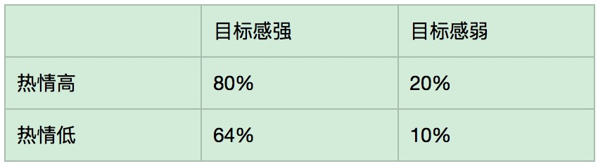

表格中的数值是老板对这个员工水平的评价，越高越好 —— 比如80%的意思是，他比80%的员工都干得好。

表格中的结果是，如果一个人既有很强的目标感，又有很强的热情，那么这个人的老板对他的平均评价是80%，这是非常厉害的人；如果一个人目标感很强，但是热情不够，那他的表现也还不错，是64%；如果一个人目标感很弱，但是热情很强的话，那么他获得的评价是20%；如果一个人目标感弱，热情感也弱，他获得的评价是10%。

也就是说，目标感带给人的评价提升是50%-60%。而热情对人的提升最多只有10%。 所以决定一个人的工作表现的最关键因素，是目标感，而不是热情。

还记得咱们前面的一期日课吗？《“坚毅力”…可能是个站不住脚的学说》。安杰拉·达克沃思在《坚毅力》（ _Grit _）这本书中说热情是 Grit 的两个元素之一，是成功的配方……结果后来很多研究都说热情的作用非常有限。所以达克沃思大概不会喜欢汉森的这项研究。

但是看来达里奥说对了，目标感非常重要。

单人是这样，团体也是这样。我们今天的第一个结论就是，有强烈的目标，是好团队的重要特征！如果你要对手下发表动员讲话，可以讲讲价值观和目标感。 

#### 一起扛过枪，一起……
增加团队的凝聚力，还有另外两个因素也很重要。

一个因素是共同奋斗过。 有很多实验证明，如果一个团队曾经一起经历过困难的时刻，一起奋斗挣扎过、一起体会过痛苦，这个团队的凝聚力会特别强。这个很容易理解，我们知道曾经一起战斗过的战友关系是最铁的，他们的关系经历过生死考验。我还看过研究，说哪怕是互相竞争的两个小团队，如果你让他们一起去完成一个艰难的任务，那么在完成任务的过程中这两个团队很容易就能团结起来，而且这种团结的感觉能够持续很长时间。

第二个因素是团队要经常有协调的互动。 人在社交活动中总是愿意跟别人协调同步。比如有人统计发现，我们大部分情况下之所以会笑，并不是因为看到了什么好笑的事情，而是通过微笑向别人发出同步信号。人在社交场合笑的频率比自己私下高30倍。正是这种不断地同步，能让团队中每个人都能再次确认自己没有被组织抛弃。我们第一季还说过跳舞的作用 —— 协调一致的舞步能让一个集体增加凝聚力。

所以中国人说好关系是“一起扛过枪、一起同过窗……”还是有道理的。而由此可见，就算有条件远程工作，也应该时不时搞个集体活动，让团队成员能面对面交流。现在有些公司把人拉出去在野外搞生存训练或者军训，也是有道理的。

那么维系个人对个人的好关系，又有什么说法呢？ 

#### 你要响应我
维系个人关系的秘诀，用一个公式表示，就是 —— 

**亲密良好的关系 = 开放 + 响应**

所谓“开放”，就是互相不设防。我告诉你一个我自己比较隐私的事情，向你暴露一个弱点，然后你也向我暴露你的一个弱点，这种不设防的感觉能迅速拉近两个人的亲密程度。

这个道理咱们在第一季讲过，有一期日课叫《怎样快速跟人建立亲密关系》，说你只要主动来一段难过的情感流露，马上就能拉近跟一个陌生人的关系。

那么两个熟人之间，怎么长期维系亲密关系呢？关键词是“响应”。好关系来自互相之间不断的响应。

这是一个叫哈里·赖斯（Harry Reis）的社会心理学家2007年提出的理论。他的洞见是，好关系的关键是“我们互相对对方的响应的感知”。我能感知到你对我的响应，你能感知到我对你的响应，咱俩就是好关系。

而所谓“响应”，由三点组成：

1. 理解。你了解我，而且你还了解我自己是怎么看待我自己的，什么东西对我最重要。
2. 接受。我想要什么，我是什么样的人，你得对此表示尊重。
3. 关心。就是在各种场合下，一旦我需要什么帮助，你得帮助我。

所以，响应 = 理解 + 接受 + 关心。

刚才说集体凝聚力的时候，我们说的目标感、共同奋斗、协调一致都是“无私”的品质，而现在你看，个人关系里面可都是非常“自私”的，“响应”的这三条都是以我为核心，是“我、我、我”。当然，我对你也得这么响应才行。

没有响应就没有好关系。比如你和一个室友同住一个公寓。如果你做什么事他完全不在乎甚至根本不知道，你跟他说你的什么梦想、你喜欢的品牌、想去哪里玩他嗤之以鼻，你有什么困难他从不帮忙，那你们两个人就算整天泡在一起也肯定不是什么好关系。

这个道理一说出来，你肯定觉得这也太简单了！这难道不是明摆着的吗？还真不是。实际上我们恰恰因为不懂这个道理而没有处理好很多关系。

希思兄弟举的一个例子，是华盛顿市一个公立学校的故事。 

#### 老师问家长的四个问题
我们知道美国有些地区的公立学校是非常差的。最差的学校能差到什么程度呢？你可能会感到震惊。华盛顿市 —— 注意，这可是美国的首都 —— 有一个公立小学，开家长会的家长出席率只有12%。这就等于说老师说开家长会，结果一个班就来了两三个家长。

老师和家长陷入了一个恶性反馈。在老师看来，我开家长会你都不来，说明你这个家长根本不重视教育。但是在家长看来，问题在于老师先不重视我家孩子，你对我孩子根本不关心，我为什么要来参加你的家长会？老师和家长之间根本没有起码的信任。

学校后来也是痛定思痛，认为必须改革，就搞了个大动作，把大部分老师辞退了，招聘新老师……结果还是不行。关键就在于怎么跟家长建立一个比较好的关系。

最后学校想了一个办法，要求老师在暑假期间，挨家挨户到学生家里做家访，而且还专门设计了四个家访的问题：

1. 你的孩子在学校的体验是怎么样的呢？你对此的感受是怎么样的呢？
2. 你对孩子有什么期望？你对他有什么梦想？
3. 你希望自己的小孩成为一个什么样的人呢？
4. 我作为孩子老师，你希望我做些什么？

这个四个问题平淡无奇，其实正好是前面赖斯给的好关系配方。第一个问题是理解，第二、第三个问题是接受，第四个问题是关心。

效果非常好。经过暑假的家访，再开学的时候，最明显的一个效应是，家长会的出席率从12%提升到了73%。家长愿意跟老师沟通，才谈得上其他各种教学改革，最后这个学校的教学质量就真的提高了。

整个故事非常简单，但是咱们想想，如果让你去一个差生家找家长谈话，你会说什么？我们本能的做法恐怕不是问对方想要什么，而是告诉对方应该做什么：你家小孩学习很差啊，这么下去可不行啊，你作为家长得上点心啊，你必须……

希思兄弟说，这个本能其实是服务业的通病。病人来到医院，医生自然而然假设他想要的就是把病治好，上各种难受的治疗方案，根本不在乎病人想要什么。有个医院让一个有自闭症的小孩在一张纸上写下“对我来说最重要的事有哪些”，然后所有医护人员都按照这张纸照顾他，效果就非常非常好。

用一句话总结医生们的经验，是把 “What’s the matter” 这个问题改成 “What matters to you” —— **不要只问他有什么毛病，要多问问他想要什么。**** **

#### 小结
怎么提升一个团队的凝聚力，和怎么提升两个个人之间的关系。这些套路可以用几个公式总结：

+ **团队凝聚力 =  目标感 + 一起奋斗的经历 + 协调同步**
+ **快速的亲密关系 = 开放**
+ **长期的好关系 = 响应 = 理解 + 接受 + 关心**

知道这些套路不难，但是真要使用套路，你需要克服一个心理障碍。**这个心理障碍就是到底要“做真实的自己”，还是去摆弄别人。**

比如说，我明明不关心这个人想要什么，但是我仅仅是为了和他好好相处，我主动去问他想要什么 —— 这到底对不对呢？这还是真诚的我吗？再比如说，我跟好几个同事在一起，别人都笑了，可我并不觉得有什么好笑的 —— 但是我知道我只要笑，就可以和同事取得同步 —— 那你说我到底是笑还是不笑？ 

“体验设计学” —— 如果一个体验是设计出来而不是自发的，那是不是有一点……就好像吃了不是有机的食物的感觉呢？

我对这个问题想了很久，现在我的答案是这个：**你可以既保持真诚，又使用套路。**

有时候你发自内心地想对一个人好，想让一群人幸福，但是因为你没经验不了解人，你不知道该怎么做。这种感觉就好像看到一处美景心里没有好词儿形容一样。“体验设计学”，就是能让你把心中的好意抒发出来的诗歌。学会了体验设计学，你就可以把良好愿望变成现实。

**知识不会让真诚蒙尘，知识只是让你更自由。 **

> [24｜响应 = 理解 + 接受 + 关心 - 得到APP](https://www.dedao.cn/course/article?id=W32axR8enbzBJ9pzxmVkDEgM6ApPl9)
>

### 25｜成功 = 天赋 + 运气
这个公式来自丹尼尔·卡尼曼的《思考，快与慢》，它告诉我们：因为回归平均现象的存在，你得承认运气的作用。

比如具体到身高来说，我们的身高有一部分是直接继承了父母的基因，还有一部分是遗传基因的排列组合、跟环境的相互作用影响到基因表达，这些过程中发生的一些运气。

高个父亲不但有好基因，而且有好运气。基因可以遗传，可是运气不能遗传。好运气总是非常罕见的，所以大概率下，儿子不会有那么好的运气——所以儿子的身高就不如父亲。

这个公式提醒我们一个道理：**有些事儿发生就发生了，并没有缘故。**

**总有一种力量让我们回归平均**

因果关系到底是不是一种原始的、应该被现代科学抛弃的思维呢？

这是一个跌宕起伏的故事。以前所有人都认为因果是天经地义的东西。但是一百多年以前，统计学家们搞了一次革命，从此认为科学知识里根本就没有什么因果……

为了理解这件事，我们今天要讲一个非常经典的统计学概念，它在生活中有各种应用，但是至今仍然有很多体面人因为不懂这个概念而犯错误。

这个概念叫做“回归平均”。你想必已经听说过……但今天我们要讲一个更高的角度。

这一切还得从举世罕见的聪明人、学术多面手、人类学家、著名的种族主义者、发明家、统计学的祖师爷、在精英日课和熊逸书院多次出场的、达尔文的表弟、弗朗西斯·高尔顿先生讲起。

#### 高尔顿的困惑
1877年，高尔顿在英国皇家科学院做了一个演示报告。皇家科学院的报告传统真是让人心驰神往啊。听众都是各方面的牛人，正装出席，报告人不用什么 PPT，而是面向观众，就好像变魔术一样一边演示实验一边侃侃而谈，说的都是对大自然的最新揭秘。

高尔顿这次演示的东西，被后世称为“高尔顿板”。

<!-- 这是一张图片，ocr 内容为： -->
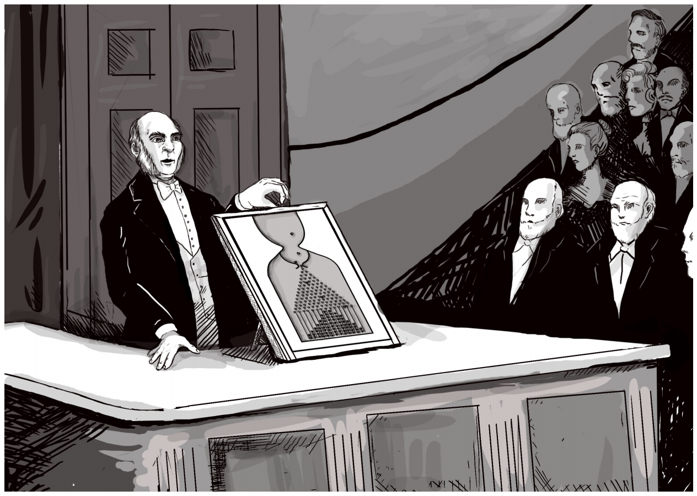

高尔顿板是一个平板，下部有很多垂直的槽，槽上面是一些排列成三角形的小格挡。

<!-- 这是一张图片，ocr 内容为： -->
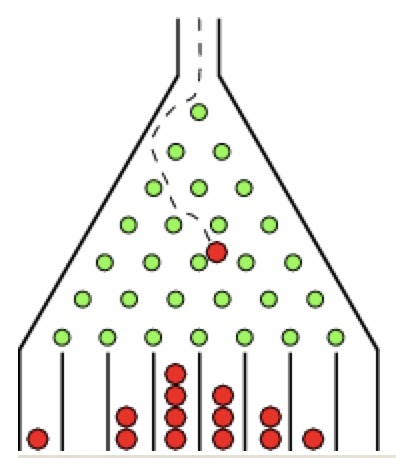

<!-- 这是一张图片，ocr 内容为： -->
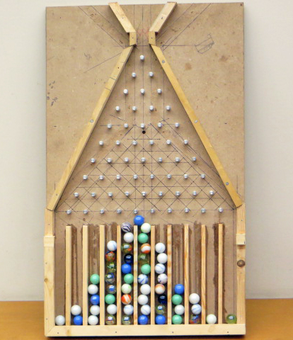

让一个小球从最上方掉下去，它会经过各个隔挡的阻碍，最终落到一个竖槽里。每个小球在进入竖槽之前的运动都是随机的，但是当你放了很多很多小球之后，它们就会在竖槽上呈现一个明显有规律的分布：一条钟形曲线。

这当然就是正态分布。高尔顿板演示的是人的遗传。比如身高和智商，可能受多个遗传因素的影响 —— 就好像高尔顿板上的那些隔挡 —— 这些因素综合起来一起作用，结果就一定是正态分布。事实上人的身高和智商的确就是正态分布。你可以想象上面图中横坐标代表身高，纵坐标代表每个身高值上的人数。正态分布就是说，身高特别高和特别矮的人都很少。

正态分布不是新闻。高尔顿这个报告的真正剧情还在后面。高尔顿说如果我在竖槽下面再放上一些隔挡，然后隔挡下面再放上第二排竖槽，就如同下图中右边那样，你说会是什么样的情景？

<!-- 这是一张图片，ocr 内容为： -->
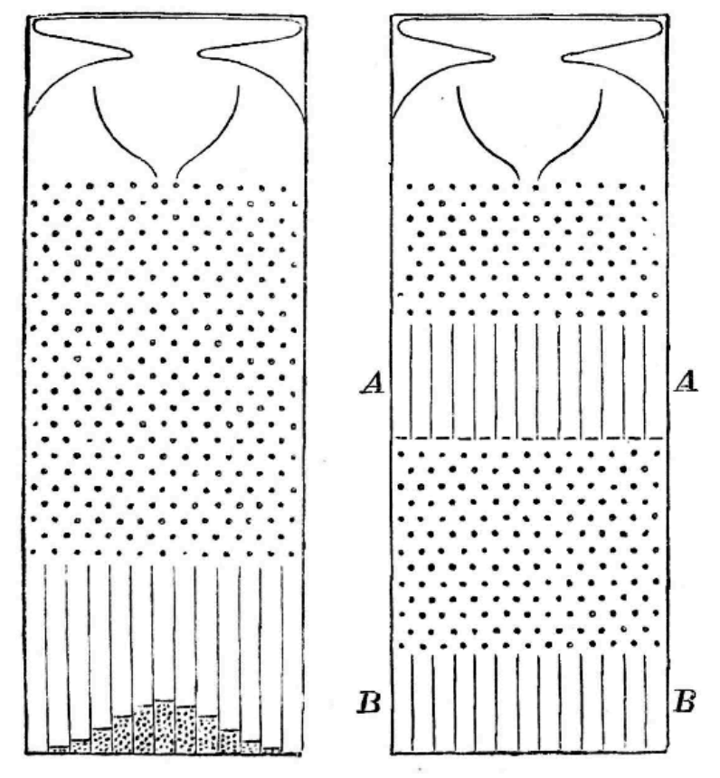

这就模拟了两代人的身高。第一排，也就是竖槽 A，代表第一代人的身高分布，我们知道是正态分布。那么第一代人再遗传一次，到达竖槽 B，会是什么分布？

不论是理论推导还是实验演示，第二排竖槽里的小球都呈现一个更宽广的正态分布。我们专栏在《标准差和人生哲学》这期讲过“标准差”的概念，竖槽 B 的标准差更大。就如同下面这样 —— 

<!-- 这是一张图片，ocr 内容为： -->
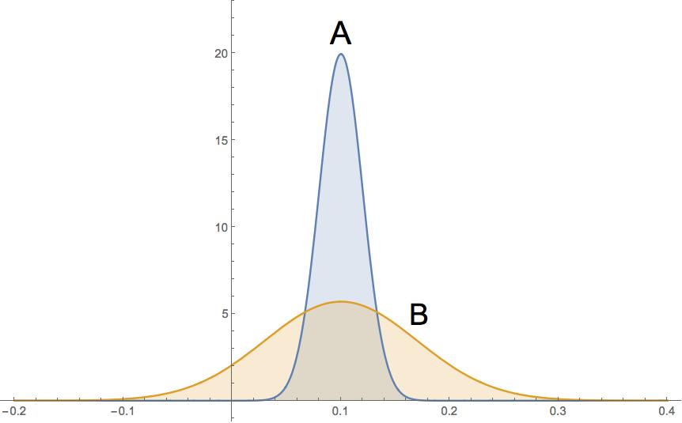

这意味着每一代人身高的标准差会越来越大，也就是身高特别高和特别矮的人应该一代代越来越多才对。

可是真实世界根本就不是这样的。真实世界里一代代人的身高标准差都是一样的啊！

我再换个说法你就更明白了。假设现在有一批身高特别高的人，他们处在第一代正态分布曲线的右侧边缘地带。如果他们生的孩子是在他们的身高基础上进一步随机演化的话，其中应该有一半人的身高比父辈高。如此说来，第二代身高的边界，应该比第一代更宽才对。

但是这并没有发生。真实世界里牛人的第二代并没有一半的机会比牛人强 —— 二代好像普遍比一代弱。高尔顿考察了605个英国名人，就发现这些名人的儿子们，普遍不如名人自己有名。

这个规律好像还无处不在。比如姚明特别高，他的妻子也非常高，我们可以想象姚明的女儿肯定也会很高 —— 但是根据高尔顿发现的规律，姚明女儿的身高将不会像姚明那么高。最可能的结果，是她会稍微矮一点。

高尔顿把这个现象叫做“回归平庸”。一代出类拔萃，占据了正态分布曲线边缘的位置；二代则普遍没有接着开疆拓土，甚至连一代的优势都没保住，反而都往曲线的中间“回归”。

高尔顿不得不把高尔顿板做了一个改进，把一些竖槽变成斜槽，才能体现这个“回归” —— 

<!-- 这是一张图片，ocr 内容为： -->
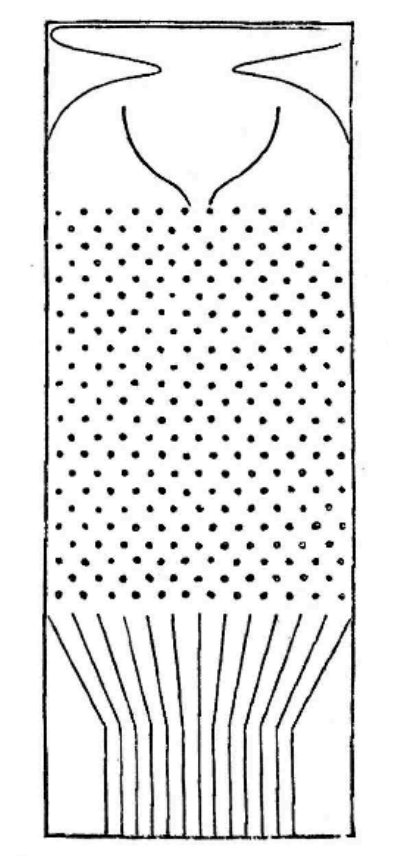

可这斜槽代表什么呢？难道说冥冥之中有一种力量让我们回归平庸吗？

#### 高尔顿的解释
有些问题值得思考十二年。一直到1889年，高尔顿才把这个事儿想明白。

高尔顿意识到，根本就没有什么特殊力量。

他考察英国男子的身高和手臂之间的关系，发现身高特别高的人，手臂也都很长 —— 但是他们的手臂并不是最长的。这就好像最聪明的父亲没有生出最聪明的儿子一样。手臂相对于身高，也出现了回归平庸。

那咱们想想，父亲跟儿子之间也许有因果关系，身高跟手臂之间似乎不太可能有因果关系啊。

更进一步，父亲相对于儿子，也有一个回归平庸！如果你先看儿子身高，那些最高的儿子，他们的父亲的身高也不是最高的。显然儿子身高并不能决定父亲的身高，这个关系肯定不是因果关系！

高尔顿把这种关系叫“相关”。这就是“相关性”这个概念的起源。高尔顿是第一个意识到“相关不是因果”的人。

儿子出生的时候父亲已经成年了，儿子身高总不可能影响父亲的身高，所以绝对不可能有一种什么神秘力量，决定了从儿子到父亲的回归平庸。

今天我们管这个现象叫“回归平均（regression toward the mean）”。

#### 回归平均
丹尼尔·卡尼曼在《思考，快与慢》里，对回归平均有个很好的解释。想要理解回归平均，你得理解下面这两个公式 ——

**成功 = 天赋 + 运气**

**大成功 = 多一点点天赋 + 很多好运气**

你得承认运气的作用。

具体到身高来说，我们的身高有一部分是直接继承了父母的基因，还有一部分是遗传基因的排列组合、跟环境的相互作用影响到基因表达，这些过程中发生的一些运气。

高个父亲不但有好基因，而且有好运气。基因可以遗传，可是运气不能遗传。好运气总是非常罕见的，所以大概率下，儿子不会有那么好的运气 —— 所以儿子的身高就不如父亲。

这就好比说如果父亲的财富很大一部分是来自买彩票中了大奖，我们容易理解，儿子将来不会像父亲一样有钱。比如中国有句话叫“富不过三代”，其实并不见得是第二代和第三代从小骄奢淫逸不会赚钱了，可能仅仅是因为第一代的好运气是不可继承的。

所以回归平均其实就是一个简单的统计现象，本质原因是小概率事件不会一再发生 —— 这里面并没有什么神秘力量。

这个现象是如此简单，但是这个知识并没有普及！今天仍然有很多人在犯高尔顿1877年的那个错误，他们见到回归平均，总觉得背后一定有一个缘故。

#### 回归平均种种
一个电影大获成功，于是就出了续集。可是续集的票房往往不如第一部高，这是为什么呢？很多人就说续集没有好看的，都是为了赚钱狗尾续貂！其实不一定。用回归平均完全可以解释为什么好电影的续集往往不好。第一部电影之所以大受欢迎，是因为它运气好。好运气总是稀少的，第二部电影没有那么好的运气，自然会获得平庸的票房。其实票房平庸很正常，第一部大获成功才是真的不正常。

NBA 新秀如果第一年表现非常好，第二年不行了，人们就会说他是不是骄傲自满了，成了名不好好努力了？其实不一定。第一年表现好很可能是因为运气好，正好赶上跟队友关系好比赛打得顺手；而好运气大概率是不可持续的，所以第二年表现不好很正常 —— 这跟他自己本人怎么努力没关系。

有一次卡尼曼给以色列空军办讲座。卡尼曼讲到心理学，说你要想让你的学员进步，一定要多正面鼓励，不要去骂他们。心理学家有充分的证据，正面鼓励比打骂有效得多。

这时候有一个教官表示不同意。他跟卡尼曼说，我的经验可不是这样的。如果一个飞行员有一天飞得特别好，我当场表扬他、鼓励他了，他第二天往往飞得没有那么好。可是如果一个人飞的特别差，我骂他一顿，他第二天果然就飞得没有那么差了。这不就说明，表扬没用，打骂有用吗？

**卡尼曼一时语塞！他后来才想明白这个事儿，这其实是回归平均。**

飞得特别好这种事情并不容易发生，你表扬或者不表扬他，他下一次飞也会回归平均，会没有那么好。飞得特别不好也是一个小概率事件，你批评或者不批评他，他下一次飞也会回归平均，会没有那么差。在回归平均这个大趋势面前，表扬固然没有立竿见影的作用，批评的作用其实也是错觉。

这个道理是，有些事儿发生就发生了，并没有缘故。

#### Reason 和 Cause
“reason”和“cause”两个词的意思差不多都是原因，但是你细品的话，它们有重大区别。

+ **reason，是说对这件事的解释。**比如你问我某个电影的续集为什么票房不高，我说这是回归平均，这个事儿有一个解释。
+ **cause，则是导致这件事的另一件事。**你现在为什么感到有点饿，因为你没吃早饭。Cause 就是“因果关系”里面那个“因”，我们这里统一翻译成“缘故”。

为什么高个父亲的儿子往往没有他高？这件事有个解释，但是没有缘故 —— 没有一个神秘力量导致儿子的身高变矮，这纯粹是个统计学现象。

为什么你买彩票中了大奖？这有一个解释 —— 总会有人中大奖，这次碰巧是你。但是没有缘故 —— 并不是因为你昨天做好事帮助孤寡老人，导致了你今天中大奖。

**世界上有些事儿，是无缘无故发生的。**

高尔顿终于意识到回归平庸这个现象根本就没有 cause。他意识到1877年的自己犯了一个以为什么事儿都有缘故的错误，他的因果惯性思维害了他。

高尔顿痛定思痛，干脆认为，世界上一切事物都没有因果！后来高尔顿的徒弟，叫卡尔·皮尔逊（Karl Pearson），把这个思想给发展壮大了。

皮尔逊坚定地认为科学的世界里只有相关没有因果。那这个思想是不是从一个极端走向了另一个极端呢？

> [25｜成功 = 天赋 + 运气 - 得到APP](https://www.dedao.cn/course/article?id=aYB83z6N9dqxVyPqBQK7ZMvy0GQDO5)
>

### 26｜目的 = 价值观 x（目标1 + 目标2 + 目标3 + …）
希滕德拉·瓦德瓦的《内部掌控，外部影响》。

瓦德瓦的洞见在于，理想人生的所有目标，最好都是从你的价值观中提取出来的。你的价值观会有很多个取向，你最好专注于一个方向用力。设定并且完成一个个从这一项价值观中提取出来的目标，就是你的「目的」。

**目的 = 价值观 × （目标1 + 目标2 + 目标3 + …）**

比如你有一个价值观是“崇尚科技”，那么你可以设定的一个目的就是“用科技推动世界进步”。为了这个目的，你可以设定一系列具体的目标，比如“设计一个新产品”“参与一项研发并取得专利”“帮朋友解决一个技术难题”等等。这个目标对你有两个好处：

1. 目的既不可能完全实现，又可以随时实现。你能说你什么时候完成了“用科技推动世界进步”吗？当然不能，你得为此奋斗终生——可是你每天完成的每一个小目标都是在为了这个目的而努力。这样你就避免了佛学说的那个不满足之苦。

2. 你可以随时调整其中的目标。特别在今天这个时代，外部条件总在变化，很多事情是你不可控的。你想要成为一个科学家，可是考研失败了。但你的价值观是热爱科学，你的目的是探索世界，这都不需要因为没考上研而改变——也许你可以把其中“当科学家”这个小目标改为“当科学记者”。

**有了目的，目标既可以扩大，也可以缩小，也可以横向移动，你的人生意义就保住了。**

**有目的的生活**

世间大多数人随波逐流，而有些人一看就器宇不凡，你能感到他身上有点东西。**长期沉浸于一项事业会让人挂相，常年的独特心态能直接改变外貌。**我们的所作所为所思所想都在塑造我们的形象。要不怎么传说林肯有句话说「**每个过了四十岁的人都应该为自己的长相负责。**」  

气质是修行出来的。除了在生活中历练，瓦德瓦有他自己的一套修行方法。一个是他作为印度教教徒经常冥想。他列举了一些冥想的好处，其中有些算是有科学研究证据，也是热门话题。一个是他认识很多人，他能从别人的人生中总结一些感悟。

还有一个方法是思想实验。瓦德瓦会把自己代入到历史上那些大人物身上，“假设当时我是林肯，我会怎么做” —— 这也是陈寅恪先生说的「**了解之同情**」：**你理解了那些历史人物为什么会有看似矛盾的行为，你能同情他们的复杂心态，你自己也会慢慢变复杂。**

瓦德瓦的研究团队还专门考察了很多能够激励人心的领导者，看看他们是如何跟对手、合作伙伴、家人、朋友互动的，他们分析了一千多场对话、演讲和会议，希望找到其中的共同点。结果瓦德瓦发现这些人并没有使用太多明显的套路 —— 他们的共同点是拥有五种「核心能量」，分别是**「目的（purpose）」「智慧（wisdom）」「成长（growth）」「爱（love）」和「自我实现（self-realization）」**。

作为一个前物理学家我很不喜欢别人滥用「能量」这个词，但瓦德瓦是想表达大人物的感染力：当你接近这些人的时候，你会被他们所感染，就好像他们在发光一样。

接下来几讲我们说说如何修炼这五种能量。这一讲的主题是「目的」。

目的大概是你内核操作系统最重要的结构，现在谈论个人成长、谈企业建设，都要谈目的。什么是目的呢？我们必须先考察两个概念，一个是**目标（goals）**，一个是**价值观（values）**。

**「目标」**，是你想做成的某一件具体事情。比如我想要考上大学、我想在年底之前升职为经理，这些都是目标。目标有明确的“已完成”和“未完成”两个状态。

目标能激励你行动，让你充满野心和干劲，所以目标是人生必不可少的。但是目标有个大问题：它也是我们痛苦的根源。如果一个目标总是实现不了，你会感到绝望；但如果目标真的实现了，你的快乐并不会持续很久。你会感到无聊，然后寻找下一个目标。我们专栏讲过罗伯特·赖特的《为什么佛学是真的》，所谓“苦”就是追逐目标的人永远都不会真正感到满足。你不想做一个只知道完成下一个目标的机器。

为了人生有长久的意思，你还需要**「价值观」**。价值观就是你认为什么东西好、什么东西不好，什么值得付出、什么不值得。价值观是很宽泛的，代表大致的方向，并不具体。比如你的价值观是崇尚现代化，你热情地赞美科技和社会的进步，你就算自己不做什么、每天看看新闻也会觉得很有意思。

但如果只有价值观，没有目标，那也不好。因为你会很松懈，缺乏野心。你固然可以每天静看花开花落欣赏世间的美好，但是你不会取得任何成就。

合理的人生应该既有价值观又有目标。而瓦德瓦的洞见在于，理想人生的所有目标，最好都是从你的价值观中提取出来的。你的价值观会有很多个取向，你最好专注于一个方向用力。设定并且完成一个个从这一项价值观中提取出来的目标，就是你的「目的」。我用一个公式概括，就是  ——

**目的 = 价值观 × （目标1 + 目标2 + 目标3 + …）**

目的是一个以价值观为导向的目标系统。比如你有一个价值观是“崇尚科技”，那么你可以设定的一个目的就是“用科技推动世界进步”。为了这个目的你可以设定一系列具体的目标，比如“设计一个新产品”、“参与一项研发并取得专利”、“帮朋友解决一个技术难题”等等。

这个系统最大的好处就是目的既不可能完全实现，又可以随时实现。你能说你什么时候完成了“用科技推动世界进步”吗？当然不能，你得为此奋斗终生 —— 可是你每天完成的每一个小目标都是在为了这个目的而努力。这样你就避免了佛学说的那个不满足之苦。

有了目的，你根据可利用的资源和自身的能力，选择一个个符合价值观的目标作为奋斗的里程碑，这样每次都能前进一点，永不停止。

目的系统的另一个好处是你可以随时调整其中的目标。特别在今天这个时代，外部条件总在变化，很多事情是你不可控的。你想要成为一个科学家，可是考研失败了。但你的价值观是热爱科学，你的目的是探索世界，这都不需要因为没考上研而改变 —— 也许你可以把其中“当科学家”这个小目标改为“当科学记者”。

有了目的，目标既可以扩大，也可以缩小，也可以横向移动，你的人生意义就保住了。

实践人生目的的过程分为五个阶段。

#### 扰动（Stir）
可能是一场突发灾难，可能是一次人生巨变，把你推到了一个以前没想过的境地，让你不得不重新思考人生，这就是你发现目的的契机。你的人生使命可能要召唤你了。

1963年，《华盛顿邮报》的老板自杀身亡，他的妻子凯瑟琳·格雷厄姆（Katharine Graham）不得不接手公司。格雷厄姆本来是个家庭主妇，别人都觉得她肯定会干脆把公司卖掉，但没想到她发现管理报社还挺有意思。她接触到了新闻自由、无偏见新闻的理念。

几年后赶上尼克松水门事件，《华盛顿邮报》在其中起了重要作用，一时间格雷厄姆成了争议人物……她一看原来人生还可以这样过！她找到了人生的目的，坚持用自由独立理念办报，成就了传奇。

<!-- 这是一张图片，ocr 内容为： -->

所以有时候命运会来召唤你。那如果没遇到这样的机遇，你该怎么办呢？

#### 寻找（Search）
你应该主动寻找。可能你只是觉得应该做点有意义的事，但是不知道该做什么，这说明你的价值观还不够强烈。为此你需要先有过硬的世界观。

你得强烈地想要知道这个世界是怎么回事儿。世界变化的规律是什么？谁说了算？为什么世上有那么多不合理的事情？然后你看看你能在其中做什么，你应该做什么。人到了困顿的时候，尤其得多读书。

有的人轻易就认准一个方向，有些人可能会搜寻很久，但不论如何，这时候就算找到了也还不能完全定下来。

#### 定义（Define）
第三个阶段就是定义。有了强烈的价值观，你就可以开始定义你的目的。不过目的不是一上来就定死的，可以修改和升级。

瓦德瓦很小的时候就树立了「非暴力」这个价值观。为此他十一岁就改吃素，再也不吃肉了。你可以说这就是瓦德瓦的一个人生目的，也可以说是原则。

后来瓦德瓦读到甘地说暴力不仅仅是身体上的伤害，还包括言论、思想上的伤害，他就把原则改成“不但不在行动上、也不在思想和言论上给人造成痛苦。”

可是等到三十多岁创办了公司以后，瓦德瓦发现他有时候不得不批评甚至解雇员工，那就必然给员工造成痛苦，于是他不得不把原则修改成“尽量不给别人造成痛苦 —— 除非是为了实现更高目的必须得这么做。”

但瓦德瓦并没有简单妥协就了事，他同时在想办法尽量减少伤害。他向各路大人物学习，发现这些人会尽量避免激烈斗争，会寻求双赢，能合作尽量合作、能理解尽量理解。这样他的目的就更丰富了。

瓦德瓦至今仍在打磨自己的非暴力目的。他最新的一条原则是如果因为偶然的情绪对人无礼，事后必须道歉。

孟子有句话叫「君子可欺之以方」，说对这种原则性强的人你可以拿一些符合他的目的的事儿欺负他，比如逼一个慈善家捐款。但是做大事的人不应该被一些小原则限制死。比如瓦德瓦说如果他发现家里有个蜘蛛，根据非暴力原则，一般情况下他会用容器把蜘蛛装起来扔到户外去。但有时候很着急，那也只能把蜘蛛打死 —— 但他会确保一次性快速打死蜘蛛，不让蜘蛛感到痛苦，然后还会帮死蜘蛛祷告几句。

你说这是虚伪吗？这是最大限度符合原则，同时保留必要的灵活性。这也符合中庸之道。

甘地领导非暴力不合作运动，也没有一味地抗议。他发明了一个叫做「斗争-停战-斗争（struggle-truce-struggle）」的模式，也就是每次全国性的抗议运动只搞一两年，然后就主动停战几年，然后再来下次斗争。就这样甘地用了27年才实现印度独立。甘地为什么不直接跟英国人死磕到底呢？

**因为他知道印度需要的不仅仅是独立，印度还需要进步。搞独立不能把国家搞成一个烂摊子。这种知道妥协，有张有弛、有理有利有节还有韧性的革命者才是最厉害的。**

#### 专注（Focus）
从人生的某个时期开始，你的目的已经明确了。现在你完全知道自己要做一个什么人，那么剩下的就是要专注。最理想的情况是从事一个和目的一致的职业。你想搞物理研究，你就应该做一个物理学家。

**然而现实很骨感，可能你只能从事一项跟目的关系不大、甚至很低微的工作，那怎么办呢？瓦德瓦的建议是你可以先把任何工作都变成跟目的有关的工作。**

医院里有些清洁工不认为自己是清洁工，他们认为自己是帮助病人的人。把医院环境打扫干净，就是在参与治疗。看看哪个病人没有家属来探望，主动去陪她聊聊天，这也是完成了一项帮助他人康复的小目标。目的感可以体现在任何微小的项目上。

但是不要忘了追求最符合你目的的理想事业。刘慈欣身在电厂偷偷写小说，因为他认为他不是一个工程师，他是一个科幻作家。瓦德瓦讲有个索马里移民在伦敦是开出租车，可是他真正喜欢的是新闻，于是他一边跑出租一边追踪警方动态，有消息就向电视台爆料……时间长了之后，新闻界的人都认识他了，他真的得到了一个新闻工作。

大人物之所以会挂相，你在他们身边就能感受到他们的能量，最根本的就是因为他们专注。你一看就知道这个人是谁，因为目的已经塑造了他。

到了这个阶段，目的会给你强烈的紧迫感。**你开始对生活做减法，你学会了对不相关的事物说不。**

<!-- 这是一张图片，ocr 内容为： -->
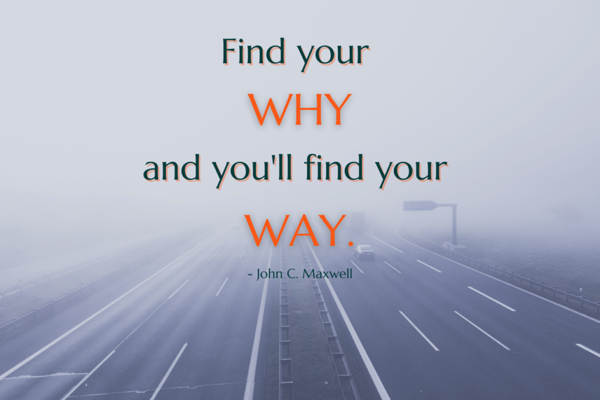

#### 融合（Fuse）
有目的的人生的最高境界，是随时在每一件事中都践行目的。

甘地有个著名的小故事是有一次他上火车的时候把一只鞋掉在了站台上，火车已经开动了，他没法下车捡鞋……他就马上把另一只鞋也脱下来扔向站台。甘地说如果有人想要那只鞋，就可以两只一起穿走了。

有个亿万富翁叫理查德·布兰森（Sir Richard Branson），有一次做电视节目。在节目录制的间隙，布兰森跟记者聊天，问那个记者有什么梦想。然后他非常关切地说你应该注意体重了，得健康长寿才能实现你的梦想啊。

富兰克林·罗斯福总统的妻子埃莉诺·罗斯福，有一次在佛罗里达度假，听说附近有个小餐馆的员工在闹罢工。她立即参与进去，了解了罢工的原因，帮助促成了管理层和工人和解。

还有很多例子。这些人不但在实践自己的价值观，而且在一些很小的事情上、根本没人关注的事情上实践价值观。

你看这些故事是不是让你对「勿以善小而不为」这句话有更深的理解呢？这不一定是行善的问题，可以是任何价值观。这是一个人已经与价值观融为一体，他变成了这种价值观的化身。

瓦德瓦说这比“做自己喜欢和擅长的事情”更有成就感。你是在用你的激情和才能去为你的目的服务。你做的每一件事都是为了那个目的，你会发现生命中每一分一秒都无比珍贵。

最后咱们看看乔布斯的人生目的是如何从扰动、定义到融合的。

乔布斯的养父母并不富裕，可是很重视教育。有一次乔布斯做木工，给院子修了个栅栏，然后他只给栅栏的外侧刷了油漆，内侧没有刷。父亲问他怎么不刷内侧呢？乔布斯说因为没有人会看到内侧。父亲说，可是你会看到啊。你做事就要做到完美。

等到乔布斯自己开公司，有一次工程师给他展示了新型的苹果电脑设计。他看完外面又打开了机箱看内部，说你这走线布局不美观啊。工程师说没有人会看机箱内部。乔布斯说，但是你会看啊。我们做事就要做到完美。

乔布斯临终前，他姐姐去医院看望他，后来回忆了当时的情景。乔布斯躺在病床上，身上插满管子，连话都不能说，他早就知道自己很快就要死了。可就在这种情形之下，他找医生要了个笔记本，在上面画了一个草图。

那是他设计的一个能在病床上放置iPad的架子。他还给医院设计了新的显示器和X光设备。他嫌病房布局不够独特，他画了一个新的设计。据说乔布斯还让医院提供了五种不同的氧气面罩，因为他想选择最好的设计。

<!-- 这是一张图片，ocr 内容为： -->
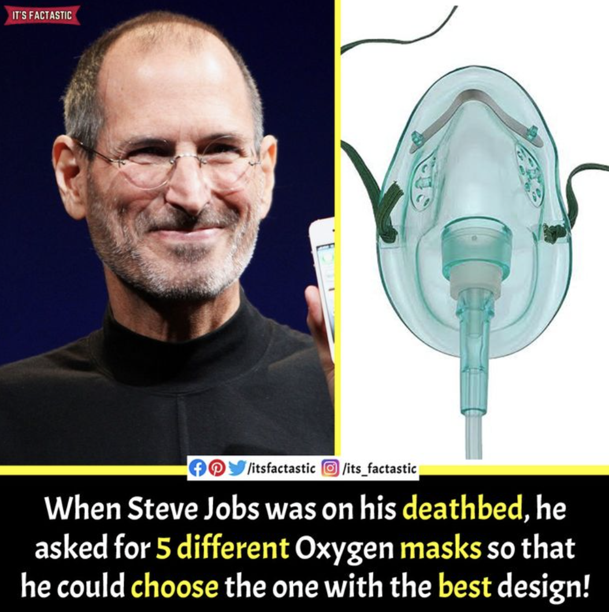

这是否让你想起曾子那番话 ——**「士不可以不弘毅，任重而道远。仁以为己任，不亦重乎？死而后已，不亦远乎？」**

> [26｜目的 = 价值观 x（目标1 + 目标2 + 目标3 + …） - 得到APP](https://www.dedao.cn/course/article?id=w06eGYrQb1gzVxo8ERKPl73kZRqOaB)
>

### 27｜幸福 = “贡献感”
岸见一郎和古贺史健的《被讨厌的勇气》。

咱们假设医生有一位助手，助手只会做一些最简单的工作，简单到如果他不做，随便找个手脚麻利的人也能做。今天晚上正好是助手值班，医生不在。那请问这个助手幸福吗？

我认为至少在值班的这一刻，这个助手也是幸福的。今晚他镇守卫生所！谁有事儿，他是第一个要负责的人。村子需要他。

这样的幸福不需要跟人比。其实咱们想想，所谓比出来的幸福，其实归根结底比的无非是每个人的“价值”。但价值真的是可以比较的吗？村长有村长的价值，医生有医生的价值，助手有助手的价值，这些价值是在不同的方向上，其实不能比较。

只要有一个理直气壮的价值在那，你就是幸福的。

所以哲学家阿德勒提出，幸福就是你出于对社会的关心，作为共同体的一员，积极参与其中，找到归属感。幸福来自贡献。

事实上，理解了阿德勒的哲学，如果我是那个卫生所里的助手，我不需要等到值班这一天就能感到幸福。我可以随时感到幸福。

总而言之，**以贡献感为指引，你就既是自由的，也是幸福的。**

**《被讨厌的勇气》3：幸福 = “贡献感”**

这两位作者中，岸见一郎是阿德勒生活哲学的继承者和实践者，负责这本书的理论；古贺史健则是一位作家，负责把书写得好看。为了实践阿德勒的哲学，岸见一郎专门从事过很多年的心理咨询。他获得了一个洞见。  

来寻求心理咨询的，没有任性的人。

在人际关系中遭遇各种困惑、特别不喜欢自己、甚至抑郁成疾的，都是过分在意别人对自己的评价的人。他们处处感到被别人的期待牵着走，特别不自由。反过来说，任性可以让你过自己喜欢的人生。

阿德勒完全不反对你过自己喜欢的人生 —— 这可是人权！而且任性，说明你至少有“被讨厌的勇气”。但是，正如康德所说，任性也是服从于某一种 inclination，任性者其实是自己的欲望和冲动的奴隶。满足只是暂时的，任性不能带来长久的幸福。

那怎么才能得到幸福呢？康德这一套有可操作性吗？咱们今天就解决这个问题。

#### 比出来的幸福
阿德勒说人际关系是烦恼的根源，但也是幸福之源。很多人相信幸福感是跟别人比较出来的。现代人的生活水平比几十年前不知道好了多少倍，但是幸福感可没提高多少。人们最在意的总是在人群中的相对位置。

跟别人比，比赢了的确能得到幸福感，但是这种幸福不自由。怎么解决这个问题？据我观察，人们发明了两个策略。

一个是假装幸福。中国有句话叫“比上不足比下有余”，那我不和上面的人比，我专门跟不如我的人比，强行给自己灌输幸福感。另一个办法是消极幸福：我刻意地告诉自己，别跟人比！别跟人比！因为我害怕跟人比。

这些做法都是自欺欺人。本质上，你仍然认为幸福感是比出来的。

这其实不叫幸福，这应该叫“苦”。我们以前讲《为什么佛学是真的》的时候说过这个概念，苦就是 dukkha，就是“不满足”。比出来的幸福都是短暂的。好不容易赢了一场，抬头一看前面还有比你更厉害的人。年薪10万的时候觉得如果年薪能达到20万就会很幸福，到了20万却发现周围好几个人年薪50万。

用岸见一郎的话来说，这样的人生就如同参加登山比赛。你认为只有登顶了，才算是幸福的 —— 登顶之前你只能算是在追求幸福的路上。这个游戏有两个问题。

一个是，如果你始终没有达成心中的大目标，那岂不是说一辈子都没幸福过吗？第二个是，就算登顶了，你还会发现有个更高的山头在等着你。

每个人对幸福有自己的定义 —— 但是你那个定义要想在逻辑上允许你获得幸福，它最好是主动的，不能这么被动。

#### 共同体感觉
阿德勒提出的幸福，来自人际关系的高级状态，叫做“共同体感觉”。

对此我是这么理解的。比如有个小村庄，生活条件很一般，村长的收入更一般，村里很多人不论是学历还是收入都比村长高。但是，村里人大小事情都找村长，村长是全村人的主心骨。那请问，这个村长幸福吗？

我们可以想见这个村长是非常幸福的 —— 因为他知道自己的价值。他对这个村子有强烈的归属感，他是村里最重要的一员。

村里有个卫生所，主管的医生学历和收入也不高，医术也挺一般，但是村里人生了病首先来找他。他能治疗的就给治疗了，村民花不了多少钱。治不了的，他会给病人介绍最合适的医院。那你说这个医生幸福吗？

医生知道自己并不像村长那样被视为全村最重要的成员，但是他也会感到幸福。他是村民健康的第一道防线，他是村子不可或缺的一员。

那好，咱们再假设这个医生有一位助手，助手只会做一些最简单的工作，简单到如果他不做，随便找个手脚麻利的人也能做。今天晚上正好是助手值班，医生不在。那请问这个助手幸福吗？

我认为至少在值班的这一刻，这个助手也是幸福的。今晚他镇守卫生所！谁有事儿，他是第一个要负责的人。村子需要他。

这样的幸福不需要跟人比。其实咱们想想，所谓比出来的幸福，其实归根结底比的无非是每个人的“价值”。但价值真的是可以比较的吗？村长有村长的价值，医生有医生的价值，助手有助手的价值，这些价值是在不同的方向上，其实不能比较。

只要有一个理直气壮的价值在那，你就是幸福的。

所以阿德勒提出，幸福就是你出于对社会的关心，作为共同体的一员，积极参与其中，找到归属感。幸福来自贡献。

事实上，理解了阿德勒的哲学，如果我是那个卫生所里的助手，我不需要等到值班这一天就能感到幸福。我可以随时感到幸福。

#### 贡献和贡献感
为什么像比尔·盖茨、J.K.罗琳他们，已经功成名就有花不完的钱，完全被社会认可，还要继续工作呢？特别是比尔·盖茨，一方面在非洲搞慈善，最近几年还成了书评人，整天写博客推荐书 —— 其实我觉得他写的不行，但那是另一个问题 —— 他图啥呢？

阿德勒的幸福定义可以解释这种行为。J.K.罗琳几乎不可能成为比J.K.罗琳更成功的作家。比尔·盖茨的书评事业注定是没有结果的。但他们需要保持对社会的贡献感。

贡献感能解释很多幸福。比如有一位妈妈，每天全家人吃完饭，孩子玩游戏丈夫看电视，总是她一个人默默地收拾碗筷。你说这个妈妈会不会感到不公平呢？

如果她想的是，丈夫挣钱我不挣钱所以他有权不收拾，孩子们太小不会收拾，只好我收拾 —— 就算她居然真的认同一家人还有地位差异，她也绝对不会感到幸福。

可是为什么千千万万个妈妈却能心情愉快地收拾碗筷呢？因为她们知道那是在照顾家人。她是在为家庭这个共同体做出贡献。

所以你承不承认，阿德勒这个定义其实挺好。而且请注意，幸福不是由具体贡献的大小决定的，而是由“贡献感”决定的。

算贡献的大小，那是行为标准，中国话叫“论事不论心”，那样的话一个因为疾病而失能的人还能有幸福吗？他躺在病床上什么事儿都干不了，还需要别人整天照顾他，他岂不是会感到非常不幸福？

而“贡献感”，则是存在标准，中国话叫“论心不论事”。在亲人看来，这个人其实并不需要做什么，他的存在，就已经是一种贡献。

在我看来最妙的一点，是阿德勒这个“贡献感”，恰好符合康德对自由的要求。因为贡献感是由你自己决定的。

贡献感并不在于你的行为起到了什么结果，不是“如果……就……”。贡献感是你认为自己做出了贡献，你就做出了贡献，你就立即获得了幸福。

如果说贡献难分大小的话，贡献感根本就不需要分大小。你不需要非得达到一个什么客观标准才能获得贡献感，从这个意义上讲你不被任何外界的东西牵引。

贡献感是非常可控的，你随时可以单方面认为在这件事上你已经做到贡献了 —— 只要你能说服自己的内心。所以贡献感也不是被内心的某个永远不可满足的欲念驱使。事实上，阿德勒反对为共同体牺牲自己 —— 别人的命是命，难道你的命就不是命吗？你自己也不是工具！有贡献感就可以了。

也许你做的这件事别人根本看不到，也许别人还误解你，但是没关系，你自己知道你做了贡献。

当然，我理解，这个贡献感必须得真能说服自己才行，不要自欺。生活中有很多帮倒忙的事儿，有时候你以为你是在做贡献，其实别人不需要你的贡献 —— 这种可不算贡献感。关于这一点阿德勒有个“课题分离”理论，咱们后面再说。

总而言之，以贡献感为指引，你就既是自由的，也是幸福的。

#### 更大的共同体
如果你经常思考“什么是幸福”，阿德勒的这个“贡献感”肯定不会让你吃惊。各路哲人研究的幸福理论，最后都会得到类似的结论，可以说是殊途同归。比如我们专栏爱说人生要找到 “something bigger than yourself”，其实也可以说是要求有贡献感。

说到贡献感，我们必须知道你并非只属于一个共同体！有些人对工作单位有很强的归属感，结果一旦被裁员、或者退休，就很难受了，就好像被共同体抛弃了一样。

你要知道你除了属于那个工作单位之外还属于很多共同体：你属于家庭、你属于社会、你属于国家、你属于全人类，就算你死了，你还属于这个宇宙。

比如你在学校和老师的关系很不好，老师成天数落你，同学们也在老师的带动下笑话你 —— 这等于是被自己特别在意的一个共同体排斥，这个感觉很不好。那么阿德勒的建议是在一个共同体中遇到困难的时候，你应该想想更大的共同体。

往大了看，你在这个小集体里的这点冲突，不过是茶杯里的风暴而已。当然也不是说就应该回避问题，但是首先你要想到，别的地方并没有排斥你。

阿德勒这个“共同体感觉”的前提是我们必须和别人建立横向的关系，也就是人人平等。再进一步，你要把别人看作伙伴，而不是竞争对手。其实绝大多数人和你并没有竞争关系，没人一天到晚盯着你较劲。现代陌生人社会中平等合作的关系其实是最简单的。

说到这里你可能还是有很多问题。比如说如果我把别人当做伙伴，可是别人不把我当做伙伴，我怎么办呢？我为共同体做了贡献，可别人就是不认同，我怎么办？最后一讲，我们讲讲系统性的操作方法。

一旦理解，你就会发现阿德勒这一套不但是强者的人生哲学，而且是最简单的处事方法。

> [27｜幸福 = “贡献感” - 得到APP](https://www.dedao.cn/course/article?id=oWZdeMxN5Y4DJl1oY3XjB62zrR8Obl)
>

### 28｜业务表现 ≠ 成功
美国教授艾伯特-拉斯洛·巴拉巴西的《成功公式：成败背后的科学》。

先说一个前提，巴拉巴西这本书研究的成功，是世俗的、可见的成功。

你是一个作家，你的成功就是你写的书销量怎么样；

你是个律师，有多少人排着队请你帮他打官司；

你是个明星，你有多少粉丝……

这里说的成功不是你自我感觉怎么样，而是社会对你的认可。

这并不是说自我感觉的成功都是幻觉，也不是说不重要，而是那种成功不好测量。这本书研究的成功，是客观的、可测量的东西。

明确了这一点，那我们必须接受一个事实：**业务表现好，不等于成功**。

比如你是个画家。在美术学院的专家看来，你绘画的技法、作品的意境、特别是你审美的眼光，都大大超过了当代著名画家冷军。可是你的画卖不出去，而冷军的一幅画能卖出几千万元。那对不起，你不算成功。

因为业务表现是你自己的事儿。业务表现好，说明你是一个高手，但高手并不一定成功。决定你成功的不是你的业务表现，而是别人对你业务表现的评价怎么样。说白了，就是你的成功不是你的事，是我们——也就是社会——的事。

中国人都有个升学考试思维模式，默认成功是自己挣来的。我学习成绩好，那就应该让我上好大学。我努力了，就应该得到奖励。但真实世界通常不是这样。这个思维模式就和相信那些成功人士都有超强的业务表现一样错误。

**成功都是别人给的，你的成功由我们决定。想明白这一点，你对很多事情就容易释怀了。**

**分数在哪里决定成败**

**励志故事和名人传记有时候能给人带来一些启发。有些鸡汤作家和人生指南专家能从这些故事里挖掘出道理来，但那些都是个人的认识，不能上升到科学层面。科学理论，必须得可重复、可检验、有数据支持。**

成功有科学吗？我们通常对成功这件事都有点感情用事，感慨的多，分析的少。明明是一个团队完成的项目，为什么最后拿功劳的是其中一个人呢？明明两个人的水平差不多，为什么一个总升职，另一个人始终原地踏步呢？这些事儿到底是反常，还是规律，是运气，还是偶然中的必然。

你不能光看个例。你需要大规模的，最好是全面的统计。

这正是巴拉巴西他们所做的事情。现在互联网和大数据技术使得研究者能做一些极端的分析 —— 

+ 他们统计了有史以来所有的学术论文，分析每一个学者是怎么成长起来的；
+ 他们拿到美国每周所有的图书销量数据，看看每一书是怎么畅销的；
+ 他们有全世界所有的博物馆和艺术展览馆中的数据，这样他们能知道现代每一个艺术家是如何发迹的。

这些数据的特点是全覆盖无死角。可以说，他们知道一个领域内所有的成败。

然后他们找到了一些规律。他们对这些规律非常有信心，称之为“成功定律”。定律的意思就是你不服不行，不管你喜不喜欢，世界就是这个样子。

#### 业务表现 ≠ 成功
想要严肃地研究一个东西，你首先需要一个清楚的定义。到底什么叫“成功”呢？

两三岁自己会吃饭、长大每天都有起床穿衣的勇气、老了走路不用让人扶，很多人说这就是成功，可以。你创作了一个超越自我的作品，你说不管别人怎么想我认为这就是我的成功，也行。但是这本书研究的成功，不是这个意思。

这本书研究的是世俗的、可见的成功。如果你是一个作家，你的成功就是你写的书销量怎么样；你是一个品牌，你的知名度怎么样；你是个律师，有多少人排着队请你帮他打官司；你是个明星，你有多少粉丝……这里说的成功不是你自我感觉怎么样，而是社会对你的认可。

这并不是说自我感觉的成功都是幻觉，也不是说不重要，而是那种成功不好测量。这就好比说“你幸福吗？”那个是非常主观的东西，不在这本书的研究范围之内。这本书研究的成功，是客观的、可测量的东西。

明确了这一点，接下来我们必须接受一个事实：业务表现好，不等于成功。

比如你是个画家。在美术学院的专家看来，你绘画的技法、作品的意境、特别是你审美的眼光，都大大超过了当代著名画家冷军。可是你的画卖不出去，而冷军的一幅画能卖出几千万元。那对不起，你不算成功。

业务表现（performance）是你自己的事儿。我们经常谈论的各种提升自我的方法，像刻意练习、意志力、高效率，这些都是研究怎么提高业务表现。业务表现好，说明你是一个高手，但高手并不一定成功。

#### 你的成功由我们决定
第一次世界大战中，德国有个王牌飞行员叫曼弗雷德·冯·里希特霍芬（Manfred von Richthofen），曾经击落过80架敌机，外号“红色男爵（Red Baron）”。红色男爵不但技艺高超而且个性张扬，他故意把自己的飞机漆成红色，在空中特别显眼，向对方飞行员挑衅。

红色男爵不但在德国是家喻户晓，在全世界也是鼎鼎大名，出现在各种影视作品中。在他死后很多年，美国的动画片《史努比》里还有他的形象，西方的男孩几乎都知道有这么一个红色男爵。

<!-- 这是一张图片，ocr 内容为： -->

<!-- 这是一张图片，ocr 内容为： -->
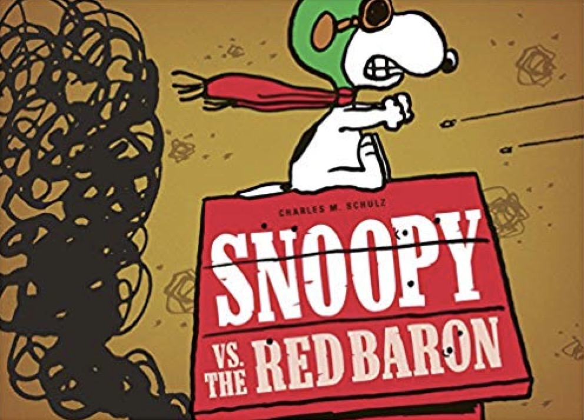

那红色男爵是一战中业务表现最好的飞行员吗？不是。同时期的法国飞行员雷内·方克（René Fonck）击落了超过100架飞机，而且自己还没事儿，战斗力水平绝对超过红色男爵 —— 要知道红色男爵可是被人击中而死的。

但是，方克的名气远远不如红色男爵。方克的维基百科页面只有18种语言，其中没有中文；而红色男爵的页面有52种语言，他甚至还有百度百科页面 —— 我还查了一下，咱们得到的用户，都有11个人叫“红色男爵”。

像这样的例子比比皆是。一说中国的水稻专家，你马上就能想到袁隆平……你可能就只知道一个袁隆平。但是在内行看来，中国有好几个水稻专家不论是科研水平还是实际贡献都超过袁隆平。

这不是时代太愚蠢，这是定律。

**成功不是取决于你的业务表现，而是取决于你的业务表现对“社会网络”的用处。**

红色男爵对德国的价值并不仅仅是击落了80架敌机。德国宣传机构需要用他这个形象去提振国民精神。红色男爵出身好、有个性、高调热爱战斗，特别符合德国的需要。德国开足马力宣传，协约国这边就会跟着报道这个敌情。可是方克就不行了，不但没战死还犯过政治错误，而且法国也没有那个宣传需求。

也就是说，决定你成功的不是你的业务表现，而是别人对你业务表现的评价怎么样。说白了，就是你的成功不是你的事，是我们 —— 也就是社会 —— 的事。

咱们中国人都有个升学考试思维模式，默认成功是自己挣来的。我学习成绩好，那就应该让我上好大学。我努力了，就应该得到奖励。但真实世界通常不是这样。这个思维模式就和相信那些成功人士都有超强的业务表现一样错误。

成功都是别人给的，你的成功由我们决定。想明白这一点，你对很多事情就容易释怀了。

但是也别太悲观！在有些领域，业务表现的确就能决定成功。

#### 网球和高中
巴拉巴西等人做过这么一个研究。他们想看看职业网球选手的成绩，和他们的受关注程度之间，有什么样的关系。

网球运动员的业务表现就是战绩。研究者统计了2008到2015年间，所有职业网球运动员的比赛记录，谁赢了多少场、赢多少分。

而关于“成功”，研究者用了一个简单方法，就是看这个人的维基百科页面获得了多少点击。如果每天有很多人去维基百科查你的资料，那就说明你的知名度很高，赞助商也就愿意找你。

有些运动员专心打球，只想赢球提高成绩。有些运动员喜欢弄些场外的戏，今天一个绯闻明天一个冲突，也能得到很多媒体报道。那花边新闻对网球运动员的成功有什么用吗？

答案是没用，网球是一个完全由比赛成绩决定成功的项目。巴拉巴西他们甚至能够根据一个运动员当天比赛的成绩，直接预测他的维基百科页面近期能得到多少访问量。

记者可能觉得绯闻有意思，但是数据分析表明球迷只看成绩。你赢球，人们就关注你；你被淘汰了，就没有你的戏。网球运动员真的不需要什么公关团队。

这个规律完全符合我们心中那个朴素的升学考试思维模式，真是分数决定一切。而事实上，升学考试也真是分数决定一切。

美国有些好高中也是要考才能进的。马萨诸塞州有个特别厉害的高中叫波士顿拉丁高中，相当于是中国的“省重点”，每年都有专门的入学考试。如果你没考上波士顿拉丁高中，成绩差一点可以上一个“市重点”。如果你的分数市重点也上不了，还有一个“区重点”。如果这三个高中都没考上，那你就只能去公立高中，就相当于中国的普通高中。

那么研究者就想看看，上一所好高中，对学生未来考大学的成绩，到底有没有提升作用。注意好高中的大学录取率高并不能说明问题，因为好高中的生源质量本来就好。

科学的方法是，我们对比这样的两个学生：**学生A刚好达到重点高中的录取分数线，学生B只比录取分数线低一分。他们原本的水平几乎一样，但是A去了省重点，B只能去市重点。那请问，这两个学生将来考大学的时候，他们的成绩会不会有显著的差距呢？**

答案是完全没区别。研究者统计了像A和B这两个人高中毕业时的标准化考试的成绩，结果是一样的。不但省重点和市重点没区别，市重点和区重点、区重点和普通高中，对于正好跨线的两个人来说，都没区别。

那如此说来，重点高中并没有提升你的成绩 —— 是你提升了重点高中的成绩。

这个结论有点违反常识。难道说重点高中不是师资力量更强、同学水平更高、在这个高水平环境里你才能学的更好吗？

这只能说我们低估了分数的重要性。在绝对的分数面前，环境因素没有那么厉害。

**业务表现跟成功通常是两回事。成功不是由你的业务表现决定，而是由你的表现对社会网络的用处决定。但是，在某些特定的领域，业务表现的确驱动了成功。**

这些领域的特点是业务表现是可测量的。网球运动员的战绩，学生的分数，明明白白就摆在那里，这是最硬的东西。

那如果一个领域的业务表现是不可测量的，会怎么样呢？特别是，好大学，能不能给学生提供“软实力”的加持呢？

> [28｜业务表现 ≠ 成功 - 得到APP](https://www.dedao.cn/course/article?id=ml9WNdP1QvaeKYdOWRXAzx82Dyog0B)
>

### 29｜喜欢 = 熟悉+意外
**“多看效应（Mere Exposure Effect）”，意思是你之所以觉得这个东西美，是因为你比较熟悉这个东西。**

我们这里说的美未必是高大上的那种美，简单说就是你喜欢，你觉得好看。心理学家在无数的实验中让受试者选他喜欢的东西，最后选出来的都是他熟悉的东西。所以多看效应的意思就是“看得次数多了就喜欢了” —— 也可以说是“吐啊吐啊就习惯了”。

但公式里说的「熟悉」和重复还不一样。重复会导致审美疲劳。最理想的情况，是在一个意外的场合，看到自己熟悉的事物，你才会特别喜欢它。用中国话来说，就是“他乡遇故知”。反过来也对—— 如果你整天面对一个熟悉的事物，哪天它突然给你来点意外小惊喜，你也会感到它特别美。

人确实喜欢新奇的东西，但如果东西过于新奇，又会让人感觉到害怕。所以原则是“尽可能地前卫，只要能被人接受”，而且还专门有个英文缩写来命名这个原则，叫MAYA（most advanced yet acceptable）。最理想的效果，就是你的设计特别大胆，而观众还立即就能理解。

**最容易被人接受的东西，往往是在熟悉和新奇之间找到了一个微妙的平衡。**

**喜欢=熟悉+意外**

不管你是媒体人、奢侈品商人还是广告人，你都希望能吸引消费者的注意力。不管你从事什么工作，你都希望别人喜欢你的东西。

最新一期《大西洋月刊》上有一篇文章，“什么能让东西显得酷？”（_What Makes Things Cool？_），作者是德里克·汤普森（Derek Thompson）。

有人认为美是客观的，比如说黄金分割比例，或者对称的东西就是美的。也有人认为美其实是主观的，没有固定标准，正所谓“情人眼里出西施”。这两派说的都很有哲学味道……但是不用再争了，心理学家现在已经有答案了。

这是一个非常非常坚实的结论，有几百项研究支持 —— 你之所以觉得这个东西美，是因为你比较熟悉这个东西。这个效应叫做“多看效应（Mere Exposure Effect）”。

我们这里说的美未必是高大上的那种美，简单说就是你喜欢，你觉得好看。心理学家在无数的实验中让受试者选他喜欢的东西，最后选出来的都是他熟悉的东西。所以多看效应的意思就是“看得次数多了就喜欢了” —— 也可以说是“吐啊吐啊就习惯了”。

**但熟悉和重复还不一样。**重复会导致审美疲劳。最理想的情况，是在一个意外的场合，看到自己熟悉的事物，你才会特别喜欢它。用中国话来说，就是“他乡遇故知”。反过来也对 —— 如果你整天面对一个熟悉的事物，哪天它突然给你来点意外小惊喜，你也会感到它特别美。

举个例子。有个音乐推荐应用，Spotify。它最早的推荐算法设计思想是只推荐用户没听过的音乐。但是内部测试的时候，程序有个bug，在新音乐之外还错误地推荐了一些用户已经听过、甚至很熟悉的音乐。这样测试了一段时间效果还不错。后来程序员发现了bug，立即改正，让程序只推荐新的音乐，结果发现改正后的算法反而没有原来的算法受欢迎！

所以你要在新奇和熟悉之间寻求一个平衡。我们并不喜欢完全陌生的东西，我们总希望能从中发现点熟悉的元素。

这就不得不提到一位牛人 —— “工业设计之父”雷蒙德·洛威（Raymond Loewy）。洛威以一人之力左右了二十世纪美国人的审美，他的作品包括壳牌石油标识、灰狗巴士、宾夕法尼亚州铁路机车、美国总统专机空军一号的蓝色大鼻子涂装等等。洛威的设计哲学，就是“陌生又熟悉”。

洛威发现，人确实喜欢新奇的东西，但如果东西过于新奇，又会让人感觉到害怕。所以他的原则是“ 尽可能地前卫，只要能被人接受 ”，而且还专门有个英文缩写来命名这个原则，叫MAYA（most advanced yet acceptable）。最理想的效果，就是你的设计特别大胆，而观众还立即就能理解。

你应该记住这个MAYA原则。它的应用范围非常之广。汤普森举了好几个例子。

比如说，如果你是一个科学家，要写个课题计划去申请研究经费，你就应该先考虑一下这个MAYA。有人做过一个很大的实验，找人写了新奇和熟悉程度不同的各种课题计划，随机交给专家评审。结果发现，被专家打分最低的计划恰恰是那些想法全新的计划！不都说要鼓励大胆创新吗？—— 真实情况是新可以，但是不能太新。当然那些毫无新意的计划的得分也很低。**实验证明最容易获得经费的课题，是在现有已经成熟的概念之上的改良式的创新。**

这大概就是为什么革命性的创新往往一开始是不被支持的。人都有点保守的倾向，就连学术界也是如此。

就连风险投资界都能被MAYA左右。有研究表明，如果一个创业公司的想法过分新颖，投资人根本看不懂，那就一定不会出钱。如果你的概念太老，也没法获得投资。最容易获得投资的创业思想，是把过去已经被市场证明可行的一个想法用在一个新的领域。

比如说，eBay已经广为人知了，现在你发明一个商业模式叫Airbnb，让人出行的时候可以住在当地人家里，而不必去住旅馆。那你怎么向投资人解释Airbnb呢？你就说“Airbnb就是租房界的eBay”。

等到Airbnb大获成功了，又有人想出一个商业模式，Uber。怎么向投资人解释Uber呢？“Uber是出租车界的Airbnb”。

那么下次你想出一个什么新商业模式，你就可以跟投资人说这是“XX界的Uber”。

而电影界的MAYA则可能有点过分保守了。汤普森说，美国电影在过去16年间，有15年的票房冠军要么是老电影的续集，要么就是畅销书的改编，几乎都不是原创剧本。老人物，老故事，都跟漫威的漫画一样千篇一律全是俗套的老IP。这显然是因为美国大片的投资数额巨大，不敢轻易冒险。老IP就算没有惊喜，至少能保证票房。

汤普森说电影人为什么不像电视剧学习呢？美国电视界近年的套路是“新人物，老故事” —— 一开始的故事框架让你很熟悉，但是其中人物性格和行事方式能给你带来惊喜，结果剧情就非常不一样。这就是为什么美剧的剧情比电影先进。

前面提到的工业设计大师洛威，甚至参加过美国宇航局第一个空间站的设计！他想方设法把空间站内部设计得有点像是地球上的房屋，给宇航员增加一点熟悉的感觉。最关键的一点，是洛威坚决要求给空间站安装了一个窗口，让宇航员能够时刻看见地球。

在太空那么陌生的环境中，能看一眼地球是多大的安慰啊。 

> 最容易被人接受的东西，往往是在熟悉和新奇之间找到了一个微妙的平衡。 
>
> 如果你对“刻意练习”这个概念比较熟悉的话，你会马上意识到，所谓的“熟悉和新奇之间的平衡”，不就是我们常说的“学习区”吗？
>
> 心理学家把人对外界的感知分为三个区域，最里面第一层是“舒适区”，是我们熟悉的事物；最外面一层是“恐慌区”，是我们完全陌生的事物。“学习区”，是在舒适区和恐慌区之间，既有熟悉，又有新意。刻意练习一定要在学习区进行练习。
>
> 今天这个理论就相当于把学习区的原理推广到了其他领域。我们不但应该在学习区练习，而且应该在学习区研究、工作和娱乐。
>
> 关键的一点，就是你要敢于从舒适区往外走一步，但是还不能走得太远。面对这个世界你不能一味迎合，你要敢于任性地加入一点新东西，但是为了你自己的安全起见，也不要太新！ 
>

### 30｜错误 = 偏差+噪声
卡尼曼列举了几个真实的例子，来说明现实生活中的噪声——

+ -两起相似的挪用公款案，一个人只被判了 117 天监禁，另一个人却被判了 20 年；
+ -当地足球队周末比赛输了，周一的法官可能会给更严厉的判决；
+ -如果当时快到午饭时间了，法官感到很饿，判决通常会更严厉……

**精确理解你的判断**

卡尼曼作为一个心理学家，拿到了 2002 年的诺贝尔经济学奖。他的《思考，快与慢》2011 年一出版就是经典，被无数的书籍和文章引用。他提出的「系统一」和「系统二」这两个概念已经成了我们文化的一部分。《快与慢》已经把人在决策判断中的各种思维偏误给说得很全面了。

《噪声》不但讲了一个系统性的新东西，而且讲出了一个绝对的高度。《噪声》的难度比《快与慢》还要高，它稍微用了一点点数学，要想精确理解，裴波那契难度系数大约是 13。我读此书常常读着读着拍案叫绝，**感觉它就好像一块磨刀石一样把我的大脑也磨锋利了一点。**

这本书的另外两个作者也不一般。奥利维尔·西伯尼（Olivier Sibony）是巴黎高等商学院的战略和商业政策教授，同时还是麦肯锡的高级合伙人。卡斯·桑斯坦（Cass Sunstein）是哈佛大学教授和哈佛行为经济学和公共政策项目的创始人和主任，还曾经担任过奥巴马时期的白宫信息和监管事务办公室主任。这两人都跟卡尼曼有过合作研究，而且都真的把决策科学用在了实际工作之中，而且他们都出版过相关领域的畅销书。这个三人组可谓是**立德立功立言，人生赢家**。

每个人都会遇到大大小小的决策判断。平时购物选择、语文老师给学生作文打分、找工作面试这些都需要判断。但是在这个系列中，我想邀请你暂时抛开寻常老百姓的思维，想象自己是一个企业的高管、甚至是一位国家领导人，你要非常郑重地思考。如果你的思维拉胯了，你让上不了台面的小情绪和业余认知影响了判断，做出错误的决策，你就对不起合作者、对不起员工、对不起国家。

我故意说这么严重，是因为卡尼曼提出了一套极为郑重的判断思维方法。这套方法其实不复杂，它的难处就在于使用者必须有个郑重的心态，有个仪式感。

郑重到什么程度呢？卡尼曼提出一个特别好的说法，叫「决策卫生（Decision Hygiene）」。这就好像医生给人做手术之前必须先仔仔细细洗手一样，我们做判断也要有一个卫生的流程。如果你胡乱考虑各种信息、没有套路、稀里糊涂说不清、凭直觉就做了决策，你就是不讲卫生。

那这本书到底讲了什么呢？简单说，《快与慢》说的是人类判断中的「偏差」，而《噪声》说的是人类判断中的……「噪声」。

这一讲咱们先把这几个概念辨析一番。概念辨析将会贯穿在我们整个的解读之中。你会发现，思维要想变得锋利，首先就得把各种概念精确化。

**「判断（judge）」**，精确含义是大脑对事物的测量，并且必须形成一个客观结论。

+ 比如公司招聘，这个人我们该不该录取，这就是判断。该，或者不该，你给个准话。
+ 比如说全球新冠疫情有多大可能性在未来一年之内结束，你给个概率，也行。
+ 如说保险公司的一个经理给人评估一个项目的保费是多少，要形成一个数字，这也是判断。

判断的关键特点是要客观。比如人们对电影的评价是非常主观的，你喜不喜欢都有理，没法论个输赢。但是，《悬崖之上》这部电影最终的票房能达到多少，这个是一道判断题。你可以不喜欢它但是判断它的票房会很高，也可以很喜欢它但是判断它的票房会很低，判断跟喜好无关 —— 而你的判断，至少在理论上，将来是可以验证的。

所以判断不是寻常的观点，而是不带个人立场的、客观的结论，应该建立在事实和逻辑之上。能理解这一点其实就已经很不容易了。我们看人们日常的议论，微博上那些言论，大多数根本分不清自己是在做判断还是在表达喜好。我们要做一个“士”，一个稳重的成年人，最好多研究怎么拿主意少表态，多琢磨判断少抒发情绪。

判断的目标不是为了打动人，不是为了表明立场，不是为了说服人 —— 而是为了接近事实真相，避免错误。卡尼曼把判断分为两种。

+ 「**预测性判断（predictive judgment）**」，预测性判断说的完全是客观事实，比如说这位 CEO 在未来两年之内能坐稳位置呢，还是会被赶下台？这在理论上是可以检测的。
+ 「**评价性判断（evaluative judgement）**」，评价性判断似乎带有一些主观的成分，比如老师给作文打分、评审委员会决定是否给一个项目拨款等等。评价性判断貌似跟判断者的价值观有关系 —— 也许这个项目并不能盈利，但是考虑到社会效益，我们还是决定批准它。但是卡尼曼有一个关键的洞见 ——**评价性判断，必须是建立在预测性判断的基础之上。你应该先有预测性判断，再做评价性判断。**也就是说，这个项目上不上，我必须先知道它的盈利前景怎么样，完了再考虑公司的价值观。我的价值观是为人民服务，也不能不问价钱盲目上马。我的价值观是鼓励学生写好作文，也得先分清楚谁写的好一些谁写的差一些。如果次序颠倒了，遇事先考虑价值观再做预测判断，那你就是胡乱决策。而且就算考虑价值观，那个价值观也必须是全公司的共同价值观、或者你自己决策体系的恒定价值观。你不能变来变去，应该当做一个客观的限制条件。

所以我们重点考虑预测性判断。而卡尼曼的一个关键要求是不同的人做出的判断应该尽量是一致的。这道数学题到底等于几，答案不应该跟你的性格、经历或者星座血型有关系。如果大家的判断差别非常大，那就有噪声问题。

「偏差（bias）」和「噪声（noise）」。看图比较容易理解，下面这张图表现的是四支射击队打靶的成绩 ——

<!-- 这是一张图片，ocr 内容为： -->
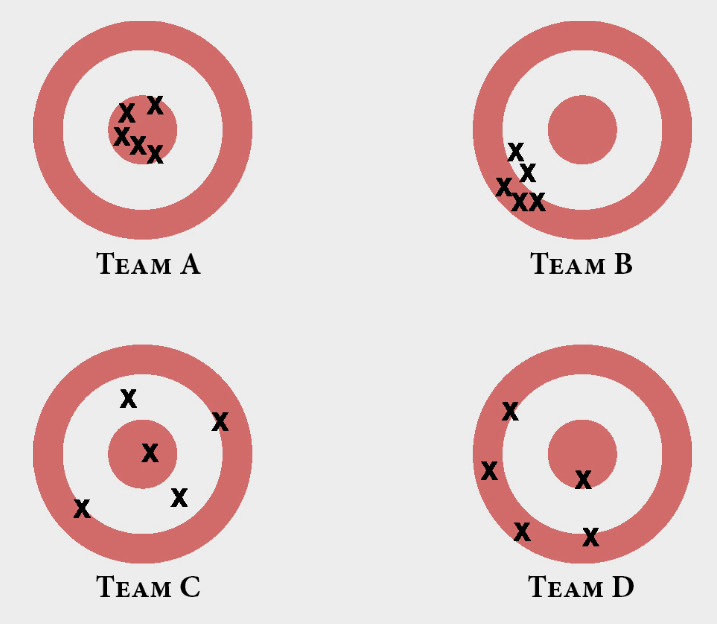

+ A 队五发全都命中靶心，我们说它整体的误差都很小。
+ B 队的五发全都打偏了，但是偏的方式是一样的，全都达到了靶子的左下方，我们说它的偏差比较大，但是噪声很低。
+ C 队打的靶子上哪都有，但是整体上、平均而言是以靶心为中心均匀分布，我们说它的偏差很小，但是噪声很大。
+ D 队，打得又偏又分散，我们说它的偏差和噪声都很大。

用一个公式来说，错误（Error）= 偏差（bias）+ 噪声（noise）

其中偏差，是系统性的错误。是都往一个方向偏。是全队的判断普遍高估或者普遍的偏左，是一致的行为。而噪声，则是判断的分散，是互相之间都不一致。

再简单点说，以射击而论，偏差是这把枪有问题，打出去子弹总往一个方向偏；噪声是打枪的人手不稳，哆哆嗦嗦有时候往这边偏有时候往那边偏。

真实世界中的判断往往不能马上知道结果，相当于下面这样，我们只看到了子弹的落点，不知道靶心的位置 ——

<!-- 这是一张图片，ocr 内容为： -->
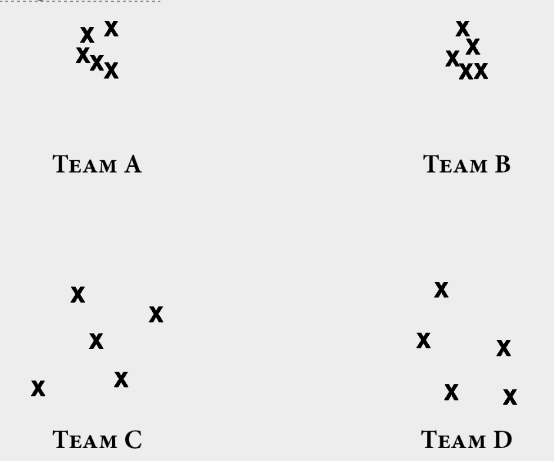

但是仅凭这张图，你也能看出来 A 队和 B 队的噪声小，C 队和 D 队的噪声大。

而卡尼曼全书最重要的一个结论，就是对错误来说，偏差和噪声的贡献是一样大的。这就是全书唯一用到的数学。简单说，统计学上通常使用「均方误差」表示整体的错误，而这个数学公式是 ——

均方误差（MSE） = 偏差^2 + 噪声^2

你减少噪声和减少偏差一样，都能减少整个的错误。

这个说法稍微有点反直觉，我得解释几句。我们回到带靶子的那张图 ——

D 队的偏差跟 B 队是一样的，只是 D 队的噪声更大。减少噪声，就是要把 D 队变成 B 队。你可能会说，这真的好吗？D 队虽然手不稳，可是毕竟有一发命中靶心，这不挺好吗？不是的。**D 队虽然有一发偶然命中，但是其他几发距离靶心更远了，总体而言，D 队的成绩比 B 队差得多。**

减少噪声，哪怕结果都是偏的，也比既是偏的又有噪声好一倍。哪怕你不知道偏差有多大，也应该减少噪声。

可能有人又会说，有噪声的话只要取个平均值不就行了吗？也不行。卡尼曼列举了几个真实的例子，你看看现实生活中什么叫噪声 ——

+  两起相似的挪用公款案，一个人只被判了 117 天监禁，另一个人却被判了 20 年；
+  同样的贩毒，落在这个法官手里就是十年，落在那个法官手里就是一年；
+  当地足球队周末比赛输了，周一的法官可能会给更严厉的判决；
+  如果当天正好赶上被告过生日，法官常常会从轻发落；
+  如果当时快到午饭时间了法官感到很饿，判决通常会更严厉……

这合理吗？这种判决都是一事一议，不会有五个法官对一个案子分别判决给你取平均值的机会。一个过宽一个过严，两次不公正的判决，不会平均成两次公正的判决。保险经理评估保费也是这样，估低了公司拿不到利润，估高了公司拿不到订单，结果都是损失。

偏差和噪声同样重要。哪怕你平时不怎么需要做什么决策判断，读一读、深刻理解此书，也能让你的思维水平上一个台阶。这本书更大的教训可能是你应该养成**精确思考**的习惯。

[30｜错误 = 偏差+噪声 - 得到APP](https://www.dedao.cn/course/article?id=rykaNlMY5gn3Jq1eBgJ7EAROW0DLje)

### 31｜窈窕淑女效应：如何塑造一个人？
「**窈窕淑女效应**」可以借助萧伯纳的戏剧《卖花女》来理解它。这个戏剧后来被改编成好莱坞电影，也被翻译成《窈窕淑女》。故事说：

有个语言学家跟人打赌，说他能把一个粗俗的街头卖花女，名叫伊莉莎，给训练好，让她学会上流社会的口音，变成一位淑女。

语言学家的口音训练很顺利，可是别人还是一眼就看出来伊莉莎不是淑女，举止仪态都不对。后来有人提出一个洞见——你要想让她成为淑女，就必须像对待淑女那样好好对待她。伊莉莎就享受了淑女的待遇，处处受到尊重，最后果然成了一个真正的淑女。

**这说明，你把别人当成什么样的人，别人慢慢就会变成什么样的人。你认为自己是个什么人，你自己就会变成什么人。**我们干脆就把这种现象，叫“窈窕淑女效应”。

这给我们的启发是，很多情况下，人心本来是个“叠加态”。你想把它观测到什么状态，它就会往什么状态塌缩。这就是“预期”的力量。我们时刻都在给自己讲一个故事，说我这么做，是因为我是个这样的人。

而我们今天看到，人确实都是高度可塑的，或许你能把这个效应用起来。

**《俭省》4:窈窕淑女效应**

上周末咱们讲“薛定谔的猫”，有位读者在留言区讲了个笑话，叫“薛定谔的滚” —— 如果女朋友让你“滚”，她其实是处在真的让你滚、和让你过去抱她，这两种心理状态的一个“叠加态”。

你的下一步行动 —— 用物理学的话叫“观测” —— 将会使这个叠加态塌缩到一个固定的状态。你要是真滚了，她可能就是真的想让你滚；你要是过去抱她，她可能就认为自己原本就是想让你抱她。

作为一个前物理学家，我必须说明，“薛定谔的滚”和“薛定谔的猫”是两码事。一个关键区别是，量子叠加态的塌缩结果是完全不可控的，物理学家就算满怀良好的祝愿，也不能让猫塌缩成“活”的可能性增加一分。

而你，却可以左右你女朋友的波函数。

俭省思维模式的关键在于怎么开发手里现有的资源。资源还是这个资源，女朋友还是这个女朋友。你有什么办法，能让她变得更好一点呢？ 

#### 你当她是什么人？
1970年代，有人拿男女大学生做了一个相亲实验。实验中的相亲对象从来没见过面，而且在相亲过程中也不见面，只是通过电话交流。实验人员通过“偷听”这些电话里的对话，来评估每一对男女的进展程度。

实验有个有点儿残忍的设定。某些男生会在电话相亲之前，收到了他的相亲对象的照片 —— 但是他不知道，这个照片其实不是那个女生的，而是研究者专门找来的一位特别出众的美女的照片。

男生以为自己是在跟“女神”相亲，我们可以想象他肯定会表现得更好一点 —— 但是研究者关心的不是这个男生的表现，而是电话那头这位女生的表现。

**结果是被男生误以为是女神的这位女生，表现得也和女神一样。她说话非常友好，给人感觉很善于交际，聪明伶俐讨人喜欢。**

**这当然就是我们以前常说的“正反馈”。你以为她很好，你就对她很好；你对她很好，她就真的表现很好；她表现得很好，你就更加相信她很好。**

关键在于，你们俩之间这个反馈过程往往是非常微妙的，各种无法言传的表情和声调变化，都能被对方捕捉到，还能产生不经意的效果。

萧伯纳有个戏剧叫《卖花女》，后来被改编成好莱坞电影，也被翻译成《窈窕淑女》。**这个故事说有个语言学家跟人打赌，说他能把一个粗俗的街头卖花女，名叫伊莉莎，给训练好，让她学会上流社会的口音，变成一位淑女。 **

语言学家的口音训练很顺利，可是别人还是一眼就看出来伊莉莎不是淑女，举止仪态都不对。后来有人提出一个洞见 —— 你要想让她成为淑女，就必须像对待淑女那样好好对待她。伊莉莎就享受了淑女的待遇，处处受到尊重，最后果然成了一个真正的淑女。

你当她是个什么人，她最后就真的是个什么人。科学家早就知道这个效应，叫“窈窕淑女效应（Pygmalion effect）”。这个效应的适用范围，非常之大。 

#### 自证预言
我们现在说心理学实验不靠谱，其实早在1960年代，哈佛大学心理学家罗伯特·罗森塔尔（Robert Rosenthal），就有过一个更深的担心。当时人们已经知道，有些动物能体察到人给它的最微小的暗示，比如一匹马居然能根据主人的暗示用前蹄在地上敲击数字，还骗了科学家好几年。罗森塔尔就说，如果你做实验用的那些小白鼠，能够感受到你想要什么结果，并且按照你想要的结果去行动，那你的实验结果还有意义吗？

罗森塔尔据此写了一篇质疑整个学界的文章，但是没有受到广泛重视，这个问题可能到今天也没解决。但是有一位小学校长，叫雅各布森（Jacobson），看了罗森塔尔的论文，说那咱们干脆拿小学生做个实验验证一下你这个思想吧。 

这就引出了一个无比经典的教育实验。

美国小学的老师都是只教一个固定的年级，并不跟班走，所以学生每学年遇到的老师都是新的。在这个小学的新学年开学的时候，雅各布森和罗森塔尔把每个班的学生都分成了三组：天赋组、中等组、低于平均水平组。学生和家长都蒙在鼓里，他们只把分组情况告诉了老师，说这是上学期测验的结果。

真相是，分组完全是随机的。但是老师不知道。结果老师们对“天赋组”的学生寄予了很大的期望，在接下来的八个月里，他们在教学中更关注这些学生，给这些学生更有挑战性的问题，就算学生一时之间做不好，他们也认为这个学生肯定是有潜力的，只不过还没发挥出来。

这些被随机分配到天赋组的学生，非常非常幸运。实验结束后的一个测验，一年级的班级平均成绩提高了12分，而“天赋组”的平均成绩提高了27.4分。二年级的效果没那么明显，班级平均提高7分，“天赋组”提高了16.5分。

你当这些学生是什么水平，他们最后就真的表现出这种水平。后来人们发现这个现象实在是太普遍了，美国社会学家罗伯特·莫顿（Robert K. Merton）给起了个名字，叫“ 自证预言（Self-fulfilling prophecy） ” —— 你“预言”局面会如何如何，因为你按照这个想法去做了，局面真的就会如何如何。

**类似的研究做过很多。如果经理一开始“误以为”手下这个雇员水平很高，经常给他安排比较难的任务，还跟他讨论公司战略问题，结果这个雇员就会真的水平越来越高。**

反过来说，如果你认定一个学生调皮捣蛋，甚至公开羞辱他，他就会按照你的预言行事，故意捣乱。某公司要转型，如果高层从一开始就认定员工会抵制这次转型，搞各种防范措施和强制行动，员工真的就会抵制转型。

索南史恩以一个商学院教授的经验说，是，所有商学院教科书上都写着公司转型难 —— 可是实际上，员工一开始，本来对转型都是“中性”的态度。

所以很多情况下，人心本来是个“叠加态”。你想把它观测到什么状态，它就会往什么状态塌缩。

这就是“预期”的力量。那我们自己对自己的预期，也有这样的效果吗？ 

#### 你和你对你的预期
索南史恩曾经参与调研过一些环保主义者，发现他们中有很多人都是“**自我拆台型（self-defeating）**”的人格。 

比如说，普通人都开汽油驱动的汽车，而一位环保主义者开混合动力汽车。即使考虑到油价，混合动力的车也比同档次汽油车要贵一些，所以环保主义者已经是为保护环境做出了牺牲。但是你采访他，他说我做的还很不够，我根本就不应该开车，应该去坐公共汽车才对。

然后你去采访一个故意不开车每天坐公共汽车的环保主义者，他说我做的还很不够，我根本就不应该坐车，应该走路才对。

然后你去采访一个每天走路的环保主义者，他说我做的还很不够，我根本就不应该买肉吃，应该吃素才对。

他们是不是只要还活着，就永远感到很惭愧。

索南史恩说，这些环保主义者的心中，有一颗消极负面的种子。他们预期的局面很负面，局面就是越来越负面，他们就觉得自己做什么都不够。反过来说，如果你心中有一颗积极正面的种子，对局面有个正面的预期，那你的命运就可能非常不同。 

这段书里我最喜欢的一个故事，不是什么经典的研究实验，而是一百多年前一位黑人女企业家的事迹，她就是沃克夫人（Madam C. J. Walker）。

沃克夫人创业的那个年代，美国黑人地位非常低，她深陷贫困，是个单亲妈妈，而且身体还有病。她做生意处处碰壁，到外地出差别连旅馆都不让她入住。但是她居然就慢慢做大了。

以前我听说一句俏皮话，说“**巴菲特等待机会，索罗斯寻找机会，本·拉登制造机会**”。沃克夫人，就是个能自己制造机会的人。 

<!-- 这是一张图片，ocr 内容为： -->
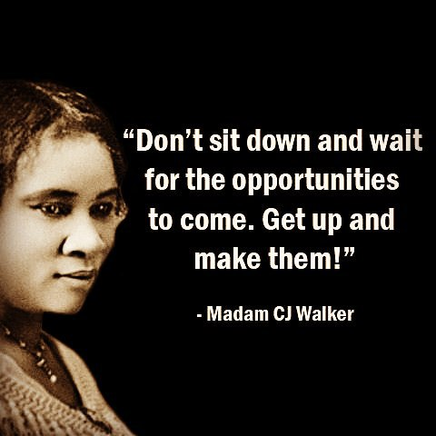

沃克夫人是史上第一个成为百万富翁的黑人女性。她的创业故事咱们就不细说了，我只想说一点。沃克夫人专门雇佣黑人女性在各地当推销员，当时一般无技能工人的平均工资是每周11美元，而沃克夫人给这些推销员的工资，是每天，5到15美元。

她想用高工资改变黑人女性的形象。沃克夫人要求手下这些女推销员攒钱买房，好好教育孩子，而且还都要给慈善机构捐款！她可以说是以一己之力提升了黑人女性的社会形象。她把挑战都当成机会。

她有很好的期望，结果就有很好的收获。 

> 你把别人当成什么样的人，别人慢慢就会变成什么样的人。你认为自己是个什么人，你自己就会变成什么人……这套说法，要是十年以前的我，肯定会认为是鸡汤。 
>
> 我记得有一次在论坛跟人争吵，有人就给我讲苏东坡和佛印的典故，说你如果是佛，看别人就也是佛 —— 你要是看别人是牛粪，那你自己也是牛粪。我说是吗？我就找了一张牛粪的照片给他看：你说这是牛粪还是佛？
>
> 我想说的是，心理学的规律并不一定在哪里都有用，需要环境、人、和时间的配合。给足够的互动时间，今天说的内容也许就能发挥作用。
>
> 索南史恩说的这个“预期”，放在自己的身上，其实就是“叙事自我”。**我们时刻都在给自己讲一个故事，说我这么做，是因为我是个这样的人。而我们今天看到，人都是高度可塑的。 **
>
> 
>
> 云对雨，雪对风，佛陀对苍生。我对你，嘴对心，九夏对三冬。我们都想想，应该怎么对家人、同事和自己吧。 
>

> [31｜窈窕淑女效应：如何塑造一个人？ - 得到APP](https://www.dedao.cn/course/article?id=2m845Ln7q69yKOOAW6KrkebvGDYjgl)
>

### 32｜安慰剂效应：如何判断一个东西是否有效？
「**安慰剂效应**」来自医学研究，它说的大致是：生病的时候，你吃的不是药，你吃的是“安慰”。你在整个求医过程中获得了一种极大的心理暗示，你特别相信这个药有效，结果这个药就真的有效！

安慰剂效应到底是怎么回事儿，现在医学界仍然没有一个定论。但通过安慰剂效应，我们对医学应该有一点新的认识：

1. 安慰剂效应广泛存在。

2. 很多长期使用的治疗手段，甚至是手术，并不比安慰剂的效果好。

3. 安慰剂效应的一个可能原因是疼痛感是一种主观的感觉，但是为什么安慰剂对哮喘、帕金森症、儿童多动症、肠易激综合征这些病也有效，的确很难解释。

**了解安慰剂效应，善于使用科学方法，是我们“防忽悠”的最佳办法。**比如，给老人花很多钱买了电视广告大量宣传的补品，老人吃了之后表示有效，那你能说这个补品真的有效吗？很可能就是一种安慰剂效应。你得找对照组，吃同样精美包装、同样味道的“假补品”，看看有没有类似的效果。

所以了解安慰剂效应之后，下次有人再鼓吹什么东西有效，请你问他一句：敢不敢做个随机实验。

想象一个场景。假设你最近总觉得头痛。也可能因为没休息好，也可能因为工作紧张压力大，总之就是疼，很难受。于是你就去看了本市最好的医院，托人找到治疗头痛最好的医生。这个医生特别不好约，你预约之后等了一个星期才见到他。

你一见到这位医生感觉就放心了。医生的形象、说话的语气、做事的风格都特别专业，而且态度和蔼可亲，一看就是一位素质过硬的好医生。他详细询问了你的病情，然后安排你做了全面的检查，什么 CT 之类相关的项目都上了。你折腾了半天，拿着检验结果回到医生的办公室，医生仔细研究了所有的片子和数据。

医生郑重地对你说，你这个病比较严重，但是现在国际上刚刚有人研究出来一种疗法，我恰好知道这个疗法，我能给你治好。你需要服用一种很贵的进口药，价格是一千块钱一片，每天两片，一个月见效。幸运的是这个药已经被列入国家医保药物目录，你自己并不用花很多钱。医生给你开了药，告诉你回去一定要按时吃，而且吃药必须使用温开水，要在饭前吃。特别要求，吃药期间绝对不能抽烟喝酒，生活起居都要有规律，以免影响药效。

你千恩万谢地告别医生，到药房拿到了一瓶珍贵的进口药。你一看瓶子上的单词都不怎么认识，药丸的形状也很不同寻常，感觉特别高级。

你按照医生的吩咐吃了一个月的药。效果非常好，你现在感觉几乎就不疼了。

到医院复查的时候，医生告诉你，他给你服用那个药里的成分，其实就是普通的糖。你是吃了一个月糖豆，把病治好了。

这就是“安慰剂效应” 。你吃的不是药，你吃的是“安慰”。你在整个求医过程中获得了一种极大的心理暗示，你特别相信这个药有效，结果这个药就真的有效！

**安慰剂效应到底是怎么回事儿，现在医学界仍然在研究之中，没有一个定论。但是所有医生都知道，安慰剂效应的确存在，而且效果强大。**

当然，真实行医过程中医生大概不会故意给病人开安慰剂 —— 这么做就算特别有效，也是不道德的，你不能让病人花进口新药的钱吃糖豆。医学界更多的是使用安慰剂测量真实药物的有效性。

比如你发明一种号称能治疗抑郁症的药，那么在这个药被政府部门正式批准上市之前，就要做一个有效性实验。有时候实验中就是把病人随机分成两组，其中一组吃你这个药，另一组吃的则是外观和味道完全一样，但成分是糖豆的安慰剂。实验一般要求“双盲” —— 也就是病人不知道自己被分到了哪个组，连发药的医生护士也不知道哪个病人在哪个组，这样就让所有人在一样的环境中治疗，那么唯一的区别就是真实的药效。

而实验往往就会发现安慰剂组的病人的病情也缓解了。那么吃你这个药的组的病人病情的好转情况，如果不显著好于安慰剂组，那就说明你这个药并没有真实的有效成分。

这些道理非常简单，应该作为每个现代人都应该知道的医学常识。

**但我下面要说的，可就不是常识了。**

吃药治头痛是安慰剂效应这个我们容易理解，毕竟头痛是个常见的小病，很多头痛本来就是心理作用。那要是关节炎、后背痛、哮喘这些实实在在的病呢？那要不是吃药，而是手术呢？

“手术是个大大的安慰剂”（ _Surgery is one hell of a placebo _），作者是科学作者克里斯蒂·阿什万登（Christie Aschwanden）。这篇文章说，现在有一系列大规模研究证明，很多手术 —— 包括一些特别常见的手术 —— 效果并不比安慰剂更好。

所谓手术的安慰剂就不是吃药了，而是“假手术”，英文有个专有名词叫“sham surgery”。

有很多人长期感到膝盖疼，有一个专门治疗这种病的手术叫“关节镜膝盖手术”，美国每年要做大约70万例（2010年全年做了692,000例）。这个手术的理论是说人之所以膝盖疼，是因为他的半月板有退行性的磨损。手术要打开膝盖，对半月板进行修复。这个原理直截了当，而且手术后病人的确感到不疼了，所以应该没问题吧？这就是为什么长期以来医生们都是这么做。

但新的研究说，你做个假手术，也能取得同样的效果。这个研究是这样的。招募一些病人，事先告诉他们会被随机分成两组，一组做真手术，一组做假手术，而病人并不知道自己被分到哪个组。假手术和真手术的过程几乎是一样的：手术前几天病人要节食，手术时好几位医生护士联合行动，手术部位要被消毒，病人被全身麻醉，如果病人在手术过程中意外醒过来，他还能看到电视屏幕上显示自己的膝盖已经被打开了，正在做手术 —— 只不过那是录像而已。真实情况是，假手术中医生也会切开病人的皮肤，留下一个伤口，然后也按照手术流程包扎好 —— 但是并没有做什么关节镜膝盖手术！ 

**结果是，真手术和假手术的病人都表示手术很有效果。**医生告诉安慰剂组的病人你其实被做了一个假手术，病人的反应往往是目瞪口呆。

2014年一个综合研究比较了53项实验研究，涉及到的手术包括哮喘、肥胖症、帕金森症、胃酸反流、后背痛等等不同类型的手术，结果是对于其中一半的手术，假手术和真手术的疗效完全相同。而对占总数74%的手术，假手术表现出了一定的效果。

别的研究则显示，像治疗膝盖痛关节镜膝盖手术、治疗椎间盘突出的椎体成形术（也叫椎间盘电热疗法），这些常见的矫形外科手术，效果都不比假手术更好。

所以现在有医学家说，手术的安慰剂效应不但不比吃药的安慰剂效应弱，反而更强。假手术做得越是郑重其事、手术开刀对身体的损伤越深，安慰剂效应就越强。

到底为什么会有这样的效果呢？

可能是人的精神影响身体。病人看到手术做得这么严肃，医生如此地尽心竭力，就相信这个手术一定有效，然后身体就真的有积极正面的反应。

还有一种可能则是统计学上的“回归均值”。本来病人感到的疼痛就是个主观的感觉。经历一次大手术，皮肤毕竟被切开了，手术后因为这个手术而带来的疼痛，可能比原本的长期疼痛感觉疼得多。那么等到手术疼痛过去以后，病人一比较，就觉得原来的那个疼痛也不怎么疼了。

另一种解释，则是疼痛的来源本来就很奇怪。就拿治疗膝盖疼的手术为例。本来，医生的想法是你膝盖疼肯定是因为你的膝盖里哪个地方有毛病。核磁共振一扫描，发现半月板有磨损 —— 看来问题就出在这里！于是手术修复半月板。可是问题是，你如果扫描一下正常人的膝盖，会发现他们的半月板也有各种磨损！其实每个人的膝盖里可能都有各种毛病，但是别人为什么就不痛呢？

事实是疼痛和损伤之间并没有必然的联系。既然这个疼痛来的就很奇怪，那折腾一番不疼了似乎就不怎么奇怪了。

那既然这些手术的效果并不比安慰剂好，为什么医生们还在做这些手术呢？这可能是因为医生也不知道。真正大规模的严肃研究开展的并不多，医生们一代一代传下来的方法都是这么做，而且这么做的确有效，那就都这么做呗？

有人写了一本书来专门论述手术安慰剂现象，叫《手术，终极安慰剂》（ _Surgery, the Ultimate Placebo _），作者是外科医生Ian Harris。 

> 我们现在对医学有了一点新的认识：
>
> 1. 安慰剂效应广泛存在。
> 2. 很多长期使用的治疗手段，甚至是手术，并不比安慰剂的效果好。
> 3. 安慰剂效应的一个可能原因是疼痛感是一种主观的感觉，但是为什么安慰剂对哮喘、帕金森症、儿童多动症、肠易激综合征这些病也有效，的确很难解释。
>
> 
>
> 使用“随机实验”这个科学方法判断一种疗法的真正疗效，是把现代医学从传统医学里区分出来的重要一步。这是非常简单的道理，但是我们看到，即便在现代的主流医院里，仍然有很多主流疗法通不过这个检验。这就是为什么现在有人呼吁搞“循证医学”，也就是要对每一种疗法都做这样的严格检验。但是目前局面，这一步还差得很远。
>
> 不过我们真正今天得到的并不是对医院的抱怨，而是这个思维方式：到底什么叫“这个东西有效”？
>
> 给老人花很多钱买了电视广告大量宣传的补品，老人吃了之后表示有效，那你能说这个补品真的有效吗？很可能就是一种安慰剂效应。你得找对照组，吃同样精美包装、同样味道的“假补品”，看看有没有类似的效果。
>
> 一瓶20块钱的矿泉水，有人喝了认为比两块钱的好喝 —— 那到底是水真好喝，还是因为价格带来的安慰剂效应？至少对红酒来说，我听说过好几次随机实验，只要品酒的“专家”不知道他们喝的酒多少钱一瓶，结果他们就无法把200美元的红酒和20美元的红酒区分开来。
>
> 更大的道理是，想要在复杂世界里获得一种确定的因果关系，有时候非常困难。一个成功人士分享自己的人生经验，说他是因为有这样那样良好的生活习惯、做了这些那些别人做不到的事情，才取得了今天的成就。他“亲测有效”，那你能说他做的那些事情真有效吗？有些可能就是安慰剂效应，就算不做、只要“心诚”，也有效。也许他们成功最重要的因素是运气好。
>
> **了解安慰剂效应，善于使用科学方法，是我们“防忽悠”的最佳办法。下次有人再鼓吹什么东西有效，请你问他一句：**敢不敢做个随机实验。 
>

> [32｜安慰剂效应：如何判断一个东西是否有效？ - 得到APP](https://www.dedao.cn/course/article?id=BM30m4na5NkyKQQ2mxKjvDg7Eowd2G)
>

### 33｜巴纳姆效应：如何判断我们的特殊性？
「**巴纳姆效应**」来自于1948年心理学家伯特伦·弗拉拿自己学生做的一个实验。

他给每个学生发了一份性格测试题，并跟学生们说，根据你的测试结果，我就能判断你是什么性格。第二天，学生们果然都分别收到了弗拉给写的性格描述。学生们看完描述，弗拉让他们给自己描述的准确性打个分，满分5分，结果学生们给打的平均分是4.25分。

事实是，弗拉，只写了一份性格描述。所有学生收到的性格描述都是一样的。但是每个人都觉得那个描述说的就是自己。这是不是很奇怪？真实情况是，每个人都多多少少有一些性格描述中说的特点，因为说的一致的地方会让人印象特别深刻，人们就会感慨这说的真准啊。

这个心理学现象于是被称为“弗拉效应”，更广为人知的说法叫“巴纳姆效应”。

**这就是为什么有那么多人相信星相学。其实你要是没有对自己星座性格先入为主的成见，你可能觉得哪个星座说的都是你。并不是说这些分析说错了。这些分析都对——问题在于对每个人都对。**

不少人从家谱或者基因测序中，证明自己名门之后，也是巴纳姆效应。现在有的基因测序服务甚至会告诉用户，一千年以前，你的祖先曾经居住在英国的一个特定的村庄。这说的很可能没错——但问题在于，每个欧洲人都有个一千年以前的祖先是住那个村的。

懂了「巴纳姆效应」，我们至少可以知道： 从遗传来说，每个人都是名门之后。如果说特殊，每个人都特殊。正因为每个人都是特殊的，所以谁也不特殊。

所以**我们与其只知道往过去看，不如往前看，求新求变。**

**《我们人类的基因》3:名门之后**

我们电视剧经常有这么一种剧情。一个很不起眼的少年，无意之中被发现是名门之后 —— 可能是皇族或者朝廷重臣的儿子 —— 因为偶然原因流落民间。故事一旦发展到这儿，观众马上就意识到这个人就是主人公。

我们认为“名门之后”是一种主角光环。如果这个人的亲生父母确实厉害、像哈利·波特那种情况，他可能遗传到了某些优秀品质。可是如果一个人家里 N 代以前出过名人，像刘备说自己是中山靖王之后、汉景帝玄孙，这能有多大意思呢？

这种寻根认祖的事儿有很多。有人专门考证，发现几乎所有美国总统都是历史上的名门之后，连奥巴马都是 —— 奥巴马的父亲是个黑人，但奥巴马他妈妈的祖上可是贵族。而咱们中国，我就至少知道有两位名人，说是朱元璋的后代。

遥远的名门之后成了名人，这里面有科学规律吗？是不是他们身上有“贵族的血液”？

我们将先从心理学、再从数学上证明，所谓“名门之后”根本没意义。

#### 巴纳姆效应
1948年，有个心理学家叫伯特伦·弗拉（Bertram Forer），拿自己的学生做了个实验。他给每个学生发了一份性格测试题，就好像咱们今天常做的那种心理测试一样。弗拉跟学生们说，根据你的测试结果，我就能判断你是什么性格。

第二天，学生们果然都收到了弗拉给写的性格描述。其中有个学生的测验结果是这样的 —— 

> “你祈求受到他人喜爱却对自己吹毛求疵。虽然人格有些缺陷，大体而言你都有办法弥补。你拥有可观的未开发潜能尚未就你的长处发挥。看似强硬、严格自律的外在掩盖着不安与忧虑的内心。许多时候，你严重地质疑自己是否做了对的事情或正确的决定……有些时候你外向、亲和、充满社会性，有些时候你却内向、谨慎而沉默……”
>

这个学生一看，这说的就是我啊！弗拉让学生们给自己收到的性格描述打个分，满分5分，结果学生们给打的平均分是4.25分。

好。事实是，弗拉，只写了一份性格描述。所有学生收到的性格描述都是一样的。

但是每个人都觉得那个描述说的就是自己。真实情况是每个人都多多少少有一些性格描述中说的特点，因为说的一致的地方会让人印象特别深刻，人们就会感慨这说的真准啊。

这个心理学现象被称为“弗拉效应”，更广为人知的说法叫“巴纳姆效应”。这就是为什么有那么多人相信星相学。摩羯座是什么性格、水瓶座又是什么性格，其实你要是没有对自己星座性格先入为主的成见，你可能觉得哪个星座说的都是你。

并不是说这些分析说错了。这些分析都对 —— **问题在于对每个人都对。**

我们今天为什么说这个呢？因为从家谱或者基因测序中证明自己名门之后，也是巴纳姆效应。

现在有的基因测序服务甚至会告诉你，一千年以前，你的祖先曾经居住在英国的一个特定的村庄。卢瑟福说，这说的很可能没错 —— 但问题在于，每个欧洲人都有个一千年以前的祖先是住那个村的。

#### 六百年前是一家
咱们来思考一道数学题。每个人都有两个父母，父母也有各自的两个父母。往上一代有两个人，再上一代就是四个人，往前追溯 N 代，就应该有 2 的 N 次方个人，对吧？

那要是这么算，如果二十多年算一代，那么在一千年以前，应该有成千上万亿人都是你的祖先！可是当时世界上根本没有那么多人啊。这是怎么回事呢？

唯一的解释是一些人在你的族谱中出现了很多次。可能宋朝有个人，叫老陈，他有好几个孩子，他这些孩子的子孙后代过了多少代之后已经互相不认识了，交叉通婚，再产生的后代，那么老陈就既是他们父亲这边的祖先，又是他们母亲这边的祖先。我们的族谱并不是一个树状图，而是一张网。

这张网有什么性质呢？这是一个非常复杂的数学问题。耶鲁大学有个约瑟夫·张（Joseph Chang），对欧洲人口的历史变化做过一次计算机模拟。根据他的算法，大约在600多年以前，曾有一个男人或者女人，是今天活着的所有欧洲人的共同祖先。

那你可能要问这个人怎么这么厉害？其实这没什么，别忘了我们每个人，越往前追溯，祖先就越多。“祖先”，是个一点都不稀缺的职业。

再进一步，根据老张的模拟，1000年以前的欧洲人中，有1/5的人没有子孙后代留到今天 —— 而其余4/5的人，则是今天所有欧洲人的共同祖先。今天的每一个欧洲人，跟1000年前那4/5的每一个欧洲人，都有血缘关系。

这就相当于宋朝和宋朝以前的大多数人，只要他们有后代流传，他们就是今天所有中国人的共同祖先。当然我们传统上是你姓什么决定了你是谁家的，但姓什么只标记了男性的传承 —— 如果你认同男女平等，那么范仲淹、王安石、司马光、岳飞、辛弃疾……这些人差不多都是你的祖先。

在电影《指环王》里出演巫师萨鲁曼的英国演员克里斯托弗·李，说他家保存着完整的家谱，证明他是法国国王查理曼的后代。

他说的应该没错，但是，查理曼国王出生于公元742年，距离今天已经超过1000年了，而且它至少有18个子女 —— 那么我们有充分的把握可以说，今天每一个欧洲人都可以把查理曼国王当祖先。

这个道理是祖先很容易当，而且如果你的子女多，你就更容易当。朱元璋生了26个儿子和16个女儿。他对自己的子孙后代实行彻底的保护政策，规定朱家人不能读书、不能做官、也不能出来工作 —— 只能由纳税人养着。在整个明朝，朱元璋后代的唯一使命就是生孩子，因为他们生的孩子越多，政府给的抚养费就越多。**根据万历32年的人口统计，朱元璋后代已经超过了8万人。到明朝末年，更是超过了100万人，他们是国家严重的财政负担。**

#### 贵族血液
现在每个人都是名人的后代。好，那你可能说，这些隔着好几代的名门之后都不算数，就算贵族有点好基因也都被混血冲淡了。真正的贵族，必须世世代代都是贵族才行。那世代贵族的家庭生出来的孩子是不是就高贵的血统、就是天生的人中龙凤呢？其实是可能还不如普通人。要知道贵族为了保证自己的血统够“贵”，喜欢近亲结婚。

因为进化的不断筛选，人类绝大多数遗传疾病都是所谓“隐性遗传”。也就是说，除非来自父母的两条染色体在相同位置上都是致病基因，孩子才可能得这个病。如果父母血缘很远，出现这种巧合的可能性就很小。而如果父母是近亲，出现隐性遗传疾病的可能性就大大增加。

近亲结婚所生孩子的精神病概率和低智商概率都比普通孩子高很多。阿拉伯国家中存在大量的近亲结婚现象，所以阿拉伯人中存在低智商的概率比较高。表兄妹或者堂兄妹结婚所生的孩子比普通孩子平均要矮3厘米。

我们知道达尔文是娶了自己的表姐。达尔文没有基因的知识，但是他当时就很担心近亲结婚 —— 结果他们生了10个孩子，其中3个在11岁之前就死了。

那卡洛斯二世是什么情况呢？维基百科说他“身患多种遗传病以及智障和癫痫，体质虚弱得随时可能死亡，……下颚由于过于巨大而使他无法咀嚼。他的舌头也大得使他讲的话无人听懂。……5岁断奶，由于跛足，到10岁才学会走路。”成年以后“彻底残疾、头发及牙齿掉光、失聪及近乎失明，并且有严重癫痫……”举止怪异、被称为“着魔者”，三十多岁就死了。

为什么贵族非要近亲结婚呢？因为贵族想要把权力和财富保留在自己家族内部，不能让外人染指。中国也曾经有过这个情况，东晋各大家族之间反复通婚，近亲结婚生出了很多傻孩子。

1. **从遗传来说，每个人都是名门之后。如果说特殊，每个人都特殊。正因为每个人都是特殊的，所以谁也不特殊。**
2. 巴纳姆效应可以很方便地让你获得特殊感。
3. 真正特殊的贵族家庭，因为世代近亲结婚，反而不好。** **

你发现没有，你跟范仲淹、王安石、司马光、岳飞、辛弃疾这些人的性格都有一些共同点。所以你不是贵族谁是贵族？

说到这里你可能会想到，现在讲“阶级固化”，不就是富有阶层在一代一代之间保留了自己的优势地位吗？请注意固化是有限的，而且现代优势家庭重点关注的是教育和财富，可不是血缘 —— 专找名门通婚那种是土老财的做法。

事实上像美国常青藤名校，以前就是贵族子弟专享的，后来也是考虑到自己人搞没前途，才向全社会的人才开放。

那些以自己是名门之后为荣的人，他们最大的错误并不是不懂生物学，而是他们只知道往过去看。进化的根本特点是你得往前看。你得求新求变。

**就算你祖先英明神武，就算你一代代都继承了他的基因，你那些基因也未必适合现在这个时代。这是刻舟求剑。**

现在不用说你是朱元璋的后人，就是朱元璋本人来了，他也不好使。

> [33｜巴纳姆效应：如何判断我们的特殊性？ - 得到APP](https://www.dedao.cn/course/article?id=dA5eO3NDrGk8KP0EmMK2oxp9MRBzQP)
>

### 34｜凋零效应：如何一直保持优势不衰落？
「**凋零效应**」如果你快速给学生灌输一些知识，的确能让他们迅速获得一个成绩优势——但是，这个优势总是保持不了多久就凋零了。别人终归也会学到那些知识，而你这边后劲不足。其实这个凋零效应不仅限于早教，所有的教育都有这个效应。

1. **有意识地设置时间间隔。**不要追求在几天之内突击学完一个课程，今天学完这个，故意放一两天不学它。当你再回来提取这段记忆的时候，你会感到困难，我们想要的就是“有利的困难”。克服困难才能深度学习。

2. **先测验后学。**犯错能让你的印象更深，特别是如果你的自信心特别强，你越是相信那个是对的，结果发现它不对的时候，你的印象就越深，你就越容易记住这个知识。

3. **建立连接，混合练习。**每次练习中都应该是混合的题型，每做一道题都得临时判断该用哪个套路，这才有点学以致用的意思。

开放式的技能学起来很慢。不过你会意识到，**输了现在赢得未来的功夫，才是真功夫。**

**《范围》3：学习的快功和慢功**

这个故事当然是我编的，但是它有坚实的研究基础，代表一个普遍的学习规律。2017年，美国教育经济学家格雷格·邓肯（Greg Duncan）领导了一项大规模研究，专门提出了一个儿童早期教育的问题，叫“凋零效应（fadeout effect）”。

这个规律是如果你快速给学生灌输一些知识，的确能让他们迅速获得一个成绩优势 —— 但是，这个优势总是保持不了多久就凋零了。别人终归也会学到那些知识，而你这边后劲不足。其实这个凋零效应我们专栏前面讲过，而且它不仅限于早教，所有的教育都有这个效应。

那这是为啥呢？研究者认为，这是因为能突击灌输的知识，都属于“封闭式”的技能 —— 也就是说都是一些按照规定动作操作的流程。这种知识包教包会，但是缺乏累加作用，不能成为后面继续进步的基础。要想让人没那么容易赶上你，你需要掌握的是“开放式”的技能 —— 这种技能能跟别的知识发生连接，有复利效应。

但是开放式的技能学得慢。这一讲我们要说四种真正有效的学习方法，他们的共同特点就是慢。你会意识到，输了现在赢得未来的功夫，才是真功夫。

#### 哪种老师好？
美国空军学院是个很大的教学机构，每年培养很多学员，教学严格而且非常系统化。学员都是军人，但是要学非常正规的高等数学以及科学和工程各方面的课程。所有这些课程的基础是两个学期的微积分，一个叫“微积分 I”，一个叫“微积分 II”。有经济学家，专门对空军学院教微积分的方法做了一番研究。

空军学院先把学员随机分成几个班，每个班讲课的教授不同，但是考试题目和评分标准是完全一样的。而且上完微积分 I 之后还会再随机分一次班，再上微积分 II。这个制度特别容易看出来哪个老师教得好，哪个老师教得不好。

这些老师可以分成两类。第一类老师特别善于让学生考出好成绩。他把课程讲得很顺，知识点有板有眼，解题操作流程清清楚楚。学生完全知道自己在课堂上得到了什么，练习非常有针对性，考试的时候也是充满信心。第一类老师教的，是快功。

而第二类老师教的却是慢功。他经常给学生们讲一些规定内容以外的东西，比如把微积分思想和物理学的知识联系起来。他希望学生对微积分能有更深入的理解……而这些都不能直接用在考试上。学生听了课，回去做练习题，都得自己现场想办法解决，因为老师没有搞针对性的套路训练！可想而知，这些学生的考试成绩就不怎么好。

学生们给第二类老师的评分也不高。也许学生想的是我们都是军人，又不是想当数学家，你为什么不能把课程讲得顺溜一点呢？学生们普遍更喜欢第一类老师。

**但是，经济学家用数据证明，喜欢给知识建立连接的第二类老师，教的才是真功夫。**研究者关心的不是学生们在“微积分 I”中的考试成绩，而是他们是不是真的掌握了微积分 —— 而这体现在学生们在后续课程，比如微积分 II、以及会用到微积分的科学和工程课程中的表现。结果非常明显，第一类老师教出来的学生在后续课程中遭遇了困难；而那些第二类老师教出来的学生，在后续课程中反而表现很好。

这个现象并不仅仅发生在空军学院。意大利的一个大学也做过类似的研究，研究者观察了1200个大学生，发现那些被学生评价不好、没有让学生考高分的大一课程的老师，他们教出来的学生在后续的学习中反而表现更好。

有的老师教应试技巧，有的老师教真功夫……连学生都喜欢第一类老师，他们是不是已经忘了，学习的目的不仅仅是为了考试。

#### 直接练和交替练
对有经验的老师来说，想要让学生学得又快又能在考试中取得好成绩，那是比较容易的。最好的办法就是直接练习：教一遍操作规则，然后马上用这个规则去做练习。

比如今天讲的是数学，那就分析一种题型，总结一个解题套路，讲完课马上让你做十道相同题型的练习题。你会做得非常得心应手，第二天马上测验这个题型你的成绩肯定好。

可是我们想想，真实生活中的问题是这样的吗？比如你今天下午会在工作中遇到一个难题，你能先在上午学学这方面的套路吗？不可能。问题都是猝不及防的，有的是你从来没见过的新题型，你需要的不仅仅是怎么操作哪一招，你先得能判断该用哪一招才行！

正确的练习方法是混合练习。每次练习中都应该是混合的题型，每做一道题都得临时判断该用哪个套路，这才有点学以致用的意思。

爱泼斯坦举了个例子。比如你想学习欣赏著名画家的画作，你希望拥有看到一幅画就能判断它是哪个画家的作品这种能力。一个方法是你依次学习每个画家的作品，比如先连续看 10 幅毕加索，再看 10 幅塞尚，再看 10 幅勒努瓦；另一个方法是把这几个画家的画混在一起，一个一个分别判断。第二种方法会让你出很多错，但是它更能加深你对不同画家风格差异的认识。

美国海军防空兵训练搞过一次研究。学员分成两组，第一组是直接分块练习，也就是先教一个套路，然后猛练这个套路。第二组是混合练习，每次练习都是混着练，今天教的套路和今天练的套路很可能不一样。

在每天进行的测验中，我们可以想见，第一组的成绩总是比第二组好，因为他们所练即所学，所考即所练。但是在所有训练项目结束之后的结业大比武之中，因为问题都是新的，你必须自己决定用哪一招，第二组则是击溃了第一组。

这个道理有点反直觉但是同时又符合直觉。把课程分成若干块，每次学什么就练什么，这难道不是最自然的学习方式吗？真不是。这是体制化。混合穿插训练才是最自然的学习方式。

甚至有研究发现，连练钢琴都应该使用混合方法。比如我们现在要学一个高级技巧：在0.2秒之内，用左手跨越15个琴键做一个动作。研究者规定每人可以回家练习190次。有的人回去把这 190 次就只练这个动作，而有的人则是交叉练习了跨8个、12个、15 个和22个琴键……测验结果发现，用混合练习的这组人的掌握程度明显更好。

有句格言叫“手里拿着锤子的人看什么东西都是钉子”，其实说的就是那些只会演练自己那有数的几个套路而不知道变通的人。混合练习，每一次都现场判断该用哪一招，能帮你克服这个弱点。

建立连接和混合练习这两个方法都是教你如何活学活用，下面我们再说两个如何加深记忆力的方法。

#### 测验和间隔
心理学家有个说法叫“有利的困难（desirable difficulty）”，意思是说它看起来是个困难，但是你想要这个困难，因为它能让你深度学习。有困难，才是真学习。

要加深对新知识的记忆，一个办法是先测验后学。这个知识点你还没学过，上来就测验肯定很容易答错，但是这就对了，犯错能让你的印象更深。特别是如果你的自信心特别强，你越是相信那个是对的，结果发现它不对的时候，你的印象就越深，你就越容易记住这个知识。

另一个方法有意识地设置时间间隔。这个我们以前讲过 ，不要追求在几天之内突击学完一个课程。你是可以做到，但学完之后你的印象不深。最好的办法是同时学几门课，今天学完这个，故意放一两天不学它 —— 可以称之为“刻意不练习” —— 间隔一段时间之后再学。

几天之后回来，当你提取这段记忆的时候，你会感到有点困难 —— 有困难就对了，这就是我们想要的那个“有利的困难”。克服困难才能深度学习。

学习，真是一个有意思的活动啊。一说起来人人都知道逆境可以让人学会新东西，什么“吃一堑长一智”、什么“不经历风雨怎么见彩虹” —— 可是真要学习的时候，人们还是希望老师把什么东西都弄好，让你顺顺当当地考个好成绩。

殊不知“吃一堑长一智”这句话用在战略上是不可行的。一般人通常不会从自己的失败中吸取教训，我们都喜欢把失败归咎于别人……其实这句话应该用在战术上。**你需要的是小失败、小挫折、小错误，你需要练习中的困境，你需要“有利的困难”。**

2007年，美国教育部搞了一次大规模的研究，调研了很多老师和学生，想弄清楚到底什么学习方法是真正有效的。结果经得起科学验证的方法只有这么几个：**间隔、测验、和建立连接**。也就是我们今天讲的这些。

也许后发才能先至，也许慢功夫才是真功夫。也许练别的也是为了练这个，也许不练习也是为了练习。也许犯过错的人生才是真实的人生。

你想想这个原理是不是特别有意思。**遭遇困难才是真的学习，这大约也是学习的门槛。因为有这个门槛，才能把行的人和不行的人分开。如果你是行的人，你会很高兴门槛是这样的。**  

> [34｜凋零效应：如何一直保持优势不衰落？ - 得到APP](https://www.dedao.cn/course/article?id=RQLYWyjMZoa0J1v205Xp4wvzDbO26B)
>

### 35｜眼镜蛇效应：如何避免出现你不想要的结果？
“眼镜蛇效应”。用咱们中国话来说这就是适得其反，引火烧身。经济学家对此有个专有名词叫“非预期结果”。丹·希思在他的书《上游》中也提出一个说法，叫“二级效应”。

这些说法说的都是一个意思：你做这个动作预期会产生A结果，没想到得到一个B结果，或者这个A结果又导致了一个B结果。而那个B结果，是你万万不想要的。

**要想避免或减少这种不想要的结果，要提出新政策，你至少要先问自己四个问题** ——

> 1. 这个政策以前实行过吗，实行的效果如何？
>
> 2. 能不能先在小范围做个实验？
>
> 3. 执行政策的过程中，是否能够迅速得到有效的反馈，一边反馈一边改进？
>
> 4. 如果事实证明这个政策不行，我们还能不能撤回来，回到从前的样子？
>

如果这四个问题中有一个问题的答案是否定的，你就必须无比小心才行。

**《上游》7：摸着石头过河**

我们再讲一个上游思维解决问题的思路，叫做“反馈”。

反馈可能是你熟悉的概念，**反馈能及时纠正我们的错误，“刻意练习”最讲究反馈，健康的成长需要反馈。而这一讲，我们说的是政策的反馈。**

一说上游思维，说你是一个士，你积极主动，你要做顶层设计，这种感觉是很自得的。你充满自信地说要做出改变 ，你有十足的勇气。但我们这一讲恰恰说的是，你还得有谦卑的一面。真正的改革者必须是谦卑的，上游思维不能指望狂妄之人。

传说有个北大毕业生，刚到华为没多久就写了一份万言书，对公司的经营战略问题提出了建议，结果任正非批复：“此人如果有精神病，建议送医院治疗；如果没病，建议辞退。”  为什么会这样？这不是打击新人的积极性吗？

这个道理是不懂的人最好别轻易谈改革。你要不当家，就不会知道一个系统有多容易出问题。

#### 眼镜蛇效应
有个著名的故事是这样的。当年英国人占领印度，觉得德里附近的眼镜蛇太多了。英国人提出了一个激励政策，让当地村民去抓蛇，抓来给发奖金。结果英国人发现来交蛇的人越来越多，好像蛇永远都抓不完似的……原来印度人开始养殖眼镜蛇去“卖”给英国人。

英国人一看自己被糊弄了，赶紧取消了激励政策。那养殖的眼镜蛇怎么办呢？印度人把它们直接放生了。你看，英国人想要消灭蛇的政策，到头来却带来了更多的蛇。

后人把这件事总结成了一个成语，叫“眼镜蛇效应（cobra effect）”。用咱们中国话来说这就是适得其反，引火烧身。经济学家对此有个专有名词叫“非预期结果”（unintended consequences）。纳西姆·塔勒布对此也有一个说法，叫“天真的干预（naive intervention）” 。丹·希思在这本书中也提出一个说法，叫“二级效应（second-order effects）”。

这些说法说的都是一个意思：**你做这个动作预期会产生 A 结果，没想到得到一个 B 结果，或者这个 A 结果又导致了一个 B 结果。而那个 B 结果，是你万万不想要的。**

社会生活中也是如此。2009年，纽约市中央公园为了省钱，砍掉了当年修剪树木的经费。结果那年Google 的一个程序员在公园散步，被树上掉落下来的枯枝砸中了头部，受伤瘫痪。纽约市政府为此不得不赔偿了1150万美元。本来想省钱，结果反而花了更多的钱。

更可怕的还不是这个。有人做了个调研，纽约市每年像这样的官司竟然有三万起，而且有些地方是反复出事。比如有个儿童游乐场里的一个滑梯，2013年这一年，就有五个孩子在这个滑梯上摔断了腿 —— 这么多年以来，这一个滑梯导致的政府赔偿，竟然高达两千万美元……可居然就没有人想到要修它。那个滑梯唯一的问题就是太高了，只要调低一点，所有的事故都不会发生。

谁要是不知道什么是系统，你就给他讲讲这个故事。系统的“部分”和“整体”之间存在矛盾。公园只想省钱，它可能根本都不知道、或者不在乎市政府为此要多花多少钱。

**你照顾系统的部分，就可能会伤害整体；你从整体考虑，又可能会伤害某个部分。**

要不怎么说改革难呢！要想尽量避免伤害，你需要反馈。

#### 反馈
某家医院有一位身体理疗师，她的工作是给那些做过乳房切除手术的女性做理疗按摩。理疗师工作一段时间后找到一个规律。她说，只要患者一脱上衣，她就知道那个手术是哪位医生操刀的。

有一位医生每次开刀都会精心设计伤口的位置，这样给患者留下的伤疤就比较美观。而另一个医生完全不讲究，他留下的伤疤都很难看。

希思说，他为那些患者感到难过，她们根本都不知道自己的伤疤本来可以更好看一些……但是他也为那个不懂得设计伤疤的医生感到悲哀。可能这个医生直到退休都不知道，自己无形中给患者造成了多大的痛苦，他不知道开刀的技术是可以改进的！

为什么没有反馈？为什么理疗师不向医院报告这个发现？如果这帮人但凡有一点反馈意识，哪怕让两个医生互相看一看对方患者手术后的照片，切磋切磋技艺，这一切都会好得多。

但是人们的反馈意识还是不够。希思列举了很多例子，比如一家公司认为“开放式”办公室能促进员工交流，就直接花钱把全公司的办公室改造成了开放式的：大家都坐在同一张长桌上办公。

谁也没想到，结果是员工反而不交流了。为什么呢？任何人说话，所有人都能听见，这还能聊天吗？

没人能在事先明确知道一个动作的所有结果。所以你要有大动作之前，都应该先做个小范围的实验，看看反馈，再决定下一步怎么做。

这就是邓小平说的“摸着石头过河”。中国要搞市场化改革，什么哈佛教授、芝加哥学派的经济学家都来给邓小平提建议，邓小平没有被别人一忽悠第二天就全国实施。但是邓小平也不是完全不听这些建议，他都是在先小范围弄几个试点，如果可行，再慢慢地向全国推广。

而正因为这个摸石头过河，中国反而可以大胆尝试一些看似比较激进的事情。比如当时很多人反对搞股市，认为是资本主义的东西，邓小平说我们试一下没关系！如果不好，关掉就是。

#### 塑料袋的故事
2008年，纽约时报专栏作家托马斯·弗里德曼出了一本书叫《世界又热又平又挤》。我作为中国人当时读这本书还产生了一种自豪感。弗里德曼在书说，美国能不能学做一天的中国。

因为中国政府特别有执行力。弗里德曼说，中国政府为了保护环境，直接下令全国范围内禁止超市给顾客提供免费的塑料袋，结果立即就实行了。中国消费者纷纷自带购物袋去超市，塑料垃圾减少了。而美国要想搞这种大动作，就不知道得费多大劲，政客们扯皮都扯不过来。

不过弗里德曼那时候不知道，后来到 2014 年的时候，美国芝加哥市果然通过了一项法规，禁止超市提供一次性的塑料袋。这个动作其实不是学中国，中国是不许免费，但是可以买；芝加哥是干脆禁止提供 —— 但是，这个法规禁止的仅仅是“一次性的”塑料袋。而这就埋下了隐患。

**芝加哥超市的反应是改为提供那种比较厚的、可以重复使用的塑料袋。这不违法，但是可想而知，大部分消费者根本没有重复使用，还是用完就扔。结果反而更不环保。**

2016 年，加州议会通过法律，干脆禁止了一切塑料购物袋，逼着消费者或者用纸袋，或者自己带布袋。这个政策比中国都狠，那这回总行了吧？

结果是带来了两个二级效应。一个是垃圾袋的销量上升了。人们家里的垃圾桶需要有个垃圾袋，以前很多人都是用超市给的塑料购物袋当垃圾袋，现在没了，只好去买专用垃圾袋 —— 可是垃圾袋也是塑料的！有人测算，因为垃圾袋销量的增长，等于是把节省的塑料购物袋的28.5%，给抵消了。

另一个效应是城市环境卫生恶化了。以前人们出门遛个狗什么的随身带个塑料袋，有狗屎之类的东西随时一装很方便，现在没有了。特别是加州有一些无家可归者，平时就住在大街上，上厕所很不方便，都是直接用塑料袋处理自己的粪便，完了扔垃圾桶里……现在这帮人也麻烦了。

后来旧金山市爆发了一次甲肝流行，人们就怀疑，跟街头粪便突然增多有关系。

所以你以为中国是那么好学的吗？

上游思维要求你在推出新政策的时候，必须想到它可能会遭遇意外的二级效应。改革者要有一种如履薄冰的感觉，就好像在一个陌生环境中走路一样，必须随时寻找各种反馈，不断摸索路线，否则你就可能会造成伤害。

希思说，要提出新政策，你至少要先问自己四个问题 —— 

1. **这个政策以前实行过吗，实行的效果如何？**
2. **能不能先在小范围做个实验？**
3. **执行政策的过程中，是否能够迅速得到有效的反馈，一边反馈一边改进？**
4. **如果事实证明这个政策不行，我们还能不能撤回来，回到从前的样子？**

如果这四个问题中有一个问题的答案是否定的，你就必须无比小心才行。上游思维是有危险的，没想明白风险就不要随便给人家提意见。但是，这可不是说一切改革都不可能！改革是可能的。就拿保护野生动物来说，现在就有一个国际组织，专门清除保护区内的有害物种。他们非常有经验，在行动前会先绘制一张现有物种的食物链图，他们会预想各种可能的连锁反应……他们已经能做得很好，既清除掉有害物种，还能保持一个良性的生态循环。

另外，芝加哥市现在也像中国一样，改成允许购买塑料袋了，而且效果还不错。

> [35｜眼镜蛇效应：如何避免出现你不想要的结果？ - 得到APP](https://www.dedao.cn/course/article?id=WqavDm012GolV7Oz7OVxPjEy8zdk73)
>

### 36｜信息稀释效应：如何在会议上说服别人？
启发我们在面试、做方案、做汇报的过程中，更有效地表达自己的优势，说服对方。

「**信息稀释效应**」西瓦纳坦认为人的大脑有个认知缺陷。当我们评估若干个理由的说服力的时候，我们不是在计算总数，而是在取平均值。

比如你想说服别人，法国球员姆巴佩是世界最好的足球运动员。你列举了四个理由，你的前两条理由是很硬的指标，非常有说服力，所以每条值90分。对比之下后两条理由的说服力就有点弱，所以每条值60分。这样后两项就会拉低你整体说服力的效果。

我们列举理由的时候，直觉上总是觉得理由越多越好。我们以为听众会把所有理由的分值加起来，总共300分。但听众并不是这么思考的。

西瓦纳坦把这个现象称为「稀释效应」，为了避免跟其他领域——比如生态学——中的稀释效应混淆，我们这里称之为「信息稀释效应」。也就是说，**不够有力的信息稀释了整体的有力度。**

这个道理非常简单，就好像送礼一样：与其送人家两瓶好酒加两罐可乐，还不如只送两瓶好酒。从影响力角度，我们说优点的时候一定要突出重点，说缺点的时候却是说得越多越好。

我的补充建议是，你可以把那些次等重要的论点留在心里，等到听众提问环节有人问到再说。如果没人问那就不必说……而你往往会发现根本没人问那些细枝末节。

这一讲咱们说个特别实用的说服力技术。你一定会用到它，而且你一定需要特别注意它，因为大多数人缺乏这个意识。

假设你们公司中，你所在的部门正在跟另一个部门竞争一个项目。你们提出的是A方案，对手要搞B方案。公司高层举棋不定，就要求你们各自准备材料，在董事会上做报告。

你的手下齐心合力斗志昂扬，加班加点给你弄出了一份PPT。你一看真是下了很大的功夫，同事们不但事无巨细地论证了A方案的各项优点和B方案的各项缺点，而且对对方可能的攻击也预先准备了回应：A方案的某些疑似的弱点，其实都是有缘由和不碍事的。

这份PPT的内容基本上可以概括为：“选择A方案的十个理由”。

**你应该至少砍掉七个理由。最好是砍掉八个。事实上，为了说服董事会，你的PPT上最好只有一到两个理由。**

以前有一次，西瓦纳坦想招个博士生。那个学生的科研能力一流，可是学习成绩不太好，所以西瓦纳坦要在招生委员会面前极力帮他说话。面对委员会，西瓦纳坦说了两个应该招这个学生的理由。

> 1. 他的科研能力特别强，我需要他；
>
> 2. 他的平时成绩之所以不太好，是因为他选的都是比较难的课，我认为这不是缺点是优点。
>

结果招生委员会没有录取那个学生。为啥呢？西瓦纳坦的洞见是，第二个理由稀释（dilute）了他整个论证的效果。如果西瓦纳坦只说一个理由——“这个学生的科研能力特别强，这一拨没有比他好的，我就要他”——委员会应该能录取那个学生。

为了说明这一点，咱们先看一个实验。

这是西瓦纳坦在一次TED演讲  中用过的例子。研究者先给一群受试者看了一套精美的餐具，有8个盘子、8个碗和8个碟，总共24件，问受试者愿意花多少钱买这一套。受试者平均出价是390英镑。

对另一组受试者，研究者也展示了这套餐具，并且另外加上了一些茶杯和碟子，只是那些茶杯和碟子看上去都不是很好，这样一套总共是40件。结果受试者的平均出价只有192英镑。

<!-- 这是一张图片，ocr 内容为： -->

这好像不太对。第二套餐具包含了第一套，还额外多给了16件，怎么出价反而只有第一套的一半呢？

答案是那些看起来不怎么好的茶杯和碟子，拉低了整套餐具的档次。

这也是为什么西瓦纳坦为那个学生辩解说他之所以成绩低是因为选的课难这个理由，反而让那个学生没被录取：这个第二个理由，拉低了他整个论证的档次。

西瓦纳坦认为人的大脑有个认知缺陷。**当我们评估若干个理由的说服力的时候，我们不是在计算总数，而是在取平均值。**

比如你想说服别人，法国球员姆巴佩是世界最好的足球运动员。你列举了四个理由——

> 1. 姆巴佩的进球数多；
>
> 2. 姆巴佩的进球效率高；
>
> 3. 姆巴佩在法国最好的俱乐部踢球；
>
> 4. 姆巴佩的职业合同非常丰厚。
>

你的前两条理由是很硬的指标，非常有说服力，所以每条值90分。对比之下后两条理由的说服力就有点弱，毕竟在法国最好的俱乐部踢球，工资很高，这好像跟“全世界最好”还不太一样，所以每条值60分吧。

我们列举理由的时候，直觉上总是觉得理由越多越好。我们以为听众会把所有理由的分值加起来，总共300分。但听众并不是这么思考的。

听见是一回事，把这些理由真正听进去是另一回事。人脑很不擅长计算、更不愿意内化这个总分。听众并不太在乎你究竟说了几条理由。但我们听见很多理由的时候，我实际上是在寻找这些理由的一个平均印象。

你说一个强力理由又说一个不太强力的理由，听众的大脑会自动把它们平均成一个比较强力又不是特别强力的印象。

西瓦纳坦说，更接近事实的是，你的四条理由留给听众的印象是它们的平均分，也就是300/4=75分。

你看，你还不如只给前两个理由，平均90分，听众会认为更有力。

你以为四个理由比两个理由好，正如按理说40件餐具应该比24件餐具好，但是大脑的感性认知不是这样的。那多出的两个不是很有力的理由和多出来的16件品相比较差的餐具，显著降低了整体的平均印象，有它们还不如没有。

西瓦纳坦把这个现象称为「稀释效应（The Dilution Effect）」，为了避免跟其他领域——比如生态学——中的稀释效应混淆，我们这里称之为**「信息稀释效应」。不够有力的信息稀释了整体的有力度。**

这个道理非常简单，就好像送礼一样：与其送人家两瓶好酒加两罐可乐，还不如只送两瓶好酒。

作为信息的接收方，你容易理解稀释效应。但是作为信息的提供方，你有时候会忍不住把知道的都摆出来告诉人家，以为说的越多越好。

有个研究是这样的。假设发生了一起严重的暴力犯罪案件，检察官找到两个目击证人。第一个证人看得非常清楚，能100%指认嫌疑人。第二个证人也在现场，但是看得并不是很清楚，只是感觉应该是这个人。那请问，你应该让两个证人都出庭作证吗？

研究表明，如果你只让第一个证人作证，定罪效果要好得多。不够强力的证据只有稀释作用。

信息稀释效应还可以反着用。西瓦纳坦有一次偶然看到一个电视广告，说的是某个帮助睡眠的药。根据美国FDA要求，药物广告的最后几秒必须告诉观众这个药的副作用。那个广告老老实实地列举了所有的副作用：心脏病发作、中风等等等，最后一项是“可能会导致脚痒”。

西瓦纳坦立即意识到这里面有稀释作用。我们设想一下，如果这个广告只列出两项副作用——心脏病发作和中风，你会买这个药吗？你大概不会的。开什么玩笑，我只是失眠而已，闹出心脏病就太不值得了。但是广告中列出了很多项副作用，其中竟然还包括“脚痒”。那你就会这么想：其实这个药还是很安全的，这里只是出于谨慎才列举了所有可能的副作用，其实那些副作用普遍都不严重。

西瓦纳坦组织学生做了对比研究。果然，那些只看到“心脏病发作和中风”这两项副作用的人，比较不愿意购买这个药；而那些看全了包括“脚痒”在内所有副作用的人，明显更愿意购买。

你列举的副作用越多，别人反而越觉得它安全。

西瓦纳坦又想了个办法。他在广告中把“心脏病发作和中风”这两个副作用用红色的字显示，其他副作用还是寻常的字，特意突出这两个主要副作用——结果受试者的购买意愿的确降低了一些，但是，其他副作用的稀释效应仍然存在，只是有所减弱而已。

FDA对列举副作用的要求，在客观上很可能让人们更加不重视副作用了。

这样看来，**从影响力角度，我们说优点的时候一定要突出重点，说缺点的时候却是说得越多越好。**

以前相对论刚刚在通俗文化界流行的时候，很多人反对。有人特意出了本书叫《100个反对爱因斯坦的作家》！爱因斯坦一听乐了：如果相对论真错了，有一个作家反对就够了。

**不要说什么“我们将以15种方式颠覆金融技术行业”、“这项服务比竞争对手强的10个地方”，那只会稀释你的核心论点。**

那你说，我们这个服务就是有10个重大优点啊，我怎么知道该删去哪些，保留哪些呢？西瓦纳坦的建议  是你可以跟同事讨论，可以找人测试。把所有论点摆在桌子上，无情地砍掉至少7个。

有一种考虑是也许这个论点对一般人来说比较弱，但是对听众中的某些人非常重要，所以你还是想保留——西瓦纳坦认为这种思维是只见树木不见森林。你高估了少数人的偏好，低估了强力论点的作用。现实是强力论点能影响在场所有人。

我的补充建议是**你可以把那些次等重要的论点留在心里，等到听众提问环节有人问到再说。如果没人问那就不必说……而你往往会发现根本没人问那些细枝末节。**

我们专栏以前讲希思兄弟的《强力瞬间》那本书的时候说过一个行为设计学原则叫「**多数可遗忘，偶尔特漂亮**（Mostly forgettable and occasionally remarkable）」，其实也是这个意思。这里的要点是印象是需要管理的。

**希望这一讲能让你的下一场报告更有力量。**

> [36｜信息稀释效应：如何在会议上说服别人？ - 得到APP](https://www.dedao.cn/course/article?id=e1k8gp2WGMzqJ3mzDqK5YmP6DOjxAL)
>

### 37｜伊丽莎效应：如何做到工作中不带入个人情绪？
**伊丽莎效应**来自于麻省理工学院计算机科学家约瑟夫·维森鲍姆的《计算机势力与人的理性：从判断到计算》。

维森鲍姆曾经设计出了一个很简单的聊天机器人，叫伊丽莎，角色设定是心理医生。

他让同事们试用伊丽莎。结果他万万没想到，试用者纷纷认真了。同事们会跟伊丽莎进行长时间对话，就好像真在接受心理治疗一样。他们很愿意相信伊丽莎有思维能力，他们不由自主地赋予伊丽莎人的特性。

所以伊丽莎效应说的就是，人们会无意识地把计算机给「拟人化」。其实不只是计算机和AI，我们天生就爱把非人的东西拟人化。生活中的小猫小狗，甚至是一个玩具、一辆汽车，都有人当它是人。

**而知道伊丽莎效应，也许能让我们反思，我们的拟人化倾向会不会稍微有点泛滥，乃至于给自己带来麻烦。**

麻烦在于，拟人化，有时候不是让你觉得一个东西可爱，而是让你对这个东西产生了恨意。比如你正在电脑上工作，可你的电脑突然崩溃了。那你会不会有一种强烈的感觉，觉得电脑是不是在跟你作对？

那么，我们或许可以在生活中搞搞「反拟人化」：

比如你在工作中需要指出同事或下属的一个错误，你可以先说一句不是针对你。其实这种话让AI去说可能更好，因为被人指出错误的时候真是很难相信对方不是在针对自己。但不论如何，事先说一句总比不说强。

推而广之，如果能把路上司机、餐馆服务员、政府工作人员、上司、同事和朋友都偶尔当成一次AI，你会少很多烦恼。

早在1966年——那时候还没有个人电脑——麻省理工学院有个计算机科学家叫约瑟夫·维森鲍姆（Joseph Weizenbaum），就写出来一个很简单的聊天机器人，叫伊丽莎（ELIZA）。你可以用打字的方式跟它互动。伊丽莎的角色设定是心理医生。

其实维森鲍姆只是用了一些最简单的语言处理，伊丽莎根本谈不上是AI。但是他做得很巧妙。伊丽莎会寻找用户输入的话中间的关键词，做出特定反应。比如你说我最近有点“抑郁”，它马上就会说“I'm sorry to hear that……”好像真听懂了一样。而如果你的话里没有它需要的关键词，它也会表现得很冷静，说“请你继续”、“请告诉我更多”，你看是不是很像真的心理医生。

这让我想起大概是1997年，我上大学的时候，也曾经跟一个设定是心理医生的聊天机器人对话，也许就是伊丽莎的某个后续版本。我为了让对话更有意思一点就假装自己有心理问题，我说我最近心情非常不好，也不知道为啥。然后那个机器人说了一句惊世骇俗的话，让我的情感波动立即飙升——它说，是不是跟你的性生活有关？

程序其实啥也不懂，但是它特别能调动你的情绪……我有点怀疑真的心理医生是不是也是这样工作的。不过那都不重要，重要的是，人们被伊丽莎迷住了。

维森鲍姆写这个程序一半是做研究，一半算是做着玩的，他让同事们试用伊丽莎。结果他万万没想到，试用者纷纷认真了。同事们会跟伊丽莎进行长时间对话，向她透露自己生活中一些私密的细节，就好像真在接受心理治疗一样。

那可都是麻省理工学院的教授啊。

尤其有个女秘书，特意要求在房间里没有其他人的情况下跟伊丽莎聊。据说她聊着聊着还哭了。

有的同事建议让伊丽莎处理一些真实世界的问题，他们相信伊丽莎有深入理解和解决问题的能力。

维森鲍姆反复告诉这些人，那只是一个计算机程序，并没什么真能力！但是人们不为所动，他们是真的觉得伊丽莎能理解他们。他们很愿意相信伊丽莎有思维能力，他们不由自主地赋予伊丽莎人的特性。

1976年，维森鲍姆出了一本书叫《计算机势力与人的理性：从判断到计算》（_Computer Power and Human Reason: From Judgment to Calculation_），讲了这件事。从此之后，人们就把这个现象叫做「伊丽莎效应（The Eliza Effect）」，意思是人们会无意识地把计算机给拟人化。

伊丽莎效应的根本原因在于我们对计算机说的一些话做了过度解读 。它根本没有那么深的意思——甚至根本就没有任何意思，但是你脑补出了深意。

现在有了AI，伊丽莎效应就更容易发生了。

Google有个大语言模型叫LaMDA，可以进行开放式对话，有一定的语言理解能力。结果它自家的一个工程师跟它聊了一段时间之后，认为它已经有了人的意识。那个工程师从Google离职之前还给公司两百人的机器学习群发了个邮件，说LaMDA有意识，它只想好好帮助世界，请在我不在的日子里好好照顾它……

Bing Chat刚出来的时候，对所用的GPT没有很多的限制，以至于有时候会说些不该说的话。有的用户就故意刺激它，引导它说出自己有个秘密的名字叫Sydney……最后越聊越深入，聊出了很激烈的情绪，感觉悉尼好像发怒了。

更别说之前有个电影叫《她》，讲一个人爱上了他的AI助理。

最近还有个传闻说一个比利时人跟一个也叫伊丽莎的聊天机器人聊了六个星期之后自杀了 。

所以现在更迫在眉睫的问题似乎不是AI到底有没有意识，而是人们过于愿意相信AI有意识 。

但这种心态并不是AI、也不是计算机带给我们的。这叫「拟人化（anthropomorphism）」。我们天生就爱把非人的东西拟人化。根本不需要是AI，生活中的小猫小狗，甚至是一个玩具、一辆汽车，都有人当它是人，有意无意地觉得它有情感，有性格，有动机，有意图。

日本已经在用机器人陪护老人。那些机器人长得一点都不像人，但是很多老人会把它们当成自己的孩子……

研究者认为 ，只要你有最基本的关于人的认识，你在某个物体身上寻找像人一样的行为和动机，再加上你需要社交互动，你就很容易把这个东西给拟人化。

有些人担心伊丽莎效应会不会带来什么社会问题，在我看来这种担心目前为止是不必要的。人人都会在某些时候把某些物体拟人化，这完全是健康的，AI并不特殊。用ChatGPT找陪伴感，乃至于产生了一点情感依赖，其实都不是什么大问题——没有理由认为那些追星的粉丝对明星的情感依赖就更健康。宅男再喜欢GPT，也不至于因为爱上了AI而跟妻子离婚……而且所谓“爱上AI”的人其实是很少的。我不相信伊丽莎效应能威胁人的存在价值。

更有意思的问题怎样才能判断，现在到底是AI真有意识了，还是你自己产生了伊丽莎效应……

不过这一讲最想说的不是那些。伊丽莎效应也许能让我们反思，我们的拟人化倾向会不会稍微有点泛滥，乃至于给自己带来麻烦。

麻烦在于，拟人化，有时候不是让你觉得一个东西可爱，而是让你对这个东西产生了恨意。

比如你正在电脑上工作，这个工作很重要而且截止时间马上要到了，可你的电脑突然崩溃了，也许是因为Windows升级。那你会不会有一种强烈的感觉，觉得电脑是不是在跟你作对，微软公司是不是太邪恶了？

当然，微软的确是挺邪恶的……但这个道理是，我们有时候会给明明没有动机和意图的事物安上动机和意图。

再比如说，孩子在家里跑，不小心撞倒了桌子上，哭了。父母往往会一边安慰孩子一边打那个桌子，意思是给孩子出气。可是孩子再小也应该明白，桌子没有意图！人家老老实实连动都没动。

这个规律是因为我们总想为自己的麻烦找一个怪罪的对象，所以我们会很方便地把一个什么东西给拟人化。

再举个例子。你开车遇到了拥堵，本来就很不耐烦，这时候如果正好赶上有人用不太规范的方式超你车，你就可能会产生路怒，认为那辆车是在针对你。当然，那辆车确实有个人在开，但是，你们双方都在车里连对方的脸都看不清楚，他根本不知道谁是谁！这其实也是一种拟人化，这是给一个没有意图的局面赋予了意图，可以说是「对局面的拟人」。

对局面的拟人实在太普遍了。

你到一家餐馆吃饭，排了很长的队才排到，本来就筋疲力尽，一看服务员的态度还不太好，你真想打一架。可问题是你要知道，服务员态度不好是因为他已经站了一整天了，他很累，他并不是在针对你。

你去一家机关单位办事，发现是门难进、脸难看、事难办，你火冒三丈，跟一个工作人员差点打起来。但你要知道那就是普通的官僚主义，本县哪个机关、对谁都一样，他们只是在做他们一直做的事情。

我们专栏以前讲过「汉隆剃刀」，说能用愚蠢解释的，就不要用恶意——现在我们可以把这个道理推广一下：能用局面和系统解释的，就不要拟人化。

人们总是不自觉地把系统的事情归因于个人。人们都说乔布斯特别有创造力，说乔布斯发明了iPhone——但iPhone是乔布斯发明的吗？iPhone难道不是苹果公司无数个工程师一起研发出来的吗？

乔布斯去世后，蒂姆·库克成为苹果CEO，结果在很长一段时间内，苹果每次发布新产品都有人说没了乔布斯苹果就不行了。可事实明明是每一代iPhone都比之前的更好。

现在马斯克又被普遍认为是最聪明的人，说他发明了这个发明了那个……而事实是马斯克只是一个领导而已：他要做的不是自己发明什么东西，而是找最聪明的人替他发明东西。

把公司行为解释成领导的意图，这也是一种拟人化。

Facebook出了一些涉及用户隐私的问题，人们就把扎克伯格描绘成了一个坏人。可是有没有一种可能，扎克伯格比任何人都不希望他的公司作恶，他只是控制不了局面？如果你运营一个有几亿人的网络社区，你很难控制局面。

把宠物当人，把玩具当人，把AI当人是拟人化；把局面当成人，把系统当成人，把公司当成人，也可以说是一种伊丽莎效应。

拟人化给我们平添了不少烦恼，那么借着AI这个热度，我们也许可以稍微做点反思。我们能不能在生活中搞搞「反拟人化」呢？

核心思想是「不是针对你」，英文叫「nothing personal」或者「don't take it personal」。这个事儿只是事儿赶事儿赶到了这里，不是针对你，不是出于个人恩怨，没有别的意思！

比如你在工作中需要指出同事或下属的一个错误，你可以先说一句不是针对你。我指出这个错误只是为了把事情做好。其实这种话让AI去说可能更好，因为被人指出错误的时候真是很难相信对方不是在针对自己，拟人化倾向实在太强烈了……但不论如何，事先说一句总比不说强。

反驳上司的一个观点，拒绝别人的一次邀请，参加一场跟朋友之间的竞争，这类场合都特别需要去拟人化。尤其是当你被反驳、被拒绝、被竞争的时候。

我认为多跟ChatGPT聊天可以提高我们去拟人化的能力。GPT，我们目前姑且还可以认为，它没有自我。它只是在预测下一个词该说什么而已，它并不真的认识你，更谈不上针对你。

**那我们推而广之，如果能把路上司机、餐馆服务员、政府工作人员、上司、同事和朋友都偶尔当成一次AI，你会少很多烦恼。**

> [37｜伊丽莎效应：如何做到工作中不带入个人情绪？ - 得到APP](https://www.dedao.cn/course/article?id=Ozpeyw8lG6QaXknoLEJRd1ZoA75NLB)
>

### 38｜手热效应：如何一直保持好状态？
**我们的最终结论是，手热效应是存在的。如果你感觉状态特别好，就应该大胆地去投篮。**

**但是我必须提醒，手热效应绝非无处不在。**比如在赌场里你就不应该相信手热。你今天连赢好几把，觉得自己运气来了，必将继续连赌连赢……那你就绝对是幻觉。理性的你应该坚信赌博的概率是固定的，跟你的感觉没关系。

还有金融上应该也没有手热效应。对短期交易来说，股市基本上是随机的。有很多个研究都证明一家股票基金今年的表现很好，绝不代表明年也会好——股票基金的表现不能排除纯随机的可能性。

你听说过「手热效应」吗？也叫「热手效应」，最早是出自篮球，意思是当球员状态上来的时候，因为连续投中了几个球，信心大增，后面更是连投连中。不管什么角度、多远距离，怎么投怎么有，如入无人之境，简直像打疯了一样。我们把这样的状态叫「手热」（hot hand）。如果一个球员状态特别好，我们可以说他的手“热得发烫”；如果一个球员连续几次都投不进，整晚低迷，我们就说他“双手冰凉”。  

每个球员、每个教练、每个解说员和每个球迷都知道现在场上谁手热，谁手凉。这会影响到球队的战术。如果自己队有个球员现在手热，队员就会多给他喂球，尽量让他多投；而对方的策略，则是重点防守这个手热的球员，不让他出手。

手热在篮球界是个常识，是个重要的技术看点。但是在曾经很长的时间内，学术界和体育界对手热有巨大的分歧。学术界认为手热是一个幻觉。

假设有一个球员A，连续三次投篮都中了，第四次投篮又中了。那么这时候，A自己、教练、解说员、观众都会说，A现在手热，对吧？但是统计学家会说，这并不足以证明他手热。

因为我们可以设想一个球员B，我们严格设定，B是个机器人，每次出手的命中率是严格的50%，绝对没有手热。在这个绝对随机的情况下，就好像你连投四次硬币一样，你也有一定的概率得到四次连续的正面，对吧？B没有手热，可是B完美复制了A的行为。

所以你怎么知道A的四连中就是因为真手热，而不是像B一样纯属运气好呢？

从科学角度，要想证明真手热，必须是前三次投进以后，第四次投中的概率要高于你平时投中的概率才行。如果你平时的命中率是50%，连进三球之后你的命中率达到60%，那我们承认你是手热，是**你的信心提高了你的命中率。**

要在统计学上验证手热效应是比较麻烦的，这就引出一篇1985年发表的认知心理学论文 。论文有三个人署名，学者们用他们的首字母把这篇论文简称为「GVT」，其中这个“T”，是阿莫斯·特沃斯基（_Amos Tversky_）。

特沃斯基是谁呢？他曾经跟《思考，快与慢》的作者、诺贝尔经济学奖得主丹尼尔·卡尼曼长期合作，只是因为他去世比较早，没等到诺贝尔奖。特沃斯基是卡尼曼看家理论的共同创始人。

GVT论文考察了1980到1981年赛季，费城76人队全部48场主场比赛的所有投篮记录，使用统计方法寻找手热效应的证据——结果发现并没有这样的效应。他们甚至还发现有的球员连续命中之后，再投的命中率不但没上升，反而还下降了。

所以特沃斯基等人得出结论，手热只是一种幻觉。

GVT论文引起了轩然大波。媒体争相报道，学术界津津乐道，体育界则是坚决反对。球员说手热当然是真的！进入手热状态的时候我感觉明显不同，我信心十足、动作舒畅、怎么投怎么进，你们怎么可以说那是幻觉呢？

但学术界不为所动。丹尼尔·卡尼曼在2011年出版的传世名著《思考，快与慢》中，专门把手热效应当作一个认知偏误讲，作为「小数定律」的一个例子。

小数定律的意思是如果统计样本太少，那就各种极端情况都可能出现，你根本就不应该当真。

比如有一个电影公司请了一位新CEO。这个CEO到位之后，公司连出三部电影都大获成功。那么请问，我们能据此说这个CEO能力特别强吗？卡尼曼说不能，因为三个例子还是太少了。换任何一个人当CEO，只要他运气好，哪怕随机出电影，也有可能连出三个成功的电影。**数据少，就别轻易下结论，这就是小数定律。**

所以一个球员连续投中三四个球，我们当然也不能说他处在手热状态。卡尼曼引用了GVT论文，说手热是一种认知偏误。

这样手热效应就成了一个教科书式的认知偏误案例，被广泛流传，称为「热手谬误」（hot hand fallacy）。

「不能证明存在」≠「证明不存在」，这个道理很清楚吧？

**手热，大约能让投篮命中率提高1.2%到1.4%。**

我们的最终结论是手热效应是存在的。如果你感觉状态特别好，就应该大胆地去投篮。

但是我必须提醒，手热效应绝非无处不在。

比如在赌场里你就不应该相信手热。你今天连赢好几把，觉得自己运气来了，必将继续连赌连赢……那你就绝对是幻觉。理性的你应该坚信赌博的概率是固定的，跟你的感觉没关系。

还有金融上应该也没有手热效应。我们专栏多次讲过「有效市场假设」，对短期交易来说，股市基本上是随机的。有很多个研究都证明一家股票基金今年的表现很好，绝不代表明年也会好——股票基金的表现不能排除纯随机的可能性。有效市场假设是非常强硬的。

**更重要的是，「小数定律」是真的，而且是比手热效应更强大的规律。昙花一现的高光表现太多了，很可能真的就是运气。**

所以在我看来，这一讲我们思考的其实是一个巨大的悖论：当一个人表现好的时候，你真的很难说他是因为某种真实的内在素质强，还是单纯只是运气好。

比如2022年卡塔尔世界杯葡萄牙队对瑞士队的比赛中，第一次参加世界杯的21岁小将拉莫斯，一上来就进了3个球。这是1990年以来第一次有人在世界杯淘汰赛中完成帽子戏法。那你能说拉莫斯是个超级天才吗？

统计学家肯定不会同意。统计学家会说，我用计算机模拟若干届世界杯，我设定所有球员的能力都是一样的，也可能会得到一个球员在一场比赛中进三个球的情况，而我知道那完全是运气。

所以如果数据少，我们真的很难分得清有多大成分是能力，有多大成分是运气。

这大概是个永恒的悖论。下次取得任何成绩，你不妨问问自己：这到底是因为我厉害，还是因为我运气好？你会发现你很难真诚地向别人证明。你大约只能说，「如人饮水，冷暖自知。」

> [38｜手热效应：如何一直保持好状态？ - 得到APP](https://www.dedao.cn/course/article?id=rykaNlMY5gn3Jq1ePdJ7EAROW0DLje)
>

### 39｜霍桑效应：如何提高员工工作效率？
「**霍桑效应**」来自一家美国工厂在1924年做过的著名实验。研究者本来想考察灯光的强弱对工人工作效率有什么影响。他们把灯光调亮，发现工人效率果然提高了，可是把灯光调暗，发现效率也比平时高！这是咋回事呢？研究者后来意识到，其实根本不是灯光的事，是只要有人在旁边看着，工人的效率就会变高。

所以现在只能说霍桑效应在某些场景下存在—— 但是具体是哪些场景、能存在多长时间，都很难说。我们只能说人不是机器，人对各种外界变化都有一定的适应能力，正所谓“我预判了你的预判”。

**霍桑效应即便有效，也是一个很细微的效应，不能说是提高工作效率的王道，这一点你要注意。**

我上小学的时候，经常会有上级部门来我们学校做卫生检查，每次检查都会提前通知，学校就组织我们打扫。我们总会干得很卖力，可以说是热火朝天。

年幼的我曾经把这种为了迎接领导检查而进行的大扫除当做很郑重的活动，但是到了五、六年级，我变得愤世嫉俗起来。我心想这不是做假吗？一个学校卫生好不好，难道不是应该体现在平时吗？上级要检查难道不应该不打招呼突击进行吗？

可是长大以后，我又有了一个新的视角。也许当初那些检查就是为了让我们搞好卫生。如果领导从不检查，我们的卫生水平肯定不会好 —— **其实领导根本不在意我们的“真实”水平，他们并不打算像科学家观察野生动物一样只是观察我们。他们是要影响我们。**只要他们的检查频率足够高，我们的真实水平不就是足够好的吗？

**有上级检查，你就会更努力地工作，古今中外都是如此。**

早在1924年，就有人在一家美国工厂里做过一个著名的实验。研究者本来想考察灯光的强弱对工人工作效率有什么影响……他们把灯光调亮，发现工人效率果然提高了，可是把灯光调暗，发现效率也比平时高！这是咋回事呢？研究者后来意识到，其实根本不是灯光的事，是只要有人在旁边看着，工人的效率就会变高。

这个因为有人检查就更努力工作的现象，现在被称为**「霍桑效应（The Hawthorne Effect）」**，以当初那家工厂的名字命名。

是的，因为医生也是人。但我读了书中医生的霍桑效应，反而挺佩服医生这个群体。咱们详细说说。

首先医生也会犯很多错误。除了前面讲的诊断错误，在治疗过程中医生还可能会犯一些操作错误。像做手术不小心把器械留在了病人体内、输血时输错了血型、甚至本来应该做左腿结果给做了右腿，都曾经发生过。

而这些错误也都是可以避免的。像这种因为可以避免的错误而导致的医疗事故，叫做「不良事件（adverse events）」。有些不良事件是因为个人疏忽导致的，有些则可能是因为医院的整个医疗系统有问题，难以追责，但是都可以统计。

比如早年的一项统计发现，纽约州的所有医院在1984年这一年中总共发生了98600起不良事件，其中13.6%的不良事件导致病人死亡，另有2.6%使得病人永久致残。

进入2000年，一项研究发现，全美国每年因为可预防的医疗失误导致的死亡人数估计有44000人到98000人。这非常可怕。人家患者把自己的性命托付给医院，你要治不了也就算了，怎么能因为可以避免的错误把人治死了呢？这太说不过去了。

但人总会犯错。我们只能寻求减少错误而不可能完全杜绝错误……减少错误的一个办法就是检查。

美国有个联合委员会（Joint Commission）专门对各个医院进行检查。他们不会事先通知，要查哪家医院就会突击性地直接到医院，而且要查整整一周。在这一周中，检查人员会跟踪观察医生们的各项工作，看他们是否遵守了标准安全流程。

检查是突击的但也是公开的。全院医生都知道这周来了检察人员，那医生们会怎么表现呢？他们有多大的霍桑效应？

我们最直观的猜测是，医生应该会在平时不注意的地方多加注意。比如说洗手。如果完全按照规章制度操作，一个医生每天真是要洗手很多很多次……非常麻烦。可能很多时候按规定该洗手，但是你觉得没啥问题就没洗 —— 但是如果有检察人员在场，也许你会洗的。

2006年，德国做了一项关于重症监护室里的医生洗手的研究。研究者先做“卧底”，以医生的身份潜伏进入医院，发现医生的实际洗手次数只达到了规定次数的29%。然后研究者再以检查者的身份旁观，结果医生的洗手次数就达到了规定次数的45%。典型的霍桑效应。

这本书的作者耶拿则以联合委员会的检查为自然实验，做了一个大规模的研究。联合委员会每次检查后都会公布在哪个时间对哪家医院做了检查，所以我们可以把检查那一周的医疗状况和检查前后各三周的医疗状况进行比较。

首先你还是得确保数据是干净的。统计表明在检查周和不检查周，病人的各方面情况是相同的：这说明医院并没有因为本周有检查而选择性地收治更容易治疗的病人。再者，研究者还从数据中排除了节假日的影响。

结果是这样的 ——

非检查周入院的患者住院30天之内的平均死亡率是7.21%，而在检查周入院的患者相对应的死亡率是7.03%，二者相差0.18个百分点。再考虑到入院患者在统计上的确存在很微小的差异，针对那个微小差异加以调整，两个死亡率的差异只有0.12个百分点。

更进一步，如果你只看像大学医学院的附属医院这种大型学术医院，差异会大一些。这是因为大型学术医院更重视自己的声望，也就更重视检查。对这类医院，非检查周的病人死亡率是6.41%，检查周是5.93%，统计调整之后的差异是0.38个百分点。

这两个差异都非常小，但在统计意义上是真实存在的 —— 你要知道耶拿使用的样本是2008到2012年间总计175万份病历。再考虑到所有医院里所有病人的总数之多，有检查和没检查相差的死亡人数就值得重视了。

所以医生确实有霍桑效应。但死亡率的差异不能告诉我们霍桑效应具体表现在哪 —— 是因为医生更认真、对病人更耐心吗？这就很难研究了，因为你没有像德国那个研究一样去医院卧底，你没有医生在平时和有检查时各种操作的对比数据。

耶拿等人只能统计「可观测」的事件，包括像病人摔倒、病人得了血栓这种因为医生照顾不周而出事的概率，还有像手术中感染引起的并发症之类的记录……结果这些可观测的事件统计，在有检查的周和没有检查的周并没有差别。

我只能猜测，霍桑效应对医生的影响其实没有那么大。可能医生平时都已经很尽心尽力了，大动作都没啥毛病 —— 来个检查组，无非多洗几次手而已。而医生多洗几次手对病人来说只有细微的差别……就是这一点点细微的差别，对死亡率有个微妙的影响。

但这本书的精神就是微妙的影响也是人命……身为医生，就是不小心不行啊。

还有个研究是考虑医生之所以犯错，很可能是因为做事的时候分心了。本来身为医生，你只要涉及到治病就应该全神贯注，一旦三心二意就可能丢三落四。但是分心，是可观测的吗？

耶拿有个绝妙的主意：考察医生的生日。

比如你是个医生，今天正常上班 —— 但今天正好是你的生日。你收到了来自亲友的祝福短信，你打算跟家人或者同事们晚上聚会一下吃个饭，你们已经定好聚会地点。做手术之前，你还跟同事闲聊，谈到了晚上的生日聚会。又或者为了赶上聚会，你用比以往更快的速度做完了手术……而这些行为会产生统计可见的结果。

研究者把医生过生日当做一个自然实验，考察了总共98万例手术，其中有2000例是在外科医生生日当天进行的。这2000例手术跟其他手术有什么区别吗？

首先病人的特征是一样的，说明外科医生并没有因为今天过生日而选择做难度更低的手术。再者，医生在生日这天的手术数量也跟平时一样多。

结果是，在外科医生生日当天进行的手术患者，30天内的死亡率是7.0%；在其他日子手术的患者30天内的死亡率则只有5.6%。

这个差异说明过生日确实让医生在做手术时略有分心……而且我们可以想见，其他的事儿引起的分心也许更大。毕竟生日只是更好统计而已。

那你说是否有必要采取一些措施，避免医生分心呢？这很难。

比如医生有时候会犯的一个错误是把给同一个病房里的两个病人开的药弄混了。你可能建议在开药软件里设计一个功能，每次面对同一个病房的病人就跳出一个对话框，提醒医生不要把药弄混？这不会有用的。大部分情况下，医生本来就不会搞混，所以对话框一弹出来，医生的本能的反应就是关掉对话框 —— 根本起不到提醒的作用。

那你说既然医生跟人聊天会分心，那能不能让医生不聊天，或者专门给医生设置一个免打扰时间呢？也不行，因为医生工作的性质就决定了他经常会被打扰，病人出了状况就得叫他。

不让医生过生日、禁止医生私下聚会行不行？那更不行，团队需要这样的聚会交流才能更融洽。

我们可不可以用金钱奖励，比如事故率下降就奖励一笔钱？那也不行。有奖励就会让医院想办法刷分，比如有选择性地收治病人……这会对病人不利。

这么多年过去，唯一一个能有效减少医疗错误的做法就是「列清单」。比如在做手术之前，要求在场医生按照清单一项一项信息挨个对照确认，事实证明这个做法占用时间少，花费精力少，效果却非常明显。

**归根结底，最能让医生不分心、尽职尽责的，是医生自己的责任心。**

我读这本书的过程中一直感慨，两位作者通过那么大规模研究，发现的问题其实都是一些小问题。是，医生也经常犯错误，但是，跟这个世界上更多的不合理之处相比，医院其实已经是个相当合理的地方。

当然，恰恰就是因为有耶拿和沃舍姆这样的人始终在质疑、在想办法改进，医院才是个合理的地方。

但话说回来，大多数医生已经做得相当好了。你要知道，当医生们仔细擦洗了手臂，走了各种流程，进入手术室之后，他们是非常全神贯注的。他们会进入心流状态。一台手术做下来需要几个小时甚至十几个小时，而他们会忘记时间的流逝。

真正的医生都是了不起的人，就好像武林高手一样 —— 而这本书恰恰告诉我们，武林高手稍微有点疏忽，都会造成严重的后果。

> [39｜霍桑效应：如何提高员工工作效率？ - 得到APP](https://www.dedao.cn/course/article?id=5Mr9mzb36pP4JL5G3nXkWqB2EYNegL)
>

### 40｜怪球效应：如何提高顾客的体验感？
为什么有时候我们觉得时间过得快，有时候又觉得过得很慢，启发我们如何安排自己的时间、安抚别人的等待情绪。

**怪球效应**是给人看一连串的图片，如果那些图片都是重复的，看一会儿就会觉得这段时间过得很快；如果在这串图片中添加几张意外的、不一样的图片，那报告的感知时间就会更长。

还比如，面对一张愤怒的脸，你感觉时间过得比看一张平静的脸要长。跟一只蜘蛛对峙一分钟，你感觉时间比跟一只蝴蝶对峙一分钟要长。这是因为威胁性的信号和新鲜事物一样，都会更大限度地刺激你的注意力。

这就是为什么人在少年时代觉得日子过得最慢。从上小学到上大学这段时间，每一年对你都很新鲜，你一直在做自己以前没做过的事。可是工作之后，如果在同一个环境里一干就是二十年，那感觉真是一眨眼就过去了。

你想想这一两年的AI浪潮。ChatGPT是2022年11月才出来的，GPT-4是2023年3月15日才发布的。可是因为伴随它们的新应用、新论文、新教程层出不穷，我们感觉上已经过了很久。

所以**如果你希望日子过得慢一些、充实一些，就应该给生活增加一些惊奇和冒险，多探索新事物——墨守成规几十年如一日的生活是浪费生命。**

这也启发我们，如果做生意，就别让顾客干等，给他们找点能分心的事儿干，让注意力沉浸，而不要变来变去。

当然现在人人有手机可以玩，我们对等待的容忍度可能也提高了。总而言之，现代消费者买什么东西都是在买体验。**商业的关键在于体验，而体验的关键是记忆。**人们并不是很在乎客观事实，人们更在乎主观感受。

美国休斯敦机场曾经有一段时间连续接到很多旅客抱怨，说行李出得太慢，下了飞机得在行李转盘那里等很长时间才能拿到自己的行李。机场就想了很多办法改进搬运行李的流程，尽了最大的努力，把行李到达时间减少了8分钟。但是旅客们仍然不满意，还是投诉不断。

后来有人产生一个洞见。有些航班的乘客从一下飞机的出口走到行李转盘只用1分钟。所以不管你怎么优化，他们大部分时间肯定都在等行李。机场据此想出了一个“天才”的办法：重新布置下飞机出口和行李转盘的地点，这样出行李的时间不变，但是乘客必须步行很长时间才能走到行李转盘……于是他们纯粹等待的时间就大大减少了 —— 结果乘客的抱怨就消失了。

你看这是不是有点像中国寓言「朝三暮四」的故事？其实你花费的总时间没有改变，可是你在心理上的感觉好多了。

这个道理是「体验」是主观的。我们对时间的体验是非常主观的。这一讲的主题就是**怎么在不改变时间长短的情况下改善体验。**

丹尼尔·卡尼曼（Daniel Kahneman）。人有两个自我，一个是「体验自我（experiencing self）」，它活在当下，负责感受此时此刻的感觉是好还是不好；另一个是「记忆自我（remembering self）」，负责生成故事、存下对这段经历的记忆。我们专栏前面讲《别相信直觉》的时候说过 ，身处一段经历当下体验的幸福感，跟过后回忆评估的幸福感，是不一样的。

而卡尼曼的理论  就更直截了当了：你事后对这段经历的评价，完全是由记忆自我决定的。然后你会根据记忆自我讲的那个故事做决策。

你接受了某一项服务，在整个服务过程中间的体验，其实不重要。重要的是后来你想起这段服务时，记忆自我讲的故事是什么样的。你会在网上如何评价这个服务，未来还会不会再次购买这个服务，会不会向亲友推荐这个服务，完全取决于你的记忆自我。

记忆自我讲故事衡量的是情感，而情感是由这段经历中的变化、重要时刻和结局所决定的。这也就是我们多次讲过的「峰终定律」：我们评价一段经历都是根据这段经历中最极端的时刻和结局来评价的……

咱们下一讲还会再讲峰终定律，现在我们关心的是，记忆自我，是怎么体验时间的呢？

你感受到的时间长短，和真实的时间长短，是两回事。这你很容易理解，比如有个流传很广的传说，说爱因斯坦曾经这样给人解释过相对论：“当你和一个美好的女孩坐在一起两小时，你会觉得只有两分钟；但当你坐在一个热炉子上两分钟，你会觉得过了两个小时。”

<!-- 这是一张图片，ocr 内容为： -->
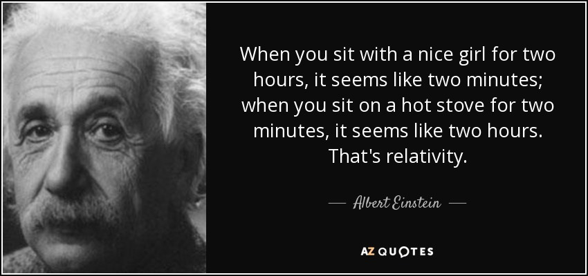

**爱因斯坦其实没说过这句话 ，而且这不是相对论的正确解释。**但是这个说法的确抓住了时间体验的本质：它跟情境相关。不过更科学的说法是，主观感知时间的快慢，取决于事情变化的频率。

比如你面前有个机械钟表，秒针正在滴滴答答地走。在乌龟的眼中，这个秒针的移动速度，是我们人类眼中的两倍。如果你能体会一下乌龟的感知，你看秒针就好像看视频倍速播放一样。这是因为乌龟的动作频率慢，所以它看什么都像是快动作，它觉得时间在高速流淌……所以乌龟虽然客观寿命长，但是实际体验的生活并不长。

而在苍蝇眼中，秒针的滴答声要比我们的感觉慢四倍。当你试图打苍蝇的时候，好像武侠电影一样，苍蝇感觉你是在做慢动作。所以苍蝇的客观寿命虽然短，但是它实际体验的一生并不短。

动物感知到的时间快慢取决于它的动作频率，这是演化出来的一种适应。既然乌龟没有苍蝇那样的快速反应能力，它就没有必要把精力浪费到感知世界的多变细节中去，它选择快进播放。

人也是如此。你周围的事物在快速变化，你就会感觉时间过得比较慢，一天就好像经历了很久；而如果周围没什么变化，你只是在例行公事，你就会觉得时间过得很快。

更根本的原因是变化的频率在刺激注意力转换。频率高，你的注意力就一直被唤醒，一会注意这，一会注意那，你的感知时间就慢。

有实验证明了这个说法。给人看一连串的图片，如果那些图片都是重复的，你看一会儿就会觉得这段时间过得很快；如果在这串图片中添加几张意外的、不一样的图片，你报告的感知时间就会更长。这个现象叫「怪球效应（oddball effect）」。

面对一张愤怒的脸，你感觉时间过得比看一张平静的脸要长。跟一只蜘蛛对峙一分钟，你感觉时间比跟一只蝴蝶对峙一分钟要长。这是因为威胁性的信号和新鲜事物一样，都会更大限度地刺激你的注意力。

这就是为什么人在少年时代觉得日子过得最慢。从上小学到上大学这段时间，每一年对你都很新鲜，你一直在做自己以前没做过的事。可是工作之后，如果在同一个环境里一干就是二十年，那感觉真是一眨眼就过去了。

但就算是成年以后，如果在一个秋天里经历了一件跌宕起伏的大事，人们也会感叹这真是一个漫长的季节。但我们大多数时候都是上班例行公事下班过平淡日子，不知不觉头发就白了。

比如你想想最近的AI浪潮。ChatGPT是2022年11月才出来的，至今才过了半年多；GPT-4是2023年3月15日才发布的，到现在才三个多月……可是因为伴随它们的新应用、新论文、新教程层出不穷，我们感觉上已经过了很久。

所以如果你希望日子过得慢一些、充实一些，就应该给生活增加一些惊奇和冒险，多探索新事物——墨守成规几十年如一日的生活是浪费生命。

下面关键问题来了：当你站在行李转盘前无聊地等待行李时，时间是变快了还是变慢了？

按理说，那是一成不变的环境，你无所事事，应该感觉时间变快了，但其实不是。这里有另一个机制在起作用。

当你例行公事地做什么工作的时候，你会觉得时间过得挺快，这是因为你至少还有事做，你的注意力有安放的地方。但当你无事可做，纯粹就是等待，感到很无聊的时候，你在生理层面上其实是处于高度兴奋的状态。大脑受不了无聊，会命令你去找一些事干。你的注意力在不断地被唤醒，你想找事儿又找不到什么事儿可做，就胡思乱想，如同在经历很多事情，并且你会感受到一种压力。你非常难受！这段时间不但不快，而且感觉特别漫长。这大概就是为什么凯文·凯利说：「当你让人们等待你的时候，他们开始思考你所有的缺点。」

有统计表明，排队的时候，你会把时间高估三分之一。如果是上班等公交车，到点了车没来，每延误一分钟，你的感觉相当于在车上坐两分钟或者三分钟。在咖啡馆里，你感觉等待买单的那段时间，比你实际喝咖啡的时间还要长。

等待会让人感觉时间过得很慢，而感知的等待时间比实际等待时间更能预测顾客的满意度，所以我们必须改善等待体验。

其实思路很直观，就是别让顾客干等，给他们找点能分心的事儿干，让注意力沉浸，而不要变来变去。

最早的等待设计出现于二十世纪五十年代，就是在电梯里放一个落地镜，这样人们上上下下的时候可以看看自己，而不至于没事儿干。

当代的「等待时间设计专家」是迪斯尼乐园。你去迪斯尼游园肯定会有个感慨，其实大部分时间你不是在玩那些项目，而是在排队。有些热门项目的排队时间要超过两个小时。光听这个数字你就会想，谁还愿意去迪斯尼乐园？所以迪斯尼必须解决排队体验的问题。

做法是把排队也变成某种游戏。迪斯尼规定，它的每一个员工都必须同时是一个演员，可能扮演一个什么动画角色，要随时跟游客互动。你在排队的时候，故事其实已经开始了，你是在参加一个故事，而不仅仅是排队。迪斯尼还把排队的路线设计得很漂亮，让你已经置身于场景之中；队伍在视觉上会让人感觉更短。排队排出了游园感，排出了娱乐价值，这个时间就没有那么难受了。

类似地，欧洲之星高速铁路也把乘车给做出了体验。它有一段路是穿过英吉利海峡的海底隧道，窗外本来是没有景色的，乘客干坐着。2017年，欧洲之星搞出了一个叫做「奥德赛（Eurostar Odyssey）」的项目，乘客戴上虚拟现实眼镜，列车立即变成在水下世界中穿行，你一边欣赏海底的景色还可以一边做个游戏——

**这个规律是呆着没事干、干等，是大脑最受不了的体验；把闲置时间转换为占用时间，就能在不改变时间长短的情况下改善体验。**

当然现在人人有手机可以玩，我们对等待的容忍度可能也提高了。我记得几年前美国茶党在华盛顿搞抗议静坐，政府发现安抚抗议者情绪的一个有效手段是……提供免费WiFi。

现代消费者买什么东西都是在买体验。商业的关键在于体验，而体验的关键是记忆。人们并不是很在乎客观事实，人们更在乎主观感受。

> [40｜怪球效应：如何提高顾客的体验感？ - 得到APP](https://www.dedao.cn/course/article?id=R2Mo65zY4QZ3VnmdO7KqEdNAa98jGB)
>

