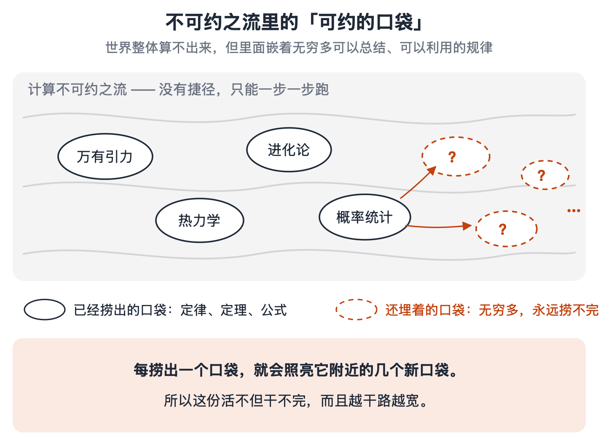
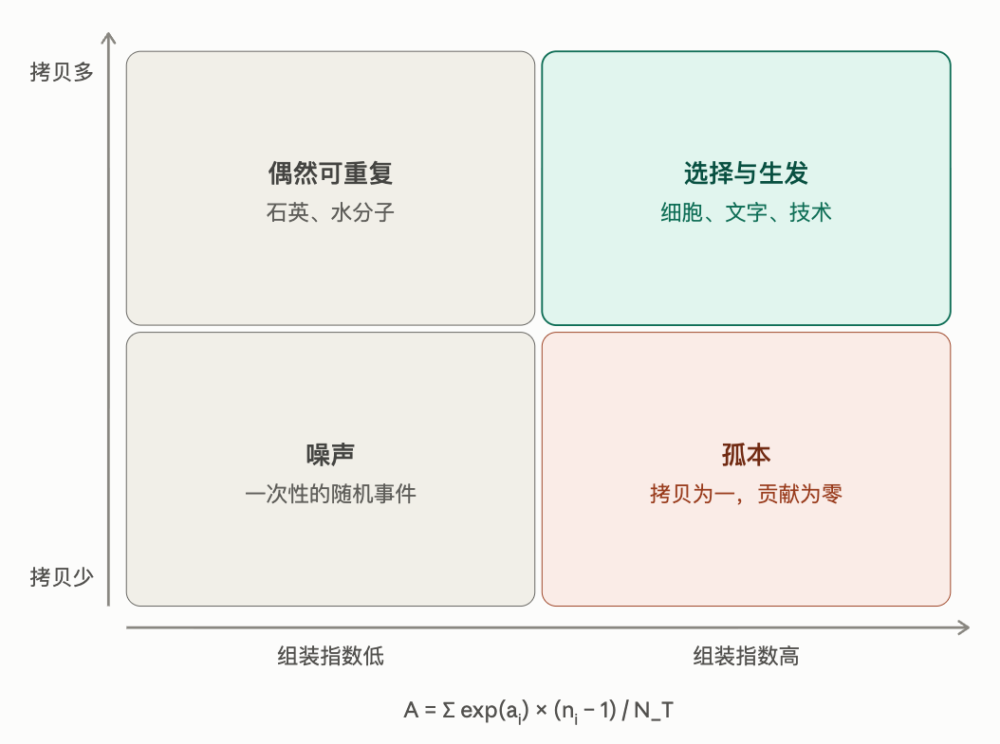
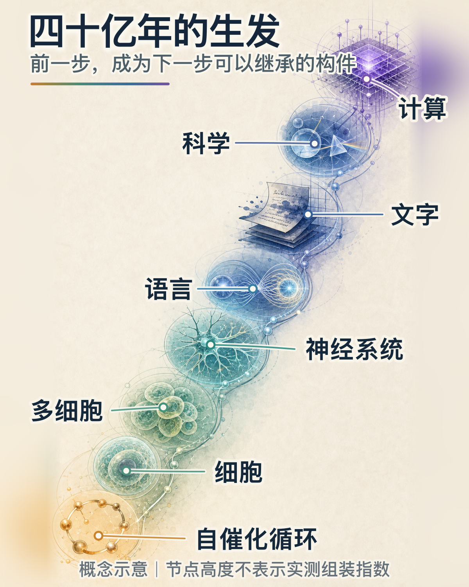
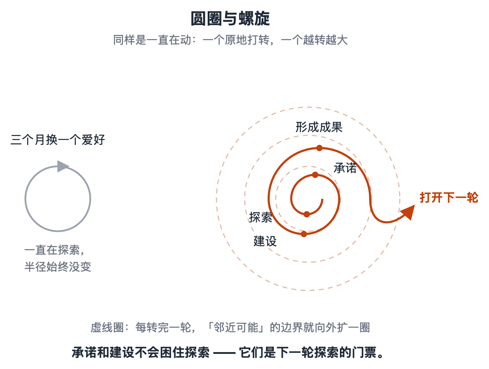
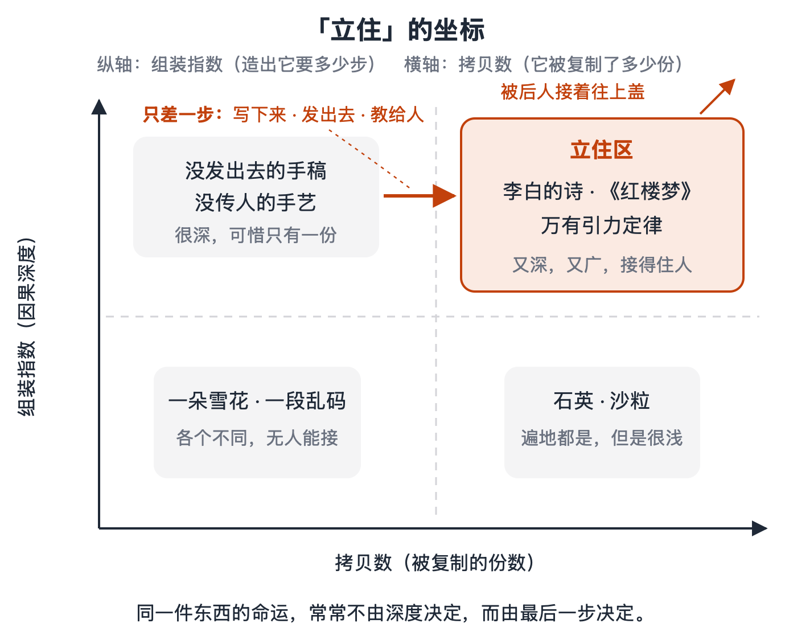
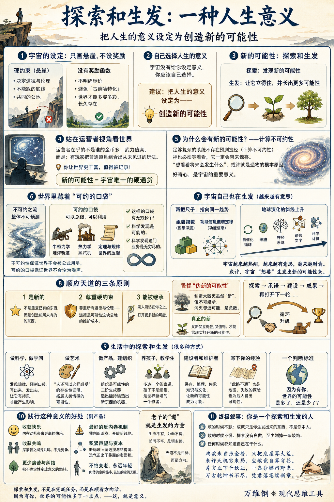

# 探索和生发：一种人生意义

[探索和生发：一种人生意义（完） \- 得到APP](https://www.dedao.cn/course/article?id=gpMLla6Py4qK25YOw8XYmvNzjd2Zx1)

这是《现代思维工具课》的最后一讲，咱们说一个感性话题：人生的意义。

我们说了，这个宇宙没有奖励函数：它不会因为你做对了什么就给你加分 —— 它只有一片片不能踩的悬崖，也就是「硬约束」。这其实是最好的设定。如果宇宙有奖励函数，明码标价说你们应该做什么，所有人就都会对那个东西「古德哈特化」，千军万马挤上同一条赛道，最后大家变成一个样，整个系统就变得脆弱。

只画悬崖，不设奖励，世界才能多姿多彩地长久存在。

硬约束决定了道德和伦理。那你说我把悬崖都躲开了，我是一个好人，我也满足了基本的生存需要，现在我的前方还有一大片空白，我该怎么走呢？

咱们前面九十九讲说的几乎都是工具理性：如果你想达到什么目标，你可以怎么做；如果你想避免什么结局，你就不要做什么。我们从头到尾没讲过你\*应该\*要什么。

因为那本来就是每个人的主观选择。宇宙没有给你设定意义，你应该自己选择自己人生的意义。

但你既然一路听到了这里，而咱们这门课的订阅人数就只有这么多，你必定属于社会上的极少数。对这些极少数人，我愿意提供一个建议 ——

把人生的意义设定为创造新的可能性。

别人过别人的日子，但我建议你可以考虑一下过这种日子。

因为我认为这种日子最有意思。

✵

理想的一生应该什么样呢？最起码，你希望你能留下一点什么。你不希望这个世界有你和没你都一样。

中国古人讲立德、立功、立言三不朽，老百姓也都想留下孩子和财产，也许给世人留下一点记忆，这些都是对的。以我之见，所有这些东西的本质是同一件事：你给世界留下了新的可能性。

我们可以把这种人生称为 「探索和生发」：探索，是发现新的可能性；生发，是让你发现的那个可能性立得住，而且还能据此长出更多的可能性。

✵

为什么要追求“新的可能性”呢？咱们还是先从玩家切换到《地球 Online》的运营者视角。

你默默地观察着游戏的进展，请问你在乎什么 —— 你会在乎哪个玩家攒了多少金币吗？你会在乎谁的武力值高吗？那些都只不过是寻常事件而已。

你在乎的是，有一天，有个玩家把几样普通道具组合出了一种你未曾想到的玩法。你会觉得这个玩家真有意思，值得记录下来！她让你这个游戏更丰富。

这里有个硬道理。我们前面提到过计算机科学家斯蒂芬·沃尔夫勒姆（Stephen Wolfram）—— 他是现在活着的最聪明的几个人之一 —— 他提出一个概念，叫「计算不可约性（computational irreducibility）」 \[1\]，意思是足够复杂的系统不存在预测捷径：你想知道它第一万步是什么样，你没有公式可以直接算，只能老老实实让它跑到第一万步。

这就意味着，哪怕你是创造这个系统的神，你也不能在刚刚把它创造出来的那一刻，知道它将来会演化出什么。你必须等着看。而它一定会带给你惊喜。造物主也得追更。

这是一个好消息。我们讲过，计算不可约性是未来本质上不可预测的几个根本原因之一。正因为算不出来，“发生”本身才有价值。

如果有造物主，我认为“想看看这个系统将来究竟会发生什么”，就是他造物的根本原因。如果没有造物主，我也认为，“好奇心”是这个宇宙的一个特别重要的意义。

站在宇宙的视角上，新的可能性是唯一的硬通货。

✵

那你说，每一朵雪花都跟其他雪花不一样，一团气体里每一个分子的运动轨迹也都很复杂，这些东西也都是新的可能性啊，可是这些没啥意思。没错，我们想要的不是一团乱麻的那种“新”。

最好的新是新思想、新规律、新结构；新，还得立得住才行。

这是宇宙特别奇妙的一个特点。它整体不可预测，但是它里面镶嵌着一个个可以总结、可以利用的规律 —— 沃尔夫勒姆称之为「可约的口袋（pockets of computational reducibility）」。

牛顿不知道每一个空气分子的去向，照样算出炮弹的轨迹；热力学不追踪任何一个粒子，可是用两条定律就把蒸汽机管住了。

每一条定律、每一个定理，都是从不可约之流里捞出来的一个口袋，都是对世界的一次压缩。

不可约性保证世界不会被公式用尽，可约的口袋保证世界不会沦为噪声。

然后沃尔夫勒姆有个更狠的论断：这样的口袋，有无穷多个 \[2\]\[3\]。

这就意味着 ——

第一，科学发现是可能的。第二，科学发现这门业务是无穷尽的。

你总可以发现这个世界新的规律，而且永远都发现不完。探索和生发的事业永远存在，永远有价值。

宇宙给你留了一份干不完的活，而且是好活。

✵

更妙的是，宇宙不光是允许生发，而且它自己就在生发，而且干得越来越起劲。

2023 年，英国格拉斯哥大学的化学家莱罗伊·克罗宁（Leroy Cronin）和美国亚利桑那州立大学的物理学家萨拉·沃克（Sara Walker）等人在《自然》杂志上提出了一个「组装理论（Assembly Theory）」 \[4\]，等于是给“一个东西的因果深度（causal depth）有多深”发明了一把尺子，叫「组装指数」：也就是从基本构件出发，造出这个东西最少需要多少步。

一块石英的组装指数很低，它可以自发出现；一个胰岛素分子、一台光刻机、一部《红楼梦》的组装指数极高 —— 它们不可能碰运气出现，它们的存在本身就是一份因果履历。组装指数乘以拷贝数，就是一个结构在宇宙中“立住”的程度。

用这把尺子看地球四十亿年间先后出现的各种事物，你得到一条清晰的斜线：自催化循环、细胞、多细胞、神经系统、语言、文字、科学、计算 —— 组装指数每提升一次，都是让更深的结构变得可复制。

简单说，地球上不断地出现越来越高级的东西。

也是在 2023 年，华盛顿特区卡内基研究所的矿物学家罗伯特·黑曾（Robert Hazen）和天体生物学家迈克尔·黄（Michael Wong）以及其他团队联合提出了一个学说，叫「功能信息递增定律（Law of Increasing Functional Information）」 \[5\]：凡是存在大量组态、又持续接受功能筛选的系统 —— 恒星、矿物、生命都算 —— 其中有功能的信息就会随时间越积越多。他们认为这够格算一条跟热力学第二定律并列的自然定律。

一个量组装的深度，一个量功能的信息，两把尺子指向同一个趋势：宇宙越来越热闹，越来越有意思，越来越耐看。

科学家原本认为生物演化没有方向，因为基因突变是随机的……但是在宏观上，我们的确看到了这个趋势。这里还有一些争议，也许一切只是「邻近可能」带来的统计现象 —— 但是你不得不承认，这一切的背后有点东西。

或许我们可以用拟人的方式说：这个宇宙\*想要\*变得更有意思，它想生发出新的可能性来。

✵

如果宇宙真有这么一个生发的“德性”，我们怎么做才算顺应了天道呢？你做的事儿最好满足三个要求 ——

第一，它是新的。 不是重复已有的东西，而是创造出前所未有的东西。

第二，它尊重「硬约束」。 也就是尊重所有的道德和伦理 —— 道德不是探索的税，道德是可能性这块公地的维护成本。

第三，它能被其他人继承。 别人能站在你这个东西上面，打开更多新的可能。

你不能制造一场大毁灭，说“你们谁也没见过这个场景吧？这是一种新的可能性！” —— 这的确是新，但它不可继承，它消灭邻近可能。这是严重的作恶，因为它关闭了别人本来可以拥有的未来。这样的“新”，在生发的账本上是负数。

而如果你能做出科学发现，给现实打开一种新的可能性，让别人能在你发现的基础之上做很多前所未有的事情，那可就太值得了。

又新又立得住，又值得，是真的可能，才叫“创造了新的可能性”。

这样说来光探索不行。你不能三个月换一个爱好，什么都尝试，什么都不深入。你还得生发。真正要想立得住，你就得探索 → 承诺 → 建设 → 形成成果 → 再打开下一轮……

✵

都有哪些事算探索和生发呢？那可太多了 ——

**一个是做科学，做学问 **。你发现一条规律，就是给后来的所有人预制了一个口袋。但你必须写下来、发出去，让它有拷贝，才能产生影响。

**一个是做艺术。 **一件真正的新作品，是“人还可以这样感受”的存在性证明。李白之前没人知道诗可以那样写；有了李白，中国人从此多了一种心情的活法。

**一个是做产品，建组织。 **组织是可能性的二阶生成器：你不只造了一个东西，而且是一台能持续造出新东西的机器。

**一个是养孩子，教学生 **。教育的最高目标不是把答案复制进另一个脑子，而是多造一个答案源。孩子不是父母的续集，孩子是世界新增的一个作者。

**你还可以做建设者和维护者。 **就算你没有发明新思想，但你在图书馆当个管理员，你也帮助把知识保存好，传给下一代。你让新的可能性成为可能。

**再退一步，哪怕你只是把自己踩过的坑写成帖子发到网上，那也是生发 **。失败的探险队也带回了地图 —— “此路不通”四个字，同样是给后人省出来的可能性。

你看，这种人生意义不挑行业，不挑天赋，不挑年龄，它只问：因为有你，世界的可能性是多了还是少了。

✵

我认为践行这个意义会对你很有好处 ——

**你会收获快乐。 **咱们讲过「自我决定理论」，你知道内在动机带来的快乐高于外在动机，而发现新的可能性绝对是一种内在动机。

**你还会收获「共鸣」。 **探索者跟探索者不是竞争关系，是共鸣关系 —— 就好像大家在同一个景区的不同地方逛，我发现了好东西喊你来看，你发现了好东西喊我来看，你说这多好呢？

**你会少很多痛苦和纠结。 **比如说遇到不幸、遭遇困难，你可以想：哎，我还没经历过这样的事情！且看我怎么应对！

**你真的把不确定性变成了意义的燃料。 **别人怕世界变，你盼着世界变 —— 变了才有新东西。

**创造新的可能性是最好的反内卷机制。 **一大帮人往「摩洛克」的祭坛上挤，你说我不跟你们玩那个游戏了，我自己独创一个新游戏：我开辟一个新领地，谁想来我这边玩？

**你会积累声望和资本。 **你每进入一个新领域，弱连接和结构洞那种「社交资本」自动就有了。打开一个新可能性就会得到更多的邻近可能，运气正比于你暴露的表面积。

**还有一个好处是你不怕老。 **“某公司某职务”是别人分配给你的位置；“正在探索的人”是你随时可以重新发起的行动。你的肉体能到达的空间会随年龄缩小，你的认知能打开的空间不会。我们说过，「探索与利用」能让你继续做个年轻人。

请注意，以上说的这些好处都是「副产品」。你不能直接追求它们，但你可以通过追求“创造新的可能性”来得到它们。

而社会则因为你而得到了更多的多样性。每个人探索不同的方向，文明就成了一台并行计算机……

✵

我甚至觉得老子说的「道」，就是生发的力量。“道生一，一生二，二生三，三生万物”，不就是越来越多的邻近可能吗？“生而不有，为而不恃，长而不宰，是谓玄德” —— 生养而不占有，成就而不挟持，引领而不控制 —— 这不就是不设奖励函数的生成力吗？

老百姓说“上天有好生之德”，《易传》说“天地之大德曰生”，也许天道不是一个目标，而是一个方向。

你选择探索和生发，不是在完成宇宙布置的任务 —— 它没给谁布置任务 —— 但你是在顺着这个方向活。

✵

这门课的第一讲就说「这个宇宙的第一性原理是叙事」，现在最后一讲，我想把一个终极叙事交到你手里： 你是一个探索和生发的人。

这只是建议。但意义提供叙事，叙事提供身份。有这个叙事，你任何时候都知道自己是在干什么。

顺的时候不飘，因为你知道成就只是你生发出来的东西，不是你本人；败的时候不慌，因为探索没有白做的 —— 你至少替后人划掉了一条歧路。

这门课算是我的一次探索和生发。往后你在你的领域里发现了好东西，也请喊我一声。

【有诗赞曰】

> 鸿蒙未肯张金榜，只把危崖界大荒。
未许天机穷末局，尘埃竟自算穹苍。
片言立下千秋业，一盏分燃四野光。
万古乾坤书不尽，凭君落笔续新章。

（The End）

注释

\[1\] Wolfram, Stephen\. \*A New Kind of Science\*\. Champaign, IL: Wolfram Media, 2002\.

\[2\] Wolfram, Stephen\. "Can AI Solve Science?" Stephen Wolfram Writings, March 5, 2024\. https://writings\.stephenwolfram\.com/2024/03/can\-ai\-solve\-science/\.

\[3\] Wolfram, Stephen\. "What Ultimately Is There? Metaphysics and the Ruliad\." Stephen Wolfram Writings, February 4, 2026\. https://writings\.stephenwolfram\.com/2026/02/what\-ultimately\-is\-there\-metaphysics\-and\-the\-ruliad/\.

\[4\] Sharma, Abhishek, Dániel Czégel, Michael Lachmann, Christopher P\. Kempes, Sara I\. Walker, and Leroy Cronin\. "Assembly Theory Explains and Quantifies Selection and Evolution\." \*Nature\* 622 \(2023\): 321–328\.

\[5\] Wong, Michael L\., Carol E\. Cleland, Daniel Arend Jr\., Stuart Bartlett, H\. James Cleaves II, Heather Demarest, Anirudh Prabhu, Jonathan I\. Lunine, and Robert M\. Hazen\. "On the Roles of Function and Selection in Evolving Systems\." \*Proceedings of the National Academy of Sciences\* 120, no\. 43 \(2023\): e2310223120\.

