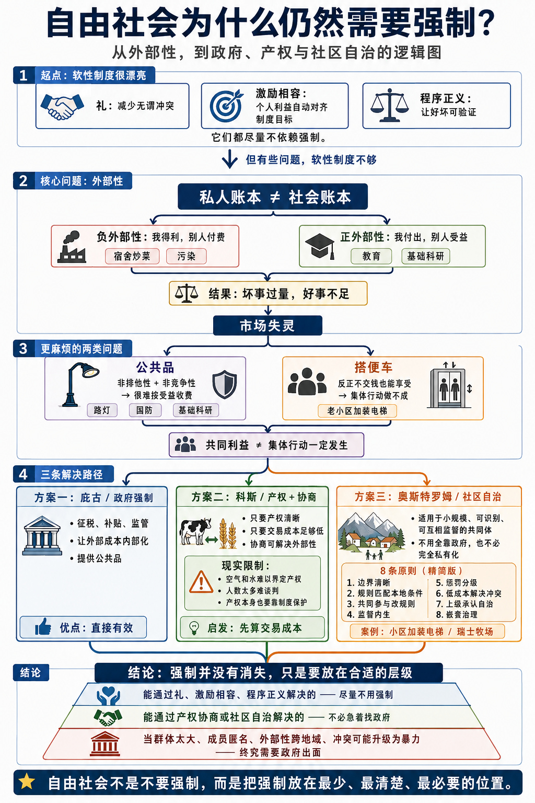

# 外部性：为什么自由社会也需要强制

[外部性：为什么自由社会也需要强制 \- 得到APP](https://www.dedao.cn/course/article?id=mPqglk6GzZwKr5yBykXMLBEO3ba2AR)

我们这个系列一直在讲社会需要制度。我们讲了「礼」作为一种互动协议，「激励相容」让个人利益和制度目标自动对齐，「程序正义」让好坏可验证 —— 你注意到没有，这些制度有一个共同点：

它们都是软性的。

这里没有强制。守礼可以帮你减少很多无谓的冲突，但你也可以不守；一个激励相容的系统会让你自愿做有利于它的事儿；即便是好的市场，也允许你卖坏货，只要你选择承担后果就行。

软性制度是漂亮的制度。有些自由派（libertarians）知识分子就认为，世界就应该只有软性制度，最好没有任何强制。

我当年上大学的时候，就发现教授上课点名是个非常不体面的事情：你讲得好，学生自然会来听；学生不来听，那就说明你讲得不行。你强制点名让学生坐在那儿，这像什么话呢？

如果一切问题都能靠市场和软性制度解决，可就太好了……

但这一讲我们要说的是：自由社会也需要强制。这里有好几位天才经济学家和政治学家的思想较量，而一切的起源，叫做「 外部性 （externality）」。

✵

外部性最早是英国经济学家阿瑟·庇古（A\. C\. Pigou）系统化的概念。他 1920 年出版的《福利经济学》（ *The Economics of Welfare *）一书是领域的奠基之作 \[1\]。

简单说， 外部性就是做一件事的人不完整承担他这件事的后果。

比如你在大学住四人间的宿舍，有个室友，小张，嫌学校食堂的饭菜不好吃，就自己弄个炉灶在宿舍炒菜吃。

炒菜这件事对小张有好处，但也有一定的坏处，那就是油烟。好处完全由小张自己享受了，可是坏处却不是由他自己完全承担，而是分出了一部分来给你们，让你们不得不忍受油烟味。分出来的这一部分，就是小张炒菜这个事儿给宿舍制造的「 负外部性 （negative externality）」。

外部性也有正面的。比如一个孩子受教育，主观上当然是为了自己 —— 有了学历就好找工作、能过好日子。但是客观上，更多的人受教育对整个社会也有好处：犯罪率会降低，人们的收入更高就会交更多的税，社会福利也会随之提升……所以哪怕你没有孩子，你也希望你家邻居的小孩都能受到好的教育。这就是说，教育有「 正外部性 （positive externality）」。

负外部性是我得利、别人付费；正外部性是我付出、别人受益。 那我们当然希望制造负外部性的事儿能少一点，制造正外部性的事儿能多一点。

可是你们并没有向小张收取环境清洁费，你也没有给你家邻居小孩支付教育感谢金。那么结果就是：

坏事会过量，因为做坏事的全部成本你不必承担。

好事会不足，因为做好事的全部收益你拿不到。

这里没有任何坏人在故意造成这些问题。外部性的根本原因是利益格局存在账本错位：私人账本和社会账本，对不上。

✵

直观上说，解决外部性的最合理办法应该是把账本重新对上：谁制造了负外部性，谁就交一笔钱提供补偿，谁享受了正外部性，谁就交一笔钱表示赞助，对吧？

可是现实没那么简单。有些账本就是结构性地没法对上。

1954 年，保罗·萨缪尔森（Paul Samuelson）严格论证了一个概念，叫「 公共品 （public goods）」\[2\]，我们大约可以理解成某种必须刻意营造的正外部性。比如说夜晚的路灯、基础科学研究的结果、军队提供的国防服务就都属于公共品。萨缪尔森提出，这些公共品有两个特点：

**第一是非排他性： **你很难因为一个人没交钱就不让他用。你说赞助科学人人有责，人家说你们探测火星跟我可没关系……唯一可操作的办法就是把基础科学成果让全民共享。

**第二是非竞争性： **一个人用了，也不影响别人用。毕竟军队不可能只给一部分人提供保护，要和平就是全国都和平。

所以萨缪尔森说：公共品的好处太大、扩散太广，根本没法有针对性地收费。

还有一个麻烦，出自马里兰大学经济学家曼瑟·奥尔森（Mancur Olson）1965 年的名著《集体行动的逻辑》\[3\]，叫「搭便车（free riding）」。意思是：反正就算我不交钱，我也能享受到正外部性，那我何必交钱呢？

比如你住在一个老旧的小区，业主们想加装一部电梯，需要挨家挨户收钱。按理说，想用电梯就得交钱，这没啥可说的。

但是居民电梯又不能谁用一次交一次钱，肯定是建好之后大家随便用。那么有些人就会想：就算我赖着不交，你们不也得把电梯建起来吗？你建起来之后，难道还能禁止我用吗？

所以我理性的选择就是不交。

如果大家都这么理性，装电梯这个事儿就永远都干不成。

结果就是虽然装电梯对大家都有利，但是这件事就是做不成。

这就是奥尔森的反直觉洞见：共同利益不是集体行动的充分条件。

事实上，群体越大，搭便车就越容易，就越不会为了共同利益行动。

外部性和信息不对称都是市场失灵。坏事过量好事不足，人人都说应该做，最后没人会做 —— 这样的社会好得了吗？

看来唯一的办法就是有个强人站出来，说我看好了，这个事儿必须办。你们各家有钱出钱，没钱也得出力。谁不服我就收拾谁。

具体操作方法就是由政府强制每个人都交税，然后污染由政府治理，公共品由政府提供。这也是庇古的建议。在经济学家眼中，解决外部性是政府最正当的征税理由，叫做「庇古税」。

✵

如你所能想见，经济学家真的特别不喜欢强制。强制说明你这个系统还没有做到完全激励相容。暴力上场就意味着学者讲道理的失败。强制，很不优雅。

那你说不是有个「显示原理」吗？不是说什么问题都有可能用激励相容的这种方式解决吗？其实显示原理说的是制度可以让每个人如实报告私人信息，但并不一定说就能把问题解决……

但是经济学家还真找到一个聪明的解决办法，来自了不起的罗纳德·科斯（Ronald Coase）。科斯 1960 年发表的《社会成本问题》（ *The Problem of Social Cost *），是整个经济学中被引用次数最多的论文之一 \[4\]，科斯据此得到 1991 年诺贝尔经济学奖。

科斯的解法是产权。

他试想了这么一个局面：一个养牛人和一个种麦的农民是邻居。牛会经常跑到麦田里踩坏麦子，这是典型的负外部性，请问怎么办？

庇古会说：必须政府出手，要么禁止放牛，要么征税。

科斯却问：他们俩自己谈不行吗？

如果这头牛每年能给牛主带来 100 块的利润，可它踩坏的麦子值 150，农民完全补贴牛主 120，让他不要养这头牛了；而如果牛每年能给牛主赚 200，可它踩坏的麦子只值 50，那就让牛主赔给农民 80。

只要可以谈，只要有交易，双方的境遇都会比之前更好，不需要任何暴力干预。这多好呢？外部性根本不需要政府管，私人产权 \+ 自由协商，自动解决。

但是现实中可没有这么好的事儿。请注意科斯定理有两个前提条件：产权清晰，交易成本为零。

现实中，空气和水的产权属于谁？下游有几百万人，你怎么去跟每个人谈判？交易成本常常高到让协商根本不可能发生。

更要命的是，产权本身从哪儿来？谁来界定？谁来登记？谁来执行判决？谁来防止强者直接抢走弱者的产权？

你会发现一个反讽：产权本身就是一种公共品。一个能保护产权的社会秩序，本身需要被建设、被维护、被强制执行 —— 这就把问题又甩回了强制层面。

这并不是说科斯定理是失败的。科斯自己 1991 年获诺奖时讲得很明白：科斯定理只是一个思想实验，目的是让经济学家意识到，真实世界里总有交易成本，所以制度的选择至关重要 \[5\]。

科斯真正的遗产不是“产权万能”，而是： 选择制度之前，先计算交易成本。

✵

说白了，科斯留下一道后门： 只要交易成本足够低，协商就能解决问题，强制就是可以避免的。

然而经济学家对现实已经近乎绝望。1968 年，加勒特·哈丁（Garrett Hardin）发表著名的《公地悲剧》（ *The Tragedy of the Commons *）论文 \[6\]，其中讲了一个寓言：一片公共草地，每个牧民都可以来放牛。你多放一头，收益全归自己，草场的损失却是大家分摊 —— 这笔账怎么算都划算，结果就是每个人都拼命加牛，直到草场彻底毁掉。

公地悲剧是萨缪尔森那个公共品的镜像：公共品是“想要正外部性而得不到”，公地悲剧是“想去掉负外部性而去不掉”。而科斯的方案在这里几乎注定失败：当事人不是两个，而是几百上千个，谁都有动机搭便车，怎么谈？

所以主流经济学界从此相信一个二分法：面对公共资源，要么政府接管，要么私有化，没有第三条路。

就在这个时候，一位女政治学家，埃莉诺·奥斯特罗姆（Elinor Ostrom），站出来了。

奥斯特罗姆没有躲在书房里推演，她的做法是领着学生走遍全世界，看看各地的小社区到底是怎么管理公共资源的。

他们发现，全世界有大量小型社区，在既没有政府强制，也没有把公共资源变成私有产权的情况下，成功管理了公共资源，而且持续了几代甚至上千年。这些社区是怎么做的呢？

比如说，特尔贝尔（Törbel）是瑞士的一个小山村，村民共享一块山地牧场，是典型的公地局面。可是从十五世纪起，村民签了一份关于水利渠道和高山牧场的集体使用契约，一直延续至今。契约里最精妙的一条规则是：

*“冬天养不起的牛，夏天就不能赶到公共牧场上去。”*

啥意思呢？瑞士山区养牛分冬夏两季。夏天的时候，牛在公共牧场上吃免费的草，你基本不需要投入什么成本。到了冬天，山上就没有草了，牛只能回自家牛棚里，吃你自家储备或者购买的干草，成本完全由个人承担。如果没有这条规定，有些人可能本来冬天只养得起五头牛，但他会在夏天临时多买五头牛上公共牧场吃免费的草，等冬天来了再卖掉。这条规则等于把公共牧场的使用限制在了私人的承担能力上。

它妙就妙在把“夏天谁家的牛吃多少草”这么一个很难监督的事情，变成了“冬天数一数各家有几头牛”这么一个很容易监督的事情。于是只要邻里之间互相监督就好，不需要政府出手。

结果是特尔贝尔在数百年里都没有发生过公地悲剧。

还有很多类似的故事。奥斯特罗姆在 1990 年出版的《公共事物的治理之道》（ *Governing the Commons *）一书中列举了这些发现 \[7\]，她也因此获得 2009 年的诺贝尔经济学奖。

原来社区自治可以在相当程度上解决外部性问题！奥斯特罗姆总结了 8 条自治制度设计原则 ——

1\. 边界要清晰（没有"我们"，就没有责任共同体）；

2\. 规则要从下往上长，匹配本地条件；

3\. 受规则约束的人要有权改规则；

4\. 监督要内生，最好就由使用者担任；

5\. 惩罚要分级，直接重罚反而毁了合作；

6\. 冲突解决要便宜，纠纷得有地方说理；

7\. 上级政府至少要承认你能自治；

8\. 复杂问题要嵌套治理。

最关键的是，这里没有一条说实在不行就请求政府介入。你立即可以跟咱们中国的传统乡村联系起来。费孝通先生在《乡土中国》一书里就说本乡本土的矛盾，都是尽量在本乡本土协商解决，而不是折腾到官府那儿去。这叫「无讼」。

奥斯特罗姆这套思想叫做「 多中心治理 （polycentric governance）」。

✵

这些原则其实是一套工程化解决方案，是可以实操的。咱们回到小区装电梯那个事儿，就可以这么操作 ——

首先，业委会不要把加装电梯做成全小区的公共事业，而是采取“哪个单元装电梯，哪个单元解决自己问题”的模式。这对应奥斯特罗姆的第 1 条：确定本单元共同体。

其次，不要平均分摊费用。一楼如果不用电梯，可以少出甚至不出钱；楼层高的则多出钱。这就是对应第 2 条：规则要匹配本地条件。

然后，还要让所有受影响的人共同参与制定规则（第 3 条）；项目的账目要由使用者监督（第 4 条）。根据第 5 条，对搭便车的人要设置分级的后果：不是一开始就撕破脸，而是先提醒，再公示，实在不行才暂停其电梯使用资格，如果后续补交钱，再恢复资格。

第 6 条是争议可以在业委会协调解决。最后别忘了第 7 条，你需要上级承认，这意味着事先取得街道和居委会的认可。

奥斯特罗姆的第 8 条，所谓“嵌套治理”，意思就是每一层管每一层最适合管的事。修电梯这个项目具体怎么做，本单元业主商量着办；小区业委会只负责统一程序和供应商比价之类；到了居委会和街道这一层，则只要确认合法性和安全审批就好。

我理解这里的核心思想是：因为本地人低头不见抬头见，是一个可以互相监督的利益共同体，所以有些事儿我们可以商量着办，没必要找政府来硬的。

✵

奥斯特罗姆告诉我们小社区可以自治，但是这并不意味着社会就不再需要强制。当一个群体太大、成员变得匿名、外部性跨越地域、冲突有可能升级为暴力的时候，我们终究还是需要一个拥有最终强制力的组织出面管理。

这个组织，就是政府。咱们下一讲再说。

注释：

\[1\] Pigou, Arthur C\. The Economics of Welfare\. London: Macmillan, 1920\.

\[2\] Samuelson, Paul A\. "The Pure Theory of Public Expenditure\." The Review of Economics and Statistics 36, no\. 4 \(1954\): 387–89\.

\[3\] Olson, Mancur\. The Logic of Collective Action: Public Goods and the Theory of Groups\. Cambridge, MA: Harvard University Press, 1965\.

\[4\] Coase, Ronald H\. "The Problem of Social Cost\." Journal of Law and Economics 3 \(1960\): 1–44\.

\[5\] Coase, Ronald H\. "The Institutional Structure of Production\." Nobel Prize Lecture, December 9, 1991\.

\[6\] Hardin, Garrett\. "The Tragedy of the Commons\." Science 162, no\. 3859 \(1968\): 1243–48\.

\[7\] Ostrom, Elinor\. Governing the Commons: The Evolution of Institutions for Collective Action\. Cambridge: Cambridge University Press, 1990\.

1\.「外部性」就是做一件事的人不完整承担他这件事的后果。负外部性是我得利、别人付费；正外部性是我付出、别人受益。
2\.科斯的解法是产权。不是“产权万能”，而是：选择制度之前，先计算交易成本。
3\.「社区自治」可以在相当程度上解决外部性问题。

