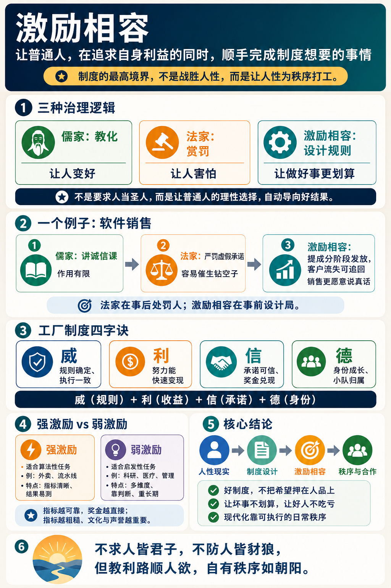

# 激励相容：好的制度不应该指望人“畏威怀德” 

[激励相容：好的制度不应该指望人“畏威怀德” \- 得到APP](https://www.dedao.cn/course/article?id=A5eO3NDrGk8KP0omnMK2oxp9MRBzQP)

传说有个中国企业家在非洲开了家工厂，雇用了很多当地工人。他对工人讲平等讲尊重，待遇优厚，绝对不搞以前殖民者那一套。可是没过多久，他就发现自己这一套行不通。

工人是很愿意进他的厂，可是来了没几天就开始迟到、旷工、上班睡觉，稍微不留神就消失一会儿跑去抽烟，车间里的零件还时不时不翼而飞。

中国老板就只能使了个下策：招几个本地监工对工人严格管理，动辄打骂，手段可以说是非常凶狠……结果工厂走上了正轨，产量稳定出货按时。

恐怕每个老板都或多或少地有过相关的体验。我们该怎么看这个事儿？你尊重工人，工人当你好欺负；你严厉对待他们，他们反而老老实实干活儿。这真是“畏威而不怀德”啊！难道说这些人配不上好的管理吗？

先别着急下判断。每个人都有本能的欲望和私利，让一群人凑在一起好好做事本来就是一个奇迹。要说如何管理冲突、达成合作，传统中国琢磨了两千多年，得出的主要是两套解决方案 ——

儒家的办法是教化，要把人变成更好的人，让他「怀德」；法家的办法是赏罚，也就是胡萝卜加大棒，让他「畏威」。

但这一讲我要说的是，现代世界既不是靠儒家也不是靠法家运行的。它靠的是第三种东西，叫做「 激励相容 （Incentive Compatibility）」。

这个洞见是： 好的制度既不应该要求人是好人，也不应该像对待坏人一样去控制人 —— 而应该让\*普通人\*，在追求\*自身\*利益的同时，顺手就能完成制度想要的事情。

制度的最高境界不是战胜人性，而是让人性为秩序打工。

✵

激励相容这个词，最早是波兰裔美国经济学家列奥尼德·赫维茨（Leonid Hurwicz）在 1972 年系统提出来的。他因为「机制设计（mechanism design）」的开创性工作获得了 2007 年诺贝尔经济学奖 \[1\]。

传统经济学问的是“正问题”：给定一套规则，你能不能使用比如说博弈论的原理，预测一下大家会怎么玩？机制设计问的则是“逆问题”：我想要一个什么样的结果，你能不能给我反推一套规则，让大家自愿玩出这个结果。

机制设计是经济学的工程化。以前人们经常抱怨经济学家像预报不准天气的气象学家，现在经济学家终于可以像工程师一样建造一个有用的东西了。

而激励相容，就是机制设计的灵魂。它问：能不能造出一种局，让一个个自私自利精于算计的普通人，在这里最明智的选择就是做对系统有利的事？能不能在我这个局里，君子做好事不必再付出额外的牺牲，小人也不得不做君子的事？

这跟儒家、法家可不在一个维度上。儒家是君子的推己及人，假定人性可以无限拔高，可以说早在战国时代就被人看出来是太过天真浪漫了。法家假定人性可以被赏罚操控 —— 这已经比儒家高一档 —— 但它依然需要一个全知全能的统治者：他要看得清真相，断得了功过，行得了赏罚，而且自己还不腐败。儒家依赖被统治者的素质，法家依赖统治者自己，其实都不是根本办法。

而激励相容则说：我承认每个人都有自己的小算盘，我也承认我根本看不全你做了什么。但我不在乎。我设计的这个局，会让你的小算盘怎么打都打到我要的那个数上。

你说这可能吗？真有这么好的制度吗？其实现代政府治理、公司管理的主流，用的就是这样的制度。

✵

举个例子。想象有一家卖企业软件的公司，最近遇到一个问题：销售为了冲业绩，经常给客户许诺一些产品还没做出来的功能。客户一高兴就当场签约；可是产品上线，客户发现根本就没有那些功能，觉得被骗了，要么投诉，要么就不续费，公司口碑崩塌。请问你是老板的话，你怎么办？

儒家的方案，是请金牌讲师搞个“价值观工作坊”，大讲诚信文化，讲客户至上，讲不要给公司抹黑！销售们听得热泪盈眶，回去之后该怎么忽悠还是怎么忽悠，毕竟提成才是真的。

法家的方案，则是宣布谁再虚假承诺，扣半年奖金，严重的开除！结果销售们开始玩文字游戏，把口头承诺写成“我们正在积极探索这个方向”，把责任推给产品部门，把客户录音“不小心”删除。你抓了几个典型，剩下的销售却是更精了。

激励相容的方案，则是重新设计销售的提成结构。

从今往后，销售签单后不再一次性拿到全部佣金，改为分阶段发放：一部分在签约时发，一部分在使用三个月后发，一部分在续约时发；如果客户因“承诺不符”而提前流失，已发佣金按比例要追回。

这样你既不需要道德培训，也不需要像对敌人一样对自己的员工搞盯防，销售们自己就会采取对公司最有利的做法。

儒家要人做君子，法家威胁人别做小人。 激励相容，则是让人做一个聪明的普通人。

激励相容并不是没有奖惩 —— 这里也用奖金，也用处罚，也用解雇 —— 但是区别在于，法家的奖惩是外部的棍子，激励相容的奖惩是机制的部件。法家是在行为之后处理人；激励相容是在行为之前设计局。

法家问：怎样让人不敢坏？

激励相容问：怎样让坏不再划算，让好不再吃亏？

✵

咱们回头看那个非洲工厂。

中国老板犯的第一个错误，是把“条件好”当成了激励到位，殊不知条件好和激励到位完全两码事 \[2\]。

你给工人的待遇好不好，属于「参与约束（participation constraint）」，解决的是“这份工作值不值得我来”的问题；而「激励约束（incentive constraint）」，解决的则是“我来了以后，为什么要认真干”的问题。工资只能买到人到场，机制才能确保人努力。

经济史学家西德尼·波拉德（Sidney Pollard）研究过英国工业革命早期的工厂，发现最初的工人并不会天然适应考勤、重复劳动、外部节奏和流水线纪律。“现代工人”是被一整套制度训练出来的 \[3\]。你得有机制设计才行。

打骂管理是老板犯的第二个错误，因为那不是一种有效的激励约束。

工人有办法适应打骂管理。监工在，产量就有；监工一走，工人会想尽办法找补。打骂还会持续筛掉那些有尊严、有能力、有选择余地的工人，留下最能忍气吞声、最会看人脸色、最会躲避惩罚的人。你产量暂时是稳定了，可是未来还会有诉讼、罢工、品牌污点、骨干流失、质量问题……后患无穷。

✵

结合学术界的研究成果， 一个激励相容的工厂制度，简单说就是四个字：威、利、信、德 ——

**第一步，先有「威」。 **这个威不是恐惧监工的棍棒，而是规则一定兑现。

迟到、缺勤、质量事故、安全违规怎么处理，要做到事前写清楚，过程可记录，处罚可预期，而且一视同仁，主管也受约束。规则的有效性取决于惩罚的确定性，而不是惩罚的暴力性，更不是人格侮辱。

**第二步，加「利」。 **只要任务足够简单、结果足够可测，就要让努力尽快变成钱。

根据人事经济学家爱德华·拉齐尔（Edward Lazear）的研究 \[4\]，美国一家公司把汽车玻璃安装工的小时工资改成计件工资，生产率一下子就提高了 44% —— 其中一半来自原有工人变得更努力，另一半来自原有的那些懒散但混在小时工资里的人被筛走了。只要任务可测量，用钱强激励就真好使。

**第三步，有了利，还得有「信」。 **很多发展中国家工厂的问题不是工人不懂激励，而是工人不信激励。

老板说月底发奖金，可工人心里想：月底你会不会说质量不合格？会不会找理由扣工时？会不会说下个月一起发？

而且人天然倾向于短期利益，工人有时候自己也控制不住自己。你跟他说月底发奖金，他会觉得这个等待过程太漫长了 \[5\]。

如果一个场域的「信」还不足，工资和奖金就最好是短周期的，甚至可以日结。

**第四步，「德」会在制度里慢慢长出来。**

我们多次讲过，最好的激励是身份认同。你可以给工厂设计一套晋升阶梯：学徒、操作工、熟练工、质检员、小组长……每一级都有工资差。短期奖金买努力，长期身份买忠诚。

还有一个办法叫「小队制」。不要让一个监工盯二十个互不相干的人，而是把 5 到 10 个人组成一个小队，小队长有额外津贴。要点是小队有共同产量目标、共同的质量和出勤考核，完成了全队得奖金。这个好处是工人会互相监督：多劳多得是大家的，谁长期偷懒谁就会被小队排斥。有研究发现，一家服装厂从个人计件转向团队计件，工人生产率平均提高了 14% \[6\]。还有实验证明，团队激励会同时改变工人的努力程度和团队人员组成 \[7\]。

这里所谓的「威」和「利」，并不是法家那种赏罚；「信」和「德」，也不是儒家的教化：威是规则确定性，利是收益函数，信是承诺可信，德是身份生成 —— 关键在于这些属性是对\*制度\*的要求，而不是对员工人品、也不是对管理者心力的要求。

✵

激励相容是一个现代概念，但是相关的思想可不是二十世纪才出现的。中国先贤早就知道赏罚和教化不能解决根本问题。

《道德经》说：「法令滋彰，盗贼多有」；「不尚贤，使民不争；不贵难得之货，使民不为盗。」《论语》说：「乡愿，德之贼也」；「众恶之，必察焉；众好之，必察焉」……其实说的就是：赏罚会让坏人升级作弊技术，教化会让小人冒充好人、让真好人反而吃亏。

对这些问题的工程化解决，就是现代化的根本制度突破。

最早的曙光也许可以追溯到 1741 年，哲学家大卫·休谟（David Hume）在《论议会的独立性》（ *Of the Independency of Parliament *）一文中说破：在设计任何政体时，「应当假定每个人都是无赖，除了私利别无目的。」

1788 年，美国制宪运动核心人物、后来的第四任总统詹姆斯·麦迪逊（James Madison），在《联邦党人文集》第 51 篇里说得更直接：「如果人人都是天使，就不需要政府了。」他还说：「必须用野心来对抗野心。」

你要知道，那个年代，西方主流意识形态还是崇尚美德的 —— 休谟和麦迪逊这番见识，可谓是石破天惊。这不是悲观主义，也不是真的认为所有人都是无赖。他们说的是制度设计不能把公共的福祉押在掌权者的好心上。

超越儒家和法家，让人不必非得是好人，让人做好人也不必吃亏，这才是现代化制度。

✵

那么问题来了：如果一个系统的参与者\*就是\*无私的、高素质的好人呢？你搞个机制设计，非得像对待流水线工人那样给人家发计件工资，这不是侮辱人吗？

那你就误解了。计件工资是一种「强激励」，而激励相容理论恰恰不主张对什么场域都用强激励：有时候你就得用「弱激励」。

具体说来，一份工作如果是「算法性（algorithmic）任务」，也就是结果单一、过程清晰、容易测量，比如送外卖和流水线装配，那就适合强激励。而对于那些属于「启发性（heuristic）任务」的工作，特点是多维度，看判断，讲长期，靠协作，比如科学家、官员、医生这些岗位，使用强激励反而不好 \[8\]。

这是因为你强激励什么，人们就会拼命地优化什么 —— 而对于多维度问题，专门优化其中一个维度，就会把整个工作给异化。说白了就是如果你按论文发表篇数给科学家发奖金，科学家就会拼命发表毫无意义的论文。这里涉及到「多任务委托代理问题」和「古德哈特定律（Goodhart's Law）」，咱们后面再详细讲。

要点在于，这种多维度、复杂的任务，最好是自我驱动的，讲究内在动机。根据「自我决定理论」，一个激励相容的制度应该给人提供自由宽松的管理环境。

但弱激励不等于没有激励。弱激励是用更软、更长、更立体的方式激励人：比如高底薪、长期合约、自主权、同行评议、身份荣誉、成长通道、清晰使命等等。

现实中对高端人才的管理正是这样。你看那些高科技公司就不搞什么计件工资，也不会动不动就罚款，都是给一笔足够高的年薪，让员工不用每天算计自己挣多少钱。再看大学和研究机构，只要你证明了自己的能力，就给你一个终身职位，你从此都不用担心工作安全，可以大胆地探索感兴趣的东西。

激励相容理论认为，指标越可靠，奖金可以越直接；指标越粗糙，文化和声誉越重要。

✵

那你说，难道制度设计可以解决一切问题吗？未必完全没希望。

机制设计的根本困难在于「信息不对称（information asymmetry）」，也就是干活的人到底干了多少活，管理者看不见。然而在 1979 年，美国经济学家罗杰·迈尔森（Roger Myerson）等人从数学上证明了一个被称为「显示原理（revelation principle）」的定理 \[10\]，大意是说： 任何一个复杂机制能够达成的结果，都存在一个等价的「直接机制」，使得每个人直接、如实报告自己的私人信息，最符合自己的激励。

说白了就是理论上总可以把问题改写成一种制度设计，让说真话成为每个人的最优策略。

迈尔森据此也得到 2007 年的诺贝尔经济学奖。

所以至少在数学上，这个世界有希望过得更好。

儒家对「好人吃亏」唯有感叹，法家对「信息不对称」束手无策。而现代工业文明既不是靠美德，也不是靠胡萝卜加大棒建立起来的，它靠的是可执行的日常秩序。

你千万别说中国只能搞儒家和法家。邓小平早在 1980 年就说过一句非常现代的话 \[9\]：「……制度好可以使坏人无法任意横行，制度不好可以使好人无法充分做好事，甚至会走向反面。」

他这句话颠倒了传统中国“先选好人，再办好事”的思路，其实说的就是激励相容。

【尾声小诗】

> 不求人皆君子，
不防人皆豺狼。
但教利路顺人欲，
自有秩序如朝阳。

注释

\[1\] Nobel Prize Outreach\. “The Prize in Economic Sciences 2007: Popular Information\.” NobelPrize\.org, 2007\.

\[2\] Laffont, Jean\-Jacques, and David Martimort\. The Theory of Incentives: The Principal\-Agent Model\. Princeton: Princeton University Press, 2002\.

\[3\] Pollard, Sidney\. “Factory Discipline in the Industrial Revolution\.” Economic History Review 16, no\. 2 \(1963\): 254–271\.

\[4\] Lazear, Edward P\. “Performance Pay and Productivity\.” American Economic Review 90, no\. 5 \(2000\): 1346–1361\.

\[5\] Kaur, Supreet, Michael Kremer, and Sendhil Mullainathan\. “Self\-Control at Work\.” Journal of Political Economy 123, no\. 6 \(2015\): 1227–1277\.

\[6\] Hamilton, Barton H\., Jack A\. Nickerson, and Hideo Owan\. “Team Incentives and Worker Heterogeneity: An Empirical Analysis of the Impact of Teams on Productivity and Participation\.” Journal of Political Economy 111, no\. 3 \(2003\): 465–497\.

\[7\] Bandiera, Oriana, Iwan Barankay, and Imran Rasul\. “Team Incentives: Evidence from a Firm Level Experiment\.” Journal of the European Economic Association 11, no\. 5 \(2013\): 1079–1114\.

\[8\] Pink, Daniel H\. Drive: The Surprising Truth About What Motivates Us\. New York: Riverhead Books, 2009\.

\[9\] 邓小平：《党和国家领导制度的改革》，1980 年 8 月 18 日。

\[10\] Myerson, Roger B\. “Incentive Compatibility and the Bargaining Problem\.” Econometrica 47, no\. 1 \(1979\): 61–73\.

1\.激励相容：好的制度既不应该要求人是好人，也不应该像对待坏人一样去控制人 —— 而应该让\*普通人\*，在追求\*自身\*利益的同时，顺手就能完成制度想要的事情。
2\.一个激励相容的工厂制度，简单说就是四个字：威、利、信、德。
3\.激励相容理论认为，指标越可靠，奖金可以越直接；指标越粗糙，文化和声誉越重要。

