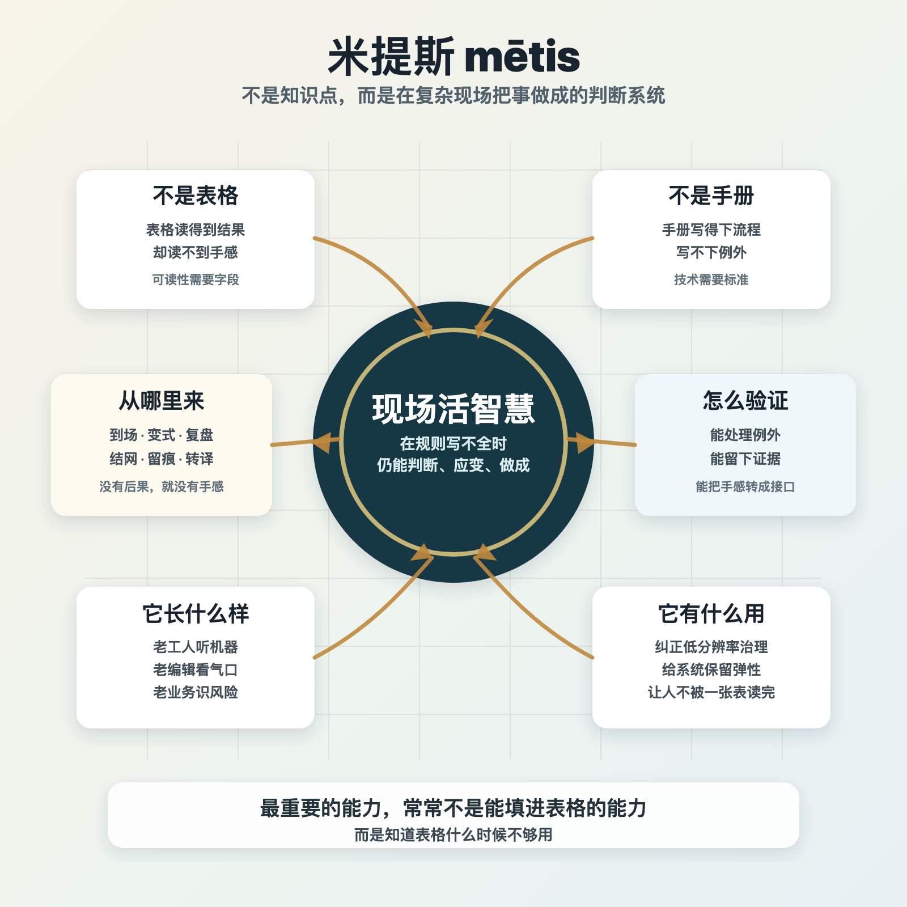
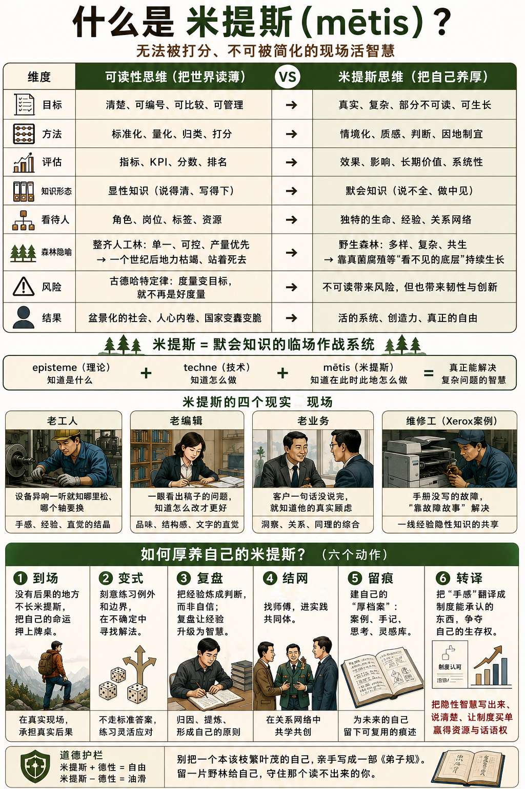

# 可读性：编户齐民中的米提斯

[可读性：编户齐民中的米提斯 \- 得到APP](https://www.dedao.cn/course/article?id=v5WgnrDGd8bKNdomy9JMNRm1wO264y)

中国近年来经常会有一类很奇怪的新闻：某个城市的商业街上，各家店铺不管卖什么，都被要求换成规格统一的招牌，大小、颜色、字体完全一致。老百姓都很不理解：做生意不是应该百花齐放吗？搞这种一致性图啥呢？

这个现象背后，正是大系统最原始的一种冲动。

其实都不用很大的系统。连有的出版机构也是如此：他们每一本书封面的样式都高度统一，摆在书架上像穿着制服排队一样，甚至还有编号。

如果你可以控制，你会本能地要求世界长得整整齐齐。

这不是为了美观整洁。大系统追求的是一个更深刻的东西，叫做「 可读性 （legibility）」。

✵

「可读性」这个概念是美国政治学家和人类学家詹姆斯·斯科特（James C\. Scott）提出来的，出自他的《国家的视角》（ *Seeing Like a State *）\[1\] 一书。咱们前面刚讲过斯科特的学说，他特别善于分析政府如何统治和老百姓如何被统治。

很多人以为做统治者可以为所欲为，其实不然。哪怕你掌握绝对武力，可以任意决定他人的生死，你也做不到想怎样就怎样。你需要征兵，你需要维持一个官僚集团的运转，你必须有税收。你必须既能把税收上来，又不至于杀鸡取卵，破坏老百姓纳税的能力。

我们前面讲了，谷物国家是最容易征税的 —— 但你也得具体去征才行。想象你是皇帝，统治几千万子民，他们讲几百种方言，种着形状各异的地……你想收税征兵，可是你怎么知道哪家种了多少地，有多少人呢？

斯科特说，你首先要让社会可读。

事实上，人类最早的文字，记录得最多的，不是诗歌也不是情书，而是粮食、税收和劳役 \[2\]。

你以为秦始皇统一文字、统一度量衡是为了方便全国百姓互通有无、搞活市场经济吗？那是国家加强社会可读性的技术。全世界的国家都经历过类似的统治技术升级：给每个人安上固定的姓氏，丈量登记每一块土地，定期清点人口，绘制地图，编订税册，还要发给你一张身份证。

而且“可读”可不只是“只读”。不是说你们该怎样生活就怎样生活，我派人挨家挨户找你们慢慢统计 —— 而是为了我统计方便，你们必须排好队，以让我更可读的方式生活。

“可读性”在古代中国有个更硬的表达方式，叫「编户齐民」。

这是秦制的拿手好戏：中央政府管郡县，郡县管户籍，地方上对老百姓搞什伍连坐，把人一户一户钉死在土地上。这套技术在朱元璋时代登峰造极：用「黄册」登记每一个人，用「鱼鳞图册」丈量每一寸地，各家各户被设定为军户、匠户、灶户、民户、站户、铺户、船户、乐户……世世代代不许改行。

可读性到了这个水平，就等于说为了让国家的账本好读，老百姓必须放弃自己人生的可变性。

你说这是奴役，但是朱元璋也有话说：没有可读性国家就是瞎子。如果收不上税或者不能公平地收税，我怎么提供安全保护、基建、教育这些基本公共服务？

问题不是国家读社会。

问题是国家为了读社会，反而把社会读薄。

✵

历史反复证明，朱元璋想要的那种可读性，并不能让老百姓从此安居乐业。

斯科特讲的一个经典案例是十八、十九世纪德国的森林。

在林业官眼中，野生的森林太乱了：树种混杂，高矮不齐，下面覆盖着数不清的灌木、藤蔓、枯枝和苔藓，很难估算能出多少木材。于是他们干脆推倒重来，种下一片“科学林”：单一树种，行距相等，横平竖直，像军队方阵一样。你站那一看，多少棵树、多少立方米、值多少钱清清楚楚。而且施肥、除虫、管理也方便，这叫规模化！

一开始的确迎来了林业大丰收，全欧洲都来取经。可是一个世纪后，灾难来了。

那些被理性清走的东西 —— 真菌、昆虫、鸟雀、枯枝、腐殖质 —— 原来正是森林的免疫系统和营养循环。它们一走，地力枯竭，虫害肆虐，一代弱过一代，最后整片林子死了。德国人最终不得不把当初清走的野性请回森林。

回头想想，国家看见的其实不是森林，而是木材。

木犹如此，人何以堪。

✵

德国人对森林做的事儿，就是秦制对古代中国人做的事儿。同样以谷物为生，以前的中国人是什么样，后来的中国人又是什么样？

张宏杰有个很有力的比喻 \[3\]：中国人的精神气质像一条河。春秋是上游，水质清，水势急，所以人也清澈刚健；汉唐是中游，已经泥沙俱下，但仍有雄大气象；到了明清，河流接近下游，水势衰败，精神也随之低伏。于是我们看到的，不再是先秦那种贵族气、唐宋那种雍容文雅和雄健气质，而是越来越多的麻木、顺从、油滑，乃至奴性和流氓气。

咱们就看古代中国人给孩子的开蒙读物。你看南朝梁武帝时期成书、流行于隋唐的《千字文》，开篇说的是「天地玄黄，宇宙洪荒。日月盈昃，辰宿列张……」一上来就是天地宇宙，那是何等的格局？生而为人就得思考大问题、办大事。

到了成书于南宋的《三字经》，开篇就变成了：「人之初，性本善……」，要从伦理秩序学起了。

等到大清康熙年间出来的《弟子规》，对人的要求就成了：「父母呼，应勿缓；父母命，行勿懒……」

这是文明气质的收缩。

不是中国人天生如此，也不是谷物文明必定如此，而是户籍、伦理、科举，一层比一层细密的统治技术把人逐渐变得如此。

在这个视角下，所谓「李约瑟难题（Needham Question）」的答案不是明摆着的吗？为什么近代科学没有诞生在中国？因为明清的中国聪明人都在考科举。一个把科举、官僚、考核推到极致的帝国，会亲手铲平社会中“不可读的野生地” —— 可恰恰是那些野地，才长得出意外，长得出创新突破。

✵

过度的可读性和编户齐民不但坑害老百姓，而且会让治理机器自身变蠢、变脆。

秦制王朝统治力最强盛的时候都是前期。土地重新丈量，户口重新登记，赋役重新分派，军户、匠户、灶户各归其位，那真是秩序井然……可是账本誊清的那一天，也正是它开始失真的那一天。

人口会流动，土地会易主，职业会变化，地方胥吏会造假，豪强会隐匿田产，普通人会想办法让自己稍微自由一点 \[4\]。没过多少代，连朱元璋的后人都不再相信他那套制度。晚明和晚清的中国都相当自由，一边是商业更发达，一边是政府无力应对新商业局面，汲取能力反而下降，只会欺负农民。

编户齐民的麻烦就在于，它把那些“不好登记”的东西 —— 地方知识、非正式合作、试错空间、异端思想、手艺人的判断 —— 一并抹杀了。

✵

我讲这些不是为了控诉古代帝国，而是为了说一个有关个人的道理：人不能把自己给编户齐民。

很多人热衷于体制化，其实体制化的人都是可替代的人，是最可悲的人。

斯科特写《国家的视角》，真正想说的不是“国家很可怕”，而是有一种极为宝贵的东西，是国家读不到的。

这个东西甚至没有现成的英文表述，斯科特不得不从古希腊借来一个词，叫「 米提斯 （mētis）」。

米提斯是在不断变化、从不重复的现场里临机应变、把事情做成的那种活智慧，那种“狡智”、“机智”、“权变智慧（cunning intelligence）”。

米提斯跟我们前面讲过的波兰尼说的「默会知识」有点像，但意思不完全一样。“默会知识”是强调你知道，但你说不出来；“米提斯”则是说只有在本地现场才知道 —— 也许你能说出来，也许你说不出来，要点是不在现场就学不会。

米提斯是老钳工一摸机床就断定它今晚要出事，可日志里一条报警都没有；老编辑读一篇稿子，数据全对、逻辑无误，他却说“这口气不对”；老业务员跟人吃顿饭，合同明明没毛病，他却咬定“这人不靠谱”。

米提斯不是能填进表格的能力，而是知道表格什么时候不够用的能力。

面对编户齐民，你要做的不是逃进山里让自己不可读，而是在城市、公司、平台、学校里，保留一块不被低分辨率读完的自己。你要追求和守住米提斯。

✵

米提斯不是钻系统的空子，而是对系统的补充。历史证明，越是想把人读齐、读薄的体制，反而越离不开那些读不清的人。

比如说，大明和大清都是「流官制」，地方主官三年一换，而且还有回避制度，不许在本省任职。这是一种很刻意的可读性设计，把官员变成可以随时替换的标准零件，防止他成为坐大的地方势力。

但这是一个相当荒唐的设计。你想想，一个科举做题家，受到的所有训练就是写八股文，连一件实事都没干过，直接空降，就能主政一方吗？他知道怎么办钱粮刑名吗？他连当地方言都听不懂！

真正办事的人，是本地的胥吏，是官员自掏腰包聘请的幕友和师爷。尤其师爷，多出自绍兴，靠师徒口传、同乡结网，把律例的精确操作攥在手里 \[5\]。朝廷不会直接看见这些人，朝廷只跟官员说话；但是帝国其实是靠这些人撑着的。

想让人可替换的制度，最后让最不可替换的师爷掌了实权。

再看山西票号。在一个连合伙、契约条款都写不全的弱法律环境里，晋商居然做成了主导全国近一个世纪的汇兑生意。他们当然不是靠国家政策，而是靠同乡和宗族的信用网络筹资，靠担保人招募伙计 \[6\]。

正是多亏了山西票号，中国才能在没有现代银行体系的时代，把北京、平遥、汉口、上海、广州乃至更遥远的商路上的银钱连成一张网。晋商把银子从“必须搬运的金属”，变成了“可以汇兑的信用”。结果是连朝廷和地方政府都得靠这些票号完成跨省调款。

你读不到，但是你不得不用。

如果编户齐民真的像朱元璋设计的那样运转，国家早就不行了。上面胡乱搞，下面还能勉强维持，靠的是他们看不见的那些拥有米提斯的人。

有人研究苏联计划经济，发现了一个有意思的现象：苏联的工厂其实是靠两种人活着 \[7\] ——

一种是机器出什么毛病都能给你拼凑修好的万能修理工。他不按手册操作，不听领导安排，也不指望上级的帮助。他就靠自己的耳朵和手感，拿一堆旧零件，找到替代方案，把事儿给你对付过去。

另一种叫「tolkach」，可以译成“推手”。他们会动用私人关系，把计划里根本配不齐的原料给你“搞”来。没错，苏联也有关系网，叫做「blat」。

你想想中国计划经济时代那些工厂，不也是这两种人在维持吗？最近热播的电视剧《主角》里，易青娥的舅舅、县剧团司鼓胡三元，就是他们的典型。

他不说套话，不尊重组织程序，不服管，甚至还有点江湖气，但是领导拿他没办法。因为真能解决问题的，恰恰是这种「白专」能人。

编户齐民喜欢培养可替换的人，但真正维持系统运转的，是这些不可替换的人。

他们不是体制的成就，甚至不是体制的恩赐。他们是体制的幸存者。

米提斯是不会死的。

✵

那你说，我怎么温养自己的米提斯呢？

首先你得「 到场 」。

米提斯只能从现场长出来，而且必须是有后果的现场。坐在办公室里可长不出来对教育的判断；你得去看学生到底怎么学，去看那些好老师为什么反而被系统惩罚。

然后要「 变式 」。

我私下认为，米提斯很难刻意练习。因为你做的不是同一类型的题。你必须见过一千个“相似却从不相同”的局面，才能练出“差一点就完全不同”的辨别力。

你真正的学习方法，是「 复盘 」。

经验本身并不产生米提斯，没有复盘的经验只会制造疲惫、油滑和偏见。感悟来自事后诚实的追问：我当时以为会发生什么？实际发生了什么？我漏掉了哪个信号？下次怎么更早闻到味道？

你还需要「 结网 」。

米提斯从来不是孤胆英雄的专利，它常常长在一群人的共同记忆里。米提斯的学习是一种「情境学习（situated learning）」，新人要通过「合法边缘参与（legitimate peripheral participation）」进入实践共同体 \[8\] —— 说白了就是得有师傅领你进圈子。

诀窍不是在 PPT 里，而是在“我跟你说，上次有个案子……”这种私下聊天中传承的。

再往后要「 留痕 」。

你需要一个笔记系统，建一份“厚档案”：不为留分数和职级，而是要留下你处理过的关键案例、作品的迭代、当时的判断依据，以及那些几乎就要出事却被你拦下的“差一点就失败”。结果是给系统看的，过程是给自己保命的。

最后一步叫「 转译 」。

你得让系统能读到你 —— 虽然它读不懂 —— 你得证明自己对系统的价值。这意味着你要把手感翻译成制度能承认的东西。斯科特的说法叫「公开文本（public transcript）」和「隐藏文本（hidden transcript）」\[9\] ——

要把公开那一层 —— 合规、达标、报表、流程 —— 做到无可指摘，这是你换取自由空间的通行费；同时，把你真正的判断力、对质量近乎执拗的坚持、对长期价值的下注，放在指标看不见的地方。

✵

1990 年的某天晚上，斯科特在原东德一个地方的十字路口等红灯。路上明明一辆车都没有，可是几十个行人却依然规规矩矩地在那儿等。偶尔有人穿过去，还会被当众责备。斯科特忽然意识到：服从不是从大事开始训练的，服从是从这些小小的、无意义的等待里习惯成自然的。

斯科特提出一个建议，我一听就立即采纳，叫「无政府主义柔体操」\[10\]：偶尔违反一条无伤大雅、明显不合情理的小规矩，不是为了破坏秩序，而是为了提醒自己 —— 我仍然有判断规则是否合理的能力。

不要让服从变成肌肉记忆；

不要让指标替你思考；

不要把自己活成组织里最容易被替换的那种人。

身处编户齐民之中，你能跟系统最好的关系，是“入格”，但不“入笼”。

注释

\[1\] James C\. Scott, Seeing Like a State: How Certain Schemes to Improve the Human Condition Have Failed, Yale University Press, 1998\.

\[2\] James C\. Scott, Against the Grain: A Deep History of the Earliest States, Yale University Press, 2017\.

\[3\] 张宏杰，《中国国民性演变史》，长沙：岳麓书社，2020 年。

\[4\] 《精英日课》第四季， 统治的技术和被统治的艺术（上） 、 （下） 。

\[5\] Ch’ü T’ung\-tsu, Local Government in China under the Ch’ing, Harvard University Press, 1962；Bradly W\. Reed, Talons and Teeth: County Clerks and Runners in the Qing Dynasty, Stanford University Press, 2000\.

\[6\] Randall Morck and Fan Yang, The Shanxi Banks, NBER Working Paper No\. 15884, 2010；Meng Wu, “A Study of the Shanxi Piaohao Banks, 1820s–1930s,” Business History, 2024\.

\[7\] Alena V\. Ledeneva, Russia’s Economy of Favours: Blat, Networking and Informal Exchange, Cambridge University Press, 1998\.

\[8\] Jean Lave and Etienne Wenger, Situated Learning: Legitimate Peripheral Participation, Cambridge University Press, 1991\.

\[9\] James C\. Scott, Domination and the Arts of Resistance: Hidden Transcripts, Yale University Press, 1990\.

\[10\] James C\. Scott, Two Cheers for Anarchism: Six Easy Pieces on Autonomy, Dignity, and Meaningful Work and Play\. Princeton: Princeton University Press, 2012\.

1\.「可读性」：国家为便于治理，将复杂社会简化为可统计、可管理的信息。它把那些“不好登记”的东西 —— 地方知识、非正式合作、试错空间、异端思想、手艺人的判断 —— 一并抹杀了。
2\.米提斯是在不断变化、从不重复的现场里临机应变、把事情做成的那种活智慧，那种“狡智”、“机智”、“权变智慧”。
3\.温养自己的米提斯，有六个动作：到场、变式、复盘、结网、留痕、转译。

