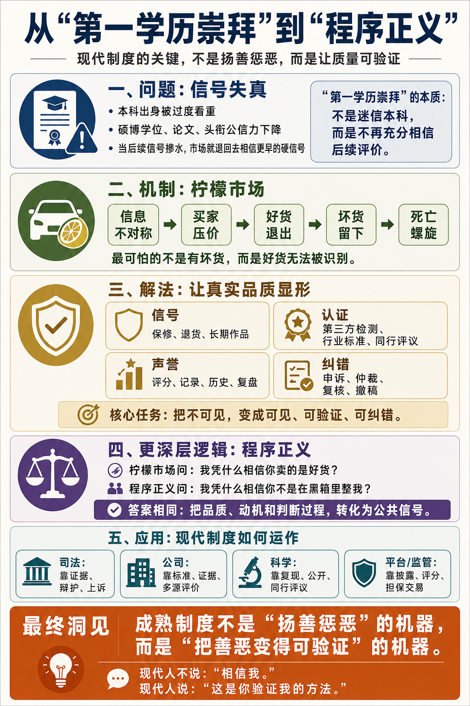

# 柠檬市场：不要直接扬善惩恶，要让好坏可验证

[柠檬市场：不要直接扬善惩恶，要让好坏可验证 \- 得到APP](https://www.dedao.cn/course/article?id=Age3MrB5aPdV5nYEYrJwD2ky4jvENQ)

你注意到没有，现在很多好单位招聘，都特别在意应聘者本科是哪个学校毕业的 —— 本科达没达到 985 或者 211，决定了人才的档次。这叫「第一学历崇拜」。至于说硕士、博士学历，含金量已经大不如前。

曾几何时，硕士、博士是非常受尊敬的头衔。研究生，顾名思义，是做研究的人。一个人能读到硕士，说明受过高级训练、有点研究能力……那怎么现在就不是能力了呢？

一方面当然是现在有硕士、博士学位的人太多了，高学历已经不再是稀缺的信号。但另一方面，确实，人们不再充分认可这些学位所代表的水准。

硕士可以水，博士可以混，导师可以是挂名的，论文都可以买，这样的学位读下来，除了有耐力延迟就业，还能证明什么呢？

你看今天，居然连官方都承认，毕业论文有一个“查重”环节，也就是上网检索一番看论文是不是抄的。可是你想想，这不荒唐吗？只要论文是你自己写的，就算不是特别有新意的研究，也不至于说能查出重来啊。而且有些学校更是规定，只要查重率不超过一定的数值，论文就算没问题。等于是默认你可以抄一部分。这不斯文扫地吗？

现在有了 AI 更方便了：学生用 AI 写论文，老师用 AI 审稿，学校用 AI 查重，学生再用 AI 降重……所有人都在装模作样。你们糊弄给谁看呢？这个学位读着还有什么劲呢？

要不怎么有人说，之所以有第一学历崇拜，是因为人们认可高考的选拔功能，但是不认可高等院校的培养能力。

这不只是教育问题，这还是经济学问题。学位证书和学术发表正在变成一个「 柠檬市场 （market for lemons）」。

✵

「柠檬市场」是美国经济学家乔治·阿克洛夫（George A\. Akerlof）在 1970 年提出的概念，他据此拿到了 2001 年诺贝尔经济学奖。

阿克洛夫最初研究的是二手车市场 \[1\]。在美国俚语里，坏车叫 lemon，也就是“柠檬”。买二手车就怕买到柠檬。然而二手车交易天然就是如此：卖家知道车况，买家可不知道。

这就是「信息不对称」。我们可以推演一番，信息不对称会让市场发生什么 ——

买家并不傻。我知道市场上有好车也有坏车，可是既然我分不出来，我就不可能按照好车给你出价。我一定会把出价降低一些，这样万一买到坏车，我的损失小一些。

但是如此一来，好车车主就不愿意卖了。我的车明明很好，你却只给一个好车坏车的平均价，那我不亏了吗？当然坏车车主还是愿意卖，他很乐意跟好车平均。

于是好车退出，坏车留下。

时间长了，坏车比例越来越高，买家越来越不信任市场，于是价格进一步下降。

于是更多好车退出，更多坏车留下。这是一个不会自己停下来的循环，经济学家称之为「死亡螺旋（death spiral）」。劣币驱逐良币，每转一圈，市场就更坏一点。直到良币消失。

最后市场就变成了柠檬市场。

有了这个眼光，你会发现很多市场都是柠檬市场。招聘市场里，真正有能力的人无法证明自己的能力，会包装简历、会刷面试题的人就越来越多。内容平台上，点击率和情绪刺激最容易被看见被评分，读者就会被标题党、冲突和极端表达包围。医疗保健领域，治疗需要长期验证，患者不知道广告有多少水分，你就不能指望真药打败假药。

现在问题最严重的可能就是学术界。科研经费和学术头衔是政府发的，但是政府不知道哪个研究做得好，就只能看论文数量和影响因子。于是搞科研变成了发论文。一项研究 \[2\] 分析了截至 2022 年 6 月，所有学术期刊中被撤稿并且被认定来自论文工厂的 1,182 篇论文，发现几乎全部相关作者都来自中国机构，其中超过四分之三论文的第一作者单位是医院。

医生的首要任务不是治病救人吗？但是我们的职称评价体系要求他们必须写论文，于是他们就写假论文。结果是全体中国医生写的论文都被降级了信任度。

现在还有人相信百度上的医疗广告吗？如果你是个正规大医院，疗效真的好，你会去百度做广告吗？早就被莆田系医院搞成了柠檬市场。

柠檬市场最可怕的并不是这里有坏货，而是好货无法被识别出来，所以只能离开。

这不是道德问题，这是信息工程问题。

✵

柠檬市场是有解的。现代文明早就发明了一系列避免市场“柠檬化”的机制。基本思想是建立某种信号，让真实品质能被识别出来。

一个办法是 让卖家主动发一个昂贵的「信号（signaling）」 。比如说，既然你的东西好，你敢不敢提供保修？敢不敢允许退货？这是一种可追责的承诺。

一个办法是 找第三方「认证（certification）」 ，比如卖车之前找个修车铺把车做一番检查，出一份可信的报告。现在食品药品领域有政府机构监管，专业技术领域有行业标准和民间评级。

其实最古老也是最有效的第三方认证，就是学术界的同行评议。你的研究够不够分量，不用看什么影响因子什么引用数量，你的同行最清楚……只是同行评议意味着学术共同体自治，而自治意味着行政权力的让渡。

一个办法是 搞可测量的「 声誉机制（reputation mechanism ）」，比如交易记录和用户评分，互联网时代简单有效。

然后你还需要纠纷解决和申诉机制，让坏交易有地方处理。被骗一次可以，但是不能变成对整个系统都不信任。

现实中的二手车市场就比阿克洛夫描述的原始状态好多了。这是因为我们有车辆识别码、事故记录、维修记录、保修制度、问题车退换法（Lemon Law）和车辆历史报告。

中国最漂亮的成功案例大概是淘宝。你想想，如果在 2003 年，有一家远在千里之外的小店，卖一个你从来没用过的商品，价格还不便宜，你敢买吗？你打了钱，他不发货怎么办？对方也会说，他发了货，你到时候不付钱怎么办？双方都担心对方是“柠檬”，交易就做不起来。

淘宝和支付宝的关键发明是担保交易。买家先把钱付到第三方，卖家发货，买家确认收货之后，钱再给卖家。再加上店铺评分、买家评价、聊天记录、物流记录、退换货规则、平台仲裁，陌生人之间就有了最低限度的信任 \[3\]。

请注意，这不是说淘宝上没有假货。恰恰相反，淘宝、拼多多和各种网络平台一直都有假货和山寨产品 —— 但这里的关键是：假货并没有把好货驱逐出去。

因为消费者大体知道信号怎么读。你花 139\.9 元包邮买一双“名牌同款”鞋，你心里知道它大概率是什么东西；下次要买正品，你照样回这个平台，只是去旗舰店、多花点钱。

只要真假不混淆，有假货不等于是柠檬市场。

这一切都不是完美的，但是我们大约可以说，互联网平台让人变得更诚实了一点。

✵

柠檬市场的解药，这一整套「把不可见变为可见、可验证、可纠错」的机制，更深层的名字，是「程序正义（procedural justice）」。 所谓程序正义就是不先问谁该赢、谁该输，而是先把规则说清、把证据摆开、把过程公开、把理由讲明、给错误留下可申诉和可纠正的通道。

柠檬市场问的是：我凭什么相信你卖的是好货？

程序正义问的是：我凭什么相信你不是在黑箱里整我？

这两个问题的答案都是把不可见的品质、动机和判断过程，转化为可见的公共信号。

正如治理柠檬市场不是为了杜绝坏货，而是为了把好货留下，程序正义也不是为了追求结果公平，而是为了让哪怕是输了的人，也承认这个游戏值得继续玩下去。

制度的第一使命不是惩罚坏人，而是留下好人。

你提供的是优质产品，可能因为定价高没卖出去，所以你没有赢。但没关系，只要你相信这个系统能把你和坏货区分开，你就愿意留下，也许主动降价也许继续打磨产品。可是如果你觉得无论你多好都没人看得见，这里的好评是刷的，晋升是关系户，判决是黑箱，市场是骗子的天下，那你就会退出。

你甚至可以承受一定的误判。最危险的不是误判，而是输的人觉得“反正你们早就定好了”。

✵

耶鲁大学社会心理学家汤姆·泰勒（Tom R\. Tyler）长期研究一个问题：人为什么服从法律？是因为害怕惩罚吗？

泰勒做了大量的研究。他在 1984 年对芝加哥 1,575 名居民做电话访谈，一年后又回访其中随机抽取的 804 人，一个一个问这些人，比如说：“你为什么听警察的？是因为警察有枪吗？”……他把答案写成了一本经典著作，就叫《人为什么服从法律》（ *Why People Obey the Law *）\[4\]。

答案是人并不只是因为害怕惩罚才守法，更重要的是人必须相信这套法律程序是公正、中立、可解释、尊重人的。

可是什么样的司法制度才能满足这些要求？法庭不能直接知道事实真相，但是你可以确保产生结果的这个过程是公平的。

现代司法的全部努力，不在“直接宣布真相”上，而在保证逼近真相的程序不被污染：证据规则规定什么能呈堂、什么不能；控辩双方彼此挑战；法官必须说明判决理由；判错了有上诉、有复核。

这套程序最反直觉的地方就是它有时候会让你很不爽。明明你觉得那个人坏，程序却要求证据；明明你希望马上惩罚，程序却要听辩护；明明舆论已经定性，程序却说还要审。

这是因为放过一个坏人对系统的伤害远远小于错杀一个好人。你必须给好人安全感，他们才能留下来。安全感来自程序正义是一个工程化的过程：它有时会出错，但它是可操作、可验证、可纠错的。

✵

公司晋升和考核也是这个道理。

老板说“我们奖励真正有贡献的人”，这句话就不可操作。

可操作的问题是：什么叫贡献？谁来评价？评价者有没有偏心？短期贡献和长期贡献怎么平衡？个人贡献和团队贡献怎么区分？看得见的贡献和看不见的贡献怎么平衡？被评价者能不能挑战错误判断？

没有这些东西，“奖励贡献者”实际上就会变成“奖励会表现贡献的人”。那就是公司里的柠檬化。真正做事的人沉默退出；会邀功的人越来越多；老板以为自己在扬善惩恶，其实是在奖励信号操纵。

好公司一定要有自己的价值观，但日常管理不能靠高喊价值观。好的管理靠的是建立清晰的事前晋升标准、可复核的贡献证据、多源评价、决策理由公开、被评价者可申诉。目标是把“贡献”这个原本主观的事物，变得部分可验证。

学术评议也是同样的逻辑。

科学共同体不会说什么“我们奖励真理、惩罚谬误”。内行都知道真理不是马上可见的，而且今天的“谬误”可能是明天的真理，今天的“突破”也可能只是明天的撤稿。

科学界运行靠的是一套程序：实验可重复、方法公开、数据透明、同行评议、可证伪、被引用、错了能撤稿。这些都不是真理本身，而是接近真理的可验证机制。

每一个新成果发布出来，谁也不能确保论文说的绝对是对的。但是这个程序能让科学整体不断地往前走：能让好的结论留下，让错误的结论被淘汰。

科学的伟大，不是科学家高尚，而是科学错误能被暴露。

还有，为什么用人单位相信高考？因为高考是一个程序正义的考试：题目封存、统一时间、统一标准、匿名阅卷、成绩公开可查。

高考当然不完美。这里有很多偶然因素，相差一分的两个同学，我们实在没有理由相信他们就应该一个考上 211，一个考不上。可是只有这样全凭分数说话才能让人服气。

对比之下，硕士和博士学位的公信力可就差多了，每个官员都可以读个什么“在职博士”。每多一个水货博士，都是在让有真学问的人吃亏。

✵

再结合我们上一讲说的「激励相容」，你会有一个洞见： 现代社会变好，靠的不是要求大家做好人，而是要求大家有一个好制度。

你可以要求你自己做好人，但是“大家做好人”是你无法直接要求的。你奖励好人惩罚坏人，只会让很多人变成伪君子，让坏人藏得更深。更何况，凭什么是你来奖励和惩罚？就因为你拳头大吗？难道你就不会看错吗？难道你就不会腐败吗？

好的制度不去直接要求人，却可以让好人不吃亏，愿意留下来，让好人能够自动显现，让坏人也会理性地去学做好人。

现代制度的天才之处，是它做了一件极其反直觉的事：它放弃了对结果善恶的直接执着，转而建设让善恶能够被自动暴露的程序。

证监会不直接判断哪家公司是好公司，它只要求强制信息披露，让市场去判断；食品药品监督局不直接判断哪个药是好药，但是它要求药品疗效拿出“实质性证据”，让试验和数据说话。法院不直接判断谁是好人，它设立程序，让证据可以质证。

所以严格说来，成熟制度不是“扬善惩恶”的机器，而是「把善恶变得可验证」的机器。

扬善惩恶是前现代社会的愿望；可验证性是现代制度的技术。

现代化让我们不再幻想找到所有好人、把他们安在合适的位置上；不再幻想消灭所有坏人、让世界立即变好。我们承认人性的难以改造，承认信息的有限，承认判断者本身也是有偏见的参与者。然后我们设计程序，让真品质有办法显形，让欺骗变得不划算，让错误能被发现和纠正。

我们学会了不去直接改造人，而是改变信息结构。这大约是现代化最深的智慧之一。

✵

我越往后写就越感到，「工程化」和「可操作」是我们这个课程的隐藏主题。这其实也是现代化的主题。

一个现代人根本就不应该说什么“我很优秀”“我很努力”“我很善良”。为了让人家可操作，你自己得可验证。你得用作品、记录、信用、交付、长期合作关系、可复盘成果、别人愿意持续托付给你的责任说话。

现代人不说「相信我」。

现代人说：「这是你检查我的方法。」

注释

\[1\] Akerlof, George A\. “The Market for ‘Lemons’: Quality Uncertainty and the Market Mechanism\.” The Quarterly Journal of Economics 84, no\. 3 \(1970\): 488\-500\.

\[2\] Candal\-Pedreira, Cristina, et al\. “Retracted Papers Originating from Paper Mills: Cross Sectional Study\.” BMJ 379 \(2022\): e071517\.

\[3\] 《支付宝发布社会责任报告：15 年只为建立信任机制》\. 新浪财经，2019 年 5 月 20 日\.

\[4\] Tyler, Tom R\. Why People Obey the Law\. Princeton, NJ: Princeton University Press, 2006\. Original edition, 1990\.

\[5\] 法学界有个著名的「Blackstone 比率（Blackstone's ratio）」：「宁可放过十个有罪的人，也不可冤枉一个无辜的人。」

1\.柠檬市场最可怕的并不是这里有坏货，而是好货无法被识别出来，所以只能离开。
2\.柠檬市场的解药，这一整套「把不可见变为可见、可验证、可纠错」的机制，更深层的名字，是「程序正义」。
3\.现代社会变好，靠的不是要求大家做好人，而是要求大家有一个好制度。成熟制度不是“扬善惩恶”的机器，而是「把善恶变得可验证」的机器。

