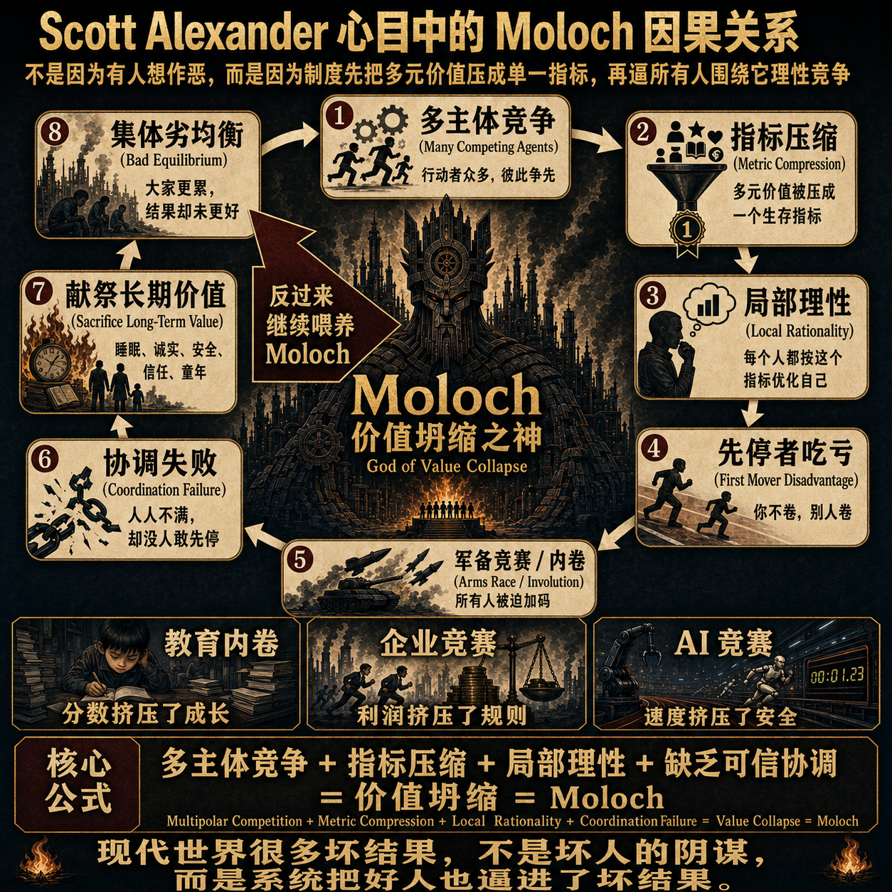
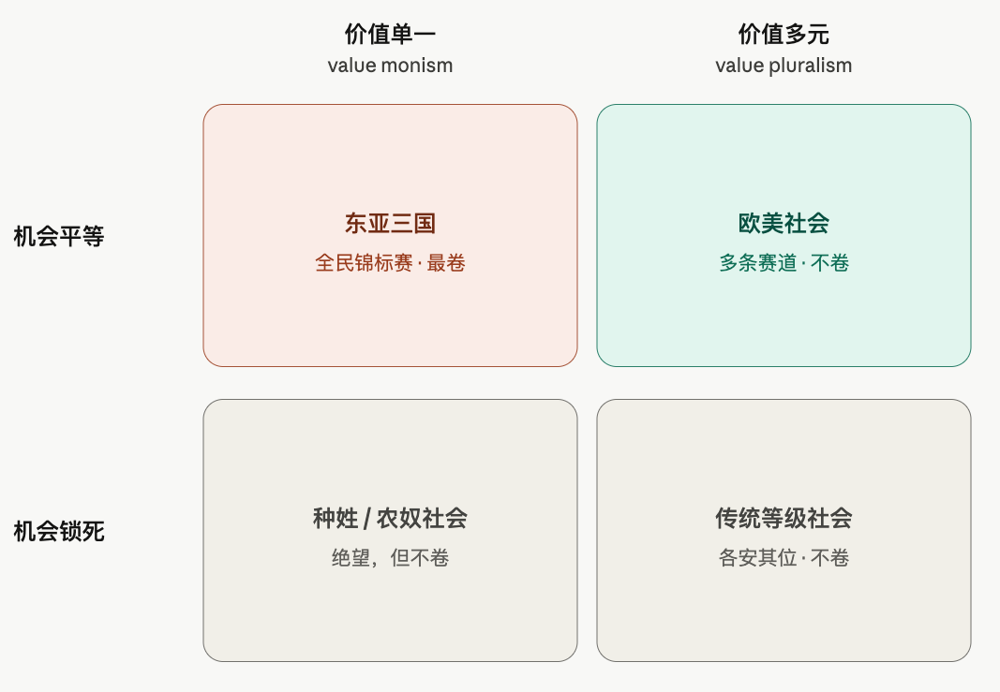
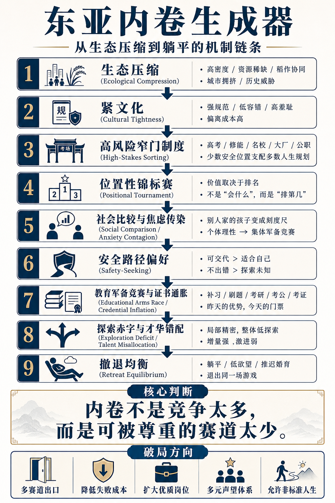
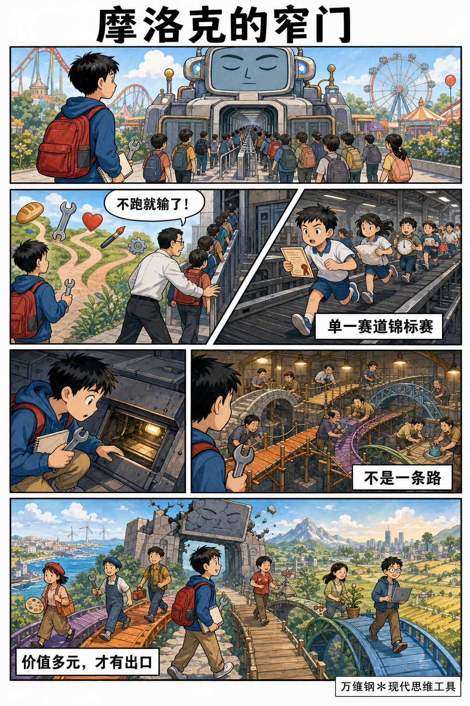

# 摩洛克：东亚为什么这么卷？ 

[摩洛克：东亚为什么这么卷？ \- 得到APP](https://www.dedao.cn/course/article?id=Nwelz6kDn0aKeRWMNdV7qLAO3Bb51j)

这一讲咱们说说为啥中国社会这么卷。有人说是因为中国还不够富裕，有人说是因为中国的制度有问题 —— 但是我建议你先参考一下韩国。

韩国是人均 GDP 达到三万五千美元的发达国家，有选举有自由，文化产业横扫全世界 —— 可是韩国比中国还卷。

2024 年，韩国的校外补习参与率高达 80%，参加者平均每人每月的补习费是 59\.2 万韩元，约合人民币 3000 元 \[1\]。

中国人对高考的重视跟韩国人比都不叫事儿：韩国高考那一天全国推迟上班，股市推迟开盘，军队停止演习，警车在大街上待命，随时给快迟到的考生开道……甚至在英语听力考试的 35 分钟里，全国所有机场暂停航班起降 \[2\]。

韩国人的考试竞争如此激烈，以至于 10 岁到 39 岁人群的死因排名第一是自杀，自杀率位居 OECD 国家第一 \[3\]。

可是如此全民内卷，得到的是什么呢？韩国 25 到 34 岁的年轻人中有 71% 上过大学，大学文凭早就不值钱了，大学毕业生平均只比高中毕业生多挣 31%，高学历青年就业率只有 80%，低于 OECD 同类的 87% \[4\]。

无效内卷其实是东亚社会的通病。现在日本表面上是不卷了：年轻人低欲望，不买房不结婚，内阁府统计有 146 万人蛰居在家，几乎不与家人以外的人来往 \[5\]。但是四十年前，日本曾经有全世界最惨烈的考试竞争，乃至于发明了“考试地狱（受験地獄）”这个词。今天日本人的躺平，只是卷完之后的样子。

造成东亚内卷的，必定是一个中日韩三国共有、而别处没有或者很弱的东西。

这个东西，叫做「 摩洛克 （Moloch）」。

✵

摩洛克本是希伯来圣经里的邪神，人们用亲生孩子向它献祭。一位美国诗人曾经用它指代现代社会这台巨大、冰冷、不知道为谁服务的机器 \[6\]，摩洛克就从吃孩子的神升级成了吃人的系统。2014 年，美国精神科医生斯科特·亚历山大（Scott Alexander）写了一篇引发热议的文章叫《沉思摩洛克》（Meditations on Moloch）\[7\]，把这个意象正式变成一个社会科学概念。

亚历山大说的 摩洛克是一个「多极陷阱（multipolar trap）」：多人互相竞争，每个人做的都是对自己最理性的选择，可是所有选择加在一起，却是把所有人推向一个谁都不想要的结局。

很多现象都可以用摩洛克解释。比如说军备竞赛：每个国家买武器都是为了安全，结果大家一起买来了更深的不安全；再比如流量算法：平台发现当你愤怒的时候会停留得更久，于是所有平台都热衷于推送令人愤怒的内容。

我们可以把摩洛克理解成「囚徒困境」的一种特殊形式。它的因果链条基本上是下面这样的 ——

多人竞争，而且一个单一指标决定输赢（利润、排名、点击率、军力、速度） → 有人发现，牺牲一个不计入指标的价值（健康、安全、诚实、童年），能换来指标提升 → 他取得短期领先 → 于是其他人要么跟进，要么出局 → 大家纷纷跟进，新常态形成 → 每个人的相对位置跟原来差不多，可是每个人的绝对生活都变糟了。

注意这里没有坏人。没有人故意想让局面变坏，而且所有人都知道局面会变坏，但是没有人敢先停下。这就是摩洛克最可怕的地方。

那怎么才能终止摩洛克呢？学者们想了不少限制竞争的方法，比如大家签署一个军控条约，互相监督，谁也别再升级了，或者干脆让政府直接出面管制，但是都属于治标不治本。

韩国政府规定补习班晚上十点必须关门，结果大班课变成了更贵的一对一，补习支出照样年年创新高。

摩洛克困局最根本的问题在于它是一个单一指标决定输赢的游戏。经济学家对此有个「锦标赛理论（tournament theory）」\[8\]：只要奖励是按相对排名而不是按绝对产出发放，人们的努力就不是为了创造价值，而只是为了争夺位置。

摩洛克是一场「单一赛道锦标赛」，所有人的命运被挤进一个排行榜。只要这个根还在，一切协调和限制竞争的措施都只不过是扬汤止沸而已。

世界各地都有摩洛克。但别处的摩洛克都是局部现象，而东亚三国，却把单一赛道锦标赛办成了国家级赛事。

✵

东亚人心目中的单一赛道就是考上好大学、找到一份稳定的好工作、挣钱买房；这条赛道的单一指标，就是分数。分数在东亚能兑换的东西可太多了。历史上大约有两个因素决定了为什么我们如此看重分数。

**一个是科举。 **科举是人类历史上最纯粹的单一赛道锦标赛：一千三百年里，一个庞大帝国把全部的精英位置压缩进同一条管道。

什么叫“天下英雄，入吾彀中”，什么叫“太宗皇帝真长策，赚得英雄尽白头”，什么叫“万般皆下品，惟有读书高”，那不是诗意夸张，而是制度说明书：士农工商，只有「士」通向权力、财富和体面，而通向「士」的路只有考试。

在明清两朝，哪怕你经商达到富可敌国的程度 —— 首先你达不到，国家不允许你敌国 —— 但是就算你能达到，你的最高理想也不过是花钱捐个小官。商人家族的战略都是一代经商，一代读书，钱本身不算数，钱要换成功名才算数。

那你说，参加科举的只是少数人，绝大多数人连字都不认识，怎么考试就成了东亚的全民锦标赛呢？

**第二个因素是，二十世纪中叶，东亚三国不约而同地经历了一场社会「大推平（leveling）」 **\[9\]。中国靠的是革命：土改消灭了地主，公私合营消化了资本家。日本是因为战败后财阀解体再加上农地改革。韩国则直接因为亡国，贵族在殖民时代就失去根基，随后朝鲜战争把残存的财富差距也炸平了。

三场推平的结果都是世袭等级被铲掉，所有人站上了同一条起跑线。

可是起跑线平了，跑道却只剩下一条。没有贵族，没有行会，没有庄园，没有什么可以传好几代的家产，那老百姓还能积累什么复利呢？只有学历。

学历是全社会通用的身份资产。

对比之下，欧洲到今天还拖着旧社会的多元残余：有贵族、有教会、有行会、有工匠传统 —— 德国一个面包师的儿子接手家传面包房，并不觉得自己输给了上大学的邻居。

价值单一 \+ 机会平等 = 全民锦标赛。

这是一个有点反直觉的真相： 卷，不是因为社会不公平；卷恰恰是“公平”的产物。 种姓锁死的社会不卷，农奴制的社会也不卷，他们绝望但是他们不卷。

卷，是专门为“人人都觉得自己有机会、人人都认为自己应该参加、人人都在互相比较”的社会准备的刑罚。

高考是全世界最公平的考试。所以它是全世界最卷的考试。

✵

「内卷（involution）」这个词最早是历史学家黄宗智引入中文世界的，本来是形容明清的小农经济 \[10\]：地就那么些，人口却越来越多，农民就只好往同一亩地里投入越来越多的劳动 —— 而每多投一份劳动，回报就更薄一分。黄宗智称之为“没有发展的增长”。

你看高考不也是这样的吗？所有人都不补课，大学录取这么多人；所有人都补课，大学录取还是这么多人。那我们补课到底是图啥？你的实际工作能力真的因为补课而提高了吗？

这就是摩洛克。每个人都更努力，但没有人更安全。

内卷制造的「负外部性」可不只是加剧竞争，还有四张大账单 ——

第一张账单是学历通胀。 美国社会学家兰德尔·柯林斯（Randall Collins）有个理论叫「证书通胀（credential inflation）」\[11\]，和货币通胀是一个原理：印得越多越不值钱，但谁也不敢停止印。昨天本科是优势，今天本科是门票，明天硕士也只是个排队号。

第二张账单是人才错配。 你就算把人当工具用，人也不是一个数，而是一组能力的组合：抽象推理、动手、审美、共情、组织、冒险、讲故事……对吧？单一赛道锦标赛把这个多维向量投影在“考试分数”这一个维度上，那就必然丢失信息。

一个本来可能成为出色厨师、木匠、销售或者护理师的孩子，被这一个数定义为“差生”。那么孩子的理性选择就是放弃其他项目。

有学者分析了中国 31 个省份的 385 万项专利，发现一个省的社会规范越「紧」—— 也就是对偏离标准路径的人越不宽容 —— 增量式创新占比就越多，激进式创新就越少 \[12\]。

换句话说，越重视单一赛道锦标赛，人们就越擅长把已知的赛道跑到极致，越不擅长探索那些一开始看上去不像赛道的赛道。这大约就是为什么中国擅长「从 1 到 N」，而不是「从 0 到 1」。

第三张账单就是躺平。 有人说躺平是对内卷的反叛，可是你想想：一个真正不在乎这条赛道的人，会“躺”吗？不会的。他会兴冲冲地去干别的。

躺，是一个朝向赛道的姿势。躺平的人不是不在乎，恰恰是太在乎：他在乎这条赛道，又确信自己赢不了，于是用“我不跑了”来保护自己 —— 你们不能说我输，因为我根本没参加。

日本就是躺的极致。被考试地狱卷了四十年，泡沫一破，年轻人发现好好考试、进好公司、终身雇佣、步步高升这条链断了，于是整个社会进入大撤退。但是请注意，即便如此，今天日本的补习班还是满员运转。

日本不是东亚的例外。日本是东亚的预告片。

最后一张账单也是最大的一张：孩子。

摩洛克的本义就是吃孩子的神。它现在是这么吃的 ——

先吃童年：补习班从幼儿园一路排到高三。再吃青春：上了大学接着卷绩点、卷实习、卷考研、卷考公。还吃睡眠：日韩都流行过一个说法叫“四当五落”：每天睡四个小时考得上，睡五个小时就落榜。然后再吃下一代：结婚要房子，而房子是这场锦标赛的奖品；养孩子要教育投入，教育投入是下一轮锦标赛的入场费……

年轻人一看，这笔账太贵了。我干脆不生算了。

如果你觉得现在中国的生育率太低，那我要说的是韩国更低。韩国 2024 年的总和生育率（total fertility rate, TFR）只有 0\.75，全球垫底。这个数字是什么意思呢？每 200 个韩国年轻人，组成 100 对夫妇，只生下 75 个孩子 —— 子女这一代的人数只有父母那一代的三分之一多一点。再过一代呢？那 75 个人只能留下 28 个孩子。

这是民族的自杀。可是那些选择不生的年轻人，难道是因为不喜欢孩子吗？他们恰恰是因为爱孩子。他们认为如果给不了孩子最好的条件、如果生下孩子就是看着她去卷，还不如不生。

低生育率是东亚年轻人对摩洛克最后的抵抗。

✵

这个局的根本解药只能是把一条赛道变成很多条。 你在这条赛道上成功，是成功；他在那条赛道上成功，也是成功 —— 社会必须认可不止一种活法。

这其实就是「 价值多元 （value pluralism）」。

价值多元听着像一句政治正确的客套 —— 不就是“要尊重少数群体、要包容不一样的人”嘛？不是。

价值多元不是一种姿态，而是一个社会的免疫系统，是“内卷”的反义词：内卷是所有人挤向同一个成功，价值多元是这个社会终于能容下很多种成功。

欧美之所以不像东亚这么卷，就是因为价值多元。它们从没被推平成一条跑道，有教会、行会、工会，有来自各国的移民，有像阿米什人（Amish）那样拒绝现代化的特立独行社区，有的国家还有贵族，各有各的活法。

但如果已经是单一赛道，还能不能长出多元来？能，而且古今中外都发生过。

1876 年，日本明治维新废除武士特权，农民的儿子第一次能去当军官、当工程师，人才喷涌而出。

1905 年，清廷废科举，无数聪明头脑一朝获释。不出一代人，他们就变成了科学家、工程师、商人和思想家。你可以说现代中国就是从科举的废墟上长出来的。

今天，三分之二的瑞士青年初中毕业就去读职业教育，德国高级技工的资格在国家框架里跟大学学历平起平坐。这不是强制分流，这背后的关键是行业间的收入差距很小 —— 蓝领工作也很有高级感，人们自然就不会都挤着上大学。

这些变革都有特定条件，有过阵痛，还有反拨，但是变革是可能的。

✵

社会终究会自我平衡。限制竞争是扬汤止沸，价值多元是另起炉灶，人口下降则是釜底抽薪。

2025、2026 年，中国高考报名人数已经连续两年下降 \[13\]。生育率这么低，以后的报名人数只会越来越少。现在已经出现了大学主动抢人的情况，局面正在反转。

而另一边，随着学历溢价逐年走低，有的大学生“返乡创业”，甚至成了“全职儿女”，赛道的吸引力已经不如从前。

人终究是活的。每一个拒绝摩洛克的人，都是在给社会找出路。一个伟大文明，不可能说只有一种人生值得赢。

【尾声小诗】

> 战鼓千年彻五更，独桥万马竞输赢。
悬梁刺股摧花蕾，废苑寒苗断后萌。
骨肉相残空淬刃，神明袖手看刀兵。
拼将烈火焚孤栈，踏碎藩篱万路横。

注释

\[1\] 韩国统计厅，《2024年小初高学生私教育费调查》，2025年3月发布。https://mods\.go\.kr/board\.es?mid=a10301010000\&bid=245\&list\_no=435485\&act=view\&mainXml=Y

\[2\] 新华网，《韩国各界为高考"护航"：调整航班、暂停军演、推迟上班》（2025年11月）等报道。

\[3\] OECD Health Statistics。

\[4\] OECD, Education at a Glance 2025: Korea Country Note：韩国25\-34岁高等教育完成率71%（OECD平均48%）、高学历青年就业率80%（OECD平均87%）、学历工资溢价31%（OECD平均54%）。

\[5\] 日本内阁府《儿童与年轻人意识及生活调查》，2023年3月公布。

\[6\] Ginsberg, Allen\. "Howl\." In Howl and Other Poems\. San Francisco: City Lights Books, 1956\.

\[7\] Alexander, Scott\. "Meditations on Moloch\." Slate Star Codex, July 30, 2014\. https://slatestarcodex\.com/2014/07/30/meditations\-on\-moloch/

\[8\] Lazear, Edward P\., and Sherwin Rosen\. "Rank\-Order Tournaments as Optimum Labor Contracts\." Journal of Political Economy 89, no\. 5 \(1981\): 841–864\.

\[9\] Scheidel, Walter\. The Great Leveler: Violence and the History of Inequality from the Stone Age to the Twenty\-First Century\. Princeton: Princeton University Press, 2017\.

\[10\] 黄宗智，《华北的小农经济与社会变迁》，中华书局。另见《精英日课》第四季， 到底什么叫“内卷”？

\[11\] Collins, Randall\. "Credential Inflation and the Future of Universities\." Italian Journal of Sociology of Education 3, no\. 2 \(2011\)\.

\[12\] Chua, Roy Y\. J\., Kenneth G\. Huang, and Mengzi Jin\. "Mapping Cultural Tightness and Its Links to Innovation, Urbanization, and Happiness across 31 Provinces in China\." PNAS 116, no\. 14 \(2019\)\.

\[13\] 路透社2026年6月报道：2026年中国高考报名约1290万人，较上年减少45万，连续第二年下降。

1\.摩洛克是一个「多极陷阱」：多人互相竞争，每个人做的都是对自己最理性的选择，可是所有选择加在一起，却是把所有人推向一个谁都不想要的结局。
2\.卷，不是因为社会不公平；卷恰恰是“公平”的产物。
3\.卷的根本解药就是「价值多元」。

