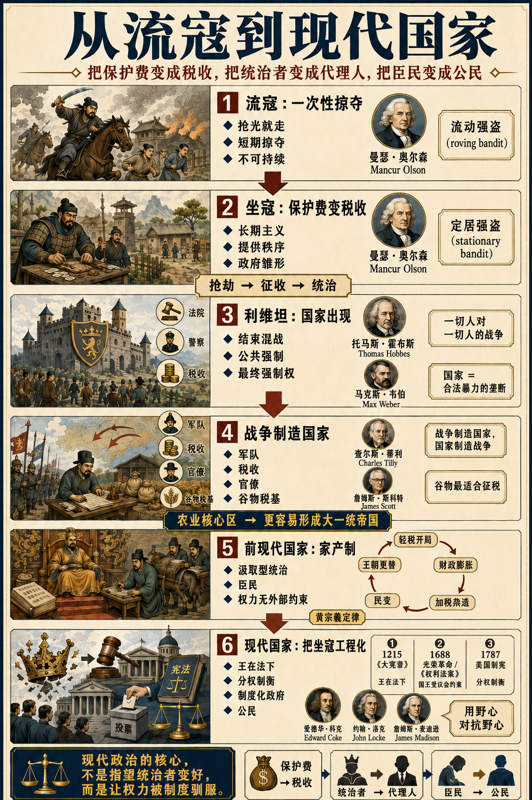

# 保护费和公共契约：政府的演化

[保护费和公共契约：政府的演化 \- 得到APP](https://www.dedao.cn/course/article?id=m845Ln7q69yKOOoWo6KrkebvGDYjgl)

上一讲我们讲到，要解决大范围的「外部性」问题，终究离不开强制，而执行这个强制力的组织就是政府。我们的推演很有逻辑。那你说政府是不是就这么来的？

是不是一群讲逻辑的读书人，辩论很久之后发现自治能解决的问题的确是有限的，于是坐在一起开了个会，在祥和的气氛中达成共识，说我们还是得有个政府，于是才有了政府？

不是。政府可不是读书人的发明。历史的真相更接近于……政府起源于强盗。

政府的历史，就是把保护费改造成税收，把统治者改造成代理人，把臣民改造成公民的历史。

✵

从人类学会聚集财富那天开始，就有人发现抢劫是比劳动更快的敛财方法。但如果你抢多了，你就会发现抢劫不是一个长远的生财之道。

村民好不容易生产这么点粮食，你来了直接给人抢光，连种子都没留下。村民只好饿死。到了第二年，你再想抢都没得抢。用我们上一讲提到过的美国经济学家曼瑟·奥尔森（Mancur Olson）的话说 \[1\]，你这种抢法太低级，你是个「流动强盗（roving bandit）」，说得文雅一点叫“流寇”。

奥尔森的洞见是：流动强盗早晚会演化成「定居强盗（stationary bandit）」，也就是“坐寇”：干脆我把这个村占了，给村民留口活路，让他们继续种地，我每年只从他们身上抽三成的收入。做强盗也不一定非得打打杀杀，细水长流岂不是更好？

有了长期主义思维，你就发生了一次观念跃迁：你不再是“寇”了 —— 你是统治者。你会把那些村民视为自己的子民，而且要为他们提供保护服务，确保别的流寇不来抢劫。这可是你的专属经济区。

奥尔森说，这，就是政府的起源。

我们甚至都不用去远古找证据，这种事情到现在仍然在发生。无论是黎巴嫩真主党武装，还是意大利西西里黑手党，还是墨西哥北部某些地区的毒贩集团，都是一边干着杀人越货的买卖，一边给当地百姓提供基本秩序服务。

他们不但管治安，而且管判案，甚至还修学校。甚至老百姓家里有个红白喜事你都得出面。

请注意，这不是说坐寇变成了好人。他们改变的只是时间偏好。强盗一旦学会长期主义，就开始像统治者；统治者一旦忘记约束，也随时能退回成强盗。

✵

那你说，不要强盗行不行？我们一群村民快乐地生活在一起不好吗？本来是可以的。我们在《精英日课》专栏讲过人类学家大卫·格雷伯（David Graeber）和考古学家大卫·温格罗（David Wengrow）的《人类新史》（ *The Dawn of Everything *）一书 \[2\]，其中最新的考证就是说很多先民社会有复杂的自治能力，甚至比后来的国家社会更自由。但那些先民并没有进入规模化农业，没有多少私人财产，说白了就是没有太多可抢的东西。

一旦值得抢，人间就必定充满争斗，如果没有统治者就会陷入英国哲学家霍布斯（Thomas Hobbes）在《利维坦》（ *Leviathan *）一书中说的那个「一切人对一切人的战争（war of all against all）」的状态。在那个状态里你会盼望有个利维坦出来主持一切，大家签个契约：我们给他交保护费就好。那么就必定会发生从流寇到坐寇的演变 ——

复仇会变成法院，黑帮会变成警察，保护费会变成税收，私人强制会变成公共强制……最终总会有一股坐寇强大到威震四方，像张作霖从“赵家庙保险队队长”变成“东三省保安总司令”一样建立长久而有效的统治，这就是国家机器（State）。

德国社会学家马克斯·韦伯（Max Weber）给的定义直指人心：国家，就是在一定疆域内成功主张「合法物理暴力垄断（monopoly of legitimate violence）」的人类共同体 \[3\]。

而政府，则是国家机器的执行面。

所以政府的起源是收保护费的坐寇。政府的根本是暴力，是最终强制权。

公司可以开除你，但不能关押你。

平台可以收费，但不能征税。

学校可以教课，但不能规定哪个学说是正统。

教会可以逐出教籍，但不能绞死异端 —— 至少在现代社会不能了。

政府跟所有这些组织的区别，不在于它服务更好、不在于它更仁慈、甚至不在于它更“为人民”—— 而在于它拥有最终强制权。

理解了从流寇到坐寇和利维坦的逻辑，你才能理解什么叫“人民需要政府，政府也需要人民”。

✵

其实如果只是供养统治者，让统治者能够提供基本的保安服务，老百姓也花不了多少钱。一家出个 10% 的保护费，一百家就能供养一个生活水准是普通人 10 倍的坐寇。你稳稳当当收租还有啥不满意的？

的确，早期的部落和宗族联盟没有稳定的国家机器，老百姓负担也很低，严格说来都不能称之为国家。

国家，其实是战争制造出来的。

一旦坐寇之间开始打仗，统治者就被逼着建立正规军队，而建军队就得多收税，多收税就得养官僚。哪个坐寇社团这三件事干得好，哪个就赢。输的被吞并，胜的变得更强。

你看中国春秋时代各国打仗还讲礼法，只有贵族才上阵，作战充满仪式感，杀戮极其有限。可是到了战国，各国为了战争就必须不断加强国家机器的力量，也就是所谓变法。五百年军备竞赛演化出来的秦，可谓是一台武装到牙齿的国家机器：郡县、官僚、编户齐民、统一税收……到了这一步，老百姓的负担可就是极重了。

用美国社会学家查尔斯·蒂利（Charles Tilly）的话说，这就是「战争制造国家，国家制造战争。」他那篇发表于 1985 年的论文标题，就叫《作为有组织犯罪的战争制造和国家制造》\[4\]。

其实你说这是犯罪也不太公平。你不主动打仗就是等着被打，唯一的解决方案就是出现一个大一统帝国，作为唯一的利维坦。

但大一统帝国也不是想要就能有的，你还需要一种关键的燃料，那就是谷物。

这是耶鲁人类学家詹姆斯·斯科特（James C\. Scott）的洞见 \[5\]： 谷物，是一种特别理想的征税对象。

小麦、大麦、水稻这些谷物都是长在地里的，你家的地有多大、收成大概能有多少，政府一眼能估个八九不离十。谷物有固定的收获季节，税务官知道什么时候来。谷物是高度可量化的，几斗就是几斗。谷物还可储存，经得起运输。更重要的是，种谷物的农民只能被绑定在土地上，想跑都没地方去。

这管理起来可就太方便了。对比一下游牧民族，今天在这里明天到那里，你想征税或者抓个壮丁都找不着人。

谷物真是统治者的法宝啊。

有研究者用计算机模拟「历史动力学（cliodynamics）」\[6\]，发现只要是农业核心地区，适合低成本征税养兵，那么战争就会变得便宜而且平常：最初不管是分裂成多少个小国，最终一定会有一个大国统一天下 —— 统一战争是可以打得起的。

这就是为什么古代中国、两河流域、印度、埃及这些农业核心区都走向了大一统帝国。

而对比之下，欧洲为什么这么难以统一呢？很多人认为是地理因素，欧洲被山脉和海洋切成无数碎片，不适合调兵打仗。但是更根本的，恐怕还是在于欧洲没有一个像华北平原那样的单一农业心脏。欧洲人在谷物之外还有畜牧、葡萄、橄榄、城市贸易等等的财富来源，政府征税非常困难，统一战争对他们来说太贵了。

西方传教士最初来到中国的时候，往往会感到文明震撼，震惊于中国是一个如此统一而富裕的国家。利玛窦赞叹说，欧洲出产的东西几乎在中国这一个国家全都能找到 \[7\]。

没错，中国从秦开始就已经不再是一个“早期国家”或者“古国”，而是一个有着完善的官僚、税收、军队和各项制度的真正的国家。

但这种国家跟现代国家还是不一样，只能叫「前现代国家」。

✵

前现代国家最大的特点，是它把老百姓视为用于汲取的资源。政府不是什么公共服务公司，而是统治者的家产。

皇上连“我是为人民服务的”这种漂亮话都不屑于说。《商君书》直接主张“弱民”：「民弱国强，国强民弱。有道之国，务在弱民。」《韩非子》说的就更直白了：「君上之于民也，有难则用其死，安平则尽其力。」后来的人可能稍微委婉一些，但也是毫不掩饰的：什么「朕即国家」、什么「为民父母」、「食君之禄，忠君之事」、「皇恩浩荡」……你再怎么讲，这也只能说是文雅的坐寇。

前现代政府的形态是「家产制（patrimonialism）」。你跟政府所能指望的良好关系是“我投靠你、你庇护我”的依附关系；安全和机会不是由制度平等提供，而是由权贵私人分配 \[8\]。

你可以想象，在这样的国家当老百姓是很苦的……但你也别觉得当皇帝就很好。据历史作家张宏杰统计 \[9\]，中国历史上全部 611 位皇帝之中，死于疾病和衰老的只有 339 人，自杀和他杀的有 272 人，非正常死亡率高达 44%，平均寿命只有 39\.2 岁。世界上还有比这更危险的职业吗？

关键在于，家产制把一个不受任何外部约束的巨大权力，交给一个普通肉身去掌握，这件事本身就特别危险。权力越大，所有人都想接近它、操纵它、替代它，皇帝就越不安全，就越猜忌；越猜忌，就越依赖私人忠诚；越依赖私人忠诚，制度就越坏。这是一个死循环。

比家产制更可怕的是另一个死循环，也就是秦晖先生总结的「黄宗羲定律」，最早出自明清思想家黄宗羲对历代赋税的观察 \[10\]，基本上是这么一个过程 ——

王朝建立之初，统治者吸取前朝教训，要让百姓休养生息，于是宣布轻徭薄赋。

但官僚集团有自我扩张的本能，皇上有好大喜功的冲动。毕竟花的不是自己的钱，谁不想招几个亲戚进来一起办大事呢？于是各项花费上涨，统治成本越来越高，财政开始吃紧。那么只能加税 —— 可是正税名义上不好涨，各级官僚就发明了附加费、临时摊派、火耗、徭役折银等等各种名目，老百姓负担越来越重。

到了某一时刻，朝廷中会有一位像张居正这样的改革者站出来，说这种乱收费不行啊，等于纵容腐败，老百姓哪受得了呢？于是把杂税并入正税，说从此不再乱收。

可是没过几年，财政又不够花，就只好发明新的杂税。

就这样反复循环，每一次改革都说减负，长期看却是把负担固化下来，形成“积累莫返之害”。最终农民发现种地要交的税已经大于土地的产出，就开始逃亡。于是流民增多 → 民变 → 王朝崩溃 → 新王朝重建 → 再来一遍。

当然中国有些皇帝是好皇帝，有大量的官员是清官。但这跟明君清官没关系：秦制两千年之下，只要家产制和汲取机制不变，老百姓没有合法的手段制衡政府的权力和税收扩张，历代王朝就只能把这个循环重演。

✵

那你说前现代国家有这么多毛病，是不是统治者自己意识到自己的结构性问题，于是跟读书人讨论一番，设计出了更好的制度，这才有了现代国家呢？

不是。千万别高估思想家对坐寇的影响力。从前现代国家到现代国家的演化主要有三个节点 ——

**第一个节点是 1215 年的英格兰《大宪章》，第一次承认「王在法下」。 **但那可不是因为国王仁慈。

1215 年，英格兰国王约翰对外打仗连续失败，不得不对国内贵族大幅加税、强征军役、甚至没收财产。贵族忍无可忍，联合起来用武力控制了伦敦。约翰王在被逼之下，才签署了《大宪章》。

《大宪章》里最值得品的是第 61 条：贵族可以选出 25 人监督国王履约；如果国王不纠正违约，贵族可以扣押城堡、土地、财产以强制执行。

这相当于把“造反”变成了一种制度化的权利 —— 这是宪政的开始。我们事后看，合法造反权不但保障了贵族权益，而且对国王也有好处，大家都有安全感。但这可不是思想家推动的结果，这是力量对比逼出来的制度。

**第二个节点是 1688 年的光荣革命。 **它的起因也不是思想革命，而是英国上层精英为了保住自己的权力、财产和宗教地位，联手把一个不受约束的国王换掉。它的结果是《权利法案》，把几项关键限制明文规定下来 —— 国王未经议会同意，不能停止法律的施行，不能征税，不能在和平时期维持常备军。

一个君主被剥掉这三样，就不再是家产制的主人，而开始变成制度里的角色。

你看啊，从《大宪章》签字到议会真的能限制住国王，用了整整 473 年。那是几代人持续博弈出来的。在这期间有两位思想家可能起到了一定的作用，但是并不大。

一个是 17 世纪的法学家爱德华·科克（Edward Coke），他把《大宪章》从一份中世纪的封建文件，解释成了英国人原本就有的自由根基。等于是把很久以前贵族的一次反抗，给翻译成了“英国自古以来国王就不能凌驾于普通法之上”，然后又得寸进尺，推导出“臣民拥有古老的权利，征税和拘押必须受法律约束。” \[11\]

另一个是哲学家约翰·洛克（John Locke）。他的《政府论》一书反对君权神授，主张政府的目的不是维护君主荣耀，而是保护人的生命、自由和财产；政府权力来自人民同意，本质上是一种受托权力（fiduciary power）；如果政府违背托付，人民就有权改变甚至推翻它 \[12\]。洛克这本书是光荣革命之前写的，却是光荣革命之后才出版的。

我们回头看，科克和洛克改变了政治叙事，这极为重要，因为它从此改变了人们的观念。但他们更多地是把历史变局通过叙事合法化，而不是直接推动历史变局。

等到卢梭出版《社会契约论》，那已经是 1762 年的事了。

**真正有思想家顶层设计味道的是现代国家演变的第三个节点，也就是 1787 年的美国制宪。**

美国人把英国传统、罗马共和的记忆、孟德斯鸠的分权理论揉成了一套全新的制度。这个制度在技术上的先进之处，是它解决了中央政府到底应该有多强的问题。制宪者很清楚政府太弱不行，外敌、债务、贸易、内部秩序都处理不了。可是如果政府太强，你怎么防备它不压迫人民呢？

答案是双重的「分权制衡（checks and balances）」—— 横向立法、行政、司法三权分立；纵向联邦和州分享权力。这套设计的核心思想就是麦迪逊那句「用野心对抗野心」：不指望任何人有道德，只指望每个人有利益，然后让这些利益互相牵制。

但美国宪法也不能完全归功于思想家。华盛顿之所以不称帝，有他思想先进的一面，但也有他权力不够的一面：他领导的原本就是一支由各州民兵和大陆军拼出来的革命军，财政要靠大陆会议和各州供给，军官和士兵效忠的也不是华盛顿个人，而是各州、议会和革命事业……

简单说，很多国家有宪法，但很多有宪法的国家没有「宪政」，这是为什么呢？因为 限制权力不是写在纸上，而是写在权力分布里。

✵

人民需要政府建立秩序，但政府的出身是坐寇。而现代化，就是哪怕你是个坐寇，也要把你工程化。

现代人必须学会从问“这个人好不好”、“这个政府好不好”，改为问“我们这个制度行不行”。前现代政府是统治者的政府；现代政府是制度化的政府。

可能因为前现代传统太深，今天很多人觉得那些质疑政府的知识分子是在给国家“找麻烦”、是“刺头”、是“不识大体”……可如果你是个读书人，质疑政府其实是你的本分。

要知道，即便是现代政府，即便它提供了很多正外部性，它也是最大的负外部性制造者。咱们下一讲再说。

注释

\[1\] Olson, Mancur\. "Dictatorship, Democracy, and Development\." American Political Science Review 87, no\. 3 \(1993\): 567–576\.

\[2\] David Graeber and David Wengrow, The Dawn of Everything, 2021\. 《人类新史》1：高贵的先民。

\[3\] Weber, Max\. "Politics as a Vocation\." 1919\. In From Max Weber: Essays in Sociology, translated and edited by H\. H\. Gerth and C\. Wright Mills\. Oxford University Press, 1946\.

\[4\] Tilly, Charles\. "War Making and State Making as Organized Crime\." In Bringing the State Back In, edited by Peter B\. Evans, Dietrich Rueschemeyer, and Theda Skocpol, 169–191\. Cambridge University Press, 1985\.

\[5\] Scott, James C\. Against the Grain: A Deep History of the Earliest States\. Yale University Press, 2017\.

\[6\] Turchin, Peter, Thomas E\. Currie, Edward A\. L\. Turner, and Sergey Gavrilets\. "War, Space, and the Evolution of Old World Complex Societies\." Proceedings of the National Academy of Sciences 110, no\. 41 \(2013\): 16384–16389\.

\[7\] 《利玛窦中国札记》。Matteo Ricci / Nicolas Trigault, China in the Sixteenth Century: The Journals of Matthew Ricci, 1583\-1610，Louis J\. Gallagher 英译，1953。

\[8\] 当然中国发明了伟大的科举制度，给人一种强烈的公平感。但在皇上眼中，那只是一个对聪明人维稳、对权贵制衡的手段而已。如果你考察隋唐以来科举选官的面，会发现普通人做官的比例远低于权贵。

\[9\] 中新网：《张宏杰：中国历史上600多个皇帝近一半死于非命》 https://www\.chinanews\.com\.cn/m/cul/2015/06\-07/7327283\.shtml

\[10\] 秦晖，《并税式改革与"黄宗羲定律"》。

\[11\] Sir Edward Coke, The Second Part of the Institutes of the Laws of England, 1642\.

\[12\] John Locke, Two Treatises of Government, 1689/1690\.

1\.政府的历史，就是把保护费改造成税收，把统治者改造成代理人，把臣民改造成公民的历史。政府，则是国家机器的执行面。
2\.前现代国家最大的特点，是它把老百姓视为用于汲取的资源。政府不是什么公共服务公司，而是统治者的家产。
3\.从前现代国家到现代国家的演化主要有三个节点：1215 年的英格兰《大宪章》、1688 年的光荣革命、1787 年的美国制宪。

