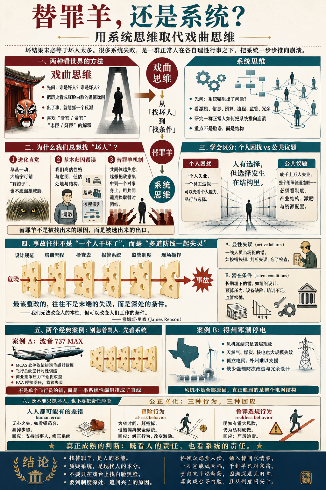

# 替罪羊：从“找坏人”到“看系统”

[替罪羊：从“找坏人”到“看系统” \- 得到APP](https://www.dedao.cn/course/article?id=Mr9mzb36pP4JL5o2PnXkWqB2EYNegL)

学者思考社会问题跟老百姓有一个特别重要的区别：老百姓总是问好人坏人，而学者倾向于琢磨系统。

老百姓眼中办好事的是清官，办坏事的是贪官，开国之君一定英明神武，亡国之君一定昏聩无能……这可以说是「戏曲思维」：把历史想象成几个红脸白脸在台上唱念做打。

可如果你能回到历史现场全面考察一番，你会发现根本不是那么回事儿。就拿明朝灭亡来说，真实历史更接近于崇祯皇帝殚精竭虑夙夜在公，文官个个自认是在为国分忧，武将人人也都有自己的忠诚和难处。吴三桂原本不想卖国，祖大寿曾经很想为国家战死。这些人不是没有缺点也不是不贪污不怕死，但他们都是正常人 \[1\]。

你应该问的不是这些人有多坏，而是朝廷为什么不得不加征三饷，官员为什么非得报喜不报忧，农民为什么不能老实种地而只能造反？

你应该研究的是，为什么一群正常人在理性行事之下，把系统搞崩溃了。

你需要用系统思维取代戏曲思维。那么你必须克服给系统失败找「 替罪羊 （scapegoat）」的倾向。

我们不能读那么多历史只读出一出又一出的道德戏剧，我们得琢磨制度工程。

✵

首先你得从个体归因的习惯中跳出来。

社会学家 C\. 赖特·米尔斯（C\. Wright Mills）在 1959 年出版的《社会学的想象力》（ *The Sociological Imagination *）一书中有个说法：你得学会区分「 个人困扰 （personal troubles）」和「 公共议题 （public issues）」\[2\]。

米尔斯说，一座十万人口的城市里有一个人失业，这大概只是个人困扰，他应该反思自己的技能、努力、性格和运气。但是如果一个五千万劳动力的国家里，有一千五百万人失业，这就不是“求职者眼高手低”能解释的了。这是公共议题：你必须去看经济制度、产业结构、政策周期和社会资源配置。

一家公司里有一个员工造假，可以说这个员工品行不好；可如果一个部门、一个大区、一个公司成百上千人都在造假，那你就不能再问“怎么这么多坏人”。你得问这里的指标、奖惩、管理文化，是不是正在系统性地逼人作恶。

不是说人没有责任。但是人的能动性（agency）会强烈受到他所处的场域结构（structure）的限制。就连整天喊着改造世界的马克思，都在《路易·波拿巴的雾月十八日》一文中说：人们创造自己的历史，但不是在他们自己选择的条件下创造，而是在既定的、从过去承继下来的条件下创造 \[3\]。

拿破仑发动政变是悲剧，他侄子路易·波拿巴发动政变则是闹剧……可偏偏侄子当上了长久的皇帝。你说上哪说理去？

人有选择，但选择发生在结构里。

✵

个体归因实在是一个极为顽固的倾向。

如果你周围一切本来好好的，突然之间发生了一个变化，那么你会强烈地感到，这个变化是一个有意图的行动者造成的。

这个倾向在原始环境中很有用。草丛突然动了一下，你最好把它理解成是有一只豹子正在走过来，而不是风吹的；你宁可误判，也别漏报来自他人的恶意。

所以要是遇到瘟疫、股灾、事故、危机，我们的大脑就很难接受“这是复杂系统在某个临界点的涌现”。它一定要问：是谁干的？

我们不但认为一定是有人干的，而且还会认为一定是那个人\*故意\*干的，是他的本性就是如此！

社会心理学家李·罗斯（Lee Ross）在 1977 年提出一个概念叫「 基本归因谬误 （fundamental attribution error）」\[4\]，意思是我们解释他人行为的时候，往往高估性格、品质和意图的因素，低估处境和结构的原因。

比如别人迟到了，我们的第一反应是“这个人没时间观念”，而很少想他是不是遇上了堵车什么的突发情况。一个基层员工犯错，我们第一反应是“他责任心差”；而很少想他的工作量是不是超载，培训是不是缺失，流程是不是有问题。

如果你相信事情是行动者导致的，又相信行动者的行为是因为他的品质，那么你就会把一个坏的结果归咎于坏人。我们真的很喜欢听有反派的故事。这不就是戏曲思维吗？

✵

怎么跳出戏曲思维，看见系统呢？咱们可以借鉴安全工程中的学说。

英国心理学家詹姆斯·瑞森（James Reason）有个说法，比如发生了一起重大事故，你可以有两种视角：「人因视角（person approach）」和「系统视角（system approach）」\[5\]。人因视角盯着一线人员：是不是这些人疏忽、懒惰、违规导致的？系统视角则问：防线为什么失效？这个系统为什么能让人犯这么大的错误？

不是说人没错误，但是人犯的可能只是「 显性失误 （active failures）」，系统的问题则是「 潜在条件 （latent conditions）」。

一线人员当场犯的错，比如按错按钮、判断失误、忘了检查，这些是显性失误。而管理决策、组织设计、预算压力、设备缺陷、培训不足、监管松弛长期埋下的雷，则是事故的潜在条件。这些潜在条件可能已经潜伏了很多年，一直都没事儿，实则正在等着某个倒霉的一线人员来引爆。

那哥们儿那天也是不小心，按错了按钮，结果系统就崩溃了……可是你能说这全是他的责任吗？

就好像有人碰倒了一张牌，导致一整排多米诺骨牌都倒了。这个人也不是没有责任，可是更大的问题难道不是这个系统为什么会被弄成多米诺骨牌吗？

瑞森研究航空、医疗、核电这些高风险组织里的事故，提出一个「 瑞士奶酪模型 （Swiss Cheese Model）」\[6\]。他说复杂系统通常有很多层防线：设计规范、培训流程、检查表、报警系统、监管制度、现场操作……每一层防线都可能有漏洞，合在一起就好像一块瑞士奶酪一样，中间有很多洞。

平时这些洞是错开的，危险穿不过去。

可是某个时刻，奶酪每一层上的洞刚好排成一条直线，事故就贯穿而出了……

也就是说，重大事故很少是单一原因造成的 —— 那是多道防线同时失效的结果。

所以你最该整改的不是显性失误，而是潜在条件。用瑞森自己的话说，就是「我们无法改变人的本性，但可以改变人们工作的条件。」\[5\]

这不是说要宽恕犯错的人，而是提醒你：如果你只处理人，不处理条件，你下一次还会得到同样的事故。

✵

看两个真实案例。出了事儿人们总是倾向于先找人，但其实你应该找条件。

2018 年 10 月 29 日，印尼狮航 610 航班坠毁，189 人遇难，飞机机型是波音 737 MAX。波音公司对此的反应是立即找替罪羊，说是飞行员操作不当。是啊，波音是什么公司？人家的飞机都是经过美国联邦航空局（FAA）认证的，肯定是外国航空公司的飞行员出错了！

可是紧接着，2019 年 3 月 10 日，埃塞俄比亚航空 302 航班坠毁，157 人遇难。又是波音 737 MAX，而且是以相似的方式坠毁。

这可就压不住了。后来的调查显示，真正的问题恰恰是一串系统性的洞排成了直线 \[7\] ——

最靠近事故现场的那一层的洞，是一个软件，叫「机动特性增强系统（Maneuvering Characteristics Augmentation System, MCAS）」。它的作用是在特定飞行状态下自动压低机头，补偿新发动机带来的气动变化。这个软件一旦遇到传感器给出错误数据，就可能误判飞机要失速，于是反复把机头往下压。

第二层的洞，是飞行员没经历过针对这种错误的模拟训练。波音为了尽量避免要求航空公司花大钱重新培训飞行员，在培训手册中淡化了 MCAS 的存在。那你说为啥非要有这么一个软件呢？

第三层的洞，是波音面对空客 A320neo 的竞争，必须尽快推出新机型，就在老 737 平台上换装了更大、更靠前的发动机，导致飞机气动特性变了，可是又不想对飞机大改，才搞了这么一个用软件对付的办法。

第四层的洞，是波音这么干，竟然没人管。FAA 长期采用一种授权委任机制，把大量认证工作交给波音内部人员完成……等于是波音自己监管自己。

所以你能只怪飞行员操作失误吗？你能说这是因为工程师写错了代码吗？这是整个系统的问题。

第二个案例是 2021 年，一场极端寒潮袭击了美国得克萨斯州，数百万户家庭停电，很多人失去供暖和饮用水。

灾难刚发生右翼舆论就找到一个替罪羊：风力发电机。天一冷，风机就冻住了，这不就说明新能源不可靠、绿色能源害死人吗？左派果然是反派啊！

可是后续调查显示 \[8\]，得州电网崩溃还真不能说是“风电害的”：风机确实有冻结停摆，但天然气、煤炭、核电等传统能源系统也在恶劣天气中大规模失效 —— 其中天然气机组占了故障机组的 58%。

真正的问题是得州电网的结构。为了躲避联邦监管，这个电网是个孤立的电网，跟别的州没有联系，邻州的电在有事的时候送不进来。

也正是因为不受联邦监管，它没有做强制的防冻改造，没有足够的冗余设计。特别是，天然气和电力互相拖死：发电需要天然气，可是采气输气本身又需要电力，那是一个死亡螺旋！

事实是那个电网早就不行……风机冻住只不过是出事的一个契机而已。

你看，像这样分析出系统的原因，不比骂左派右派有用多了吗？如果不分析系统原因，像发生金融危机的时候只知道骂华尔街太贪婪，有什么用呢？

✵

出事儿找替罪羊，不只是一个认知错误，而且还满足了人类更深层的心理需求。法国哲学家勒内·吉拉尔（René Girard）有一套著名理论，就叫「 替罪羊机制 （scapegoat mechanism）」\[9\]。

这个理论说，当一个共同体内部的矛盾越来越大，冲突快要失控的时候，人们会无意识地把分散的敌意集中到一个具体对象身上。这个对象可以是外族人、异教徒、某个少数群体、或者某个倒霉的个人。然后通过共同迫害这个替罪羊，大家就可以暂时恢复团结。

瘟疫来了，经济坏了，社会焦虑升高，人们处理不了，甚至理解不了这些复杂的危机，但是必须采取一个什么行动出口恶气。这时候就迫切需要找到一个“投毒者”、一个“阴谋集团”、一个“内部敌人”。

说得再直白一点，替罪羊机制就是人群为了从“所有人斗所有人”走出来，去“所有人斗一个人”。咱们回忆一下人类历史，是不是这样？

替罪羊不是被找出来的原因，而是被选出来的出口。

替罪羊机制是文明最古老的止痛药。它从不治本，但是它能管一阵子用。

把坏事归到具体的少数人头上，社会就不用反思了。我们没问题！都是他们的错！这其实是权力最喜欢的因果模型：责任下沉，合法性就上移。

你知道最可悲的是什么吗？最热衷于维护替罪羊解释的人，恰恰是系统里最弱势的群体 \[10\]。为什么？因为“有个坏人害了我”，至少还是一个有希望的故事 —— 抓住坏人，换个清官，日子就能好。而“压迫你的是整个结构，根本没有一个单独坏人可恨”，那可太绝望了。

也许戏曲思维最深的根，就在那一点心酸的希望里。

✵

我们还可以从另一个角度考虑替罪羊机制：到底什么是坏人？

一个官员因为收受贿赂，把工程包给了一家不称职的建筑公司，导致桥梁倒塌。你说这个官员是坏人吗？他是怎么个坏法呢？

美国安全工程顾问戴维·马克思（David Marx）有个学说叫「公正文化算法（the Just Culture algorithm）」\[11\]，把造成坏后果的行为分成三类，认为应该区别对待 ——

第一类是「 **人人都可能有的差错 **（human error）」，也就是无心之失。医生疲劳状态下看错一个药名，飞行员在混乱报警中漏掉一个步骤，对这种错误最好的办法不是惩罚，而是安慰当事人、修正系统。

因为你惩罚无心之失就会让人隐瞒错误。而隐瞒错误，系统就无法学习。

第二类是「 **冒险行为 **（at\-risk behavior）」，它不是有意作恶，但的确冒了不该冒的险。

通常是人为了省时间、图方便、赶指标，慢慢偏离安全做法。比如本来应该双人复核，大家觉得麻烦就长期省掉；本来有安全流程，现场为了赶进度就绕过去。对这种行为必须纠正，但重在训练而不是惩罚，特别是要消除系统中的错误激励。

人之所以走捷径，往往是因为系统在奖励走捷径。

第三类是「 **鲁莽违规行为 **（reckless behavior）」，是明知道存在重大且不正当的风险，却为了私利硬要去做。

比如明知桥梁材料不合格还放行，明知药品造假还签字，明知安全隐患严重还强令生产。对这种人，那没话说，必须严厉追责。

这样一看就清楚了，贪官其实是第三类人。恐怕没有哪个官员一心就想“我要把国家搞坏，我要残害老百姓，我要让这个工程变成豆腐渣”，他们想的往往是“这家公司可能不如最好的公司，但应该也能干；这个材料便宜一点，应该也不会出事……”

所以贪官被捕之后都说“我当时抱有侥幸心理。”

有了这个三分法，我们就能避免两种幼稚病：一种是出了事一定抓坏人，一种是反正都是系统问题，谁都不用负责。其实事情往往既有人的责任，也有系统的责任。至少达到这样的颗粒度，我们才能合理追责、改进系统。

✵

世界上当然有坏人。鲁莽、恶意、腐败、欺诈，都应该追责。但我们还是需要一点社会学的想象力。

如果一个坏人欺负了一个人，我们完全可以说就是因为他本身是个坏人。但如果一个坏人造成了天大的事故，甚至长期为害一方，那我们就必须问一问：这个系统到底是怎么回事，能给他那么大的杠杆？

找替罪羊是人的本能，但质疑系统也是现代人的本分。

【收束小诗】

> 桥倾众怒索人偿，锈入榫间水啮梁。
一足岂能成巨祸，千钉早已对寒霜。
责归末手添新祭，因溯深层见旧章。
莫向戏台寻白脸，且从制度问兴亡。

注释

\[1\] 侯杨方，《明亡清兴：1618—1662年的战争、外交与博弈》。人民日报出版社，2025。

\[2\] Mills, C\. Wright\. The Sociological Imagination\. New York: Oxford University Press, 1959\.

\[3\] Marx, Karl\. The Eighteenth Brumaire of Louis Bonaparte\. 1852\.

\[4\] Ross, Lee\. “The Intuitive Psychologist and His Shortcomings: Distortions in the Attribution Process\.” In Advances in Experimental Social Psychology, vol\. 10, 1977\.

\[5\] Reason, James\. “Human Error: Models and Management\.” BMJ 320, no\. 7237 \(2000\): 768–770\.

\[6\] Reason, James\. Human Error\. Cambridge: Cambridge University Press, 1990; Managing the Risks of Organizational Accidents\. Aldershot: Ashgate, 1997\.

\[7\] U\.S\. House Committee on Transportation and Infrastructure\. Final Committee Report: The Design, Development \& Certification of the Boeing 737 MAX\. September 2020\.

\[8\] FERC and NERC\. The February 2021 Cold Weather Outages in Texas and the South Central United States\. Final Report, 2021\.

\[9\] Girard, René\. Violence and the Sacred\. Baltimore: Johns Hopkins University Press, 1977; The Scapegoat\. Baltimore: Johns Hopkins University Press, 1986\. 另见《精英日课》第五季， 《欲望》序：社会秩序的隐秘机制

\[10\] Jost, John T\., and Mahzarin R\. Banaji\. "The Role of Stereotyping in System\-Justification and the Production of False Consciousness\." British Journal of Social Psychology 33, no\. 1 \(1994\): 1–27\.

\[11\] Marx, David\. Patient Safety and the “Just Culture”: A Primer for Health Care Executives\. New York: Columbia University, 2001; Dekker, Sidney\. Just Culture: Balancing Safety and Accountability\. Farnham: Ashgate, 2012\.

1\.你需要用系统思维取代戏曲思维。那么你必须克服给系统失败找「替罪羊」的倾向。
2\.你得从个体归因的习惯中跳出来，学会区分「个人困扰」和「公共议题」。
3\.重大事故很少是单一原因造成的 —— 那是多道防线同时失效的结果。所以你最该整改的不是显性失误，而是潜在条件。

