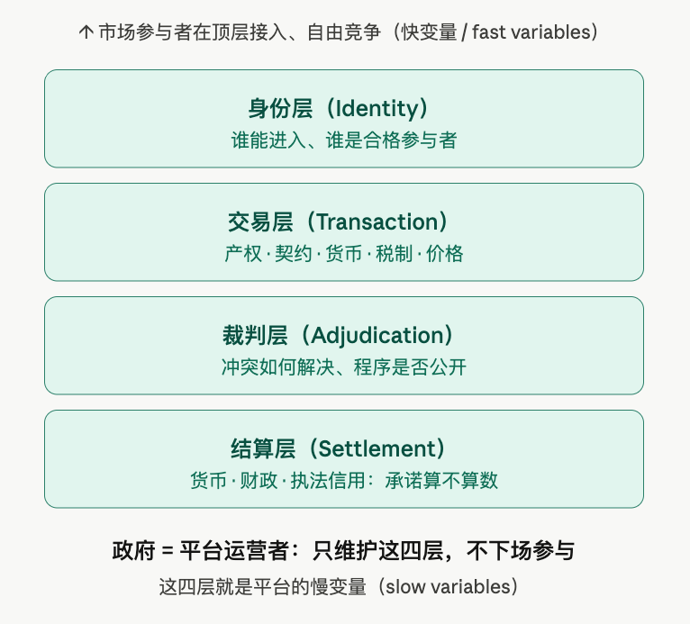
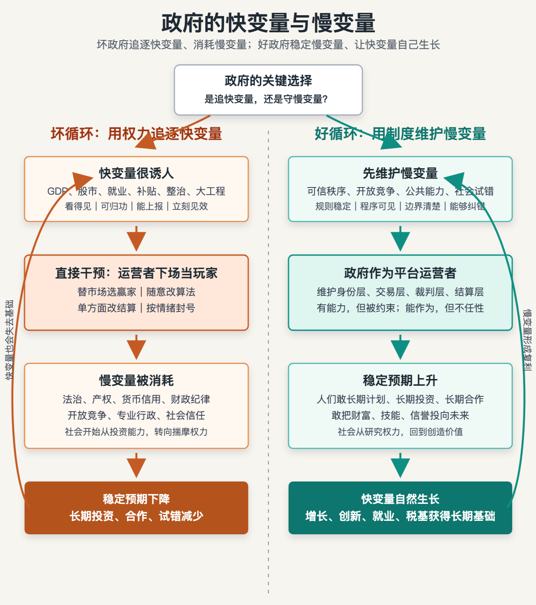
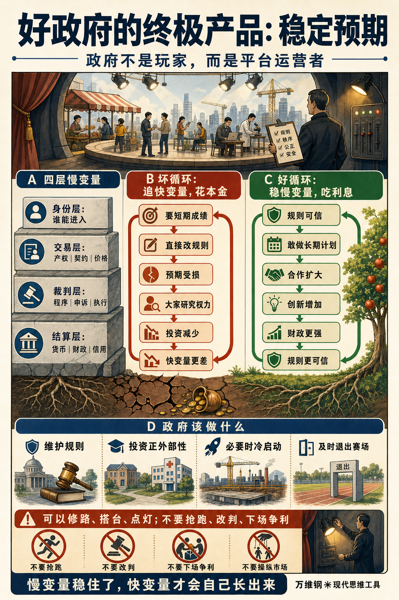

# 慢变量：政府的使命是建立稳定预期

[慢变量：政府的使命是建立稳定预期 \- 得到APP](https://www.dedao.cn/course/article?id=Mr9mzb36pP4JL5o2xnXkWqB2EYNegL)

政府是人世间最强大的力量。它可以办成很多好事，但它也可以通过寻租、软预算约束、强制可读性和非预期后果这些机制，造成坏的结果。这一讲咱们做一个思想游戏：设想一个最理想的政府，该是什么样。

政府不是好在“做什么”，而是好在“不做什么”。

咱们先切换到老百姓视角。想象你在一个电商平台上开了家店。你打磨了产品，训练了团队，积累了信誉，还攒下了一笔钱。你有几个竞争对手，但是你不怕他们。你相信只要研发出下一代产品，就能取得更领先的位置。为此你决心招兵买马、扩充产能。

可是你刚把钱投下去，平台的推荐算法变了。你的店一夜之间没了流量！原来平台老板看你们这个品类很赚钱，决定亲自下场卖同款。你想申诉都找不着门。

那你还会主动搞长期投资，研究新产品吗？你真正应该研究的是平台老板。

国家也是这样。企业家、投资人、科学家、打工人、学生，应该把注意力用于市场，而不是盯着政府。做生意 to B 也可以，to C 也可以，不能大家都去做 to G。

但是他们不能没有政府，正如电商不能没有平台。一个真心想做好事的政府，能给社会最贵的礼物，不是补贴，不是一项又一项大工程，也不是今天支持这个、明天支持那个的政策，而是一种朴素到几乎没人会把它当成政绩的东西 ——「稳定预期」。

这一讲的思维工具叫做「 慢变量 （slow variables）」。 政府的日常操作应该是维护慢变量。

✵

关于市场经济为什么比官办经济好，前人已经说过太多了，我们这个课程没必要专门讲。简单来说就是三个概念 ——

第一个是哈耶克说的「 价格信号 」：经济知识分散在无数个身处现场的人的头脑之中，任何中央计划系统都不可能代替 —— 只有用市场，才能把这些局部知识压缩成价格、利润和亏损这些可行动的信号。

第二个是熊彼特说的「 创造性破坏 」：市场允许新人挑战旧人，允许新技术替代旧结构 —— 只有这样，才能带来真正的增长。

第三个就是我们前面讲的科尔奈说的「 软预算约束 」：市场是硬预算约束，在市场经济里，失败是真的失败 —— 坏项目真的会破产，坏企业会退出，资源会被释放。

对比之下，权力却会本能地想要控制一切：它会用命令替代价格，用保护替代淘汰，甚至用财政输血把失败项目养成长期寄生物。

所以有些自由派知识分子会因为崇尚市场而反感政府。甚至有些人认为市场是自发产生的，政府插手越少越好……但事实并不是这样的。

自由派常爱讲的一个案例是十二三世纪法国的「香槟集市」（the Champagne fairs）。当时欧洲长途贸易繁荣，很多商人定期赶到法国香槟地区做大买卖。这里不靠中央计划，没有政府定价……经济学家曾经用香槟集市说明市场秩序可以靠商人法、私人法官和声誉机制自发生成。

然而那不是真实历史 \[1\]。咱们想想这个局面：你今天跟我交易，明天就回另一个城市了；我如果被骗，难道还能一路追过去吗？如果没有产权、契约、司法、货币和可信的执行，自由交易很快就会退化成捞一把就走的黑市。真实历史是香槟集市繁荣的背后有安全通行、纠纷裁判、契约执行、度量衡管理，还有香槟伯爵提供的保护。

自由市场不是凭空长出来的野草，而是一套高度精密的公共基础设施。

这就引出了「制度经济学（Institutional Economics）」\[2\]。它认为要让两个陌生人敢做交易，必须有制度的保障：市场能算账，是因为有人在背后维护着账本、合同、货币和裁判。

我们前面专门讲过平台经济，其实市场本身就是一个平台，它需要有人治理。

如果把市场，乃至整个国家想象成一个平台，那么政府就是这个平台的运营者。

任何平台的运营者都必须维护四层规则 ——

第一是 身份层 ：谁能进入，谁有资格成为参与者。

第二是 交易层 ：产权、契约、货币、税制和价格信号怎么运行。

第三是 裁判层 ：冲突如何解决，程序是否公开，申诉是否可能。

第四是 结算层 ：货币信用、财政信用、执法信用，最后的承诺到底算不算数。

这些规则，就是平台的慢变量。

✵

用加拿大生态学家克劳福德·霍林（C\. S\. "Buzz" Holling）的说法， 每个复杂系统都有快变量和慢变量 \[3\]：快变量变化快、看得见、容易被人拿来考核；慢变量变化慢、不显眼，却决定整个系统有没有「韧性（resilience）」。

\[C\. S\. Holling\]

比如一个湖，水面上有多少藻类、水质看起来清不清、鱼群数量多不多，这些都是快变量；附近流域的植被状况、湖里的物种结构、底泥里的磷含量、水体的自净能力，则是慢变量。

你可以立即向快变量要成绩，比如说用药物压下藻类，就能让湖面短期变清。但是如果慢变量没搞好，这个湖迟早又会变成浑水湖。

国家也是如此。经济增速、财政收入、就业数字、某个行业的景气程度，都是快变量；而产权、法治、信用和社会信任，则是慢变量。

维护好慢变量，那些快变量指标自动就会慢慢变好。但如果为了追求快变量而任意摆弄系统，就可能会伤害慢变量。

这就好比种地：快变量是庄稼，慢变量是土壤的再生能力。你要想这一季迅速多长点庄稼，简单的办法就是多撒些化肥 —— 可是这样一来，你就会破坏土壤结构、地下水和有机质。那么这季是长得多，以后可就长不好了。

同样道理，产权边界清楚，人才和资本才相信收益能归自己；规则连续可信，企业才敢把合同、产能和供应链安排到几年以后；裁判程序公正，陌生人之间的合作才不必完全依赖关系和拳头；货币和财政有信用，市场才敢把今天的投入和明天的回报放在同一本账上。

反过来说，如果政府为了追求某个短期指标，直接伸手操作系统，今天扶一个行业，明天压一个价格，后天改一条规则，快变量也许会一时好看，但慢变量会被损伤。

有的政府吃慢变量的利息，有的政府消耗慢变量的本金。

✵

一个最显眼的案例，就是西汉从文景之治到汉武帝时期的变化。

经历了秦末战乱和楚汉相争，西汉前期的基本国策是「与民休息」 —— 通过轻徭薄赋、减少扰动，让家庭重新稳定，让农业重新恢复，让财政重新积累，让民间相信明年大体还会按今年的规则生活。文景之治是不性感、没激情、没有宏大叙事的统治，政府极为克制。

结果几十年下来，快变量也自然变好：户口增加，税基扩大，国库充实，粮仓丰盈，商业流动活跃。

武帝登基时接手的，是文景两代攒下的家底。

而如果你手握强大的力量，你会有强烈的冲动想要使用这个力量。

现在一提汉武帝的丰功伟业，都是北击匈奴、封狼居胥、河西四郡、张骞通西域……这些的确了不起，但是这些要花很多很多钱。而且政府一旦开始花钱就会收不住手，连不该花的钱也要花。正常的汲取手段远远不能支撑武帝的野心，于是政府把手伸向资源、价格、流通和民间财富 ——

货币政策上，国家一会儿推出白鹿皮币、一会儿又是白金币，货币信用被反复折腾，民间不知道手里的钱明天还算不算钱。

税收政策上，算缗（向商人征收财产税）、告缗（举报他人财产分一半）直接瞄准民间财富，商人的产权预期被打穿。

产业政策上，盐铁官营、酒类专卖，把原本可以由民间经营的行业收归国家，政府亲自下场做最大的商人。

价格政策上，均输、平准由国家买进卖出，号称是调节物价，实际上价格不再只是供求信号，还要服从国家财政和战争需要。

劳役兵役上，大量人口被抽离生产，家庭原本连续经营的计划被随时打断。

司法和产权上，酷吏政治和告发机制让人们不再只担心市场失败，还要担心政策失败、关系失败、站队失败……

这些本质上都是把国家的信用给变现。短期看，财政有了钱；长期看，慢变量和稳定预期被消耗殆尽。结果必然是连表面的财富也会失去。

《汉书·食货志》说，武帝初年是「民人给家足」，府库充实；后来却成了「功费愈甚，天下虚耗，人复相食」。《汉书·昭帝纪》更说，武帝留给昭帝的是一个什么局面？「海内虚耗，户口减半」。

可能有人说，为了帝国的基业，老百姓付出再大的牺牲也是值得的。真的值得户口减半吗？匈奴在文景时期就不断骚扰边疆，但他们对帝国并不构成绝对的安全威胁。用御史大夫韩安国的话说：「千里而战，兵不获利。今匈奴负戎马之足，怀禽兽之心，迁徙鸟举，难得而制也。得其地不足以为广，有其众不足以为强……击之不便，不如和亲。」当然咱不是说和亲好，但是大汉完全可以积极防御，而不是向漠北消耗大军。

而且，真的是为了帝国的基业吗？从《史记·封禅书》《平准书》《汉书·贡禹传》的记载看，武帝花在战争以外的钱，甚至直接花在自己身上的钱，包括宫室、巡幸、封禅、求仙、陵寝和宫廷工坊，绝不是零星浪费，而是另一条长期财政失血线。中大夫汲黯曾经当面说武帝「内多欲而外施仁义」，可谓是精准的批评。

现在一说起秦皇汉武，已经成了很多人心目中中国的骄傲 —— 但是他们同时代的人，从直系子孙到官僚集团，再到平民百姓，可都没有说他们好的。

简单说，武帝的伟业，不但是从文景之治的积累中提款，而且是把家底都给卖了。文帝、景帝要是在天有灵，肯定会说武帝是个败家子。

✵

西方也有类似的教训 ——

公元 301 年，罗马皇帝戴克里先为了压住通胀和社会不满，颁布《最高限价敕令》，强行给上千种商品和工资封顶，结果商品转入黑市，供应反而消失，敕令很快失效。

1557—1596 年，西班牙国王腓力二世为了支撑哈布斯堡帝国的连年战争，多次宣布暂停偿债、重组国债，结果王室信用被反复打折，欧洲金融家开始重新给西班牙定价。

1971 年，美国总统尼克松为了压住通胀、稳住短期民意，实行工资和价格冻结，结果账面通胀一时被按住，价格信号却被扭曲，短缺和后续通胀反弹随之而来。

2022 年，英国特拉斯政府为了快速刺激增长，推出缺少可信财政背书的“迷你预算”和大规模减税，结果英镑和英国国债市场剧烈震荡，养老金系统险些被击穿，英国央行被迫出手救市……

倒是后世的中国统治者，都把汉武帝当成反面榜样，吸取了教训。

比如王安石变法帮政府汲取资源，他同时期的人立即意识到其中的危险。司马光、韩琦骂王安石“征利”“兴利”，王安石一听就明白是什么意思，赶紧辩解说：如果像（帮汉武帝理财的）桑弘羊那样“笼天下货财以奉人主私欲”，那才叫兴利之臣；我这是抑兼并、救贫弱，怎么能叫兴利之臣呢？

可是“桑弘羊”这个标签一出来，王安石就已经洗不清了。他自己也成了标签。后来张居正为大明敛财，就有人骂他像王安石。

大清总结历代兴亡教训，货币政策直接就是白银本位，连财政工具都不用，力求做个小政府。康熙朝甚至直接宣布“盛世滋生人丁，永不加赋”……此后大清哪怕是面对太平天国战乱，哪怕是支付赔款，也只是寻求盐课、关税、厘金、借款，甚至卖官鬻爵 —— 都不敢突破地丁钱粮定额。

因为只要你读过历史，你就太知道快变量的诱惑和慢变量的重要性了。

✵

政府到底应该办多少事？学者们各有各的说法。

有的人主张 \[4\]，政府只要维护好慢变量，提供一个低熵的运营环境就可以。可能更多学者会认为政府还应该去做那些市场自己做不好的事 —— 比如教育、医疗、基础科研、公共卫生、基础设施、环境保护、标准制定等等 —— 这些事的特点是有着巨大的正外部性，但由于缺乏良好的短期利润，市场往往动力不足。

还有学者，比如意大利裔、现执教于英国的经济学家玛丽安娜·马祖卡托（Mariana Mazzucato）认为 \[5\]，政府还可能“塑造和创造市场”。像互联网、GPS、触摸屏、语音识别等等技术在最早期都不是由私人资本单独冒险做出来的，而是由国家用科研经费、军工项目、大学体系、公共采购和长期耐心资本先把路铺出来。

还有学者认为，后发国家要单纯靠市场实现工业化可能比较难，因为既没有资本也没有很好的企业 —— 那么政府就应该亲自下场，搞一些投资，甚至直接办工厂，作为冷启动 \[6\]……你要下场当球员也不是不行，前提是球场还不存在。

我相信这些都是可以的。但这里的关键是不管你怎么搞，政府首先必须是慢变量的建设者，而不能是破坏者。

一个非常反直觉的规律是：如果政府能尊重慢变量，不搞横征暴敛，它的战争能力其实不会减弱，反而会增强 \[7\]。

比如 1688 年光荣革命之后，英国通过一系列制度安排限制王权任意征税、没收和违约的能力，国王被关进了笼子，但国家并没有变弱！英国政府反而能以更低利率借到更多的钱，在税收之外又打开了公共信贷这条大动脉 \[8\]。

其实民间总是有很多剩余财富，关键是用什么手段让这些资金为政府所用。如果你的办法是强征或者滥发货币，你就伤害了慢变量，人们就会停止投资和生产活动，经济就毁了；而如果你是借债，创造财富的活动就会继续，打完仗大家还可以好好过日子。

二者的区别就在于，债主们是否相信这个政府会遵守财产和债务契约。

一个受限制、不能赖账的政府，反而是一个更有力量的政府。

✵

最早提出政府应该保护“慢变量”的，可能还是中国人。

老子《道德经》说「我无为而民自化」，不就是说平台的责任是慢变量，应该把快变量留给老百姓吗？

说「夫唯不争，故天下莫能与之争」，不就是说平台的运营者，不应该跟平台的参与者争吗？

说「非以其无私邪？故能成其私」，不就是说受限制的政府，反而是更有力量的政府吗？

「无为而治」的本意，不是政府什么都不做，而是政府守住自己的层级：不与民争利，不与商争业，不以裁判身份下场经营，不用权力改写价格信号，不把社会的试错空间和自我演化能力收归自己。

政府不应该是舞台上的主角。它应该是剧场里的灯光、消防、秩序、声学和安全出口。

没有它戏就演不下去。但观众不会天天注意它。

注释

\[1\] Jeremy Edwards \& Sheilagh Ogilvie, “What lessons for economic development can we draw from the Champagne fairs?” Explorations in Economic History, 2012\.

\[2\] North, Douglass C\. “Institutions\.” Journal of Economic Perspectives 5, no\. 1 \(1991\): 97–112\.

\[3\] Walker, Brian, C\. S\. Holling, Stephen R\. Carpenter, and Ann Kinzig\. "Resilience, Adaptability and Transformability in Social–Ecological Systems\." Ecology and Society 9, no\. 2 \(2004\): art\. 5\.

\[4\] 比如说，George Gilder, Knowledge and Power: The Information Theory of Capitalism and How It Is Revolutionizing Our World \(Regnery Gateway, 2013\)\. 另见《精英日课》第五季， 《后资本主义生活》5：低熵的舞台

\[5\] Mazzucato, Mariana\. The Entrepreneurial State: Debunking Public vs\. Private Sector Myths\. London: Anthem Press, 2013\.

\[6\] Gerschenkron, Alexander\. Economic Backwardness in Historical Perspective: A Book of Essays\. Cambridge, MA: Belknap Press of Harvard University Press, 1962\.

\[7\] 徐瑾，《货币简史：从贝壳金银到数字货币》（2024）。另见《精英日课》第六季： 货币是信用的游戏

\[8\] North, Douglass C\., and Barry R\. Weingast\. “Constitutions and Commitment: The Evolution of Institutions Governing Public Choice in Seventeenth\-Century England\.” Journal of Economic History 49, no\. 4 \(1989\): 803–832\.

1\.政府的日常操作应该是维护慢变量。
2\.如果把市场，乃至整个国家想象成一个平台，那么政府就是这个平台的运营者，都必须维护四层规则：身份层、交易层、裁判层、结算层。这些规则，就是平台的慢变量。
3\.每个复杂系统都有快变量和慢变量：快变量变化快、看得见、容易被人拿来考核；慢变量变化慢、不显眼，却决定整个系统有没有「韧性」。

