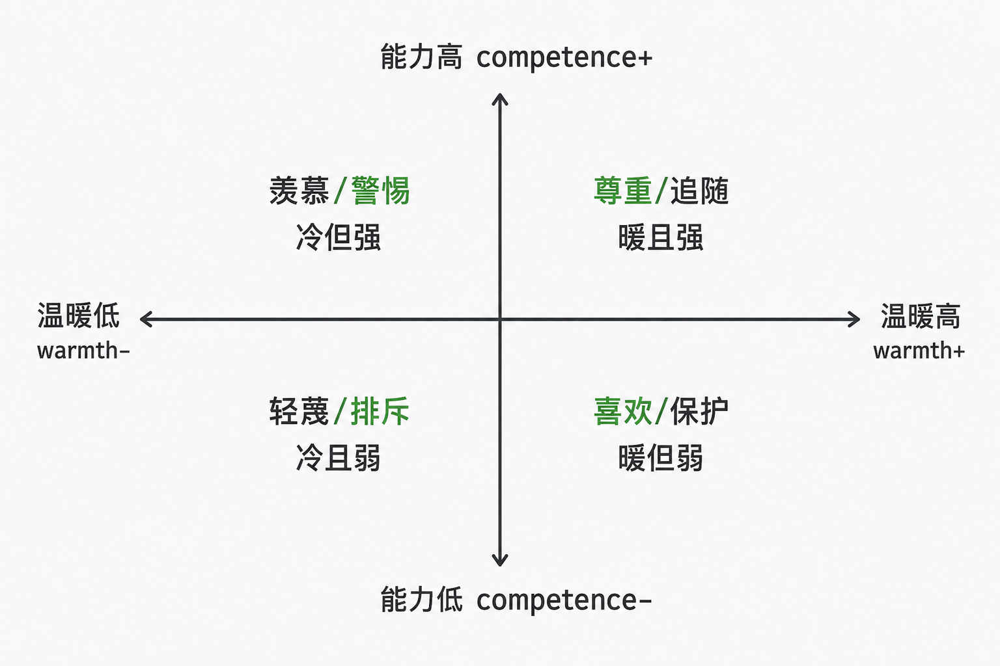

# 地位：社会参与的第一性原理

[地位：社会参与的第一性原理 \- 得到APP](https://www.dedao.cn/course/article?id=A5eO3NDrGk8KP0omejK2oxp9MRBzQP)

这一讲开始咱们进入「社会与经济」模块。但我们不是宏观视角，我们设想你是一个参与者。

不管你是刚毕业的新人还是职场老油条，又或者只想享受家庭生活，在当今世界，你都不可能一个人闭门炼丹。你必定要参与这红尘大阵，你要跟人协作、组队、交易、竞争，甚至争斗，你需要一点经济学思维，你需要理解社会。

这一讲咱们先说一个观察社会的隐秘指标，它隐秘却极其重要，我愿称之为社会参与的第一性原理，那就是「 地位 （Social Status）」。

一群人聚在一起聊天互动，如果你不能在五分钟之内分辨出在场谁地位高、谁地位低，你恐怕不是一个合格的灵长类动物。

那你说凭什么地位是第一性原理？人最想要的难道不是金钱、权力、安全、自由、真理和意义吗？那些东西的确比地位更基本，但往往只有当你面对自己，或者身处比如说经济困顿的极端情况的时候才显得格外重要。在日常的社会参与中，可能你自己都未必直接感受到，你会不自觉地在意地位。

比如说夫妻吵架。晚上十点，妻子发现客厅里搁着半杯牛奶，地上扔着两只袜子，就开始抱怨：“你就不能顺手收一下？”丈夫立即反击：“我忙了一天那么累，好不容易安抚好客户，怎么回家还要被你骂？”妻子怒了：“这不是你的家吗？”

你说这真的是在争论谁该做那点家务吗？其实两人争的是家庭主导权。妻子想通过让丈夫分担一点家务来证明自己不只是个做全职家务的。而丈夫听到的却是：“我在外面拼命打怪，回来都没有一个英雄该有的特权，难道我就是个力工吗？”

再看职场。周会上，年轻的产品经理提议：“这事可以接入 AI 大模型，用 Gemini 3 就行，咱们的效率绝对起飞。”老派主管眉头一皱：“大模型不可控，以前也不是没试过，不行。”年轻人头铁：“以前不行不代表现在不行，实在不行可以上 GPT\-5\.5，啥都能干！”主管脸色铁青：“你先把基础业务逻辑摸透再来教我怎么做事！”

你说这是在探讨技术路线吗？两人其实是在争夺团队的认知解释权。

表面上的观点之争、品味之争、效率之争，甚至利益之争、正义之争，背后往往是地位之争。人在社会上的种种行为动机都带有追求地位的色调。

地位，是社会对你的主观估值。 它是别人愿意在多大程度上把你的话当真，进而把你的利益纳入共同体考量。我年少无知的时候曾经认为一句话的对错是客观的，它是谁说的完全不重要 —— 现在我意识到，谁说的，往往是这句话好使不好使唯一重要的因素。

说白了，地位就是在别人心里，你到底算老几。

✵

你可能想不到，社会心理学家关于地位的研究是最近一二十年才变得热门。可能以前人们都觉得这是一个有点尴尬的话题，避而不谈。学术界当前的共识 \[1\] 是， 地位是一个人被他人尊重、钦佩和自愿让步的程度；追求地位是一种极其基础的人类动机。

关键词是「他人」和「自愿」：不管你怎么追求，你的地位都不是由你 —— 而是由他人决定的。一切的悖论和麻烦就在这里。

你想要钱，至少可以攒钱；你想要好身材，至少可以锻炼。唯独地位，不是你自己追求就能得到的；有时候你越是追求，反而越得不到。

可是我们真的很在意地位。美国心理学家马克·利里（Mark Leary）提出一个「社会计量器理论（sociometer theory）」\[2\]，认为所谓「自尊（self\-esteem）」，其实是我们大脑里的一个雷达仪表盘，它在时刻监测自己的地位，评估自己是否在人群中被接纳，还是面临被踢出局的风险。

这个仪表盘的读数会强烈影响你的自我感受。

比如说，羞耻不是“因为我做错了”，而是“我在别人心中的价格暴跌”。骄傲不是“因为我成功了”，而是“我的社会估值得到了确认”。愤怒常常不是因为“我的利益受到损失”，而是“你凭什么调低我的评级？！”

如果一个人正在为社会排名降低而焦虑，你很难让他“想开点”。早就有研究表明，人如果长期感到自己不被承认、没有价值，生理机能就会被推入一种充满皮质醇的慢性压力状态，以至于损害健康指标 \[3\]。低社会排名感甚至与抑郁症状、自杀的意念和自伤的风险之间都存在系统性的强关联 \[4\]。

这就是为什么那些总统、高官在位的时候一个个都红光满面，只要一下来，身体和精神就会迅速崩塌。很多人说这叫“权力是最好的春药”，但如果你仔细辨别，你会发现那不是权力，那是地位。你看那些明星都没有权力，但只要地位在就必定精神焕发。说什么“大丈夫不可一日无权，小丈夫不可一日无钱”，其实没权也行，没钱也行，但是不能没地位。

✵

一个特别有意思的性质是： 地位永远是相对于你周围的人的，你并不在乎不相干的人比你高还是比你低 —— 地位看的是相对位置，而不是绝对水平。

比如你年收入 100 万，这放在全国来说绝对是非常高的收入，可以说很富裕。可是你的幸福感更多地不是由绝对收入，而是由你在自己的亲友、在居住的小区的相对排名所决定的 \[5\]。如果你周围都是一些富豪，他们谈论的都是你未曾拥有的资产，你可能还是会感到很焦虑。

学术界称之为「本地阶梯效应（local\-ladder effect）」\[6\]：人的地位感来自面对面小群体、在意的小圈子里的尊重和钦佩。

所以地位不是温度计，而是排行榜。这就是为什么很多人宁做鸡头不做凤尾。而且事实上做鸡头比做凤尾更有利于你的成长 —— 包括能力本身的成长。

举个例子，咱们设想有两个中学生：第一个学生的数学绝对实力是 90 分，但他是在一个普通中学读书，数学考试常年排第一；第二个学生的绝对实力是 95 分，但他身处一所著名中学的天才班，周围全是高手，自己只排在中下游。那么请问，这两个孩子将来谁更有可能在数学相关领域发展？

答案是第一个孩子。他的优势地位带来一个强烈的“我是数学天才”的自我暗示，形成正反馈效应，激励他去继续钻研数学。而第二个孩子虽然其实更擅长数学，但是地位常年被数学打击。

这是有研究证据支持的。2020 年的一篇论文就专门调查了“班级第一的重要性”，发现一个人长大后是否从事某个专业，跟他本人的绝对水平关系并不大，真正起作用的是他在班级里的「同辈排名（Ordinal Rank）」\[7\]。

平台给你资源，但地位叙事给你动力。你在地位坐标上的位置决定了你对世界的体感。

这真是人世间一个残酷的设定。要知道坐标之争必定是零和的。科技再发展，社会再富裕，全班排第一的那个位置上也只有一个人。

✵

如果你班级排名不是那么好，这里有一个好消息：考试成绩并不能直接决定一个人在群体中的地位。有的尖子生只会学习，未必真的得到同学和老师的认可，如果成了“做题家”，发展空间恐怕也有限。

怎样才能真正成为一方豪杰、本地达人呢？

过去二十多年间，演化人类学家约瑟夫·亨里奇（Joseph Henrich）等人提出一个经典理论 \[8\]\[9\]，说 争取地位有两条截然不同的途径： 一个是「支配（dominance）」，一个是「声望（prestige）」。

支配型地位靠的是权力、资源和恐惧。比如高级官员、黑道大哥和那些通过重奖重罚彰显权威的霸道总裁。你听他的是因为你怕他。

声望型地位靠的却是能力、知识和慷慨。别人愿意听你的是因为你的判断经常正确，跟着你能学到真本事，而且你经常给集体做贡献。人们不但由衷地尊重你，而且想要模仿你。

声望是一片引力场，支配是一口高压锅。理想情况下我们应该追求声望型地位。

那你说，声望这么好，为什么还有那么多人执迷于寻求支配呢？因为支配型地位也有自己的生态位。当局面危急、混乱和不确定的时候，人们会本能地呼唤“强人”\[10\]，想要一个独断专行力排众议的统帅，相信唯有支配能高效解决问题。

所以支配可以说是一种战时模式。今天我们生活在和平之中，对支配很不舒服 —— 但是人类历史上大部分时间就是处在危急、混乱和不确定之中，导致我们的支配本能明显强于声望本能。明明只是讨论个产品需求，这位领导非要搞得像黑帮火并；明明是团队协作，他非要搞服从性测试。有的人以为自己在扮演铁血统帅，其实不过是个令人窒息的办公室土皇帝。

你最好克服那个支配本能，走向「声望」。一个颗粒度更高的理论是这样的： 当你想要提高地位的时候，你需要考虑两个维度：「能力（competence）」和「温暖（warmth）」\[11\]：能力是你的本事，温暖是你的意图。 它们构成一个二维直角坐标系 ——

**能力高、温暖高 **：这是声望型地位。人们尊重你、亲近你，并且自愿追随你。

**能力高、温暖低 **：这是或多或少的支配型地位。人们羡慕你，但同时也警惕你，你的在场对他人是一个威胁。

**能力低、温暖高 **：人们会觉得你是个好人，但不信任你能做成事，所以不会给你多少地位。

**能力低、温暖低 **：这种人会被社会边缘化。

我想特别提醒你注意“能力高、温暖低”这个象限。很多聪明人在社会上到处碰壁，就是因为他们位于这里。今天降维打击这个明天智商碾压那个，每次都能赢得辩论，但长期看，你被移出了群聊。

其实奢侈品的温暖也很低 \[12\]。团队聚会，你一身名牌出场，传达一个信号就是“我比你们贵”。这的确是一种地位展示，但你等于是在自己和他人之间建立了一道屏障，别人会觉得你冷漠不好亲近。

记住，既要展示能力，更要展示善意。否则你收获的只是防御而不是声望。

✵

你看出来没有？地位这个游戏有强烈的「二阶效应（second\-order effect）」。一阶效应是每个人都想追求地位，但二阶效应是，在接收方，人们不喜欢你那些支配型的操作。

可是你往往只考虑到一阶，而没有考虑到二阶。

有的人对下属颐指气使，还洋洋自得，殊不知危险已经不远了；有的人把自己弄得珠光宝气，却不知在别人眼中那个形象很土。你再想想自己早年发过的那些尴尬的朋友圈……

在每一次社交互动中，你很关心自己是不是被看见了、自己的地位是否稳固 —— 但别人也很关心他的地位是不是被你看见了，他的地位在你这里是否稳固。我们必须建立这种二阶思维，充分考虑别人的感受，才能在社会上顺畅行走。

核心心法只有一句： 永远不要无故做空别人的地位。 可能你只是无意间做空，可是对他人却是巨大的伤害。

婚姻专家约翰·戈特曼（John M\. Gottman）早就有研究发现，要从一对夫妇的互动模式中判断他们未来是否可能离婚，批评、防御和冷战都属于危险信号 —— 但是最危险的，是「蔑视（contempt）」\[13\]：如果一方已经在蔑视另一方，那这段关系基本上就算完了。

蔑视是对对方地位的公开处刑。没事儿千万不要如此，你很难得到原谅。

不但不要蔑视，而且也不要让人难堪。这意味着不要当众指出他人的错误，想纠错最好私下交流。

✵

你说我不打击别人的地位，可如果别人打击了我的地位，我该怎么办呢？你可以展示自己的地位，但这里有个更重要的忠告，那就是不要陷入地位饥饿。

地位饥饿的人是丑陋的。别人提个不同意见他就觉得被冒犯；他不放过任何一个打压新人的机会；他把任何动作都变成了一场表演；他可能拼命讨好上级；也可能索性从社交中退出。

那是一种极度的不安全感。然而这里的悖论是，地位饥饿只会让人更没有地位。

你要知道 地位是个副产品：地位是他人对你的估值，这个估值可能波动，可能被误判，那不是你能决定的。

你能直接追求的是能耐和贡献。你无法直接抓住地位，但你可以成为一个值得拥有地位的人。

✵

咱们中国是个熟人社会，面子和地位的权重可能就更大。有人调侃说哪怕霍金来中国也得站起来给领导敬酒 —— 其实不至于。但现实是，即便他是霍金，而且不管在哪一国，他都得尊重别人的地位。

因为打击地位对人的伤害实在太大了。

这不是市侩，这是慈悲。

谦卑的我，只能讲出这些逻辑；而聪明的你，必然会有更深的感悟。

注释

\[1\] Anderson, Cameron, John Angus D\. Hildreth, and Laura Howland\. “Is the Desire for Status a Fundamental Human Motive? A Review of the Empirical Literature\.” Psychological Bulletin 141, no\. 3 \(2015\): 574–601\.

\[2\] Leary, Mark R\., Ellen S\. Tambor, Sonja K\. Terdal, and Deborah L\. Downs\. “Self\-Esteem as an Interpersonal Monitor: The Sociometer Hypothesis\.” Journal of Personality and Social Psychology 68, no\. 3 \(1995\): 518–530\.

\[3\] Zell, Ethan, Jason E\. Strickhouser, and Zlatan Krizan\. “Subjective Social Status and Health: A Meta\-Analysis of Community and Society Ladders\.” Health Psychology 37, no\. 10 \(2018\): 979–987\.

\[4\] Wetherall, Karen, Kathryn A\. Robb, and Rory C\. O’Connor\. “Social Rank Theory of Depression: A Systematic Review of Self\-Perceptions of Social Rank and Their Relationship with Depressive Symptoms and Suicide Risk\.” Journal of Affective Disorders 246 \(2019\): 300–319\.

\[5\] Tan, Jacinth J\. X\., Michael W\. Kraus, Nichelle C\. Carpenter, and Nancy E\. Adler\. “The Association Between Objective and Subjective Socioeconomic Status and Subjective Well\-Being: A Meta\-Analytic Review\.” Psychological Bulletin 146, no\. 11 \(2020\): 970–1020\.

\[6\] Anderson, Cameron, Michael W\. Kraus, Adam D\. Galinsky, and Dacher Keltner\. “The Local\-Ladder Effect: Social Status and Subjective Well\-Being\.” Psychological Science 23, no\. 7 \(2012\): 764–771\.

\[7\] Murphy, Richard, and Felix Weinhardt\. “Top of the Class: The Importance of Ordinal Rank\.” The Review of Economic Studies 87, no\. 6 \(2020\): 2777–2826\.

\[8\] Henrich, Joseph, and Francisco J\. Gil\-White\. “The Evolution of Prestige: Freely Conferred Deference as a Mechanism for Enhancing the Benefits of Cultural Transmission\.” Evolution and Human Behavior 22, no\. 3 \(2001\): 165–196\.

\[9\] Cheng, Joey T\., Jessica L\. Tracy, Tom Foulsham, Alan Kingstone, and Joseph Henrich\. “Two Ways to the Top: Evidence That Dominance and Prestige Are Distinct Yet Viable Avenues to Social Rank and Influence\.” Journal of Personality and Social Psychology 104, no\. 1 \(2013\): 103–125\.

\[10\] Kakkar, Hemant, and Niro Sivanathan\. “When the Appeal of a Dominant Leader Is Greater Than a Prestige Leader\.” Proceedings of the National Academy of Sciences 114, no\. 26 \(2017\): 6734–6739\.

\[11\] Fiske, Susan T\., Amy J\. C\. Cuddy, and Peter Glick\. “Universal Dimensions of Social Cognition: Warmth and Competence\.” Trends in Cognitive Sciences 11, no\. 2 \(2007\): 77–83\.

\[12\] Cannon, Christopher, and Derek D\. Rucker\. “The Dark Side of Luxury: Social Costs of Luxury Consumption\.” Personality and Social Psychology Bulletin 45, no\. 5 \(2019\): 767–779\.

\[13\] Gottman, John Mordechai\. 1994\. What Predicts Divorce? The Relationship Between Marital Processes and Marital Outcomes\. Hillsdale, NJ: Lawrence Erlbaum Associates\.

1\.地位：地位是一个人被他人尊重、钦佩和自愿让步的程度；追求地位是一种极其基础的人类动机。不管你怎么追求，你的地位都不是由你 —— 而是由他人决定的。
2\.地位永远是相对于你周围的人的，你并不在乎不相干的人比你高还是比你低 —— 地位看的是相对位置，而不是绝对水平。
3\.争取地位有两条截然不同的途径：一个是「支配」，一个是「声望」。你最好克服那个支配本能，走向「声望」。当你想要提高地位的时候，你需要考虑两个维度：「能力」和「温暖」：能力是你的本事，温暖是你的意图。

