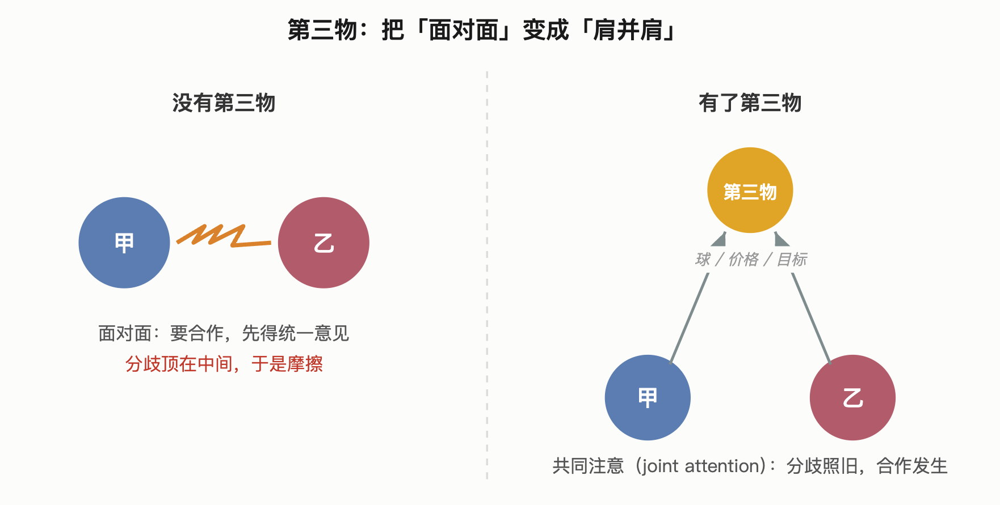
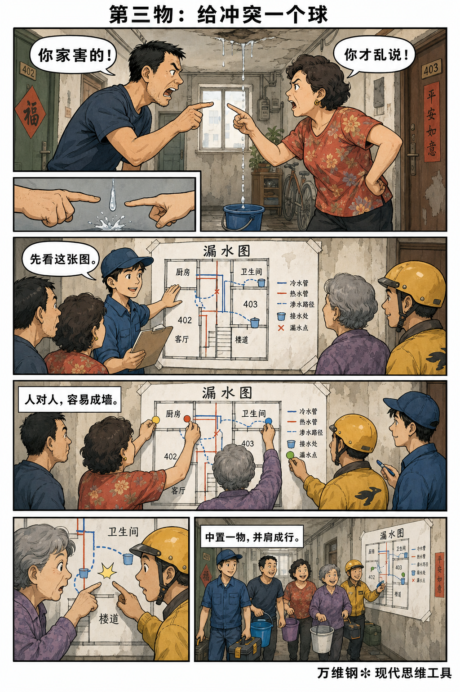
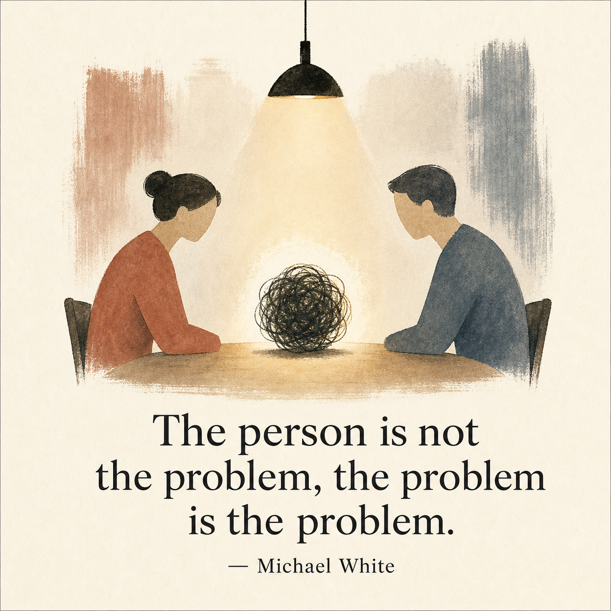
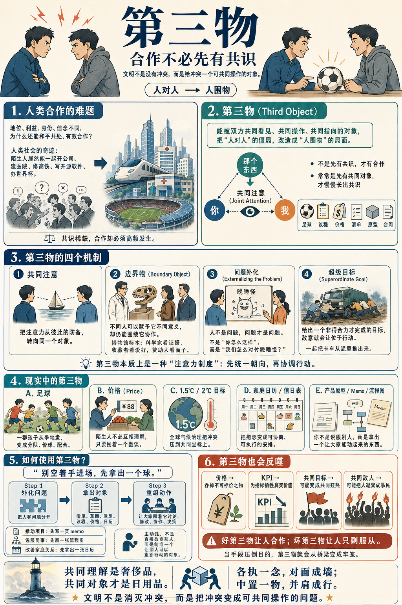

# 第三物：合作不必先有共识

[第三物：合作不必先有共识 \- 得到APP](https://www.dedao.cn/course/article?id=qzNakylrn9WVaZWMg0J7DOop10vZwL)

我们这个社会系列讲了这么多，其实一直在研究一个既古老又现代的问题：人与人的地位、利益、身份、信念各不相同，怎么还能和平共处、有效合作呢？

你难道不觉得人类社会是个奇迹吗？一群陌生人，不互相伤害就不错了，居然还能开公司、建医院、修高铁、写开源软件、办世界杯……

我们讲了礼、激励相容、共同知识等等促成合作的机制，也讲了柠檬市场、外部性和摩洛克等等让合作失灵的机制，还讲了可读性和非预期后果这些人类为了合作而付出的代价。

最后这一讲咱们不搞那么多反思，直接说个能简单有效地促成合作的方法。这个方法可能你早就在用了，只是很少有人道破，属于“百姓日用而不知”的智慧。

想象一群孩子在空地上争地盘。甲说：“你凭什么站这里？”乙说：“这是我的地方。”丙开始拉帮结派，丁已经在找砖头。眼看一场儿童版地缘政治危机就要爆发。

这时候一个孩子从书包里拿出一个球，说：“踢吗？”于是奇怪的事情就发生了。

刚才还互相瞪眼的人，开始分队、定边线、传球、配合、防守、为自己的球队争胜负。

这群孩子没有解决掉他们原来的任何一个分歧，没分出对错，谁也不服谁。然而他们直接就开始了非常有序的合作。

这个球，就是我们这一讲的思维工具。我们称之为「 第三物 （third object）」，意思是能被双方共同看见、共同操作，从而把“人对人”的直接僵局，改造成“人围物”的共同局面的东西。

✵

可能很多人以为，要想合作，就必须先达成共识。你得先发挥影响力、说服力，做思想工作，让对方跟你互相理解，最好价值观一致、思想统一、情绪到位，甚至彼此喜欢，才能共事……可现实中哪有那么多共识呢？

其实我们这个物种的生存本能，并不是大家都先想通了再合作。

要想促成合作，你只需要一种特别简单的“注意力机制”。

心理学家发现，人类的婴儿还不会说话的时候，就已经有了一种很了不起的能力，叫「共同注意（joint attention）」\[1\]：妈妈指着一个东西，比如说一朵花，让宝宝看 —— 宝宝立即就知道妈妈想让他注意这个东西，而且知道妈妈也在注意这个东西。如果此时妈妈正在教宝宝说话，发出“花”的声音，宝宝就知道意思是这个东西叫做“花”。

之前不需要有语言交流，不需要讲道理，只要两个人一起指向一个东西，合作就有了根基。语言、教学、模仿，都是从「你 → 那个东西 ← 我」这个三角关系里长出来的。人类不是先有了共识才合作，而是先能够一起盯住同一个东西 —— 一个「第三物」—— 才慢慢长出共识的。

你体会一下。两个人要是只能互相盯着，关系是绷着的 —— 人盯着人，盯出来的是警觉、打量、比较和防备。可只要两个人同时看向第三个东西，那股绷着的劲儿就放松了：我们可以一起研究它，一起摆弄它，一起对它负责。

这个本能，在人长大以后，就变成了一整套社会技术。

1989 年，加州大学的两位研究者，社会学家苏珊·斯塔（Susan Leigh Star）和科学哲学家詹姆斯·格里斯默（James R\. Griesemer）发表了一篇关于加州大学伯克利分校脊椎动物博物馆的论文 \[2\]，可是这篇论文提出的思想却是比博物馆大得多。

他们发现，在这座博物馆里一起干活的人 —— 专业的科学家、业余的标本收藏者、出钱的赞助人、还有管行政的 —— 对“一只标本到底意味着什么”，理解完全不同。科学家看到的是证据，收藏者看到的是爱好，赞助人看到的是面子，行政看到的是档案。可他们偏偏就能协作得很好。

为什么呢？靠的就是那些标本本身。别管你是怎么理解它的，只要你可以拿它来做自己的事儿，那么你就可以指着它跟人协作。

斯塔和格里斯默把这种对象叫「边界物（boundary object）」：它既可以让不同群体各取所需，又可以在不同的社会世界之间保持共同身份。

边界物作为一个学术概念，原始语境主要是解释不同社会世界中的人如何在不完全共识下协作。我们把这个概念扩大一下，不管促成的是协作还是竞争，只要能把人对人的僵局，变成人围绕着一个对象的局面，就叫“第三物”。

要点是合作不一定需要共识。其实中国人讲「和而不同」，不就是这个意思吗？

共同理解是奢侈品，共同对象才是日用品。

✵

一旦你认出了第三物，就会发现它无处不在。

比如说， **价格 **就是市场中的第三物。卖家觉得自己的东西值一千，买家只想出六百。这两个人可以来自完全不同的世界 —— 你不必喜欢跟你交易的那个人，不必认同他的活法，不必搞懂他的童年，更不必在价值观上跟他对齐。你们只需要围着一个数字来回挪：八百？七百五？只要你们能在某一个价格上同时点头，交易就发生了。

这就是市场的伟大之处：它不是让人类变得高尚，而是让不够高尚的人也能合作。

哈耶克（F\. A\. Hayek）有个著名的洞见：价格是传递分散知识的信息机制。每个人都只知道自己身边的一点点情况，可是价格能把稀缺、需求、风险、替代品、预期等等的信息压缩成一个数，就让陌生人各自调整行动 \[3\]。

比如金属锡突然短缺。你不需要知道是哪个矿出了事故，也不需要开全球供应链大会。锡价上涨，使用锡的人就会自动节约或者寻找替代品，生产者就会自动增加供给。无数陌生人没有互相解释，却因为同一个价格一起动了。

只要有个“数”就行。你看两个黑帮再剑拔弩张，只要有个数可以讲，双方就能坐下来谈。

再比如说 **全球气候治理 **。将近两百个国家，发展阶段不同，利益相反，我说你们发达国家得多承担责任，你说我是人口大国必须减排，怎么谈？《巴黎协定》把这一整团乱麻硬压到了一个数字上：务必把全球平均气温的升幅，控制在比工业化前水平高 2 度以内，力争 1\.5 度之内。

有了这个数，各国就可以围绕它争论、承诺、讨价还价，大家就有的放矢。

第三物让问题变得可比较、可谈判、可追踪。第三物先把价值冲突变成共同坐标，人们就能再把共同坐标变成可执行的动作。

一份会议议程，一个 KPI，一张报价单，一份合同，一个产品原型，一张家庭值日表……任何能“摆到台面上”的东西，都可以是「第三物」。

✵

第三物特别能避免冲突，这里有个机制叫「 问题外化 （externalizing the problem）」。

你肯定有过这样的体验：两个人一较劲，话题很快就从“这件事该怎么办”，滑到了“你这个人怎么这样”。可是一旦滑到这一步，局面就不可挽回了，因为对方会立刻进入防御，开始辩解、反击、翻旧账。

心理治疗里有一派叫「叙事疗法（narrative therapy）」\[4\]，要求咨询师把“人”和“问题”分开：不是把来访者看成有问题的人，而是帮助他把问题从自我身份里拿出来，摆到面前，像观察一个外部对象那样观察它。

叙事疗法代表人物迈克尔·怀特（Michael White）有句名言： **「人不是问题，问题才是问题。」**

一旦你把问题从人身上摘出来，放在桌面上，冲突双方就不再互相审判，而是共同面对一个被外化出来的第三物。

比如说，孩子老是磨磨蹭蹭不肯睡觉。你的本能是冲他吼：“你怎么天天这么拖拉？”话一出口孩子就成了被告，他唯一能做的就是自卫，要么顶嘴，要么沉默、玩手机。

问题外化要求你换个说法：“来，咱俩研究研究，这个‘晚睡怪’一般几点钟冒出来？它都使些什么招儿拖住你 —— 是手机吗？”就这么一改，那个磨蹭的毛病从孩子身上被拆下来了，变成了桌上一个你俩可以一起对付的东西。孩子变成了和你并肩作战的侦探。

这就是人们常说的「不是你面对孩子，而是你和孩子共同面对问题」。

「把人和问题分开（separate the people from the problem）」也是谈判学里的头号原则 \[5\]。只有如此，谈判双方才能关注利益而不是立场，从而创造互利选项，使用客观标准。

低水平谈判是：你不讲理。

高水平谈判是：这张清单里的价格、期限和风险分配，哪一项不合理？

低水平家庭争吵是：你根本不在乎我。

高水平家庭协商是：我们把本周接孩子、做饭、加班和休息时间排到一张日历上。

低水平公司会议是：销售总是乱承诺，研发总是拖后腿。

高水平公司会议是：我们把客户承诺、交付节点和风险清单放到一张表里。

人一旦被定义为问题，他只能防御；问题一旦被外化，人就可以行动。

✵

我们在这个系列的开头讲，地位是社会参与的第一性原理。人与人见面总想分出个高低来，所以社会发明了「礼」来减少地位冲突。其实古人还发明了另一个化解冲突的手段，那就是「乐」。

「乐」表面上是音乐，实际上是一套让人共同进入节奏、共同参与秩序的仪式系统。

「礼」管的是“分”。一屋子人，谁尊谁卑，谁先谁后，长幼上下，按照一定协议分得清清楚楚。可光有礼，人和人之间是端着的、隔着的、绷着的。

「乐」管的则是“合”。一屋子人，一起奏乐，一起唱和，一起在同一个节拍里舞起来 —— 不管谁尊谁卑，大家听到的节奏是一样的，动作是一样的，所有人融成了一个“我们”。

《礼记》说“乐者为同，礼者为异。同则相亲，异则相敬。”

乐就是那个第三物。它让一群身份各异、心思各异、本来端着架子互相打量的人，因为一起盯住了同一个东西，暂时忘掉了彼此的高低和分歧，不知不觉就协调到了一块儿。

第三物的根本作用，就是“让大家注意力同向”。

✵

好，那你说作为个人，该怎么使用第三物呢？

核心心法就一句：你想在一个局面里争取主动，就别空着手进场，先拿出一个“球”来。

只会抱怨的人是在请求别人改变，只会讲道理的人是在请求别人承认自己对。而一个拿得出第三物的人 —— 哪怕只是一个粗糙的方案、一张草图、一份清单 —— 他不请求任何人，他直接改变了场上的动作，让大家围着他那个东西转。

你想推动一个项目，不要只说“这个方向很重要”，你先写一页 memo。你想说服同事，不要只说“你们应该配合”，你先画一张流程图。你想改善家庭关系，不要只说“你们都得理解我”，你先拿出一张日历、一份分工表、一个周末计划。你想卖一个创意，先做一个小原型。

你的主动性不是直接改变别人，而是制造一个让别人可以重新行动的对象。

这里给两个特别实用的好主意。

第一是创造“共享物”。

一个家庭，夫妻相处久了就容易没话说，像什么“你到底爱不爱我”这种话题很快就会陷入哲学泥潭。可只要两个人一起养一盆花、捣鼓一次旅行、记一本账、甚至有个孩子 —— 有了共同关注的对象 —— 关系就有了着落，就总有话说。

同样道理，聚会很少是一群人坐在那儿干聊，都至少得有顿饭。其实吃什么是次要的，重要的是这顿饭就是最基础的第三物，至少大家可以一起动筷子。更好的聚会应该有一个讨论议题，最好的聚会则有一个项目：读书会、观影会、一起办一场活动、一起帮个朋友解决一个真问题，在共同行动中人们特别容易建立深度连接。

第二个主意，也是第三物的最高形态，叫做「 超级目标 （superordinate goal）」：一个非得所有人合力才干得成的共同目标。

这是社会心理学家穆扎费尔·谢里夫（Muzafer Sherif）的著名发现 \[6\]：两拨本来敌对的人，光让他们多接触、多见面，关系未必会变好；真正能化解敌意的，是丢给他们一件非得合力才办得成的事 —— 比如一起把陷进泥里的卡车推出来。

所以最好的团建不是全公司一起喊口号、吃火锅，而是一起去打一场硬仗 \[7\]。共同的敌人凝聚得快，共同的目标凝聚得久。

✵

我必须补一句警告，第三物不是天然好的，它有黑暗的一面。

球可以组织比赛，也可以组织狂热。价格可以促进交易，也可以吞掉不可标价之物。KPI 可以让目标可见，也可以让人为了指标牺牲真实价值。共同目标可以把人变成队友，共同敌人也可以把人变成暴民……一个东西可以是“大家围着它一起行动”，可一旦变成“大家眼里只剩下它”，麻烦就来了。

我们前面讲过的替罪羊、编户齐民、共同知识和摩洛克，也可以从第三物的角度重新理解。

让陌生人和平共处、让分歧者携手做事，是人类文明永恒的课题。而我们确实摸索出了一系列促成合作的好办法。

**文明不是没有冲突。很多时候，文明是给冲突一个球。**

【有偈为证】

> 各执一念，对面成墙；
中置一物，并肩成行。
不必同心，先求同望；
一球落地，旧怨暂藏。

注释

\[1\] Tomasello, Michael, et al\. “Understanding and Sharing Intentions: The Origins of Cultural Cognition\.” Behavioral and Brain Sciences 28, no\. 5 \(2005\): 675–691\.

\[2\] Susan Leigh Star and James R\. Griesemer, “Institutional Ecology, ‘Translations’ and Boundary Objects: Amateurs and Professionals in Berkeley’s Museum of Vertebrate Zoology, 1907–39,” Social Studies of Science 19, no\. 3 \(1989\): 387–420\.

\[3\] Hayek, F\. A\. “The Use of Knowledge in Society\.” American Economic Review 35, no\. 4 \(1945\): 519–530\.

\[4\] Michael White and David Epston, Narrative Means to Therapeutic Ends \(New York: W\. W\. Norton, 1990\); Michael White, Maps of Narrative Practice \(New York: W\. W\. Norton, 2007\)\.

\[5\] Fisher, Roger, and William Ury\. Getting to Yes: Negotiating Agreement Without Giving In \(1981\)\.

\[6\] Sherif, Muzafer\. “Superordinate Goals in the Reduction of Intergroup Conflict\.” American Journal of Sociology 63, no\. 4 \(1958\): 349–356\.

\[7\] 《精英日课》第二季， 《激进包容》5: 指挥官和“自己人”

1\.第三物：能被双方共同看见、共同操作，从而把“人对人”的直接僵局，改造成“人围物”的共同局面的东西。
2\.第三物能避免冲突的机制叫「问题外化」：把“人”和“问题”分开，把问题摆到面前，像观察一个外部对象那样观察它。
3\.使用第三物的核心心法：你想在一个局面里争取主动，就别空着手进场，先拿出一个“球”来。

