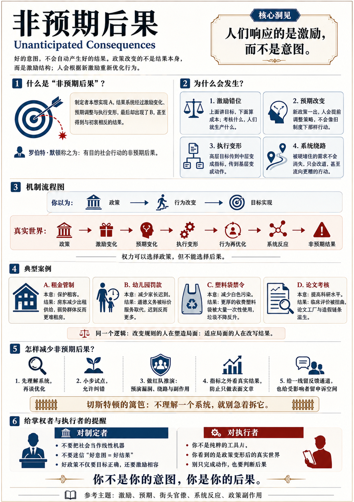

# 非预期后果：好意图怎么会带来坏结果？

[非预期后果：好意图怎么会带来坏结果？ \- 得到APP](https://www.dedao.cn/course/article?id=zk8vQM4oYjrXm1WMrQXw6bEOLl5GPx)

不管你是治理一个国家也好，经营一家公司也好，还是只是想管管你家小孩也好，当你手握权力的时候，你会有一个本能的冲动：我想要什么，我就奖励什么；我不想要什么，我就禁止什么；我担心什么，我就审批什么；我看重什么，我就考核什么。

如果你这么想，你就默默地把社会当成了一台线性机器，你认为只要遥控器掌握在好人手里就行 —— 而你，就是那个好人。

殊不知好的意图并不一定能带来好的结果。现实往往事与愿违，好心经常办坏事。

1994 年，为了保护穷人租房，旧金山市政府对房租实行价格管制。结果房东一算账，租金已经不划算，索性把房子卖了或者改作他用 —— 于是市场上的出租房供给减少了大约 15%，租金还提高了 5%，穷人反而更难租到房 \[1\]。

1973 年，为了保护濒危动物，美国通过《濒危物种法》。结果有些土地所有者担心自己土地上如果有濒危动物就会招来开发限制，于是干脆提前砍掉可能成为栖息地的林木 \[2\]。

2014 年，为了减少白色污染，加州禁止超市提供传统的那种免费薄塑料袋。结果商家用收费的、更厚的“可重复使用”塑料袋替代 —— 可是消费者还是把它当一次性袋子用完就扔。到 2022 年，全州填埋的塑料袋垃圾不降反升，从 15\.7 万吨暴涨到 23\.1 万吨 \[3\]。

2009 年，为了刺激汽车消费，美国推出“旧车换现金”计划。结果是短期新车销量确实上去了 —— 可后来的研究发现，绝大部分购买只是把本来过几个月要做的决定提前了：补贴一停，销量原地跌落 \[4\]。

……类似的例子实在太多太多了。用社会学家罗伯特·默顿（Robert K\. Merton）的话说，这叫有目的社会行动的「 非预期后果 （Unanticipated Consequences）」\[5\]。

✵

为什么会有非预期后果呢？我们不能只是感慨“你有你的计划，世界另有计划”。经济学最重要的一个洞见就是「人会对激励做出反应」—— 尤其请注意：

人们响应的是激励（incentives），而不是意图（intentions）。

你要是认为你有一个良好的意图，人们就应该在你的号召之下努力实现那个意图，那你就把社会想得太简单了。哪怕你有再大的权力，可以随意出台任何政策，制定任何新的规则，你所能改变的也不是结果本身，而是局面。

人们会根据这个局面重新行动，但未必是像你想的那样行动。

有家幼儿园，家长接孩子总是迟到，园方很头疼（意图），就定了条规矩（政策）：迟到罚款（激励局面）。结果家长对这个新局面的反应，是迟到的更多了。

为啥呢？罚款政策之前，准时接娃是一种道德义务，迟到了你会愧疚；有罚款之后，迟到成了一项明码标价的服务 —— 我多付点钱，买你老师半小时加班，愧疚感一扫而空。

这是两位经济学家在以色列的几家幼儿园做的经典实验 \[6\]。后来园方认识到了政策失误，取消了罚款，可是迟到率却再也没降回去。那层道德感一旦被价格挤掉，就回不来了。

你想的可能是：

政策 → 行为改变 → 目标结果。

真实世界却是：

政策 → 激励变化 \+ 预期变化 \+ 执行变形 → 人的行为再优化 → 系统反应 → 非预期结果。

要点是，人们会根据你那个新激励局面，对自己的行为进行再优化。

上面说的是意图，下面听到的是价格。

上面说的是价值观，下面看见的是收益表。

上面说的是方向，下面感受到的是约束条件。

这不是“群众觉悟低”。这是社会系统的基本物理学。用诺贝尔经济学奖得主罗伯特·卢卡斯（Robert Lucas）的话说： 你不能拿旧制度下观察到的行为关系，去预测新政策的效果，因为新政策本身会改变人的预期和行为 —— 人们称之为「卢卡斯批判（Lucas critique）」\[7\]。

有权力，你可以选择你的政策，但你不能选择你政策的后果。

✵

咱们看看在更严肃的场合中，好意图是怎么在往下传的过程中，一步步走向反面的。

就说王安石变法的那个「青苗法」。

本意听着是很好的。本来，农民赶上青黄不接就只能去借民间高利贷，年利率高达 70%，十分艰难。王安石这个青苗法提供 40% 的低利率，又能救农民出高利贷的火坑，又给国库增收，岂不是一举两得？

这个政策首先在设计层面就有问题。按罗振宇老师在《文明之旅》节目中的分析 \[8\]，民间利率高有高的道理。农民还款能力低，对农民放贷本来就是一个非常高风险的事，很多债务根本收不回来，利率低了这门生意就不成立。你官府并不比民间那些乡绅更了解本地农民，你凭什么给人提供低利率呢？如果按正常市场逻辑，你这个生意肯定赔本。

也许王安石没考虑到这一点，也许人家早就想到了 —— 不管怎么说，王安石的底气在于，这是官府经营的生意。

为了确保政策落地，王安石给地方官定了个考核：青苗钱放出去多少，算政绩。

那你想想，地方官会怎么做？有的农民借了青苗钱，但是还不上了，说能不能缓一年 —— 你能同意吗？有的农民说我家收成挺好，我不需要借青苗钱 —— 你能允许吗？你要是办青苗法不得力，不但考评不合格升迁没指望，而且你是在抵制改革！

隔壁那个知县发明了一个办法：把贷款指标硬摊到每家每户头上，再让乡绅和胥吏包办一部分，管他们怎么弄钱，反正第一年我给你们这么多钱，第二年你们必须给我拿回来外加四成利息！结果人家办成了。因为人家知道怎么有效利用官府这个暴力机器。

你学不学？官员不是对变法国富民强的意图做反应，官员是对激励做反应。

美国政治学家迈克尔·利普斯基（Michael Lipsky）有个学说叫「 街头官僚 （street\-level bureaucracy）」\[9\]，说让政策真正落地的，不是上峰的文件，而是那些在街头、在一线执行的基层公务员、警察、社工、教师等等，他们都有自己的资源限制、考核压力、自由裁量和自保动机。所以一条政策真正是什么样，不是看文件怎么写，而是看一线人员怎么办。

高层说的是宏大的目标：环保、公平、安全、减负。到了中层，目标被压缩成指标；到了基层，指标被翻译成动作。一层层传导下来，原来的公共目标，往往就变成了组织的自保目标。

上级要政绩，地方要交差，官吏要免责，百姓要活命，没有一个人觉得自己在作恶。就这样，一个挺好的初心，一群普通人正常上班，却偏偏就产生了坏结果。

✵

良好的意图 \+ 硬性的考核，就容易带来非预期后果。 咱们看两个当代的例子。

2021 年，中国政府为了绿色发展、节能减排，推出了“能耗双控”政策。那么一些省份为了完成考核指标，就开始对企业拉闸限电。你完全可以说，我的意图仍然是好的，充分符合中央精神，我是逼高耗能企业升级或淘汰。

可你站在工厂主的角度想想：我手里压着一批马上要交货、一违约就赔到破产的订单，电网偏偏这时候不给电！我怎么办？—— 我自己买柴油机发电。

一时间柴油发电机供不应求，相关概念股竟然涨停。指标是达标了，报表上的能耗是下去了，可是那些自备的小柴油机，比集中式电厂要脏得多。你说这算是实现了绿色发展吗？

另一件事是我们讲「柠檬市场」的时候说过的：中国的医院，近年来制造了大量的假论文，在世界上都造成了重大影响。这是怎么回事呢？

可能是为了提升科研水平，中国早在 1986 年的卫生职称制度中，就把对论文、专著、经验总结的要求写进了副主任医师、主任医师的任职条件之中。后来各大医院就层层加码，对论文要求越来越高。有很多医院规定医生评职称必须发 SCI 论文。

可是临床医生天天泡在手术台上，哪来时间和精力做基础科研？他们无奈之下就只能买论文。于是“论文工厂”应运而生，专门给你提供论文代写服务。这种事情愈演愈烈，才有了后面的论文打假。

你能说这是医生的错吗？有的医生临床水平非常高，救人无数，可是因为没有论文，就评不上高级职称，门诊费就比别人低，这合理吗？

系统本想选拔最卓越的医生。结果系统奖励的，却是伪装卓越的本事 —— 会拿手术刀的不如会拿课题的。

我以前听到「上有政策，下有对策」这句话，都是在谴责下面执行的人：上面的政策总是好的，是下面基层官员的执行走样了。可是现在看，非预期后果，难道不是人性的必然吗？你制造一个新局面，人们就找一条新出路；被硬堵住的需求往往会改道，奔向更坏的方向。

✵

怎样才能让后果和意图尽量一致，防止出现非预期后果呢？最基本的办法就是没事儿别折腾。

在西方，这个原则叫「切斯特顿的篱笆（Chesterton's Fence）」，出自英国作家吉尔伯特·切斯特顿（Gilbert K\. Chesterton）\[10\]：一个改革家看见一道莫名其妙的篱笆横在路当中，张口就说“这玩意儿没用，拆了它” —— 那么一个更高明的人就应该拦住他：“正因为你看不出它有什么用，你才更不能拆 —— 先回去想明白它当初为什么立在这儿，想通了再来。”

简单说就是你要是不理解一个系统，就别假装自己能优化它。

其实切斯特顿说得过于温和了。历史作家谌旭彬有个更符合中国国情的说法，叫「司马光困境」\[11\] ——

> 「……所有生活在秦制时代而心系百姓的改革者，必会遭遇的一种困境——他们知道旧制度对百姓极为不利，需要改革；但他们同样也知道，只要改革措施仍然来自不受制约的权力，就很难给百姓带来真正的福利，改革可以利朝廷，可以利官，却很难利民，甚至会将百姓推向更恶劣的境遇。在良知的驱使下，这些人往往表现为既呼吁改革，但又反对具体的改革措施。」

说的更直白一点，你的每一次折腾，最后无非是老百姓买单。

当然什么都不做也不行。但是理解了非预期后果，政府颁布政策之前，就应该先做一番红队推演，看看政策传导到下面会变形到什么程度。你得做好相应的保护措施，提供补偿机制，能不能给百姓带来好处先不说，先确保别让好人吃亏。

其实中国在改革开放时期有一个特别好的做法，那就是在重大政策出台之前，先找几个地方做小步的试点。然后你要跟踪反馈，允许纠错。绝不能先拍脑袋后拍桌子，设定指标层层加码……

✵

上面设定意图的人应该想想下面的人会怎么落实，而在下面负责落实的人，则更应该想想上面的实际意图。

你说我就是个基层公务员，我的任务就是完成上面给的指标 —— 错了。当你负责落实政策的时候，你就不是一个普通的工具人，你是“为官一任，守土有责”的人。你是利普斯基说的街头官僚。

上面的人可能只看见报表，而你看见的是人；上面的人可能只想知道“政策已落实”，你看见的是政策变形之后的真实模样。这给了你一份责任 —— 别动不动就把道德责任上移，说“这是上头定的”，否则你就陷入了政治理论家汉娜·阿伦特（Hannah Arendt）说的那个「平庸之恶（the banality of evil）」\[12\]。

现代系统很善于把一整个巨大的恶果，拆成许许多多看上去完全正常、甚至完全尽职的小动作。一个人只管完成放贷指标，一个人只管把报表填好看，一个人只管把不达标的往下压。在街头官僚眼里，对面可以不是一个“人”，而是一个“案例”、一个“指标”、一个“对象” —— 语言上把人改名为对象，良心就少了一层摩擦。每个人都能理直气壮地说：“我只是做好我的本职工作。”

但你的本职工作难道不是那个造福百姓的实际意图吗？

一个普通人其实可以做很多事：看见异常，记录它、反馈它，给政策对象留一点解释的余地，至少别帮着把那个谎言抹得更圆。积极一点，你可以提供詹姆斯·斯科特说的米提斯。最起码，你不必做链条上最锃亮的那颗螺丝钉，但你总可以回头问一句：这根链条，拖着的是个什么怪物？

✵

电影《V字仇杀队》里有一句台词，适合作为这一讲的结尾。

一个女医生，曾经主持生物武器研究，对活人做实验并且制造出一种病毒。这种病毒被极权政府用于自导自演的恐怖袭击，害死了大批民众。反抗者 V 最后找到了她，要报复。女医生搬出奥本海默来为自己辩护，说作恶不是她的本意，现在这个后果也是她没想到的……

但是 V 说：“我不是为你想做什么而来，我是为你做了什么而来。”

意图属于你自己，可是后果属于世界。

你不是你的意图，你是你的后果。

注释

\[1\] Rebecca Diamond, Tim McQuade, and Franklin Qian, "The Effects of Rent Control Expansion on Tenants, Landlords, and Inequality: Evidence from San Francisco," American Economic Review 109, no\. 9 \(2019\): 3365–3394\.

\[2\] Dean Lueck and Jeffrey A\. Michael, "Preemptive Habitat Destruction under the Endangered Species Act," Journal of Law and Economics 46, no\. 1 \(2003\): 27–60\.

\[3\] California Department of Justice, “Single\-Use Carryout Bag Ban \(Proposition 67/SB 270\)\.” https://oag\.ca\.gov/consumers/bag\-ban

\[4\] Atif Mian and Amir Sufi, "The Effects of Fiscal Stimulus: Evidence from the 2009 Cash for Clunkers Program," Quarterly Journal of Economics 127, no\. 3 \(2012\): 1107–1142\.

\[5\] Robert K\. Merton, "The Unanticipated Consequences of Purposive Social Action," American Sociological Review 1, no\. 6 \(1936\): 894–904\.

\[6\] Uri Gneezy and Aldo Rustichini, "A Fine Is a Price," The Journal of Legal Studies 29, no\. 1 \(2000\): 1–17\.

\[7\] Robert E\. Lucas Jr\., "Econometric Policy Evaluation: A Critique," Carnegie\-Rochester Conference Series on Public Policy 1 \(1976\): 19–46\.

\[8\] 罗振宇，《文明之旅》， 公元1069年：王安石理财有可能成功吗？ ； 公元1071年：新法是怎么龙种变跳蚤的？

\[9\] Lipsky, Michael\. Street\-Level Bureaucracy: Dilemmas of the Individual in Public Services（Russell Sage Foundation）, 1980\.

\[10\] Chesterton, G\. K\. The Thing: Why I Am a Catholic\. London: Sheed \& Ward, 1929\.

\[11\] 谌旭彬，《大宋繁华：造极之世的表与里》，浙江人民出版社（2024）。得到电子书：https://d\.dedao\.cn/GIQHl4KVvWBShLzs

\[12\] Hannah Arendt, Eichmann in Jerusalem: A Report on the Banality of Evil \(New York: Viking Press, 1963\)\.

1\.非预期后果：好的意图并不一定能带来好的结果。现实往往事与愿违，好心经常办坏事。这是因为人们响应的是激励，而不是意图。
2\.卢卡斯批判：不能拿旧制度下观察到的行为关系，去预测新政策的效果，因为新政策本身会改变人的预期和行为。
3\.良好的意图 \+ 硬性的考核，就容易带来非预期后果。意图属于你自己，可是后果属于世界。

