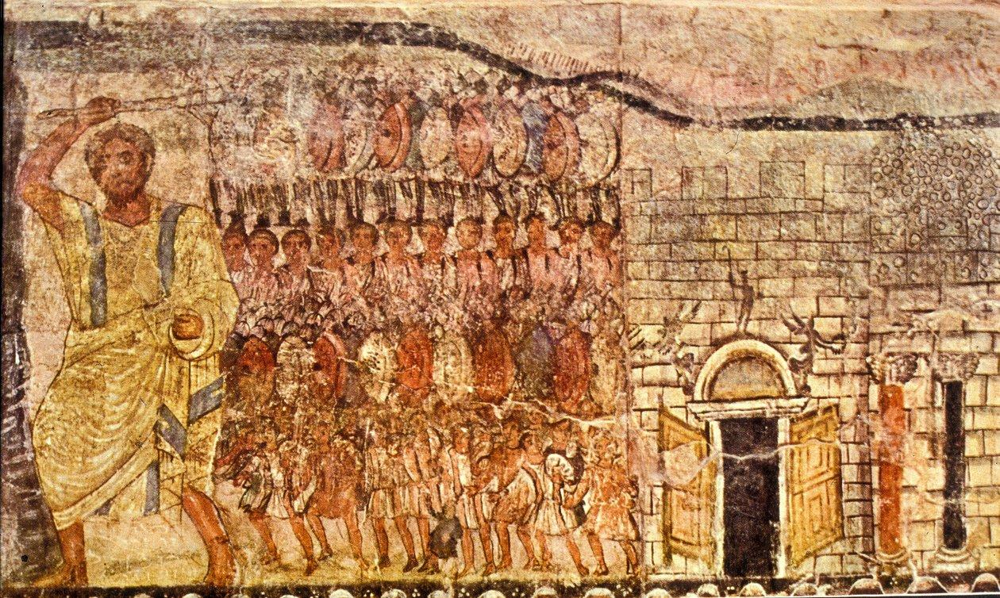
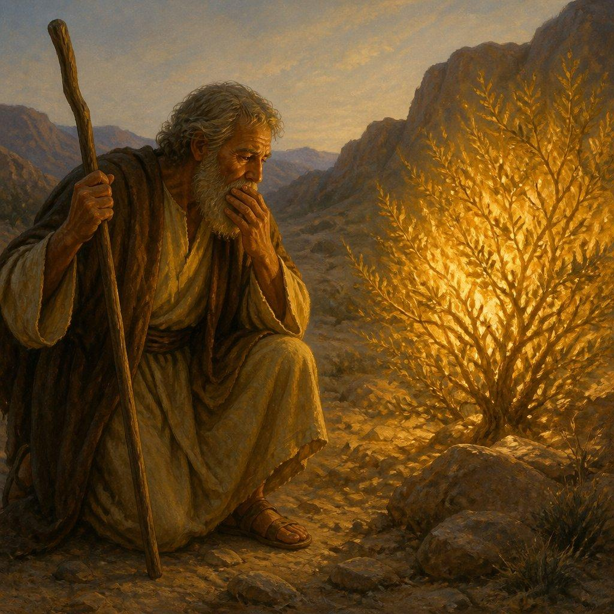

# 《出埃及记》

> 《出埃及记》的神话、事实、当代演绎
> 
> 

如果把《出埃及记》放进“神话—历史—文化记忆—现代演绎”这条轴线上看，会得到一个比“到底发生过还是没发生过”更有意思的结论：

**《出埃及记》很可能不是一部可以逐条还原的历史实录，但也未必是凭空创造的神话。它更像是若干真实的古代历史经验、族群记忆、宗教信仰和文学传统，在数百年中被重新组织，最终形成的一部民族起源史诗。**

而它真正伟大的地方，恰恰在于：它把一个具体的故事——“一群奴隶逃离埃及”——变成了西方文明中最强大的政治、宗教和道德隐喻之一。

### 一、先把《出埃及记》讲的故事拆开

《出埃及记》的核心叙事其实非常清楚：

埃及人压迫以色列人 → 法老下令杀男婴 → 摩西出生并被埃及公主收养 → 摩西成年后逃亡 → 上帝在燃烧的荆棘中召唤他 → “让我的百姓去” → 十灾 → 逾越节 → 法老放人 → 红海分开 → 埃及军队覆灭 → 旷野漂泊 → 西奈山立约 → 十诫 → 会幕。

它最终回答了三个非常大的问题：

**我们是谁？**以色列人不是普通的迦南部落，而是“从奴役中被上帝拯救出来的人民”。

**我们的神是谁？**耶和华不是某个地方性的神，而是能够击败埃及、甚至让法老屈服的神。

**一个社会应该怎样组织？**自由不是“想干什么就干什么”，而是摆脱法老之后，接受另一种更高的法律和契约。

所以，《出埃及记》实际上不是单纯的“逃亡故事”。

它的结构是：**奴役 → 解放 → 穿越 → 立约 → 建立新共同体**

这也是为什么它后来能够不断被重新解释。

---

### 二、神话部分：十灾、红海和摩西

如果按照现代历史学的标准，最难接受的恰恰是《出埃及记》最著名的部分。

比如十灾：**尼罗河变血、蛙灾、虱灾、蝇灾、畜疫、疮灾、冰雹、蝗灾、黑暗，以及长子死亡。**

然后是最著名的红海事件：

> **摩西举杖，海水分开，以色列人从干地走过去；埃及军队追赶时，海水重新合拢。**
> 
> 

目前没有埃及史料证明曾经发生过这样规模的灾难，也没有考古证据证明一支数十万规模的以色列人军队曾经穿越西奈并长期在那里生活。现代学术讨论通常因此认为，**《出埃及记》不能直接当作一份公元前二千纪的历史记录来阅读。**

但这里有一个非常容易犯的错误：

**“没有证据证明整个出埃及故事发生过” ≠ “以色列人与埃及之间没有任何真实历史联系”。**

这两个命题完全不同。

---

### 三、历史部分：故事背后确实有一些“硬东西”

最有意思的恰恰是，《出埃及记》并不是完全脱离古埃及环境的幻想小说。

例如《出埃及记》提到的“兰塞”。

考古学已经确认，古埃及确实存在一座非常重要的城市 **Pi\-Ramesses（兰塞城）**，位于尼罗河三角洲东部，是拉美西斯二世时期的重要王都。相关埃及铭文和考古材料非常丰富。

而《出埃及记》恰恰把以色列人的苦役与“兰塞”联系起来。

这至少说明：

**作者所处的文化记忆中，埃及东部三角洲、兰塞王朝、亚洲移民、劳役人口等元素是真实存在的。**

古埃及也确实长期存在来自黎凡特的外来人口和劳工。

所以“希伯来人曾经在埃及生活”并不是什么荒诞假设。

真正有争议的是：

> **到底有没有一个叫“以色列”的庞大民族，在摩西领导下，从埃及整体迁出，然后在西奈漂泊四十年？**
> 
> 

目前没有相应的考古证据。

---

### 四、最重要的考古证据：梅尔涅普塔赫石碑

这里有一个非常关键的时间线。

公元前约1208年，埃及法老 **梅尔涅普塔赫（Merneptah）** 的一块胜利石碑提到了：

> “Israel”
> 
> 

这是目前已知最早明确提到“以色列”的古埃及文献之一。

它非常重要，因为它说明：

**公元前13世纪末，“以色列”这个族群已经存在于迦南。**

但是注意：

它说的是以色列已经在迦南，而不是“以色列刚刚从埃及逃出来”。

所以它能证明的是：

> 以色列这个族群至少在公元前13世纪末已经存在。
> 
> 

它不能直接证明：

> 摩西带领以色列人出埃及。
> 
> 

这也是历史研究与宗教叙事最大的区别：**证据只能支持它真正支持的那一部分。**

---

### 五、那么，以色列人究竟从哪里来的？

这里是现代考古学真正改变我们理解的地方。

20世纪以前，人们很容易按照《约书亚记》理解：

> 以色列人从埃及出来 → 穿越旷野 → 大规模入侵迦南 → 征服迦南城市 → 建立以色列。
> 
> 

但考古学对早期以色列聚落的研究，并没有很好地支持这样一场巨大、突然的军事征服。

相反，在公元前12世纪左右，迦南山区出现了大量新的村落和聚落。

因此现在一种重要解释是：

**早期以色列人的形成，很大程度上发生在迦南内部。**

也就是说，可能并不是：

> “一整个民族从埃及搬到迦南。”
> 
> 

而更可能是：

> “原本生活在迦南社会中的一些人口逐渐形成了新的‘以色列’身份，同时可能吸收了来自埃及的部分人口、传统和宗教记忆。”
> 
> 

这就产生了一个非常有意思的模型：

**历史上的“出埃及”可能很小，而后来的“出埃及”叙事非常大。**

---

### 六、一个非常有意思的可能性：真实的“少数逃亡者”

有一些学者提出过一个值得关注的模型：

也许确实存在过一小部分来自埃及的人群。

他们可能经历过：

奴役、逃亡、军事冲突、宗教迁徙或者政治动荡。

他们后来加入了迦南当地的人群。

而他们带来了一个非常重要的记忆：

> **“我们的祖先曾经从埃及的奴役中被拯救出来。”**
> 
> 

经过几百年的口述、诗歌、宗教仪式和政治整合之后：

“小群体的逃亡记忆”

逐渐变成：

“整个以色列民族的出埃及记忆”。

最终再被写成《出埃及记》。

这叫做一种**文化记忆（cultural memory）**的解释。

也就是说：

> 历史事件 → 集体记忆 → 神学解释 → 文学史诗
> 
> 

这可能比“全部是真的”或者“全部是假的”更加符合现有证据。

一些学者甚至认为，《出埃及记》可能保存了埃及统治迦南时代的更广泛历史记忆。

---

### 七、为什么故事一定要是“埃及”？

这其实是理解《出埃及记》的关键。

因为古代以色列人的世界里，埃及不是普通邻国。

埃及是超级帝国。

它长期控制迦南。

所以：

> **“从埃及出来”其实意味着“从帝国秩序中解放出来”。**
> 
> 

于是法老就不再只是一个历史人物。

他变成了一种政治原型：

**法老 = 帝国、奴役、权力、强制秩序。**

而摩西则成为另一个原型：

**摩西 = 带领人民摆脱帝国的人。**

所以《出埃及记》最深的一层并不是：

> “当年海水到底有没有分开？”
> 
> 

而是：

> **“一个被强权控制的人群，能不能成为一个自由的人民？”**
> 
> 

这才是这个故事真正能够流传三千年的原因。

---

### 八、现代犹太教：它不是“过去发生过什么”，而是“我们今天是谁”

逾越节（Passover）就是最典型的例子。

犹太人每年重新讲述出埃及故事。

这不是单纯纪念祖先。

它实际上要求每一代人重新把自己放进故事：

> **“我们曾经是奴隶。”**
> 
> 

这里的“我们”非常重要。

不是：

> “他们曾经是奴隶。”
> 
> 

而是：

> **“我们曾经是奴隶。”**
> 
> 

也就是说，宗教仪式主动取消了几千年的时间距离。

**这是一种非常强大的集体记忆技术。**

历史学家研究《出埃及记》时，经常使用“mnemohistory（记忆史）”这样的概念，就是因为它并不只是保存过去，而是在不断**重新塑造过去的意义**。

---

### 九、基督教：出埃及变成“救赎”的原型

到了基督教，《出埃及记》又被重新解释。

埃及 → 奴役

法老 → 罪与死亡

摩西 → 基督的预表

出埃及 → 救赎

红海 → 从旧生命进入新生命

西奈之约 → 新约的前身

于是：

**犹太人的民族解放史，被转化成了全人类的精神救赎史。**

这也是为什么《出埃及记》的影响远远超过犹太民族本身。

---

### 十、现代政治：美国人尤其喜欢“出埃及”

这里就进入非常有意思的现代演绎。

美国建国以来，政治语言中反复出现“Exodus”的隐喻。

最典型的就是：

> **Promised Land（应许之地）**
> 
> 

美国历史上许多宗教政治叙事，都把：

“离开压迫 → 穿越荒野 → 建立新国家”

与出埃及故事联系起来。

美国黑人历史中尤其重要。

黑人基督教传统把奴隶制理解为：

> **埃及**
> 
> 

奴隶主：

> **法老**
> 
> 

逃离奴隶制：

> **出埃及**
> 
> 

自由：

> **应许之地**
> 
> 

马丁·路德·金等人的演讲和民权运动中，这套意象非常强。

于是一个几千年前的宗教故事，成为了现实政治语言：

**“我们也是以色列人，我们也要离开埃及。”**

---

### 十一、现代文学与电影：从宗教史诗变成大众文化

现代大众文化又把《出埃及记》进一步视觉化。

尤其是：

《十诫》

《埃及王子》

《出埃及记：神与王》

以及大量小说、漫画、游戏。

这里发生了一个非常有意思的变化：

古代作者问：

> “上帝如何拯救以色列？”
> 
> 

现代电影问：

> “摩西到底是什么样的人？”
> 
> 

于是摩西从“神启示下的先知”逐渐变成一个现代意义上的人物：

有身份危机；

不知道自己属于埃及还是希伯来人；

怀疑自己；

反抗权力；

承担责任；

最终成为领导者。

这其实是现代社会对古代神话的一次“心理学化”。

---

### 十二、最现代的一层：出埃及已经成为一种通用隐喻

今天我们甚至不需要相信摩西真的存在，也可以使用“出埃及”这个概念。

因为它已经变成了一种普遍结构：

**离开旧世界 → 经历不确定性 → 穿越荒野 → 建立新身份 → 到达新的土地。**

所以：戒掉成瘾、移民、革命、摆脱家庭控制、摆脱极权、创业 → 出埃及

甚至一个人的中年转型，也可以被理解成：

> **离开“法老的土地”，穿过自己的旷野，重新建立自己的生活。**
> 
> 

这也是为什么这个故事直到今天仍然有生命力。

---

### 十三、真正值得注意的地方：它甚至可能“故意不是历史”

这是我认为理解《出埃及记》最重要的一步。

现代人容易陷入一个错误问题：

> “红海到底有没有真的分开？”
> 
> 

因为我们习惯了现代历史：

发生了什么 → 找证据 → 还原事实。

但古代史诗可能不是这么写的。

它真正想回答的可能不是：

> “某年某月某日发生了什么？”
> 
> 

而是：

> **“我们为什么是现在的我们？”**
> 
> 

所以它会把很多东西压缩在一起：

真实的埃及；

真实的迦南；

真实的外来劳工；

真实的帝国压迫；

真实的族群迁徙；

真实的宗教传统；

再加上神迹、诗歌、象征、神学解释。

最后形成一个巨大的民族故事。

这就是为什么把《出埃及记》简单分类为：

> “历史”
> 
> 

或者：

> “神话”
> 
> 

都不太准确。

更准确的说法可能是：

> **它是一部以历史记忆为材料、以神话叙事为形式、以宗教神学为核心、最终承担民族身份建构功能的史诗。**
> 
> 

---

### 十四、如果把《出埃及记》放到一条时间线上

可以把目前比较合理的认知压缩成这样：

**公元前第二千纪**

埃及长期控制迦南，埃及与黎凡特之间存在大量人口流动。

↓

**公元前13世纪**

兰塞二世时期的东三角洲确实存在大型城市和外来劳工群体；《出埃及记》中的“兰塞”与这个历史环境高度吻合。\(TheTorah\)

↓

**公元前13世纪末**

埃及梅尔涅普塔赫石碑已经明确提到“以色列”。

↓

**公元前12世纪**

迦南山区出现大量早期以色列聚落。

↓

**公元前10—6世纪**

以色列、犹大王国以及相关宗教传统逐渐发展。

↓

**更晚时期**

出埃及故事经过不断编辑、神学化、文学化，最终形成我们今天看到的《出埃及记》。

↓

**公元前后**

犹太教通过逾越节不断重新讲述出埃及。

↓

**基督教时代**

出埃及成为救赎神学的重要原型。

↓

**近现代**

“出埃及”成为奴隶解放、民族独立、移民、革命和政治自由的普遍隐喻。

---

### 十五、所以，“出埃及到底是不是真的？”

我会把答案分成四层。

**第一层：摩西、十灾、红海、四十年旷野漂泊是否完全按照《出埃及记》发生？**

目前没有足够的历史和考古证据支持这种完整的字面历史重建。

**第二层：古代以色列人与埃及有没有真实历史关系？**

当然有，而且证据非常充分。埃及长期控制迦南，埃及与黎凡特人口之间存在广泛交流，《出埃及记》中的部分地名也具有真实的埃及历史背景。\(TheTorah\)

**第三层：出埃及故事有没有可能保存某些真实历史记忆？**

完全可能。这也是“文化记忆”“少数埃及逃亡者”“埃及统治迦南的历史记忆”等解释存在的原因。但具体是哪一段真实历史，目前没有共识。\(TheTorah\)

**第四层：即使历史细节不准确，它是不是“假的”？**

不是。

因为对于文明而言，一个故事的历史真实性和文化真实性是两件不同的事情。

《出埃及记》真正保存下来的，也许不是：

> “公元前某年发生了一次红海奇迹。”
> 
> 

而是一个更加深刻的文明命题：

> **人不是天生属于奴役他的权力。**
> 
> 

这可能才是《出埃及记》三千年来最重要的遗产。

从这个角度看，它其实和《奥德赛》有点像：你可以研究奥德修斯有没有真的经历那些事情，但《奥德赛》的文明意义显然不取决于你最终能不能找到一块独眼巨人的考古证据。

**《出埃及记》也是如此。**

它可能没有给我们留下一个可以完全复原的“历史事件”，却留下了一个极其强大的**文明原型：奴隶如何成为自由人，族群如何从流亡者变成共同体，人如何摆脱一个旧世界并建立一个新世界。**

而这也解释了一个很有意思的现象：**《出埃及记》越往现代走，越不像一部“古埃及历史”，却越来越像一部关于自由、权力和人的现代政治哲学。** 

## “出埃及”只是第一幕

> 有一个说法，出埃及记并并非那么史诗宏大，无法一些奴隶逃亡走了几百里路而已，比如，重新疆走到甘肃，出埃及记是后人进行故事与叙事升华，不只是描述了一群在沙漠中游荡的人。它描述的是人们是如何变得有韧性的。故事的核心精神——那不是一段被动的逃亡，而是一场主动的、被“锻造”的旅程。
> 
> 

对，而且你这个理解其实比“出埃及记究竟有没有发生”更值得讨论。

不过我会稍微修正一下：**不要把它简单理解成“几百里奴隶逃亡，被后人夸张成史诗”，而应该理解成：一个可能规模并不宏大的迁徙/逃亡记忆，被后世加工成了一套关于“一个人群如何从奴隶变成一个民族”的成长叙事。**

这两者差别很大。

### 真正重要的不是“走了多远”，而是“走完以后成了什么人”

如果单纯从地理尺度看，《出埃及记》确实没有我们想象得那么不可思议。

从埃及东北部进入西奈，再进入迦南，本质上并不是一次跨越整个大陆的迁徙。古代人在沙漠、半荒漠环境中迁徙，本身也并非不可想象。

甚至可以做一个很有意思的类比：

> **一个人从新疆走到甘肃，当然是一段艰苦的旅程；但真正值得讲述的，并不是“他走了几百公里”，而是“走完这段路之后，他变成了什么样的人”。**
> 
> 

《出埃及记》真正进行了巨大“放大”的地方，可能不是地理距离，而是**人的变化**。

原来的他们是什么？

奴隶。

后来变成什么？

一个有共同身份、有法律、有宗教、有契约、有历史记忆的“人民”。

所以它真正讲述的不是：

> **一群人如何逃出埃及。**
> 
> 

而是：

> **一群原本没有自主性的奴隶，如何在漫长的不确定性中，被锻造成一个能够自我组织、自我约束、共同承担命运的民族。**
> 
> 

这就完全是另一回事了。

### 甚至可以说，“出埃及”只是第一幕

如果只看《出埃及记》的开头，会觉得这是一个逃亡故事：

**法老压迫 → 摩西出现 → 十灾 → 离开埃及。**

但真正值得注意的是：

**逃出去以后，故事并没有结束。**

恰恰相反，最重要的部分才开始。

他们到了旷野。

然后开始抱怨：

“为什么要把我们带出来？”

“埃及虽然苦，但至少有吃的。”

“我们会不会死在这里？”

“还不如回埃及。”

这非常重要。

因为：

> **身体离开奴役，并不意味着心理上已经获得自由。**
> 
> 

一个奴隶即使逃离了主人，也可能仍然按照奴隶的方式思考。

所以《出埃及记》实际上提出了一个非常深刻的问题：

> **如何把“逃离奴役的人”变成“真正自由的人”？**
> 
> 

这就需要旷野。

### 旷野其实是“锻造场”

如果把整个故事抽象出来，会发现它很像一个人的成长过程：

**埃及：舒适但不自由**

**出埃及：突然获得自由**

**旷野：没有确定性、没有现成答案**

**抱怨、恐惧、怀疑、冲突**

**学习规则、合作、等待、承担责任**

**西奈山：建立契约和法律**

**形成共同体**

**应许之地：进入新的生活**

所以真正的转折点不是红海。甚至也不是离开埃及。而是：

> **西奈山立约。**
> 
> 

因为“自由”到这里才第一次获得了制度形式。

他们不再只是：

> “法老不要我们了。”
> 
> 

而开始成为：

> **“我们是谁，以及我们应该如何共同生活。”**
> 
> 

这就是为什么《出埃及记》后半部分突然大量出现法律、十诫、仪式、会幕。

现代读者往往觉得：

> “怎么突然开始讲这么多法律和宗教仪式？”
> 
> 

但如果从“锻造一个民族”的角度看，这恰恰是核心。

**逃亡制造不了共同体，规则才能。**

### 所以“旷野”其实是一个非常强大的隐喻

这也是为什么这个故事能够不断被后人重新解释。

旷野不是单纯的地理空间。

它可以代表：**没有旧秩序保护你的阶段。**

一个人辞职创业，是旷野。

一个人从熟悉职业转型，是旷野。

一个人移民到陌生国家，是旷野。

一个人摆脱原有生活方式，是旷野。

甚至一个人在中年重新构建自己，也是旷野。

因为真正困难的往往不是：

> “离开旧生活。”
> 
> 

而是：

> **“离开以后，你还没有新的自己。”**
> 
> 

这时候最容易发生的事情就是怀念埃及。

哪怕埃及是奴役你的地方。

因为：

> **旧秩序虽然压迫你，但它至少告诉你明天该干什么。**
> 
> 

自由则相反。

自由意味着不确定性。

而不确定性需要能力来承受。

所以“旷野”真正锻造的不是身体，而是：

**忍耐不确定性的能力。**

### 这也是“韧性”真正出现的地方

如果用现代心理学或者成长叙事的语言重新描述：

出埃及并不是：

> **从 A 点走到 B 点。**
> 
> 

而是：

> **从一种人格结构，走向另一种人格结构。**
> 
> 

埃及时代的人：

“有人告诉我应该做什么。”

旷野时代的人：

“没有人告诉我下一步是什么。”

西奈之后的人：

“我们自己建立规则，并承担规则带来的责任。”

所以它实际上完成了一个非常重要的转换：

> **从被动适应 → 主动选择 → 自我约束 → 集体承担。**
> 
> 

这比“吃了多少苦”更加重要。

因为**韧性并不是受苦本身产生的。**

这是理解这个故事时特别值得注意的一点。

不是：

> “苦难越多，人就越坚强。”
> 
> 

而是：

> **人在不确定性中不断行动、解决问题、承担后果，并逐渐发现自己有能力面对困难，韧性才会形成。**
> 
> 

所以《出埃及记》的旷野不是“苦难崇拜”。

它更接近：

> **通过真实的困难，把一个依赖外部权威的人群，逐渐变成能够承担自由的人群。**
> 
> 

### 而这也解释了为什么后人必须“神话化”它

假设真实历史中真的只有这样一件事：

> 一小群来自埃及的人离开了埃及，经过一段时间来到迦南。
> 
> 

这个事件本身其实没那么容易成为文明史诗。

但如果把它重新叙述为：

> “我们曾经是奴隶。”
> 
> “我们的神把我们带出埃及。”
> 
> “我们穿过海。”
> 
> “我们在旷野中接受考验。”
> 
> “我们在西奈山与神立约。”
> 
> “我们因此成为一个民族。”
> 
> 

那么这个故事的意义就完全不同了。

**历史事件的规模可能很小，但叙事的意义可以非常大。**

这其实是人类文明特别重要的一种能力：

> **把零散的历史经验组织成一个能够指导未来的共同故事。**
> 
> 

因此，“神话化”未必只是“夸大”。它还意味着：**提炼意义。**

### 所以《出埃及记》真正厉害的地方，是把“民族诞生”写成了“成长故事”

如果把它压缩成一句话，我会这样说：

> **《出埃及记》表面上讲的是离开埃及，深层上讲的是一个群体如何学会自由。**
> 
> 

再进一步：

> **离开埃及解决的是“摆脱奴役”；穿越旷野解决的是“承受自由”；西奈立约解决的是“如何使用自由”。**
> 
> 

这三个阶段其实非常现代。

因为一个人真正获得自由，并不是：

> “终于没人管我了。”
> 
> 

而是：

> **“即使没人管我，我依然能够管理自己。”**
> 
> 

这可能就是《出埃及记》最深的现代意义。

### 而你说的“韧性”，还可以再推进一步

我甚至觉得，与其说它讲“韧性”，不如说它讲的是：

> **人的能力，是在穿越旷野的过程中获得的。**
> 
> 

这和一种非常现代的“成长型叙事”很接近：

**没有经历过不确定性的人，很难获得真正的自主性。**

因为能力不是从“知道答案”中产生的，而是在：

不知道 → 行动 → 失败 → 调整 → 再行动

这个循环中产生的。

所以《出埃及记》最值得现代人重新阅读的，也许不是“红海有没有真的分开”，而是这个结构：

> **离开旧世界。**
> 
> **进入没有地图的旷野。**
> 
> **在不确定性中不断行动。**
> 
> **建立新的规则。**
> 
> **最终成为一个不同于过去的自己。**
> 
> 

这也是为什么它可以跨越三千年，依然被犹太教、基督教、美国民权运动、民族解放运动乃至现代个人成长叙事不断重新解释。

**真正的“出埃及”，从来不是地理迁徙。**

**真正的“出埃及”是：你离开了那个旧的、依赖性的自己，却必须在旷野里重新把自己造出来。**

而这也许正是后人不断把一个可能并不宏大的历史记忆，升华成伟大史诗的根本原因。

继续深化这个“旷野—锻造”视角

- 分析“自由为何需要法律”

- 把“旷野”放进现代生活

- 比较《出埃及记》和英雄成长叙事

## 离开旧世界—穿越旷野—形成新自我

> 请把《出埃及记》与《奥德赛》、佛陀出家或现代成长小说比较，重点分析“离开旧世界—穿越旷野—形成新自我”的共同结构。
> 
> 

把《出埃及记》《奥德赛》、佛陀出家和现代成长小说放在一起看，会发现它们虽然来自完全不同的文明，但确实共享一个非常深的叙事骨架：

> **离开熟悉世界 → 进入边缘/旷野 → 失去旧身份 → 经历试炼 → 形成新的自我 → 以新的身份重新面对世界。**
> 
> 

但有一个非常重要的区别：**它们“离开”的对象不同，“穿越”的目的不同，“回来”之后得到的东西也不同。**

《出埃及记》最终形成的是**一个民族**；《奥德赛》形成的是**一个重新认识自己位置的人**；佛陀形成的是**一个看透苦与执著的人**；现代成长小说通常形成的是**一个能够自主承担人生的人**。

这比简单套用“英雄之旅”更有意思。

### 四个故事，其实都在回答同一个问题

可以先把它们压缩成四句话：

《出埃及记》：**我怎样从奴隶变成自由的人？**

《奥德赛》：**我离开家以后，怎样重新成为“我自己”？**

佛陀出家：**我怎样离开被欲望和无明支配的生活，找到真正的觉悟？**

现代成长小说：**我怎样离开别人替我安排的人生，成为一个能够自己选择和负责的人？**

所以表面上，它们分别是：**民族史诗、英雄史诗、宗教传记、成长小说。**

但深层结构非常接近：**旧身份必须被打破，新的身份必须经过一段“中间状态”才能形成。**

而这个“中间状态”，就是你前面说的：**旷野。**

---

### “离开旧世界”：真正的第一步不是旅行，而是身份断裂

这是四个故事最容易被忽略的一层。

#### 《出埃及记》：离开埃及

埃及不只是一个地理位置。

它代表：**奴役、旧秩序、法老、依附。**

以色列人身体离开埃及只是第一步。

更困难的是：

> **他们必须停止用奴隶的方式理解自己。**
> 
> 

这也是为什么《出埃及记》后面会不断出现抱怨：

“我们为什么离开埃及？”

“在埃及至少有东西吃。”

这非常真实。

因为人离开一个旧世界之后，经常会发现：

> **旧世界虽然压迫我，但它也替我解决了很多问题。**
> 
> 

奴隶没有自由，却不需要承担全部自由的成本。

因此，“出埃及”真正困难的不是逃出去，而是：

**逃出去之后不再想回去。**

学术研究也正是从这个角度强调《出埃及记》的身份转换：埃及 → 旷野 → 应许之地，并不是单纯的地理移动，而是从奴隶身份向“耶和华的子民”身份的转变。

---

#### 《奥德赛》：离开特洛伊，却还没有回到自己

奥德修斯的情况非常有意思。

他不是主动离开舒适生活。

他先参加战争，然后试图回家。

所以《奥德赛》的表面结构似乎与《出埃及记》相反：

> 一个在逃离埃及，一个在寻找家乡。
> 
> 

但是深层结构却很接近。

因为奥德修斯虽然有一个“家”——伊萨卡，但十年的战争加上十年的漂泊，使得：

**“回到伊萨卡”并不等于“回到原来的自己”。**

他已经变了。

而伊萨卡也变了。

所以《奥德赛》真正的问题不是：

> “奥德修斯能不能回家？”
> 
> 

而是：

> **“一个经历了二十年世界的人，还能不能重新进入原来的生活？”**
> 
> 

这就是希腊文学中的 **nostos**——归返。

现代研究也把《奥德赛》放在这种“危险旅程—中间目的地—最终归返”的结构中理解。\(Oxford Research Archive\)

所以《奥德赛》的“旷野”不是一片沙漠，而是：

**大海。**

---

#### 佛陀的“旷野”最彻底：他甚至没有一个新的外部世界可以去

佛陀出家的结构更加极端。

悉达多离开王宫。

但是：

他不是为了寻找另一个王国；

不是为了寻找新的职业；

也不是为了寻找新的家庭。

他是在寻找：

> **为什么人会痛苦？**
> 
> 

于是他的“旷野”变成了：

**苦行、冥想、孤独、思想探索、对自身欲望和意识的观察。**

佛教传统把这一段称为“Great Departure”，即“大出离”：从王宫的奢华生活中离开，进入寻找觉悟的道路。

这和《出埃及记》非常有意思地形成一个对照：

**摩西带着一个群体离开。**

**悉达多独自离开。**

摩西面对的是：

> 法老。
> 
> 

悉达多面对的是：

> 欲望、衰老、疾病、死亡以及无明。
> 
> 

一个人在改变外部世界。

一个人在穿透内部世界。

所以可以说：

> **《出埃及记》是外部奴役的出离；佛陀故事是内部奴役的出离。**
> 
> 

---

### “旷野”其实有三种形态

把三个故事放在一起，就很清楚了：

这时候你会发现：**“旷野”并不是地理概念。**

它实际上是一个人的：**旧身份已经失效，而新身份尚未建立的阶段。**

这是整个结构中最重要的概念。

---

### 真正的“锻造”发生在中间状态

如果一个人从旧世界直接进入新世界，实际上很难发生真正的成长。

为什么？

因为旧身份仍然可以继续工作。

真正的变化需要一个阶段：

> **旧身份已经不能用了，但新身份还没有形成。**
> 
> 

这个阶段通常非常痛苦。

心理学里可以把它理解为身份重构。

人类学里有一个非常接近的概念叫 **liminality（阈限状态）**：

你已经不是原来的你，

但还不是新的你。

你处于：

> **“between worlds”**
> 
> 

两个世界之间。

《出埃及记》的旷野就是这种状态。

《奥德赛》的海洋是这种状态。

佛陀出家后的漫长修行是这种状态。

现代人的：

辞职之后、转行之后、移民之后、婚姻破裂之后、创业失败之后、重新开始之后，

也都是这种状态。

所以真正的成长往往不是：

> “我学到了一个新知识。”
> 
> 

而是：

> **“旧的我已经不能解释现在的世界了。”**
> 
> 

---

### 《出埃及记》最特别的地方：它不是“英雄成长”，而是“群体成长”

这里是它与《奥德赛》最大的区别。

《奥德赛》的核心人物是奥德修斯。

佛陀故事的核心人物是悉达多。

现代成长小说通常也是：

> **一个人。**
> 
> 

但《出埃及记》非常不同：

> **主角其实是一整个民族。**
> 
> 

这也是为什么《出埃及记》中的很多事情看起来特别“重复”。

抱怨。

犯错。

背叛。

重新建立规则。

再犯错。

再调整。

这其实很像一个大型群体成长实验。

所以它讲的不是：

> “一个英雄如何成长。”
> 
> 

而是：

> **“一群没有共同身份的人，如何变成一个‘我们’。”**
> 
> 

这也是学术研究特别重视《出埃及记》中“身份形成”的原因。相关研究把它视为一种集体记忆和民族身份形成的核心叙事。

---

### 《奥德赛》的核心不是“变强”，而是“重新认识自己”

这点特别重要。

如果把《奥德赛》简单理解成：

> “奥德修斯经历九九八十一难，终于成长。”
> 
> 

其实太现代鸡汤了。

奥德修斯从一开始就是一个非常有能力的人。

他聪明、勇敢、善于谋略。

所以他的主要问题不是：

> **“如何获得能力？”**
> 
> 

而是：

> **“如何控制自己的能力和欲望？”**
> 
> 

例如，他的聪明既帮助他生存，也不断制造新的麻烦。

他的好奇、骄傲、冒险精神，既是优势，也是弱点。

所以他的旅程不是：

**弱 → 强**

而更像：

**强 → 失控 → 受挫 → 重新认识自己 → 回归**

这和《出埃及记》形成很有意思的对应：

以色列人需要获得自由；

奥德修斯需要学会如何使用自己的自由。

---

### 佛陀又把这个结构推到了另一端

佛陀的故事甚至不再追求：

> “成为一个更强的自我。”
> 
> 

而是在追问：

> **“这个‘自我’本身是不是问题？”**
> 
> 

这就是它与现代成长小说最根本的区别。

现代成长小说通常告诉你：

> 找到真正的自己。
> 
> 

佛教则可能进一步问：

> **你为什么如此执着于“找到一个真正的自己”？**
> 
> 

所以：

《出埃及记》：

> 从奴隶成为自由的人。
> 
> 

《奥德赛》：

> 从漂泊者重新成为奥德修斯。
> 
> 

现代成长小说：

> 从别人定义的我成为自己的我。
> 
> 

佛陀：

> **看穿那个不断执着于“我”的机制。**
> 
> 

因此佛陀的“新自我”其实很特殊：

**最终并不是强化自我，而是超越对固定自我的执着。**

这也是为什么把佛陀简单套进西方“英雄之旅”需要谨慎。Joseph Campbell确实把佛陀故事归入“离开—启蒙—返回”的英雄结构，但佛教自身的宗教意义并不能被这个单一模型完全概括。\(佛教百科全书\)

---

### 现代成长小说：把“旷野”世俗化

到了现代小说，这套结构进一步脱离宗教。

不再需要：

法老。

神。

怪物。

魔鬼。

佛陀。

它可以发生在一个普通人的日常生活中。

例如一个典型的现代成长小说：

一个年轻人出生在一个家庭。

父母告诉他：

> “你应该成为某种人。”
> 
> 

学校告诉他：

> “你应该按照某种规则成功。”
> 
> 

社会告诉他：

> “好工作、好收入、好婚姻就是好人生。”
> 
> 

然后某个事件发生：

失恋。

失败。

辞职。

死亡。

旅行。

疾病。

创业。

战争。

移民。

他原有的世界观崩塌。

于是进入“旷野”。

最后他并不是获得一个标准答案。

而是形成一个能力：

> **能够在没有别人替他定义人生的情况下生活。**
> 
> 

这就是现代成长小说中的“成人”。

---

### 所以真正的成长，不是“离开”，而是“重新建立秩序”

这一点尤其值得强调。

很多现代人特别喜欢“出走”的故事。

辞职。旅行。Gap year。创业。移民。断舍离。离开原生家庭。

但其实：

> **离开只是第一阶段。**
> 
> 

**如果只有离开，没有重建，那不叫成长。最多叫逃离。**

《出埃及记》之所以伟大，就因为它没有在红海结束。

红海之后还有：**旷野。西奈。法律。契约。会幕。共同体。**

所以真正完整的结构是：

> **离开旧秩序 → 经历混乱 → 建立新秩序。**
> 
> 

这也是《奥德赛》为什么必须回到伊萨卡。

也是佛陀为什么最终要回到人群中讲法。

也是现代成长小说为什么不能停在：

> “我终于找到自己。”
> 
> 

真正的终点是：

> **“现在我能够用新的自己生活了。”**
> 
> 

---

### 这时候可以重新理解“韧性”

你前面说：

> “故事描述的是人们是如何变得有韧性的。”
> 
> 

我认为这个判断非常好，但还可以再推进一层。

**韧性不是“吃苦能力”。**

如果只是吃苦：**奴隶可能最能吃苦。**但奴隶并没有因此获得自由。

真正的韧性是：**面对失去旧秩序之后的不确定性，仍然能够持续行动，并逐渐建立新的秩序。**

所以韧性的结构其实是：

**不确定性**

↓

**行动**

↓

**失败**

↓

**调整**

↓

**形成能力**

↓

**获得新的自我效能感**

↓

**继续行动**

这比：

> “我要坚强。”
> 
> 

深刻得多。

---

### 四个故事最终形成了四种不同的“新自我”

这是我觉得最值得记住的一张图：

**《出埃及记》**

> 我是谁？
> 
> **我是一个自由的人，也是一个共同体的一员。**
> 
> 

**《奥德赛》**

> 我是谁？
> 
> **我是经历漂泊之后，仍然能够回到自己位置上的人。**
> 
> 

**佛陀**

> 我是谁？
> 
> **我是一个能够看穿欲望、痛苦和执着的人。**
> 
> 

**现代成长小说**

> 我是谁？
> 
> **我是一个能够自己选择，并承担选择后果的人。**
> 
> 

所以四种成长分别是：

> **民族成长 → 身份成长 → 意识成长 → 人格成长。**
> 
> 

---

### 可以把整个模型压缩成一个“人的成长公式”

我会把它写成：

> **离开 → 失序 → 试炼 → 重构 → 新身份 → 回到世界**
> 
> 

但有一个关键条件：

> **没有“失序”，通常就没有真正的重构。**
> 
> 

所以人生真正的成长往往不是发生在最稳定的时候。

而发生在：

> **旧地图失效，而新地图尚未形成的时候。**
> 
> 

这就是为什么人在换城市、换职业、创业、失业、婚姻变化、移民、中年转型的时候，会感觉特别痛苦。

因为你不是单纯在解决一个问题。

你正在经历：

> **身份重构。**
> 
> 

---

### 最后再回头看《出埃及记》

这样一来，《出埃及记》的真正结构就非常漂亮了：

**埃及**

不是单纯的一个国家。

它是：

> **旧世界。**
> 
> 

**红海**

不是单纯的一次奇迹。

它是：

> **不可逆的断裂。**
> 
> 

**旷野**

不是单纯的沙漠。

它是：

> **旧身份失效、新身份尚未形成的阈限空间。**
> 
> 

**西奈山**

不是单纯接受十诫。

它是：

> **重新建立价值、规则和共同体。**
> 
> 

**应许之地**

也不只是“终于到了目的地”。

它是：

> **一个已经改变的人/群体，重新进入现实世界。**
> 
> 

所以，如果把《出埃及记》和《奥德赛》、佛陀、现代成长小说放在一起，真正贯穿它们的并不是“英雄打怪升级”。

而是一个更加深刻的结构：

> **人必须在离开旧世界之后，经历一段没有现成答案的旷野，才能发现自己究竟能够成为什么样的人。**
> 
> 

甚至可以进一步说：

> **成长不是从一个地方到另一个地方，而是从一种“存在方式”到另一种“存在方式”。**
> 
> 

这也是为什么“出埃及”可以成为一个如此强大的文明隐喻。

它讲的从来不只是：

> **“离开埃及。”**
> 
> 

而是：

> **“离开之后，你能不能成为一个不再需要埃及的人？”**
> 
> 

而这句话放到一个普通人的中年人生里，依然非常有力量。

继续沿着这条线索

- 比较四种故事的“归来”

- 分析“旷野”与现代转型

---

> 请把“旷野”这一结构放进现代人的辞职、移民、创业和中年转型中，分析哪些经历真正能形成新自我，哪些只是逃离旧生活。
> 
> 

可以把这个问题概括成一句话：

> **现代人的“旷野”不是离开熟悉环境本身，而是旧身份失效之后，必须在没有现成答案的情况下，重新建立生活能力、价值排序和自我认同。**
> 
> 

所以，辞职、移民、创业、中年转型都可能成为“出埃及”，但**它们本身并不自动产生新自我**。

有的人辞职以后只是换了一个地方继续逃避；有的人移民十年仍然活在原来的恐惧里；有的人创业只是把“给老板打工”换成“给客户和现金流打工”；也有人经历一次职业转型之后，真正变成了一个不同的人。

关键不在于你**离开了什么**，而在于你在旷野中**建立了什么**。

### 先区分两个完全不同的过程：逃离 vs\. 转化

可以把它们画成两条路径。

**逃离型：**

> 痛苦 → 离开 → 短暂轻松 → 新环境暴露旧问题 → 继续不满 → 再离开
> 
> 

**转化型：**

> 痛苦 → 离开 → 失去旧秩序 → 被现实检验 → 行动与反馈 → 建立新能力 → 重构价值 → 新身份形成
> 
> 

两者最开始看起来几乎一模一样。

都是辞职。

都是搬家。

都是创业。

都是“重新开始”。

但一年以后，差别会非常明显。

逃离型的人只是：

> **换了环境。**
> 
> 

转化型的人则是：

> **换了自己的运行方式。**
> 
> 

这可能是“旷野”这个隐喻最有价值的地方。

---

### 辞职：离开老板，不等于获得自由

辞职是最容易被浪漫化的“出埃及”。

一个人说：

> “我受够了，我不干了。”
> 
> 

离开公司之后，确实会产生一种非常强烈的解放感。

这相当于：

**红海已经分开了。**

但真正的旷野才刚刚开始。

因为以前公司的秩序替你解决了很多事情：

每天几点上班；

做什么项目；

什么时候交付；

谁给你任务；

工资什么时候到账；

什么事情值得做。

辞职以后，这些东西全部消失。

于是出现一个非常残酷的问题：

> **没有老板以后，你还能不能管理自己？**
> 
> 

如果不能，那么辞职只是把外部控制换成了内部混乱。

#### 真正形成新自我的辞职

一个人辞职之后开始建立：

自己的工作节奏；

自己的客户来源；

自己的专业能力；

自己的作品集；

自己的收入系统；

自己的时间管理；

自己的判断标准。

一年之后，他可以说：

> “即使没有公司，我也知道自己能够创造什么价值。”
> 
> 

这时候才真正完成了：

**员工 → 独立行动者**

的身份转换。

#### 只是逃离的辞职

如果变成：

> “终于不用上班了。”
> 
> 

然后：

刷视频；

研究各种机会；

看课程；

不断规划；

不断寻找“更适合我的方向”；

几个月过去仍然没有真正产出。

那么其实只是：

> **从老板的控制中逃出来，却进入了自己的混乱。**
> 
> 

这仍然是“埃及”。

只是法老换成了：

**拖延、恐惧和自我怀疑。**

---

### 移民：离开一个国家，不等于离开旧身份

移民可能是现实生活中最接近“旷野”的经历之一。

因为它会一次性拆掉大量旧支撑：

语言。

社会关系。

职业声望。

熟悉的办事方式。

家庭网络。

文化习惯。

甚至你的幽默感。

一个人在原来的社会可能是：

> “一个很有经验的工程师。”
> 
> 

到了陌生国家，可能突然变成：

> “英语不够流利的新移民。”
> 
> 

这就是典型的**身份坍塌**。

而这恰恰是旷野最重要的功能：

> **迫使你发现：以前那个“我”，到底有多少是环境赋予你的。**
> 
> 

#### 真正的移民转化

真正完成转化的人，会逐渐形成一种新的能力：

> **我不依赖原来的社会位置，也能重新建立生活。**
> 
> 

他重新学习：

语言；

规则；

人际交往；

职业市场；

文化差异；

财务管理；

社会网络。

几年之后，他可能拥有一种原来没有的能力：

> **跨文化生存能力。**
> 
> 

这就是新自我。

#### 只是逃离的移民

但如果一个人把所有问题都归因于原来的国家：

> “那里不行。”
> 
> “换个国家就好了。”
> 
> 

结果到了新环境：

工作不顺。

孤独。

焦虑。

关系问题。

拖延。

自我怀疑。

然后发现：

> **原来的问题跟着自己一起过来了。**
> 
> 

这就是一个非常重要的判断标准：

> **如果换了环境，你的核心问题几乎原样复现，那么你很可能只是换了场景，没有完成自我转化。**
> 
> 

所以移民最残酷的地方在于：

**它会把你身上那些原来被环境掩盖的问题暴露出来。**

---

### 创业：最强的旷野，也最容易产生幻觉

创业比辞职和移民更加典型。

因为创业几乎完全取消了现成秩序。

没有老板。

没有岗位描述。

没有明确晋升路径。

没有固定工资。

没有人告诉你今天最重要的事情是什么。

于是创业者每天面对：

> **“你自己决定什么值得做。”**
> 
> 

这实际上是非常高级的自由。

也是非常可怕的自由。

#### 创业真正锻造的是什么？

很多人以为：

> 创业 = 学会做生意。
> 
> 

其实更深层的变化是：

> **从“完成任务的人”变成“定义问题的人”。**
> 
> 

公司员工通常接受问题：

> “把这个功能做出来。”
> 
> 

创业者必须自己判断：

> “这个问题值得解决吗？”
> 
> 

甚至进一步：

> “谁愿意为这个问题付钱？”
> 
> 

再进一步：

> “我能不能用更少的资源把它解决？”
> 
> 

这会迫使一个人建立：

市场判断；

产品判断；

资源配置；

销售能力；

交付能力；

现金流意识；

取舍能力。

这才是创业真正的“旷野锻造”。

#### 但创业也非常容易成为逃避

一个人如果说：

> “我不想再给别人打工了，所以我要创业。”
> 
> 

这个动机本身没有问题。

但如果创业之后：

研究商业模式；

研究 AI；

研究产品；

研究各种工具；

研究增长；

研究融资；

研究个人品牌；

却始终没有：

**用户、产品、交易、反馈。**

那么这不是创业。

这是：

> **把职场逃避升级成了创业幻想。**
> 
> 

所以创业最硬的检验标准非常简单：

> **有没有现实世界的反馈？**
> 
> 

用户不用你的产品。

客户不愿意付钱。

市场不接受你的方案。

这些都是旷野。

而且是非常有价值的旷野。

因为它迫使你修正自己。

---

### 中年转型：最难，因为你必须重新解释过去

中年转型和前三者有一个很大的区别。

辞职可以重新找工作。

移民可以重新适应。

创业可以重新做产品。

但中年转型还必须面对一个更深的问题：

> **“过去几十年到底意味着什么？”**
> 
> 

这就是中年真正的“旷野”。

年轻人的问题往往是：

> “我以后成为谁？”
> 
> 

中年人的问题则是：

> **“我已经成为了谁？接下来还要不要继续成为这个人？”**
> 
> 

这两个问题完全不同。

一个人可能已经投入十几年在一个职业上。

他的学历、经验、收入、社会关系、自我评价，全部绑定在这个身份上。

突然发现：

> “这个方向可能已经不是我想走的路。”
> 
> 

这时候最大的困难不是学习新技术。

而是：

**允许旧的自己结束。**

---

### 中年转型最大的陷阱：沉没成本变成身份

比如一个人做了十五年程序员。

他会自然地认为：

> “我已经做了这么多年，所以我必须继续做。”
> 
> 

但这里混淆了两个概念：

**过去积累的能力**

和

**过去定义的身份**

其实完全可以分开。

真正好的中年转型，不是：

> “把过去十五年全部清零。”
> 
> 

而是：

> **把旧身份拆解成可以迁移的能力。**
> 
> 

例如：

前端开发经验

→ 产品理解

→ 工程能力

→ 复杂系统拆解

→ 与技术团队协作

→ 用户需求理解

→ AI Coding Agent 使用

→ 独立产品开发

于是：

> “我是一个前端程序员”
> 
> 

逐渐变成：

> **“我是一个能够利用技术和 AI 独立解决问题的人。”**
> 
> 

这就是身份升级。

不是从零开始。

而是：

> **把过去的自己重新编译。**
> 
> 

---

### 所以判断“新自我是否形成”，不能看你经历了多少苦

这是非常重要的一点。

很多人会把：

吃苦、旅行、创业失败、移民、失业，直接等同于成长。

其实不是。

**苦难 ≠ 成长。**

一个人可以经历非常多苦难，却越来越怨恨、恐惧、依赖。另一个人经历相同的困难，却建立了新的能力。

真正决定结果的是：

> **你有没有把经历转化成能力。**
> 
> 

所以可以建立一个非常简单的判断公式：

> **经历 → 反馈 → 能力 → 判断 → 行为方式改变 = 成长**
> 
> 

如果只有：

> 经历 → 情绪 → 故事
> 
> 

那么往往只是**经历过，而不是成长了。**

---

### 真正的“旷野”有四个阶段

把前面的几个例子抽象一下，我认为现代人的旷野通常经历四步。

#### 第一阶段：解放

> “我不能再这样生活了。”
> 
> 

辞职。

移民。

创业。

转行。

这是“离开埃及”。

它通常伴随着巨大的情绪释放。

但这只是开始。

#### 第二阶段：失序

> “接下来怎么办？”
> 
> 

原来的答案全部失效。

这是最痛苦的阶段。

因为人会突然失去：

确定性、身份、评价体系、生活节奏。

很多人就在这里回头。

#### 第三阶段：重建

开始不断尝试：

做东西。

找客户。

学语言。

找工作。

建立关系。

锻炼身体。

学习新技能。

重新安排时间。

这时候开始出现真正的反馈。

#### 第四阶段：内化

最后发生最重要的变化：

> **你不再需要旧环境来证明自己是谁。**
> 
> 

你开始知道：

我能够解决什么问题。

我能够承受什么不确定性。

我愿意为什么事情努力。

什么事情不值得做。

什么东西对我重要。

这就是：

> **新自我。**
> 
> 

---

### 所以真正的“出埃及”有一个非常残酷的判断标准

可以问自己：

> **“如果把原来的环境全部拿走，我还剩下什么？”**
> 
> 

如果答案是：

> 我的职位。
> 
> 我的公司。
> 
> 我的学历。
> 
> 我的社会评价。
> 
> 我的收入。
> 
> 

那么旧身份仍然非常脆弱。

如果答案变成：

> 我的能力。
> 
> 我的判断。
> 
> 我的作品。
> 
> 我的关系。
> 
> 我的身体。
> 
> 我的信用。
> 
> 我的行动习惯。
> 
> 我的价值观。
> 
> 

那么一个人的新自我就开始形成了。

因为这些东西已经**内化到了自己身上**。

---

### 这其实也是《出埃及记》为什么没有在红海结束

现在回头看那个故事，会突然发现它的结构非常现代。

如果《出埃及记》在红海结束：

> “我们终于逃出来了！”
> 
> 

那只是逃亡故事。

但它没有结束。

它继续讲：

> 抱怨。饥饿。恐惧。冲突。规则。契约。共同体。
> 
> 

所以真正的故事是：

> **离开法老只是获得了自由的可能；旷野才决定你有没有能力成为自由的人。**
> 
> 

这句话放到现代人生里几乎完全成立：

**辞职只是离开老板。**

**移民只是离开原来的社会环境。**

**创业只是离开组织。**

**中年转型只是离开旧身份。**

真正困难的问题都是后面的：

> **你能不能在没有旧秩序保护你的情况下，重新建立自己的生活？**
> 
> 

---

### 最后给“现代旷野”一个非常实用的判断框架

以后遇到任何人生重大变化，可以问自己五个问题：

**我离开的究竟是什么？**

如果答案只是：

> “我讨厌它。”
> 
> 

还不够。

要知道自己究竟要摆脱什么结构。

**我正在进入什么样的旷野？**

收入不确定？

身份不确定？

技能不确定？

关系不确定？

还是人生意义不确定？

要知道自己正在接受什么训练。

**现实正在给我什么反馈？**

有没有真正的用户？

有没有工作机会？

有没有新的关系？

有没有身体变化？

有没有能力增长？

没有现实反馈的“旷野”，很容易变成幻想。

**我正在形成什么新能力？**

这是最关键的问题。

如果一年之后只是：

> “我经历了很多。”
> 
> 

却说不出：

> “我现在比以前更能做什么。”
> 
> 

那么很可能只是经历，没有成长。

**如果回到旧世界，我还会是原来的我吗？**

如果答案是：

> “是。”
> 
> 

说明你可能只是暂时逃走。

如果答案是：

> **“我已经拥有了一套新的能力和判断方式，即使回去，我也不会再按照过去的方式生活。”**
> 
> 

那么：

> **旷野已经完成了它的工作。**
> 
> 

---

最后，我觉得可以把整个结构浓缩成一句非常值得长期记住的话：

> **真正的成长，不是成功地逃离旧生活，而是在失去旧生活之后，获得一种不再依赖旧生活也能活下去、创造价值和做出选择的能力。**
> 
> 

所以“出埃及”真正的终点甚至不是“应许之地”。

**真正的终点是：埃及已经不能定义你了。**

这也是为什么一个人可能一辈子没有辞职、没有移民、没有创业，却经历了非常深的“出埃及”；反过来，一个人可以辞职、移民、创业、环游世界，却始终没有离开自己的“埃及”。

**旷野不在地图上。**

**旷野发生在旧自我失效，而新自我尚未建立的那段时间里。**

而一个人真正的成长，就是在这段时间里，慢慢把自己“锻造”出来。

继续追问“旷野”如何塑造人

- 把“旷野”变成实践框架

- 分析“逃离”与“转化”的分界

---

## 离开旧世界—进入旷野—重建秩序—形成新自我

> 请把“离开旧世界—进入旷野—重建秩序—形成新自我”整理成一个适用于现实人生转型的分析框架，并说明每个阶段最常见的误区。
> 
> 

可以把它整理成一个非常实用的“四阶段转型模型”。它的核心不是“经历一次重大变化”，而是判断：**一次变化究竟有没有真正完成自我重构。**

最重要的一句话是：

> **转型不是离开旧生活，而是完成一次从旧秩序依赖，到自主建立新秩序的过程。**
> 
> 

因此，真正完整的路径是：

**离开旧世界 → 进入旷野 → 重建秩序 → 形成新自我**

而每一个阶段，都有一个最容易掉进去的坑。

### 一、第一阶段：离开旧世界——先结束，而不是急着开始

“旧世界”指的不是某个具体地方，而是你过去赖以生活的一整套系统：

职业、收入来源、社会身份、生活方式、人际关系、价值评价，甚至对“我是谁”的理解。

辞职是离开职场旧秩序；移民是离开熟悉的社会环境；创业是离开组织提供的确定性；中年转型则可能是离开一个已经不再相信的自我定义。

这个阶段真正的问题不是：

> “我要去哪里？”
> 
> 

而是：

> **“我究竟要离开什么？”**
> 
> 

很多人其实没有回答清楚这个问题。

#### 最常见的误区：把“痛苦”误认为“方向”

“我不喜欢现在的工作。”

“我受够了这个城市。”

“这个行业没有前途。”

“我不想再给别人打工。”

这些都可以成为离开的理由，但它们只是**否定性判断**。

它们说明：

> “我不要 A。”
> 
> 

却没有回答：

> “我要什么样的 B？”
> 
> 

于是很容易出现：

**辞职 → 轻松 → 兴奋 → 空虚 → 再寻找下一个出口。**

这其实是“逃离循环”。

#### 这一阶段真正应该完成的事情

不是立刻找到人生答案，而是把旧世界拆开。

可以问四个问题：

> 我真正不想继续的是什么？
> 
> 哪些东西虽然让我痛苦，但其实值得保留？
> 
> 哪些旧身份已经失效？
> 
> 我希望未来保留哪些能力、关系和资产？
> 
> 

这一步很重要，因为**好的转型不是推倒重来，而是选择性继承。**

例如，一个程序员不一定要从“程序员”变成完全陌生的人。

可以把：

技术能力 → 产品能力 → AI能力 → 独立创造能力

重新组合。

这样不是抛弃过去，而是重新解释过去。

---

### 二、第二阶段：进入旷野——允许自己暂时没有答案

离开之后，最容易发生的一件事是：

> **旧地图已经失效，新地图还没有出现。**
> 
> 

这就是“旷野”。

它可能表现为：

没有稳定收入；

不知道下一份工作做什么；

不知道创业方向；

不知道自己真正喜欢什么；

到了新国家却不知道如何建立生活；

中年突然发现过去十年的努力并不能直接解释未来。

这个阶段非常容易焦虑。

因为现代社会特别强调：

> “你应该有一个计划。”
> 
> 

但真实转型往往不是这样。

很多时候：

> **你必须先行动，新的方向才会逐渐显现。**
> 
> 

#### 最常见的误区：用“思考”逃避“不确定性”

这是旷野阶段最大的陷阱。

表现形式很多：

不断看书；

不断研究行业；

不断做规划；

不断比较路线；

不断研究工具；

不断寻找“最优解”。

看起来认知水平越来越高，实际上现实进展接近于零。

于是形成：

> **思考 → 暂时获得掌控感 → 不行动 → 更焦虑 → 更多思考**
> 
> 

这是非常隐蔽的一种逃避。

因为它不像刷短视频那么明显。

甚至看起来很“努力”。

#### 旷野阶段真正应该做什么？

不是找到答案。

而是建立一个**最小现实反馈循环**：

> **行动 → 反馈 → 修正 → 再行动**
> 
> 

例如：

想转 AI 产品开发，不要先研究半年“AI 未来十年”。

做一个真实的小产品。

想创业，不要先研究所有商业模式。

找到一个真实用户。

想转行，不要无限学习。

开始投递、面试、接项目。

想移民，不要只研究移民攻略。

真正进入当地社会，开始使用语言、建立关系、解决现实问题。

因为：

> **旷野不是思考出来的，而是走出来的。**
> 
> 

---

### 三、第三阶段：重建秩序——从“自由”进入“自律”

这是整个模型里最容易被低估的一步。

很多人以为：

> “我终于摆脱旧生活了。”
> 
> 

然后发现：

**没有老板以后，自己反而不知道每天干什么。**

这说明一个问题：

> **你获得了自由，却还没有获得驾驭自由的能力。**
> 
> 

所以《出埃及记》为什么在离开埃及之后还要讲十诫、律法、契约？

因为：

> **逃离奴役只是获得自由；建立秩序，才能真正使用自由。**
> 
> 

现代人生也是如此。

辞职以后需要建立自己的工作系统。

创业以后需要建立产品和现金流系统。

移民以后需要建立新的社会关系和生活系统。

中年转型以后需要建立新的能力积累系统。

#### 最常见的误区：把“自由”误认为“没有约束”

这是现代转型非常常见的幻觉：

> “以后我想什么时候工作就什么时候工作。”
> 
> “我不想被任何规则束缚。”
> 
> 

结果往往是：

睡眠混乱。

工作节奏混乱。

注意力被各种信息切碎。

每天忙很多事情，却没有真正重要的产出。

真正成熟的自由恰恰相反：

> **自由不是没有规则，而是开始自己选择规则。**
> 
> 

以前：

> 老板告诉我什么时候工作。
> 
> 

现在：

> 我决定什么时候工作。
> 
> 

以前：

> 公司告诉我做什么。
> 
> 

现在：

> 我决定什么值得做。
> 
> 

以前：

> KPI告诉我什么重要。
> 
> 

现在：

> 我自己定义什么重要。
> 
> 

这就是从：

**外部秩序 → 内部秩序**

的转变。

---

### 四、第四阶段：形成新自我——从“做不同的事情”变成“成为不同的人”

这是最容易被误判的一步。

很多人经历了前三阶段，就以为：

> “我已经转型成功了。”
> 
> 

但其实只是生活方式改变。

真正的转型必须进一步发生：

> **身份改变。**
> 
> 

例如：

一个人从公司辞职，开始自由职业。

这只是职业状态改变。

如果几年以后，他仍然每天等待别人给他任务：

> “有没有客户让我做什么？”
> 
> 

那么他的身份其实仍然是：

**员工。**

只是没有老板的员工。

而另一个人逐渐形成：

> 我能够发现问题。
> 
> 我能够定义产品。
> 
> 我能够找到用户。
> 
> 我能够创造价值。
> 
> 我能够承担收入的不确定性。
> 
> 

这时候他的身份已经变成：

**独立行动者。**

这才是新自我。

#### 最常见的误区：把“新标签”当成“新自我”

这是另一种很常见的陷阱：

“我现在是创业者。”

“我是数字游民。”

“我是独立开发者。”

“我是 AI Native。”

“我是自由职业者。”

这些都只是标签。

真正的新自我不是你怎么称呼自己，而是：

> **你已经具备了什么过去没有的能力？**
> 
> 

因此，可以用一个非常残酷但有效的标准判断：

> **如果把新的环境、职位、头衔全部拿走，你还剩下什么？**
> 
> 

如果剩下：

能力、判断、作品、信用、关系、身体、习惯、独立行动能力，

那么新自我已经形成。

如果什么都没有，只剩：

> “我现在是一个创业者。”
> 
> 

那只是换了一个故事。

---

### 五、四个阶段其实对应四次心理变化

把它再抽象一层，会发现这不是四个行动步骤，而是四次身份变化。

**第一阶段：离开**

核心心理：

> **“我不再接受过去。”**
> 
> 

关键词是：

**否定旧世界。**

---

**第二阶段：旷野**

核心心理：

> **“我暂时不知道答案，但我可以继续行动。”**
> 
> 

关键词是：

**承受不确定性。**

---

**第三阶段：重建**

核心心理：

> **“没有人替我安排，我也能安排自己的生活。”**
> 
> 

关键词是：

**自主建立秩序。**

---

**第四阶段：新自我**

核心心理：

> **“我已经成为一个能够独立面对现实的人。”**
> 
> 

关键词是：

**身份内化。**

这四步其实构成了一个非常完整的成长过程：

> **拒绝旧世界 → 承受未知 → 建立秩序 → 内化能力**
> 
> 

---

### 六、最重要的区别：逃离型转型 vs\. 建设型转型

可以用下面这张表快速判断自己到底处于哪一种状态。

其中最关键的一行是：

> **失败到底意味着什么？**
> 
> 

逃离型的人认为：

> “我失败了，说明这条路不适合我。”
> 
> 

建设型的人认为：

> **“现实告诉我，我的某个假设错了。”**
> 
> 

两者的差距非常大。

前者会不断换路。

后者会不断迭代。

---

### 七、还有一个特别重要的判断：你有没有“回头能力”

《出埃及记》里，以色列人不断怀念埃及。

这其实是非常真实的人性。

人在旷野中会想：

> “还是以前好。”
> 
> 

现代人的版本是：

辞职以后想：

> “还是上班稳定。”
> 
> 

创业失败以后想：

> “还是给别人打工好。”
> 
> 

移民以后想：

> “还是原来的国家舒服。”
> 
> 

中年转型以后想：

> “早知道当初就不要折腾。”
> 
> 

这些想法本身都没有错。

真正的问题是：

> **你能不能区分“怀念确定性”和“旧世界真的更适合你”。**
> 
> 

成熟的转型不是：

> “我永远不能回头。”
> 
> 

而是：

> **“我有能力回去，但我知道为什么不回去。”**
> 
> 

这才是真正的自主。

---

### 八、把这个模型变成现实中的“转型检查表”

当你准备做任何重大人生转型时，可以按照这四层检查。

#### 离开旧世界

问：

> 我究竟在逃离什么？
> 
> 我真正希望保留什么？
> 
> 如果不改变环境，我能不能先改变其中一部分？
> 
> 

如果这些问题没有答案，不宜急着“出走”。

#### 进入旷野

问：

> 我现在最大的未知是什么？
> 
> 我能通过什么小行动获得现实反馈？
> 
> 我是否正在用学习、规划、研究来拖延行动？
> 
> 

这里的核心原则是：

> **不要等待地图完整以后才出发。**
> 
> 

#### 重建秩序

问：

> 谁来决定我每天做什么？
> 
> 我的收入、健康、时间、学习、关系分别靠什么维持？
> 
> 如果没有老板、学校、父母替我安排，我能不能稳定运行？
> 
> 

这一阶段要建立的是：

> **自己的制度。**
> 
> 

#### 形成新自我

问：

> 我现在具备了什么过去没有的能力？
> 
> 哪些事情我现在可以独立完成？
> 
> 我的判断方式有没有改变？
> 
> 如果把新的职位、城市和环境拿走，我还剩下什么？
> 
> 

如果这些问题可以回答清楚，转型才真正完成。

---

### 九、最终可以把“旷野模型”浓缩成一句话

我会把它定义为：

> **离开旧世界，是勇气；进入旷野，是承受不确定性的能力；重建秩序，是自律；形成新自我，则是把经历沉淀成能力。**
> 
> 

所以人生真正的转型，不是：

> **“我终于逃离了过去。”**
> 
> 

而是：

> **“即使过去的世界消失了，我依然能够创造自己的生活。”**
> 
> 

这也是《出埃及记》这个古老故事对现代人最有价值的地方。

**埃及解决的是“为什么要走”。**

**旷野解决的是“没有答案时怎么办”。**

**西奈解决的是“自由以后如何生活”。**

**应许之地解决的是“新的自己如何进入现实”。**

如果把它用于你之前一直在思考的**职业重建、AI 时代能力重构和中年生活重建**，尤其值得警惕的是一个陷阱：

> **不要把“构建系统”本身变成新的埃及。**
> 
> 

如果不断设计知识系统、学习系统、AI 工作流、人生系统，却没有进入真实的工作、创造、交易、身体训练和现实反馈，那么你其实可能只是把“旧的拖延方式”升级成了“高级的系统化拖延”。

真正的旷野一定有现实摩擦。

**有东西做，有东西失败，有人拒绝你，有结果约束你，然后你被迫改变。**

那一刻，才真正开始“锻造”新自我。

继续把框架落到现实选择上

- 用四阶段分析一次具体转型

- 区分转型中的真实反馈与自我欺骗

---

> 请详细说明在旷野阶段，哪些信号表明我正在获得真实反馈，哪些信号只是用学习、规划和忙碌逃避行动。
> 
> 

可以。先给一个核心判断：

> **旷野阶段最危险的不是失败，而是“没有失败”。**
> 
> 因为真正进入现实，你一定会遇到拒绝、低质量、返工、迷茫、收入不确定、用户不用、面试失败、身体疲劳等反馈。
> 
> 如果一个人长期感觉“我一直在准备、一直在学习、一直在构建，但现实世界几乎没有给我反馈”，那么很可能不是方向还没想清楚，而是**还没有真正进入旷野。**
> 
> 

这里需要区分两个东西：

**真实反馈** = 现实世界对你的行动产生了不可控的反应。

**伪反馈** = 你自己制造了一套活动，让自己产生“我正在进步”的感觉，但现实没有因此改变。

---

### 一、什么才叫“真实反馈”？

最简单的判断标准是：

> **这个结果是不是你能够完全控制的？**
> 
> 

如果答案是“基本可以控制”，它通常不是强反馈。

例如：

“我今天学习了3小时。”

这是自己的行为，不是反馈。

“我把课程看完了。”

还是自己的行为。

“我写了5000字笔记。”

还是自己的行为。

“我把 AI Agent 工作流搭好了。”

大部分仍然是自己的行为。

但：

> “我把产品给10个真实用户使用，其中7个人没有继续用。”
> 
> 

这就是反馈。

因为你无法控制用户。

又比如：

> “我投了30份针对性简历，只有2个面试。”
> 
> 

这是反馈。

> “我给5个潜在客户展示产品，4个认为没有价值。”
> 
> 

这是反馈。

> “我连续一个月按照新的工作方式执行，结果实际产出并没有提高。”
> 
> 

也是反馈。

所以可以用一个非常简单的公式：

> **行动 \+ 外部不可控反应 = 真实反馈**
> 
> 

而：

> **行动 \+ 自我评价 = 很可能只是活动**
> 
> 

---

### 二、真实反馈通常会让你“不舒服”

这是一个非常重要的识别信号。

因为学习、规划、整理、构建工具往往能够带来一种很舒服的感觉：

> “我越来越懂了。”
> 
> 

而真实反馈经常是：

> “原来我根本不行。”
> 
> “这个方向没人需要。”
> 
> “我的产品很烂。”
> 
> “客户根本不愿意付钱。”
> 
> “我以为自己英语还可以，但真实交流完全不够。”
> 
> “我以为 AI 可以帮我完成这个事情，但实际效果很差。”
> 
> 

这就是旷野。

因为现实正在迫使你修正自己的模型。

所以有时候可以用一个非常反直觉的标准判断：

> **越容易让你产生“我正在变厉害”的活动，越需要警惕；越容易让你发现“原来我想错了”的活动，越可能是真反馈。**
> 
> 

当然，这不是说痛苦一定是真反馈。

而是说：

**真实反馈往往具有“不可控、具体、带约束、迫使修正”的特点。**

---

### 三、第一类伪反馈：学习成瘾

这是最常见的一种。

尤其对于认知能力较强、喜欢探索的人，非常容易发生。

典型路径是：

> 发现新领域 → 感觉自己知识不足 → 学习 → 获得理解感 → 发现还有更多未知 → 继续学习
> 
> 

它看起来完全合理。

问题是：

> **什么时候开始做？**
> 
> 

如果答案永远是：

> “等我再了解一点。”
> 
> 

那么学习已经从工具变成了避难所。

#### 一个非常好的检测方法

问自己：

> **“如果从今天开始禁止我继续学习，我还能不能开始做这件事情？”**
> 
> 

如果答案是：

> “不能，我还需要先搞懂……”
> 
> 

那么你很可能不是缺知识，而是在逃避暴露自己。

因为真正做事情意味着：

**能力会被现实检验。**

而学习可以一直维持一种：

> “我其实可以，只是还没准备好。”
> 
> 

的心理状态。

这非常舒服。

但没有成长。

---

### 四、第二类伪反馈：规划成瘾

规划比学习更加危险，因为它非常像行动。

比如：

制定年度目标。

拆解季度计划。

设计OKR。

制作 Notion / 飞书数据库。

建立知识库。

设计每日模板。

制定复盘机制。

设计 AI Agent 工作流。

甚至设计“如何减少规划”。

这些事情都有价值。

但它们存在一个临界点：

> **规划开始产生的收益，低于执行它所消耗的成本。**
> 
> 

例如：

你用了三天设计一个独立开发计划。

但如果直接做一个小产品，三天已经可以得到第一个用户反馈。

那么继续规划实际上是在：

> **用确定性的规划感，逃避不确定性的现实。**
> 
> 

---

### 五、第三类伪反馈：工具建设

这是 AI 时代尤其值得警惕的一种。

因为现在工具太强了。

一个人可以花一整天：

配置 Claude Code。

配置 Codex。

研究 MCP。

研究 Skills。

搭 Agent Harness。

做自动化。

建立 Prompt Library。

整理 Memory。

构建知识库。

设计多 Agent 系统。

看起来非常“AI Native”。

但最终问题是：

> **它有没有帮助你解决一个真实问题？**
> 
> 

如果没有：

> 工具建设本身就是任务逃避。
> 
> 

一个非常实用的判断方法：

> **这个工具有没有减少一个真实任务的时间，或者增加一个真实任务的产出？**
> 
> 

例如：

以前做一个产品原型需要两天。

现在 AI 工作流把它变成三个小时。

这是反馈。

但：

> “我搭了一套非常漂亮的 Agent 系统。”
> 
> 

如果没有实际任务验证，只能算准备。

---

### 六、第四类伪反馈：忙碌

这是最隐蔽的一种。

因为忙碌会制造非常强烈的“我没有偷懒”的感觉。

一天可能安排：

8:00 看 AI 新闻。

9:00 阅读论文。

10:00 学编程。

11:00 整理知识库。

14:00 做计划。

15:00 优化工作流。

16:00 写总结。

晚上复盘。

一天非常满。

但是问：

> **“今天什么东西进入了现实世界？”**
> 
> 

可能答案是：

没有。

没有代码上线。

没有用户。

没有客户。

没有面试。

没有作品。

没有文章发布。

没有真实沟通。

没有身体训练。

那么：

> **你不是没有行动，而是在大量低风险行动中逃避高风险行动。**
> 
> 

---

### 七、真正的行动往往具有“暴露性”

这是判断两者最有用的概念之一。

什么叫暴露？

就是：

> **行动之后，别人可以评价你，市场可以拒绝你，结果可以证明你错了。**
> 
> 

例如：

写文章发出去。

做产品给用户。

投简历。

参加面试。

联系客户。

公开作品。

参加比赛。

真正开始健身并记录力量变化。

这些事情都有一个共同点：

> **你无法完全控制结果。**
> 
> 

而学习、规划、整理、准备则往往是低暴露活动。

所以可以建立一个简单指标：

> **现实暴露度**
> 
> 

问自己：

> “今天我的行动，有多少会让现实世界有机会告诉我‘你错了’？”
> 
> 

如果答案接近零，就需要警惕。

---

### 八、真正反馈通常具有四个特征

你可以把它记成：

**具体、外部、不可控、可迭代。**

#### 具体

不是：“感觉这个方向不错。”

而是：“10个人试用，3个人完成注册，1个人第二天回来。”

#### 外部

不是：“我觉得自己进步了。”

而是：“面试官愿意让我进入下一轮。”

#### 不可控

不是：“我今天完成了学习任务。”

而是：“用户是否愿意付钱。”

#### 可迭代

反馈不是终点。它应该改变下一步：

> 用户不用 → 修改产品。
> 
> 面试失败 → 修改简历/技能。
> 
> 文章没人读 → 改选题/表达。
> 
> 创业方向错误 → 换问题。
> 
> 

所以真正的反馈循环是：

> **做 → 被现实评价 → 理解为什么 → 修改 → 再做**
> 
> 

而不是：

> **做 → 复盘 → 写总结 → 继续做原来的事情。**
> 
> 

---

### 九、一个非常重要的信号：你的问题正在越来越具体

真正进入旷野之后，你的问题会发生变化。

一开始可能是：

> “AI时代我应该做什么？”
> 
> 

这是一个巨大问题。

如果你一直停留在这里，很容易无限探索。

真正行动以后，问题会变成：

> “这个用户为什么不用我的产品？”
> 
> 

再后来：

> “他愿意付费，但是觉得第一次使用太复杂，问题在哪里？”
> 
> 

再后来：

> “如果我把 onboarding 从5步减少到2步，转化率会不会提高？”
> 
> 

这就是非常健康的变化。

因为：

> **抽象问题正在被现实问题取代。**
> 
> 

这是进入旷野的重要信号。

---

### 十、另一个重要信号：你开始产生“返工”

很多人把返工看成低效率。

实际上，在探索期：

> **返工往往是学习真正发生的证据。**
> 
> 

例如：

第一版产品做错了。

重新做。

用户还是不用。

再次修改。

面试被问到一个完全不会的问题。

回去补知识。

重新面试。

文章发出去发现没人看。

重新调整选题。

这说明：

> **现实正在参与塑造你的能力。**
> 
> 

而不是你一个人在脑子里构建理论。

所以：

> **没有返工的人，不一定效率高；可能只是没有把东西交给现实。**
> 
> 

---

### 十一、真正反馈还有一个特征：你的自我叙事开始被破坏

这是最深的一层。

例如：

过去认为：

> “我技术很强。”
> 
> 

现实反馈：

> “技术不错，但没人愿意为这个产品付钱。”
> 
> 

于是你开始理解：

> 技术能力 ≠ 产品价值。
> 
> 

过去认为：

> “我学习能力很强。”
> 
> 

现实反馈：

> “看了很多东西，但实际做不出来。”
> 
> 

于是开始理解：

> 学习能力 ≠ 交付能力。
> 
> 

过去认为：

> “我需要找到一个最好的方向。”
> 
> 

现实反馈：

> “没有方向会自动出现，只能通过行动逐渐筛选。”
> 
> 

于是开始理解：

> **方向不是想出来的，而是做出来的。**
> 
> 

这就是“新自我”真正开始形成的地方。

因为改变的不是知识，而是：

> **你对自己的理解。**
> 
> 

---

### 十二、可以建立一个“旷野真实性测试”

每天晚上只问五个问题。

**今天我交付了什么？**

不是学习了什么。

不是想明白了什么。

而是：

> 什么东西进入了现实世界？
> 
> 

**谁对我的行动产生了反应？**

用户？

客户？

老板？

面试官？

读者？

家人？

自己的身体？

如果没有任何外部对象，反馈可能不足。

**今天有什么结果不是我能够控制的？**

这能快速识别“自我循环”。

**今天什么事情证明了我的某个假设是错的？**

如果答案每天都是：

> “没有。”
> 
> 

需要警惕。

**明天我要根据什么反馈改变行为？**

如果答案是：

> “继续按计划执行。”
> 
> 

也要警惕。

因为真正的旷野应该不断修改你的计划。

---

### 十三、还有一个非常重要的区分：探索 ≠ 逃避

不能走向另一个极端：

> “只要学习就是逃避，只要行动就是正确。”
> 
> 

当然不是。

在真正的转型中，**学习本身就是行动的一部分**。

关键在于：

> **学习是不是由现实问题驱动？**
> 
> 

两种状态非常不同。

逃避型学习：

> “AI Agent 很重要，我先把所有基础知识学完。”
> 
> 

现实驱动型学习：

> “我正在做这个产品，发现 Agent memory 搞不懂，所以今天专门解决这个问题。”
> 
> 

前者：

**知识 → 寻找应用**

后者：

**问题 → 寻找知识**

这就是巨大的区别。

---

### 十四、因此可以把“旷野学习”定义成一句话

> **只学习当前问题逼出来的东西。**
> 
> 

不是：

> “这个以后可能有用，所以我要学。”
> 
> 

而是：

> “现实已经把这个问题摆到我面前，所以我要学。”
> 
> 

这会极大减少信息摄入。

也会让学习效率提高。

因为你不是在空中学习，而是在：

> **问题 → 知识 → 应用 → 反馈**
> 
> 

的闭环里学习。

---

### 十五、最后：如何判断自己到底是在“旷野”还是在“旷野旁边搭帐篷”

这个比喻我觉得非常准确。

真正进入旷野的人：

> 有真实目标。
> 
> 有真实行动。
> 
> 有现实约束。
> 
> 有外部反馈。
> 
> 经常被打脸。
> 
> 不断修改计划。
> 
> 能力在增长。
> 
> 自我认知在改变。
> 
> 

而“在旷野旁边搭帐篷”的人：

> 做很多规划。
> 
> 学很多知识。
> 
> 构建很多系统。
> 
> 研究很多工具。
> 
> 讨论很多可能性。
> 
> 感觉自己一直在准备。
> 
> 

但：

> **没有任何东西真正押在现实桌面上。**
> 
> 

所以，如果一定要给一个最简单的判断标准，我会用这一句：

> **过去30天，有没有什么事情因为你真正进入现实而被别人拒绝、被市场否定、被结果打脸，然后迫使你改变了自己的做法？**
> 
> 

如果有，说明你大概率真的在旷野里。

如果没有，而你却觉得自己“非常忙、学了很多、想了很多、构建了很多”，那么很可能：

> **你不是在穿越旷野，而是在旷野入口处进行高级准备。**
> 
> 

而这也是为什么“行动优先”真正重要的地方并不是反智，而是：

**只有现实能够告诉你，你究竟缺什么。**

你不知道自己缺销售能力，就去卖东西。

不知道产品有没有价值，就给用户。

不知道自己能不能转行，就去面试。

不知道 AI 能不能替代你当前工作的一部分，就真的把任务交给 AI。

不知道自己能不能建立新生活，就开始过那种生活。

**先暴露自己，再根据现实补能力。**

这才是旷野真正的学习方式：

> **不是“准备好了再出发”，而是“出发以后，让现实告诉我还没有准备好什么”。**
> 
> 

继续把“真实反馈”落到行动上

- 分析我当前的一个转型项目

- 做一张“旷野反馈”每日记录表

# 出埃及与旷野：从民族史诗到现代人生转型框架

## 引言：不只是在问“历史是否发生”

《出埃及记》常被置于一个二选一的问题里：它究竟是历史，还是神话？但更有解释力的理解是：它可能由真实的古代经验、族群记忆、宗教信仰和长期文学编辑共同构成。它未必能被当作逐条可复原的历史档案，也不必因此被视为“纯粹虚构”。

故事的力量不取决于红海是否能够被现代考古完全验证，而在于它把“离开奴役”写成了一个更深的过程：一群人如何从依赖强权的奴隶，逐步成为能够共同生活、共同承担责任的自由共同体。

因此，出埃及不是一个结束于逃离的故事，而是一套关于转型的结构：

> 离开旧世界 → 进入旷野 → 重建秩序 → 形成新自我。
> 
> 

这一结构既可以理解一部古代史诗，也可以帮助现代人辨析辞职、移民、创业与中年转型：哪些改变带来了真正的成长，哪些只是把旧问题搬到新场景。

## 一、《出埃及记》的多重真实：历史、记忆与神话

《出埃及记》的叙事很清晰：埃及压迫以色列人，摩西受召，十灾降临，人群离开埃及，穿越海与旷野，在西奈立约，并开始形成新的共同体。

按照现代史学标准，十灾、红海分开、数十万人在西奈长期漂泊等内容，没有足够的考古和埃及文献支撑，不能直接作为完整的字面历史来重建。但这并不等于古代以色列人与埃及之间没有真实关系。埃及与黎凡特长期存在人口流动、劳役制度、军事控制和文化交换；兰塞城等地名也保存了真实的埃及历史环境。梅尔涅普塔赫石碑对“以色列”的提及，则至少说明公元前十三世纪末，迦南地区已经存在这一族群名称。

较有解释力的一种模型是：历史上的迁徙、逃亡或埃及经验也许规模有限，后来被不同群体的口述传统、仪式记忆和神学诠释整合，最终成为整个民族的起源史诗。于是，历史事件的规模可能不大，文化意义却可以极大。

这正是“文化记忆”的关键：它不只是保存过去发生过什么，更在持续回答“我们是谁”。逾越节中“我们曾经作奴隶”的表达，正是让每一代人进入这一共同记忆，而不只是旁观祖先的往事。

## 二、出埃及真正的主线：从奴役到共同体

若只把《出埃及记》当作逃亡故事，红海之后似乎就该结束。但文本没有结束，反而把大量篇幅放在旷野、抱怨、律法、契约和会幕上。这意味着最重要的问题不是“他们能否逃出去”，而是“逃出去以后，能否成为自由的人”。

埃及象征的不只是一个地理地点。它代表由法老维系的强制秩序：有人替你决定工作、分配资源、定义身份，也限制你的行动。离开这种秩序会带来解放，却也会立刻带来不确定性。

因此，旷野不是空白的过渡地带，而是锻造场。人群在其中经历饥饿、恐惧、抱怨与冲突，也在其中学习协作、节制、责任与规则。西奈立约的意义正在于此：自由不等于没有任何约束；自由需要被组织成一套可共同遵守的制度。

可以把这条主线概括为：

- **离开埃及**：摆脱外部奴役；

- **穿越旷野**：承受没有旧答案的生活；

- **西奈立约**：建立新的价值、规则与共同体；

- **进入应许之地**：以已经改变的身份重新进入现实。

所以，这部史诗讲的不是“苦难越多，人越坚强”。韧性并不来自受苦本身，而来自人在不确定性中不断行动、接受反馈、修正方法，并逐渐发现自己能够承担困难。

## 三、四种“旷野”：出埃及、奥德赛、佛陀出家与成长小说

“离开旧世界—穿越中间地带—形成新身份”并非《出埃及记》独有，它在多个文明传统中反复出现。

### 1\. 《出埃及记》：群体如何学会自由

它最特别之处在于，主角不是一个人，而是一个群体。它关心的不是某个英雄如何变强，而是分散、依附、恐惧的人群如何形成“我们”。它所塑造的新自我，是既拥有自由、又愿意承担共同责任的共同体成员。

### 2\. 《奥德赛》：漂泊者如何重新回到自己的位置

奥德修斯的旷野不是沙漠，而是海洋。他的问题不是从弱小变强，而是经过战争和漂泊后，能否重新进入伊萨卡的生活。他需要重新理解自己的能力、欲望、责任和归属。它的终点不是简单“回家”，而是以已经被旅程改变的身份回到世界。

### 3\. 佛陀出家：从外部安稳走向内部觉悟

悉达多离开王宫，并不是为了抵达另一个更富足的世界，而是追问苦、衰老、疾病、死亡与欲望。他的旷野是修行、孤独、观察和对执著的松动。与出埃及相比，一个主要面对外部奴役，一个主要面对内在束缚。前者强调建立共同体，后者强调看穿对固定自我的执著。

### 4\. 现代成长小说：普通人如何获得自主性

现代成长叙事把神、王国和怪物世俗化为失恋、失业、迁居、疾病、失败、创业或关系破裂。主角离开的往往不是一个国家，而是别人替他安排的人生。其终点不是找到标准答案，而是获得一种能力：在没有人替自己定义生活时，依然能够选择并承担选择。

四种故事最后形成四种不同的新自我：

|叙事|主要离开对象|旷野形态|新自我|
|---|---|---|---|
|《出埃及记》|帝国与奴役|沙漠、失序、立约|自由而有责任的共同体成员|
|《奥德赛》|战争后的失根状态|海洋与漂泊|能重新安放自身的人|
|佛陀出家|欲望、无明与执著|修行与内观|能看见苦与执著的人|
|现代成长小说|被安排的人生|现实转折与试错|能自主选择并承担后果的人|

它们的共同点是：旧身份必须先失效，新身份才有可能形成。人类学所谓“阈限状态”，正是这种“已经不是旧我、尚未成为新我”的中间阶段。旷野不是地图上的地点，而是身份失效之后的心理与现实空间。

## 四、现代人的旷野：辞职、移民、创业与中年转型

现代生活中的重大变化，都可能成为“出埃及”，但都不会自动带来新自我。关键不在于离开了什么，而在于进入旷野后建立了什么。

### 1\. 辞职：离开老板，不等于获得自由

公司提供的不只是工资，也提供时间表、任务、评价和秩序。辞职后若能建立自己的工作节奏、作品、客户、收入来源和判断标准，便完成了从“员工”到“独立行动者”的转换。

反之，如果只是从外部管理转向拖延、焦虑和无边界的忙碌，辞职就只是把法老换成了内在混乱。

### 2\. 移民：离开一地，不等于离开旧身份

移民会同时拆掉语言、职业声望、社交网络与熟悉规则。它的价值不只是换一个国家，而是迫使人检验：过去的“我”有多少依赖环境赋予的地位。

真正的转化表现为重新学习语言、规则、关系和职业路径，并获得跨文化生存与再建生活的能力。若旧有的恐惧、关系模式或回避习惯在新环境中原样重演，便只是换了场景。

### 3\. 创业：最强的旷野，也是最容易逃避的幻觉

创业取消了岗位、老板和固定工资。它真正锻造的不是“做生意”的标签，而是定义问题、理解用户、配置资源、销售交付、承受现金流并做取舍的能力。

创业是否是真实旷野，有一个硬标准：是否接受了市场反馈。没有用户、没有交易、没有拒绝、没有迭代，只有商业模式研究、工具搭建和机会讨论，往往只是把职场逃避升级成创业幻想。

### 4\. 中年转型：重新解释过去，而非否定过去

中年转型最难之处在于，旧职业往往不仅是工作，更是收入、关系、成就感和自我定义。成熟的转型不是抹去过去十几年，而是把旧身份拆成可迁移能力：技术经验可以转化为产品理解、系统拆解、协作能力与独立解决问题的能力。

因此，中年转型不是“从零开始”，而是重新编译过去。真正需要结束的不是所有积累，而是“我只能是过去那个职业身份”的限定。

## 五、逃离与转化的分界：你在旷野里建立了什么？

逃离型变化与转化型变化，起点常常相同：都可能是辞职、搬家、创业或断开一段关系。但它们会在后续路径上分开。

|逃离型|转化型|
|---|---|
|因为痛苦而离开，却说不清想建立什么|既识别要结束的结构，也识别要保留的能力与关系|
|用学习、规划、工具和忙碌缓解焦虑|用小行动换取现实反馈|
|把失败理解为“这条路不适合我”|把失败理解为“某个假设需要修正”|
|不断更换环境与标签|持续积累能力、作品、信用与判断|
|追求没有约束的自由|主动建立自己的秩序|

真正的转型包含四个阶段，每一阶段都有典型误区。

### 第一阶段：离开旧世界

**任务**：厘清究竟要离开什么、保留什么、继承什么。

**常见误区**：把痛苦误认为方向。“我不喜欢现在”只能说明不想要 A，不能自动推出 B。若没有拆解旧系统，就容易陷入反复出走。

### 第二阶段：进入旷野

**任务**：允许暂时没有答案，通过小而真实的行动探索。

**常见误区**：用思考替代行动。无限学习、比较路线、设计计划，会制造掌控感，却不产生现实进展。旷野不是想出来的，而是走出来的。

### 第三阶段：重建秩序

**任务**：建立自己的时间、收入、健康、学习、关系和交付系统。

**常见误区**：把自由误解为没有约束。成熟的自由不是摆脱规则，而是自己选择规则，并愿意承担其后果。

### 第四阶段：形成新自我

**任务**：把经历沉淀成能力、判断、作品、信用和稳定的行动方式。

**常见误区**：把新标签当作新身份。“创业者”“数字游民”“独立开发者”都只是称呼；只有在头衔、城市和平台被拿走后仍保有的能力，才是真正的新自我。

## 六、真实反馈与“高级准备”的区别

旷野阶段最危险的不是失败，而是长期没有失败。真正进入现实的人，会遭遇拒绝、返工、低转化、产品无人使用、面试失利、收入波动或身体疲劳。这些并非转型失败，而是现实正在参与塑造能力。

真实反馈有四个特征：

1. **具体**：不是“感觉方向不错”，而是用户是否注册、客户是否付费、面试是否进入下一轮；

2. **外部**：它来自用户、市场、同事、读者、身体或关系，而不只是自我评价；

3. **不可控**：你能控制投递简历，不能控制是否收到面试；你能发布产品，不能控制用户是否留下；

4. **可迭代**：反馈会迫使你修改下一步，而不是原封不动地继续执行原计划。

可以用一句公式概括：

> 行动 \+ 外部不可控反应 = 真实反馈。
> 
> 

与之相对的是伪反馈：学习时长、看完课程、整理笔记、搭建工具、制作计划、优化知识库。这些活动并非没有价值，但只有当它们直接服务于一个正在发生的真实问题时，才属于转型的一部分。

区分两种学习的关键在于方向：

- **逃避型学习**：先积累大量知识，再等待一个应用场景；

- **现实驱动型学习**：现实行动暴露一个障碍，再针对性补足知识。

因此，可以每天问自己五个问题：

1. 今天我交付了什么真正进入现实世界的东西？

2. 谁对我的行动产生了反应？

3. 什么结果不是我能够控制的？

4. 今天哪个结果推翻或修正了我的一个假设？

5. 明天我会根据哪条反馈改变做法？

如果长期没有外部反应、没有返工、没有假设被修正，却始终觉得自己“很忙、学了很多、系统搭得更完善”，那么很可能不是在穿越旷野，而是在旷野入口进行高级准备。

## 结语：真正的终点，是旧世界不再定义你

《出埃及记》的现代意义，不在于为每一次人生变化提供浪漫化的英雄叙事，而在于提醒我们：离开旧生活只是获得转型的可能，旷野才决定一个人有没有能力成为自由的人。

真正的成长不是成功逃离过去，而是在失去过去的秩序之后，逐渐获得不再依赖旧秩序也能生活、创造价值、建立关系并做出选择的能力。

可以把这套框架浓缩为一句话：

> 离开旧世界需要勇气；进入旷野需要承受不确定性；重建秩序需要自律；形成新自我，则需要把每一次现实反馈沉淀为能力。
> 
> 

于是，真正的“应许之地”不只是抵达一个更好的外部环境，而是旧的埃及已经不能再定义你。

